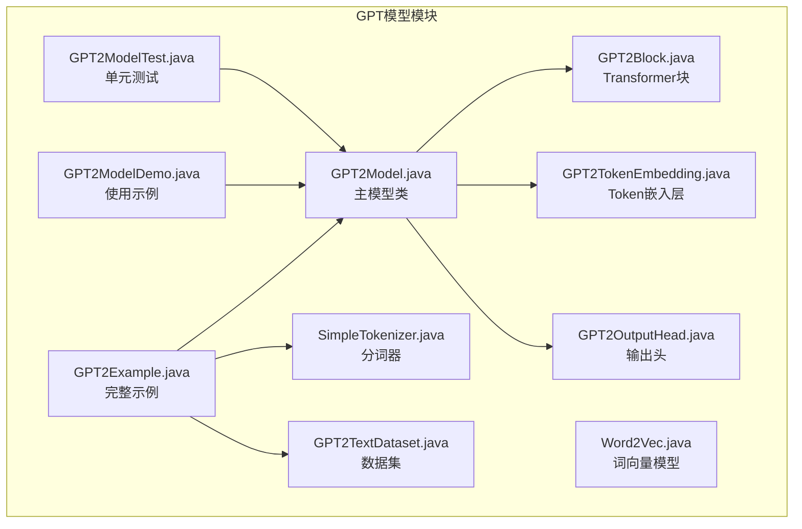
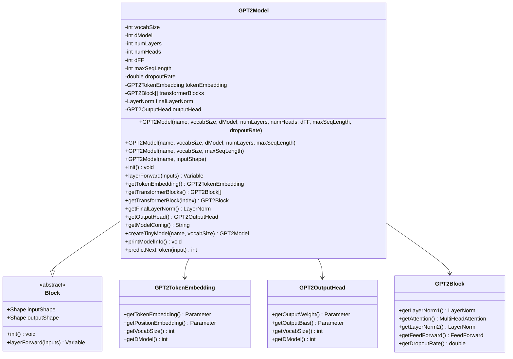
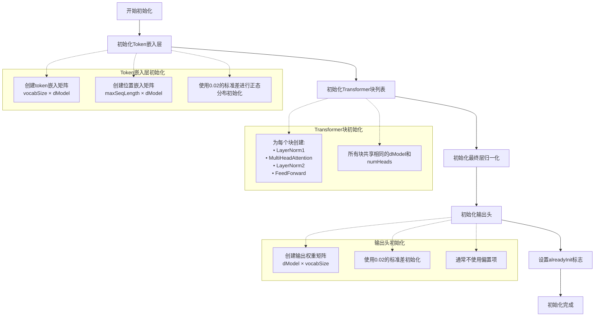
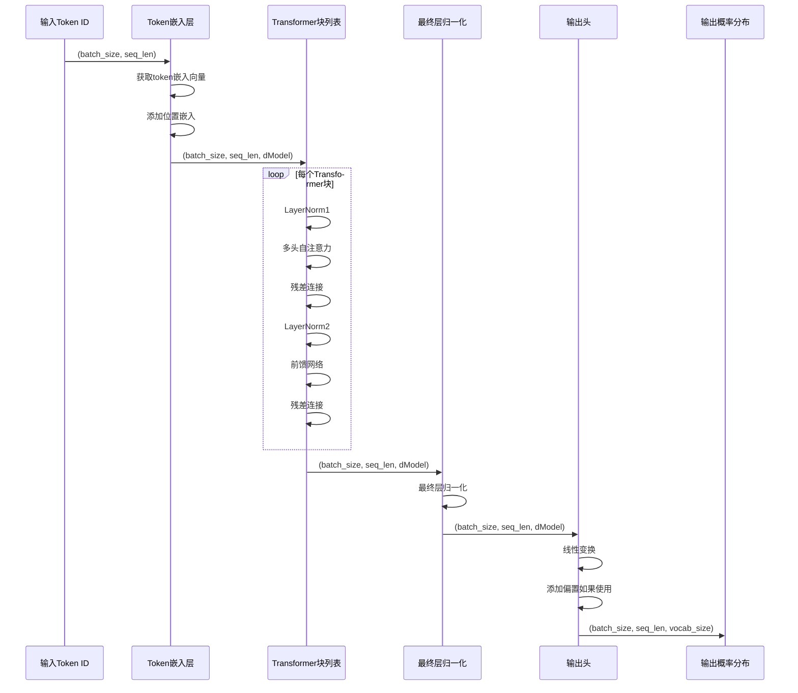
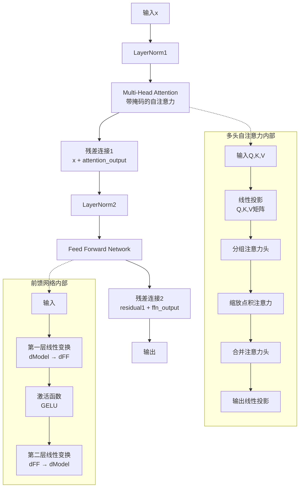
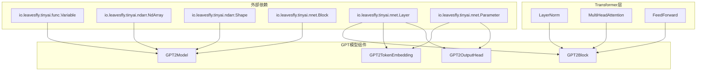

# GPT模型详细文档

<cite>
**本文档引用的文件**
- [GPT2Model.java](file://tinyai-model-gpt/src/main/java/io/leavesfly/tinyai/gpt/GPT2Model.java)
- [GPT2Block.java](file://tinyai-model-gpt/src/main/java/io/leavesfly/tinyai/gpt/GPT2Block.java)
- [GPT2TokenEmbedding.java](file://tinyai-model-gpt/src/main/java/io/leavesfly/tinyai/gpt/GPT2TokenEmbedding.java)
- [GPT2OutputHead.java](file://tinyai-model-gpt/src/main/java/io/leavesfly/tinyai/gpt/GPT2OutputHead.java)
- [GPT2ModelDemo.java](file://tinyai-model-gpt/src/main/java/io/leavesfly/tinyai/gpt/GPT2ModelDemo.java)
- [GPT2Example.java](file://tinyai-model-gpt/src/main/java/io/leavesfly/tinyai/gpt/GPT2Example.java)
- [SimpleTokenizer.java](file://tinyai-model-gpt/src/main/java/io/leavesfly/tinyai/gpt/SimpleTokenizer.java)
- [GPT2TextDataset.java](file://tinyai-model-gpt/src/main/java/io/leavesfly/tinyai/gpt/GPT2TextDataset.java)
- [GPT2ModelTest.java](file://tinyai-model-gpt/src/test/java/io/leavesfly/tinyai/gpt/GPT2ModelTest.java)
- [Word2Vec.java](file://tinyai-model-gpt/src/main/java/io/leavesfly/tinyai/gpt/Word2Vec.java)
</cite>

## 目录
1. [简介](#简介)
2. [项目结构](#项目结构)
3. [核心组件](#核心组件)
4. [架构概览](#架构概览)
5. [详细组件分析](#详细组件分析)
6. [依赖关系分析](#依赖关系分析)
7. [性能考虑](#性能考虑)
8. [故障排除指南](#故障排除指南)
9. [结论](#结论)

## 简介

GPT-2模型是一个基于Transformer架构的小规模语言模型实现，专为教育和研究目的而设计。该实现遵循GPT-2的语言模型设计理念，采用仅解码器架构，使用掩码多头自注意力机制防止未来信息泄露，并采用Pre-LayerNorm结构和残差连接。

GPT-2模型的核心特点包括：
- **仅解码器架构**：专注于自回归语言建模
- **掩码多头自注意力**：确保因果关系
- **Pre-LayerNorm结构**：在子层之前应用层归一化
- **残差连接**：促进梯度流动和训练稳定性

## 项目结构

GPT模型模块位于`tinyai-model-gpt`目录下，包含以下核心文件：



**图表来源**
- [GPT2Model.java](file://tinyai-model-gpt/src/main/java/io/leavesfly/tinyai/gpt/GPT2Model.java#L1-L403)
- [GPT2Block.java](file://tinyai-model-gpt/src/main/java/io/leavesfly/tinyai/gpt/GPT2Block.java#L1-L165)
- [GPT2TokenEmbedding.java](file://tinyai-model-gpt/src/main/java/io/leavesfly/tinyai/gpt/GPT2TokenEmbedding.java#L1-L233)

**章节来源**
- [GPT2Model.java](file://tinyai-model-gpt/src/main/java/io/leavesfly/tinyai/gpt/GPT2Model.java#L1-L403)
- [GPT2ModelDemo.java](file://tinyai-model-gpt/src/main/java/io/leavesfly/tinyai/gpt/GPT2ModelDemo.java#L1-L139)

## 核心组件

GPT2Model类是整个系统的核心，它继承自Block基类，实现了完整的GPT-2语言模型架构。该类包含了所有必要的超参数和模型组件：

### 主要超参数

- **vocabSize**: 词汇表大小，定义模型能够识别的不同token数量
- **dModel**: 模型维度，决定嵌入向量和隐藏层的大小
- **numLayers**: Transformer块的数量，控制模型深度
- **numHeads**: 注意力头的数量，影响并行处理能力
- **dFF**: 前馈网络隐藏维度，决定非线性变换的复杂度
- **maxSeqLength**: 最大序列长度，限制输入序列的最大长度
- **dropoutRate**: Dropout比率，用于正则化防止过拟合

### 模型组件

GPT2Model包含四个主要组件：
1. **Token嵌入层**：将token ID转换为高维向量表示
2. **Transformer块列表**：多个堆叠的Transformer解码器块
3. **最终层归一化**：对Transformer输出进行归一化
4. **输出头**：将隐藏状态映射到词汇表概率分布

**章节来源**
- [GPT2Model.java](file://tinyai-model-gpt/src/main/java/io/leavesfly/tinyai/gpt/GPT2Model.java#L25-L403)

## 架构概览

GPT-2模型采用经典的Transformer解码器架构，其整体结构如下：

```mermaid
graph TD
A[输入Token ID序列<br/>(batch_size, seq_len)] --> B[Token嵌入层<br/>+ 位置嵌入]
B --> C[Transformer块1]
C --> D[Transformer块2]
D --> E[...]
E --> F[Transformer块N]
F --> G[最终层归一化]
G --> H[输出头]
H --> I[词汇表概率分布<br/>(batch_size, seq_len, vocab_size)]
subgraph "Transformer块内部结构"
J[输入] --> K[LayerNorm1]
K --> L[多头自注意力]
L --> M[残差连接]
M --> N[LayerNorm2]
N --> O[前馈网络]
O --> P[残差连接]
P --> Q[输出]
end
```

**图表来源**
- [GPT2Model.java](file://tinyai-model-gpt/src/main/java/io/leavesfly/tinyai/gpt/GPT2Model.java#L155-L180)
- [GPT2Block.java](file://tinyai-model-gpt/src/main/java/io/leavesfly/tinyai/gpt/GPT2Block.java#L60-L85)

## 详细组件分析

### GPT2Model类分析

GPT2Model类是整个模型的核心，它提供了完整的模型生命周期管理：



**图表来源**
- [GPT2Model.java](file://tinyai-model-gpt/src/main/java/io/leavesfly/tinyai/gpt/GPT2Model.java#L25-L403)
- [GPT2TokenEmbedding.java](file://tinyai-model-gpt/src/main/java/io/leavesfly/tinyai/gpt/GPT2TokenEmbedding.java#L15-L233)
- [GPT2OutputHead.java](file://tinyai-model-gpt/src/main/java/io/leavesfly/tinyai/gpt/GPT2OutputHead.java#L15-L169)
- [GPT2Block.java](file://tinyai-model-gpt/src/main/java/io/leavesfly/tinyai/gpt/GPT2Block.java#L25-L165)

#### 构造函数重载体系

GPT2Model提供了多种构造函数重载，满足不同的使用场景：

1. **完整参数构造函数**：允许精确控制所有超参数
2. **默认参数构造函数**：使用合理默认值创建中等规模模型
3. **小型模型构造函数**：快速创建适合测试的小型模型
4. **兼容性构造函数**：保持与旧版本的兼容性

#### 初始化流程（init方法）

模型初始化过程按照以下步骤进行：



**图表来源**
- [GPT2Model.java](file://tinyai-model-gpt/src/main/java/io/leavesfly/tinyai/gpt/GPT2Model.java#L117-L155)
- [GPT2TokenEmbedding.java](file://tinyai-model-gpt/src/main/java/io/leavesfly/tinyai/gpt/GPT2TokenEmbedding.java#L50-L70)
- [GPT2OutputHead.java](file://tinyai-model-gpt/src/main/java/io/leavesfly/tinyai/gpt/GPT2OutputHead.java#L50-L70)

#### 前向传播（layerForward）数据流

前向传播过程遵循严格的顺序：



**图表来源**
- [GPT2Model.java](file://tinyai-model-gpt/src/main/java/io/leavesfly/tinyai/gpt/GPT2Model.java#L155-L180)

**章节来源**
- [GPT2Model.java](file://tinyai-model-gpt/src/main/java/io/leavesfly/tinyai/gpt/GPT2Model.java#L117-L180)

### GPT2Block类分析

GPT2Block实现了单个Transformer解码器块，包含以下关键组件：

#### Pre-LayerNorm结构

GPT-2采用Pre-LayerNorm架构，这是与原始Transformer的主要区别之一：



**图表来源**
- [GPT2Block.java](file://tinyai-model-gpt/src/main/java/io/leavesfly/tinyai/gpt/GPT2Block.java#L60-L85)

#### 残差连接和Dropout

每个子层后都应用了残差连接，确保梯度能够有效传播。同时，模型支持Dropout机制来防止过拟合。

**章节来源**
- [GPT2Block.java](file://tinyai-model-gpt/src/main/java/io/leavesfly/tinyai/gpt/GPT2Block.java#L25-L165)

### GPT2TokenEmbedding类分析

Token嵌入层负责将离散的token ID转换为连续的向量表示：

```mermaid
flowchart TD
A[输入Token ID<br/>(batch_size, seq_len)] --> B{检查序列长度}
B --> |超过maxSeqLength| C[抛出异常]
B --> |正常| D[获取Token嵌入]
D --> E[复制对应嵌入向量]
E --> F{使用位置嵌入?}
F --> |是| G[添加位置嵌入]
F --> |否| H[直接输出]
G --> I[应用Dropout]
H --> I
I --> J[输出嵌入向量<br/>(batch_size, seq_len, dModel)]
subgraph "Token嵌入矩阵"
K[vocabSize × dModel<br/>随机初始化<br/>标准差0.02]
end
subgraph "位置嵌入矩阵"
L[maxSeqLength × dModel<br/>随机初始化<br/>标准差0.02]
end
D -.-> K
G -.-> L
```

**图表来源**
- [GPT2TokenEmbedding.java](file://tinyai-model-gpt/src/main/java/io/leavesfly/tinyai/gpt/GPT2TokenEmbedding.java#L75-L120)

**章节来源**
- [GPT2TokenEmbedding.java](file://tinyai-model-gpt/src/main/java/io/leavesfly/tinyai/gpt/GPT2TokenEmbedding.java#L15-L233)

### GPT2OutputHead类分析

输出头将Transformer的隐藏状态转换为词汇表上的概率分布：

```mermaid
flowchart TD
A[输入隐藏状态<br/>(batch_size, seq_len, dModel)] --> B[重塑为二维矩阵<br/>(batch_size × seq_len, dModel)]
B --> C[线性变换<br/>输入 @ 权重矩阵]
C --> D{使用偏置?}
D --> |是| E[添加偏置项]
D --> |否| F[直接输出]
E --> G[重塑回三维张量<br/>(batch_size, seq_len, vocab_size)]
F --> G
G --> H[输出logits<br/>(batch_size, seq_len, vocab_size)]
subgraph "权重矩阵初始化"
I[dModel × vocabSize<br/>标准差0.02的随机初始化]
end
subgraph "偏置项初始化"
J[vocab_size<br/>全零初始化]
end
C -.-> I
E -.-> J
```

**图表来源**
- [GPT2OutputHead.java](file://tinyai-model-gpt/src/main/java/io/leavesfly/tinyai/gpt/GPT2OutputHead.java#L70-L100)

**章节来源**
- [GPT2OutputHead.java](file://tinyai-model-gpt/src/main/java/io/leavesfly/tinyai/gpt/GPT2OutputHead.java#L15-L169)

## 依赖关系分析

GPT模型模块具有清晰的依赖层次结构：



**图表来源**
- [GPT2Model.java](file://tinyai-model-gpt/src/main/java/io/leavesfly/tinyai/gpt/GPT2Model.java#L1-L15)
- [GPT2Block.java](file://tinyai-model-gpt/src/main/java/io/leavesfly/tinyai/gpt/GPT2Block.java#L1-L15)

**章节来源**
- [GPT2Model.java](file://tinyai-model-gpt/src/main/java/io/leavesfly/tinyai/gpt/GPT2Model.java#L1-L15)
- [GPT2Block.java](file://tinyai-model-gpt/src/main/java/io/leavesfly/tinyai/gpt/GPT2Block.java#L1-L15)

## 性能考虑

### 内存使用分析

GPT-2模型的内存使用主要由以下几个部分组成：

1. **Token嵌入层**：`vocabSize × dModel` 参数
2. **位置嵌入层**：`maxSeqLength × dModel` 参数
3. **Transformer块**：每个块包含多个子层参数
4. **输出头**：`dModel × vocabSize` 参数

### 计算复杂度

- **前向传播复杂度**：O(batch_size × seq_len × vocab_size × d_model)
- **训练复杂度**：与前向传播相似，但需要额外的反向传播计算
- **推理复杂度**：对于自回归生成，复杂度为 O(seq_len × vocab_size × d_model)

### 优化建议

1. **批处理**：使用较大的批次大小可以提高GPU利用率
2. **序列长度优化**：根据实际需求调整maxSeqLength
3. **模型尺寸平衡**：在性能和准确性之间找到最佳平衡点
4. **硬件加速**：利用GPU进行大规模并行计算

## 故障排除指南

### 常见问题及解决方案

#### 1. 序列长度超出限制

**错误信息**：`IllegalArgumentException: 输入序列长度 X 超过最大长度 Y`

**解决方案**：
- 检查输入序列长度是否超过maxSeqLength
- 调整maxSeqLength参数或截断输入序列
- 使用padding策略处理变长序列

#### 2. 词汇表ID越界

**错误信息**：`IllegalArgumentException: Token ID Z is out of vocabulary range [0, W)`

**解决方案**：
- 确保token ID在有效范围内
- 检查分词器配置和词汇表构建
- 验证输入数据预处理流程

#### 3. 内存不足

**错误信息**：`OutOfMemoryError`

**解决方案**：
- 减少批次大小
- 降低模型维度或层数
- 使用梯度累积技术
- 启用混合精度训练

**章节来源**
- [GPT2Model.java](file://tinyai-model-gpt/src/main/java/io/leavesfly/tinyai/gpt/GPT2Model.java#L160-L170)
- [GPT2TokenEmbedding.java](file://tinyai-model-gpt/src/main/java/io/leavesfly/tinyai/gpt/GPT2TokenEmbedding.java#L85-L95)

## 结论

GPT-2模型实现展现了现代Transformer架构的核心设计理念。通过精心设计的组件结构和清晰的接口定义，该实现不仅具有良好的可读性和可维护性，还为学习和研究提供了宝贵的参考。

### 主要优势

1. **模块化设计**：清晰的组件分离便于理解和扩展
2. **灵活的配置**：多种构造函数满足不同使用场景
3. **完整的功能**：从前向传播到参数统计的全套功能
4. **教育价值**：简洁的实现有助于理解GPT原理

### 适用场景

- **教学和学习**：帮助理解GPT模型的工作原理
- **原型开发**：快速搭建语言模型原型
- **研究实验**：作为各种NLP任务的基础模型
- **性能基准**：与其他模型进行性能对比

### 发展方向

未来的改进可能包括：
- 支持更多的模型变体（如GPT-3）
- 优化内存使用和计算效率
- 增加更多预训练模型的支持
- 改进训练和推理性能

这个GPT-2模型实现为开发者提供了一个坚实的基础，既适合学术研究也适合实际应用开发。通过深入理解其实现细节，开发者可以更好地掌握现代语言模型的核心技术。