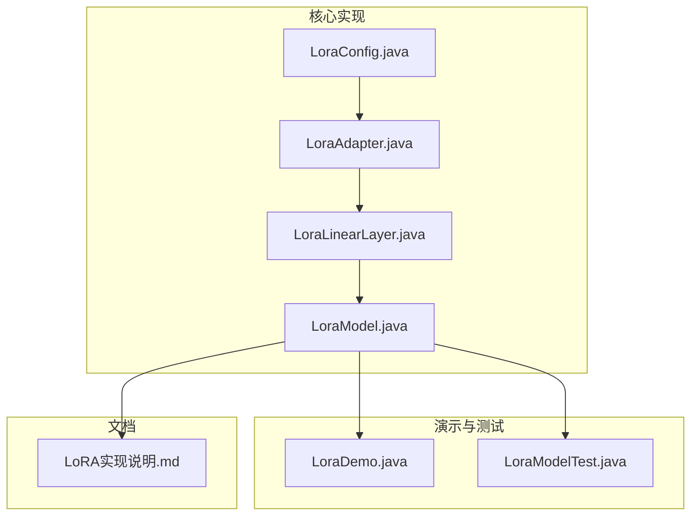
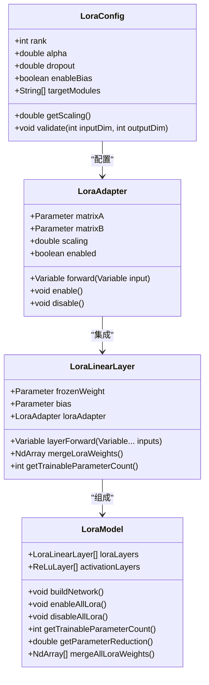
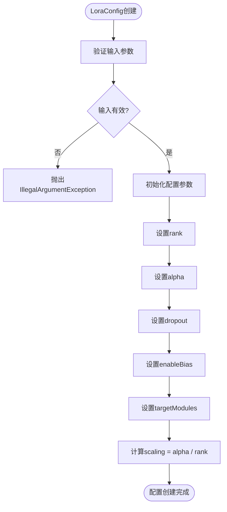
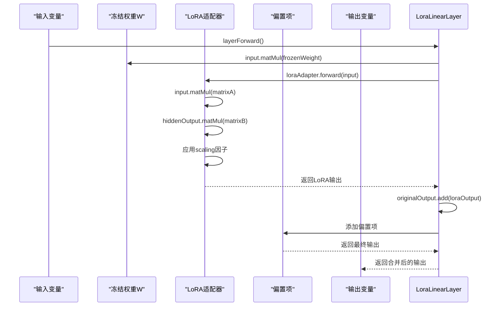
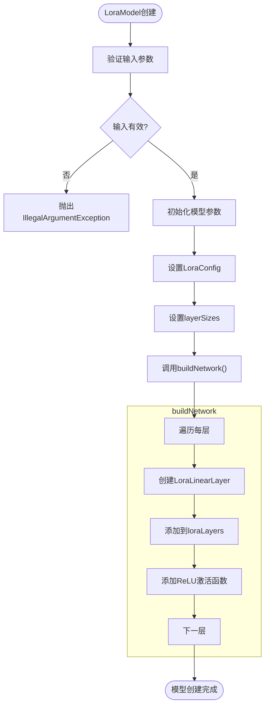
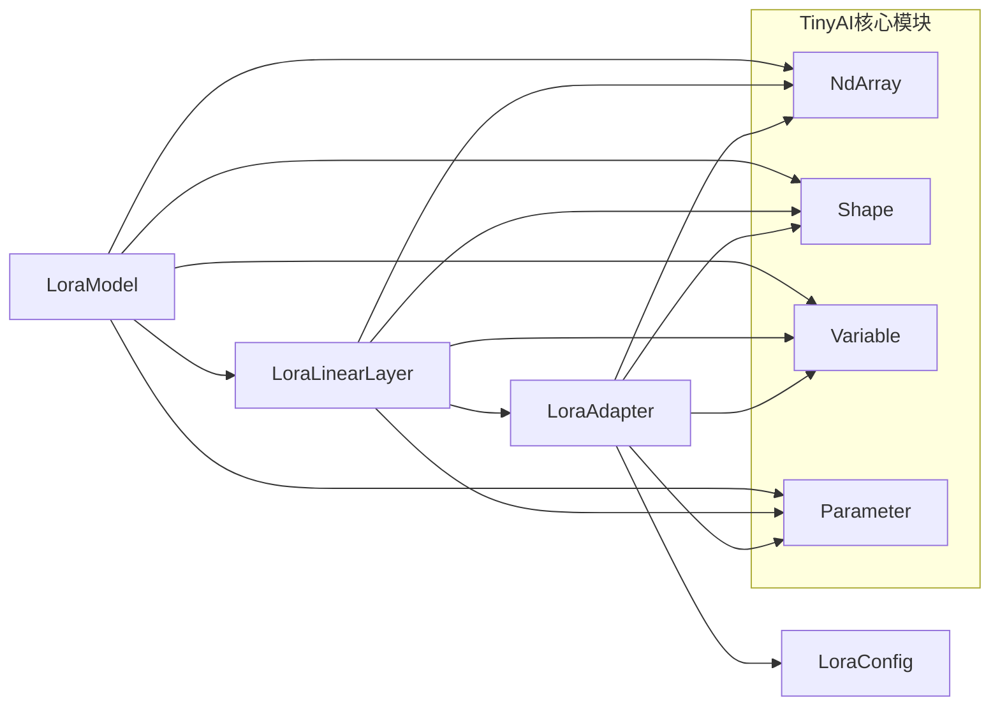

# LoRA模型

<cite>
**本文档引用的文件**
- [LoraModel.java](file://tinyai-model-lora/src/main/java/io/leavesfly/tinyai/lora/LoraModel.java)
- [LoraConfig.java](file://tinyai-model-lora/src/main/java/io/leavesfly/tinyai/lora/LoraConfig.java)
- [LoraLinearLayer.java](file://tinyai-model-lora/src/main/java/io/leavesfly/tinyai/lora/LoraLinearLayer.java)
- [LoraAdapter.java](file://tinyai-model-lora/src/main/java/io/leavesfly/tinyai/lora/LoraAdapter.java)
- [LoraDemo.java](file://tinyai-model-lora/src/main/java/io/leavesfly/tinyai/lora/LoraDemo.java)
- [LoRA实现说明.md](file://tinyai-model-lora/doc/LoRA实现说明.md)
</cite>

## 目录
1. [简介](#简介)
2. [项目结构](#项目结构)
3. [核心组件](#核心组件)
4. [架构概述](#架构概述)
5. [详细组件分析](#详细组件分析)
6. [依赖分析](#依赖分析)
7. [性能考量](#性能考量)
8. [故障排除指南](#故障排除指南)
9. [结论](#结论)

## 简介
LoRA（Low-Rank Adaptation）是一种高效的参数微调技术，通过低秩矩阵分解大幅减少可训练参数数量，同时保持模型性能。本项目基于TinyAI深度学习框架实现了完整的LoRA微调技术，提供了从配置管理到模型构建的全栈实现。

## 项目结构
LoRA模型的实现位于`tinyai-model-lora`模块中，包含核心实现文件和测试文件。

**Diagram sources**
- [LoraModel.java](file://tinyai-model-lora/src/main/java/io/leavesfly/tinyai/lora/LoraModel.java)
- [LoraConfig.java](file://tinyai-model-lora/src/main/java/io/leavesfly/tinyai/lora/LoraConfig.java)
- [LoraLinearLayer.java](file://tinyai-model-lora/src/main/java/io/leavesfly/tinyai/lora/LoraLinearLayer.java)
- [LoraAdapter.java](file://tinyai-model-lora/src/main/java/io/leavesfly/tinyai/lora/LoraAdapter.java)

**Section sources**
- [LoraModel.java](file://tinyai-model-lora/src/main/java/io/leavesfly/tinyai/lora/LoraModel.java)
- [LoraConfig.java](file://tinyai-model-lora/src/main/java/io/leavesfly/tinyai/lora/LoraConfig.java)

## 核心组件
LoRA模型的核心组件包括LoraConfig、LoraAdapter、LoraLinearLayer和LoraModel。这些组件共同实现了LoRA微调技术的核心功能。

**Section sources**
- [LoraConfig.java](file://tinyai-model-lora/src/main/java/io/leavesfly/tinyai/lora/LoraConfig.java#L1-L263)
- [LoraAdapter.java](file://tinyai-model-lora/src/main/java/io/leavesfly/tinyai/lora/LoraAdapter.java#L1-L201)
- [LoraLinearLayer.java](file://tinyai-model-lora/src/main/java/io/leavesfly/tinyai/lora/LoraLinearLayer.java#L1-L354)
- [LoraModel.java](file://tinyai-model-lora/src/main/java/io/leavesfly/tinyai/lora/LoraModel.java#L1-L376)

## 架构概述
LoRA模型的架构基于低秩矩阵分解，将原始权重矩阵W分解为W + A × B × scaling，其中A和B是可训练的低秩矩阵。

**Diagram sources**
- [LoraConfig.java](file://tinyai-model-lora/src/main/java/io/leavesfly/tinyai/lora/LoraConfig.java#L1-L263)
- [LoraAdapter.java](file://tinyai-model-lora/src/main/java/io/leavesfly/tinyai/lora/LoraAdapter.java#L1-L201)
- [LoraLinearLayer.java](file://tinyai-model-lora/src/main/java/io/leavesfly/tinyai/lora/LoraLinearLayer.java#L1-L354)
- [LoraModel.java](file://tinyai-model-lora/src/main/java/io/leavesfly/tinyai/lora/LoraModel.java#L1-L376)

## 详细组件分析

### LoraConfig分析
LoraConfig类管理LoRA微调的所有超参数，包括降秩维度（rank）、缩放因子（alpha）、dropout率等。

**Diagram sources**
- [LoraConfig.java](file://tinyai-model-lora/src/main/java/io/leavesfly/tinyai/lora/LoraConfig.java#L1-L263)

**Section sources**
- [LoraConfig.java](file://tinyai-model-lora/src/main/java/io/leavesfly/tinyai/lora/LoraConfig.java#L1-L263)

### LoraLinearLayer分析
LoraLinearLayer类集成了LoRA适配器的线性层，实现了LoRA微调的核心思想。

**Diagram sources**
- [LoraLinearLayer.java](file://tinyai-model-lora/src/main/java/io/leavesfly/tinyai/lora/LoraLinearLayer.java#L1-L354)

**Section sources**
- [LoraLinearLayer.java](file://tinyai-model-lora/src/main/java/io/leavesfly/tinyai/lora/LoraLinearLayer.java#L1-L354)

### LoraModel分析
LoraModel类展示了完整的LoRA微调流程，支持多层神经网络和预训练模型微调。

**Diagram sources**
- [LoraModel.java](file://tinyai-model-lora/src/main/java/io/leavesfly/tinyai/lora/LoraModel.java#L1-L376)

**Section sources**
- [LoraModel.java](file://tinyai-model-lora/src/main/java/io/leavesfly/tinyai/lora/LoraModel.java#L1-L376)

## 依赖分析
LoRA模型依赖于TinyAI框架的多个核心组件，包括ndarr、nnet和func模块。

**Diagram sources**
- [LoraModel.java](file://tinyai-model-lora/src/main/java/io/leavesfly/tinyai/lora/LoraModel.java#L1-L376)
- [LoraLinearLayer.java](file://tinyai-model-lora/src/main/java/io/leavesfly/tinyai/lora/LoraLinearLayer.java#L1-L354)
- [LoraAdapter.java](file://tinyai-model-lora/src/main/java/io/leavesfly/tinyai/lora/LoraAdapter.java#L1-L201)

**Section sources**
- [LoraModel.java](file://tinyai-model-lora/src/main/java/io/leavesfly/tinyai/lora/LoraModel.java#L1-L376)
- [LoraLinearLayer.java](file://tinyai-model-lora/src/main/java/io/leavesfly/tinyai/lora/LoraLinearLayer.java#L1-L354)
- [LoraAdapter.java](file://tinyai-model-lora/src/main/java/io/leavesfly/tinyai/lora/LoraAdapter.java#L1-L201)

## 性能考量
LoRA模型通过低秩矩阵分解大幅减少可训练参数数量，同时保持模型性能。

| Rank | LoRA参数 | 参数减少率 | 计算开销比 |
|------|----------|------------|------------|
| 4    | 8,192    | 99.22%     | 0.0078x    |
| 8    | 16,384   | 98.44%     | 0.0156x    |
| 16   | 32,768   | 96.88%     | 0.0312x    |
| 32   | 65,536   | 93.75%     | 0.0625x    |
| 64   | 131,072  | 87.50%     | 0.1250x    |

**Section sources**
- [LoRA实现说明.md](file://tinyai-model-lora/doc/LoRA实现说明.md#L1-L215)

## 故障排除指南
在使用LoRA模型时，可能会遇到一些常见问题，以下是一些解决方案。

**Section sources**
- [LoraModelTest.java](file://tinyai-model-lora/src/test/java/io/leavesfly/tinyai/lora/LoraModelTest.java#L1-L326)
- [LoraConfigTest.java](file://tinyai-model-lora/src/test/java/io/leavesfly/tinyai/lora/LoraConfigTest.java#L1-L184)

## 结论
本LoRA实现提供了完整的参数高效微调解决方案，具有以下优势：
1. **参数效率**: 95%+的参数减少
2. **灵活性**: 支持动态开关和权重冻结
3. **兼容性**: 与TinyAI框架完全集成
4. **易用性**: 提供简洁的API设计
5. **可扩展性**: 支持各种定制需求