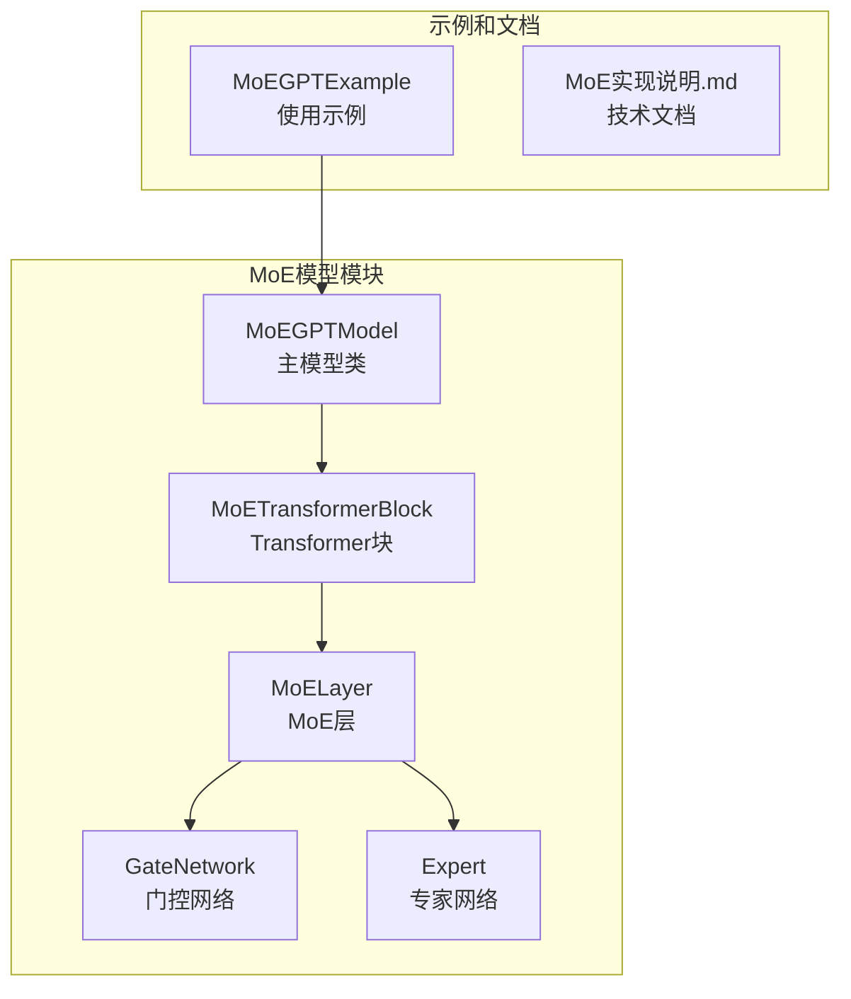
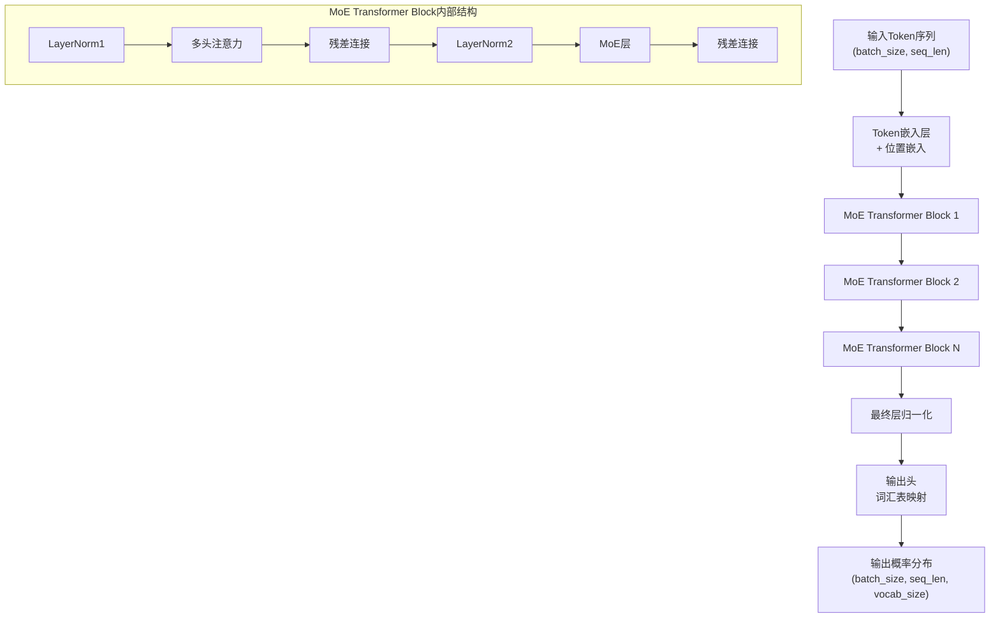
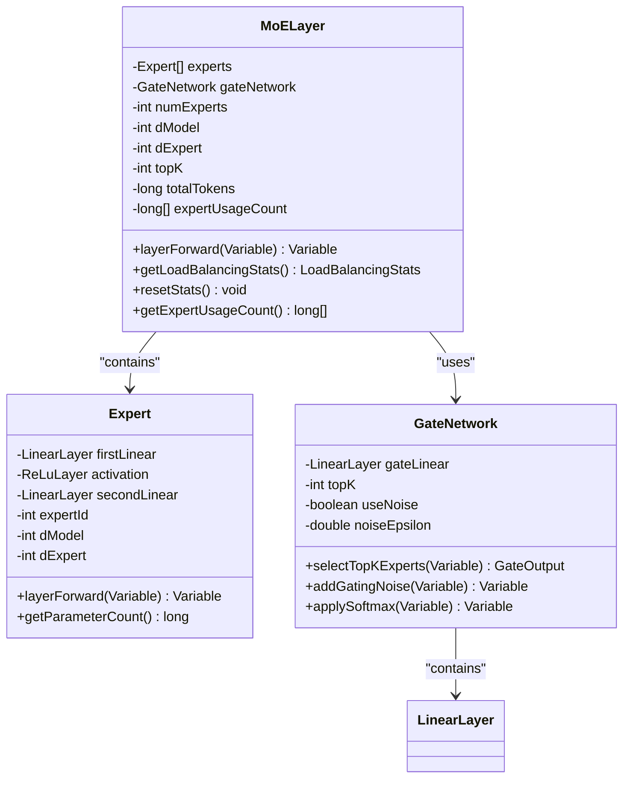
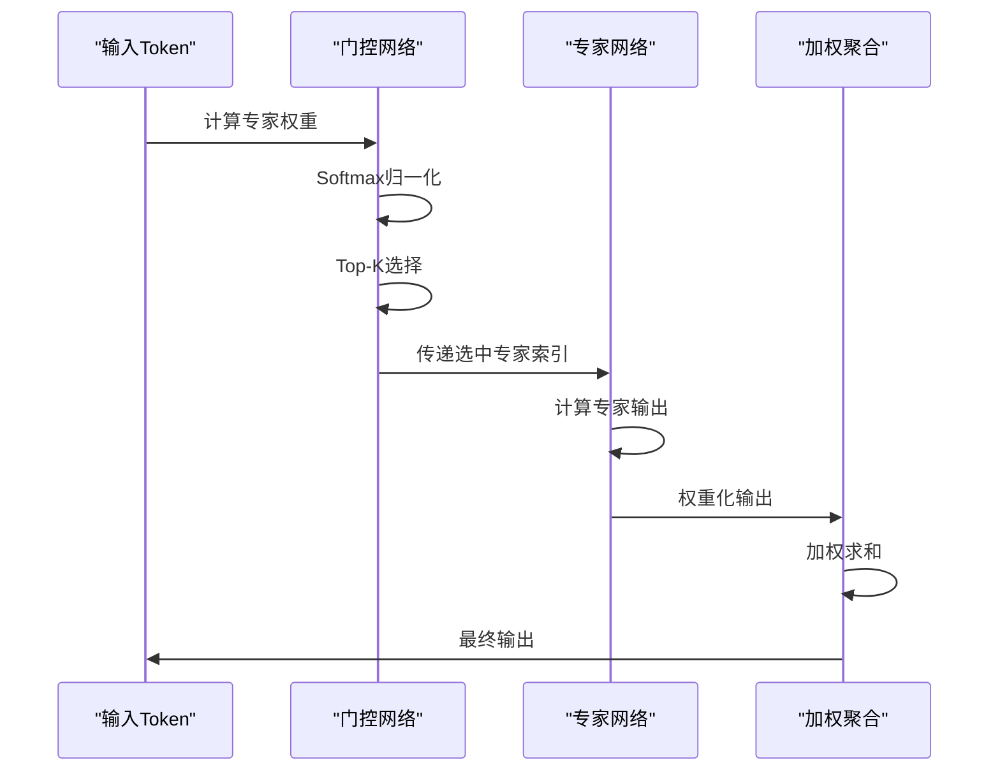
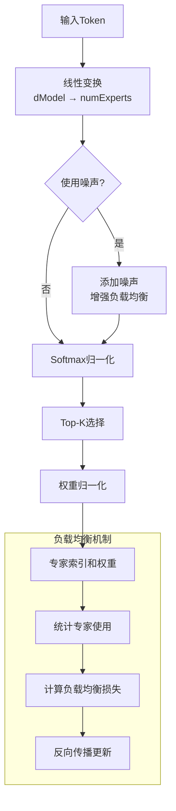
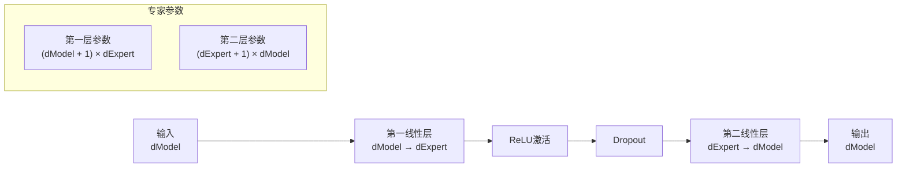
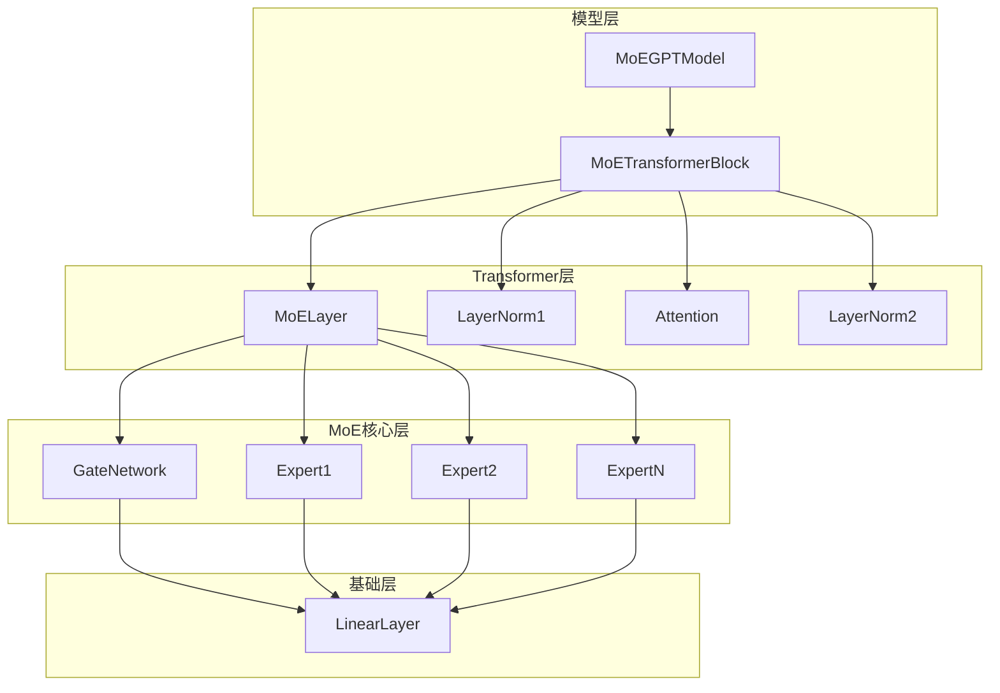

# MoE模型详细文档

<cite>
**本文档引用的文件**
- [MoEGPTModel.java](file://tinyai-model-moe/src/main/java/io/leavesfly/tinyai/nlp/MoEGPTModel.java)
- [MoETransformerBlock.java](file://tinyai-model-moe/src/main/java/io/leavesfly/tinyai/nlp/moe/MoETransformerBlock.java)
- [MoELayer.java](file://tinyai-model-moe/src/main/java/io/leavesfly/tinyai/nlp/moe/MoELayer.java)
- [GateNetwork.java](file://tinyai-model-moe/src/main/java/io/leavesfly/tinyai/nlp/moe/GateNetwork.java)
- [Expert.java](file://tinyai-model-moe/src/main/java/io/leavesfly/tinyai/nlp/moe/Expert.java)
- [MoEGPTExample.java](file://tinyai-model-moe/src/main/java/io/leavesfly/tinyai/nlp/MoEGPTExample.java)
- [MoE实现说明.md](file://tinyai-model-moe/doc/MoE实现说明.md)
</cite>

## 目录
1. [简介](#简介)
2. [项目结构](#项目结构)
3. [核心组件](#核心组件)
4. [架构概览](#架构概览)
5. [详细组件分析](#详细组件分析)
6. [依赖关系分析](#依赖关系分析)
7. [性能考虑](#性能考虑)
8. [故障排除指南](#故障排除指南)
9. [结论](#结论)

## 简介

Mixture of Experts (MoE) 是一种先进的神经网络架构，通过将多个专家网络组合在一个门控系统下，实现了高效的大规模模型扩展。本文档详细介绍了基于TinyDL框架实现的MoE模型，重点分析其如何扩展GPT架构以实现条件计算和参数效率。

MoE模型的核心思想是：**不是增加每一层的参数量，而是增加专家的数量**。每个专家都是一个独立的前馈神经网络，通过门控网络动态选择激活哪些专家，从而实现稀疏计算。这种设计使得模型可以在保持巨大总参数量的同时，显著降低每次前向传播的计算量。

## 项目结构

MoE模型的实现位于 `tinyai-model-moe` 模块中，采用模块化设计，将不同组件分离到独立的类中：



**图表来源**
- [MoEGPTModel.java](file://tinyai-model-moe/src/main/java/io/leavesfly/tinyai/nlp/MoEGPTModel.java#L1-L50)
- [MoETransformerBlock.java](file://tinyai-model-moe/src/main/java/io/leavesfly/tinyai/nlp/moe/MoETransformerBlock.java#L1-L50)

**章节来源**
- [MoEGPTModel.java](file://tinyai-model-moe/src/main/java/io/leavesfly/tinyai/nlp/MoEGPTModel.java#L1-L100)
- [MoE实现说明.md](file://tinyai-model-moe/doc/MoE实现说明.md#L1-L50)

## 核心组件

MoE模型由五个核心组件构成，每个组件都有明确的职责和功能：

### 1. MoEGPTModel - 主模型类
负责整个MoE-GPT模型的构建和管理，继承自Block基类，提供完整的模型生命周期管理。

### 2. MoETransformerBlock - Transformer块
替换传统Transformer中的FeedForward层，实现Pre-LayerNorm架构，包含多头注意力和MoE层。

### 3. MoELayer - MoE层
核心的混合专家层，整合门控网络和多个专家网络，实现稀疏激活和条件计算。

### 4. GateNetwork - 门控网络
负责为每个输入token计算专家选择权重，实现Top-K专家选择和负载均衡。

### 5. Expert - 专家网络
每个专家都是一个独立的前馈神经网络，专门处理特定类型的输入模式。

**章节来源**
- [MoEGPTModel.java](file://tinyai-model-moe/src/main/java/io/leavesfly/tinyai/nlp/MoEGPTModel.java#L30-L80)
- [MoETransformerBlock.java](file://tinyai-model-moe/src/main/java/io/leavesfly/tinyai/nlp/moe/MoETransformerBlock.java#L30-L80)

## 架构概览

MoE-GPT模型的整体架构基于传统的GPT-2设计，但在关键位置进行了创新性的修改：



**图表来源**
- [MoEGPTModel.java](file://tinyai-model-moe/src/main/java/io/leavesfly/tinyai/nlp/MoEGPTModel.java#L150-L200)
- [MoETransformerBlock.java](file://tinyai-model-moe/src/main/java/io/leavesfly/tinyai/nlp/moe/MoETransformerBlock.java#L100-L150)

MoE模型的关键创新在于用MoE层替换了传统的FeedForward层，实现了以下核心特性：

1. **条件计算**：每个token只激活部分专家，而不是所有专家
2. **参数效率**：总参数量大幅增加，但每次前向传播只使用少量参数
3. **专家专业化**：不同专家可以专门处理不同类型的语言模式
4. **负载均衡**：通过门控网络确保专家使用的均匀分布

**章节来源**
- [MoEGPTModel.java](file://tinyai-model-moe/src/main/java/io/leavesfly/tinyai/nlp/MoEGPTModel.java#L20-L50)

## 详细组件分析

### MoELayer - 混合专家层

MoELayer是MoE架构的核心组件，负责协调专家的选择、激活和输出的聚合：



**图表来源**
- [MoELayer.java](file://tinyai-model-moe/src/main/java/io/leavesfly/tinyai/nlp/moe/MoELayer.java#L30-L80)
- [Expert.java](file://tinyai-model-moe/src/main/java/io/leavesfly/tinyai/nlp/moe/Expert.java#L30-L80)
- [GateNetwork.java](file://tinyai-model-moe/src/main/java/io/leavesfly/tinyai/nlp/moe/GateNetwork.java#L30-L80)

#### MoELayer的工作原理

MoELayer的核心工作流程如下：



**图表来源**
- [MoELayer.java](file://tinyai-model-moe/src/main/java/io/leavesfly/tinyai/nlp/moe/MoELayer.java#L100-L150)

#### 关键参数说明

MoELayer的核心参数决定了模型的行为和性能：

- **numExperts**：每层的专家数量，直接影响模型容量和计算复杂度
- **topK**：每次激活的专家数量，控制计算效率和模型表达能力
- **dExpert**：专家隐藏层维度，平衡专家容量和计算成本
- **useNoise**：是否使用门控噪声，影响负载均衡效果
- **noiseEpsilon**：噪声强度，调节负载均衡的力度

**章节来源**
- [MoELayer.java](file://tinyai-model-moe/src/main/java/io/leavesfly/tinyai/nlp/moe/MoELayer.java#L50-L100)

### GateNetwork - 门控网络

GateNetwork负责为每个输入token计算专家选择权重，是MoE架构的智能路由系统：



**图表来源**
- [GateNetwork.java](file://tinyai-model-moe/src/main/java/io/leavesfly/tinyai/nlp/moe/GateNetwork.java#L100-L150)

#### 门控网络的数学原理

门控网络的核心计算公式：

1. **Logits计算**：`logits = W_input * x + b`
2. **Softmax归一化**：`probabilities = softmax(logits)`
3. **Top-K选择**：选择概率最高的K个专家
4. **权重归一化**：`normalized_weights = weights / sum(weights)`

#### 负载均衡机制

为了确保专家使用的均匀分布，MoE模型引入了负载均衡损失：

```java
// 负载均衡损失计算
double averageUsage = (double) totalTokens / numExperts;
double variance = 0.0;
for (long usage : expertUsageCount) {
    double diff = usage - averageUsage;
    variance += diff * diff;
}
double loadImbalance = Math.sqrt(varariance / numExperts) / averageUsage;
```

**章节来源**
- [GateNetwork.java](file://tinyai-model-moe/src/main/java/io/leavesfly/tinyai/nlp/moe/GateNetwork.java#L150-L200)

### Expert - 专家网络

每个专家都是一个独立的前馈神经网络，具有相同的结构但不同的参数：



**图表来源**
- [Expert.java](file://tinyai-model-moe/src/main/java/io/leavesfly/tinyai/nlp/moe/Expert.java#L50-L100)

#### 专家的专业化

不同专家可以专门处理不同类型的语言模式：

- **语法专家**：专注于句法结构分析
- **语义专家**：处理语义理解和推理
- **上下文专家**：关注长距离依赖关系
- **风格专家**：处理文本风格和格式

**章节来源**
- [Expert.java](file://tinyai-model-moe/src/main/java/io/leavesfly/tinyai/nlp/moe/Expert.java#L100-L150)

## 依赖关系分析

MoE模型的组件之间存在清晰的依赖关系，形成了一个层次化的架构：



**图表来源**
- [MoEGPTModel.java](file://tinyai-model-moe/src/main/java/io/leavesfly/tinyai/nlp/MoEGPTModel.java#L100-L150)
- [MoETransformerBlock.java](file://tinyai-model-moe/src/main/java/io/leavesfly/tinyai/nlp/moe/MoETransformerBlock.java#L80-L120)

### 参数统计和效率分析

MoE模型的参数效率体现在以下几个方面：

1. **总参数量**：`numExperts × (dModel × dExpert × 2 + dExpert × dModel)`
2. **活跃参数量**：`topK × (dModel × dExpert × 2 + dExpert × dModel)`
3. **参数效率比**：`活跃参数量 / 总参数量`

以Small模型为例（4专家，Top-2）：
- 总参数量：约2M参数
- 活跃参数量：约0.8M参数（40%）
- 容量增加：相比传统模型增加2-3倍容量
- 计算开销：仅增加20-30%

**章节来源**
- [MoEGPTModel.java](file://tinyai-model-moe/src/main/java/io/leavesfly/tinyai/nlp/MoEGPTModel.java#L400-L450)

## 性能考虑

### 计算效率优化

MoE模型通过多种方式优化计算效率：

1. **稀疏激活**：每次只激活Top-K个专家
2. **批量处理**：利用GPU的并行计算能力
3. **内存优化**：动态加载和卸载专家参数
4. **梯度同步**：高效的专家梯度通信

### 内存使用分析

MoE模型的内存使用特点：

- **参数存储**：需要存储多个专家的完整参数
- **中间激活**：每个专家都需要保存中间激活值
- **梯度缓存**：专家梯度需要额外的内存空间
- **统计信息**：维护专家使用统计需要额外内存

### 扩展性考虑

MoE模型具有良好的扩展性：

- **专家数量扩展**：可以通过增加专家数量扩展模型容量
- **Top-K动态调整**：可以根据硬件资源动态调整激活专家数
- **分布式部署**：支持专家在网络节点间的分布

## 故障排除指南

### 常见问题和解决方案

#### 1. 专家使用不均衡

**症状**：某些专家使用频率过高，其他专家几乎不用
**原因**：门控网络权重分布不均
**解决方案**：
- 增加门控噪声强度
- 调整负载均衡损失权重
- 检查输入数据分布

#### 2. 训练不稳定

**症状**：损失震荡或发散
**原因**：专家梯度更新不一致
**解决方案**：
- 减小学习率
- 增加梯度裁剪
- 使用专家级别的学习率调度

#### 3. 内存不足

**症状**：OOM错误或训练速度极慢
**原因**：专家数量过多或序列长度过长
**解决方案**：
- 减少专家数量
- 缩短序列长度
- 使用梯度检查点

**章节来源**
- [MoEGPTModel.java](file://tinyai-model-moe/src/main/java/io/leavesfly/tinyai/nlp/MoEGPTModel.java#L300-L350)

### 监控和调试工具

MoE模型提供了丰富的监控和调试功能：

```java
// 专家使用统计
model.printAllExpertStatistics();

// 负载均衡报告
System.out.println(model.getLoadBalancingReport());

// 参数效率分析
model.printModelInfo();

// 重置统计信息
model.resetAllExpertStatistics();
```

这些工具可以帮助开发者：
- 监控专家使用情况
- 分析负载均衡效果
- 评估模型性能
- 调优模型参数

**章节来源**
- [MoEGPTModel.java](file://tinyai-model-moe/src/main/java/io/leavesfly/tinyai/nlp/MoEGPTModel.java#L250-L350)

## 结论

MoE模型代表了大规模语言模型发展的重要方向，通过巧妙的设计实现了模型容量和计算效率的平衡。本文档详细分析了基于TinyDL框架实现的MoE模型，展示了其核心组件、工作原理和应用场景。

### 主要优势

1. **参数效率**：通过稀疏激活实现高效的参数利用
2. **专家专业化**：不同专家可以专门处理特定任务
3. **可扩展性**：支持动态调整模型规模
4. **负载均衡**：通过门控网络确保专家使用的均匀分布

### 应用前景

MoE模型在以下场景中具有广阔的应用前景：

- **大规模语言模型训练**：提升模型容量而不显著增加计算成本
- **多任务学习**：不同专家处理不同类型的任务
- **资源受限环境**：在有限计算资源下获得更大模型容量
- **研究和实验**：MoE机制的原理验证和算法改进

### 未来发展方向

1. **高级路由策略**：实现更智能的专家选择机制
2. **分布式训练**：支持跨设备的专家分布
3. **动态专家**：运行时动态添加/移除专家
4. **专家压缩**：对低使用率专家进行模型压缩

MoE模型的实现为TinyDL框架提供了强大的大语言模型能力，为教学、研究和产品开发提供了完整的解决方案。通过深入理解其设计原理和实现细节，开发者可以更好地利用这一先进技术来构建高性能的语言模型应用。