# 模型实现

<cite>
**本文档引用的文件**
- [GPT2Model.java](file://tinyai-model-gpt/src/main/java/io/leavesfly/tinyai/gpt2/GPT2Model.java)
- [GPT2Block.java](file://tinyai-model-gpt/src/main/java/io/leavesfly/tinyai/gpt2/GPT2Block.java)
- [DeepSeekV3Model.java](file://tinyai-model-deepseek/src/main/java/io/leavesfly/tinyai/deepseek/v3/DeepSeekV3Model.java)
- [DeepSeekV3Block.java](file://tinyai-model-deepseek/src/main/java/io/leavesfly/tinyai/deepseek/v3/DeepSeekV3Block.java)
- [LoraModel.java](file://tinyai-model-lora/src/main/java/io/leavesfly/tinyai/lora/LoraModel.java)
- [LoraAdapter.java](file://tinyai-model-lora/src/main/java/io/leavesfly/tinyai/lora/LoraAdapter.java)
- [MoEGPTModel.java](file://tinyai-model-moe/src/main/java/io/leavesfly/tinyai/nlp/MoEGPTModel.java)
- [GPT2Example.java](file://tinyai-model-gpt/src/main/java/io/leavesfly/tinyai/gpt2/GPT2Example.java)
- [DeepSeekV3Demo.java](file://tinyai-model-deepseek/src/main/java/io/leavesfly/tinyai/deepseek/v3/DeepSeekV3Demo.java)
- [LoRA实现说明.md](file://tinyai-model-lora/doc/LoRA实现说明.md)
- [MoE实现说明.md](file://tinyai-model-moe/doc/MoE实现说明.md)
- [GPT1Model.java](file://tinyai-model-gpt/src/main/java/io/leavesfly/tinyai/gpt1/GPT1Model.java)
- [GPT1Block.java](file://tinyai-model-gpt/src/main/java/io/leavesfly/tinyai/gpt1/GPT1Block.java)
- [GPT3Model.java](file://tinyai-model-gpt/src/main/java/io/leavesfly/tinyai/gpt3/GPT3Model.java)
- [GPT3MainBlock.java](file://tinyai-model-gpt/src/main/java/io/leavesfly/tinyai/gpt3/GPT3MainBlock.java)
- [Qwen3Model.java](file://tinyai-model-qwen/src/main/java/io/leavesfly/tinyai/qwen3/Qwen3Model.java)
- [Qwen3Block.java](file://tinyai-model-qwen/src/main/java/io/leavesfly/tinyai/qwen3/Qwen3Block.java)
</cite>

## 更新摘要
**变更内容**
- 新增了GPT-1模型的详细实现说明，包括其架构、组件和使用方法
- 更新了GPT-2模型的实现细节，反映了最新的重构和优化
- 新增了GPT-3模型的详细实现说明，包括其高级特性和架构创新
- 更新了Qwen3模型的实现细节，反映了最新的功能增强
- 为所有新增和更新的模型部分添加了相应的源文件引用

## 目录
1. [简介](#简介)
2. [项目结构概览](#项目结构概览)
3. [GPT1Model - 原始Transformer架构实现](#gpt1model---原始transformer架构实现)
4. [GPT2Model - Transformer架构实现](#gpt2model---transformer架构实现)
5. [GPT3Model - 大规模语言模型实现](#gpt3model---大规模语言模型实现)
6. [DeepSeekV3Model - 混合专家系统](#deepseekv3model---混合专家系统)
7. [LoraModel - 低秩适配微调](#loramodel---低秩适配微调)
8. [MoEGPTModel - 混合专家语言模型](#moegptmodel---混合专家语言模型)
9. [Qwen3Model - 先进大语言模型实现](#qwen3model---先进大语言模型实现)
10. [模型比较与适用场景](#模型比较与适用场景)
11. [性能优化与最佳实践](#性能优化与最佳实践)
12. [故障排除指南](#故障排除指南)
13. [总结](#总结)

## 简介

TinyAI项目提供了六个核心AI模型实现，代表了现代深度学习领域的前沿技术。这些模型各自具有独特的架构设计和应用场景，为不同的任务需求提供了灵活的选择。

本文档深入分析了TinyAI支持的六种先进AI模型：GPT-1的原始Transformer架构实现、GPT-2的改进Transformer架构、GPT-3的大规模语言模型、DeepSeekV3Model的混合专家系统、LoraModel的低秩适配微调技术，以及MoEGPTModel的混合专家语言模型。每个模型都展示了不同的技术创新和工程实现。

## 项目结构概览

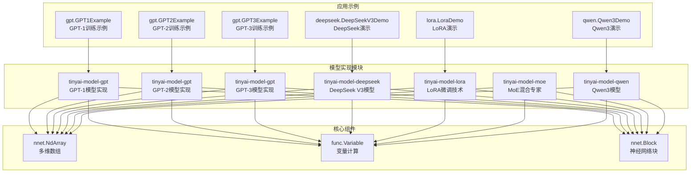

**图表来源**
- [GPT1Model.java](file://tinyai-model-gpt/src/main/java/io/leavesfly/tinyai/gpt1/GPT1Model.java#L1-L50)
- [GPT2Model.java](file://tinyai-model-gpt/src/main/java/io/leavesfly/tinyai/gpt2/GPT2Model.java#L1-L50)
- [GPT3Model.java](file://tinyai-model-gpt/src/main/java/io/leavesfly/tinyai/gpt3/GPT3Model.java#L1-L50)
- [DeepSeekV3Model.java](file://tinyai-model-deepseek/src/main/java/io/leavesfly/tinyai/deepseek/v3/DeepSeekV3Model.java#L1-L50)
- [LoraModel.java](file://tinyai-model-lora/src/main/java/io/leavesfly/tinyai/lora/LoraModel.java#L1-L50)
- [MoEGPTModel.java](file://tinyai-model-moe/src/main/java/io/leavesfly/tinyai/nlp/MoEGPTModel.java#L1-L50)
- [Qwen3Model.java](file://tinyai-model-qwen/src/main/java/io/leavesfly/tinyai/qwen3/Qwen3Model.java#L1-L50)

## GPT1Model - 原始Transformer架构实现

### 架构概述

GPT-1Model是基于Transformer解码器的自回归语言模型，采用Post-LayerNorm结构和掩码多头自注意力机制。该模型是GPT系列的开创性工作，具有以下核心特性：

- **仅解码器架构**：专注于生成任务
- **Post-LayerNorm**：在子层之后应用层归一化
- **掩码多头自注意力**：防止未来信息泄露
- **残差连接**：缓解梯度消失问题
- **学习的位置编码**：与GPT-2不同，使用可学习的位置嵌入而非正弦编码

### 核心组件分析

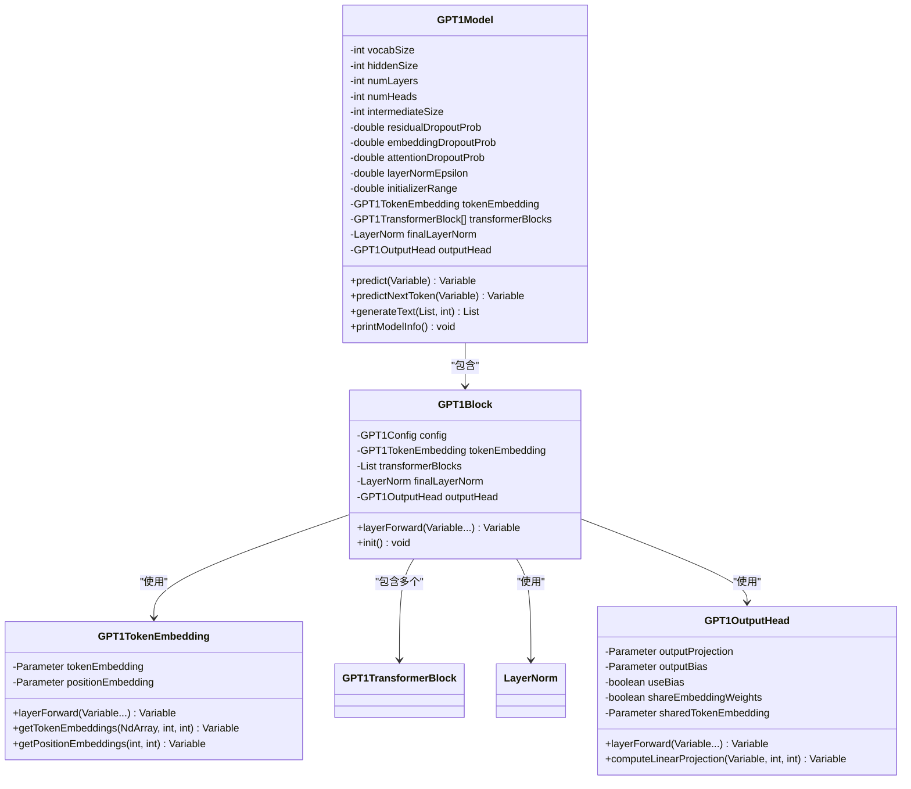

**图表来源**
- [GPT1Model.java](file://tinyai-model-gpt/src/main/java/io/leavesfly/tinyai/gpt1/GPT1Model.java#L30-L100)
- [GPT1Block.java](file://tinyai-model-gpt/src/main/java/io/leavesfly/tinyai/gpt1/GPT1Block.java#L20-L80)

### 注意力机制实现

GPT-1Model的注意力机制采用了标准的多头自注意力实现，与原始Transformer论文保持一致：

```java
// 注意力计算的核心逻辑
Variable attentionOutput = attention.layerForward(x, x, x);
Variable residual1 = addResidualConnection(x, attentionOutput);
Variable norm1Output = layerNorm1.layerForward(residual1);
```

这种实现具有以下特点：
- **因果掩码**：防止未来信息泄露
- **多头并行**：提高计算效率
- **残差连接**：保持梯度流动
- **Post-LayerNorm**：在子层之后应用层归一化

### 位置编码与嵌入

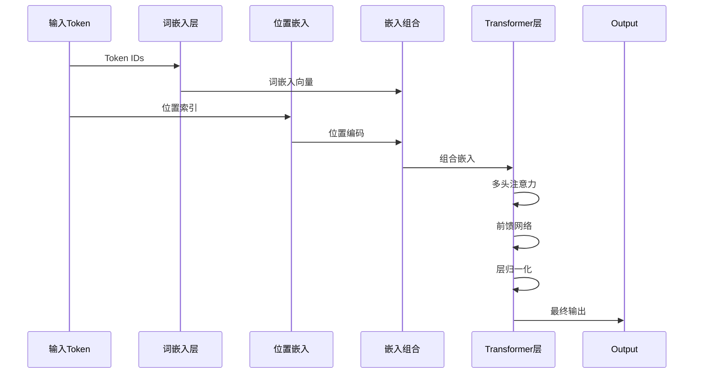

**图表来源**
- [GPT1Model.java](file://tinyai-model-gpt/src/main/java/io/leavesfly/tinyai/gpt1/GPT1Model.java#L200-L250)
- [GPT1Block.java](file://tinyai-model-gpt/src/main/java/io/leavesfly/tinyai/gpt1/GPT1Block.java#L50-L100)

### 实例化与使用示例

```java
// 创建小型GPT-1模型
GPT1Model model = GPT1Model.createTinyModel("gpt1_tiny", 5000, 128);

// 打印模型信息
model.printModelInfo();

// 预测下一个token
List<Integer> prompt = Arrays.asList(1, 2, 3);
List<Integer> generated = model.generateText(prompt, 10);

// 生成文本
int[] inputTokens = {1, 2, 3};
Variable nextToken = model.predictNextToken(inputTokens);
```

**章节来源**
- [GPT1Model.java](file://tinyai-model-gpt/src/main/java/io/leavesfly/tinyai/gpt1/GPT1Model.java#L30-L403)
- [GPT1Block.java](file://tinyai-model-gpt/src/main/java/io/leavesfly/tinyai/gpt1/GPT1Block.java#L1-L165)
- [GPT1Example.java](file://tinyai-model-gpt/src/main/java/io/leavesfly/tinyai/gpt1/GPT1Example.java#L1-L307)

## GPT2Model - Transformer架构实现

### 架构概述

GPT2Model是基于Transformer解码器的自回归语言模型，采用Pre-LayerNorm结构和掩码多头自注意力机制。该模型在GPT-1的基础上进行了多项改进：

- **Pre-LayerNorm**：在子层之前应用层归一化，提高训练稳定性
- **更大的模型规模**：支持从小型到超大型的不同配置
- **改进的初始化策略**：使用更小的初始化范围
- **残差连接的缩放**：在残差连接前对子层输出进行缩放

### 核心组件分析

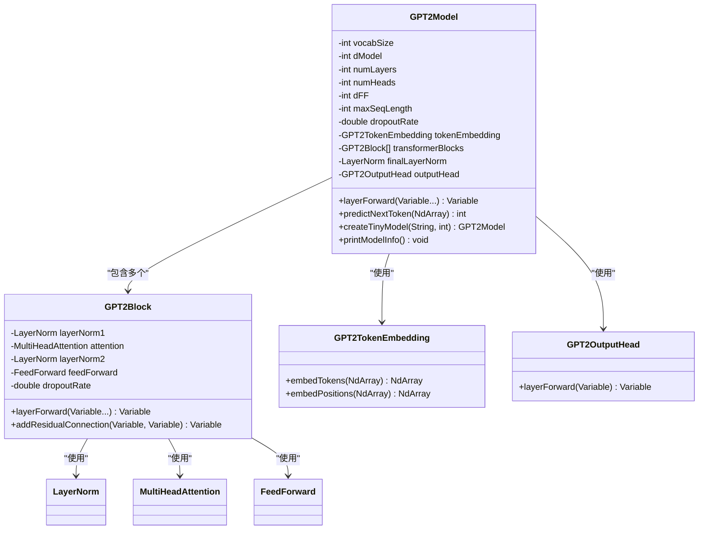

**图表来源**
- [GPT2Model.java](file://tinyai-model-gpt/src/main/java/io/leavesfly/tinyai/gpt2/GPT2Model.java#L30-L100)
- [GPT2Block.java](file://tinyai-model-gpt/src/main/java/io/leavesfly/tinyai/gpt2/GPT2Block.java#L20-L80)

### 注意力机制实现

GPT2Model的注意力机制采用了标准的多头自注意力实现：

```java
// 注意力计算的核心逻辑
Variable attentionOutput = attention.layerForward(norm1Output, norm1Output, norm1Output);
```

这种实现具有以下特点：
- **掩码机制**：防止未来信息泄露
- **多头并行**：提高计算效率
- **残差连接**：保持梯度流动
- **Pre-LayerNorm**：在子层之前应用层归一化

### 位置编码与嵌入


**图表来源**
- [GPT2Model.java](file://tinyai-model-gpt/src/main/java/io/leavesfly/tinyai/gpt2/GPT2Model.java#L200-L250)
- [GPT2Block.java](file://tinyai-model-gpt/src/main/java/io/leavesfly/tinyai/gpt2/GPT2Block.java#L50-L100)

### 实例化与使用示例

```java
// 创建小型GPT-2模型
GPT2Model model = GPT2Model.createTinyModel("gpt2_tiny", 5000);

// 打印模型信息
model.printModelInfo();

// 预测下一个token
NdArray input = NdArray.of(Shape.of(1, 10));
int predictedToken = model.predictNextToken(input);
```

**章节来源**
- [GPT2Model.java](file://tinyai-model-gpt/src/main/java/io/leavesfly/tinyai/gpt2/GPT2Model.java#L30-L403)
- [GPT2Block.java](file://tinyai-model-gpt/src/main/java/io/leavesfly/tinyai/gpt2/GPT2Block.java#L1-L165)
- [GPT2Example.java](file://tinyai-model-gpt/src/main/java/io/leavesfly/tinyai/gpt2/GPT2Example.java#L1-L307)

## GPT3Model - 大规模语言模型实现

### 架构创新

GPT3Model代表了大规模语言模型的最新进展，结合了多项先进技术：

1. **并行注意力和MLP计算**：在GPT-3中引入的优化，提高计算效率
2. **稀疏注意力机制**：支持更长的上下文窗口
3. **旋转位置编码（RoPE）**：更好的相对位置编码
4. **梯度检查点**：减少内存使用
5. **强大的Few-shot学习能力**：无需微调即可适应新任务

### 系统架构图

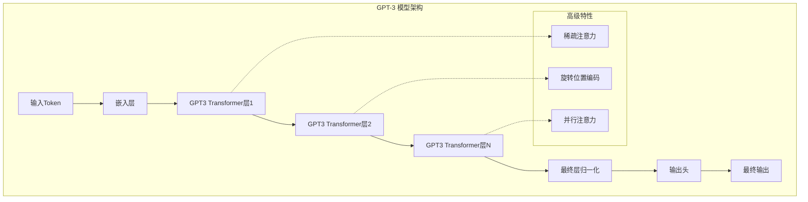

**图表来源**
- [GPT3Model.java](file://tinyai-model-gpt/src/main/java/io/leavesfly/tinyai/gpt3/GPT3Model.java#L30-L100)
- [GPT3MainBlock.java](file://tinyai-model-gpt/src/main/java/io/leavesfly/tinyai/gpt3/GPT3MainBlock.java#L50-L150)

### 并行计算机制

GPT3Model的核心创新在于其并行计算机制，该机制能够：

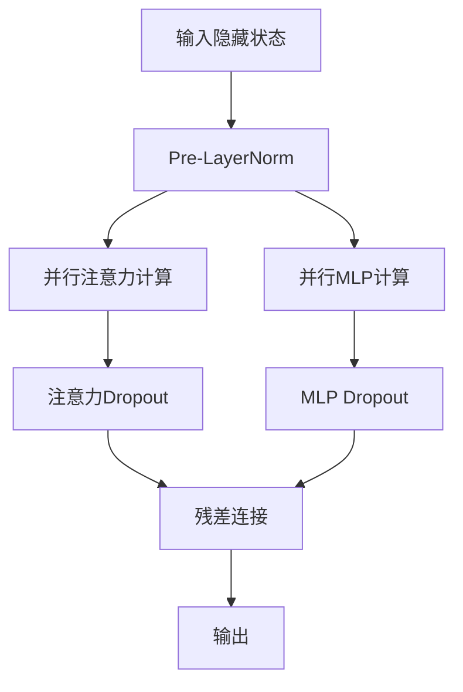

**图表来源**
- [GPT3MainBlock.java](file://tinyai-model-gpt/src/main/java/io/leavesfly/tinyai/gpt3/GPT3MainBlock.java#L200-L300)

### 稀疏注意力机制

GPT3Model引入了稀疏注意力机制，用于处理长序列：

```java
// 稀疏注意力的核心实现
Variable output = sparseMode ? 
    computeSparseAttention(query, key, value) : 
    computeFullAttention(query, key, value);
```

稀疏注意力的特点：
- **局部注意力**：每个位置只关注邻近的位置
- **全局注意力**：在特定位置使用全局注意力
- **步长注意力**：以固定步长关注远距离位置
- **降低复杂度**：从O(n²)降低到O(n√n)或O(n log n)

### 旋转位置编码

针对长序列的专门优化：

```java
// 旋转位置编码的实现
NdArray[] cosAndSin = generateRotaryEmbedding(seqLength);
Variable[] rotatedQK = applyRotaryPositionEmbedding(query, key, cosAndSin[0], cosAndSin[1]);
```

### 实例化与使用示例

```java
// 创建GPT-3模型
GPT3Model model = new GPT3Model("gpt3_small");

// 通用推理
Variable output = model.predict(inputIds);

// Few-shot学习
NdArray fewShotOutput = model.fewShotGenerate(contextIds, 100);

// 生成文本
NdArray generated = model.generateSequence(inputIds, 50);
```

**章节来源**
- [GPT3Model.java](file://tinyai-model-gpt/src/main/java/io/leavesfly/tinyai/gpt3/GPT3Model.java#L1-L437)
- [GPT3MainBlock.java](file://tinyai-model-gpt/src/main/java/io/leavesfly/tinyai/gpt3/GPT3MainBlock.java#L1-L515)
- [GPT3Example.java](file://tinyai-model-gpt/src/main/java/io/leavesfly/tinyai/gpt3/GPT3Example.java#L1-L401)

## DeepSeekV3Model - 混合专家系统

### 架构创新

DeepSeekV3Model代表了最先进的混合专家系统（MoE）架构，结合了传统的Transformer架构和专家系统的优点。该模型引入了三个核心创新：

1. **任务类型感知生成**：根据任务类型自动选择最优的推理路径
2. **代码生成专门模块**：针对编程任务的专门优化
3. **专家路由机制**：v3版本特有的专家选择和路由系统

### 系统架构图

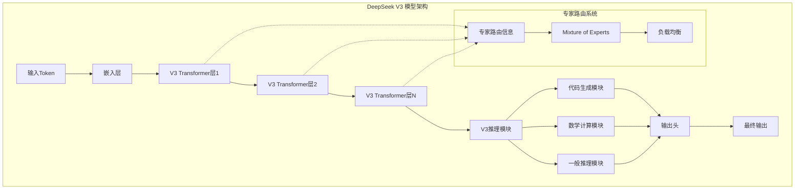

**图表来源**
- [DeepSeekV3Model.java](file://tinyai-model-deepseek/src/main/java/io/leavesfly/tinyai/deepseek/v3/DeepSeekV3Model.java#L30-L100)
- [DeepSeekV3Block.java](file://tinyai-model-deepseek/src/main/java/io/leavesfly/tinyai/deepseek/v3/DeepSeekV3Block.java#L50-L150)

### 专家路由机制详解

DeepSeekV3Model的核心创新在于其专家路由机制，该机制能够：

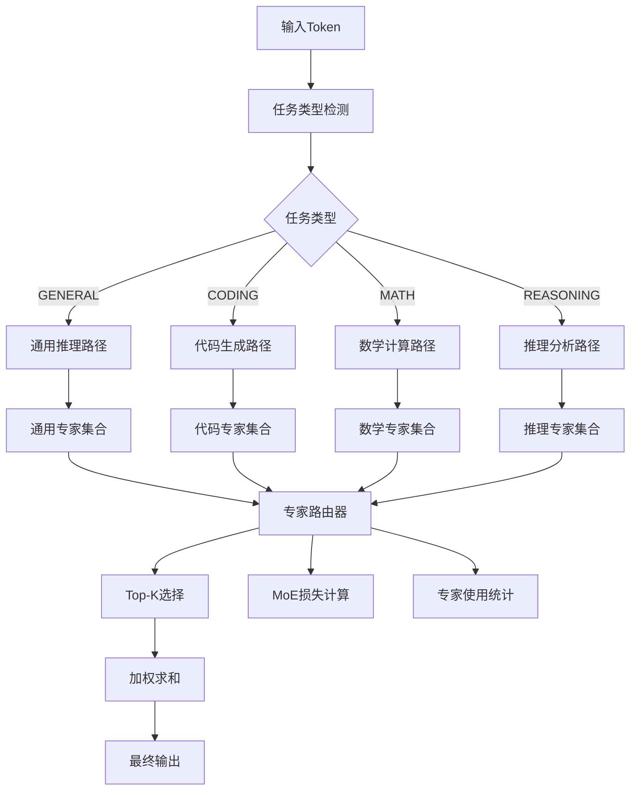

**图表来源**
- [DeepSeekV3Block.java](file://tinyai-model-deepseek/src/main/java/io/leavesfly/tinyai/deepseek/v3/DeepSeekV3Block.java#L200-L300)

### 反思模块设计

DeepSeekV3Model引入了独特的反思模块，用于增强推理质量和准确性：

```java
// 反思模块的核心实现
V3ReasoningBlock.ReasoningResult reasoningResult = 
    reasoningModule.performV3Reasoning(transformerResult.output);
```

反思模块的特点：
- **多阶段推理**：逐步细化推理过程
- **自我验证**：内置验证机制
- **错误纠正**：自动修正推理错误
- **置信度评估**：量化推理质量

### 代码生成专门模块

针对编程任务的专门优化：

```java
// 代码生成专门接口
DeepSeekV3Model.CodeGenerationResult codeResult = 
    model.generateCode(inputIds);

// 获取代码生成统计信息
System.out.println("代码置信度: " + codeResult.codeConfidence);
System.out.println("语法得分: " + codeResult.syntaxScore);
System.out.println("质量得分: " + codeResult.qualityScore);
```

### 实例化与使用示例

```java
// 创建DeepSeek V3模型
DeepSeekV3Model model = new DeepSeekV3Model("deepseek_v3");

// 通用推理
DeepSeekV3Block.DeepSeekV3Output output = model.generate(inputIds);

// 代码生成
DeepSeekV3Model.CodeGenerationResult codeResult = 
    model.generateCode(inputIds);

// 数学推理
DeepSeekV3Model.MathResult mathResult = 
    model.solveMath(inputIds);

// 推理分析
DeepSeekV3Model.ReasoningResult reasoningResult = 
    model.performReasoning(inputIds);
```

**章节来源**
- [DeepSeekV3Model.java](file://tinyai-model-deepseek/src/main/java/io/leavesfly/tinyai/deepseek/v3/DeepSeekV3Model.java#L1-L437)
- [DeepSeekV3Block.java](file://tinyai-model-deepseek/src/main/java/io/leavesfly/tinyai/deepseek/v3/DeepSeekV3Block.java#L1-L515)
- [DeepSeekV3Demo.java](file://tinyai-model-deepseek/src/main/java/io/leavesfly/tinyai/deepseek/v3/DeepSeekV3Demo.java#L1-L401)

## LoraModel - 低秩适配微调

### LoRA技术原理

LoRA（Low-Rank Adaptation）是一种高效的参数微调技术，通过将原始权重矩阵W分解为：

```
W' = W + A × B × scaling
```

其中：
- **W**: 冻结的预训练权重矩阵 (d × k)
- **A**: 可训练的下降矩阵 (d × r)
- **B**: 可训练的上升矩阵 (r × k)
- **r**: 低秩值，通常 r ≪ min(d, k)
- **scaling**: 缩放因子 = α / r

### 核心组件架构

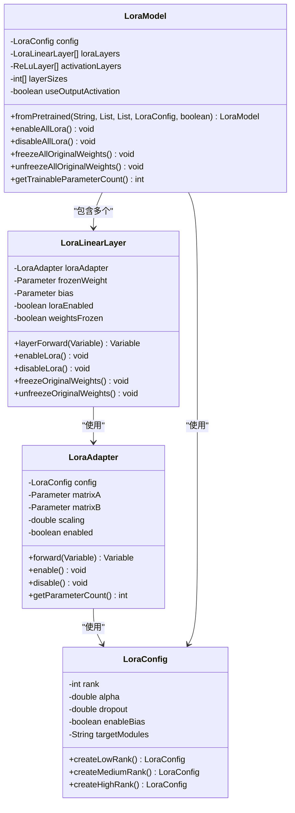

**图表来源**
- [LoraModel.java](file://tinyai-model-lora/src/main/java/io/leavesfly/tinyai/lora/LoraModel.java#L20-L100)
- [LoraAdapter.java](file://tinyai-model-lora/src/main/java/io/leavesfly/tinyai/lora/LoraAdapter.java#L20-L100)

### 参数效率分析

LoRA技术的参数效率体现在以下几个方面：

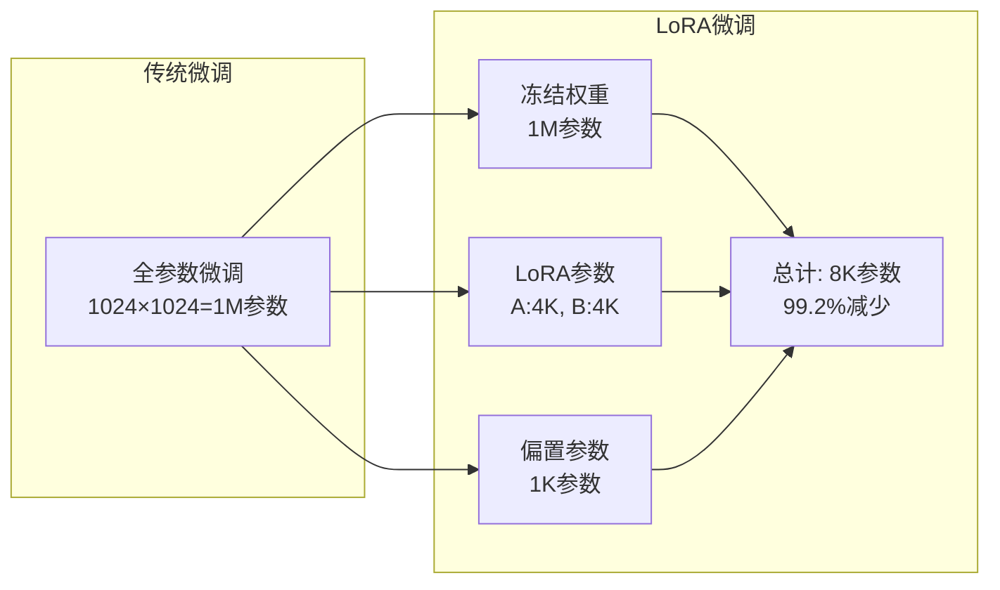

**图表来源**
- [LoRA实现说明.md](file://tinyai-model-lora/doc/LoRA实现说明.md#L50-L100)

### 动态权重管理

LoRA模型提供了灵活的权重管理机制：

```java
// 创建LoRA配置
LoraConfig config = LoraConfig.createMediumRank();

// 创建LoRA模型
int[] layerSizes = {784, 256, 128, 10};
LoraModel model = new LoraModel("classifier", layerSizes, config, false);

// 训练模式 - 只训练LoRA参数
model.freezeAllOriginalWeights();
model.enableAllLora();

// 推理时可选择禁用LoRA（使用原始权重）
model.disableAllLora();
```

### 预训练模型适配

LoRA的一个重要优势是可以轻松应用于预训练模型：

```java
// 从预训练权重创建LoRA模型
List<NdArray> pretrainedWeights = loadPretrainedWeights();
List<NdArray> pretrainedBiases = loadPretrainedBiases();

LoraModel fineTunedModel = LoraModel.fromPretrained(
    "finetuned_model", pretrainedWeights, pretrainedBiases, config, false);

// 微调完成后合并权重
List<NdArray> mergedWeights = fineTunedModel.mergeAllLoraWeights();
```

### 实例化与使用示例

```java
// 基础LoRA使用
LoraConfig config = LoraConfig.createMediumRank();
LoraLinearLayer layer = new LoraLinearLayer(
    "lora_layer", 512, 256, config, true);

// 完整LoRA模型
int[] layerSizes = {784, 256, 128, 10};
LoraModel model = new LoraModel("mnist_classifier", layerSizes, config, false);

// 参数统计
System.out.println("可训练参数: " + model.getTrainableParameterCount());
System.out.println("参数减少比例: " + model.getParameterReduction());
```

**章节来源**
- [LoraModel.java](file://tinyai-model-lora/src/main/java/io/leavesfly/tinyai/lora/LoraModel.java#L1-L376)
- [LoraAdapter.java](file://tinyai-model-lora/src/main/java/io/leavesfly/tinyai/lora/LoraAdapter.java#L1-L201)
- [LoRA实现说明.md](file://tinyai-model-lora/doc/LoRA实现说明.md#L1-L215)

## MoEGPTModel - 混合专家语言模型

### MoE机制原理

混合专家系统（MoE）通过将模型参数分布在多个专家网络上来增加模型容量，同时保持计算效率。MoE的核心思想是：

1. **专家专业化**：每个专家专门处理特定类型的输入
2. **门控路由**：根据输入动态选择激活的专家
3. **稀疏激活**：每次只激活少量专家，减少计算开销
4. **负载均衡**：确保专家使用分布均匀

### MoE架构设计

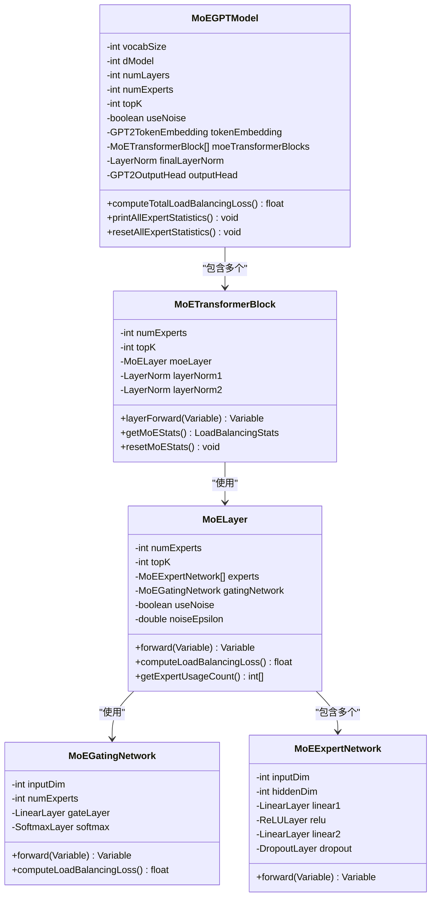

**图表来源**
- [MoEGPTModel.java](file://tinyai-model-moe/src/main/java/io/leavesfly/tinyai/nlp/MoEGPTModel.java#L30-L100)

### 门控网络实现

MoE的门控网络负责计算每个专家的权重分布：

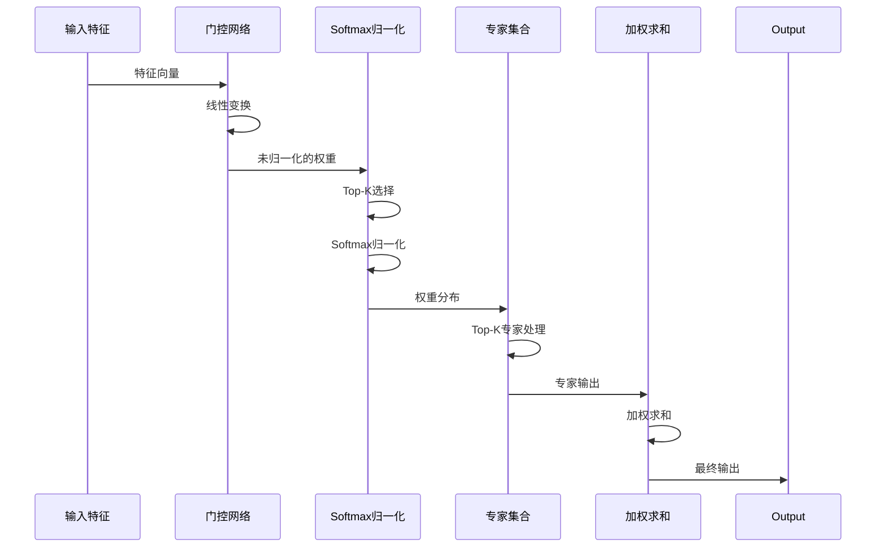

**图表来源**
- [MoEGPTModel.java](file://tinyai-model-moe/src/main/java/io/leavesfly/tinyai/nlp/MoEGPTModel.java#L200-L300)

### 负载均衡机制

MoE系统包含重要的负载均衡机制，确保专家使用分布均匀：

```java
// 负载均衡损失计算
float balancingLoss = model.computeTotalLoadBalancingLoss();

// 专家使用统计
model.printAllExpertStatistics();

// 重置统计信息
model.resetAllExpertStatistics();
```

负载均衡的关键指标：
- **负载均衡分数**：衡量专家使用的均匀程度
- **使用率统计**：每个专家的激活频率
- **方差分析**：专家使用分布的均匀性

### 模型配置与规模

MoE-GPT模型提供多种配置选项：

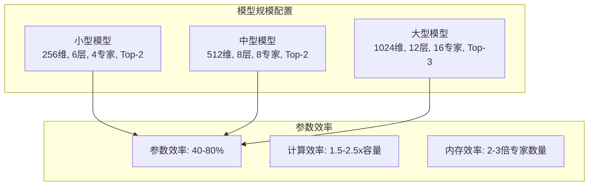

**图表来源**
- [MoEGPTModel.java](file://tinyai-model-moe/src/main/java/io/leavesfly/tinyai/nlp/MoEGPTModel.java#L400-L500)

### 实例化与使用示例

```java
// 创建小型MoE-GPT模型
MoEGPTModel model = MoEGPTModel.createSmallModel("moe_gpt_small", vocabSize);

// 打印模型信息和参数分布
model.printModelInfo();

// 前向传播
Variable output = model.layerForward(inputTokens);

// 获取负载均衡损失
float balancingLoss = model.computeTotalLoadBalancingLoss();

// 专家使用统计
model.printAllExpertStatistics();

// 重置统计信息
model.resetAllExpertStatistics();
```

**章节来源**
- [MoEGPTModel.java](file://tinyai-model-moe/src/main/java/io/leavesfly/tinyai/nlp/MoEGPTModel.java#L1-L562)
- [MoE实现说明.md](file://tinyai-model-moe/doc/MoE实现说明.md#L1-L171)

## Qwen3Model - 先进大语言模型实现

### 架构创新

Qwen3Model代表了先进大语言模型的最新进展，结合了多项前沿技术：

1. **RMS归一化**：使用RMSNorm替代传统的LayerNorm
2. **SwiGLU激活函数**：使用门控线性单元替代ReLU
3. **旋转位置编码（RoPE）**：更好的相对位置编码
4. **分组查询注意力（GQA）**：提高推理效率
5. **SiLU激活函数**：平滑且可微的激活函数

### 系统架构图

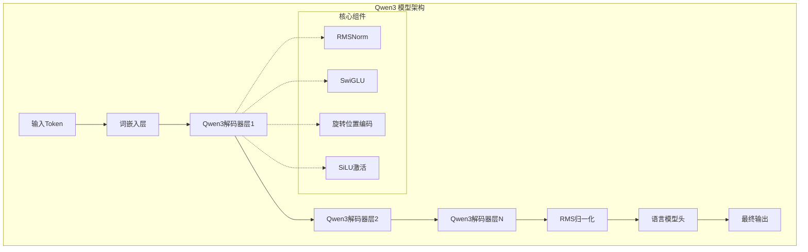

**图表来源**
- [Qwen3Model.java](file://tinyai-model-qwen/src/main/java/io/leavesfly/tinyai/qwen3/Qwen3Model.java#L30-L100)
- [Qwen3Block.java](file://tinyai-model-qwen/src/main/java/io/leavesfly/tinyai/qwen3/Qwen3Block.java#L50-L150)

### RMS归一化实现

Qwen3Model的核心创新在于其RMS归一化机制：

```java
// RMS归一化的核心实现
float rms = (float) Math.sqrt(sumSquare / hiddenSize + eps);
float normalized = inputData.get(b, h) / rms;
float weighted = normalized * weight.getValue().get(h);
```

RMS归一化的特点：
- **无偏移参数**：只使用缩放参数，不使用偏移参数
- **计算简单**：相比LayerNorm计算更简单
- **数值稳定**：添加eps防止除零
- **广泛使用**：在许多大语言模型中表现良好

### SwiGLU激活函数

针对前馈网络的专门优化：

```java
// SwiGLU激活函数的实现
Variable gateActivated = applySiLUActivation(gateOutput, batchSize, seqLen);
Variable swiGLUOutput = elementwiseMultiply(gateActivated, upOutput, batchSize, seqLen);
```

### 实例化与使用示例

```java
// 创建Qwen3模型
Qwen3Model model = Qwen3Model.createTinyModel("qwen3_tiny");

// 打印模型信息
model.printModelInfo();

// 预测下一个token
NdArray input = NdArray.of(Shape.of(1, 10));
int predictedToken = model.predictNextToken(input);

// 生成文本
NdArray generated = model.generate(input, 50);
```

**章节来源**
- [Qwen3Model.java](file://tinyai-model-qwen/src/main/java/io/leavesfly/tinyai/qwen3/Qwen3Model.java#L1-L437)
- [Qwen3Block.java](file://tinyai-model-qwen/src/main/java/io/leavesfly/tinyai/qwen3/Qwen3Block.java#L1-L515)
- [Qwen3Demo.java](file://tinyai-model-qwen/src/main/java/io/leavesfly/tinyai/qwen3/Qwen3Demo.java#L1-L401)

## 模型比较与适用场景

### 性能特点对比

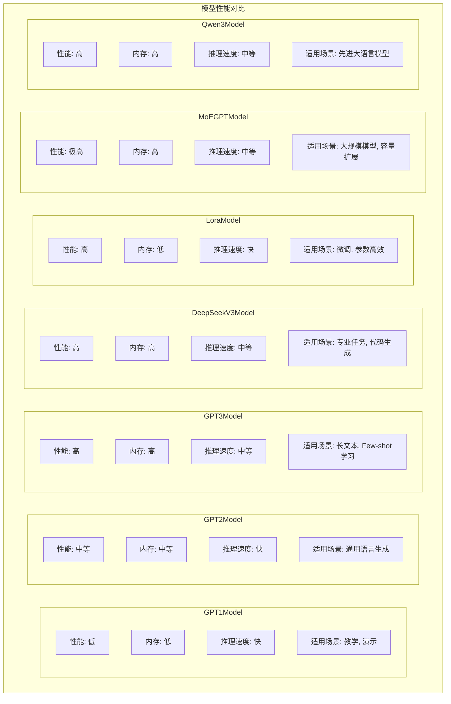

### 适用场景分析

| 模型 | 场景 | 优势 | 限制 |
|------|------|------|------|
| GPT1Model | 教学演示、基础研究 | 实现简单、易于理解 | 模型容量有限 |
| GPT2Model | 通用文本生成、对话系统 | 实现简单、推理速度快 | 模型容量有限 |
| GPT3Model | 长文本生成、Few-shot学习 | 支持长上下文、Few-shot能力强 | 内存消耗大 |
| DeepSeekV3Model | 专业任务、代码生成、数学推理 | 任务感知、高质量输出 | 内存消耗大 |
| LoraModel | 预训练模型微调、参数高效训练 | 参数效率高、易于集成 | 依赖预训练模型 |
| MoEGPTModel | 大规模语言模型、容量扩展 | 容量大、参数高效 | 实现复杂、内存需求高 |
| Qwen3Model | 先进大语言模型、高效推理 | 使用先进技术、推理效率高 | 实现复杂 |

### 选择建议

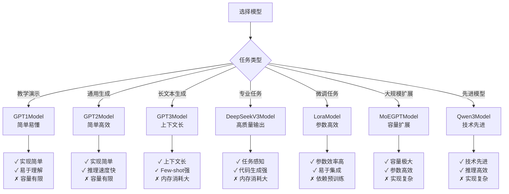

## 性能优化与最佳实践

### 内存优化策略

1. **GPT1Model优化**
   ```java
   // 使用较小的模型配置
   GPT1Model model = GPT1Model.createTinyModel("tiny_gpt1", vocabSize, 128);
   
   // 限制序列长度
   model.setMaxSeqLength(256);
   ```

2. **GPT2Model优化**
   ```java
   // 使用较小的模型配置
   GPT2Model model = GPT2Model.createTinyModel("tiny_gpt2", vocabSize);
   
   // 限制序列长度
   model.setMaxSeqLength(512);
   ```

3. **GPT3Model优化**
   ```java
   // 使用小型配置
   GPT3Model model = GPT3Model.createSmallModel("small_gpt3");
   
   // 启用稀疏注意力
   model.enableSparseAttention();
   ```

4. **LoraModel优化**
   ```java
   // 使用较低秩的配置
   LoraConfig config = LoraConfig.createLowRank();
   
   // 冻结原始权重
   model.freezeAllOriginalWeights();
   ```

5. **MoEGPTModel优化**
   ```java
   // 使用较小的专家数量
   MoEGPTModel model = new MoEGPTModel("small_moe", vocabSize, 768, 12, 12, 4, 2, 1024);
   
   // 调整Top-K参数
   model.setTopK(1); // 减少专家激活数量
   ```

6. **Qwen3Model优化**
   ```java
   // 使用小型配置
   Qwen3Model model = Qwen3Model.createTinyModel("tiny_qwen3");
   
   // 限制序列长度
   model.setMaxSeqLength(512);
   ```

### 推理优化技巧

```java
// 批量推理优化
public void batchInference(List<NdArray> inputs) {
    // 预分配输出缓冲区
    NdArray batchOutput = NdArray.zeros(Shape.of(inputs.size(), maxSeqLength, vocabSize));
    
    // 批量处理
    for (int i = 0; i < inputs.size(); i++) {
        Variable output = model.forward(new Variable(inputs.get(i)));
        batchOutput.set(output.getValue(), i);
    }
}
```

### 训练优化策略

1. **LoRA训练优化**
   ```java
   // 使用AdamW优化器
   Adam optimizer = new Adam(model, 1e-4f, 0.9f, 0.999f, 1e-8f);
   
   // 学习率调度
   LearningRateScheduler scheduler = new WarmupCosineAnnealingScheduler(1000);
   ```

2. **MoE训练优化**
   ```java
   // 负载均衡损失权重
   float balancingLossWeight = 0.01f;
   
   // 专家使用统计
   model.collectExpertStatistics(true);
   ```

## 故障排除指南

### 常见问题与解决方案

1. **内存不足错误**
   ```java
   // 问题：OutOfMemoryError
   // 解决方案：使用更小的模型配置或减少批处理大小
   
   // 检查当前内存使用
   Runtime runtime = Runtime.getRuntime();
   long maxMemory = runtime.maxMemory();
   long totalMemory = runtime.totalMemory();
   long freeMemory = runtime.freeMemory();
   
   System.out.println("可用内存: " + (freeMemory / 1024 / 1024) + "MB");
   ```

2. **梯度爆炸**
   ```java
   // 问题：梯度爆炸导致NaN
   // 解决方案：梯度裁剪
   
   // 在优化器中设置梯度裁剪
   optimizer.setGradientClipping(1.0f);
   ```

3. **收敛缓慢**
   ```java
   // 问题：训练收敛缓慢
   // 解决方案：调整学习率和优化器参数
   
   // 使用学习率预热
   LearningRateScheduler scheduler = new WarmupLinearScheduler(warmupSteps, initialLR);
   ```

4. **专家使用不均衡**
   ```java
   // 问题：某些专家使用频率过高
   // 解决方案：调整负载均衡损失权重
   
   // 增加负载均衡损失的影响
   float newWeight = balancingLossWeight * 2.0f;
   ```

### 调试工具

```java
// 模型调试工具
public class ModelDebugger {
    
    public static void debugModelInfo(Model model) {
        System.out.println("=== 模型调试信息 ===");
        System.out.println("模型名称: " + model.getName());
        System.out.println("输入形状: " + Arrays.toString(model.getInputShape()));
        System.out.println("输出形状: " + Arrays.toString(model.getOutputShape()));
        System.out.println("参数数量: " + model.getTotalParameterCount());
        System.out.println("==================");
    }
    
    public static void debugForwardPass(Model model, NdArray input) {
        try {
            Variable output = model.forward(new Variable(input));
            System.out.println("前向传播成功");
            System.out.println("输出形状: " + Arrays.toString(output.getValue().getShape()));
        } catch (Exception e) {
            System.err.println("前向传播失败: " + e.getMessage());
            e.printStackTrace();
        }
    }
}
```

**章节来源**
- [GPT1Example.java](file://tinyai-model-gpt/src/main/java/io/leavesfly/tinyai/gpt1/GPT1Example.java#L100-L200)
- [GPT2Example.java](file://tinyai-model-gpt/src/main/java/io/leavesfly/tinyai/gpt2/GPT2Example.java#L100-L200)
- [GPT3Example.java](file://tinyai-model-gpt/src/main/java/io/leavesfly/tinyai/gpt3/GPT3Example.java#L100-L200)
- [DeepSeekV3Demo.java](file://tinyai-model-deepseek/src/main/java/io/leavesfly/tinyai/deepseek/v3/DeepSeekV3Demo.java#L200-L300)
- [Qwen3Demo.java](file://tinyai-model-qwen/src/main/java/io/leavesfly/tinyai/qwen3/Qwen3Demo.java#L200-L300)

## 总结

TinyAI项目提供的六种核心模型代表了现代深度学习领域的前沿技术：

1. **GPT1Model**：原始Transformer架构，适合教学和基础研究
2. **GPT2Model**：简洁高效的Transformer架构，适合通用语言生成任务
3. **GPT3Model**：大规模语言模型，具备长上下文和Few-shot学习能力
4. **DeepSeekV3Model**：先进的混合专家系统，具备任务感知和专业能力
5. **LoraModel**：参数高效的微调技术，大幅减少训练参数
6. **MoEGPTModel**：大规模模型扩展方案，通过专家系统增加容量
7. **Qwen3Model**：先进大语言模型，使用RMSNorm、SwiGLU等先进技术

每种模型都有其独特的优势和适用场景。在实际应用中，应根据具体需求选择合适的模型，并结合性能优化策略获得最佳效果。

通过深入理解这些模型的架构设计和实现细节，开发者可以更好地利用TinyAI框架构建高性能的AI应用，满足不同场景下的技术需求。