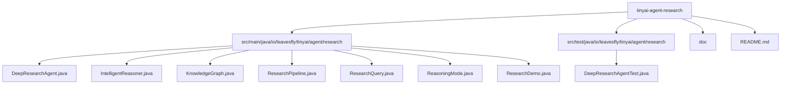
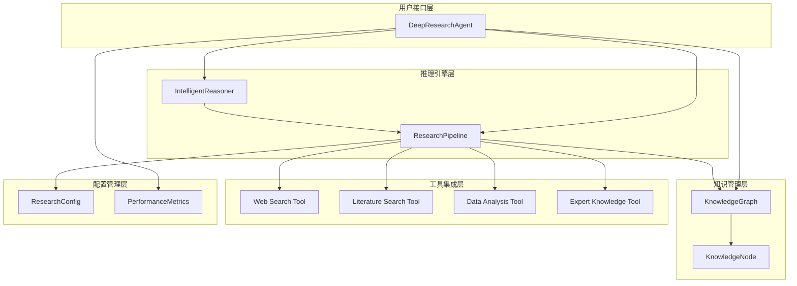
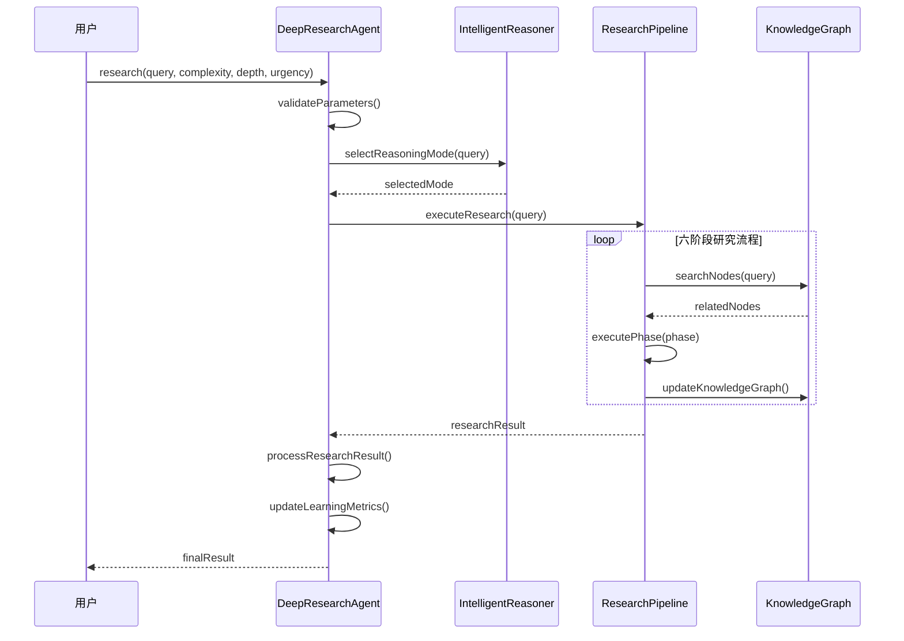
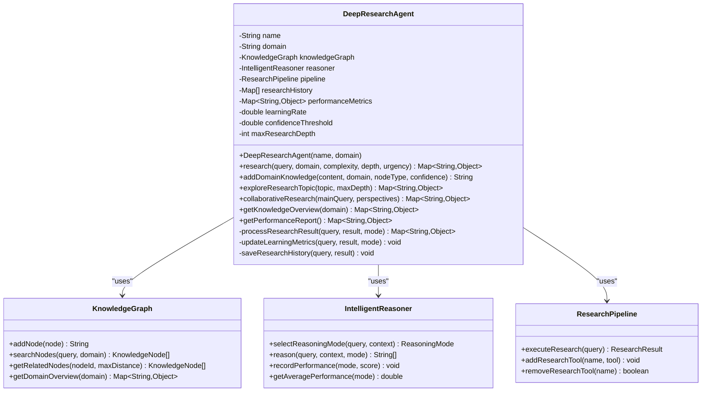
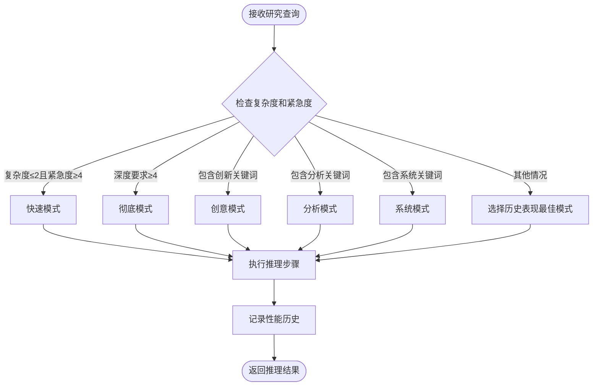
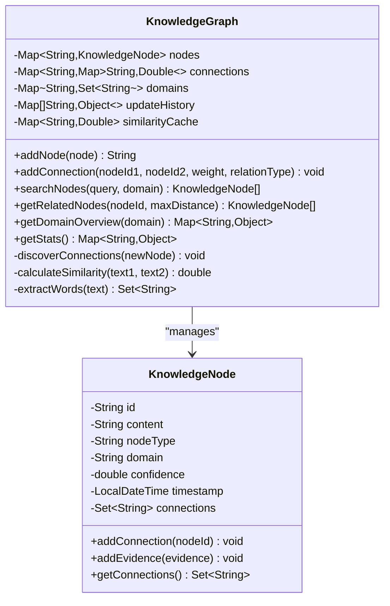
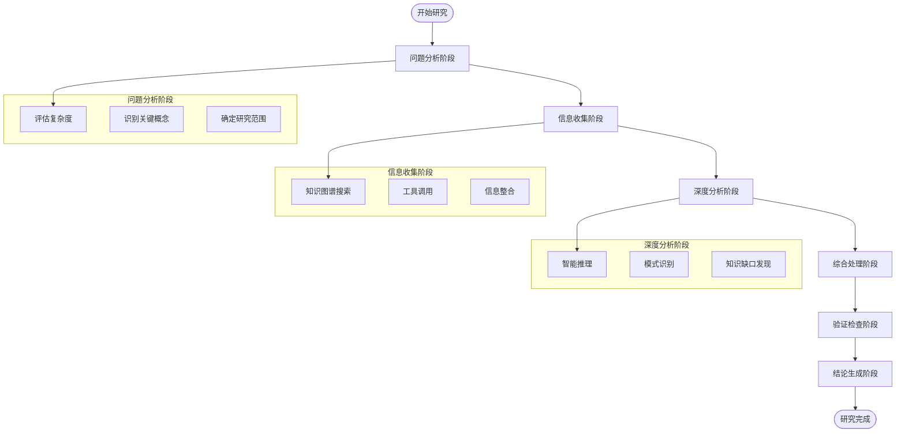
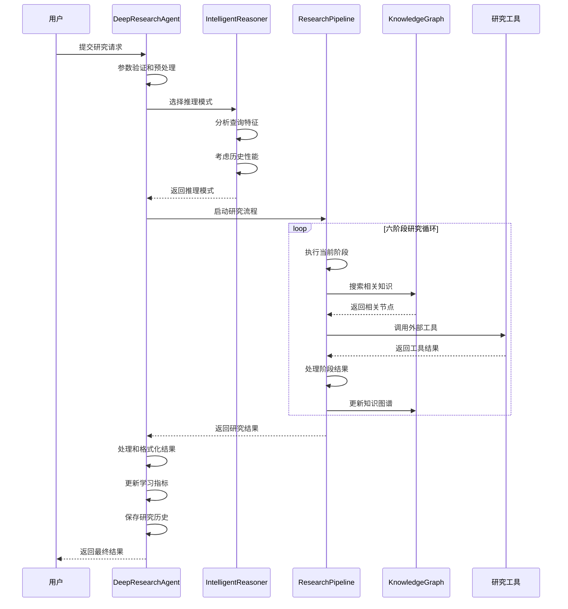

# 深度研究智能体

<cite>
**本文档引用的文件**
- [DeepResearchAgent.java](file://tinyai-agent-research/src/main/java/io/leavesfly/tinyai/agent/research/DeepResearchAgent.java)
- [IntelligentReasoner.java](file://tinyai-agent-research/src/main/java/io/leavesfly/tinyai/agent/research/IntelligentReasoner.java)
- [KnowledgeGraph.java](file://tinyai-agent-research/src/main/java/io/leavesfly/tinyai/agent/research/KnowledgeGraph.java)
- [ResearchPipeline.java](file://tinyai-agent-research/src/main/java/io/leavesfly/tinyai/agent/research/ResearchPipeline.java)
- [ResearchQuery.java](file://tinyai-agent-research/src/main/java/io/leavesfly/tinyai/agent/research/ResearchQuery.java)
- [ReasoningMode.java](file://tinyai-agent-research/src/main/java/io/leavesfly/tinyai/agent/research/ReasoningMode.java)
- [ResearchDemo.java](file://tinyai-agent-research/src/main/java/io/leavesfly/tinyai/agent/research/ResearchDemo.java)
- [README.md](file://tinyai-agent-research/README.md)
</cite>

## 目录
1. [简介](#简介)
2. [项目结构](#项目结构)
3. [核心组件](#核心组件)
4. [架构概览](#架构概览)
5. [详细组件分析](#详细组件分析)
6. [工作流程](#工作流程)
7. [API接口](#api接口)
8. [使用示例](#使用示例)
9. [性能考虑](#性能考虑)
10. [故障排除指南](#故障排除指南)
11. [结论](#结论)

## 简介

深度研究智能体（DeepResearch Agent）是TinyAI框架中的一个高级研究AI系统，专为执行深度、系统性的研究任务而设计。该智能体结合了多阶段推理、动态知识图谱构建、自适应学习等先进功能，能够为用户提供全面、准确的研究结果。

### 设计目标

- **深度分析能力**: 支持复杂问题的多层次解构和分析
- **知识整合**: 跨领域知识的自动发现和关联
- **自适应学习**: 基于历史表现的智能策略优化
- **多模式推理**: 支持多种推理策略以适应不同类型的问题
- **可扩展性**: 模块化设计便于功能扩展和定制

### 核心特性

- **六阶段研究管道**: 从问题分析到结论生成的完整流程
- **动态知识图谱**: 实时构建和更新的知识网络
- **智能推理引擎**: 基于问题特征的推理模式自选
- **多工具集成**: 网络搜索、文献检索、数据分析等多种工具
- **持续学习**: 性能跟踪和自我改进机制

## 项目结构

深度研究智能体模块位于`tinyai-agent-research`目录下，采用标准的Java Maven项目结构：



**图表来源**
- [DeepResearchAgent.java](file://tinyai-agent-research/src/main/java/io/leavesfly/tinyai/agent/research/DeepResearchAgent.java#L1-L50)
- [IntelligentReasoner.java](file://tinyai-agent-research/src/main/java/io/leavesfly/tinyai/agent/research/IntelligentReasoner.java#L1-L50)
- [KnowledgeGraph.java](file://tinyai-agent-research/src/main/java/io/leavesfly/tinyai/agent/research/KnowledgeGraph.java#L1-L50)

**章节来源**
- [README.md](file://tinyai-agent-research/README.md#L1-L100)

## 核心组件

深度研究智能体由四个核心组件构成，每个组件负责特定的功能领域：

### 1. DeepResearchAgent（核心代理）

DeepResearchAgent是整个系统的入口点和协调器，负责：

- 研究任务的整体协调和生命周期管理
- 学习指标的更新和性能监控
- 多模式研究支持（探索性、协作式研究）
- 研究历史的保存和检索

### 2. IntelligentReasoner（智能推理器）

IntelligentReasoner提供自适应推理能力：

- 基于查询特征和历史性能选择最优推理模式
- 支持五种不同的推理策略
- 性能历史记录和分析
- 推理质量评估和反馈

### 3. KnowledgeGraph（知识图谱）

动态知识管理系统：

- 自动节点发现和连接建立
- 基于内容的相似度计算
- 多领域知识整合
- 实时更新和维护

### 4. ResearchPipeline（研究管道）

多阶段研究流程控制器：

- 六阶段研究流程的执行和管理
- 研究工具的调用和结果处理
- 知识图谱的更新和维护
- 质量评估和结果整合

**章节来源**
- [DeepResearchAgent.java](file://tinyai-agent-research/src/main/java/io/leavesfly/tinyai/agent/research/DeepResearchAgent.java#L15-L50)
- [IntelligentReasoner.java](file://tinyai-agent-research/src/main/java/io/leavesfly/tinyai/agent/research/IntelligentReasoner.java#L15-L50)
- [KnowledgeGraph.java](file://tinyai-agent-research/src/main/java/io/leavesfly/tinyai/agent/research/KnowledgeGraph.java#L15-L50)
- [ResearchPipeline.java](file://tinyai-agent-research/src/main/java/io/leavesfly/tinyai/agent/research/ResearchPipeline.java#L15-L50)

## 架构概览

深度研究智能体采用分层架构设计，确保各组件间的松耦合和高内聚：



**图表来源**
- [DeepResearchAgent.java](file://tinyai-agent-research/src/main/java/io/leavesfly/tinyai/agent/research/DeepResearchAgent.java#L25-L45)
- [IntelligentReasoner.java](file://tinyai-agent-research/src/main/java/io/leavesfly/tinyai/agent/research/IntelligentReasoner.java#L20-L40)
- [ResearchPipeline.java](file://tinyai-agent-research/src/main/java/io/leavesfly/tinyai/agent/research/ResearchPipeline.java#L20-L40)

### 组件交互流程



**图表来源**
- [DeepResearchAgent.java](file://tinyai-agent-research/src/main/java/io/leavesfly/tinyai/agent/research/DeepResearchAgent.java#L60-L90)
- [ResearchPipeline.java](file://tinyai-agent-research/src/main/java/io/leavesfly/tinyai/agent/research/ResearchPipeline.java#L40-L60)

## 详细组件分析

### DeepResearchAgent 详细分析

DeepResearchAgent是系统的核心控制器，负责整个研究流程的协调和管理：



**图表来源**
- [DeepResearchAgent.java](file://tinyai-agent-research/src/main/java/io/leavesfly/tinyai/agent/research/DeepResearchAgent.java#L15-L50)
- [KnowledgeGraph.java](file://tinyai-agent-research/src/main/java/io/leavesfly/tinyai/agent/research/KnowledgeGraph.java#L20-L40)
- [IntelligentReasoner.java](file://tinyai-agent-research/src/main/java/io/leavesfly/tinyai/agent/research/IntelligentReasoner.java#L15-L35)
- [ResearchPipeline.java](file://tinyai-agent-research/src/main/java/io/leavesfly/tinyai/agent/research/ResearchPipeline.java#L15-L35)

#### 核心方法分析

**研究执行方法**：
```java
public Map<String, Object> research(String query, String domain, 
                                   int complexity, int depthRequired, int urgency)
```

该方法是系统的主要入口点，接受五个关键参数：
- `query`: 研究问题或主题
- `domain`: 研究领域（如"人工智能"、"区块链"等）
- `complexity`: 复杂度等级（1-5）
- `depthRequired`: 深度要求（1-5）
- `urgency`: 紧急程度（1-5）

**章节来源**
- [DeepResearchAgent.java](file://tinyai-agent-research/src/main/java/io/leavesfly/tinyai/agent/research/DeepResearchAgent.java#L60-L90)

### IntelligentReasoner 详细分析

IntelligentReasoner实现了自适应推理机制，能够根据问题特征和历史性能选择最优的推理策略：



**图表来源**
- [IntelligentReasoner.java](file://tinyai-agent-research/src/main/java/io/leavesfly/tinyai/agent/research/IntelligentReasoner.java#L35-L65)

#### 推理模式详解

系统支持五种推理模式，每种模式针对特定类型的问题：

1. **Quick Mode（快速模式）**
   - **适用场景**: 简单问题、紧急响应
   - **特点**: 快速关键词匹配、直接调用已有知识、生成初步答案

2. **Thorough Mode（彻底模式）**
   - **适用场景**: 复杂问题、深度要求高
   - **特点**: 问题多维度分解、系统性信息收集、多角度分析验证

3. **Creative Mode（创意模式）**
   - **适用场景**: 创新问题、发散思维
   - **特点**: 非传统思考角度、跨领域知识联想、假设性方案生成

4. **Analytical Mode（分析模式）**
   - **适用场景**: 数据分析、比较研究
   - **特点**: 变量因素识别、因果关系建模、量化权重分析

5. **Systematic Mode（系统模式）**
   - **适用场景**: 结构化研究、系统梳理
   - **特点**: 概念框架构建、逻辑顺序收集、知识结构图建立

**章节来源**
- [IntelligentReasoner.java](file://tinyai-agent-research/src/main/java/io/leavesfly/tinyai/agent/research/IntelligentReasoner.java#L65-L286)
- [ReasoningMode.java](file://tinyai-agent-research/src/main/java/io/leavesfly/tinyai/agent/research/ReasoningMode.java#L10-L50)

### KnowledgeGraph 详细分析

KnowledgeGraph是系统的核心知识管理组件，提供动态的知识图谱构建和维护功能：



**图表来源**
- [KnowledgeGraph.java](file://tinyai-agent-research/src/main/java/io/leavesfly/tinyai/agent/research/KnowledgeGraph.java#L20-L60)

#### 知识图谱核心功能

**自动节点发现**：
系统能够自动识别和连接相关知识点，通过以下机制实现：

1. **相似度计算**: 基于内容的词汇重叠度计算
2. **自动连接**: 相似度超过阈值时自动建立连接
3. **双向关系**: 确保连接的双向性和完整性

**多领域支持**：
- 按领域组织和管理知识节点
- 支持跨领域知识的关联和整合
- 提供领域级别的概览和统计

**实时更新**：
- 研究过程中动态扩展知识库
- 自动发现和添加新的相关知识
- 维护更新历史记录

**章节来源**
- [KnowledgeGraph.java](file://tinyai-agent-research/src/main/java/io/leavesfly/tinyai/agent/research/KnowledgeGraph.java#L40-L200)

### ResearchPipeline 详细分析

ResearchPipeline实现了六阶段的研究流程，确保研究过程的系统性和完整性：



**图表来源**
- [ResearchPipeline.java](file://tinyai-agent-research/src/main/java/io/leavesfly/tinyai/agent/research/ResearchPipeline.java#L40-L80)

#### 六阶段研究流程详解

1. **问题分析阶段（Problem Analysis）**
   - 评估问题复杂度和紧急程度
   - 识别关键概念和术语
   - 确定研究范围和边界

2. **信息收集阶段（Information Gathering）**
   - 从知识图谱检索相关节点
   - 调用多种研究工具获取信息
   - 整合多源信息和证据

3. **深度分析阶段（Deep Analysis）**
   - 使用智能推理器进行多角度分析
   - 识别模式和关联关系
   - 发现知识缺口和研究机会

4. **综合处理阶段（Synthesis）**
   - 整合所有收集的信息
   - 生成新的洞察和理解
   - 建立知识结构和框架

5. **验证检查阶段（Validation）**
   - 检查逻辑一致性和合理性
   - 评估证据支持度和可靠性
   - 确保结论的准确性

6. **结论生成阶段（Conclusion）**
   - 生成最终答案和结论
   - 提出后续研究方向和建议
   - 总结研究发现和洞察

**章节来源**
- [ResearchPipeline.java](file://tinyai-agent-research/src/main/java/io/leavesfly/tinyai/agent/research/ResearchPipeline.java#L80-L200)

## 工作流程

深度研究智能体的工作流程遵循严格的六阶段模式，确保研究过程的系统性和高质量：



**图表来源**
- [DeepResearchAgent.java](file://tinyai-agent-research/src/main/java/io/leavesfly/tinyai/agent/research/DeepResearchAgent.java#L60-L120)
- [ResearchPipeline.java](file://tinyai-agent-research/src/main/java/io/leavesfly/tinyai/agent/research/ResearchPipeline.java#L40-L60)

### 研究质量评估

系统内置了完整的质量评估体系，从多个维度评估研究结果的质量：

- **完整性** (20%): 研究步骤的全面程度
- **深度** (25%): 思考和分析的深入程度
- **多样性** (20%): 工具和方法的多样化使用
- **洞察力** (20%): 发现关键洞察的能力
- **置信度** (15%): 整体结果的可信程度

最终质量评分范围：0.0 - 1.0

**章节来源**
- [DeepResearchAgent.java](file://tinyai-agent-research/src/main/java/io/leavesfly/tinyai/agent/research/DeepResearchAgent.java#L120-L180)

## API接口

深度研究智能体提供了简洁而强大的API接口，支持多种使用场景：

### 主要API方法

#### 1. 基础研究方法

```java
public Map<String, Object> research(String query, String domain, 
                                   int complexity, int depthRequired, int urgency)
```

**参数说明**：
- `query`: 研究问题或主题
- `domain`: 研究领域（可选，默认为"general"）
- `complexity`: 复杂度等级 (1-5)
- `depthRequired`: 深度要求 (1-5)
- `urgency`: 紧急程度 (1-5)

**返回值**：
- `query`: 原始查询内容
- `domain`: 研究领域
- `reasoningMode`: 使用的推理模式
- `finalAnswer`: 最终答案
- `totalConfidence`: 总置信度
- `qualityScore`: 质量评分
- `keyInsights`: 关键洞察列表
- `researchSteps`: 研究步骤数量
- `toolsUsed`: 使用的工具数量
- `detailedSteps`: 详细的步骤信息
- `timestamp`: 时间戳

#### 2. 探索性研究方法

```java
public Map<String, Object> exploreResearchTopic(String topic, int maxDepth)
```

支持对特定主题进行深入探索，生成多个相关问题和对应的答案。

#### 3. 协作式研究方法

```java
public Map<String, Object> collaborativeResearch(String mainQuery, List<String> perspectives)
```

从多个视角（技术、法律、社会、哲学等）分析同一个问题，生成综合分析结果。

#### 4. 知识管理方法

```java
public String addDomainKnowledge(String content, String domain, String nodeType, double confidence)
public Map<String, Object> getKnowledgeOverview(String domain)
```

用于添加领域知识和获取知识图谱概览。

#### 5. 性能监控方法

```java
public Map<String, Object> getPerformanceReport()
```

获取Agent的性能统计信息，包括研究历史、平均置信度、领域专业度等。

**章节来源**
- [DeepResearchAgent.java](file://tinyai-agent-research/src/main/java/io/leavesfly/tinyai/agent/research/DeepResearchAgent.java#L60-L200)

## 使用示例

以下是深度研究智能体的各种使用示例：

### 基础使用示例

```java
import io.leavesfly.tinyai.agent.research.DeepResearchAgent;
import java.util.Map;

// 创建研究Agent
DeepResearchAgent agent = new DeepResearchAgent("我的研究助手", "人工智能");

// 添加领域知识
agent.addDomainKnowledge("深度学习是机器学习的一个分支", "人工智能", "concept");

// 执行研究
Map<String, Object> result = agent.research(
    "深度学习在计算机视觉中的应用",
    3,      // 复杂度 (1-5)
    4,      // 深度要求 (1-5)
    2       // 紧急程度 (1-5)
);

// 查看结果
System.out.println("研究答案: " + result.get("finalAnswer"));
System.out.println("置信度: " + result.get("totalConfidence"));
System.out.println("关键洞察: " + result.get("keyInsights"));
```

### 高级功能示例

#### 探索性研究

```java
// 深入探索某个主题
Map<String, Object> explorationResult = agent.exploreResearchTopic("量子计算", 3);
System.out.println("探索了 " + explorationResult.get("totalQuestionsExplored") + " 个相关问题");
```

#### 协作式研究

```java
// 多视角分析
List<String> perspectives = Arrays.asList("技术", "法律", "社会", "哲学");
Map<String, Object> collaborationResult = agent.collaborativeResearch(
    "人工智能的伦理问题", perspectives);
```

#### 性能监控

```java
// 获取Agent性能报告
Map<String, Object> performance = agent.getPerformanceReport();
System.out.println("研究次数: " + performance.get("researchHistoryCount"));
```

### 批量研究示例

```java
String[] queries = {
    "机器学习算法比较",
    "深度学习发展趋势", 
    "AI伦理考量"
};

for (String query : queries) {
    Map<String, Object> result = agent.research(query, 2, 3, 2);
    System.out.println("查询: " + query);
    System.out.println("答案: " + result.get("finalAnswer"));
    System.out.println("置信度: " + result.get("totalConfidence"));
    System.out.println("---");
}
```

**章节来源**
- [ResearchDemo.java](file://tinyai-agent-research/src/main/java/io/leavesfly/tinyai/agent/research/ResearchDemo.java#L30-L150)

## 性能考虑

### 内存使用优化

深度研究智能体在设计时充分考虑了内存使用效率：

- **知识图谱缓存**: 使用相似度计算缓存减少重复计算
- **历史记录限制**: 研究历史保持在合理范围内（最多1000条）
- **节点去重**: 自动检测和避免重复的知识节点

### 处理时间优化

- **推理模式选择**: 基于问题特征快速选择最优推理策略
- **工具并行调用**: 多个研究工具可以并行执行
- **增量更新**: 知识图谱采用增量更新机制

### 可扩展性设计

- **插件式工具**: 支持动态添加新的研究工具
- **模块化架构**: 各组件独立设计，便于扩展和替换
- **配置驱动**: 通过配置文件调整系统行为

## 故障排除指南

### 常见问题及解决方案

#### 1. 研究结果置信度低

**原因**: 输入知识质量不高或问题过于复杂
**解决方案**: 
- 添加更多高质量的领域知识
- 适当提高研究深度要求
- 使用更专业的研究领域

#### 2. 处理时间过长

**原因**: 复杂度过高或深度要求过大
**解决方案**:
- 降低复杂度或深度要求
- 使用快速推理模式
- 优化网络连接（如果使用外部工具）

#### 3. 知识图谱更新失败

**原因**: 节点ID冲突或内容格式错误
**解决方案**:
- 检查节点内容的唯一性
- 验证领域名称的正确性
- 查看异常堆栈信息

#### 4. 推理模式选择不当

**原因**: 查询特征与预期不符
**解决方案**:
- 检查查询关键词的准确性
- 调整复杂度和紧急程度参数
- 查看推理器的性能历史

### 调试技巧

1. **启用详细日志**: 在研究过程中打印详细的步骤信息
2. **检查知识图谱状态**: 使用`getKnowledgeOverview()`查看知识图谱状态
3. **监控性能指标**: 定期检查性能报告了解系统状态
4. **测试小规模查询**: 先用简单问题测试系统功能

**章节来源**
- [DeepResearchAgent.java](file://tinyai-agent-research/src/main/java/io/leavesfly/tinyai/agent/research/DeepResearchAgent.java#L400-L479)

## 结论

深度研究智能体是一个功能强大、设计精良的研究AI系统，具有以下显著优势：

### 技术优势

1. **多阶段研究流程**: 六阶段的系统化研究方法确保了研究的全面性和深度
2. **智能推理机制**: 基于问题特征和历史性能的自适应推理模式选择
3. **动态知识管理**: 实时构建和更新的知识图谱支持跨领域知识整合
4. **质量评估体系**: 完整的质量评估确保研究结果的可靠性

### 应用价值

1. **学术研究**: 支持文献综述、研究现状分析、跨学科知识整合
2. **商业分析**: 市场趋势研究、竞争对手分析、技术可行性评估
3. **技术调研**: 新技术评估、解决方案对比、最佳实践研究
4. **教育培训**: 知识点深入解析、概念关系梳理、学习路径规划

### 发展前景

深度研究智能体作为TinyAI框架的重要组成部分，将继续在以下方面进行改进：

- **真实LLM集成**: 与真实的大型语言模型集成，提升研究质量
- **多模态支持**: 支持文本、图像、音频等多种数据类型的分析
- **分布式能力**: 支持大规模分布式研究任务
- **可视化界面**: 开发直观的图形化用户界面

深度研究智能体代表了AI研究领域的重要进展，为用户提供了一个强大而灵活的研究工具，大大提升了深度研究的效率和质量。随着技术的不断发展和完善，它将在更多领域发挥重要作用，成为研究人员和决策者的得力助手。