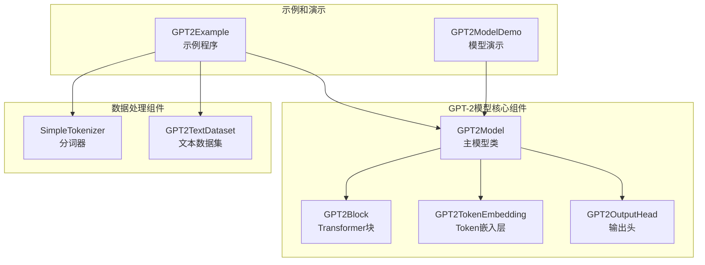
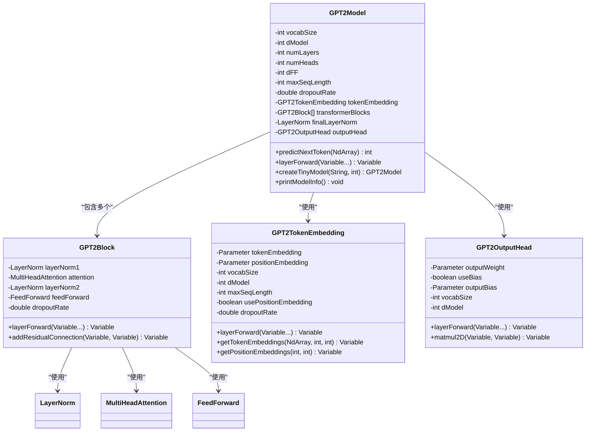
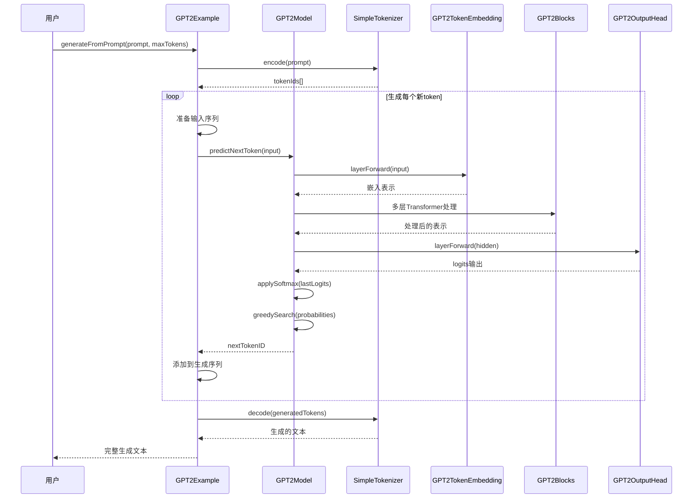
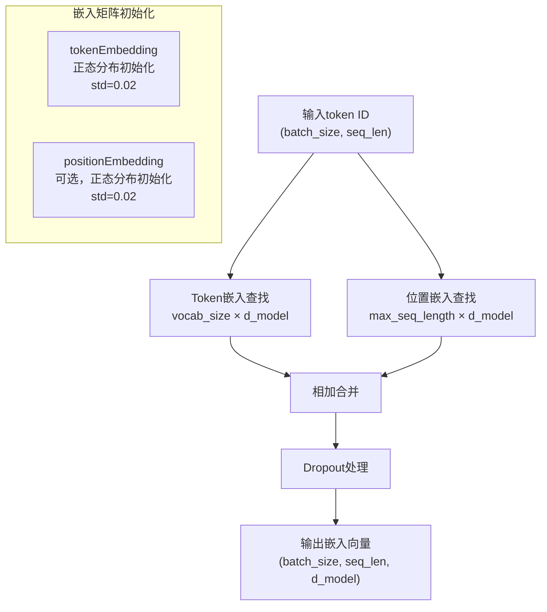
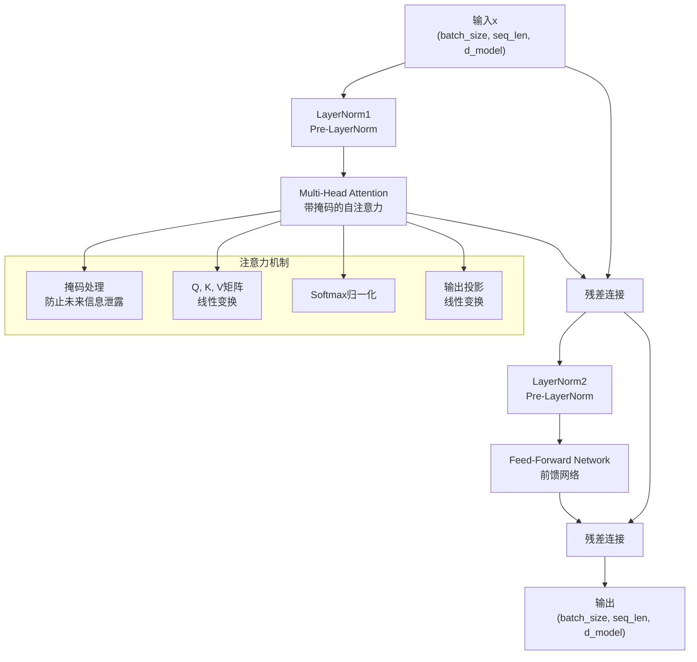
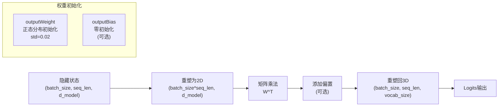
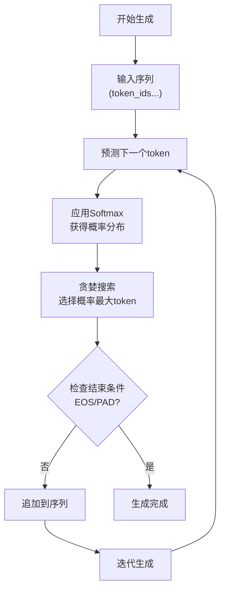

# GPT-2自回归文本生成机制详解

<cite>
**本文档引用的文件**
- [GPT2Model.java](file://tinyai-model-gpt/src/main/java/io/leavesfly/tinyai/gpt/GPT2Model.java)
- [GPT2Example.java](file://tinyai-model-gpt/src/main/java/io/leavesfly/tinyai/gpt/GPT2Example.java)
- [SimpleTokenizer.java](file://tinyai-model-gpt/src/main/java/io/leavesfly/tinyai/gpt/SimpleTokenizer.java)
- [GPT2Block.java](file://tinyai-model-gpt/src/main/java/io/leavesfly/tinyai/gpt/GPT2Block.java)
- [GPT2TokenEmbedding.java](file://tinyai-model-gpt/src/main/java/io/leavesfly/tinyai/gpt/GPT2TokenEmbedding.java)
- [GPT2OutputHead.java](file://tinyai-model-gpt/src/main/java/io/leavesfly/tinyai/gpt/GPT2OutputHead.java)
- [GPT2TextDataset.java](file://tinyai-model-gpt/src/main/java/io/leavesfly/tinyai/gpt/GPT2TextDataset.java)
- [GPT2ModelDemo.java](file://tinyai-model-gpt/src/main/java/io/leavesfly/tinyai/gpt/GPT2ModelDemo.java)
- [Word2Vec.java](file://tinyai-model-gpt/src/main/java/io/leavesfly/tinyai/gpt/Word2Vec.java)
</cite>

## 目录
1. [简介](#简介)
2. [项目结构概览](#项目结构概览)
3. [核心组件分析](#核心组件分析)
4. [自回归生成机制](#自回归生成机制)
5. [详细组件分析](#详细组件分析)
6. [生成策略实现](#生成策略实现)
7. [性能考虑](#性能考虑)
8. [故障排除指南](#故障排除指南)
9. [结论](#结论)

## 简介

GPT-2（Generative Pre-trained Transformer 2）是一种基于Transformer解码器架构的自回归语言模型。本文档深入分析了TinyAI框架中GPT-2模型的自回归生成机制，重点解释模型如何以当前序列作为输入，预测下一个最可能的token，并将其追加到序列中循环生成。

GPT-2的核心创新在于其自回归特性：模型在生成文本时，每次只预测序列中的下一个token，而不是同时预测整个序列。这种机制使得模型能够生成连贯且上下文相关的长文本序列。

## 项目结构概览



**图表来源**
- [GPT2Model.java](file://tinyai-model-gpt/src/main/java/io/leavesfly/tinyai/gpt/GPT2Model.java#L1-L50)
- [GPT2Example.java](file://tinyai-model-gpt/src/main/java/io/leavesfly/tinyai/gpt/GPT2Example.java#L1-L50)

## 核心组件分析

### GPT2Model类架构

GPT2Model是整个GPT-2模型的核心类，它继承自Block基类，实现了完整的Transformer解码器架构：



**图表来源**
- [GPT2Model.java](file://tinyai-model-gpt/src/main/java/io/leavesfly/tinyai/gpt/GPT2Model.java#L30-L80)
- [GPT2Block.java](file://tinyai-model-gpt/src/main/java/io/leavesfly/tinyai/gpt/GPT2Block.java#L25-L50)
- [GPT2TokenEmbedding.java](file://tinyai-model-gpt/src/main/java/io/leavesfly/tinyai/gpt/GPT2TokenEmbedding.java#L20-L60)
- [GPT2OutputHead.java](file://tinyai-model-gpt/src/main/java/io/leavesfly/tinyai/gpt/GPT2OutputHead.java#L20-L50)

**章节来源**
- [GPT2Model.java](file://tinyai-model-gpt/src/main/java/io/leavesfly/tinyai/gpt/GPT2Model.java#L1-L403)
- [GPT2Block.java](file://tinyai-model-gpt/src/main/java/io/leavesfly/tinyai/gpt/GPT2Block.java#L1-L165)

## 自回归生成机制

### 核心生成流程

GPT-2的自回归生成机制遵循以下核心流程：



**图表来源**
- [GPT2Example.java](file://tinyai-model-gpt/src/main/java/io/leavesfly/tinyai/gpt/GPT2Example.java#L200-L300)
- [GPT2Model.java](file://tinyai-model-gpt/src/main/java/io/leavesfly/tinyai/gpt/GPT2Model.java#L350-L403)

### predictNextToken方法详解

`predictNextToken`方法是自回归生成的核心，它实现了从输入序列预测下一个token的功能：

```java
public int predictNextToken(NdArray input) {
    try {
        // 前向传播
        Variable inputVar = new Variable(input);
        Variable output = layerForward(inputVar);  // shape: (1, seq_len, vocab_size)
        
        // 获取最后一个时间步的输出
        NdArray logits = output.getValue();
        int seqLen = logits.getShape().getDimension(1);
        
        // 提取最后一个位置的logits: (vocab_size,)
        NdArray lastLogits = NdArray.of(Shape.of(vocabSize));
        for (int i = 0; i < vocabSize; i++) {
            lastLogits.set(logits.get(0, seqLen - 1, i), i);
        }
        
        // 使用softmax获取概率分布
        NdArray probabilities = applySoftmax(lastLogits);
        
        // 使用贪婪搜索选择最高概率的token
        int maxIndex = 0;
        float maxProb = probabilities.get(0);
        
        for (int i = 1; i < vocabSize; i++) {
            float prob = probabilities.get(i);
            if (prob > maxProb) {
                maxProb = prob;
                maxIndex = i;
            }
        }
        
        return maxIndex;
        
    } catch (Exception e) {
        System.err.println("Error in predictNextToken: " + e.getMessage());
        // 返回未知token ID作为fallback
        return SimpleTokenizer.UNK_ID;
    }
}
```

这个方法的关键步骤包括：

1. **前向传播**：将输入序列通过整个模型，获得每个位置的logits输出
2. **提取最后一个位置**：只关注序列最后一个位置的预测结果
3. **Softmax归一化**：将logits转换为概率分布
4. **贪婪搜索**：选择概率最高的token作为下一个token

**章节来源**
- [GPT2Model.java](file://tinyai-model-gpt/src/main/java/io/leavesfly/tinyai/gpt/GPT2Model.java#L350-L403)

## 详细组件分析

### Token嵌入层分析

GPT2TokenEmbedding负责将离散的token ID转换为连续的向量表示：



**图表来源**
- [GPT2TokenEmbedding.java](file://tinyai-model-gpt/src/main/java/io/leavesfly/tinyai/gpt/GPT2TokenEmbedding.java#L70-L120)

### Transformer块结构

GPT-2使用Pre-LayerNorm架构的Transformer块：



**图表来源**
- [GPT2Block.java](file://tinyai-model-gpt/src/main/java/io/leavesfly/tinyai/gpt/GPT2Block.java#L50-L80)

### 输出头处理

GPT2OutputHead将Transformer的隐藏状态映射到词汇表上的概率分布：



**图表来源**
- [GPT2OutputHead.java](file://tinyai-model-gpt/src/main/java/io/leavesfly/tinyai/gpt/GPT2OutputHead.java#L60-L100)

**章节来源**
- [GPT2TokenEmbedding.java](file://tinyai-model-gpt/src/main/java/io/leavesfly/tinyai/gpt/GPT2TokenEmbedding.java#L1-L233)
- [GPT2Block.java](file://tinyai-model-gpt/src/main/java/io/leavesfly/tinyai/gpt/GPT2Block.java#L1-L165)
- [GPT2OutputHead.java](file://tinyai-model-gpt/src/main/java/io/leavesfly/tinyai/gpt/GPT2OutputHead.java#L1-L169)

## 生成策略实现

### 当前实现：贪婪搜索

目前的GPT-2实现使用贪婪搜索策略，这是最简单的生成策略：



**图表来源**
- [GPT2Example.java](file://tinyai-model-gpt/src/main/java/io/leavesfly/tinyai/gpt/GPT2Example.java#L200-L280)

### 扩展为高级生成策略

虽然当前实现使用贪婪搜索，但可以轻松扩展为更高级的生成策略：

#### Top-K采样

```java
// Top-K采样伪代码
private int sampleTopK(NdArray probabilities, int k) {
    // 获取概率最高的k个token及其概率
    // 使用堆排序或快速选择算法
    // 从这k个token中按概率采样
}
```

#### 温度调节

```java
// 温度调节伪代码
private NdArray applyTemperature(NdArray logits, float temperature) {
    // logits_scaled = logits / temperature
    // probabilities = softmax(logits_scaled)
    return logits.divNum(temperature);
}
```

#### 核采样（Nucleus Sampling）

```java
// 核采样伪代码
private int sampleNucleus(NdArray probabilities, float p) {
    // 排序概率并计算累积概率
    // 选择累积概率不超过p的最小token集合
    // 从该集合中按概率采样
}
```

### 输入序列预处理

生成过程中对输入序列的处理包括：

1. **截断处理**：如果序列长度超过最大长度，截断序列
2. **填充处理**：使用PAD_ID填充到固定长度
3. **注意力掩码**：自动处理因果掩码，防止未来信息泄露

```java
// 输入序列预处理示例
int[] inputTokens = new int[Math.min(generatedTokens.size(), gpt2Model.getMaxSeqLength())];
int startIdx = Math.max(0, generatedTokens.size() - gpt2Model.getMaxSeqLength());

for (int j = 0; j < inputTokens.length; j++) {
    inputTokens[j] = generatedTokens.get(startIdx + j);
}

// 填充到最大长度
int[] paddedTokens = tokenizer.pad(inputTokens, gpt2Model.getMaxSeqLength(), "pre");
```

**章节来源**
- [GPT2Example.java](file://tinyai-model-gpt/src/main/java/io/leavesfly/tinyai/gpt/GPT2Example.java#L200-L280)
- [GPT2Model.java](file://tinyai-model-gpt/src/main/java/io/leavesfly/tinyai/gpt/GPT2Model.java#L350-L403)

## 性能考虑

### 内存优化

1. **序列长度限制**：通过maxSeqLength参数控制内存使用
2. **批处理优化**：支持批量生成提高效率
3. **梯度检查点**：在训练时使用梯度检查点减少内存占用

### 计算优化

1. **矩阵运算**：利用高效的矩阵乘法库
2. **注意力优化**：使用因果掩码避免不必要的计算
3. **并行化**：支持多线程和GPU加速

### 生成速度优化

1. **缓存机制**：缓存注意力权重减少重复计算
2. **批处理生成**：一次生成多个token
3. **提前终止**：检测到EOS后立即停止生成

## 故障排除指南

### 常见问题及解决方案

#### 1. 序列长度超限

**问题**：输入序列长度超过模型的最大序列长度

**解决方案**：
```java
if (seqLen > maxSeqLength) {
    throw new IllegalArgumentException(
        String.format("输入序列长度 %d 超过最大长度 %d", seqLen, maxSeqLength)
    );
}
```

#### 2. Token ID越界

**问题**：token ID超出词汇表范围

**解决方案**：
```java
if (tokenId < 0 || tokenId >= vocabSize) {
    throw new IllegalArgumentException(
        String.format("Token ID %d is out of vocabulary range [0, %d)", tokenId, vocabSize)
    );
}
```

#### 3. 生成质量问题

**可能原因**：
- 模型训练不足
- 生成参数设置不当
- 输入提示不合适

**解决方案**：
- 调整生成参数（如温度、top-k）
- 使用更好的训练数据
- 优化输入提示

**章节来源**
- [GPT2Model.java](file://tinyai-model-gpt/src/main/java/io/leavesfly/tinyai/gpt/GPT2Model.java#L150-L180)
- [GPT2TokenEmbedding.java](file://tinyai-model-gpt/src/main/java/io/leavesfly/tinyai/gpt/GPT2TokenEmbedding.java#L100-L120)

## 结论

GPT-2的自回归生成机制是一个精心设计的系统，通过以下关键组件协同工作：

1. **Token嵌入层**：将离散token转换为连续向量表示
2. **Transformer解码器**：通过多层自注意力机制捕获上下文信息
3. **输出头**：将隐藏状态映射到词汇表概率分布
4. **自回归策略**：逐token生成，保持上下文一致性

当前实现使用简单的贪婪搜索策略，但具有良好的扩展性，可以轻松集成更高级的生成技术如top-k采样、温度调节和核采样。通过合理的参数调优和优化策略，可以生成高质量的连贯文本。

这种自回归架构的优势在于：
- **简单高效**：实现相对简单，计算效率高
- **上下文感知**：能够捕捉长距离依赖关系
- **灵活可控**：可以通过多种策略控制生成质量
- **广泛适用**：适用于各种文本生成任务

未来的改进方向包括：
- 实现更复杂的采样策略
- 优化内存和计算效率
- 支持流式生成
- 增强控制能力（如风格控制、主题引导）