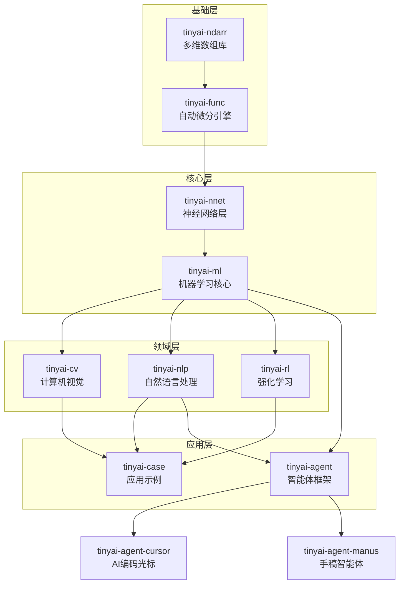
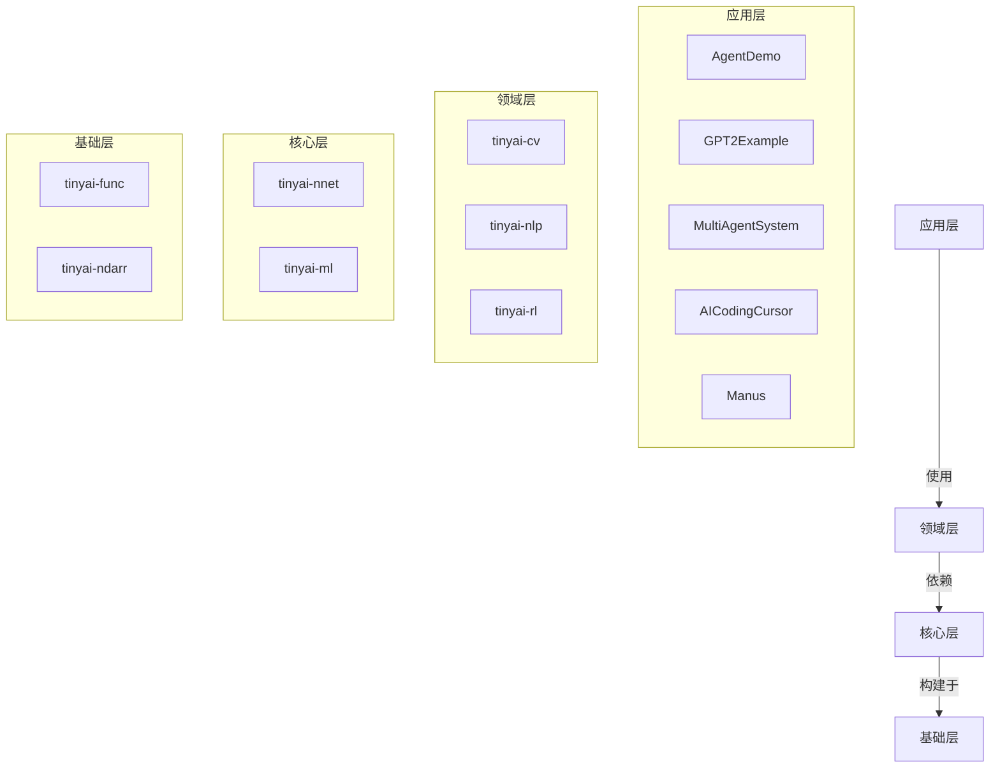
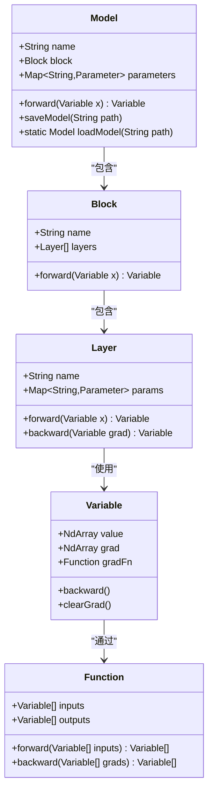
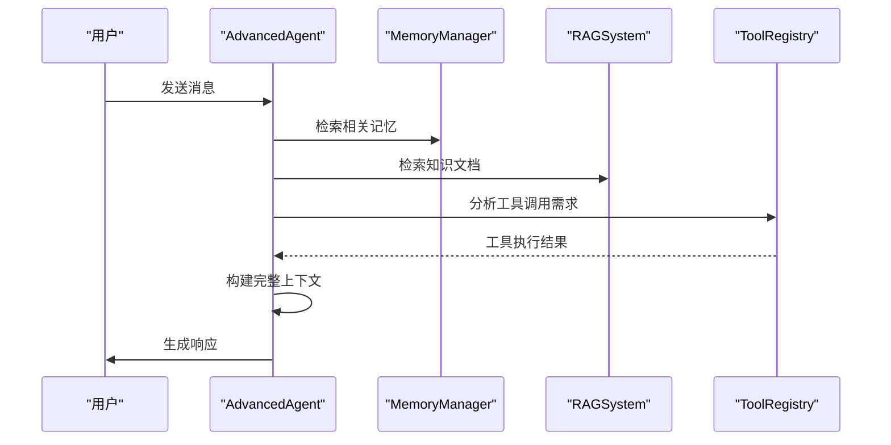
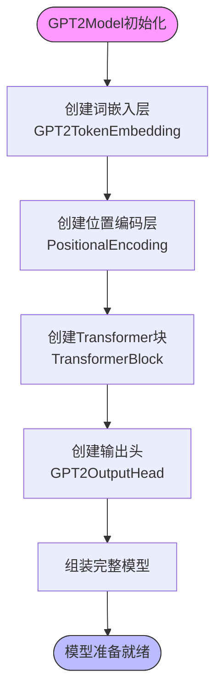
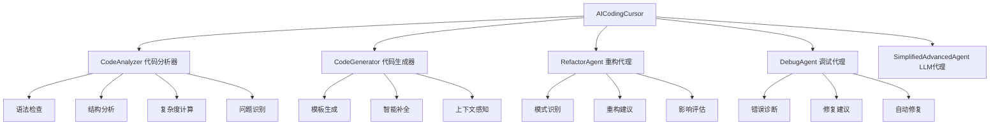
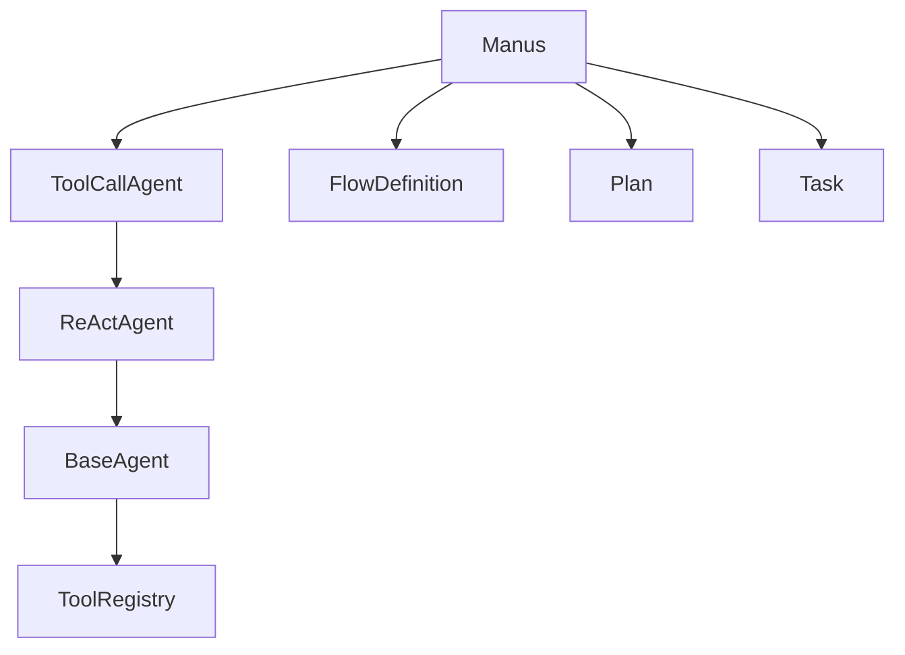
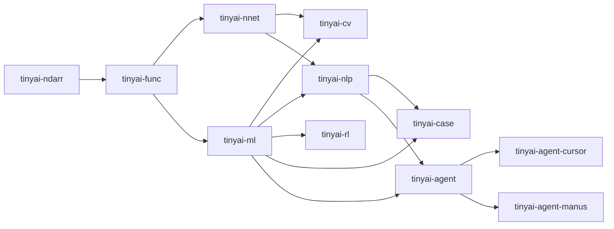

# 项目概述

<cite>
**本文档引用的文件**
- [README.md](file://README.md)
- [tinyai-agent-base/README.md](file://tinyai-agent-base/README.md)
- [tinyai-agent-base/src/main/java/io/leavesfly/tinyai/agent/AdvancedAgent.java](file://tinyai-agent-base/src/main/java/io/leavesfly/tinyai/agent/AdvancedAgent.java)
- [tinyai-agent-base/src/main/java/io/leavesfly/tinyai/agent/AgentDemo.java](file://tinyai-agent-base/src/main/java/io/leavesfly/tinyai/agent/AgentDemo.java)
- [tinyai-model-gpt/src/main/java/io/leavesfly/tinyai/gpt/GPT2Example.java](file://tinyai-model-gpt/src/main/java/io/leavesfly/tinyai/gpt/GPT2Example.java)
- [tinyai-model-gpt/src/main/java/io/leavesfly/tinyai/gpt/GPT2Model.java](file://tinyai-model-gpt/src/main/java/io/leavesfly/tinyai/gpt/GPT2Model.java)
- [tinyai-deeplearning-ml/src/main/java/io/leavesfly/tinyai/ml/Trainer.java](file://tinyai-deeplearning-ml/src/main/java/io/leavesfly/tinyai/ml/Trainer.java)
- [tinyai-deeplearning-ml/src/main/java/io/leavesfly/tinyai/ml/Model.java](file://tinyai-deeplearning-ml/src/main/java/io/leavesfly/tinyai/ml/Model.java)
- [tinyai-deeplearning-ndarr/src/main/java/io/leavesfly/tinyai/ndarr/NdArray.java](file://tinyai-deeplearning-ndarr/src/main/java/io/leavesfly/tinyai/ndarr/NdArray.java)
- [tinyai-deeplearning-func/src/main/java/io/leavesfly/tinyai/func/Variable.java](file://tinyai-deeplearning-func/src/main/java/io/leavesfly/tinyai/func/Variable.java)
- [tinyai-deeplearning-nnet/src/main/java/io/leavesfly/tinyai/nnet/layer/dnn/AffineLayer.java](file://tinyai-deeplearning-nnet/src/main/java/io/leavesfly/tinyai/nnet/layer/dnn/AffineLayer.java)
- [tinyai-deeplearning-nnet/src/main/java/io/leavesfly/tinyai/nnet/block/MlpBlock.java](file://tinyai-deeplearning-nnet/src/main/java/io/leavesfly/tinyai/nnet/block/MlpBlock.java)
- [tinyai-deeplearning-rl/src/main/java/io/leavesfly/tinyai/rl/agent/DQNAgent.java](file://tinyai-deeplearning-rl/src/main/java/io/leavesfly/tinyai/rl/agent/DQNAgent.java)
- [tinyai-agent-multi/src/main/java/io/leavesfly/tinyai/agent/multi/MultiAgentSystem.java](file://tinyai-agent-multi/src/main/java/io/leavesfly/tinyai/agent/multi/MultiAgentSystem.java)
- [tinyai-agent-pattern/src/main/java/io/leavesfly/tinyai/agent/pattern/ReActAgent.java](file://tinyai-agent-pattern/src/main/java/io/leavesfly/tinyai/agent/pattern/ReActAgent.java)
- [tinyai-agent-cursor/README.md](file://tinyai-agent-cursor/README.md) - *新增AI编码光标模块*
- [tinyai-agent-manus/README.md](file://tinyai-agent-manus/README.md) - *新增手稿智能体模块*
- [tinyai-model-gpt/README.md](file://tinyai-model-gpt/README.md) - *更新模型模块文档*
- [tinyai-model-qwen/README.md](file://tinyai-model-qwen/README.md) - *更新模型模块文档*
</cite>

## 更新摘要
**变更内容**
- 新增AI编码光标模块（tinyai-agent-cursor）的详细说明
- 新增手稿智能体模块（tinyai-agent-manus）的详细说明
- 更新模型模块（tinyai-model-gpt, tinyai-model-qwen）的架构描述
- 扩展智能体系统分析部分，涵盖新模块功能
- 更新项目结构图以反映新增模块
- 更新依赖分析图以包含新模块依赖关系

## 目录
1. [简介](#简介)
2. [项目结构](#项目结构)
3. [核心组件](#核心组件)
4. [架构概述](#架构概述)
5. [详细组件分析](#详细组件分析)
6. [依赖分析](#依赖分析)
7. [性能考虑](#性能考虑)
8. [故障排除指南](#故障排除指南)
9. [结论](#结论)

## 简介
TinyAI 是一个完全使用 Java 开发的现代化深度学习框架，专为教育、研究和生产环境设计。该框架提供了从底层张量运算到高级AI智能体的完整技术栈，支持传统深度学习、大语言模型、强化学习和多智能体系统等前沿AI技术。项目采用模块化设计，包含从基础数值计算到高级AI应用的完整技术栈，旨在为开发者提供一个全面、易用且可扩展的Java深度学习解决方案。近期更新新增了AI编码光标和手稿智能体两大模块，进一步扩展了框架在智能编程辅助和复杂任务处理方面的能力。

**Section sources**
- [README.md](file://README.md#L1-L50)
- [tinyai-agent-cursor/README.md](file://tinyai-agent-cursor/README.md#L1-L50) - *新增AI编码光标模块*
- [tinyai-agent-manus/README.md](file://tinyai-agent-manus/README.md#L1-L50) - *新增手稿智能体模块*

## 项目结构
TinyAI项目采用模块化架构，将不同功能划分为独立的Maven模块，每个模块专注于特定的技术领域。这种设计不仅提高了代码的可维护性，还允许开发者根据需要选择性地使用特定模块。项目结构清晰地反映了从底层基础库到高级应用的分层架构。近期新增的`tinyai-agent-cursor`和`tinyai-agent-manus`模块进一步丰富了智能体系统的功能，分别提供了智能编程辅助和复杂任务处理能力。

**Diagram sources**
- [README.md](file://README.md#L55-L100)
- [tinyai-agent-cursor/README.md](file://tinyai-agent-cursor/README.md#L1-L50) - *新增AI编码光标模块*
- [tinyai-agent-manus/README.md](file://tinyai-agent-manus/README.md#L1-L50) - *新增手稿智能体模块*

**Section sources**
- [README.md](file://README.md#L55-L100)
- [tinyai-agent-cursor/README.md](file://tinyai-agent-cursor/README.md#L1-L50) - *新增AI编码光标模块*
- [tinyai-agent-manus/README.md](file://tinyai-agent-manus/README.md#L1-L50) - *新增手稿智能体模块*

## 核心组件
TinyAI框架的核心组件构成了其技术栈的基础，包括多维数组库、自动微分引擎、神经网络层和机器学习核心。这些组件共同实现了深度学习框架的基本功能，为上层应用提供了坚实的基础。`NdArray`类提供了高效的多维数组操作，是整个框架的数值计算基础；`Variable`类实现了计算图节点，支持自动微分；`Model`类封装了神经网络模型的训练和推理逻辑；`Trainer`类则提供了完整的训练循环管理。近期更新的模型模块（tinyai-model-gpt, tinyai-model-qwen）进一步增强了框架在大语言模型方面的能力。

**Section sources**
- [tinyai-deeplearning-ndarr/src/main/java/io/leavesfly/tinyai/ndarr/NdArray.java](file://tinyai-deeplearning-ndarr/src/main/java/io/leavesfly/tinyai/ndarr/NdArray.java#L1-L50)
- [tinyai-deeplearning-func/src/main/java/io/leavesfly/tinyai/func/Variable.java](file://tinyai-deeplearning-func/src/main/java/io/leavesfly/tinyai/func/Variable.java#L1-L50)
- [tinyai-deeplearning-ml/src/main/java/io/leavesfly/tinyai/ml/Model.java](file://tinyai-deeplearning-ml/src/main/java/io/leavesfly/tinyai/ml/Model.java#L1-L50)
- [tinyai-deeplearning-ml/src/main/java/io/leavesfly/tinyai/ml/Trainer.java](file://tinyai-deeplearning-ml/src/main/java/io/leavesfly/tinyai/ml/Trainer.java#L1-L50)
- [tinyai-model-gpt/README.md](file://tinyai-model-gpt/README.md#L1-L50) - *更新模型模块文档*
- [tinyai-model-qwen/README.md](file://tinyai-model-qwen/README.md#L1-L50) - *更新模型模块文档*

## 架构概述
TinyAI的架构设计遵循分层原则，从底层数值计算到高层应用逻辑形成了清晰的技术栈。框架的核心是自动微分引擎，它基于计算图实现了前向和反向传播算法。神经网络层组件提供了各种预定义的网络层，如线性层、卷积层、循环层和注意力机制层，这些层可以通过`SequentialBlock`等容器进行组合。机器学习核心组件则封装了训练、优化、评估等高级功能，为模型训练提供了完整的解决方案。近期新增的智能体模块扩展了框架的应用能力，形成了更加完整的AI技术栈。

**Diagram sources**
- [README.md](file://README.md#L55-L100)
- [tinyai-deeplearning-ml/src/main/java/io/leavesfly/tinyai/ml/Trainer.java](file://tinyai-deeplearning-ml/src/main/java/io/leavesfly/tinyai/ml/Trainer.java#L1-L20)

**Section sources**
- [README.md](file://README.md#L55-L100)
- [tinyai-agent-cursor/README.md](file://tinyai-agent-cursor/README.md#L1-L50) - *新增AI编码光标模块*
- [tinyai-agent-manus/README.md](file://tinyai-agent-manus/README.md#L1-L50) - *新增手稿智能体模块*

## 详细组件分析

### 深度学习核心组件分析
TinyAI的深度学习核心组件实现了现代深度学习框架的关键功能。`Variable`类作为计算图的基本单元，不仅存储数值数据，还维护了计算图的拓扑结构，支持自动梯度计算。`Function`抽象类定义了各种数学运算，每个函数实现都包含了前向计算和反向传播逻辑。`Model`类通过组合`Block`和`Layer`对象来构建复杂的神经网络架构，支持参数管理和模型序列化。

**Diagram sources**
- [tinyai-deeplearning-func/src/main/java/io/leavesfly/tinyai/func/Variable.java](file://tinyai-deeplearning-func/src/main/java/io/leavesfly/tinyai/func/Variable.java#L1-L45)
- [tinyai-deeplearning-func/src/main/java/io/leavesfly/tinyai/func/Function.java](file://tinyai-deeplearning-func/src/main/java/io/leavesfly/tinyai/func/Function.java#L1-L30)
- [tinyai-deeplearning-ml/src/main/java/io/leavesfly/tinyai/ml/Model.java](file://tinyai-deeplearning-ml/src/main/java/io/leavesfly/tinyai/ml/Model.java#L1-L40)
- [tinyai-deeplearning-nnet/src/main/java/io/leavesfly/tinyai/nnet/Block.java](file://tinyai-deeplearning-nnet/src/main/java/io/leavesfly/tinyai/nnet/Block.java#L1-L25)
- [tinyai-deeplearning-nnet/src/main/java/io/leavesfly/tinyai/nnet/Layer.java](file://tinyai-deeplearning-nnet/src/main/java/io/leavesfly/tinyai/nnet/Layer.java#L1-L30)

**Section sources**
- [tinyai-deeplearning-func/src/main/java/io/leavesfly/tinyai/func/Variable.java](file://tinyai-deeplearning-func/src/main/java/io/leavesfly/tinyai/func/Variable.java#L1-L100)
- [tinyai-deeplearning-ml/src/main/java/io/leavesfly/tinyai/ml/Model.java](file://tinyai-deeplearning-ml/src/main/java/io/leavesfly/tinyai/ml/Model.java#L1-L100)

### AI智能体系统分析
TinyAI的智能体系统提供了从单智能体到多智能体的完整解决方案。`AdvancedAgent`类作为基础智能体，集成了记忆管理、RAG（检索增强生成）和工具调用等核心功能。`SelfEvolvingAgent`实现了自我进化能力，能够通过反思和经验积累不断改进自身性能。`MultiAgentSystem`支持多个智能体之间的协作与通信，适用于复杂的任务分解和协同工作场景。近期新增的`AICodingCursor`和`Manus`模块进一步扩展了智能体系统的能力。

**Diagram sources**
- [tinyai-agent-base/src/main/java/io/leavesfly/tinyai/agent/AdvancedAgent.java](file://tinyai-agent-base/src/main/java/io/leavesfly/tinyai/agent/AdvancedAgent.java#L1-L50)
- [tinyai-agent-base/src/main/java/io/leavesfly/tinyai/agent/MemoryManager.java](file://tinyai-agent-base/src/main/java/io/leavesfly/tinyai/agent/MemoryManager.java#L1-L30)
- [tinyai-agent-base/src/main/java/io/leavesfly/tinyai/agent/RAGSystem.java](file://tinyai-agent-base/src/main/java/io/leavesfly/tinyai/agent/RAGSystem.java#L1-L30)
- [tinyai-agent-base/src/main/java/io/leavesfly/tinyai/agent/ToolRegistry.java](file://tinyai-agent-base/src/main/java/io/leavesfly/tinyai/agent/ToolRegistry.java#L1-L30)
- [tinyai-agent-cursor/src/main/java/io/leavesfly/tinyai/agent/cursor/AICodingCursor.java](file://tinyai-agent-cursor/src/main/java/io/leavesfly/tinyai/agent/cursor/AICodingCursor.java#L1-L50) - *新增AI编码光标模块*
- [tinyai-agent-manus/src/main/java/io/leavesfly/tinyai/agent/manus/Manus.java](file://tinyai-agent-manus/src/main/java/io/leavesfly/tinyai/agent/manus/Manus.java#L1-L50) - *新增手稿智能体模块*

**Section sources**
- [tinyai-agent-base/src/main/java/io/leavesfly/tinyai/agent/AdvancedAgent.java](file://tinyai-agent-base/src/main/java/io/leavesfly/tinyai/agent/AdvancedAgent.java#L1-L100)
- [tinyai-agent-evol/src/main/java/io/leavesfly/tinyai/agent/evol/SelfEvolvingAgent.java](file://tinyai-agent-evol/src/main/java/io/leavesfly/tinyai/agent/evol/SelfEvolvingAgent.java#L1-L80)
- [tinyai-agent-multi/src/main/java/io/leavesfly/tinyai/agent/multi/MultiAgentSystem.java](file://tinyai-agent-multi/src/main/java/io/leavesfly/tinyai/agent/multi/MultiAgentSystem.java#L1-L90)
- [tinyai-agent-cursor/README.md](file://tinyai-agent-cursor/README.md#L1-L100) - *新增AI编码光标模块*
- [tinyai-agent-manus/README.md](file://tinyai-agent-manus/README.md#L1-L100) - *新增手稿智能体模块*

### 自然语言处理模型分析
TinyAI的自然语言处理模块实现了多种先进的语言模型架构。`GPT2Model`类实现了GPT-2语言模型，包含Transformer解码器、词嵌入和位置编码等组件。`MoEGPTModel`实现了专家混合（Mixture of Experts）架构，通过门控网络动态选择专家子模型，提高了模型的容量和效率。`DeepSeekV3Model`则实现了更复杂的推理和反思机制，支持代码生成和复杂问题解决。近期更新的`Qwen3Model`实现了现代大语言模型的先进技术。

**Diagram sources**
- [tinyai-model-gpt/src/main/java/io/leavesfly/tinyai/gpt/GPT2Model.java](file://tinyai-model-gpt/src/main/java/io/leavesfly/tinyai/gpt/GPT2Model.java#L1-L60)
- [tinyai-model-gpt/src/main/java/io/leavesfly/tinyai/gpt/GPT2TokenEmbedding.java](file://tinyai-model-gpt/src/main/java/io/leavesfly/tinyai/gpt/GPT2TokenEmbedding.java#L1-L25)
- [tinyai-model-gpt/src/main/java/io/leavesfly/tinyai/gpt/PositionalEncoding.java](file://tinyai-model-gpt/src/main/java/io/leavesfly/tinyai/gpt/PositionalEncoding.java#L1-L20)
- [tinyai-model-gpt/src/main/java/io/leavesfly/tinyai/gpt/GPT2OutputHead.java](file://tinyai-model-gpt/src/main/java/io/leavesfly/tinyai/gpt/GPT2OutputHead.java#L1-L20)
- [tinyai-model-qwen/src/main/java/io/leavesfly/tinyai/qwen3/Qwen3Model.java](file://tinyai-model-qwen/src/main/java/io/leavesfly/tinyai/qwen3/Qwen3Model.java#L1-L50) - *更新模型模块文档*

**Section sources**
- [tinyai-model-gpt/src/main/java/io/leavesfly/tinyai/gpt/GPT2Model.java](file://tinyai-model-gpt/src/main/java/io/leavesfly/tinyai/gpt/GPT2Model.java#L1-L100)
- [tinyai-model-moe/src/main/java/io/leavesfly/tinyai/nlp/MoEGPTModel.java](file://tinyai-model-moe/src/main/java/io/leavesfly/tinyai/nlp/MoEGPTModel.java#L1-L90)
- [tinyai-model-deepseek/src/main/java/io/leavesfly/tinyai/deepseek/v3/DeepSeekV3Model.java](file://tinyai-model-deepseek/src/main/java/io/leavesfly/tinyai/deepseek/v3/DeepSeekV3Model.java#L1-L85)
- [tinyai-model-gpt/README.md](file://tinyai-model-gpt/README.md#L1-L100) - *更新模型模块文档*
- [tinyai-model-qwen/README.md](file://tinyai-model-qwen/README.md#L1-L100) - *更新模型模块文档*

### AI编码光标模块分析
AI编码光标模块（AICodingCursor）是一个功能完整的Java智能编程助手系统，基于Python版本重新设计并充分利用了TinyAI项目中已有的组件。系统具备代码理解、生成、分析、重构和调试等核心能力，为Java开发者提供全方位的编程辅助。该模块实现了智能代码分析、智能代码生成、智能重构建议、智能调试辅助和AI智能对话五大核心特性。

**Diagram sources**
- [tinyai-agent-cursor/src/main/java/io/leavesfly/tinyai/agent/cursor/AICodingCursor.java](file://tinyai-agent-cursor/src/main/java/io/leavesfly/tinyai/agent/cursor/AICodingCursor.java#L1-L100) - *新增AI编码光标模块*
- [tinyai-agent-cursor/src/main/java/io/leavesfly/tinyai/agent/cursor/CodeAnalyzer.java](file://tinyai-agent-cursor/src/main/java/io/leavesfly/tinyai/agent/cursor/CodeAnalyzer.java#L1-L50) - *新增AI编码光标模块*
- [tinyai-agent-cursor/src/main/java/io/leavesfly/tinyai/agent/cursor/CodeGenerator.java](file://tinyai-agent-cursor/src/main/java/io/leavesfly/tinyai/agent/cursor/CodeGenerator.java#L1-L50) - *新增AI编码光标模块*

**Section sources**
- [tinyai-agent-cursor/README.md](file://tinyai-agent-cursor/README.md#L1-L100) - *新增AI编码光标模块*
- [tinyai-agent-cursor/src/main/java/io/leavesfly/tinyai/agent/cursor/AICodingCursor.java](file://tinyai-agent-cursor/src/main/java/io/leavesfly/tinyai/agent/cursor/AICodingCursor.java#L1-L599) - *新增AI编码光标模块*

### 手稿智能体模块分析
手稿智能体模块（Manus）基于Python版本的OpenManus Agent系统，成功实现了Java版本的完整移植，并复用了TinyAI项目中已有的`tinyai-agent-*`模块的实现。系统具备双执行机制、分层架构、计划驱动任务分解和动态工具调用四大核心特征。该模块采用四层架构设计：BaseAgent（基础层）、ReActAgent（推理行动层）、ToolCallAgent（工具调用层）和Manus（核心控制层）。

**Diagram sources**
- [tinyai-agent-manus/src/main/java/io/leavesfly/tinyai/agent/manus/Manus.java](file://tinyai-agent-manus/src/main/java/io/leavesfly/tinyai/agent/manus/Manus.java#L1-L100) - *新增手稿智能体模块*
- [tinyai-agent-manus/src/main/java/io/leavesfly/tinyai/agent/manus/ToolCallAgent.java](file://tinyai-agent-manus/src/main/java/io/leavesfly/tinyai/agent/manus/ToolCallAgent.java#L1-L50) - *新增手稿智能体模块*
- [tinyai-agent-manus/src/main/java/io/leavesfly/tinyai/agent/manus/ReActAgent.java](file://tinyai-agent-manus/src/main/java/io/leavesfly/tinyai/agent/manus/ReActAgent.java#L1-L50) - *新增手稿智能体模块*

**Section sources**
- [tinyai-agent-manus/README.md](file://tinyai-agent-manus/README.md#L1-L100) - *新增手稿智能体模块*
- [tinyai-agent-manus/src/main/java/io/leavesfly/tinyai/agent/manus/Manus.java](file://tinyai-agent-manus/src/main/java/io/leavesfly/tinyai/agent/manus/Manus.java#L1-L538) - *新增手稿智能体模块*

## 依赖分析
TinyAI项目的模块间依赖关系清晰地反映了其分层架构。基础模块如`tinyai-ndarr`和`tinyai-func`被核心模块`tinyai-nnet`和`tinyai-ml`所依赖，而这些核心模块又为领域模块`tinyai-cv`、`tinyai-nlp`和`tinyai-rl`提供支持。应用模块`tinyai-case`和`tinyai-agent`则依赖于多个下层模块，形成了完整的应用解决方案。近期新增的`tinyai-agent-cursor`和`tinyai-agent-manus`模块依赖于`tinyai-agent-base`和`tinyai-agent-pattern`等现有模块，体现了良好的模块复用设计。

**Diagram sources**
- [pom.xml](file://pom.xml#L1-L50)
- [tinyai-deeplearning-ml/pom.xml](file://tinyai-deeplearning-ml/pom.xml#L1-L30)
- [tinyai-agent-cursor/pom.xml](file://tinyai-agent-cursor/pom.xml#L1-L30) - *新增AI编码光标模块*
- [tinyai-agent-manus/pom.xml](file://tinyai-agent-manus/pom.xml#L1-L30) - *新增手稿智能体模块*

**Section sources**
- [pom.xml](file://pom.xml#L1-L100)
- [tinyai-deeplearning-ml/pom.xml](file://tinyai-deeplearning-ml/pom.xml#L1-L50)
- [tinyai-agent-cursor/pom.xml](file://tinyai-agent-cursor/pom.xml#L1-L50) - *新增AI编码光标模块*
- [tinyai-agent-manus/pom.xml](file://tinyai-agent-manus/pom.xml#L1-L50) - *新增手稿智能体模块*

## 性能考虑
TinyAI框架在设计时充分考虑了性能优化。通过高效的`NdArray`实现和优化的矩阵运算，框架在CPU上也能提供良好的计算性能。自动微分引擎采用了内存优化策略，包括梯度清理和内存复用，有效减少了内存占用。训练器组件支持并行训练，可以利用多核CPU提升训练效率。模型序列化功能支持压缩存储和增量保存，既节省了存储空间又加快了加载速度。此外，框架还提供了训练监控功能，帮助开发者分析性能瓶颈并进行优化。新增的AI编码光标和手稿智能体模块也充分考虑了性能优化，如代码分析器的缓存机制和智能体系统的并发安全设计。

**Section sources**
- [tinyai-deeplearning-ndarr/src/main/java/io/leavesfly/tinyai/ndarr/NdArray.java](file://tinyai-deeplearning-ndarr/src/main/java/io/leavesfly/tinyai/ndarr/NdArray.java#L100-L200)
- [tinyai-deeplearning-ml/src/main/java/io/leavesfly/tinyai/ml/Trainer.java](file://tinyai-deeplearning-ml/src/main/java/io/leavesfly/tinyai/ml/Trainer.java#L200-L300)
- [tinyai-deeplearning-ml/src/main/java/io/leavesfly/tinyai/ml/ModelSerializer.java](file://tinyai-deeplearning-ml/src/main/java/io/leavesfly/tinyai/ml/ModelSerializer.java#L50-L150)
- [tinyai-agent-cursor/src/main/java/io/leavesfly/tinyai/agent/cursor/CodeAnalyzer.java](file://tinyai-agent-cursor/src/main/java/io/leavesfly/tinyai/agent/cursor/CodeAnalyzer.java#L100-L200) - *新增AI编码光标模块*
- [tinyai-agent-manus/src/main/java/io/leavesfly/tinyai/agent/manus/Manus.java](file://tinyai-agent-manus/src/main/java/io/leavesfly/tinyai/agent/manus/Manus.java#L100-L200) - *新增手稿智能体模块*

## 故障排除指南
在使用TinyAI框架时，可能会遇到一些常见问题。对于内存不足问题，建议检查`NdArray`的使用情况，确保及时清理不再需要的变量。训练不收敛问题可能源于学习率设置不当或数据预处理错误，建议使用`Monitor`类监控训练过程并调整超参数。模型序列化问题通常与文件路径或权限有关，应确保目标路径可写且有足够的磁盘空间。对于依赖冲突问题，应检查`pom.xml`文件中的版本兼容性，并使用Maven的依赖树分析功能定位冲突。新增模块的使用问题可参考其README文档中的具体说明。

**Section sources**
- [tinyai-deeplearning-func/src/main/java/io/leavesfly/tinyai/func/Variable.java](file://tinyai-deeplearning-func/src/main/java/io/leavesfly/tinyai/func/Variable.java#L200-L300)
- [tinyai-deeplearning-ml/src/main/java/io/leavesfly/tinyai/ml/Monitor.java](file://tinyai-deeplearning-ml/src/main/java/io/leavesfly/tinyai/ml/Monitor.java#L1-L100)
- [tinyai-deeplearning-ml/src/main/java/io/leavesfly/tinyai/ml/ModelSerializer.java](file://tinyai-deeplearning-ml/src/main/java/io/leavesfly/tinyai/ml/ModelSerializer.java#L1-L50)
- [tinyai-agent-cursor/README.md](file://tinyai-agent-cursor/README.md#L1-L100) - *新增AI编码光标模块*
- [tinyai-agent-manus/README.md](file://tinyai-agent-manus/README.md#L1-L100) - *新增手稿智能体模块*

## 结论
TinyAI作为一个纯Java开发的深度学习框架，成功地将复杂的AI技术栈整合到一个统一的平台中。从底层的张量运算到高级的AI智能体系统，框架提供了完整的解决方案，适用于教育、研究和生产环境。其模块化设计和清晰的分层架构使得代码易于理解和扩展。通过提供丰富的示例和详细的文档，TinyAI降低了深度学习技术的使用门槛，为Java开发者进入AI领域提供了有力的支持。近期新增的AI编码光标和手稿智能体模块进一步扩展了框架的应用场景，使其在智能编程辅助和复杂任务处理方面具备了更强的能力。未来，框架可以进一步集成更多先进的模型架构和优化技术，扩大其在实际应用中的影响力。