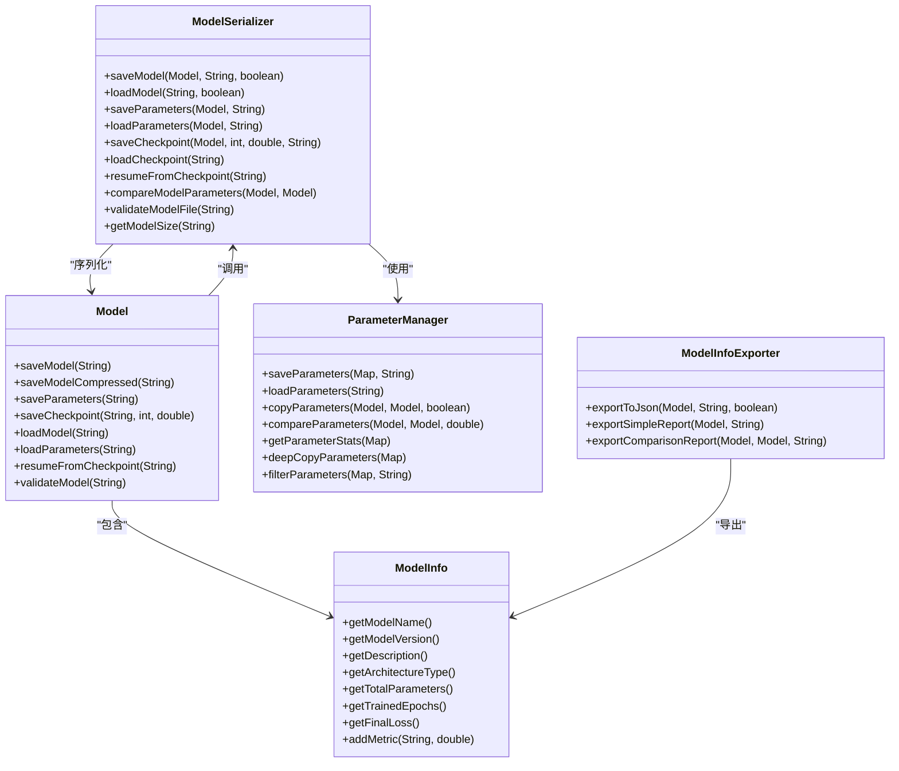

# 模型序列化功能文档

<cite>
**本文档中引用的文件**
- [ModelSerializer.java](file://tinyai-dl-ml/src/main/java/io/leavesfly/tinyai/ml/ModelSerializer.java)
- [Model.java](file://tinyai-dl-ml/src/main/java/io/leavesfly/tinyai/ml/Model.java)
- [ModelInfo.java](file://tinyai-dl-ml/src/main/java/io/leavesfly/tinyai/ml/ModelInfo.java)
- [ParameterManager.java](file://tinyai-dl-ml/src/main/java/io/leavesfly/tinyai/ml/ParameterManager.java)
- [ModelInfoExporter.java](file://tinyai-dl-ml/src/main/java/io/leavesfly/tinyai/ml/ModelInfoExporter.java)
- [ModelSerializationExample.java](file://tinyai-dl-case/src/main/java/io/leavesfly/tinyai/example/ModelSerializationExample.java)
- [ModelSerializerTest.java](file://tinyai-dl-ml/src/test/java/io/leavesfly/tinyai/ml/ModelSerializerTest.java)
</cite>

## 目录
1. [简介](#简介)
2. [核心组件概览](#核心组件概览)
3. [ModelSerializer类详解](#modelserializer类详解)
4. [Model类集成方法](#model类集成方法)
5. [参数管理系统](#参数管理系统)
6. [检查点机制](#检查点机制)
7. [模型验证与比较](#模型验证与比较)
8. [JSON导出功能](#json导出功能)
9. [使用示例](#使用示例)
10. [最佳实践](#最佳实践)
11. [故障排除指南](#故障排除指南)

## 简介

TinyDL框架提供了完整的模型序列化功能，支持模型的保存、加载和管理。该系统设计灵活，能够处理不同类型的模型文件格式，包括完整模型保存、仅参数保存、压缩保存和检查点机制。通过ModelSerializer类，开发者可以轻松实现模型的持久化和迁移学习功能。

## 核心组件概览



**图表来源**
- [ModelSerializer.java](file://tinyai-dl-ml/src/main/java/io/leavesfly/tinyai/ml/ModelSerializer.java#L1-L396)
- [Model.java](file://tinyai-dl-ml/src/main/java/io/leavesfly/tinyai/ml/Model.java#L1-L361)
- [ParameterManager.java](file://tinyai-dl-ml/src/main/java/io/leavesfly/tinyai/ml/ParameterManager.java#L1-L471)

## ModelSerializer类详解

ModelSerializer是整个序列化系统的核心类，提供了丰富的模型序列化和反序列化功能。

### 主要功能特性

1. **完整模型保存** - 包含架构和参数的完整模型保存
2. **压缩保存** - 支持GZIP压缩以减少文件大小
3. **仅参数保存** - 灵活的参数独立序列化
4. **检查点功能** - 训练过程中的状态保存
5. **模型验证** - 验证模型文件完整性
6. **参数比较** - 比较两个模型的参数

### 核心方法分析

#### 保存完整模型

```java
public static void saveModel(Model model, String filePath, boolean compress) {
    try {
        File file = new File(filePath);
        createDirectoryIfNotExists(file.getParentFile());

        if (compress) {
            try (FileOutputStream fos = new FileOutputStream(file);
                 GZIPOutputStream gzos = new GZIPOutputStream(fos);
                 ObjectOutputStream oos = new ObjectOutputStream(gzos)) {
                oos.writeObject(model);
            }
        } else {
            try (FileOutputStream fos = new FileOutputStream(file);
                 ObjectOutputStream oos = new ObjectOutputStream(fos)) {
                oos.writeObject(model);
            }
        }
    } catch (IOException e) {
        throw new RuntimeException("Failed to save model: " + e.getMessage(), e);
    }
}
```

该方法支持两种保存模式：
- **非压缩模式**：直接序列化模型对象，适合调试和开发阶段
- **压缩模式**：使用GZIP压缩减少文件大小，适合生产环境

#### 自动检测压缩格式

```java
public static Model loadModel(String filePath) {
    // 首先尝试非压缩加载
    try {
        return loadModel(filePath, false);
    } catch (Exception e) {
        // 如果失败，尝试压缩格式加载
        try {
            return loadModel(filePath, true);
        } catch (Exception e2) {
            throw new RuntimeException("Failed to load model, tried both compressed and uncompressed formats", e2);
        }
    }
}
```

这种设计允许用户无需关心文件格式，系统会自动检测并加载正确的格式。

**章节来源**
- [ModelSerializer.java](file://tinyai-dl-ml/src/main/java/io/leavesfly/tinyai/ml/ModelSerializer.java#L30-L81)

## Model类集成方法

Model类提供了便捷的序列化方法，直接调用ModelSerializer的对应功能。

### 保存方法

```java
// 保存完整模型
public void saveModel(String filePath) {
    ModelSerializer.saveModel(this, filePath);
}

// 保存压缩模型
public void saveModelCompressed(String filePath) {
    ModelSerializer.saveModel(this, filePath, true);
}

// 仅保存模型参数
public void saveParameters(String filePath) {
    ModelSerializer.saveParameters(this, filePath);
}

// 保存训练检查点
public void saveCheckpoint(String filePath, int epoch, double loss) {
    // 更新模型信息
    if (modelInfo != null) {
        modelInfo.setTrainedEpochs(epoch);
        modelInfo.setFinalLoss(loss);
        if (loss < modelInfo.getBestLoss() || modelInfo.getBestLoss() == 0) {
            modelInfo.setBestLoss(loss);
        }
    }
    ModelSerializer.saveCheckpoint(this, epoch, loss, filePath);
}
```

### 加载方法

```java
// 从文件加载模型
public static Model loadModel(String filePath) {
    return ModelSerializer.loadModel(filePath);
}

// 加载参数到当前模型
public void loadParameters(String filePath) {
    ModelSerializer.loadParameters(this, filePath);
}

// 从检查点恢复模型
public static Model resumeFromCheckpoint(String filePath) {
    return ModelSerializer.resumeFromCheckpoint(filePath);
}
```

**章节来源**
- [Model.java](file://tinyai-dl-ml/src/main/java/io/leavesfly/tinyai/ml/Model.java#L90-L171)

## 参数管理系统

ParameterManager类专门处理模型参数的保存、加载和管理，提供了比ModelSerializer更灵活的参数操作功能。

### 核心功能

#### 参数复制

```java
public static int copyParameters(Model sourceModel, Model targetModel, boolean strict) {
    if (sourceModel == null || targetModel == null) {
        throw new IllegalArgumentException("模型不能为空");
    }

    Map<String, Parameter> sourceParams = sourceModel.getAllParams();
    Map<String, Parameter> targetParams = targetModel.getAllParams();
    
    int copiedCount = 0;
    int skippedCount = 0;
    
    for (Map.Entry<String, Parameter> sourceEntry : sourceParams.entrySet()) {
        String paramName = sourceEntry.getKey();
        Parameter sourceParam = sourceEntry.getValue();
        
        if (targetParams.containsKey(paramName)) {
            Parameter targetParam = targetParams.get(paramName);
            
            // 检查形状是否匹配
            if (sourceParam.getValue().getShape().equals(targetParam.getValue().getShape())) {
                // 复制参数值
                try {
                    // 处理不同维度的参数
                    if (sourceParam.getValue().getShape().getDimNum() == 2) {
                        // 2D数组处理
                        float[][] sourceMatrix = sourceParam.getValue().getMatrix();
                        float[][] targetMatrix = targetParam.getValue().getMatrix();
                        for (int i = 0; i < sourceMatrix.length; i++) {
                            for (int j = 0; j < sourceMatrix[i].length; j++) {
                                targetParam.getValue().set(sourceMatrix[i][j], i, j);
                            }
                        }
                        copiedCount++;
                    }
                    // ... 其他维度处理
                } catch (Exception e) {
                    System.out.println("警告: 无法复制参数 " + paramName + ": " + e.getMessage());
                    skippedCount++;
                }
            } else {
                // 形状不匹配处理
                String message = "参数 " + paramName + " 形状不匹配: 源=" + 
                               sourceParam.getValue().getShape() + ", 目标=" + 
                               targetParam.getValue().getShape();
                if (strict) {
                    throw new RuntimeException(message);
                } else {
                    System.out.println("警告: " + message + "，跳过复制");
                    skippedCount++;
                }
            }
        } else {
            // 参数不存在于目标模型中
            String message = "目标模型中不存在参数: " + paramName;
            if (strict) {
                throw new RuntimeException(message);
            } else {
                System.out.println("警告: " + message + "，跳过复制");
                skippedCount++;
            }
        }
    }
    
    return copiedCount;
}
```

#### 参数比较

```java
public static boolean compareParameters(Model model1, Model model2, double tolerance) {
    if (model1 == null || model2 == null) {
        return false;
    }

    Map<String, Parameter> params1 = model1.getAllParams();
    Map<String, Parameter> params2 = model2.getAllParams();

    // 检查参数数量是否相同
    if (params1.size() != params2.size()) {
        return false;
    }

    // 检查每个参数是否相同
    for (Map.Entry<String, Parameter> entry : params1.entrySet()) {
        String paramName = entry.getKey();
        Parameter param1 = entry.getValue();

        if (!params2.containsKey(paramName)) {
            return false;
        }

        Parameter param2 = params2.get(paramName);
        
        // 检查形状是否相同
        if (!param1.getValue().getShape().equals(param2.getValue().getShape())) {
            return false;
        }

        // 检查数值是否相同
        if (param1.getValue().getShape().getDimNum() == 2) {
            float[][] matrix1 = param1.getValue().getMatrix();
            float[][] matrix2 = param2.getValue().getMatrix();
            
            for (int i = 0; i < matrix1.length; i++) {
                for (int j = 0; j < matrix1[i].length; j++) {
                    if (Math.abs(matrix1[i][j] - matrix2[i][j]) > tolerance) {
                        return false;
                    }
                }
            }
        } else {
            // 标量参数比较
            if (Math.abs(param1.getValue().getNumber().doubleValue() - 
                       param2.getValue().getNumber().doubleValue()) > tolerance) {
                return false;
            }
        }
    }

    return true;
}
```

**章节来源**
- [ParameterManager.java](file://tinyai-dl-ml/src/main/java/io/leavesfly/tinyai/ml/ParameterManager.java#L60-L180)

## 检查点机制

检查点功能是训练过程中保存模型状态的重要机制，支持训练中断后的恢复。

### 检查点保存

```java
public static void saveCheckpoint(Model model, int epoch, double loss, String filePath) {
    try {
        File file = new File(filePath);
        createDirectoryIfNotExists(file.getParentFile());

        Map<String, Object> checkpoint = new HashMap<>();
        checkpoint.put("model", model);
        checkpoint.put("epoch", epoch);
        checkpoint.put("loss", loss);
        checkpoint.put("timestamp", System.currentTimeMillis());
        checkpoint.put("version", "TinyDL-0.01");

        try (FileOutputStream fos = new FileOutputStream(file);
             ObjectOutputStream oos = new ObjectOutputStream(fos)) {
            oos.writeObject(checkpoint);
        }
    } catch (IOException e) {
        throw new RuntimeException("Failed to save checkpoint: " + e.getMessage(), e);
    }
}
```

### 检查点加载与恢复

```java
public static Map<String, Object> loadCheckpoint(String filePath) {
    try {
        File file = new File(filePath);
        if (!file.exists()) {
            throw new RuntimeException("Checkpoint file does not exist: " + filePath);
        }

        try (FileInputStream fis = new FileInputStream(file);
             ObjectInputStream ois = new ObjectInputStream(fis)) {
            return (Map<String, Object>) ois.readObject();
        }
    } catch (IOException | ClassNotFoundException e) {
        throw new RuntimeException("Failed to load checkpoint: " + e.getMessage(), e);
    }
}

public static Model resumeFromCheckpoint(String filePath) {
    Map<String, Object> checkpoint = loadCheckpoint(filePath);
    Model model = (Model) checkpoint.get("model");

    System.out.println("Resumed from checkpoint:");
    System.out.println("  Epoch: " + checkpoint.get("epoch"));
    System.out.println("  Loss: " + checkpoint.get("loss"));
    System.out.println("  Timestamp: " + new java.util.Date((Long) checkpoint.get("timestamp")));

    return model;
}
```

### 训练过程中的检查点使用

```java
// 模拟训练过程，保存多个检查点
for (int epoch = 10; epoch <= 50; epoch += 10) {
    double loss = 1.0 / epoch; // 模拟损失递减
    String checkpointPath = "models/checkpoint_epoch" + epoch + ".ckpt";
    originalModel.saveCheckpoint(checkpointPath, epoch, loss);
    System.out.println("✓ 保存检查点: epoch=" + epoch + ", loss=" + String.format("%.4f", loss));
}

// 从检查点恢复
Model restoredModel = Model.resumeFromCheckpoint("models/checkpoint_epoch50.ckpt");
```

**章节来源**
- [ModelSerializer.java](file://tinyai-dl-ml/src/main/java/io/leavesfly/tinyai/ml/ModelSerializer.java#L180-L220)

## 模型验证与比较

### 模型文件验证

```java
public static boolean validateModelFile(String filePath) {
    try {
        loadModel(filePath);
        return true;
    } catch (Exception e) {
        return false;
    }
}
```

### 参数一致性验证

```java
public static boolean compareModelParameters(Model model1, Model model2) {
    if (model1 == null || model2 == null) {
        return false;
    }

    Map<String, Parameter> params1 = model1.getAllParams();
    Map<String, Parameter> params2 = model2.getAllParams();

    // 检查参数数量是否相同
    if (params1.size() != params2.size()) {
        return false;
    }

    // 检查每个参数是否相同
    for (Map.Entry<String, Parameter> entry : params1.entrySet()) {
        String paramName = entry.getKey();
        Parameter param1 = entry.getValue();

        if (!params2.containsKey(paramName)) {
            return false;
        }

        Parameter param2 = params2.get(paramName);
        
        // 检查形状是否相同
        if (!param1.getValue().getShape().equals(param2.getValue().getShape())) {
            return false;
        }

        // 检查数值是否相同（使用较小的容差）
        if (param1.getValue().getShape().getDimNum() == 2) {
            float[][] matrix1 = param1.getValue().getMatrix();
            float[][] matrix2 = param2.getValue().getMatrix();
            
            for (int i = 0; i < matrix1.length; i++) {
                for (int j = 0; j < matrix1[i].length; j++) {
                    if (Math.abs(matrix1[i][j] - matrix2[i][j]) > 1e-7) {
                        return false;
                    }
                }
            }
        } else {
            // 标量参数比较
            if (Math.abs(param1.getValue().getNumber().floatValue() - 
                       param2.getValue().getNumber().floatValue()) > 1e-7) {
                return false;
            }
        }
    }

    return true;
}
```

**章节来源**
- [ModelSerializer.java](file://tinyai-dl-ml/src/main/java/io/leavesfly/tinyai/ml/ModelSerializer.java#L350-L395)

## JSON导出功能

ModelInfoExporter类提供了将模型信息导出为JSON格式的功能，便于查看和分析模型的详细信息。

### 导出功能分类

#### 1. 完整信息导出

```java
public static void exportToJson(Model model, String filePath, boolean includeParameters) {
    try (PrintWriter writer = new PrintWriter(new FileWriter(filePath))) {
        ModelInfo info = model.getModelInfo();

        writer.println("{");

        // 基本信息
        writer.println("  \"basicInfo\": {");
        writeJsonField(writer, "modelName", info.getModelName(), true);
        writeJsonField(writer, "modelVersion", info.getModelVersion(), true);
        // ... 其他基本信息
        
        // 架构信息
        writer.println("  \"architecture\": {");
        writeJsonField(writer, "type", info.getArchitectureType(), true);
        writeJsonField(writer, "inputShape", shapeToString(info.getInputShape()), true);
        // ... 其他架构信息
        
        // 参数详细信息（可选）
        if (includeParameters) {
            writer.println(",");
            writer.println("  \"parameters\": {");
            Map<String, Parameter> params = model.getAllParams();
            // ... 参数信息写入
            writer.println("  }");
        }

        writer.println("}");
    }
}
```

#### 2. 简化报告导出

```java
public static void exportSimpleReport(Model model, String filePath) {
    try (PrintWriter writer = new PrintWriter(new FileWriter(filePath))) {
        ModelInfo info = model.getModelInfo();

        writer.println("{");
        writeJsonField(writer, "modelName", info.getModelName(), true);
        writeJsonField(writer, "architectureType", info.getArchitectureType(), true);
        writeJsonField(writer, "totalParameters", info.getTotalParameters(), true);
        writeJsonField(writer, "trainedEpochs", info.getTrainedEpochs(), true);
        writeJsonField(writer, "finalLoss", info.getFinalLoss(), false);
        writer.println("}");
    }
}
```

#### 3. 比较报告导出

```java
public static void exportComparisonReport(Model model1, Model model2, String filePath) {
    try (PrintWriter writer = new PrintWriter(new FileWriter(filePath))) {
        writer.println("{");
        writer.println("  \"comparison\": {");

        // 模型1信息
        writer.println("    \"model1\": {");
        writeModelSummary(writer, model1, "      ");
        writer.println("    },");

        // 模型2信息
        writer.println("    \"model2\": {");
        writeModelSummary(writer, model2, "      ");
        writer.println("    },");

        // 比较结果
        writer.println("    \"differences\": {");
        ModelInfo info1 = model1.getModelInfo();
        ModelInfo info2 = model2.getModelInfo();

        writeJsonField(writer, "parameterCountDiff",
                info1.getTotalParameters() - info2.getTotalParameters(), true, "      ");
        writeJsonField(writer, "layerCountDiff",
                info1.getTotalLayers() - info2.getTotalLayers(), true, "      ");

        boolean sameArchitecture = (info1.getArchitectureType() != null &&
                info1.getArchitectureType().equals(info2.getArchitectureType()));
        writeJsonField(writer, "sameArchitecture", sameArchitecture, true, "      ");

        boolean parametersEqual = ParameterManager.compareParameters(model1, model2);
        writeJsonField(writer, "parametersEqual", parametersEqual, false, "      ");

        writer.println("    }");
        writer.println("  }");
        writer.println("}");
    }
}
```

**章节来源**
- [ModelInfoExporter.java](file://tinyai-dl-ml/src/main/java/io/leavesfly/tinyai/ml/ModelInfoExporter.java#L40-L150)

## 使用示例

### 基本使用流程

```java
public class ModelSerializationExample {
    
    public static void main(String[] args) {
        System.out.println("=== TinyDL 模型序列化示例 ===");
        
        try {
            // 1. 创建一个简单的MLP模型
            System.out.println("\n1. 创建模型...");
            Model originalModel = createSampleModel();
            
            // 设置模型信息
            setupModelInfo(originalModel);
            
            // 显示原始模型信息
            System.out.println("\n原始模型信息:");
            originalModel.printModelInfo();
            
            // 2. 测试各种保存格式
            testModelSaving(originalModel);
            
            // 3. 测试模型加载
            testModelLoading();
            
            // 4. 测试参数操作
            testParameterOperations(originalModel);
            
            // 5. 测试JSON导出
            testJsonExport(originalModel);
            
            // 6. 测试检查点功能
            testCheckpointFunctionality(originalModel);
            
            System.out.println("\n=== 所有测试完成! ===");
            
        } catch (Exception e) {
            System.err.println("测试过程中出现错误: " + e.getMessage());
            e.printStackTrace();
        }
    }
    
    private static void testModelSaving(Model model) {
        System.out.println("\n2. 测试模型保存...");
        
        // 创建输出目录
        new File("models").mkdirs();
        
        // 保存完整模型
        System.out.println("  保存完整模型...");
        model.saveModel("models/sample_model.model");
        
        // 保存压缩模型
        System.out.println("  保存压缩模型...");
        model.saveModelCompressed("models/sample_model_compressed.model");
        
        // 仅保存参数
        System.out.println("  保存模型参数...");
        model.saveParameters("models/sample_model.params");
        
        // 保存检查点
        System.out.println("  保存训练检查点...");
        model.saveCheckpoint("models/sample_model_epoch100.ckpt", 100, 0.025);
        
        // 显示文件大小
        showFileInfo("models/sample_model.model", "完整模型");
        showFileInfo("models/sample_model_compressed.model", "压缩模型");
        showFileInfo("models/sample_model.params", "参数文件");
        showFileInfo("models/sample_model_epoch100.ckpt", "检查点文件");
    }
    
    private static void testParameterOperations(Model originalModel) {
        System.out.println("\n4. 测试参数操作...");
        
        try {
            // 创建新模型
            Model newModel = createSampleModel();
            
            // 比较参数（应该不同）
            boolean paramsEqual = ParameterManager.compareParameters(originalModel, newModel);
            System.out.println("  新模型参数是否与原模型相同: " + paramsEqual);
            
            // 复制参数
            int copiedCount = ParameterManager.copyParameters(originalModel, newModel);
            System.out.println("  复制的参数数量: " + copiedCount);
            
            // 再次比较参数（应该相同）
            paramsEqual = ParameterManager.compareParameters(originalModel, newModel);
            System.out.println("  复制后参数是否相同: " + paramsEqual);
            
        } catch (Exception e) {
            System.err.println("  ✗ 参数操作失败: " + e.getMessage());
        }
    }
}
```

### 迁移学习示例

```java
// 1. 加载预训练模型
Model preTrainedModel = Model.loadModel("pretrained_model.model");

// 2. 创建新模型（可能有不同的架构）
Model newModel = createNewModel();

// 3. 复制相似参数
int copiedCount = ParameterManager.copyParameters(preTrainedModel, newModel, false);
System.out.println("成功复制 " + copiedCount + " 个相似参数");

// 4. 微调新模型
fineTuneModel(newModel);
```

**章节来源**
- [ModelSerializationExample.java](file://tinyai-dl-case/src/main/java/io/leavesfly/tinyai/example/ModelSerializationExample.java#L25-L308)

## 最佳实践

### 1. 文件命名规范

```java
// 推荐的文件命名约定
String modelName = "resnet50";
String version = "v1.0";
String timestamp = new SimpleDateFormat("yyyyMMdd_HHmmss").format(new Date());

// 完整模型
String completeModelPath = String.format("models/%s_%s_complete.model", modelName, version);

// 压缩模型
String compressedModelPath = String.format("models/%s_%s_compressed.model", modelName, version);

// 参数文件
String paramsPath = String.format("models/%s_%s_params.params", modelName, version);

// 检查点
String checkpointPath = String.format("checkpoints/%s_%s_epoch%d_loss%.4f.ckpt", 
                                     modelName, version, epoch, loss);
```

### 2. 版本控制策略

```java
// 在ModelInfo中设置版本信息
ModelInfo info = model.getModelInfo();
info.setModelVersion("1.0.0");
info.addCustomProperty("framework_version", "TinyDL-0.01");
info.addCustomProperty("training_config", trainingConfig.toString());
```

### 3. 错误处理

```java
public static Model safeLoadModel(String filePath) {
    try {
        // 验证文件是否存在
        File file = new File(filePath);
        if (!file.exists()) {
            throw new FileNotFoundException("模型文件不存在: " + filePath);
        }
        
        // 验证文件大小
        if (file.length() == 0) {
            throw new IOException("模型文件为空: " + filePath);
        }
        
        // 尝试加载模型
        Model model = Model.loadModel(filePath);
        
        // 验证模型完整性
        if (model.getAllParams().isEmpty()) {
            throw new IOException("加载的模型没有参数: " + filePath);
        }
        
        return model;
        
    } catch (Exception e) {
        System.err.println("加载模型失败: " + e.getMessage());
        return null;
    }
}
```

### 4. 性能优化

```java
// 使用压缩保存大型模型
model.saveModelCompressed("large_model_compressed.model");

// 对于频繁访问的模型，考虑内存缓存
private static final Map<String, Model> modelCache = new ConcurrentHashMap<>();

public static Model getCachedModel(String filePath) {
    return modelCache.computeIfAbsent(filePath, path -> {
        try {
            return Model.loadModel(path);
        } catch (Exception e) {
            System.err.println("无法加载模型: " + e.getMessage());
            return null;
        }
    });
}
```

## 故障排除指南

### 常见问题及解决方案

#### 1. 序列化失败

**问题**：`java.io.NotSerializableException`

**原因**：模型中包含不可序列化的对象

**解决方案**：
```java
// 确保所有自定义类都实现了Serializable接口
public class CustomLayer extends Layer implements Serializable {
    private static final long serialVersionUID = 1L;
    // ... 其他代码
}
```

#### 2. 版本不兼容

**问题**：`java.io.InvalidClassException`

**原因**：模型是在不同版本的TinyDL中保存的

**解决方案**：
```java
// 在ModelInfo中添加版本检查
ModelInfo info = model.getModelInfo();
String savedVersion = (String) info.getCustomProperties().get("framework_version");
if (!"TinyDL-0.01".equals(savedVersion)) {
    System.out.println("警告: 模型来自不同版本 (" + savedVersion + ")");
}
```

#### 3. 参数形状不匹配

**问题**：参数加载时形状不匹配

**解决方案**：
```java
// 使用严格模式进行参数复制
try {
    int copiedCount = ParameterManager.copyParameters(sourceModel, targetModel, true);
} catch (RuntimeException e) {
    System.out.println("参数复制失败: " + e.getMessage());
    // 可以选择部分复制或手动调整
    ParameterManager.copyParameters(sourceModel, targetModel, false);
}
```

#### 4. 检查点损坏

**问题**：检查点文件损坏或格式错误

**解决方案**：
```java
public static boolean recoverFromCheckpoint(String checkpointPath) {
    try {
        // 尝试加载检查点
        Map<String, Object> checkpoint = ModelSerializer.loadCheckpoint(checkpointPath);
        
        // 验证必需字段
        if (!checkpoint.containsKey("model") || 
            !checkpoint.containsKey("epoch") || 
            !checkpoint.containsKey("loss")) {
            throw new IOException("检查点格式不正确");
        }
        
        return true;
    } catch (Exception e) {
        System.err.println("检查点恢复失败: " + e.getMessage());
        return false;
    }
}
```

### 调试技巧

#### 1. 启用详细日志

```java
// 在ModelSerializer中添加日志
public static void saveModel(Model model, String filePath, boolean compress) {
    System.out.println("保存模型到: " + filePath);
    System.out.println("压缩: " + compress);
    System.out.println("参数数量: " + model.getAllParams().size());
    
    // ... 保存逻辑
}
```

#### 2. 参数统计分析

```java
// 获取参数统计信息
Map<String, Parameter> params = model.getAllParams();
ParameterManager.ParameterStats stats = ParameterManager.getParameterStats(params);
System.out.println("参数统计: " + stats);

// 保存到文件以便后续分析
ParameterManager.saveParameterStats(params, "parameter_stats.txt");
```

#### 3. 模型验证

```java
// 验证模型文件完整性
boolean isValid = Model.validateModel("model.model");
if (!isValid) {
    System.out.println("模型文件损坏或格式不正确");
}

// 比较模型参数
boolean areEqual = ModelSerializer.compareModelParameters(model1, model2);
System.out.println("模型参数是否相同: " + areEqual);
```

**章节来源**
- [ModelSerializerTest.java](file://tinyai-dl-ml/src/test/java/io/leavesfly/tinyai/ml/ModelSerializerTest.java#L150-L200)