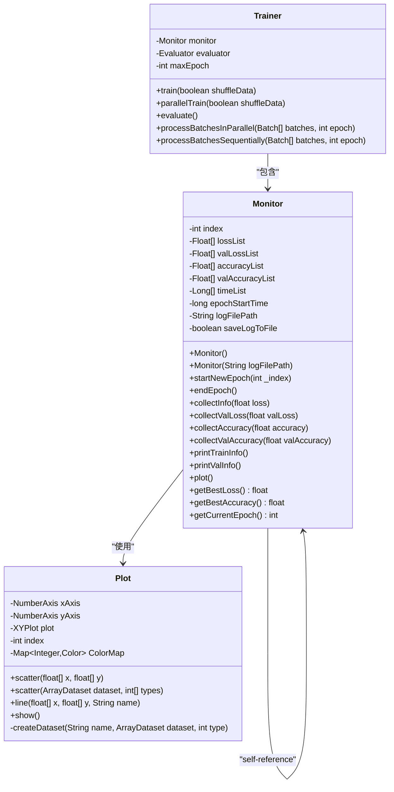
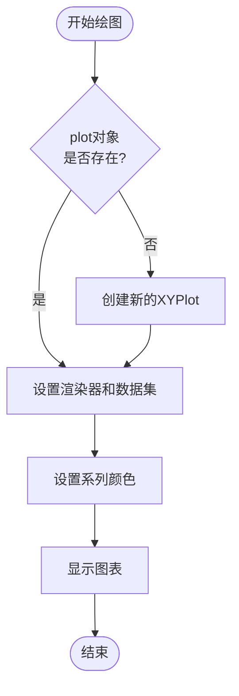
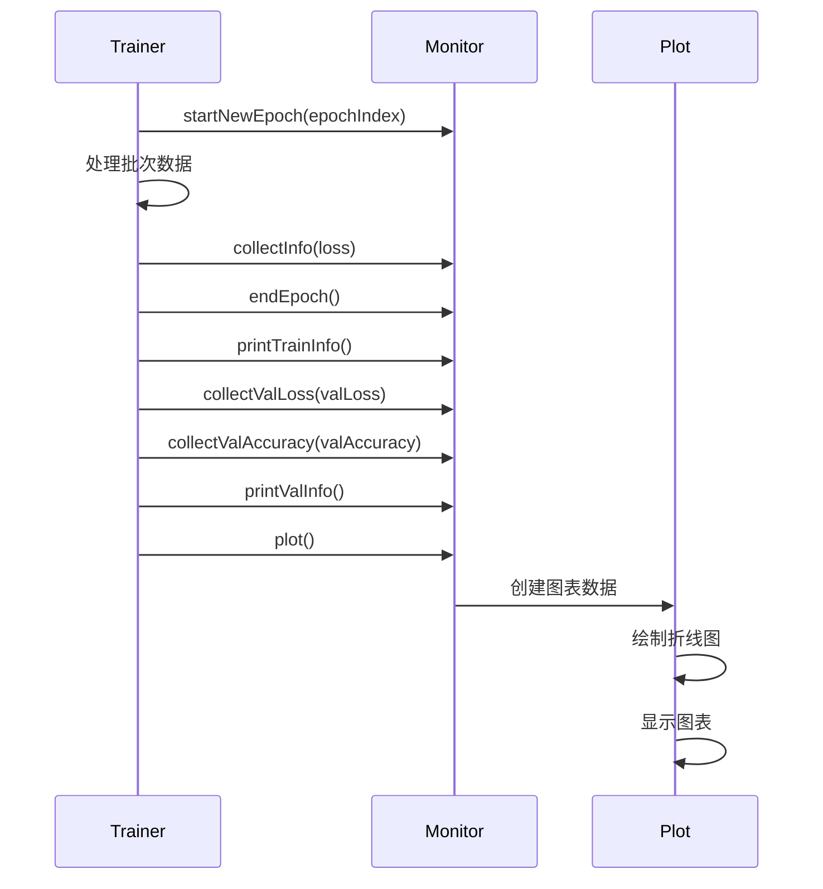

# 训练监控系统

<cite>
**本文档引用的文件**
- [Monitor.java](file://tinyai-dl-ml/src/main/java/io/leavesfly/tinyai/ml/Monitor.java)
- [Plot.java](file://tinyai-dl-ml/src/main/java/io/leavesfly/tinyai/ml/Plot.java)
- [Trainer.java](file://tinyai-dl-ml/src/main/java/io/leavesfly/tinyai/ml/Trainer.java)
- [MonitorExample.java](file://tinyai-dl-case/src/main/java/io/leavesfly/tinyai/example/MonitorExample.java)
</cite>

## 目录
1. [简介](#简介)
2. [核心组件架构](#核心组件架构)
3. [Monitor类详细分析](#monitor类详细分析)
4. [Plot类可视化功能](#plot类可视化功能)
5. [训练过程集成](#训练过程集成)
6. [实时监控机制](#实时监控机制)
7. [日志管理功能](#日志管理功能)
8. [性能分析与优化](#性能分析与优化)
9. [实际应用示例](#实际应用示例)
10. [故障排除指南](#故障排除指南)
11. [总结](#总结)

## 简介

Monitor类是TinyAI深度学习框架中的核心训练监控组件，负责实时收集、存储和可视化模型训练过程中的关键指标。该类提供了完整的训练过程监控解决方案，包括损失值、准确率、训练时间等指标的收集与存储机制，以及动态图表展示和日志文件保存功能。

Monitor类的设计理念是提供一个统一的接口来监控训练过程，使开发者能够及时了解模型的学习状态，识别潜在问题，并根据监控数据调整训练策略。通过集成Plot类的可视化功能，Monitor能够生成直观的训练曲线，支持多指标对比分析。

## 核心组件架构



**图表来源**
- [Monitor.java](file://tinyai-dl-ml/src/main/java/io/leavesfly/tinyai/ml/Monitor.java#L20-L304)
- [Plot.java](file://tinyai-dl-ml/src/main/java/io/leavesfly/tinyai/ml/Plot.java#L20-L227)

## Monitor类详细分析

### 类结构设计

Monitor类采用面向对象的设计模式，将训练监控的不同方面分离到独立的方法中。类的核心字段包括：

- **指标列表**：分别存储训练损失、验证损失、训练准确率、验证准确率和训练时间
- **时间管理**：跟踪每个epoch的开始和结束时间
- **日志管理**：支持将训练信息保存到文件
- **索引管理**：维护当前训练轮次的索引

### 构造函数设计

```java
// 默认构造函数
public Monitor() {
    index = 0;
    this.lossList = new ArrayList<>();
    this.valLossList = new ArrayList<>();
    this.accuracyList = new ArrayList<>();
    this.valAccuracyList = new ArrayList<>();
    this.timeList = new ArrayList<>();
    this.saveLogToFile = false;
}

// 支持日志文件保存的构造函数
public Monitor(String logFilePath) {
    this();
    this.logFilePath = logFilePath;
    this.saveLogToFile = true;
}
```

这种双重构造函数设计提供了灵活性，允许用户根据需要选择是否启用日志文件保存功能。

### 核心监控方法

#### 1. startNewEpoch方法

```java
public void startNewEpoch(int _index) {
    index = _index;
    epochStartTime = System.currentTimeMillis();
}
```

该方法标志着新epoch的开始，初始化epoch索引并记录开始时间，为后续的时间统计做准备。

#### 2. 数据收集方法

Monitor类提供了四个核心的数据收集方法：

```java
// 收集训练损失信息
public void collectInfo(float loss) {
    lossList.add(loss);
}

// 收集验证集损失信息
public void collectValLoss(float valLoss) {
    valLossList.add(valLoss);
}

// 收集训练准确率信息
public void collectAccuracy(float accuracy) {
    accuracyList.add(accuracy);
}

// 收集验证集准确率信息
public void collectValAccuracy(float valAccuracy) {
    valAccuracyList.add(valAccuracy);
}
```

这些方法采用简单的列表追加方式存储数据，确保了数据收集的高效性和简单性。

#### 3. 时间管理方法

```java
public void endEpoch() {
    long epochEndTime = System.currentTimeMillis();
    timeList.add(epochEndTime - epochStartTime);
}
```

该方法计算当前epoch的训练时间并存储到timeList中，为性能分析提供数据基础。

**章节来源**
- [Monitor.java](file://tinyai-dl-ml/src/main/java/io/leavesfly/tinyai/ml/Monitor.java#L43-L113)

## Plot类可视化功能

### 可视化架构设计

Plot类基于JFreeChart库实现，提供了灵活的数据可视化功能。其设计特点包括：

- **多系列支持**：可以同时绘制多个数据系列的图表
- **颜色管理**：内置颜色映射表，自动为不同系列分配颜色
- **多种图表类型**：支持折线图和散点图
- **交互式界面**：提供完整的图形界面展示

### 图表绘制方法

#### 折线图绘制

```java
public void line(float[] x, float[] y, String name) {
    XYDataset dataset = createDataset(x, y, name);
    XYLineAndShapeRenderer lineRenderer = new XYLineAndShapeRenderer(true, true);
    lineRenderer.setSeriesPaint(0, ColorMap.get(index));
    
    if (plot == null) {
        plot = new XYPlot(dataset, xAxis, yAxis, lineRenderer);
        index++;
    } else {
        plot.setRenderer(index, lineRenderer);
        plot.setDataset(index, dataset);
        index++;
    }
}
```

#### 散点图绘制

```java
public void scatter(float[] x, float[] y) {
    XYDataset dataset = createDataset(x, y, "scatter");
    XYItemRenderer scatterRenderer = new XYLineAndShapeRenderer(false, true);
    scatterRenderer.setSeriesPaint(0, ColorMap.get(index));
    
    if (plot == null) {
        plot = new XYPlot(dataset, xAxis, yAxis, scatterRenderer);
        index++;
    } else {
        plot.setRenderer(index, scatterRenderer);
        plot.setDataset(index, dataset);
        index++;
    }
}
```

### 可视化流程



**图表来源**
- [Plot.java](file://tinyai-dl-ml/src/main/java/io/leavesfly/tinyai/ml/Plot.java#L80-L120)

**章节来源**
- [Plot.java](file://tinyai-dl-ml/src/main/java/io/leavesfly/tinyai/ml/Plot.java#L20-L227)

## 训练过程集成

### Trainer与Monitor的协作

Monitor类与Trainer类紧密集成，在训练过程中发挥关键作用。以下是两者协作的关键流程：



**图表来源**
- [Trainer.java](file://tinyai-dl-ml/src/main/java/io/leavesfly/tinyai/ml/Trainer.java#L170-L180)
- [Monitor.java](file://tinyai-dl-ml/src/main/java/io/leavesfly/tinyai/ml/Monitor.java#L60-L113)

### 数据流分析

在训练过程中，Monitor类通过以下方式收集和处理数据：

1. **损失值收集**：在每个epoch结束后，Trainer调用`collectInfo()`方法存储训练损失
2. **验证信息收集**：在验证阶段，调用相应的收集方法存储验证指标
3. **时间统计**：通过`startNewEpoch()`和`endEpoch()`方法自动记录训练时间
4. **日志输出**：通过`printTrainInfo()`和`printValInfo()`方法格式化输出训练信息

**章节来源**
- [Trainer.java](file://tinyai-dl-ml/src/main/java/io/leavesfly/tinyai/ml/Trainer.java#L170-L350)

## 实时监控机制

### 数据收集策略

Monitor类采用增量收集策略，每次epoch只添加新的数据点，避免重复计算和内存浪费。这种设计具有以下优势：

- **内存效率**：只存储必要的数据，减少内存占用
- **实时性**：数据立即可用，支持实时监控
- **可扩展性**：支持长时间训练过程中的持续监控

### 数据访问接口

Monitor类提供了丰富的数据访问方法，方便外部系统获取监控数据：

```java
// 获取最佳指标
public float getBestLoss() { /* ... */ }
public float getBestAccuracy() { /* ... */ }

// 获取完整数据列表
public List<Float> getLossList() { /* ... */ }
public List<Float> getTimeList() { /* ... */ }

// 获取当前状态
public int getCurrentEpoch() { /* ... */ }
```

### 输出格式化

Monitor类实现了智能的输出格式化机制：

```java
public void printTrainInfo() {
    StringBuilder sb = new StringBuilder();
    sb.append("epoch = ").append(index);
    
    if (lossList.size() > index) {
        sb.append(", loss: ").append(String.format("%.6f", lossList.get(index)));
    }
    
    if (accuracyList.size() > index) {
        sb.append(", acc: ").append(String.format("%.4f", accuracyList.get(index)));
    }
    
    if (timeList.size() > index) {
        sb.append(", time: ").append(timeList.get(index)).append("ms");
    }
    
    System.out.println(sb.toString());
}
```

这种格式化输出确保了训练信息的可读性和一致性。

**章节来源**
- [Monitor.java](file://tinyai-dl-ml/src/main/java/io/leavesfly/tinyai/ml/Monitor.java#L115-L170)

## 日志管理功能

### 文件保存机制

Monitor类支持将训练日志保存到文件，这对于长期训练和调试非常重要：

```java
private void saveLogToFile(String logMessage) {
    if (logFilePath == null || logFilePath.isEmpty()) {
        return;
    }
    
    try (FileWriter writer = new FileWriter(logFilePath, true)) {
        SimpleDateFormat sdf = new SimpleDateFormat("yyyy-MM-dd HH:mm:ss");
        String timestamp = sdf.format(new Date());
        writer.write("[" + timestamp + "] " + logMessage + "\n");
    } catch (IOException e) {
        System.err.println("保存日志到文件时出错: " + e.getMessage());
    }
}
```

### 异常处理

日志保存功能包含了完善的异常处理机制：

- **空路径检查**：防止无效的日志文件路径
- **IO异常捕获**：优雅处理文件写入错误
- **资源管理**：使用try-with-resources确保文件句柄正确关闭

### 时间戳记录

日志文件中的每条记录都包含精确的时间戳，便于追踪训练过程中的事件：

```java
SimpleDateFormat sdf = new SimpleDateFormat("yyyy-MM-dd HH:mm:ss");
String timestamp = sdf.format(new Date());
writer.write("[" + timestamp + "] " + logMessage + "\n");
```

**章节来源**
- [Monitor.java](file://tinyai-dl-ml/src/main/java/io/leavesfly/tinyai/ml/Monitor.java#L172-L200)

## 性能分析与优化

### 内存使用分析

Monitor类采用了高效的内存管理策略：

- **ArrayList使用**：使用动态数组存储指标数据，平衡内存使用和访问效率
- **增量收集**：只在epoch结束时添加新数据，避免重复计算
- **数据复制**：对外部访问返回数据副本，保护内部状态

### 性能优化建议

1. **批量处理**：对于大量数据，考虑使用批量处理策略
2. **内存监控**：定期检查内存使用情况，避免内存泄漏
3. **异步日志**：对于高频日志记录，考虑使用异步写入

### 监控数据分析

Monitor类提供了多种分析方法：

```java
// 计算统计数据
public float getBestLoss() { /* ... */ }
public float getBestAccuracy() { /* ... */ }
public List<Long> getTimeList() { /* ... */ }

// 性能指标计算
long totalTime = timeList.stream().mapToLong(Long::longValue).sum();
double averageTime = (double) totalTime / timeList.size();
```

## 实际应用示例

### 基本使用示例

以下是一个完整的Monitor使用示例：

```java
// 创建Monitor实例
Monitor monitor = new Monitor("training_log.txt");

// 在训练过程中使用
for (int epoch = 0; epoch < maxEpoch; epoch++) {
    monitor.startNewEpoch(epoch);
    
    // 训练过程...
    float loss = calculateLoss();
    float accuracy = calculateAccuracy();
    
    monitor.collectInfo(loss);
    monitor.collectAccuracy(accuracy);
    monitor.endEpoch();
    monitor.printTrainInfo();
}
```

### 高级配置示例

```java
// 创建带验证集监控的Monitor
Monitor monitor = new Monitor("training_log.txt");

// 在训练循环中收集更多指标
monitor.collectValLoss(valLoss);
monitor.collectValAccuracy(valAccuracy);
monitor.printValInfo();

// 训练完成后生成可视化图表
monitor.plot();
```

### 配置最佳实践

1. **合理设置日志文件路径**：确保有足够磁盘空间
2. **选择合适的采样频率**：避免过度记录影响性能
3. **定期清理旧日志**：防止日志文件过大
4. **结合其他监控工具**：实现全面的训练监控

**章节来源**
- [MonitorExample.java](file://tinyai-dl-case/src/main/java/io/leavesfly/tinyai/example/MonitorExample.java#L44-L89)

## 故障排除指南

### 常见问题及解决方案

#### 1. 内存溢出问题

**症状**：长时间训练后出现OutOfMemoryError
**原因**：指标列表无限增长
**解决方案**：
```java
// 定期清理旧数据
if (lossList.size() > MAX_HISTORY_SIZE) {
    lossList.remove(0);
}
```

#### 2. 日志文件写入失败

**症状**：日志保存功能失效
**原因**：文件权限或磁盘空间不足
**解决方案**：
```java
// 检查文件路径有效性
File logFile = new File(logFilePath);
if (!logFile.getParentFile().exists()) {
    logFile.getParentFile().mkdirs();
}
```

#### 3. 图表显示异常

**症状**：Plot类无法正常显示图表
**原因**：JFreeChart依赖缺失或版本冲突
**解决方案**：
- 确保项目中包含正确的JFreeChart依赖
- 检查Java版本兼容性

### 调试技巧

1. **启用详细日志**：在开发环境中启用详细的监控日志
2. **使用断点调试**：在关键方法中设置断点观察数据变化
3. **性能分析**：使用Java Profiler分析Monitor类的性能瓶颈

### 监控数据解读

理解Monitor类收集的数据对于训练优化至关重要：

- **损失曲线**：平滑下降表示正常学习，震荡可能表示学习率过高
- **准确率曲线**：上升趋势表明模型在学习，停滞可能表示过拟合
- **训练时间**：异常增长可能表示硬件问题或算法效率低下

## 总结

Monitor类作为TinyAI框架的核心组件，提供了完整的训练过程监控解决方案。通过其精心设计的架构，Monitor不仅能够实时收集和存储关键指标，还能通过Plot类生成直观的可视化图表，帮助开发者深入理解模型的学习过程。

### 主要特性总结

1. **全面的指标收集**：涵盖损失值、准确率、训练时间等关键指标
2. **灵活的可视化**：支持多种图表类型和自定义配置
3. **持久化存储**：提供日志文件保存功能，支持历史数据分析
4. **易于集成**：与Trainer类无缝协作，简化使用复杂度
5. **高性能设计**：采用增量收集策略，确保监控过程不影响训练性能

### 应用价值

Monitor类的价值不仅在于其技术实现，更在于它为深度学习模型训练提供了科学的监控手段。通过实时监控和可视化分析，开发者可以：

- 及时发现训练异常和潜在问题
- 优化超参数和训练策略
- 评估模型性能和收敛速度
- 进行模型比较和选择
- 支持学术研究和论文发表

### 未来发展方向

随着深度学习技术的发展，Monitor类可以进一步增强其功能：

- **分布式训练支持**：支持多节点训练的监控
- **云端集成**：与云平台服务集成，实现实时监控
- **机器学习辅助**：利用机器学习算法预测训练趋势
- **自动化调优**：基于监控数据自动调整学习率等超参数

Monitor类的设计充分体现了TinyAI框架"简单易用、功能强大"的理念，为深度学习模型的训练监控提供了可靠的技术保障。