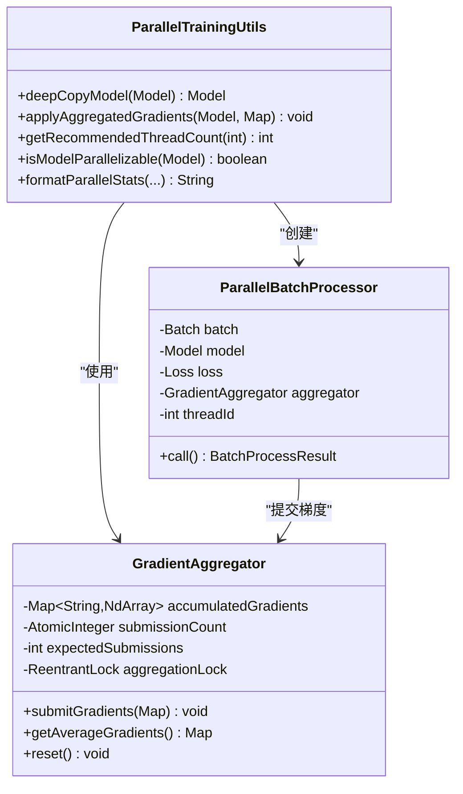
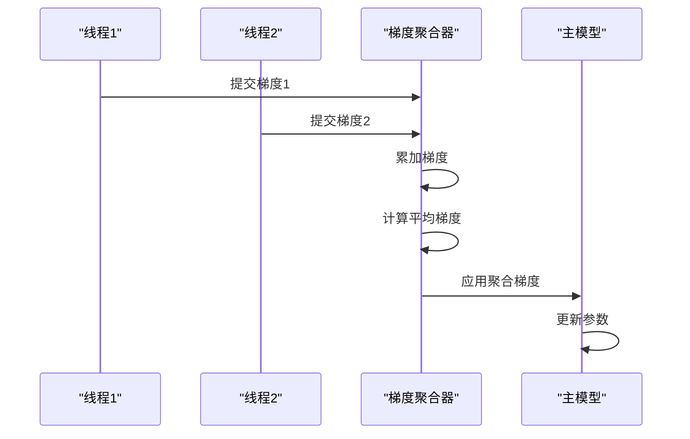
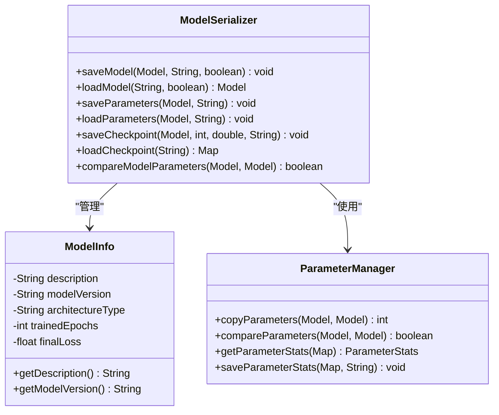
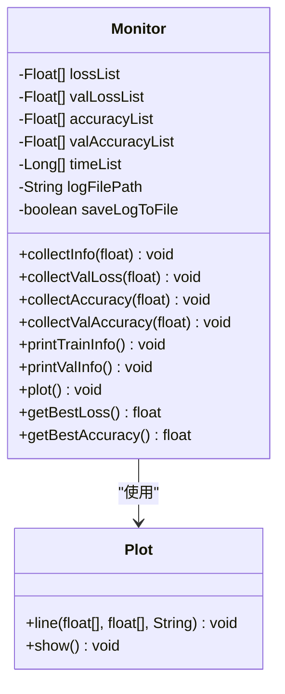
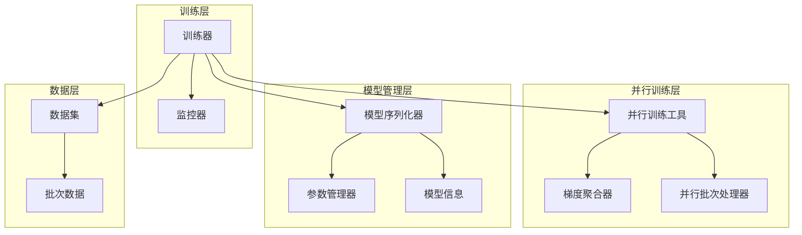
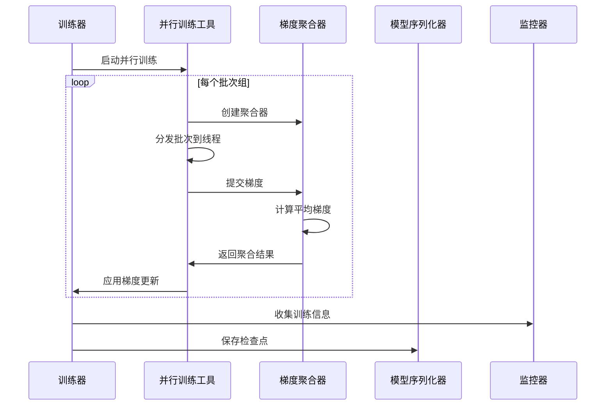

# TinyAI框架高级特性

<cite>
**本文档中引用的文件**
- [ParallelTrainingUtils.java](file://tinyai-dl-ml/src/main/java/io/leavesfly/tinyai/ml/parallel/ParallelTrainingUtils.java)
- [GradientAggregator.java](file://tinyai-dl-ml/src/main/java/io/leavesfly/tinyai/ml/parallel/GradientAggregator.java)
- [ParallelBatchProcessor.java](file://tinyai-dl-ml/src/main/java/io/leavesfly/tinyai/ml/parallel/ParallelBatchProcessor.java)
- [ModelSerializer.java](file://tinyai-dl-ml/src/main/java/io/leavesfly/tinyai/ml/ModelSerializer.java)
- [Monitor.java](file://tinyai-dl-ml/src/main/java/io/leavesfly/tinyai/ml/Monitor.java)
- [Trainer.java](file://tinyai-dl-ml/src/main/java/io/leavesfly/tinyai/ml/Trainer.java)
- [ModelSerializationExample.java](file://tinyai-dl-case/src/main/java/io/leavesfly/tinyai/example/ModelSerializationExample.java)
- [MonitorExample.java](file://tinyai-dl-case/src/main/java/io/leavesfly/tinyai/example/MonitorExample.java)
</cite>

## 目录
1. [简介](#简介)
2. [并行训练系统](#并行训练系统)
3. [模型序列化系统](#模型序列化系统)
4. [训练过程监控](#训练过程监控)
5. [架构概览](#架构概览)
6. [性能优化建议](#性能优化建议)
7. [故障排查指南](#故障排查指南)
8. [总结](#总结)

## 简介

TinyAI框架的高级特性为深度学习模型的大规模训练提供了强大的支持。这些特性包括分布式训练、模型序列化和训练过程监控，能够显著提升训练效率和模型管理能力。本文档将深入探讨这些高级功能的实现原理、使用方法和最佳实践。

## 并行训练系统

### ParallelTrainingUtils核心功能

ParallelTrainingUtils是TinyAI框架并行训练的核心工具类，提供了模型深拷贝和梯度聚合等关键功能。



**图表来源**
- [ParallelTrainingUtils.java](file://tinyai-dl-ml/src/main/java/io/leavesfly/tinyai/ml/parallel/ParallelTrainingUtils.java#L1-L122)
- [GradientAggregator.java](file://tinyai-dl-ml/src/main/java/io/leavesfly/tinyai/ml/parallel/GradientAggregator.java#L1-L121)
- [ParallelBatchProcessor.java](file://tinyai-dl-ml/src/main/java/io/leavesfly/tinyai/ml/parallel/ParallelBatchProcessor.java#L1-L79)

#### 模型深拷贝机制

ParallelTrainingUtils使用Java序列化机制实现模型的深拷贝，确保每个线程拥有独立的模型实例：

```java
public static Model deepCopyModel(Model originalModel) {
    try {
        // 使用序列化进行深拷贝
        ByteArrayOutputStream baos = new ByteArrayOutputStream();
        ObjectOutputStream oos = new ObjectOutputStream(baos);
        oos.writeObject(originalModel);
        oos.close();

        ByteArrayInputStream bais = new ByteArrayInputStream(baos.toByteArray());
        ObjectInputStream ois = new ObjectInputStream(bais);
        Model copiedModel = (Model) ois.readObject();
        ois.close();

        return copiedModel;
    } catch (Exception e) {
        throw new RuntimeException("模型深拷贝失败: " + e.getMessage(), e);
    }
}
```

#### 推荐线程数计算

系统根据CPU核心数和数据批次数量智能计算推荐的线程数：

```java
public static int getRecommendedThreadCount(int batchCount) {
    int availableCores = Runtime.getRuntime().availableProcessors();
    
    // 线程数不应超过可用核心数的75%
    int maxThreads = Math.max(1, (int) (availableCores * 0.75));
    return Math.min(maxThreads, batchCount);
}
```

### 梯度聚合系统

GradientAggregator实现了线程安全的梯度收集和平均功能：



**图表来源**
- [GradientAggregator.java](file://tinyai-dl-ml/src/main/java/io/leavesfly/tinyai/ml/parallel/GradientAggregator.java#L39-L70)
- [ParallelTrainingUtils.java](file://tinyai-dl-ml/src/main/java/io/leavesfly/tinyai/ml/parallel/ParallelTrainingUtils.java#L40-L60)

### 多GPU训练配置示例

以下是一个典型的多GPU训练配置示例：

```java
// 创建并行训练器
Trainer trainer = new Trainer(maxEpoch, monitor, evaluator, true, 0);
trainer.configureParallelTraining(true, 0); // 0表示自动计算线程数

// 训练模型
trainer.train(true);

// 关闭资源
trainer.shutdown();
```

**章节来源**
- [ParallelTrainingUtils.java](file://tinyai-dl-ml/src/main/java/io/leavesfly/tinyai/ml/parallel/ParallelTrainingUtils.java#L1-L122)
- [Trainer.java](file://tinyai-dl-ml/src/main/java/io/leavesfly/tinyai/ml/Trainer.java#L200-L350)

## 模型序列化系统

### ModelSerializer核心架构

ModelSerializer提供了完整的模型保存和加载功能，支持多种序列化格式：



**图表来源**
- [ModelSerializer.java](file://tinyai-dl-ml/src/main/java/io/leavesfly/tinyai/ml/ModelSerializer.java#L1-L199)

### 模型保存格式

ModelSerializer支持多种保存格式：

1. **完整模型保存**：包含架构和参数
2. **压缩保存**：支持GZIP压缩减少文件大小
3. **仅参数保存**：灵活的参数管理
4. **检查点功能**：训练过程中的状态保存

```java
// 保存完整模型
model.saveModel("models/sample_model.model");

// 保存压缩模型
model.saveModelCompressed("models/sample_model_compressed.model");

// 保存参数
model.saveParameters("models/sample_model.params");

// 保存检查点
model.saveCheckpoint("models/checkpoint_epoch100.ckpt", 100, 0.025);
```

### 模型加载和验证

```java
// 加载完整模型
Model loadedModel = Model.loadModel("models/sample_model.model");

// 加载压缩模型
Model compressedModel = Model.loadModel("models/sample_model_compressed.model");

// 从检查点恢复
Model restoredModel = Model.resumeFromCheckpoint("models/checkpoint_epoch50.ckpt");
```

### 参数管理和比较

ParameterManager提供了强大的参数操作功能：

```java
// 比较模型参数
boolean paramsEqual = ParameterManager.compareParameters(originalModel, newModel);

// 复制参数
int copiedCount = ParameterManager.copyParameters(originalModel, newModel);

// 获取参数统计
Map<String, Parameter> params = originalModel.getAllParams();
ParameterManager.ParameterStats stats = ParameterManager.getParameterStats(params);
```

**章节来源**
- [ModelSerializer.java](file://tinyai-dl-ml/src/main/java/io/leavesfly/tinyai/ml/ModelSerializer.java#L1-L199)
- [ModelSerializationExample.java](file://tinyai-dl-case/src/main/java/io/leavesfly/tinyai/example/ModelSerializationExample.java#L1-L309)

## 训练过程监控

### Monitor类功能架构

Monitor类提供了全面的训练过程监控功能：



**图表来源**
- [Monitor.java](file://tinyai-dl-ml/src/main/java/io/leavesfly/tinyai/ml/Monitor.java#L1-L200)

### 实时可视化功能

Monitor类支持实时可视化训练过程：

```java
// 创建带日志文件保存功能的Monitor
Monitor monitor = new Monitor("training_log.txt");

// 收集训练信息
monitor.collectInfo(currentLoss);
monitor.collectAccuracy(currentAccuracy);

// 打印训练信息
monitor.printTrainInfo();

// 可视化训练过程
monitor.plot();
```

### 训练统计和分析

```java
// 获取最佳训练损失
float bestLoss = monitor.getBestLoss();

// 获取最佳训练准确率
float bestAccuracy = monitor.getBestAccuracy();

// 获取训练时间信息
List<Long> timeList = monitor.getTimeList();
long totalTime = timeList.stream().mapToLong(Long::longValue).sum();
double avgEpochTime = (double) totalTime / timeList.size();
```

### 日志记录和持久化

Monitor支持将训练日志保存到文件：

```java
private void saveLogToFile(String logMessage) {
    if (logFilePath == null || logFilePath.isEmpty()) {
        return;
    }
    
    try (FileWriter writer = new FileWriter(logFilePath, true)) {
        SimpleDateFormat sdf = new SimpleDateFormat("yyyy-MM-dd HH:mm:ss");
        String timestamp = sdf.format(new Date());
        writer.write("[" + timestamp + "] " + logMessage + "\n");
    } catch (IOException e) {
        System.err.println("保存日志到文件时出错: " + e.getMessage());
    }
}
```

**章节来源**
- [Monitor.java](file://tinyai-dl-ml/src/main/java/io/leavesfly/tinyai/ml/Monitor.java#L1-L200)
- [MonitorExample.java](file://tinyai-dl-case/src/main/java/io/leavesfly/tinyai/example/MonitorExample.java#L1-L90)

## 架构概览

### 整体架构设计



### 组件交互流程



## 性能优化建议

### 并行训练优化

1. **线程数配置**：根据硬件配置和数据规模调整线程数
2. **内存管理**：合理控制模型副本数量，避免内存溢出
3. **批次大小**：平衡批次大小和并行度，优化GPU利用率

### 模型序列化优化

1. **压缩策略**：对于大型模型，优先使用压缩保存
2. **增量保存**：只保存必要的参数，减少文件大小
3. **缓存机制**：对频繁访问的模型进行内存缓存

### 监控系统优化

1. **采样频率**：合理设置监控采样频率，平衡性能和精度
2. **可视化选择**：根据需求选择合适的可视化方式
3. **日志管理**：定期清理历史日志，避免磁盘空间不足

## 故障排查指南

### 并行训练常见问题

1. **线程死锁**：检查梯度聚合器的锁机制
2. **内存泄漏**：确保及时清理计算图和模型副本
3. **性能下降**：分析批次处理时间和线程竞争情况

### 模型序列化问题

1. **序列化失败**：检查模型对象是否可序列化
2. **参数不匹配**：验证参数形状和数据类型一致性
3. **文件损坏**：使用校验和验证文件完整性

### 监控系统问题

1. **数据丢失**：检查数据收集和存储逻辑
2. **可视化异常**：验证绘图库依赖和配置
3. **日志写入失败**：检查文件权限和磁盘空间

## 总结

TinyAI框架的高级特性为深度学习模型的大规模训练提供了全面的支持。通过并行训练系统，可以显著提升训练效率；通过模型序列化系统，能够方便地管理和部署模型；通过训练过程监控，可以实时掌握训练状态。这些特性共同构成了一个完整的深度学习开发平台，为研究人员和开发者提供了强大的工具支持。

在实际使用中，建议根据具体需求选择合适的配置，并结合性能监控持续优化系统表现。随着深度学习技术的不断发展，这些高级特性将继续演进，为更复杂的模型训练场景提供支持。