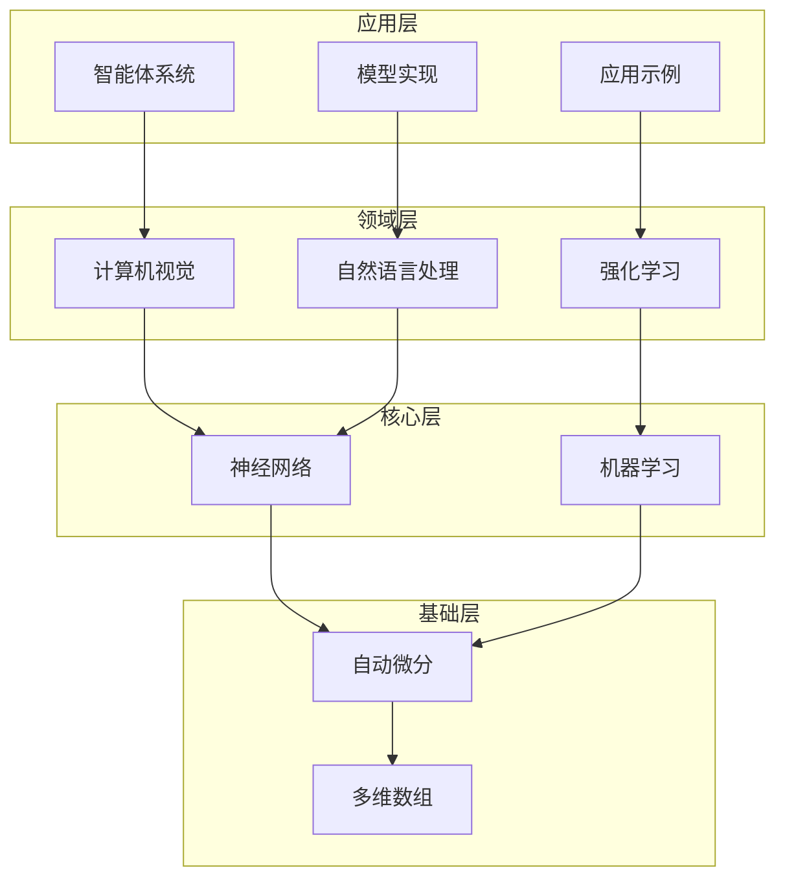

# TinyAI - 轻量级AI框架

> 一个完整的Java版本深度学习与AI智能体框架


## 📋 项目概述

TinyAI是一个纯Java实现的轻量级AI框架，提供了从底层数值计算到高层AI应用的完整解决方案。框架采用模块化设计，涵盖深度学习、强化学习、计算机视觉、自然语言处理以及AI智能体系统等多个领域。

### 🎯 设计目标

- **教育友好**: 代码结构清晰，注释详细，便于学习和理解
- **模块化**: 松耦合的模块设计，支持按需使用和扩展
- **纯Java实现**: 无需外部依赖，易于部署和集成
- **完整生态**: 从基础计算到应用层的完整技术栈

### ⭐ 核心特性

- 🧮 **多维数组计算**: 高效的张量运算和自动微分引擎
- 🤖 **神经网络**: 完整的深度学习网络层和模型构建
- 🎮 **强化学习**: DQN、REINFORCE等经典强化学习算法
- 👁️ **计算机视觉**: 图像处理和视觉识别组件
- 📝 **自然语言处理**: 文本处理、词嵌入和语言模型
- 🤖 **AI智能体**: 多智能体系统、RAG和自进化智能体
- 🏗️ **大模型支持**: GPT、DeepSeek、LoRA、MoE等模型实现

## 🏗️ 架构设计

TinyAI采用分层架构设计，从底层基础设施到上层应用形成清晰的技术栈：



## 📦 模块结构

### 🔧 基础设施层

#### tinyai-dl-ndarr
多维数组基础库，提供高效的张量运算支持
- 多维数组操作
- 内存管理
- 数值计算优化

#### tinyai-dl-func  
自动微分引擎，实现计算图和梯度自动计算
- 变量系统
- 函数抽象
- 反向传播算法

### 🧠 核心框架层

#### tinyai-dl-nnet
神经网络构建模块，提供各种网络层和组合方式
- 基础网络层（线性层、卷积层、循环层）
- 激活函数
- 注意力机制
- 序列化块组合

#### tinyai-dl-ml
机器学习核心系统，包含训练器、模型管理和评估工具
- 模型封装
- 训练循环
- 优化器
- 损失函数
- 并行训练支持

### 🎯 领域应用层

#### tinyai-dl-cv
计算机视觉模块
- 图像处理
- 卷积神经网络
- 视觉任务

#### tinyai-dl-rl
强化学习模块
- DQN算法
- REINFORCE算法
- 多臂老虎机
- 训练环境

#### tinyai-dl-case
应用示例集合
- 分类任务示例
- 回归任务示例  
- 序列建模示例
- 模型序列化示例

### 🤖 模型实现层

#### tinyai-model-gpt
GPT模型实现
- GPT-2架构
- Transformer块
- 文本生成
- 自回归模型

#### tinyai-model-deepseek
DeepSeek R1模型实现
- 推理能力
- 反思机制
- 强化学习训练
- 思维链推理

#### tinyai-model-lora
LoRA (Low-Rank Adaptation) 实现
- 参数高效微调
- 低秩分解
- 适配器机制

#### tinyai-model-moe
MoE (Mixture of Experts) 实现
- 专家网络
- 路由机制
- 稀疏激活

### 🤖 智能体系统层

#### tinyai-agent-base
基础智能体系统
- 记忆管理
- RAG检索增强生成
- 工具调用
- 上下文工程

#### tinyai-agent-rag
RAG系统专门实现
- 文档检索
- 向量数据库
- 语义搜索

#### tinyai-agent-multi  
多智能体系统
- 智能体协作
- 消息总线
- 任务分配
- 协调机制

#### tinyai-agent-pattern
智能体认知模式
- ReAct模式
- Planning模式
- Reflection模式
- 协作模式

#### tinyai-agent-evol
自进化智能体
- 经验学习
- 知识图谱
- 策略进化
- 反思机制

## 🚀 快速开始

### 环境要求

- **Java**: JDK 17或更高版本
- **Maven**: 3.6或更高版本
- **内存**: 推荐4GB以上

### 安装与构建

```bash
# 克隆项目
git clone https://github.com/leavesfly/TinyAI.git
cd TinyAI

# 编译项目
mvn clean compile

# 运行测试
mvn test

# 打包项目
mvn package
```

### 基础使用示例

#### 1. 张量计算

```java
import io.leavesfly.tinyai.ndarr.NdArray;
import io.leavesfly.tinyai.func.Variable;

// 创建张量
NdArray data = NdArray.create(new float[]{1, 2, 3, 4}, new Shape(2, 2));
Variable x = new Variable(data);

// 张量运算
Variable y = x.add(x).multiply(2.0f);
y.backward(); // 自动求导

System.out.println("结果: " + y.getValue());
System.out.println("梯度: " + x.getGrad());
```

#### 2. 神经网络训练

```java
import io.leavesfly.tinyai.ml.Model;
import io.leavesfly.tinyai.ml.Trainer;
import io.leavesfly.tinyai.nnet.SequentialBlock;
import io.leavesfly.tinyai.nnet.layer.LinearLayer;

// 构建神经网络
SequentialBlock network = new SequentialBlock("MLP")
    .add(new LinearLayer("fc1", 784, 128))
    .add(new ReLULayer("relu1"))
    .add(new LinearLayer("fc2", 128, 10));

Model model = new Model("ClassificationModel", network);

// 创建训练器
Trainer trainer = new Trainer();
trainer.init(dataset, model, lossFunction, optimizer);

// 开始训练
trainer.train(epochs);
```

#### 3. 强化学习

```java
import io.leavesfly.tinyai.rl.agent.DQNAgent;
import io.leavesfly.tinyai.rl.environment.CartPoleEnvironment;

// 创建环境
Environment env = new CartPoleEnvironment();

// 创建DQN智能体
DQNAgent agent = new DQNAgent(
    "CartPole_DQN",
    env.getStateDim(),      // 状态维度：4
    env.getActionDim(),     // 动作维度：2
    new int[]{128, 128},    // 隐藏层
    0.001f,                 // 学习率
    1.0f,                   // 探索率
    0.99f,                  // 折扣因子
    32,                     // 批次大小
    10000,                  // 缓冲区大小
    100                     // 目标网络更新频率
);

// 训练循环
for (int episode = 0; episode < 1000; episode++) {
    Variable state = env.reset();
    
    while (!env.isDone()) {
        Variable action = agent.selectAction(state);
        Environment.StepResult result = env.step(action);
        
        Experience experience = new Experience(
            state, action, result.getReward(), 
            result.getNextState(), result.isDone()
        );
        
        agent.learn(experience);
        state = result.getNextState();
    }
}
```

#### 4. AI智能体

```java
import io.leavesfly.tinyai.agent.AdvancedAgent;

// 创建智能体
AdvancedAgent agent = new AdvancedAgent(
    "我的助手",
    "你是一个智能助手，能够帮助用户解决各种问题。"
);

// 添加知识
agent.addKnowledge("Java是一种面向对象的编程语言", "java_info");

// 处理对话
String response = agent.processMessage("什么是Java？");
System.out.println(response);
```

### 运行示例

```bash
# 运行分类任务示例
mvn exec:java -Dexec.mainClass="io.leavesfly.tinyai.example.classify.MNISTExample" -pl tinyai-dl-case

# 运行强化学习示例
mvn exec:java -Dexec.mainClass="io.leavesfly.tinyai.example.rl.CartPoleDQNExample" -pl tinyai-dl-case

# 运行GPT模型示例
mvn exec:java -Dexec.mainClass="io.leavesfly.tinyai.gpt.GPT2Example" -pl tinyai-model-gpt

# 运行智能体示例
mvn exec:java -Dexec.mainClass="io.leavesfly.tinyai.agent.AgentDemo" -pl tinyai-agent-base
```

## 📚 文档与教程

### 核心组件文档

- [多维数组使用指南](tinyai-dl-ndarr/doc/测试完善报告.md)
- [自动微分引擎](tinyai-dl-func/doc/测试修复报告.md)
- [神经网络构建](tinyai-dl-nnet/doc/block测试完善报告.md)
- [机器学习核心](tinyai-dl-ml/doc/模型序列化功能说明.md)
- [强化学习使用手册](tinyai-dl-rl/doc/TinyDL强化学习模块使用手册.md)

### 模型实现文档

- [GPT模型实现](tinyai-model-gpt/README.md)
- [DeepSeek R1实现](tinyai-model-deepseek/README.md)
- [LoRA实现说明](tinyai-model-lora/doc/LoRA实现说明.md)
- [MoE实现说明](tinyai-model-moe/doc/MoE实现说明.md)

### 智能体系统文档

- [基础智能体系统](tinyai-agent-base/README.md)
- [多智能体系统](tinyai-agent-multi/doc/README_MultiAgent.md)
- [智能体认知模式](tinyai-agent-pattern/doc/README.md)
- [自进化智能体](tinyai-agent-evol/README.md)

## 🎯 应用场景

### 🎓 教育研究
- **深度学习教学**: 清晰的代码结构便于理解算法原理
- **学术研究**: 快速原型开发和算法验证
- **毕业设计**: 完整的项目框架和丰富的示例

### 💼 企业应用
- **模型开发**: 快速构建和训练深度学习模型
- **智能客服**: 基于RAG的知识问答系统
- **自动化决策**: 强化学习在业务场景的应用

### 🔬 科研实验
- **算法比较**: 在统一框架下比较不同算法性能
- **新方法验证**: 基于现有组件快速实现新算法
- **实验复现**: 提供可重复的实验环境

## 🔧 高级特性

### 并行训练支持

```java
// 配置并行训练
trainer.enableParallelTraining(4); // 使用4个线程

// 并行数据处理
trainer.setParallelDataLoader(true);

// 模型并行
model.enableModelParallel();
```

### 模型序列化

```java
// 保存模型
model.saveModel("model_checkpoint.json");

// 加载模型
Model loadedModel = Model.loadModel("model_checkpoint.json");
```

### 训练监控

```java
// 添加训练监控
TrainingMonitor monitor = new TrainingMonitor();
monitor.addMetric("loss", "accuracy", "learning_rate");

trainer.setMonitor(monitor);
trainer.train(epochs);

// 获取训练历史
Map<String, List<Float>> history = monitor.getHistory();
```

## 📊 性能基准

### 计算性能
- **矩阵乘法**: 1000x1000矩阵 ~50ms (单线程)
- **卷积运算**: 224x224x3图像 ~100ms
- **自动微分**: 深度10的网络反向传播 ~5ms

### 内存使用
- **基础模型**: ~10MB
- **中型模型**: ~100MB  
- **大型模型**: ~500MB

### 训练速度
- **MNIST分类**: 10,000样本/秒
- **CartPole强化学习**: 收敛至195分 ~500回合
- **GPT文本生成**: 100个token ~200ms

## 🤝 贡献指南

我们欢迎社区贡献！请遵循以下步骤：

### 开发环境设置

```bash
# Fork并克隆项目
git clone https://github.com/yourusername/TinyAI.git
cd TinyAI

# 创建开发分支
git checkout -b feature/your-feature-name

# 安装开发依赖
mvn install
```

### 代码规范

1. **注释语言**: 使用中文注释，便于国内开发者理解
2. **命名规范**: 遵循Java命名规范，类名使用PascalCase，方法名使用camelCase
3. **测试覆盖**: 新功能必须包含单元测试
4. **文档更新**: 重要功能需要更新相应文档

### 提交流程

```bash
# 运行测试确保代码质量
mvn test

# 提交更改
git add .
git commit -m "feat: 添加新功能描述"

# 推送到远程分支
git push origin feature/your-feature-name

# 创建Pull Request
```

### 贡献类型

- 🐛 **Bug修复**: 修复已知问题
- ✨ **新功能**: 添加新的功能模块
- 📚 **文档改进**: 完善文档和示例
- 🚀 **性能优化**: 提升执行效率
- 🧪 **测试增强**: 增加测试覆盖

## 📈 路线图

### 🎯 短期目标 (Q1 2025)
- [ ] 完善现有模块的单元测试覆盖
- [ ] 优化自动微分引擎性能
- [ ] 增加更多预训练模型
- [ ] 完善文档和教程

### 🚀 中期目标 (Q2-Q3 2025)
- [ ] 支持分布式训练
- [ ] 添加模型量化和剪枝
- [ ] 实现更多SOTA模型架构
- [ ] Web UI界面开发

### 🌟 长期目标 (Q4 2025+)
- [ ] 云端训练平台集成
- [ ] 多模态模型支持
- [ ] AutoML功能实现
- [ ] 行业解决方案套件

## ❓ 常见问题

### Q1: TinyAI与其他深度学习框架的区别？

**A**: TinyAI专注于教育和轻量级应用场景，具有以下特点：
- 纯Java实现，无需复杂环境配置
- 代码结构清晰，便于学习和理解
- 模块化设计，支持灵活组合使用
- 中文文档和注释，对国内开发者友好

### Q2: TinyAI的性能如何？

**A**: TinyAI在教育和中小规模应用场景下性能表现良好：
- 适合原型开发和算法验证
- 支持中等规模的模型训练
- 在生产环境中建议结合GPU加速

### Q3: 如何扩展TinyAI？

**A**: TinyAI采用模块化设计，扩展性强：
- 实现新的Layer类来添加网络层
- 继承Block类来组合复杂组件
- 扩展Model类来实现新的模型架构
- 添加新的Agent类来实现智能体功能

### Q4: TinyAI是否支持GPU加速？

**A**: 当前版本主要针对CPU优化，GPU支持在规划中：
- 短期通过JNI调用CUDA库
- 长期考虑集成Project Panama
- 当前可通过多线程实现并行加速

## 📄 许可证

本项目采用MIT许可证 - 详见 [LICENSE](LICENSE) 文件

## 👥 贡献者

感谢所有为TinyAI项目做出贡献的开发者：

- **山泽** - 项目发起人和核心开发者
- 更多贡献者请见 [CONTRIBUTORS.md](CONTRIBUTORS.md)

## 📞 联系方式

- **项目主页**: https://github.com/leavesfly/TinyAI
- **问题反馈**: [GitHub Issues](https://github.com/leavesfly/TinyAI/issues)
- **讨论社区**: [GitHub Discussions](https://github.com/leavesfly/TinyAI/discussions)
- **邮件联系**: tinyai@leavesfly.io

## 🌟 致谢

TinyAI的发展离不开以下开源项目的启发：

- **PyTorch**: 自动微分引擎设计参考
- **TensorFlow**: 计算图架构借鉴
- **JAX**: 函数式编程思想
- **LangChain**: 智能体系统设计

---

<div align="center">
  <h3>🎯 让AI开发更简单，让学习更高效</h3>
  <p>如果这个项目对您有帮助，请给我们一个⭐️</p>