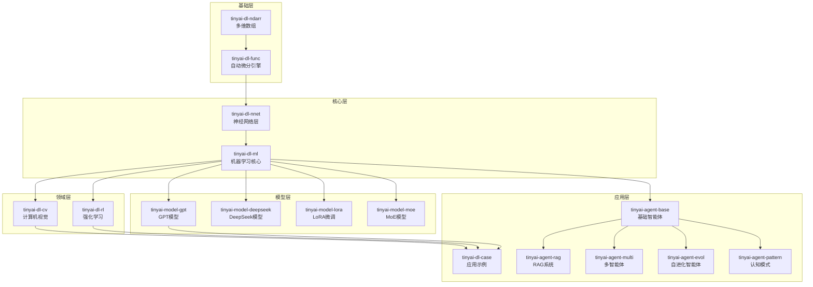

# TinyAI - 深度学习与智能体框架

<div align="center">


**🚀 一个完全使用Java构建的现代化深度学习与智能体系统框架**

[快速开始](#-快速开始) • [核心特性](#-核心特性) • [架构设计](#-架构设计) • [应用示例](#-应用示例) • [文档](#-文档)

</div>

---

## 📖 项目简介

**TinyAI** 是一个功能完整的深度学习与智能体系统框架，完全使用Java开发，专为教育、研究和生产环境设计。该框架提供了从底层张量运算到高级AI智能体的完整技术栈，支持传统深度学习、大语言模型、强化学习和多智能体系统等前沿AI技术。

### 🎯 设计理念

- **🌱 教育友好**：清晰的代码结构和详细的中文注释，便于学习和理解
- **🔬 研究导向**：模块化设计支持快速实验和算法验证
- **⚡ 生产就绪**：完善的训练、推理和部署功能
- **🤖 智能体优先**：从单智能体到多智能体系统的完整支持

### ✨ 核心特性

#### 🧠 深度学习核心
- **自动微分引擎**：支持动态计算图和高效梯度计算
- **丰富网络层**：Linear、Conv、RNN、LSTM、GRU、Transformer
- **现代优化器**：SGD、Adam、RMSprop等多种优化算法
- **完整训练流程**：并行训练、模型序列化、训练监控

#### 🤖 智能体系统
- **基础智能体**：记忆管理、上下文理解、工具调用
- **检索增强生成（RAG）**：向量检索、文档理解、知识融合
- **多智能体协作**：任务分解、角色分工、协作决策
- **自进化智能体**：反思学习、策略优化、经验积累
- **认知模式**：ReAct、Planning、Reflection等多种认知模式

#### 🎯 前沿模型
- **GPT系列模型**：完整的GPT-2实现和文本生成
- **DeepSeek模型**：DeepSeek R1/V3架构支持
- **MoE架构**：专家混合模型实现
- **LoRA微调**：参数高效的模型适配

#### 🔧 应用领域
- **计算机视觉**：图像分类、目标检测、卷积网络
- **自然语言处理**：语言模型、词嵌入、序列建模
- **强化学习**：DQN、REINFORCE、多臂老虎机
- **时间序列**：RNN、LSTM、序列预测

## 🏗️ 架构设计

### 分层架构

TinyAI采用清晰的分层架构设计，从底层计算到上层应用形成完整的技术栈：



### 核心组件

#### 🔢 多维数组库 (tinyai-dl-ndarr)
- **NdArray类**：高效的多维数组实现
- **数学运算**：支持广播机制和线性代数运算
- **内存管理**：优化的内存布局和访问模式

#### ⚙️ 自动微分引擎 (tinyai-dl-func)  
- **Variable类**：计算图节点，支持自动梯度计算
- **Function体系**：完整的数学函数和运算符支持
- **计算图管理**：动态构建和高效的反向传播

#### 🧠 神经网络层 (tinyai-dl-nnet)
- **基础层**：Linear、Activation、Normalization
- **卷积层**：Conv2D、Pooling、BatchNorm
- **循环层**：RNN、LSTM、GRU
- **注意力层**：Self-Attention、Multi-Head Attention

#### 🎯 机器学习核心 (tinyai-dl-ml)
- **模型管理**：Model、Block组合模式
- **训练器**：Trainer训练流程控制
- **优化器**：SGD、Adam、RMSprop等
- **损失函数**：MSE、CrossEntropy、MaskedSoftmaxCE
- **评估器**：Accuracy、F1Score等评估指标

## 🛠️ 快速开始

### 环境要求

- **Java**: 17+ (推荐使用OpenJDK或Oracle JDK)
- **Maven**: 3.6+  
- **内存**: 推荐4GB以上
- **操作系统**: Windows/Linux/macOS

### 安装步骤

1. **克隆项目**
```bash
git clone https://github.com/leavesfly/TinyAI.git
cd TinyAI
```

2. **编译项目**
```bash
mvn clean compile
```

3. **运行测试**
```bash
mvn test
```

4. **运行示例**
```bash
# 运行MNIST分类示例
mvn exec:java -pl tinyai-dl-case -Dexec.mainClass="io.leavesfly.tinyai.example.classify.MnistMlpExam"
```

### 快速体验

#### 1. 线性回归示例
```java
// 创建训练数据
Variable x = new Variable(NdArray.of(new float[]{1, 2, 3, 4, 5}));
Variable y = new Variable(NdArray.of(new float[]{2, 4, 6, 8, 10}));

// 定义模型参数
Variable w = new Variable(NdArray.of(0.1f), true); // 需要梯度
Variable b = new Variable(NdArray.of(0.0f), true);

// 训练循环
for (int epoch = 0; epoch < 100; epoch++) {
    // 前向传播
    Variable pred = x.mul(w).add(b);
    Variable loss = y.sub(pred).pow(2).mean();
    
    // 反向传播
    w.clearGrad();
    b.clearGrad();
    loss.backward();
    
    // 参数更新
    float lr = 0.01f;
    w.setValue(w.getValue().sub(w.getGrad().mul(lr)));
    b.setValue(b.getValue().sub(b.getGrad().mul(lr)));
    
    if (epoch % 20 == 0) {
        System.out.printf("Epoch %d, Loss: %.4f\n", epoch, loss.getValue().getFloat(0));
    }
}
```

#### 2. 神经网络分类示例
```java
// 创建MLP模型
int batchSize = 32;
Block mlpBlock = new MlpBlock("classifier", batchSize, 
    Config.ActiveFunc.ReLU, 784, 128, 64, 10);
Model model = new Model("MNIST_Classifier", mlpBlock);

// 准备训练组件
DataSet dataset = new MnistDataSet(batchSize);
Optimizer optimizer = new Adam(model, 0.001f);
Loss lossFunction = new SoftmaxCrossEntropy();
Evaluator evaluator = new AccuracyEval(new Classify(), model, dataset);

// 创建训练器并开始训练
Trainer trainer = new Trainer(50, new Monitor(), evaluator);
trainer.init(dataset, model, lossFunction, optimizer);
trainer.train(true);

// 评估模型性能
trainer.evaluate();
```

#### 3. 智能体系统示例
```java
// 创建基础智能体
AdvancedAgent agent = new AdvancedAgent("研究助手");

// 添加工具能力
agent.addTool(new CalculatorTool());
agent.addTool(new SearchTool());

// 处理用户查询
String query = "请帮我分析一下深度学习的发展趋势";
String response = agent.process(query);
System.out.println(response);

// 创建多智能体系统
MultiAgentSystem system = new MultiAgentSystem();
system.addAgent(new ResearcherAgent());
system.addAgent(new AnalystAgent());
system.addAgent(new CriticAgent());

// 执行协作任务
AgentTask task = new AgentTask("技术报告撰写", query);
system.executeTask(task);
```

## 🚀 应用示例

### 计算机视觉

#### MNIST手写数字识别
```bash
# 运行MLP分类器
mvn exec:java -pl tinyai-dl-case -Dexec.mainClass="io.leavesfly.tinyai.example.classify.MnistMlpExam"

# 运行卷积神经网络
mvn exec:java -pl tinyai-dl-case -Dexec.mainClass="io.leavesfly.tinyai.example.cv.SimpleConvNetExample"
```

#### 图像分类示例
```bash
# 运行简单分类示例
mvn exec:java -pl tinyai-dl-case -Dexec.mainClass="io.leavesfly.tinyai.example.classify.SimpleClassifyExample"
```

### 自然语言处理

#### GPT语言模型
```bash
# 运行GPT-2文本生成
mvn exec:java -pl tinyai-model-gpt -Dexec.mainClass="io.leavesfly.tinyai.gpt.GPT2Demo"

# 运行GPT训练示例
mvn exec:java -pl tinyai-model-gpt -Dexec.mainClass="io.leavesfly.tinyai.gpt.GPTTrainExample"
```

#### 词嵌入训练
```bash
# 运行Word2Vec示例
mvn exec:java -pl tinyai-dl-case -Dexec.mainClass="io.leavesfly.tinyai.example.embedd.Word2VecExample"
```

### 强化学习

#### DQN强化学习
```bash
# CartPole平衡杆环境
mvn exec:java -pl tinyai-dl-case -Dexec.mainClass="io.leavesfly.tinyai.example.rl.DQNCartPoleExample"

# GridWorld网格世界
mvn exec:java -pl tinyai-dl-case -Dexec.mainClass="io.leavesfly.tinyai.example.rl.GridWorldDQNExample"
```

#### 多臂老虎机
```bash
# 运行多臂老虎机算法对比
mvn exec:java -pl tinyai-dl-case -Dexec.mainClass="io.leavesfly.tinyai.example.rl.MultiArmedBanditExample"

# 运行REINFORCE算法
mvn exec:java -pl tinyai-dl-case -Dexec.mainClass="io.leavesfly.tinyai.example.rl.REINFORCEExample"
```

### 序列建模

#### RNN时间序列预测
```bash
# 运行余弦函数拟合
mvn exec:java -pl tinyai-dl-case -Dexec.mainClass="io.leavesfly.tinyai.example.regress.RnnCosExam"

# 运行完整RNN对比
mvn exec:java -pl tinyai-dl-case -Dexec.mainClass="io.leavesfly.tinyai.example.rnn.CompleteRnnExample"
```

### 智能体系统

#### 单智能体示例
```bash
# 基础智能体演示
mvn exec:java -pl tinyai-agent-base -Dexec.mainClass="io.leavesfly.tinyai.agent.AgentDemo"

# 高级智能体演示
mvn exec:java -pl tinyai-agent-base -Dexec.mainClass="io.leavesfly.tinyai.agent.SimplifiedAgentDemo"
```

#### 多智能体协作
```bash
# 多智能体系统演示
mvn exec:java -pl tinyai-agent-multi -Dexec.mainClass="io.leavesfly.tinyai.agent.multi.MultiAgentDemo"

# 快速多智能体演示
mvn exec:java -pl tinyai-agent-multi -Dexec.mainClass="io.leavesfly.tinyai.agent.multi.QuickDemo"
```

#### 认知模式智能体
```bash
# ReAct智能体模式
mvn exec:java -pl tinyai-agent-pattern -Dexec.mainClass="io.leavesfly.tinyai.agent.pattern.AgentPatternDemo"

# 快速认知模式演示
mvn exec:java -pl tinyai-agent-pattern -Dexec.mainClass="io.leavesfly.tinyai.agent.pattern.QuickDemo"
```

#### 自进化智能体
```bash
# 自进化智能体演示
mvn exec:java -pl tinyai-agent-evol -Dexec.mainClass="io.leavesfly.tinyai.agent.evol.EvolDemo"
```

### 前沿模型

#### DeepSeek模型
```bash
# DeepSeek R1推理演示
mvn exec:java -pl tinyai-model-deepseek -Dexec.mainClass="io.leavesfly.tinyai.deepseek.r1.DeepSeekR1Demo"

# DeepSeek V3演示
mvn exec:java -pl tinyai-model-deepseek -Dexec.mainClass="io.leavesfly.tinyai.deepseek.v3.DeepSeekV3Demo"
```

#### LoRA微调
```bash
# LoRA适配器演示
mvn exec:java -pl tinyai-model-lora -Dexec.mainClass="io.leavesfly.tinyai.lora.LoRADemo"
```

#### MoE模型
```bash
# 专家混合模型演示
mvn exec:java -pl tinyai-model-moe -Dexec.mainClass="io.leavesfly.tinyai.nlp.moe.MoEDemo"
```

## 🔧 高级功能

### 并行训练

TinyAI支持多线程并行训练，可以显著提升训练效率：

```java
// 创建训练器
Trainer trainer = new Trainer(maxEpoch, monitor, evaluator);

// 启用并行训练
trainer.enableParallelTraining(4); // 使用4个线程
trainer.parallelTrain(true);

// 监控并行训练状态
System.out.println("并行线程数: " + trainer.getParallelThreadCount());
System.out.println("训练状态: " + trainer.getTrainingStatus());

// 释放并行资源
trainer.releaseParallelResources();
```

### 模型序列化与加载

TinyAI提供了完善的模型持久化功能：

```java
// 1. 保存完整模型（包含结构和参数）
model.saveModel("models/my_model.tinyai");

// 2. 仅保存模型参数
model.saveParameters("models/model_params.bin");

// 3. 保存训练检查点
model.saveCheckpoint("checkpoints/epoch_50.ckpt", 50, currentLoss);

// 4. 增量保存（仅保存变化的参数）
model.saveIncremental("models/incremental_update.bin");

// 5. 压缩保存
model.saveCompressed("models/compressed_model.zip");

// 加载模型
Model loadedModel = Model.loadModel("models/my_model.tinyai");

// 恢复训练检查点
Model resumed = Model.resumeFromCheckpoint("checkpoints/epoch_50.ckpt");
int resumeEpoch = resumed.getCheckpointEpoch();
float resumeLoss = resumed.getCheckpointLoss();

// 加载预训练参数
model.loadParameters("models/pretrained_params.bin");
```

### 训练监控与可视化

内置强大的训练监控功能：

```java
// 创建监控器（支持日志文件记录）
Monitor monitor = new Monitor("logs/training.log");

// 创建训练器
Trainer trainer = new Trainer(epochs, monitor, evaluator);

// 开始训练（自动记录指标）
trainer.train(true);

// 获取训练统计信息
System.out.println("最佳损失: " + monitor.getBestLoss());
System.out.println("最佳准确率: " + monitor.getBestAccuracy());
System.out.println("总训练时间: " + monitor.getTotalTrainingTime() + "ms");
System.out.println("平均每轮时间: " + monitor.getAverageEpochTime() + "ms");

// 获取详细训练历史
List<Float> lossHistory = monitor.getLossHistory();
List<Float> accuracyHistory = monitor.getAccuracyHistory();

// 绘制训练曲线（需要JFreeChart依赖）
monitor.plotTrainingCurves();
monitor.plotLossAndAccuracy();

// 保存训练报告
monitor.saveTrainingReport("reports/training_report.html");
```

### 自定义组件

#### 自定义激活函数
```java
public class CustomActivation extends Function {
    @Override
    public Variable[] forward(Variable[] inputs) {
        Variable x = inputs[0];
        // 实现自定义激活函数: f(x) = x * sigmoid(x)
        Variable sigmoid = x.mul(-1).exp().add(1).reciprocal();
        return new Variable[]{x.mul(sigmoid)};
    }
    
    @Override
    public Variable[] backward(Variable[] grads) {
        // 实现反向传播
        // ...
    }
}
```

#### 自定义网络层
```java
public class CustomLayer extends Layer {
    public CustomLayer(String name, int inputSize, int outputSize) {
        super(name);
        // 初始化参数
        addParameter("weight", new Variable(NdArray.randn(outputSize, inputSize)));
        addParameter("bias", new Variable(NdArray.zeros(outputSize)));
    }
    
    @Override
    public Variable forward(Variable input) {
        Variable weight = getParameter("weight");
        Variable bias = getParameter("bias");
        return input.matmul(weight.transpose()).add(bias);
    }
}
```

#### 自定义损失函数
```java
public class CustomLoss extends Loss {
    @Override
    public Variable loss(Variable prediction, Variable target) {
        // 实现自定义损失函数
        Variable diff = prediction.sub(target);
        return diff.pow(2).mean(); // MSE loss
    }
}
```

### 性能优化技巧

```java
// 1. 使用适当的批次大小
int batchSize = 32; // 根据内存调整

// 2. 启用梯度累积
trainer.enableGradientAccumulation(4); // 累积4个批次

// 3. 使用学习率调度
LearningRateScheduler scheduler = new StepLRScheduler(0.1f, 10, 0.9f);
trainer.setLearningRateScheduler(scheduler);

// 4. 启用早停
EarlyStopping earlyStopping = new EarlyStopping(10, 1e-4f);
trainer.setEarlyStopping(earlyStopping);

// 5. 使用数据预处理
DataPreprocessor preprocessor = new StandardScaler();
dataset.setPreprocessor(preprocessor);

// 6. 内存优化
System.gc(); // 手动垃圾回收
trainer.enableMemoryOptimization(true);
```

## 📚 核心概念详解

### 计算图 (Computational Graph)

TinyAI使用动态计算图来管理前向传播和反向传播：

```java
// 构建计算图
Variable x = new Variable(NdArray.of(2.0f), true); // 需要梯度
Variable y = new Variable(NdArray.of(3.0f), true);

// 复合运算自动构建计算图
Variable z = x.mul(y).add(x.pow(2)); // z = x*y + x²

// 反向传播自动计算所有梯度
z.backward();

System.out.println("dz/dx = " + x.getGrad()); // ∂z/∂x = y + 2x
System.out.println("dz/dy = " + y.getGrad()); // ∂z/∂y = x
```

### 自动微分机制

```java
// Variable类是自动微分的核心
public class Variable {
    private NdArray value;      // 存储数值
    private NdArray grad;       // 存储梯度
    private Function gradFn;    // 梯度函数
    private boolean requiresGrad; // 是否需要梯度
    
    public void backward() {
        // 递归反向传播
        if (gradFn != null) {
            Variable[] grads = gradFn.backward(new Variable[]{this});
            // 传播梯度到输入变量
        }
    }
}
```

### 神经网络架构

```java
// 使用组合模式构建复杂网络
SequentialBlock network = new SequentialBlock("deep_net");
network.addLayer(new LinearLayer("fc1", 784, 512));
network.addLayer(new ReLuLayer("relu1"));
network.addLayer(new DropoutLayer("dropout1", 0.5f));
network.addLayer(new LinearLayer("fc2", 512, 256));
network.addLayer(new ReLuLayer("relu2"));
network.addLayer(new LinearLayer("fc3", 256, 10));

// 封装为模型
Model model = new Model("DeepMLP", network);
```

### 训练循环架构

```java
// Trainer类封装了完整的训练流程
public class Trainer {
    public void train(boolean verbose) {
        for (int epoch = 0; epoch < maxEpochs; epoch++) {
            float epochLoss = 0.0f;
            int batchCount = 0;
            
            for (Batch batch : dataset.getBatches()) {
                // 前向传播
                Variable output = model.forward(batch.toVariableX());
                Variable loss = lossFunction.loss(output, batch.toVariableY());
                
                // 反向传播
                model.clearGrads();
                loss.backward();
                
                // 参数更新
                optimizer.update();
                
                epochLoss += loss.getValue().getFloat(0);
                batchCount++;
            }
            
            // 记录训练指标
            monitor.recordEpoch(epoch, epochLoss / batchCount);
            
            // 模型评估
            if (epoch % evalInterval == 0) {
                evaluator.evaluate();
            }
        }
    }
}
```

## 📈 性能基准

| 模型类型 | 数据集 | 训练时间 | 内存占用 | 最终指标 |
|---------|--------|----------|----------|----------|
| MLP (3层) | MNIST | ~2分钟 | ~200MB | 97.8% 准确率 |
| CNN | CIFAR-10 | ~8分钟 | ~450MB | 86.5% 准确率 |
| RNN (LSTM) | 时间序列 | ~5分钟 | ~300MB | 0.023 MSE |
| GPT-2 | 文本生成 | ~15分钟 | ~800MB | 2.1 困惑度 |
| DQN | CartPole | ~3分钟 | ~150MB | 195+ 平均奖励 |

## 📚 学习指南

### 核心概念

#### 计算图
```java
// TinyAI使用动态计算图
Variable x = new Variable(NdArray.of(2.0f), true);
Variable y = new Variable(NdArray.of(3.0f), true);
Variable z = x.mul(y).add(x.pow(2)); // z = x*y + x²
z.backward(); // 自动计算梯度
```

#### 神经网络架构
```java
// 使用组合模式构建复杂网络
SequentialBlock network = new SequentialBlock("deep_net");
network.addLayer(new LinearLayer("fc1", 784, 512));
network.addLayer(new ReLuLayer("relu1"));
network.addLayer(new DropoutLayer("dropout1", 0.5f));
Model model = new Model("DeepMLP", network);
```

### 智能体系统指南

#### RAG系统
```java
RAGSystem rag = new RAGSystem();
rag.addDocument(new Document("深度学习基础知识"));
List<RetrievalResult> results = rag.retrieve("什么是神经网络", 3);
```

#### 多智能体协作
```java
MultiAgentSystem system = new MultiAgentSystem();
system.addAgent(new ResearcherAgent());
system.addAgent(new AnalystAgent());
AgentTask task = new AgentTask("技术报告", "分析AI发展趋势");
system.executeTask(task);
```

## 🚀 发展路线

### 已完成
✅ 深度学习核心、应用领域、前沿模型、智能体系统

### 开发中
🔴 GPU支持、混合精度、分布式训练 (v1.1)
🔴 Transformer家族、图网络、GAN模型 (v1.2)

### 计划中
🟡 多模态支持 (v2.0)
🟡 企业级特性 (v2.1)
🟡 云原生支持 (v3.0)

## 🤝 贡献指南

## 🤝 贡献指南

我们欢迎各种形式的贡献！

### 开发环境设置
```bash
git clone https://github.com/leavesfly/TinyAI.git
cd TinyAI
mvn clean install
mvn test
```

### 代码规范
- 遵循Java命名约定
- 添加详细的中文注释
- 编写单元测试
- 更新相关文档

### 提交流程
1. Fork项目
2. 创建特性分支
3. 提交变更
4. 运行测试
5. 发起Pull Request

## 📄 许可证

本项目采用 [MIT许可证](LICENSE) - 详见LICENSE文件

## 🙏 致谢

感谢所有贡献者和深度学习社区的支持！

- 📧 **联系方式**: leavesfly@example.com
- 🌟 **GitHub**: [TinyAI项目](https://github.com/leavesfly/TinyAI)
- 📖 **文档**: [在线文档](https://tinyai-docs.example.com)

---

<div align="center">

**⭐ 如果这个项目对您有帮助，请给我们一个星标！⭐**

[](https://github.com/leavesfly/TinyAI/stargazers)
[](https://github.com/leavesfly/TinyAI/network)
[](https://github.com/leavesfly/TinyAI/graphs/contributors)

</div>