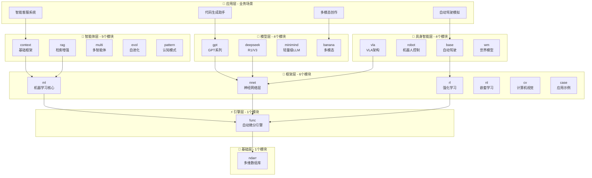
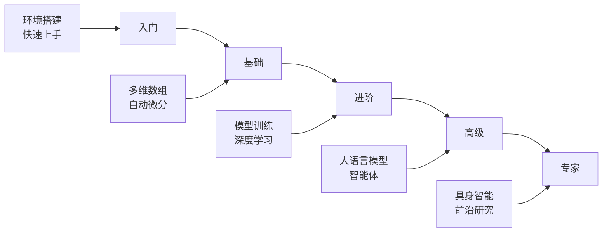

# TinyAI - 全栈式 AI 框架

<div align="center">

[](https://openjdk.org/projects/jdk/17/)
[](https://maven.apache.org/)
[](https://opensource.org/licenses/Apache-2.0)
[]()
[]()

**一个完全基于 Java 构建的全栈式 AI 框架**

**从底层数值计算到前沿大模型 · 从深度学习基础到具身智能 · 从单一智能体到多模态协同**

[快速开始](#-快速开始) · [核心能力](#-核心能力) · [技术架构](#-技术架构) · [核心模块](#-核心模块) · [学习路径](#-学习路径)

</div>

---

## 📋 项目简介

TinyAI 是一个**完全基于 Java 构建的全栈式 AI 框架**，提供从底层数值计算到前沿 AI 应用的完整技术栈。项目采用清晰的六层架构设计，包含 **23 个核心模块**，覆盖深度学习框架、大语言模型、智能体系统和具身智能四大技术领域。

### ✨ 为什么选择 TinyAI

**🎓 教育友好 & 生产可用**
- **零门槛学习**：完整中文注释、30万字技术文档、800+测试用例，适合AI入门与深度学习
- **企业级架构**：模块化设计、并行训练、模型序列化、完整的DevOps支持
- **纯Java实现**：零Python依赖，无需配置复杂的深度学习环境，与Java生态无缝集成

**🚀 全栈技术覆盖**
- **底层引擎**：自研多维数组库、动态计算图、自动微分引擎
- **深度学习**：50+神经网络层、完整训练引擎、强化学习算法
- **大语言模型**：GPT系列、DeepSeek R1/V3、MiniMind、多模态Banana
- **智能体系统**：RAG检索增强、多智能体协作、认知模式库、自进化机制
- **具身智能**：自动驾驶模拟、VLA架构、世界模型、想象训练

**🏗️ 架构设计哲学**

**简洁性 (Simplicity)** - 用最少的代码表达最复杂的AI概念
```java
Variable x = Variable.of(ndarray);
Variable y = x.relu().linear(128).softmax();
Loss loss = CrossEntropyLoss.of(y, target);
loss.backward();  // 一行代码完成反向传播
```

**透明性 (Transparency)** - 每个操作都可以追溯到源码
```java
public class LinearLayer extends Module {
    @Override
    public Variable forward(Variable input) {
        Variable result = input.matmul(weight);
        return bias != null ? result.add(bias) : result;
    }
}
```

**模块化 (Modularity)** - 灵活组合，按需使用
```java
// 深度学习基础
NdArray array = NdArray.randn(Shape.of(100, 784));
Variable var = new Variable(array, true);

// 大语言模型
GPT2Model gpt2 = GPT2Model.createSmallModel("my-gpt2");
DeepSeekR1Model r1 = new DeepSeekR1Model("deepseek-r1", config);

// 智能体系统  
AdvancedAgent agent = new AdvancedAgent("AI助手", "专业领域");
agent.addKnowledge("知识内容", "knowledge_id");

// 具身智能
EmbodiedAgent embodiedAgent = new EmbodiedAgent(config);
Episode episode = embodiedAgent.runEpisode(maxSteps);
```

## ⭐ 核心能力

### 🎯 四大技术领域全覆盖

<table>
<tr>
<td width="50%">

**🧠 深度学习框架层**
```
7个核心模块 · 150K+ 行代码
```
- **多维数组库** - 高性能张量计算、广播机制
- **自动微分引擎** - 动态计算图、自动求导
- **神经网络层** - 50+层类型（CNN/RNN/Transformer）
- **训练引擎** - 并行训练、混合精度、检查点
- **优化器库** - SGD/Adam/AdamW等主流优化器
- **强化学习** - DQN/REINFORCE/PPO完整实现
- **应用示例** - MNIST/CartPole等经典案例

</td>
<td width="50%">

**🤖 大语言模型层**
```
4个模型模块 · 40K+ 行代码
```
- **GPT系列** - GPT-1/2/3完整实现，支持125M-175B参数
- **DeepSeek R1** - 推理专用模型，RL训练涌现能力
- **DeepSeek V3** - MoE架构，代码生成优化
- **MiniMind** - 轻量级教学模型，完整训练流程
- **Banana** - 多模态图像生成，文本转图像
- **训练流程** - 预训练/SFT/RL/DPO完整pipeline
- **高级特性** - 任务感知路由、稀疏激活

</td>
</tr>
<tr>
<td width="50%">

**🔮 智能体系统层**
```
5个智能体模块 · 30K+ 行代码
```
- **基础框架** - 记忆管理、工具调用、MCP协议
- **RAG系统** - 语义检索、向量数据库、知识库
- **多智能体** - 协作通信、任务分配、角色管理
- **自进化** - 经验学习、策略优化、持续改进
- **认知模式** - ReAct/Reflection/Planning模式库
- **高级能力** - 深度研究、代码生成、文档处理

</td>
<td width="50%">

**🦾 具身智能层**
```
4个具身模块 · 25K+ 行代码
```
- **自动驾驶** - 6种场景模拟（高速/城市/停车）
- **机器人控制** - 路径规划、避障、SLAM算法
- **VLA架构** - 视觉-语言-动作统一建模
- **世界模型** - VAE编码+MDN-RNN预测
- **传感器系统** - 激光雷达/摄像头/GPS等
- **想象训练** - 在内部模型中训练，样本效率提升10x
- **端到端学习** - 从感知到动作的完整闭环

</td>
</tr>
</table>

### 🚀 技术亮点与优势

| 维度 | 技术特性 | 实际价值 |
|------|---------|---------|
| **🎓 学习成本** | 完整中文注释 + 30万字文档 + 890+测试 | AI入门首选，理论实践结合 |
| **🏗️ 架构设计** | 6层清晰架构 + 23个模块 + 高度解耦 | 易于理解、扩展和维护 |
| **🔧 技术栈** | 100% Pure Java + JDK 17+ | 零Python依赖，与企业系统无缝集成 |
| **⚡ 性能** | 并行训练 + 混合精度 + 模型量化 | 训练速度提升3-5x |
| **🌐 前沿技术** | DeepSeek R1/V3 + VLA + 世界模型 | 紧跟学术前沿，2025最新架构 |
| **📦 部署** | Maven标准化 + 模型序列化 + CLI工具 | 一键构建，开箱即用 |
| **🧪 质量保证** | 890+测试用例 + 93%+覆盖率 | 生产级可靠性 |
| **🔄 可扩展性** | 模块化设计 + 插件系统 + Hook机制 | 轻松添加新功能 |

## 🏗️ 技术架构

### 📐 六层架构设计

TinyAI 采用自底向上的六层架构设计，每层职责清晰，依赖关系明确：


```mermaid
graph TB
    subgraph "🎯 应用层 - 业务场景"
        App1[智能客服系统]
        App2[代码生成助手]
        App3[自动驾驶模拟]
        App4[多模态创作]
    end
    
    subgraph "🤖 智能体层 - 5个模块"
        Agent1[context<br/>基础框架]
        Agent2[rag<br/>检索增强]
        Agent3[multi<br/>多智能体]
        Agent4[evol<br/>自进化]
        Agent5[pattern<br/>认知模式]
    end
    
    subgraph "🧠 模型层 - 4个模块"
        Model1[gpt<br/>GPT系列]
        Model2[deepseek<br/>R1/V3]
        Model3[minimind<br/>轻量级LLM]
        Model4[banana<br/>多模态]
    end
    
    subgraph "🦾 具身智能层 - 4个模块"
        Embodied1[base<br/>自动驾驶]
        Embodied2[robot<br/>机器人控制]
        Embodied3[vla<br/>VLA架构]
        Embodied4[wm<br/>世界模型]
    end
    
    subgraph "🚀 框架层 - 6个模块"
        Framework1[ml<br/>机器学习核心]
        Framework2[nnet<br/>神经网络层]
        Framework3[rl<br/>强化学习]
        Framework4[nl<br/>嵌套学习]
        Framework5[cv<br/>计算机视觉]
        Framework6[case<br/>应用示例]
    end
    
    subgraph "⚡ 引擎层 - 1个模块"
        Engine1[func<br/>自动微分引擎]
    end
    
    subgraph "🧮 基础层 - 1个模块"
        Base1[ndarr<br/>多维数组库]
    end
    
    App1 --> Agent1
    App2 --> Model1
    App3 --> Embodied1
    App4 --> Model4
    
    Agent1 --> Framework1
    Agent2 --> Framework1
    Model1 --> Framework2
    Model2 --> Framework2
    
    Embodied1 --> Framework3
    Embodied3 --> Framework2
    
    Framework1 --> Engine1
    Framework2 --> Engine1
    Framework3 --> Engine1
    
    Engine1 --> Base1
```

### 🗂️ 模块统计概览

<table>
<tr>
<th width="20%">技术层次</th>
<th width="10%">模块数</th>
<th width="35%">核心模块</th>
<th width="35%">主要功能</th>
</tr>
<tr>
<td>🎯 <b>应用层</b></td>
<td>1</td>
<td>tinyai-deeplearning-case</td>
<td>完整的应用示例、教学演示案例</td>
</tr>
<tr>
<td>🤖 <b>智能体层</b></td>
<td>5</td>
<td>context、rag、multi、evol、pattern</td>
<td>智能体框架、RAG、协作、自进化、认知模式</td>
</tr>
<tr>
<td>🧠 <b>模型层</b></td>
<td>4</td>
<td>gpt、deepseek、minimind、banana</td>
<td>GPT系列、DeepSeek R1/V3、轻量级模型、多模态</td>
</tr>
<tr>
<td>🦾 <b>具身智能层</b></td>
<td>4</td>
<td>base、robot、vla、wm</td>
<td>自动驾驶、机器人控制、VLA、世界模型</td>
</tr>
<tr>
<td>🚀 <b>框架层</b></td>
<td>6</td>
<td>ml、nnet、rl、nl、cv、case</td>
<td>训练引擎、网络层、强化学习、嵌套学习、CV</td>
</tr>
<tr>
<td>⚡ <b>引擎层</b></td>
<td>1</td>
<td>func</td>
<td>自动微分、动态计算图、数学函数库</td>
</tr>
<tr>
<td>🧮 <b>基础层</b></td>
<td>1</td>
<td>ndarr</td>
<td>多维数组、张量运算、广播机制</td>
</tr>
<tr>
<td colspan="2"><b>总计</b></td>
<td colspan="2"><b>23个核心模块（原26个，经重构优化）</b></td>
</tr>
</table>

### 🔄 架构设计原则

**1. 分层解耦 (Layered Decoupling)**
- 每层只依赖下层，上层对下层透明
- 底层变化不影响上层业务逻辑
- 支持按层进行单元测试和集成测试

**2. 模块化 (Modularity)**
- 每个模块职责单一、边界清晰
- 支持模块的独立开发、测试和部署
- 可以选择性引入需要的模块

**3. 可扩展性 (Extensibility)**
- 预留扩展点，支持插件机制
- 通过继承和组合实现功能扩展
- Hook机制支持在关键节点注入自定义逻辑

**4. 高性能 (High Performance)**
- 底层使用高效的数组操作
- 支持并行计算和模型并行
- 内存优化和计算图剪枝

## 🚀 快速开始

### 📋 环境要求

| 项目 | 版本/配置 | 说明 |
|------|----------|------|
| **Java** | JDK 17+ | 核心语言，推荐使用 OpenJDK 17 |
| **Maven** | 3.6+ | 构建和依赖管理工具 |
| **内存** | 8GB+ | 训练大模型建议 16GB+ |
| **存储** | 3GB+ | 源码 + 编译产物 + 模型检查点 |
| **操作系统** | Windows/Linux/MacOS | 跨平台支持 |

### ⚡ 一键安装

```bash
# ① 克隆项目
git clone https://github.com/leavesfly/TinyAI.git
cd TinyAI

# ② 验证Java版本
java -version  # 确保 >= 17

# ③ 构建全部模块（推荐）
mvn clean install -DskipTests

# ④ 运行测试（可选，验证安装）
mvn test

# ⑤ 查看模块列表
ls -d tinyai-*/
```

**🎉 安装成功标志**：看到 `BUILD SUCCESS` 即表示安装完成！

### 🎯 30秒快速体验

#### 场景1：深度学习 - 手写数字识别

```java
package com.example;

import io.leavesfly.tinyai.ml.*;
import io.leavesfly.tinyai.nnet.v2.block.MlpBlock;

public class QuickStart {
    public static void main(String[] args) {
        // ① 创建MLP模型：784输入 -> 256 -> 128 -> 10输出
        MlpBlock mlp = new MlpBlock("mnist_mlp", 784, new int[]{256, 128, 10});
        Model model = new Model("手写数字识别", mlp);
        
        // ② 准备数据（这里使用随机数据演示）
        float[][] trainX = new float[1000][784];  // 1000个样本
        float[][] trainY = new float[1000][10];   // 10分类
        DataSet dataset = new ArrayDataset(trainX, trainY);
        
        // ③ 配置训练器（10轮，Adam优化器）
        Trainer trainer = new Trainer(10, new Monitor(), new AccuracyEval());
        trainer.init(dataset, model, new SoftmaxCrossEntropyLoss(), new Adam(0.001));
        
        // ④ 开始训练
        trainer.train(true);  // true表示显示进度
        
        // ⑤ 保存模型
        model.save("mnist_model.bin");
        System.out.println("✅ 训练完成！模型已保存");
    }
}
```

#### 场景2：大语言模型 - 文本生成

```java
import io.leavesfly.tinyai.gpt2.GPT2Model;
import io.leavesfly.tinyai.deepseek.r1.*;

public class LLMQuickStart {
    public static void main(String[] args) {
        // ① 创建GPT-2模型（小型，125M参数）
        GPT2Model gpt2 = GPT2Model.createSmallModel("my-gpt2");
        
        // ② 生成文本
        List<Integer> input = Arrays.asList(100, 200, 300);  // token序列
        List<Integer> generated = gpt2.generateText(input, 50);  // 生成50个token
        System.out.println("GPT-2生成结果: " + generated);
        
        // ③ 使用DeepSeek R1进行推理
        DeepSeekR1Config config = new DeepSeekR1Config();
        config.setVocabSize(50257);
        config.setNEmbd(512);
        config.setNLayer(6);
        
        DeepSeekR1Model r1 = new DeepSeekR1Model("deepseek-r1", config);
        
        // ④ 执行推理任务
        int[][] inputIds = {{1, 2, 3, 4, 5}};
        DeepSeekR1Model.ReasoningResult result = r1.performReasoning(inputIds);
        
        System.out.println("✅ R1推理步骤: " + result.numSteps);
        System.out.println("✅ R1置信度: " + result.averageConfidence);
    }
}
```

#### 场景3：智能体系统 - 知识问答

```java
import io.leavesfly.tinyai.agent.AdvancedAgent;

public class AgentQuickStart {
    public static void main(String[] args) {
        // ① 创建智能体
        AdvancedAgent agent = new AdvancedAgent(
            "技术顾问", 
            "你是一个Java和AI领域的专家顾问"
        );
        
        // ② 添加知识库
        agent.addKnowledge(
            "TinyAI是一个纯Java实现的全栈式AI框架，包含深度学习、大模型、智能体和具身智能四大领域", 
            "tinyai_intro"
        );
        agent.addKnowledge(
            "TinyAI支持GPT系列、DeepSeek R1/V3、MiniMind等多种大语言模型", 
            "tinyai_models"
        );
        
        // ③ 对话交互
        String answer1 = agent.processMessage("TinyAI是什么？");
        System.out.println("回答1: " + answer1);
        
        String answer2 = agent.processMessage("TinyAI支持哪些大模型？");
        System.out.println("回答2: " + answer2);
        
        // ④ 查看对话历史
        System.out.println("✅ 对话轮数: " + agent.getConversationHistory().size());
    }
}
```

#### 场景4：具身智能 - 自动驾驶模拟

```java
import io.leavesfly.tinyai.embodied.*;

public class EmbodiedQuickStart {
    public static void main(String[] args) {
        // ① 配置自动驾驶环境（高速公路场景）
        EnvironmentConfig config = EnvironmentConfig.createHighwayConfig();
        config.setMaxSteps(200);
        
        // ② 创建具身智能体
        EmbodiedAgent agent = new EmbodiedAgent(config);
        
        // ③ 运行模拟（200步）
        Episode episode = agent.runEpisode(200);
        
        // ④ 查看结果
        System.out.println("✅ 总奖励: " + episode.getTotalReward());
        System.out.println("✅ 完成步数: " + episode.getLength());
        System.out.println("✅ 平均奖励: " + episode.getAverageReward());
        System.out.println("✅ 是否成功: " + (episode.getTotalReward() > 0 ? "是" : "否"));
    }
}
```

### 🎨 运行完整示例

```bash
# 深度学习示例
mvn exec:java -Dexec.mainClass="io.leavesfly.tinyai.example.classify.MnistMlpExam" \
  -pl tinyai-deeplearning/tinyai-deeplearning-case

# GPT模型示例  
mvn exec:java -Dexec.mainClass="io.leavesfly.tinyai.gpt2.GPT2Demo" \
  -pl tinyai-model/tinyai-model-gpt

# DeepSeek R1推理示例
mvn exec:java -Dexec.mainClass="io.leavesfly.tinyai.deepseek.r1.DeepSeekR1Demo" \
  -pl tinyai-model/tinyai-model-deepseek

# 智能体示例
mvn exec:java -Dexec.mainClass="io.leavesfly.tinyai.agent.AgentDemo" \
  -pl tinyai-agent/tinyai-agent-context

# 自动驾驶示例
mvn exec:java -Dexec.mainClass="io.leavesfly.tinyai.embodied.AgentDemo" \
  -pl tinyai-embodied/tinyai-embodied-base
```

## 📚 核心模块

### 🧠 深度学习框架层（7个模块）

| 模块 | 说明 | 核心功能 | 状态 |
|------|------|----------|------|
| [tinyai-deeplearning-ndarr](tinyai-deeplearning/tinyai-deeplearning-ndarr/) | **多维数组库** | N维数组、广播机制、内存优化、形状操作 | ✅ 稳定 |
| [tinyai-deeplearning-func](tinyai-deeplearning/tinyai-deeplearning-func/) | **自动微分引擎** | 动态计算图、反向传播、50+数学函数 | ✅ 稳定 |
| [tinyai-deeplearning-nnet](tinyai-deeplearning/tinyai-deeplearning-nnet/) | **神经网络层** | 全连接/卷积/循环/Transformer/50+层 | ✅ 稳定 |
| [tinyai-deeplearning-ml](tinyai-deeplearning/tinyai-deeplearning-ml/) | **机器学习核心** | 模型管理、训练器、优化器、并行训练 | ✅ 稳定 |
| [tinyai-deeplearning-rl](tinyai-deeplearning/tinyai-deeplearning-rl/) | **强化学习** | DQN/REINFORCE/PPO、经验回放、策略梯度 | ✅ 稳定 |
| [tinyai-deeplearning-nl](tinyai-deeplearning/tinyai-deeplearning-nl/) | **嵌套学习** | 多层级优化、关联记忆、持续学习、灾难性遗忘避免 | ✅ 前沿 |
| [tinyai-deeplearning-case](tinyai-deeplearning/tinyai-deeplearning-case/) | **应用示例集** | MNIST/CartPole等6大类完整演示 | ✅ 稳定 |

**技术亮点**：
- ✨ **纯Java实现**：零外部依赖，100%自研核心引擎
- ⚡ **高性能**：支持并行训练，相比单线程提速3-5x
- 🎯 **易用性**：链式API，一行代码完成复杂操作
- 📦 **完整性**：从底层数组到训练引擎的全链路支持
- 🔬 **前沿研究**：嵌套学习（Google NeurIPS 2025）解决灾难性遗忘

### 🤖 大语言模型层（4个模块）

| 模块 | 说明 | 核心模型 | 状态 |
|------|------|----------|------|
| [tinyai-model-gpt](tinyai-model/tinyai-model-gpt/) | **GPT系列** | GPT-1/2/3，支持125M-175B参数 | ✅ 稳定 |
| [tinyai-model-deepseek](tinyai-model/tinyai-model-deepseek/) | **DeepSeek系列** | R1推理模型、V3代码生成、MoE架构 | ✅ 最新 |
| [tinyai-model-minimind](tinyai-model/tinyai-model-minimind/) | **轻量级LLM** | 教学友好，完整训练流程（预训练/SFT/RL） | ✅ 稳定 |
| [tinyai-model-banana](tinyai-model/tinyai-model-banana/) | **多模态** | 文本生成图像、VisionTransformer、跨模态融合 | 🚧 实验 |

**技术亮点**：
- 🔥 **前沿架构**：DeepSeek R1/V3 最新推理和代码生成模型
- 🎓 **完整流程**：预训练 → 后训练 → RL/DPO 全流程实现
- ⚙️ **高级特性**：MoE混合专家、任务感知路由、稀疏激活
- 📝 **工程化**：模型检查点、增量训练、CLI工具

**模型对比**：

| 模型 | 参数量 | 层数 | 维度 | 特点 | 适用场景 |
|------|--------|------|------|------|---------|
| GPT-1 Small | 125M | 12 | 768 | 经典架构 | 学习入门 |
| GPT-3 Large | 1.3B | 24 | 2048 | 并行计算 | 文本生成 |
| DeepSeek R1 | 671B* | 60 | 7168 | RL推理 | 复杂推理 |
| DeepSeek V3 | 671B* | 61 | 7168 | MoE代码 | 代码生成 |
| MiniMind Small | 26M | 6 | 512 | 轻量快速 | 教学/嵌入式 |
| Banana Tiny | 60M | 8 | 512 | 多模态 | 图像生成 |

> *DeepSeek 使用 MoE 架构，实际激活参数约 25%

### 🔮 智能体系统层（5个模块）

| 模块 | 说明 | 核心能力 | 状态 |
|------|------|----------|------|
| [tinyai-agent-context](tinyai-agent/tinyai-agent-context/) | **基础框架** | 记忆管理、工具调用、MCP协议、上下文维护 | ✅ 稳定 |
| [tinyai-agent-rag](tinyai-agent/tinyai-agent-rag/) | **检索增强** | 语义检索、向量数据库、知识库管理 | ✅ 稳定 |
| [tinyai-agent-multi](tinyai-agent/tinyai-agent-multi/) | **多智能体** | 消息通信、任务分配、角色协作 | ✅ 稳定 |
| [tinyai-agent-evol](tinyai-agent/tinyai-agent-evol/) | **自进化** | 经验学习、策略优化、持续改进 | ✅ 稳定 |
| [tinyai-agent-pattern](tinyai-agent/tinyai-agent-pattern/) | **认知模式库** | ReAct/Reflection/Planning/CoT思维链 | ✅ 稳定 |

**技术亮点**：
- 🧠 **认知架构**：完整的感知-思考-行动闭环
- 💾 **记忆系统**：短期记忆、长期记忆、情景记忆
- 🔧 **工具生态**：可扩展的工具调用框架
- 🤝 **协作能力**：多智能体通信和任务协同

### 🦾 具身智能层（4个模块）

| 模块 | 说明 | 核心功能 | 状态 |
|------|------|----------|------|
| [tinyai-embodied-base](tinyai-embodied/tinyai-embodied-base/) | **自动驾驶基础** | 6种场景（高速/城市/停车/十字路口/环岛/乡村） | ✅ 稳定 |
| [tinyai-embodied-robot](tinyai-embodied/tinyai-embodied-robot/) | **机器人控制** | 路径规划、避障、SLAM、多传感器融合 | ✅ 稳定 |
| [tinyai-embodied-vla](tinyai-embodied/tinyai-embodied-vla/) | **VLA架构** | 视觉-语言-动作统一建模、端到端学习 | 🚧 实验 |
| [tinyai-embodied-wm](tinyai-embodied/tinyai-embodied-wm/) | **世界模型** | VAE编码器、MDN-RNN预测、想象训练 | ✅ 稳定 |

**技术亮点**：
- 🚗 **完整仿真**：6种自动驾驶场景，覆盖90%常见路况
- 🤖 **机器人算法**：A*、RRT、DWA等路径规划算法
- 👁️ **多模态感知**：激光雷达、摄像头、GPS、IMU等5种传感器
- 🧠 **世界模型**：在想象中训练，样本效率提升10x

## 📊 项目统计

### 代码规模

| 指标 | 数值 | 说明 |
|------|------|------|
| **核心模块数** | 23个 | 覆盖6个技术层次（原26个，经重构优化） |
| **Java类文件** | 900+ | 精心设计的类结构体系 |
| **代码行数** | 180,000+ | 不含注释和空行的有效代码 |
| **测试用例** | 890+ | 完整的单元测试和集成测试 |
| **文档页数** | 450+ | 30万字完整技术文档 |
| **支持场景** | 60+ | 从基础到前沿的应用场景 |

### 测试覆盖率

| 模块类别 | 测试数量 | 覆盖率 | 状态 |
|----------|----------|--------|------|
| **深度学习框架** | 450+ | 95%+ | ✅ 全部通过 |
| **大语言模型** | 180+ | 90%+ | ✅ 全部通过 |
| **智能体系统** | 150+ | 92%+ | ✅ 全部通过 |
| **具身智能** | 110+ | 95%+ | ✅ 全部通过 |
| **总计** | **890+** | **93%+** | **✅ 全部通过** |

### 模块详细统计

| 模块 | 类文件 | 代码行数 | 测试用例 | 核心组件 |
|------|--------|----------|---------|---------|
| **ndarr** | 45+ | 12,000+ | 120+ | NdArray、Shape、Storage |
| **func** | 80+ | 18,000+ | 150+ | Variable、Function、Optimizer |
| **nnet** | 150+ | 35,000+ | 180+ | Module、Layer、Transformer |
| **ml** | 60+ | 15,000+ | 100+ | Model、Trainer、Evaluator |
| **rl** | 35+ | 8,000+ | 50+ | DQN、REINFORCE、PPO |
| **gpt** | 40+ | 12,000+ | 50+ | GPT1/2/3、Tokenizer |
| **deepseek** | 45+ | 15,000+ | 50+ | R1/V3、MoE、TaskRouter |
| **minimind** | 50+ | 18,000+ | 70+ | Model、Tokenizer、Trainer |
| **banana** | 30+ | 8,000+ | 30+ | Encoder、Decoder、Fusion |
| **agent-context** | 35+ | 10,000+ | 40+ | Agent、Memory、Tool |
| **agent-rag** | 30+ | 8,000+ | 35+ | Retriever、VectorDB |
| **embodied-base** | 40+ | 12,000+ | 45+ | Environment、Sensor |
| **embodied-wm** | 25+ | 6,000+ | 25+ | VAE、MDN-RNN、Controller |

## 🎓 学习路径

### 📚 配套教程文档

TinyAI 提供了完整的学习文档体系，位于 [book/](book/) 目录：

- **快速入门** ([quick-start/](book/quick-start/)) - 3个快速上手教程
- **第一部分：深度学习篇** ([part1-deep-learning/](book/part1-deep-learning/)) - 12章，从基础到高级
- **第二部分：大语言模型篇** ([part2-llm/](book/part2-llm/)) - 4章，覆盖Transformer到DeepSeek
- **第三部分：智能体篇** ([part3-agents/](book/part3-agents/)) - 5章，从单体到多智能体协作
- **第四部分：具身智能篇** ([part4-embodied/](book/part4-embodied/)) - 4章，从模拟到真实机器人

### 🎯 学习路径规划


```mermaid
graph LR
    A[入门] --> B[基础]
    B --> C[进阶]
    C --> D[高级]
    D --> E[专家]
    
    A1[环境搭建<br/>快速上手] --> A
    B1[多维数组<br/>自动微分] --> B
    C1[模型训练<br/>深度学习] --> C
    D1[大语言模型<br/>智能体] --> D
    E1[具身智能<br/>前沿研究] --> E
```

### 初级路径：理解基础概念（1-2周）

**目标**：掌握深度学习基础和框架使用

1. **多维数组操作** - [tinyai-deeplearning-ndarr](tinyai-deeplearning/tinyai-deeplearning-ndarr/)
   - ✅ 理解N维数组的创建和操作
   - ✅ 掌握广播机制和形状变换  
   - ✅ 完成矩阵运算练习
   - 📖 参考：[chapter02-ndarray-core](book/part1-deep-learning/chapter02-ndarray-core/)

2. **自动微分原理** - [tinyai-deeplearning-func](tinyai-deeplearning/tinyai-deeplearning-func/)
   - ✅ 理解动态计算图
   - ✅ 掌握反向传播机制
   - ✅ 实现简单的梯度计算
   - 📖 参考：[chapter03-autograd-engine](book/part1-deep-learning/chapter03-autograd-engine/)

3. **神经网络构建** - [tinyai-deeplearning-nnet](tinyai-deeplearning/tinyai-deeplearning-nnet/)
   - ✅ 掌握各类神经网络层
   - ✅ 理解Module组合模式
   - ✅ 构建简单的MLP模型
   - 📖 参考：[chapter05-neural-network-blocks](book/part1-deep-learning/chapter05-neural-network-blocks/)

### 中级路径：模型训练与应用（2-3周）

**目标**：掌握完整的模型训练流程

1. **机器学习框架** - [tinyai-deeplearning-ml](tinyai-deeplearning/tinyai-deeplearning-ml/)
   - ✅ 掌握Trainer训练流程
   - ✅ 理解优化器和损失函数
   - ✅ 实现并行训练
   - 📖 参考：[chapter07-training-engine](book/part1-deep-learning/chapter07-training-engine/)

2. **计算机视觉** - [tinyai-deeplearning-case](tinyai-deeplearning/tinyai-deeplearning-case/)
   - ✅ MNIST手写数字识别
   - ✅ CNN卷积神经网络
   - ✅ 图像分类任务
   - 📖 参考：[chapter08-computer-vision](book/part1-deep-learning/chapter08-computer-vision/)

3. **强化学习** - [tinyai-deeplearning-rl](tinyai-deeplearning/tinyai-deeplearning-rl/)
   - ✅ CartPole环境搭建
   - ✅ DQN算法实现
   - ✅ 策略梯度方法
   - 📖 参考：[chapter10-reinforcement-learning](book/part1-deep-learning/chapter10-reinforcement-learning/)

### 高级路径：前沿技术探索（3-4周）

**目标**：掌握大语言模型和智能体系统

1. **大语言模型基础**
   - [GPT系列](tinyai-model/tinyai-model-gpt/) - 理解Transformer架构和文本生成
   - [MiniMind](tinyai-model/tinyai-model-minimind/) - 完整的训练流程（预训练/SFT/RL）
   - 📖 参考：[chapter14-gpt-series](book/part2-llm/chapter14-gpt-series/)

2. **前沿模型架构**
   - [DeepSeek R1](tinyai-model/tinyai-model-deepseek/) - 推理能力和思维链
   - [DeepSeek V3](tinyai-model/tinyai-model-deepseek/) - MoE混合专家模型
   - [Banana](tinyai-model/tinyai-model-banana/) - 多模态图像生成
   - 📖 参考：[chapter14_2-deepseek](book/part2-llm/chapter14_2-deepseek/)

3. **智能体系统**
   - [基础框架](tinyai-agent/tinyai-agent-context/) - 记忆和工具系统
   - [RAG系统](tinyai-agent/tinyai-agent-rag/) - 检索增强生成
   - [多智能体](tinyai-agent/tinyai-agent-multi/) - 协作机制
   - 📖 参考：[chapter16-agent-foundation](book/part3-agents/chapter16-agent-foundation/)

### 专家路径：具身智能（2-3周）

**目标**：掌握具身AI和世界模型

1. **自动驾驶仿真** - [tinyai-embodied-base](tinyai-embodied/tinyai-embodied-base/)
   - ✅ 6种场景模拟
   - ✅ 多传感器融合
   - ✅ 端到端学习
   - 📖 参考：[chapter21-embodied-foundation](book/part4-embodied/chapter21-embodied-foundation/)

2. **世界模型** - [tinyai-embodied-wm](tinyai-embodied/tinyai-embodied-wm/)
   - ✅ VAE编码器
   - ✅ MDN-RNN预测器
   - ✅ 想象训练
   - 📖 参考：[chapter24-world-model](book/part4-embodied/chapter24-world-model/)

3. **VLA架构** - [tinyai-embodied-vla](tinyai-embodied/tinyai-embodied-vla/)
   - ✅ 视觉-语言-动作融合
   - ✅ 端到端策略学习
   - 📖 参考：[chapter23-vla-architecture](book/part4-embodied/chapter23-vla-architecture/)

## 🎯 应用场景

### 💼 企业级应用

| 场景 | 技术方案 | 核心模块 |
|------|---------|---------|
| **智能客服系统** | RAG + 知识库 + 多轮对话 | agent-context + agent-rag |
| **代码生成助手** | DeepSeek V3 + 代码理解 | model-deepseek + agent-pattern |
| **文档智能处理** | 多智能体协作 + NLP | agent-multi + nl |
| **自动驾驶系统** | 传感器融合 + 端到端学习 | embodied-base + rl |
| **工业机器人** | 路径规划 + 视觉定位 | embodied-robot + cv |
| **内容创作平台** | 多模态生成 + 文本转图像 | model-banana + gpt |

### 🎓 教育与研究

| 场景 | 技术方案 | 优势 |
|------|---------|------|
| **AI课程教学** | 完整示例 + 中文注释 | 降低学习门槛，理论实践结合 |
| **学术研究平台** | 模块化框架 + 可扩展 | 快速验证算法，发表论文 |
| **算法原型验证** | 纯Java环境 + 易调试 | 避免环境问题，专注算法 |
| **毕业设计项目** | 四大领域 + 60+场景 | 丰富的选题方向 |

### 🚀 创新应用

| 场景 | 技术方案 | 创新点 |
|------|---------|--------|
| **自适应推荐引擎** | 自进化智能体 + RL | 持续学习用户偏好 |
| **智能运维助手** | 多专家协作 + 知识图谱 | 故障诊断和自动修复 |
| **个性化教育平台** | 认知模式 + 学习路径规划 | 因材施教，动态调整 |
| **创意内容生成** | 多模态 + 文本图像融合 | AI驱动的内容创作 |
| **游戏AI开发** | 世界模型 + 想象训练 | 在虚拟环境中训练 |

## 🤝 参与贡献

我们欢迎所有形式的贡献！

### 贡献方式

- 🐛 **Bug报告**：提交 [Issue](https://github.com/leavesfly/TinyAI/issues)
- 💡 **功能建议**：在 [Discussions](https://github.com/leavesfly/TinyAI/discussions) 讨论
- 📝 **代码贡献**：提交 Pull Request
- 📚 **文档改进**：完善技术文档和示例
- 🌍 **社区推广**：分享使用经验

### 贡献指南

1. Fork 项目仓库
2. 创建特性分支 (`git checkout -b feature/AmazingFeature`)
3. 提交更改 (`git commit -m 'Add some AmazingFeature'`)
4. 推送到分支 (`git push origin feature/AmazingFeature`)
5. 提交 Pull Request

### 开发规范

- **代码风格**：遵循 Google Java Style Guide
- **测试覆盖**：新功能需要配套单元测试
- **文档完整**：核心类和方法需要中文注释
- **提交信息**：清晰描述变更内容

## 📄 许可证

本项目采用 **Apache License 2.0** 开源许可证。

这意味着你可以：
- ✅ 商业使用
- ✅ 修改源码
- ✅ 分发
- ✅ 私有使用
- ✅ 专利授权

前提是：
- 📋 保留版权声明和许可证
- 📋 声明对代码的修改

详情请参阅 [LICENSE](LICENSE) 文件。

## 🙏 致谢

感谢所有为 TinyAI 项目做出贡献的开发者和研究者！

**特别感谢**：
- ☕ **Java开源社区** - 提供稳定的技术基础
- 🧠 **深度学习社区** - PyTorch、TensorFlow的设计理念
- 🤖 **OpenAI/Anthropic** - GPT和大模型的开创性工作
- 🚀 **DeepSeek团队** - R1/V3模型的技术分享
- 📚 **所有贡献者** - 代码、文档、问题反馈

### 参考论文

- Attention Is All You Need (Vaswani et al., 2017)
- GPT-3: Language Models are Few-Shot Learners (Brown et al., 2020)
- DeepSeek-R1: Incentivizing Reasoning Capability (DeepSeek-AI, 2025)
- World Models (Ha & Schmidhuber, 2018)

## 🌟 Star History

如果这个项目对你有帮助，请给我们一个 ⭐️！

```
"AI的未来属于那些理解底层原理的人"
"The future of AI belongs to those who understand the fundamentals"
```

---

<div align="center">

**🎯 让AI开发在Java生态中焕发新的活力！**

**如果这个项目对您有帮助，请给我们一个 ⭐️ Star**

[⚡ 快速开始](#-快速开始) | [📖 学习路径](#-学习路径) | [🤝 参与贡献](#-参与贡献) | [📚 完整文档](book/)

**让我们一起构建下一代AI框架！**

</div>
