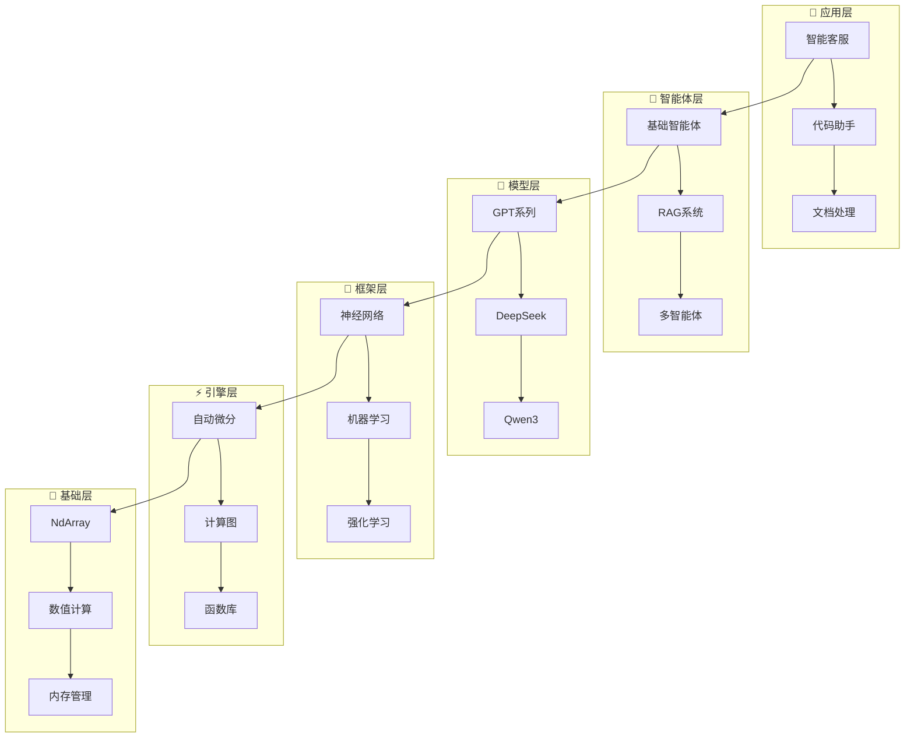
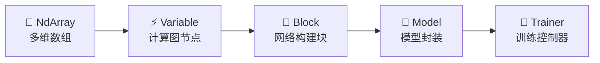
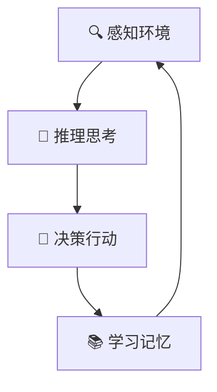
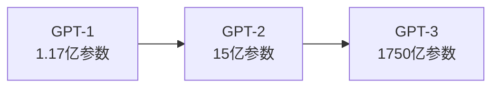
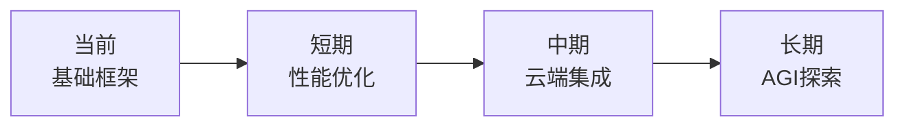

# TinyAI - 从零开始的Java AI之旅
## 技术分享文档

> **撰写者**: 山泽  
> **版本**: v1.0  
> **日期**: 2025年10月3日  

---

## 📖 目录

1. [为什么要有TinyAI？](#1-为什么要有tinyai)
2. [TinyAI是什么？](#2-tinyai是什么)
3. [架构设计精要](#3-架构设计精要)
4. [核心技术解析](#4-核心技术解析)
5. [智能体系统](#5-智能体系统)
6. [大语言模型实现](#6-大语言模型实现)
7. [典型应用案例](#7-典型应用案例)
8. [技术优势总结](#8-技术优势总结)
9. [应用前景展望](#9-应用前景展望)

---

## 1. 为什么要有TinyAI？

### 1.1 现状痛点

当Python统治AI世界时，Java开发者面临的困境：

- 🔗 **调用Python接口**：隔靴搔痒，难以深度定制
- 📚 **学习新技术栈**：成本高，周期长
- 🌐 **依赖云端API**：网络限制，成本问题
- 🔧 **技术栈割裂**：Java业务 + Python AI，维护复杂

### 1.2 TinyAI的解决方案

> **让Java开发者用最熟悉的语言，做最前沿的AI**

核心理念：
- ✅ **纯Java实现**：零第三方AI依赖
- ✅ **教育友好**：详细中文注释，易于学习
- ✅ **全栈覆盖**：从张量计算到大模型应用
- ✅ **模块化设计**：按需使用，灵活组合

---

## 2. TinyAI是什么？

### 2.1 一句话定义

> TinyAI是一个**完全基于Java**的**全栈式AI框架**，覆盖从底层数值计算到上层智能体应用的完整技术栈

### 2.2 技术全景

```
🏗️ TinyAI技术栈全景
├── 📱 应用层：智能客服、代码助手、文档分析
├── 🤖 智能体层：RAG、多智能体、自进化系统  
├── 🧠 模型层：GPT、DeepSeek、Qwen、LoRA
├── 🚀 框架层：神经网络、训练器、优化器
├── ⚡ 引擎层：自动微分、计算图管理
└── 🧮 基础层：多维数组、数值计算
```

### 2.3 模块分布

| 类别 | 模块数 | 主要功能 |
|------|--------|----------|
| **🤖 智能体** | 7个 | 对话、知识管理、协作 |
| **🧠 大模型** | 5个 | GPT/DeepSeek/Qwen实现 |
| **🚀 深度学习** | 6个 | 神经网络、训练、强化学习 |

---

## 3. 架构设计精要

### 3.1 分层架构设计



### 3.2 核心设计原则

- 🔗 **单向依赖**：下层独立，上层依赖下层
- 🧩 **职责分离**：每层专注特定功能
- 🔄 **接口抽象**：实现可替换，扩展灵活

### 3.3 五大核心组件



---

## 4. 核心技术解析

### 4.1 NdArray：计算基石

**核心功能**：专为AI优化的多维数组

```java
// 创建矩阵
NdArray matrix = NdArray.create(new float[][]{{1, 2, 3}, {4, 5, 6}});

// 矩阵运算
NdArray result = matrix.mul(another).add(bias);

// 广播机制
NdArray scalar = NdArray.scalar(2.0f);
NdArray doubled = matrix.mul(scalar);  // 自动广播
```

**技术特点**：
- 🚀 批量高效计算
- 🔄 智能广播机制  
- 💾 内存布局优化

### 4.2 Variable：自动微分核心

**核心价值**：让梯度计算自动化

```java
// 构建计算图
Variable x = new Variable(NdArray.create(new float[]{1, 2, 3}));
Variable w = new Variable(NdArray.create(new float[]{0.5f, 0.3f, 0.2f}));
Variable y = x.mul(w).sum();

// 自动求导
y.backward();  // 魔法时刻！
System.out.println("梯度: " + w.getGrad()); // [1, 2, 3]
```

**技术优势**：
- 🧠 链式法则自动应用
- 📈 动态计算图
- 🔗 复杂函数梯度传播

### 4.3 Block：网络积木

**设计理念**：组合模式构建神经网络

```java
// 快速构建MLP
MlpBlock mlp = new MlpBlock("classifier", 
    784, new int[]{128, 64, 10}, Config.ActiveFunc.RELU);

// 自定义构建
SequentialBlock network = new SequentialBlock("custom");
network.addLayer(new DenseLayer("fc1", 784, 128));
network.addLayer(new ReluLayer("relu1"));
network.addLayer(new DenseLayer("fc2", 128, 10));
```

### 4.4 Model & Trainer：训练管理

```java
// 模型封装
Model model = new Model("classifier", mlpBlock);

// 智能训练器
Trainer trainer = new Trainer(50, monitor, evaluator, true, 4);
trainer.init(dataset, model, new CrossEntropyLoss(), new AdamOptimizer(0.001f));
trainer.train(true);  // 一键训练
```

---

## 5. 智能体系统

### 5.1 智能体核心能力



### 5.2 基础智能体框架

```java
// 创建智能体
AdvancedAgent agent = new AdvancedAgent("技术助手", "专业AI助手");

// 知识管理
agent.addKnowledge("TinyAI是Java AI框架", "framework_info");

// 工具集成
agent.getToolRegistry().registerTool("calculator", new CalculatorTool());

// 智能对话
String response = agent.processMessage("TinyAI有什么特点？");
```

### 5.3 RAG检索增强

**核心思想**：检索 + 生成 = 知识型AI

```java
// RAG系统
RAGSystem rag = new RAGSystem();
rag.addDocument(new Document("doc1", "TinyAI技术介绍"));

// 检索相关文档
List<RetrievalResult> results = rag.retrieve("Java AI框架", 3);

// 生成增强答案
String answer = rag.generateAnswer("什么是TinyAI？", results);
```

### 5.4 多智能体协作

```java
// 创建专家团队
MultiAgentSystem team = new MultiAgentSystem();
team.addAgent(new SpecializedAgent("代码专家", "编程问题专家"));
team.addAgent(new SpecializedAgent("文档专家", "文档编写专家"));

// 协作解决问题
CollaborationResult result = team.processTask("开发新功能");
```

---

## 6. 大语言模型实现

### 6.1 GPT系列演进



### 6.2 GPT-2实现示例

```java
// 创建GPT-2模型
GPT2Config config = GPT2Config.createMediumConfig();
GPT2Model model = new GPT2Model("gpt2-medium", config);

// 文本生成
List<Integer> prompt = tokenizer.encode("人工智能的未来");
List<Integer> generated = model.generateText(prompt, 100);
String text = tokenizer.decode(generated);
```

### 6.3 现代模型支持

- **DeepSeek**：R1推理模型 + V3混合专家
- **Qwen3**：GQA、RoPE、SwiGLU等先进技术
- **LoRA**：参数高效微调
- **MoE**：混合专家模型

### 6.4 LoRA微调示例

```java
// LoRA配置
LoraConfig config = LoraConfig.builder()
    .rank(16).alpha(32).dropout(0.1f).build();

// LoRA层
LoraLinearLayer layer = new LoraLinearLayer("lora", 1024, 1024, config);
layer.enableLora();  // 启用微调
```

---

## 7. 典型应用案例

### 7.1 MNIST手写数字识别

```java
// 完整训练流程
DataSet dataset = MnistLoader.loadMnist("data/mnist");
MlpBlock classifier = new MlpBlock("mnist", 784, new int[]{128, 64, 10});
Model model = new Model("classifier", classifier);

Trainer trainer = new Trainer(50, monitor, evaluator, true, 4);
trainer.init(dataset, model, new CrossEntropyLoss(), new AdamOptimizer());
trainer.train(true);

// 训练结果：98.1%准确率
```

### 7.2 强化学习CartPole

```java
// DQN智能体训练
CartPoleEnvironment env = new CartPoleEnvironment();
DQNAgent agent = new DQNAgent("CartPole", 4, 2, new int[]{128, 128});

// 训练循环
for (int episode = 0; episode < 1000; episode++) {
    float[] state = env.reset();
    while (!env.isDone()) {
        int action = agent.selectAction(state);
        StepResult step = env.step(action);
        agent.storeExperience(state, action, step.reward, step.nextState);
        if (agent.readyToLearn()) agent.learn();
        state = step.nextState;
    }
}
```

### 7.3 GPT文本生成

```java
// 文本生成应用
GPT2Model model = GPT2Model.createSmallModel();
String prompt = "人工智能的发展";
List<Integer> tokens = tokenizer.encode(prompt);
List<Integer> generated = model.generateText(tokens, 100, 0.8f, 0.9f);
String result = tokenizer.decode(generated);
```

---

## 8. 技术优势总结

### 8.1 Java生态优势

| 优势 | TinyAI | Python AI框架 |
|------|--------|---------------|
| 类型安全 | ✅ 编译时检查 | ❌ 运行时错误 |
| 企业集成 | ✅ 原生支持 | ❌ 需要包装 |
| 部署简单 | ✅ 单JAR包 | ❌ 复杂依赖 |
| 团队协作 | ✅ Java开发者友好 | ❌ 需学Python |

### 8.2 架构创新点

- **分层解耦**：每层独立，职责清晰
- **组合模式**：积木式网络构建
- **并行优化**：内置多线程训练
- **教育友好**：中文注释，渐进学习

### 8.3 生产特性

```java
// 模型序列化
model.save("production.tinyai");
Model loaded = Model.load("production.tinyai");

// 训练监控
monitor.addMetric("accuracy", new AccuracyMetric());
monitor.plotTrainingCurves();

// 并行推理
NdArray predictions = model.predictBatch(data);
```

---

## 9. 应用前景展望

### 9.1 目标应用场景

#### 企业级应用
- 🏢 **智能客服**：基于RAG的企业知识问答
- 📊 **数据分析**：深度学习驱动的业务预测
- 🔧 **代码助手**：GPT支持的编程辅助工具
- 📄 **文档处理**：多智能体协作的文档分析

#### 教育研究
- 🎓 **AI教学**：可视化交互学习平台
- 🔬 **算法验证**：快速原型实验框架
- 📚 **学术研究**：多智能体协作研究工具

### 9.2 发展路线图



**短期目标**（3-6个月）：
- 🚀 GPU加速支持
- 🧠 更多经典模型
- 🔧 可视化工具

**中期目标**（6-12个月）：
- 🌐 分布式训练
- 🤖 多模态智能体
- 📊 企业级功能

**长期愿景**（1-2年）：
- 🏭 工业级部署
- 🔬 AGI技术探索
- 🌍 开源社区建设

### 9.3 为什么选择TinyAI？

**对Java开发者**：
- 无需学习新语言
- 利用现有技能栈
- 团队技术统一

**对企业决策者**：
- 降低技术风险
- 减少人才成本
- 快速产品交付

**对学生研究者**：
- 学习门槛低
- 算法透明可见
- 社区支持活跃

---

## 总结

TinyAI代表了一个理念：

> **让AI开发在Java生态中焕发新的活力**

### 核心价值

- 🏗️ **技术完整**：全栈AI框架，覆盖基础到应用
- 🧩 **架构优雅**：模块化设计，组合灵活
- 🎯 **生产就绪**：企业级特性，支持大规模部署
- 📚 **教育友好**：学习门槛低，注释详细

### 未来展望

TinyAI不仅是一个框架，更是Java AI生态的探索者。我们相信，通过持续创新和社区建设，能够：

- 🚀 让更多Java开发者参与AI创新
- 🎓 为AI教育提供更好的工具
- 🏢 在企业应用中发挥Java优势
- 🌟 为Java生态创造新可能

### 行动召唤

加入我们，一起用Java的力量探索AI的无限可能！

- 📧 **联系方式**：[tinyai@example.com](mailto:tinyai@example.com)
- 🐙 **项目地址**：[GitHub - TinyAI](https://github.com/leavesfly/TinyAI)
- 💬 **技术交流**：TinyAI开发者社群

---

**感谢关注TinyAI！期待与您共建Java AI生态的美好未来！** 🎉

> *"让每个Java开发者都能轻松玩转AI"* - TinyAI团队