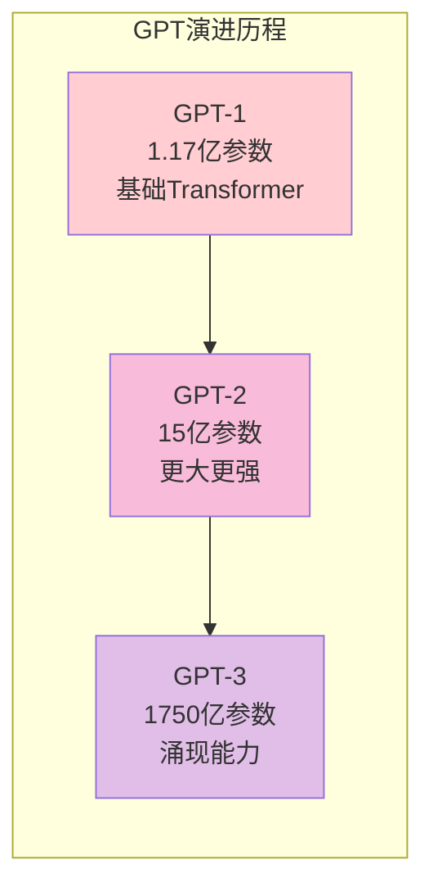
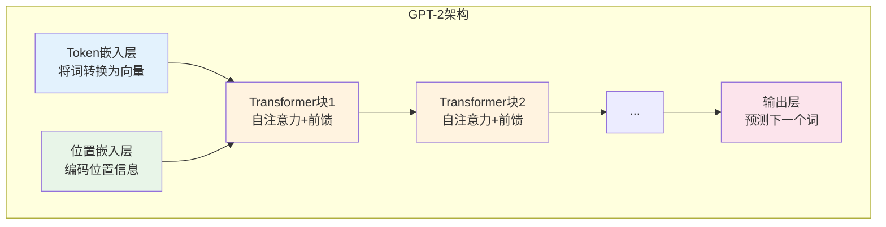
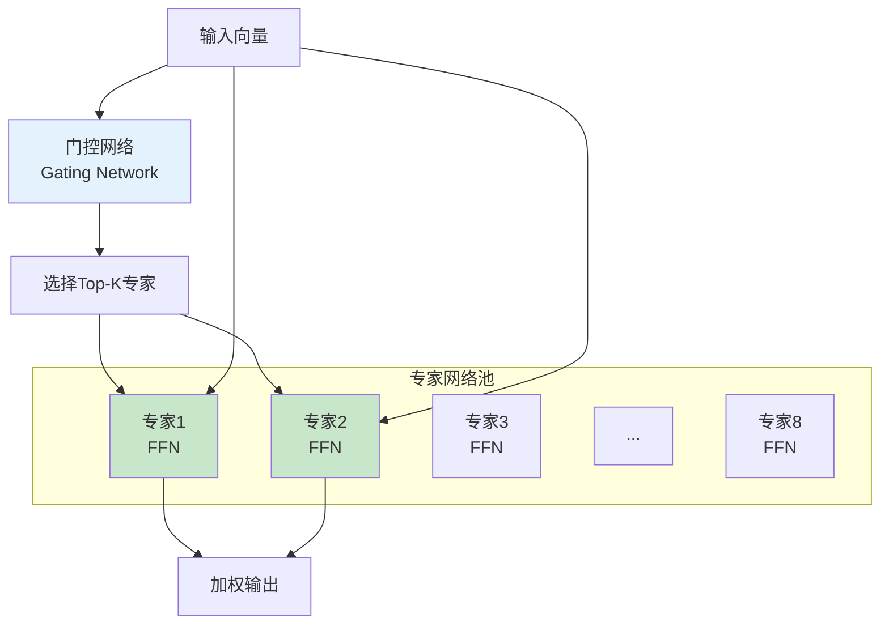
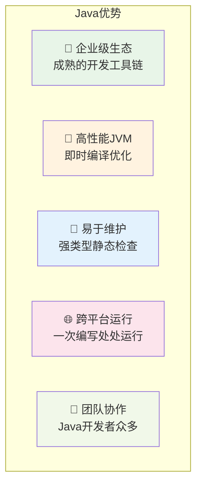
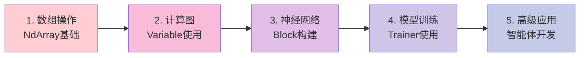
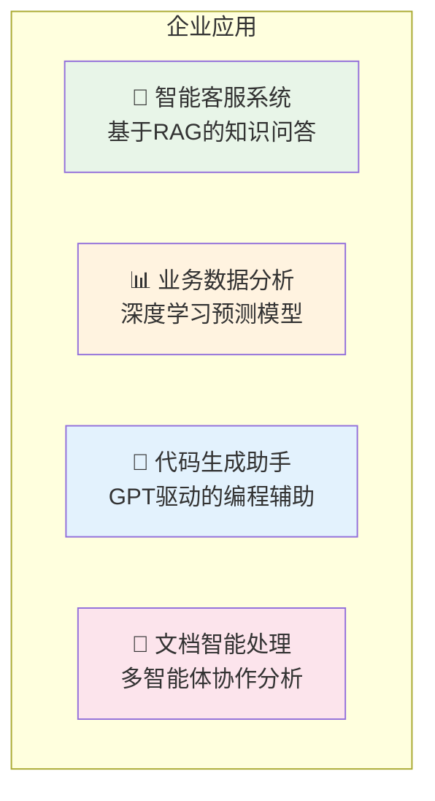
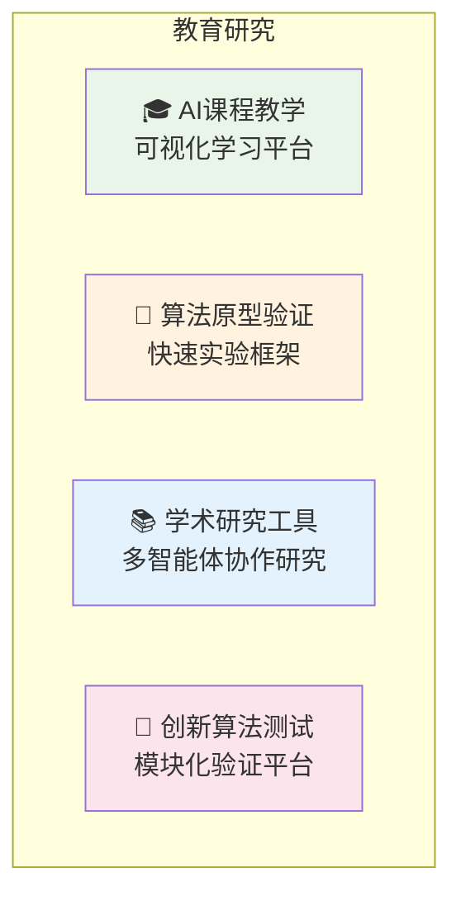
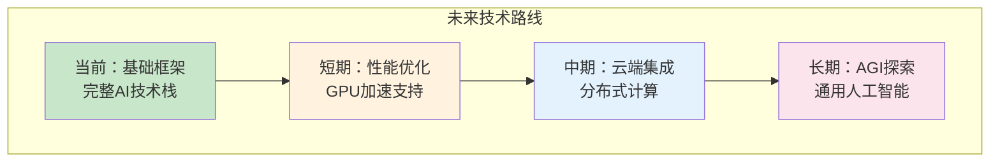

# TinyAI技术分享文档 - 第二部分

## 6. 大语言模型：让机器理解人类

### 6.1 从GPT-1到GPT-3的演进

TinyAI实现了完整的GPT系列，展示了语言模型的发展历程：



#### GPT-2模型架构深度解析

```java
// 创建GPT-2模型
GPT2Config config = GPT2Config.createMediumConfig();
GPT2Model model = new GPT2Model("gpt2-medium", config);

// 文本生成
List<Integer> prompt = tokenizer.encode("人工智能的未来是");
List<Integer> generated = model.generateText(prompt, 100);
String text = tokenizer.decode(generated);
```

**GPT-2核心组件**：



### 6.2 DeepSeek：中文大模型的代表

```java
// DeepSeek R1推理模型
DeepSeekR1Model r1Model = new DeepSeekR1Model(config);
String reasoning = r1Model.reasoningInference(question);

// DeepSeek V3混合专家模型
DeepSeekV3Model v3Model = new DeepSeekV3Model(config);
String response = v3Model.chatCompletion(messages);
```

### 6.3 Qwen3：现代化Transformer

Qwen3模型集成了最新的Transformer技术：

- 🔄 **GQA（分组查询注意力）**：减少内存使用
- 📐 **RoPE（旋转位置编码）**：更好的位置理解
- ⚡ **SwiGLU激活**：更高效的激活函数

```java
// 创建Qwen3模型
Qwen3Config config = Qwen3Config.createConfig(
    32000,   // 词汇表大小
    4096,    // 隐藏维度
    32,      // 注意力头数
    32       // 层数
);
Qwen3Model model = new Qwen3Model(config);
```

### 6.4 LoRA：参数高效微调

LoRA（Low-Rank Adaptation）让我们能够用很少的参数微调大模型：

```java
// 配置LoRA
LoraConfig loraConfig = LoraConfig.builder()
    .rank(16)           // 低秩维度
    .alpha(32)          // 缩放因子
    .dropout(0.1f)      // Dropout率
    .build();

// 创建LoRA线性层
LoraLinearLayer layer = new LoraLinearLayer("lora_layer", 
    1024, 1024, loraConfig, true);

// 启用LoRA微调
layer.enableLora();
```

**LoRA原理**：

```mermaid
graph LR
    subgraph "原始权重矩阵"
        A[W ∈ R^(d×k)<br/>原始权重<br/>🔒 冻结]
    end
    
    subgraph "LoRA分解"
        B[A ∈ R^(d×r)<br/>下投影矩阵]
        C[B ∈ R^(r×k)<br/>上投影矩阵]
    end
    
    D[输入 x] --> A
    D --> B
    B --> C
    A --> E[输出 = Wx + BAx]
    C --> E
    
    style A fill:#ffcdd2
    style B fill:#c8e6c9
    style C fill:#c8e6c9
```

### 6.5 MoE：混合专家模型

MoE模型通过专家网络提高模型容量，同时保持计算效率：

```java
// 创建MoE层
MoeLayer moeLayer = new MoeLayer("moe", 
    1024,     // 隐藏维度
    8,        // 专家数量
    2,        // 激活专家数
    4096      // 前馈维度
);
```

**MoE工作原理**：



---

## 7. 实战案例：从理论到实践

### 7.1 计算机视觉：MNIST手写数字识别

让我们从经典的MNIST开始，看看如何用TinyAI搭建一个完整的图像分类系统：

```java
// 1. 准备数据
DataSet dataset = MnistLoader.loadMnist("data/mnist");

// 2. 构建模型
MlpBlock classifier = new MlpBlock("mnist_classifier", 
    784,                          // 28x28图片展平
    new int[]{128, 64, 10},      // 隐藏层：128 -> 64 -> 10类
    Config.ActiveFunc.RELU        // ReLU激活
);
Model model = new Model("mnist_model", classifier);

// 3. 配置训练
Trainer trainer = new Trainer(50, monitor, evaluator, true, 4);
trainer.init(dataset, model, 
    new CrossEntropyLoss(),      // 交叉熵损失
    new AdamOptimizer(0.001f)    // Adam优化器
);

// 4. 开始训练
trainer.train(true);
```

**训练过程可视化**：

```
Epoch  1/50: 损失=2.103, 准确率=18.5%, 用时=2.3s
Epoch  5/50: 损失=0.542, 准确率=84.2%, 用时=2.1s
Epoch 10/50: 损失=0.298, 准确率=91.7%, 用时=2.0s
Epoch 25/50: 损失=0.134, 准确率=96.8%, 用时=1.9s
Epoch 50/50: 损失=0.089, 准确率=98.1%, 用时=1.8s

🎉 训练完成！最终准确率：98.1%
```

### 7.2 强化学习：CartPole平衡杆

看看AI如何学会平衡一根杆子：

```java
// 1. 创建环境
CartPoleEnvironment env = new CartPoleEnvironment();

// 2. 创建DQN智能体
DQNAgent agent = new DQNAgent("CartPole_DQN",
    4,                    // 状态维度：位置、速度、角度、角速度
    2,                    // 动作维度：左推、右推
    new int[]{128, 128},  // 神经网络隐藏层
    0.001f,               // 学习率
    1.0f,                 // 初始探索率
    0.99f,                // 折扣因子
    32,                   // 批次大小
    10000,                // 经验缓冲区大小
    100                   // 目标网络更新频率
);

// 3. 训练循环
for (int episode = 0; episode < 1000; episode++) {
    float[] state = env.reset();
    float totalReward = 0;
    
    while (!env.isDone()) {
        int action = agent.selectAction(state);     // 选择动作
        StepResult step = env.step(action);         // 执行动作
        agent.storeExperience(state, action, step.reward, step.nextState, step.done);
        
        if (agent.readyToLearn()) {
            agent.learn();  // 学习经验
        }
        
        state = step.nextState;
        totalReward += step.reward;
    }
    
    // 打印学习进度
    if (episode % 50 == 0) {
        System.out.printf("Episode %d: 总奖励=%.2f, 探索率=%.3f\n", 
                         episode, totalReward, agent.getEpsilon());
    }
}
```

### 7.3 自然语言处理：文本生成

用GPT模型生成文本：

```java
// 1. 加载GPT模型
GPT2Model model = GPT2Model.createSmallModel("gpt2-small");

// 2. 准备输入文本
String prompt = "人工智能的发展将会";
List<Integer> tokens = tokenizer.encode(prompt);

// 3. 生成文本
List<Integer> generated = model.generateText(
    tokens,     // 输入提示
    100,        // 生成长度
    0.8f,       // 温度参数
    0.9f        // top-p采样
);

// 4. 解码输出
String generatedText = tokenizer.decode(generated);
System.out.println("生成文本: " + generatedText);
```

---

## 8. 技术优势与创新点

### 8.1 纯Java实现的优势

#### 为什么选择Java？



#### 与Python AI框架的对比

| 特性 | TinyAI (Java) | PyTorch/TensorFlow (Python) |
|------|---------------|------------------------------|
| **类型安全** | ✅ 编译时检查 | ❌ 运行时错误 |
| **性能** | ✅ JVM优化 | ⚖️ 需C++扩展 |
| **部署** | ✅ 单个JAR包 | ❌ 复杂依赖 |
| **企业集成** | ✅ 原生支持 | ❌ 需要包装 |
| **学习成本** | ✅ Java开发者友好 | ❌ 需学习Python |

### 8.2 架构创新

#### 1. 分层解耦设计

```java
// 每一层都可以独立使用
NdArray array = NdArray.create(data);           // 基础层
Variable var = new Variable(array);             // 引擎层
Block block = new MlpBlock("net", 784, 10);     // 框架层
Model model = new Model("classifier", block);   // 模型层
```

#### 2. 组合模式应用

```java
// 像搭积木一样构建复杂网络
SequentialBlock network = new SequentialBlock("transformer");
network.addLayer(new MultiHeadAttention("mha", 512, 8));
network.addLayer(new LayerNorm("ln1", 512));
network.addLayer(new FeedForward("ffn", 512, 2048));
network.addLayer(new LayerNorm("ln2", 512));
```

#### 3. 并行训练优化

```java
// 内置并行训练支持
Trainer trainer = new Trainer(epochs, monitor, evaluator, 
    true,  // 启用并行
    8      // 8个线程
);
// 自动数据分片、梯度聚合、参数同步
```

### 8.3 教育友好设计

#### 中文注释与文档

```java
/**
 * 多层感知机块 - 最常用的神经网络结构
 * 
 * 这个类实现了标准的全连接神经网络，支持：
 * - 任意层数和隐藏单元数
 * - 多种激活函数（ReLU、Sigmoid、Tanh等）
 * - 自动参数初始化
 * - Dropout正则化
 */
public class MlpBlock extends Block {
    // 实现细节...
}
```

#### 渐进式学习路径



### 8.4 生产就绪特性

#### 模型序列化与部署

```java
// 保存训练好的模型
model.save("production_model.tinyai");

// 在生产环境加载
Model productionModel = Model.load("production_model.tinyai");

// 批量推理
NdArray predictions = productionModel.predict(batchData);
```

#### 监控与调试

```java
// 训练监控
TrainingMonitor monitor = new TrainingMonitor();
monitor.addMetric("accuracy", new AccuracyMetric());
monitor.addMetric("loss", new LossMetric());

// 可视化训练过程
monitor.plotTrainingCurves();  // 自动生成训练曲线图
```

---

## 9. 应用前景与发展方向

### 9.1 当前应用场景

#### 企业级应用



#### 教育研究领域



### 9.2 技术发展路线

#### 短期目标（3-6个月）

- 🚀 **性能优化**：GPU加速支持，提升计算效率
- 🧠 **模型扩展**：新增BERT、T5等经典模型
- 🔧 **工具完善**：可视化调试工具，模型分析器

#### 中期目标（6-12个月）

- 🌐 **云端集成**：支持分布式训练和推理
- 🤖 **智能体增强**：多模态智能体，视觉语言融合
- 📊 **企业功能**：模型管理平台，A/B测试框架

#### 长期愿景（1-2年）

- 🏭 **工业级应用**：大规模生产环境部署
- 🔬 **前沿研究**：AGI相关技术探索
- 🌍 **开源社区**：构建活跃的开发者生态

### 9.3 为什么选择TinyAI？

#### 对于Java开发者

```java
// 无需学习新语言，直接上手AI
public class MyAIApplication {
    public static void main(String[] args) {
        // 几行代码构建智能系统
        AdvancedAgent agent = new AdvancedAgent("助手", "专业AI助手");
        String response = agent.processMessage("帮我分析这份报告");
        System.out.println(response);
    }
}
```

#### 对于企业决策者

- 💰 **降低成本**：利用现有Java团队，无需重新招聘
- 🛡️ **技术风险**：纯Java实现，技术栈统一，维护简单
- 🚀 **快速交付**：基于成熟框架，开发周期短
- 📈 **可扩展性**：模块化设计，易于扩展和集成

#### 对于学生和研究者

- 📚 **学习友好**：清晰的中文注释，渐进式教程
- 🔍 **透明可见**：纯Java实现，算法细节一目了然
- 🧪 **实验便利**：模块化设计，方便算法对比和验证
- 🤝 **社区支持**：活跃的开发者社区，问题快速解决

---

## 10. 总结与展望

### 10.1 TinyAI的核心价值

TinyAI不仅仅是一个AI框架，更是一个理念：

> **让AI开发在Java生态中焕发新的活力**

#### 技术价值

- 🏗️ **完整技术栈**：从底层数组到高级智能体的全覆盖
- 🧩 **模块化设计**：高度解耦，灵活组合，易于扩展
- 🎯 **生产就绪**：企业级架构，支持大规模部署
- 📚 **教育友好**：清晰注释，渐进式学习路径

#### 生态价值

- 🌟 **填补空白**：Java原生AI框架的先行者
- 🤝 **降低门槛**：让Java开发者轻松进入AI领域
- 🔬 **促进创新**：为研究和教育提供强大工具
- 🌍 **推动发展**：构建Java AI开发者社区

### 10.2 未来展望

#### 技术演进方向



#### 社区建设目标

- 👥 **开发者社区**：聚集Java AI开发者，分享经验和最佳实践
- 📖 **知识体系**：建立完整的教程、文档和案例库
- 🔧 **工具生态**：开发调试工具、可视化工具、部署工具
- 🏆 **开源贡献**：鼓励社区贡献，共同完善框架功能

### 10.3 结语

TinyAI的旅程才刚刚开始。我们相信，通过纯Java的AI框架，能够：

- 🚀 **加速创新**：让更多Java开发者参与AI创新
- 🎓 **促进教育**：为AI教育提供更好的工具和平台
- 🏢 **推动应用**：在企业级应用中发挥Java的优势
- 🌟 **创造价值**：为Java生态带来新的可能性

让我们一起，用Java的力量，探索AI的无限可能！

---

## 📞 联系我们

- 📧 **技术交流**：[tinyai@example.com](mailto:tinyai@example.com)
- 🐙 **GitHub项目**：[https://github.com/leavesfly/TinyAI](https://github.com/leavesfly/TinyAI)
- 💬 **技术讨论**：加入TinyAI开发者群组
- 📝 **问题反馈**：GitHub Issues

---

**感谢您关注TinyAI！期待与您一起构建Java AI生态的美好未来！** 🎉

> *"让每个Java开发者都能轻松玩转AI"* - TinyAI团队