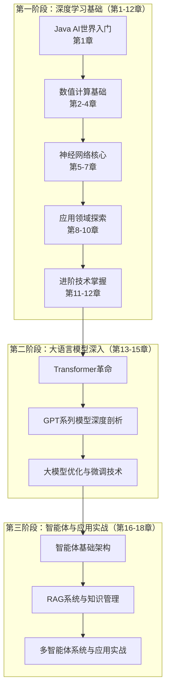
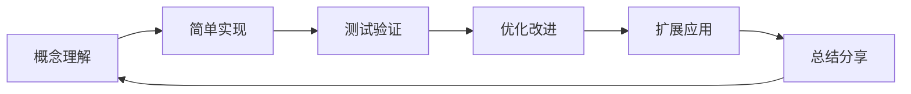
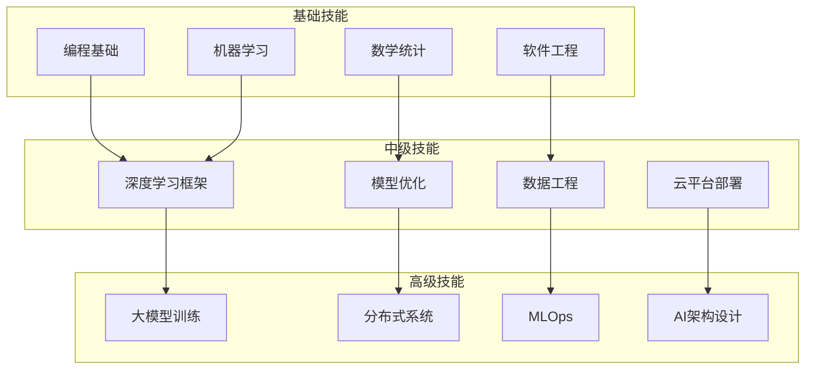

# 1.5 本书学习路径与实践建议

## 引言：开启AI学习之旅

通过前面四个小节的学习，我们已经了解了Java在AI领域的优势、TinyAI项目的整体架构、开发环境的搭建，并成功运行了第一个AI程序。现在，你可能对接下来的学习之路既兴奋又迷茫：

- **兴奋**：因为你已经亲手实现了一个神经网络，感受到了AI的魅力
- **迷茫**：因为深度学习涉及的知识面很广，不知道该如何系统性地学习

这一节将为你提供一个**清晰的学习路径**和**实用的学习建议**，帮你在AI的学习道路上走得更稳、更快、更远。

## 整体学习路径规划

### 学习阶段划分

我们将整个学习过程分为三个递进的阶段：



### 每个阶段的学习目标

#### 第一阶段：深度学习基础（1-3个月）
**目标**：建立扎实的深度学习理论基础和实践能力

**核心技能**：
- 理解并实现多维数组操作
- 掌握自动微分机制
- 能够设计和训练神经网络
- 熟悉各种优化算法和正则化技术

**检验标准**：
- 能从零实现一个简单的深度学习框架
- 可以解决图像分类、文本分类等基础问题
- 理解训练过程中的各种现象和问题

#### 第二阶段：大语言模型深入（1-2个月）
**目标**：掌握现代语言模型的核心技术

**核心技能**：
- 深入理解Transformer架构
- 能够实现GPT系列模型
- 掌握模型微调和优化技术
- 了解大模型的工程化部署

**检验标准**：
- 能实现一个小型的语言模型
- 可以进行文本生成、问答等任务
- 理解大模型的训练和推理过程

#### 第三阶段：智能体与应用实战（1-2个月）
**目标**：构建具备推理和行动能力的AI系统

**核心技能**：
- 设计智能体架构
- 实现RAG系统
- 构建多智能体协作系统
- 开发实际的AI应用

**检验标准**：
- 能构建一个完整的智能体系统
- 可以开发企业级的AI应用
- 具备AI系统的工程化能力

## 详细学习计划

### 第一阶段详细规划

#### 第1-2周：数值计算基础
**学习内容**：
- 第2章：多维数组的艺术 - NdArray核心
- 第3章：自动微分引擎 - Variable系统

**实践项目**：
```java
// 项目1：实现一个简化的数值计算库
public class MiniNdArray {
    // 实现基础的数学运算
    public MiniNdArray add(MiniNdArray other) { /* 实现 */ }
    public MiniNdArray multiply(MiniNdArray other) { /* 实现 */ }
    public MiniNdArray matmul(MiniNdArray other) { /* 实现 */ }
}

// 项目2：实现自动微分
public class MiniVariable {
    // 实现前向传播和反向传播
    public void backward() { /* 实现梯度计算 */ }
}
```

**学习重点**：
- 理解多维数组的内存布局和操作原理
- 掌握计算图和反向传播算法
- 熟悉数值稳定性问题

**评估方式**：
- 能够从零实现矩阵乘法
- 理解并实现简单函数的自动微分
- 通过所有相关的单元测试

#### 第3-4周：函数与层抽象
**学习内容**：
- 第4章：函数抽象与数学运算
- 第5章：神经网络构建块 - Layer与Block

**实践项目**：
```java
// 项目3：实现常用的激活函数
public class ActivationFunctions {
    public static Variable relu(Variable input) { /* 实现 */ }
    public static Variable sigmoid(Variable input) { /* 实现 */ }
    public static Variable tanh(Variable input) { /* 实现 */ }
}

// 项目4：实现神经网络层
public class LinearLayer extends Layer {
    @Override
    public Variable forward(Variable input) { /* 实现 */ }
}
```

**学习重点**：
- 理解各种激活函数的作用和特点
- 掌握神经网络层的设计原则
- 学会组合简单层构建复杂网络

#### 第5-6周：模型训练核心
**学习内容**：
- 第6章：模型封装与管理 - Model系统
- 第7章：训练引擎 - Trainer系统

**实践项目**：
```java
// 项目5：实现一个完整的训练循环
public class SimpleTrainer {
    public void train(Model model, Dataset dataset, int epochs) {
        for (int epoch = 0; epoch < epochs; epoch++) {
            // 实现训练逻辑
        }
    }
}

// 项目6：实现多种优化器
public class Optimizers {
    public static class SGD extends Optimizer { /* 实现 */ }
    public static class Adam extends Optimizer { /* 实现 */ }
}
```

**中期项目**：实现一个完整的图像分类系统，能够在CIFAR-10数据集上达到70%以上的准确率。

#### 第7-10周：应用领域实践
**学习内容**：
- 第8章：计算机视觉基础
- 第9章：自然语言处理入门
- 第10章：强化学习基础

**实践项目**：
```java
// 项目7：卷积神经网络
public class CNN extends Sequential {
    public CNN() {
        super(
            new Conv2d("conv1", 3, 32, 3, 1, 1),
            new ReLU("relu1"),
            new MaxPool2d("pool1", 2, 2),
            // 更多层...
        );
    }
}

// 项目8：文本分类系统
public class TextClassifier {
    public int predict(String text) {
        // 实现文本预处理和分类
    }
}

// 项目9：简单的强化学习智能体
public class DQNAgent {
    public int selectAction(State state) {
        // 实现Q-learning
    }
}
```

#### 第11-12周：进阶技术
**学习内容**：
- 第11章：模型评估与诊断
- 第12章：深度学习进阶技巧

**期末项目**：选择一个感兴趣的领域，实现一个完整的深度学习应用，例如：
- 图像风格迁移系统
- 文本生成模型
- 推荐系统
- 游戏AI

### 学习方法建议

#### 1. 理论与实践并重

**4-4-2原则**：
- 40%时间用于理论学习（阅读、理解概念）
- 40%时间用于编程实践（动手实现）
- 20%时间用于总结反思（写笔记、讨论）

```java
// 学习示例：理解ReLU激活函数
// 1. 理论学习（40%）
/*
 * ReLU函数：f(x) = max(0, x)
 * 优点：计算简单、缓解梯度消失
 * 缺点：可能出现神经元死亡
 */

// 2. 编程实践（40%）
public class ReLU extends Function {
    @Override
    public Variable forward(Variable input) {
        NdArray output = input.data().copy();
        for (int i = 0; i < output.size(); i++) {
            if (output.get(i) < 0) {
                output.set(i, 0);
            }
        }
        return Variable.of(output, input.requiresGrad());
    }
    
    @Override
    public void backward(Variable grad) {
        // 实现反向传播
    }
}

// 3. 总结反思（20%）
/*
 * 实现心得：
 * - ReLU的前向传播很简单，就是截断负值
 * - 反向传播时，负值位置梯度为0，正值位置梯度为1
 * - 实际实现中需要考虑数值稳定性
 */
```

#### 2. 项目驱动学习

每学完一个概念，立即通过项目来应用：

**小项目**（1-2天）：
- 实现单个函数或层
- 验证理论理解

**中项目**（1-2周）：
- 组合多个组件
- 解决具体问题

**大项目**（1个月）：
- 端到端的应用
- 综合多个技术

#### 3. 循序渐进的学习策略



**学习循环**：
1. **概念理解**：通过阅读和思考理解新概念
2. **简单实现**：写出最基础的版本
3. **测试验证**：编写测试确保正确性
4. **优化改进**：提升性能和代码质量
5. **扩展应用**：在新场景中应用
6. **总结分享**：记录心得体会

## 实践建议与技巧

### 1. 代码组织与管理

#### 建立个人代码库
```
my-tinyai-learning/
├── experiments/           # 实验代码
│   ├── week01-ndarray/   # 第1周实验
│   ├── week02-autograd/  # 第2周实验
│   └── ...
├── projects/             # 项目代码
│   ├── mnist-classifier/ # MNIST分类器
│   ├── cnn-cifar10/     # CIFAR-10 CNN
│   └── ...
├── notes/               # 学习笔记
│   ├── concepts.md      # 概念整理
│   ├── problems.md      # 问题记录
│   └── ...
└── utils/               # 工具代码
    ├── visualization/   # 可视化工具
    ├── data/           # 数据处理工具
    └── ...
```

#### 版本控制最佳实践
```bash
# 每个实验一个分支
git checkout -b week01-ndarray-implementation

# 有意义的提交信息
git commit -m "implement basic matrix multiplication with broadcasting"

# 定期合并到主分支
git checkout main
git merge week01-ndarray-implementation
```

### 2. 调试与问题解决

#### 常见问题及解决策略

**问题1：梯度计算错误**
```java
// 调试技巧：数值梯度验证
public static boolean checkGradient(Function function, Variable input, float eps) {
    // 计算解析梯度
    Variable output = function.forward(input);
    output.backward();
    NdArray analyticalGrad = input.getGrad().copy();
    
    // 计算数值梯度
    NdArray numericalGrad = NdArray.zeros(input.shape());
    for (int i = 0; i < input.size(); i++) {
        // f(x + eps)
        input.data().add(i, eps);
        float fplus = function.forward(input).item();
        
        // f(x - eps)
        input.data().add(i, -2 * eps);
        float fminus = function.forward(input).item();
        
        // 恢复原值
        input.data().add(i, eps);
        
        // 数值梯度
        numericalGrad.set(i, (fplus - fminus) / (2 * eps));
    }
    
    // 比较差异
    return analyticalGrad.allClose(numericalGrad, 1e-5f);
}
```

**问题2：训练不收敛**
```java
// 调试清单
public class TrainingDebugger {
    
    public void diagnoseTraining(Model model, Dataset dataset) {
        // 1. 检查数据
        checkDataDistribution(dataset);
        
        // 2. 检查模型
        checkModelInitialization(model);
        
        // 3. 检查学习率
        checkLearningRate(model, dataset);
        
        // 4. 检查损失函数
        checkLossFunction(model, dataset);
    }
    
    private void checkDataDistribution(Dataset dataset) {
        // 检查数据分布、标准化等
    }
    
    private void checkModelInitialization(Model model) {
        // 检查权重初始化
        for (Variable param : model.parameters()) {
            float mean = param.data().mean();
            float std = param.data().std();
            System.out.printf("参数统计 - 均值: %.4f, 标准差: %.4f%n", mean, std);
        }
    }
}
```

### 3. 性能优化策略

#### 内存管理
```java
public class MemoryOptimization {
    
    // 对象池减少GC压力
    private static final ThreadLocal<Queue<NdArray>> ARRAY_POOL = 
        ThreadLocal.withInitial(() -> new ArrayDeque<>());
    
    public static NdArray borrowArray(Shape shape) {
        Queue<NdArray> pool = ARRAY_POOL.get();
        NdArray array = pool.poll();
        if (array == null || !array.shape().equals(shape)) {
            array = NdArray.zeros(shape);
        } else {
            array.zero();  // 清零重用
        }
        return array;
    }
    
    public static void returnArray(NdArray array) {
        ARRAY_POOL.get().offer(array);
    }
}
```

#### 计算优化
```java
public class ComputationOptimization {
    
    // 批量处理提升效率
    public static NdArray batchMatmul(List<NdArray> matrices, NdArray weights) {
        // 将多个矩阵合并为一个大矩阵
        NdArray batchMatrix = NdArray.stack(matrices, 0);
        
        // 一次性计算
        return batchMatrix.matmul(weights);
    }
    
    // 并行计算
    public static NdArray parallelCompute(NdArray input, Function<Float, Float> operation) {
        int numThreads = Runtime.getRuntime().availableProcessors();
        ForkJoinPool pool = new ForkJoinPool(numThreads);
        
        try {
            return pool.submit(() -> {
                return input.parallelStream()
                    .map(operation)
                    .collect(NdArray.collector(input.shape()));
            }).get();
        } catch (Exception e) {
            throw new RuntimeException(e);
        } finally {
            pool.shutdown();
        }
    }
}
```

### 4. 学习资源与社区

#### 推荐学习资源

**书籍**：
- 《深度学习》- Ian Goodfellow（理论基础）
- 《动手学深度学习》- 李沐（实践导向）
- 《Java并发编程实战》- Brian Goetz（性能优化）

**在线课程**：
- Stanford CS231n（计算机视觉）
- Stanford CS224n（自然语言处理）
- DeepLearning.ai 专项课程

**论文跟踪**：
- arXiv.org（最新研究）
- Google Scholar（经典论文）
- Papers With Code（论文+代码）

#### 构建学习社区

```java
// 建立学习小组
public class StudyGroup {
    
    // 代码评审
    public void codeReview(String pullRequestUrl) {
        // 互相检查代码质量
        // 讨论设计决策
        // 分享最佳实践
    }
    
    // 技术分享
    public void weeklyMeeting() {
        // 分享学习心得
        // 讨论难点问题
        // 展示项目成果
    }
    
    // 共同项目
    public void collaborativeProject() {
        // 分工合作
        // 版本控制
        // 集成测试
    }
}
```

## 职业发展建议

### AI技能树构建



### 职业路径选择

#### 1. AI研发工程师
**技能要求**：
- 深度学习算法实现
- 模型训练和优化
- 新技术快速学习

**发展方向**：
- 算法专家
- 技术架构师
- 研究科学家

#### 2. AI应用工程师
**技能要求**：
- 模型集成部署
- 系统性能优化
- 业务场景理解

**发展方向**：
- 产品技术负责人
- 解决方案架构师
- 技术创业者

#### 3. AI平台工程师
**技能要求**：
- 分布式系统设计
- 大数据处理
- 容器化部署

**发展方向**：
- 平台架构师
- 技术总监
- CTO

### 持续学习计划

```java
public class CareerDevelopment {
    
    // 技能评估矩阵
    public enum SkillLevel {
        BEGINNER(1), INTERMEDIATE(2), ADVANCED(3), EXPERT(4);
        
        private final int level;
        SkillLevel(int level) { this.level = level; }
    }
    
    // 个人技能树
    private Map<String, SkillLevel> skillTree = Map.of(
        "Java编程", SkillLevel.ADVANCED,
        "深度学习", SkillLevel.INTERMEDIATE,
        "大数据", SkillLevel.BEGINNER,
        "云计算", SkillLevel.BEGINNER
    );
    
    // 制定学习计划
    public LearningPlan createLearningPlan() {
        return LearningPlan.builder()
            .shortTerm("3个月内掌握Transformer架构")
            .mediumTerm("6个月内完成一个端到端AI项目")
            .longTerm("1年内成为AI领域专家")
            .build();
    }
}
```

## 小节总结

### 核心要点
1. **系统性学习**：按照从基础到高级的路径，循序渐进地掌握AI技术
2. **项目驱动**：通过实际项目来巩固理论知识，积累实战经验
3. **持续实践**：保持编程练习的频率，不断提升代码质量
4. **社区参与**：加入学习社区，通过分享和讨论加速成长

### 学习策略
- **理论与实践并重**：4-4-2时间分配原则
- **循序渐进**：遵循概念理解→实现→测试→优化的循环
- **问题导向**：遇到问题主动思考和解决
- **持续反思**：定期总结学习心得和改进方向

### 成功要素
- **坚持不懈**：AI学习需要长期积累，保持耐心和恒心
- **主动学习**：积极探索新技术，不满足于现状
- **实践导向**：重视动手能力，理论联系实际
- **开放心态**：乐于分享和讨论，从他人经验中学习

## 思考题

1. **学习规划题**：基于你的当前技术背景，制定一个6个月的AI学习计划，包括具体的阶段目标和项目实践。

2. **技能评估题**：使用文中的技能矩阵评估你的当前技能水平，找出需要重点提升的3个技能点。

3. **职业发展题**：结合你的职业兴趣和市场需求，选择一个AI职业发展方向，并制定相应的技能提升计划。

4. **实践项目题**：设计一个综合性的AI项目，能够展示你在本章学到的所有技术要点。

## 拓展阅读

- **学习方法论**：《如何高效学习》Barbara Oakley著
- **技术职业发展**：《程序员修炼之道》Andrew Hunt著
- **AI行业趋势**：《智能时代》吴军著
- **项目管理**：《敏捷软件开发》Robert Martin著

---

**第一章完结**：恭喜你完成了Java AI之旅的第一步！接下来我们将深入TinyAI的核心技术栈，从多维数组开始构建我们的AI框架。准备好迎接更大的挑战了吗？