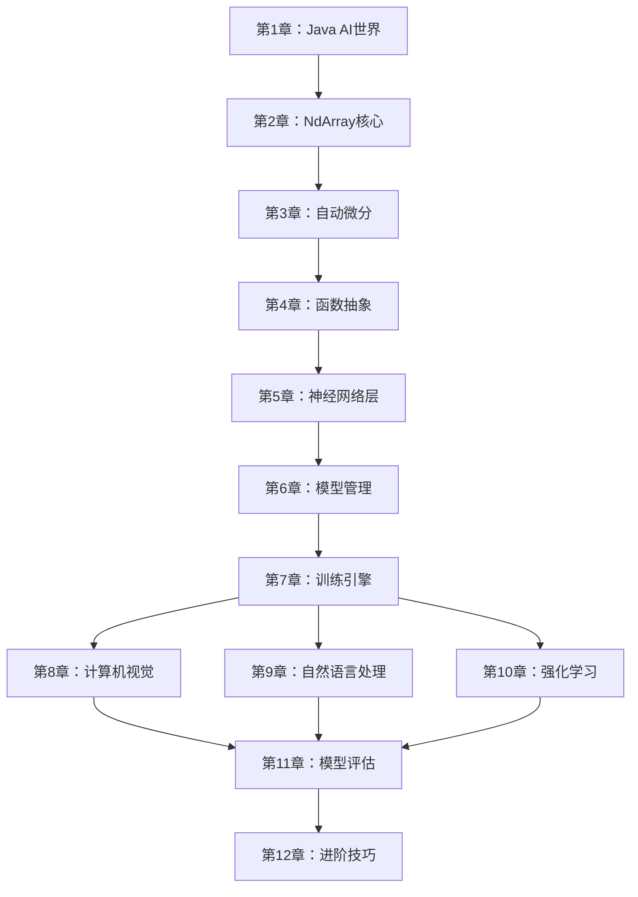
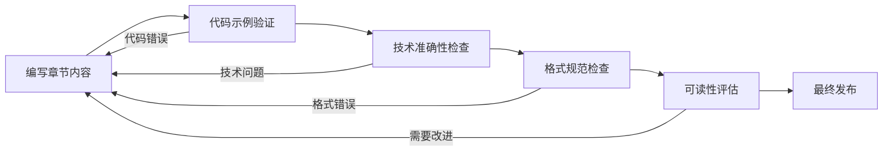

# 第一部分第7-12章详细编写计划

> TinyAI技术图书项目 - 深度学习基础篇后续章节
> 
> 编写时间：2025年10月10日 - 12月15日
> 
> 目标：完成6个章节，30个小节，约6万字技术内容

## 📚 章节总览

### 章节完成度现状
```
第一部分：深度学习基础篇（12章）
├── ✅ 第1章：走进AI的Java世界（已完成）
├── ✅ 第2章：多维数组的艺术（已完成）
├── ✅ 第3章：自动微分引擎（已完成）
├── ✅ 第4章：函数抽象与数学运算（已完成）
├── ✅ 第5章：神经网络构建块（已完成）
├── ✅ 第6章：模型封装与管理（已完成）
├── 🔲 第7章：训练引擎 - Trainer系统（待编写）
├── 🔲 第8章：计算机视觉基础（待编写）
├── 🔲 第9章：自然语言处理入门（待编写）
├── 🔲 第10章：强化学习基础（待编写）
├── 🔲 第11章：模型评估与诊断（待编写）
└── 🔲 第12章：深度学习进阶技巧（待编写）
```

### 技术依赖关系


## 📖 第7章：训练引擎 - Trainer系统

### 章节定位与目标
**设计思想**：构建高效稳定的训练流程，支持现代深度学习训练技巧

**学习目标**：
- 理解Trainer架构的设计理念和实现原理
- 掌握各类优化器的算法原理和实现细节
- 学习学习率调度和训练监控技术
- 实现高效的并行训练系统

### 详细小节规划

#### 7.1 Trainer架构：训练流程的统一管理（约2000字）
**核心内容**：
- 训练循环的标准化设计
- 训练状态的管理和恢复
- 异常处理和容错机制
- 训练结果的记录和分析

**代码实现**：
```java
public class Trainer {
    private Model model;
    private Optimizer optimizer;
    private LossFunction lossFunction;
    private TrainerConfig config;
    private TrainingState state;
    
    public TrainingResult train(Dataset dataset) {
        // 统一的训练流程实现
    }
}
```

**实践项目**：构建一个通用的训练器框架

#### 7.2 优化器家族：SGD、Adam与AdamW（约2000字）
**核心内容**：
- SGD的基础实现和动量改进
- Adam优化器的自适应学习率
- AdamW的权重衰减改进
- 不同优化器的选择策略

**代码实现**：
```java
public class SGDOptimizer extends Optimizer {
    private float momentum;
    private Map<String, NdArray> velocities;
    
    @Override
    public void update(Map<String, Parameter> parameters) {
        // SGD with momentum implementation
    }
}

public class AdamOptimizer extends Optimizer {
    private float beta1, beta2, epsilon;
    private Map<String, NdArray> m, v;
    
    @Override
    public void update(Map<String, Parameter> parameters) {
        // Adam optimization implementation
    }
}
```

**实践项目**：优化器性能对比实验

#### 7.3 学习率调度：Warmup与衰减策略（约2000字）
**核心内容**：
- 学习率调度的重要性分析
- 常见调度策略：阶梯、余弦、指数衰减
- Warmup技术的实现和应用
- 自适应学习率调整

**代码实现**：
```java
public abstract class LRScheduler {
    protected float baseLR;
    protected int currentStep;
    
    public abstract float getLearningRate();
    
    public void step() {
        currentStep++;
    }
}

public class CosineAnnealingLR extends LRScheduler {
    private int maxSteps;
    
    @Override
    public float getLearningRate() {
        return baseLR * 0.5f * (1 + (float)Math.cos(Math.PI * currentStep / maxSteps));
    }
}
```

**实践项目**：学习率调度策略比较实验

#### 7.4 训练监控：损失曲线与指标可视化（约2000字）
**核心内容**：
- 实时训练监控系统
- 多指标的并行跟踪
- 可视化图表的生成
- 早停和模型选择

**代码实现**：
```java
public class TrainingMonitor {
    private Map<String, List<Float>> metrics;
    private PlotGenerator plotGenerator;
    
    public void recordMetric(String name, float value) {
        metrics.computeIfAbsent(name, k -> new ArrayList<>()).add(value);
    }
    
    public void generatePlots() {
        // 生成训练曲线图
    }
}
```

**实践项目**：完整的训练监控和可视化系统

#### 7.5 并行训练：数据并行与模型并行（约2000字）
**核心内容**：
- 数据并行训练的实现
- 梯度同步和聚合
- 模型并行的设计考虑
- 混合并行策略

**代码实现**：
```java
public class DataParallelTrainer extends Trainer {
    private ExecutorService threadPool;
    private GradientAggregator aggregator;
    
    @Override
    public TrainingResult train(Dataset dataset) {
        // 数据并行训练实现
    }
}
```

**实践项目**：多线程并行训练系统

### 章节总结项目
**综合实战项目**：构建一个完整的MNIST手写数字识别训练系统
- 使用所有学到的训练技术
- 对比不同优化器和调度策略的效果
- 实现完整的监控和可视化

## 📖 第8章：计算机视觉基础

### 章节定位与目标
**设计思想**：将深度学习应用于图像处理，掌握CV基础技术

**学习目标**：
- 掌握图像数据的预处理和增强技术
- 理解CNN网络架构的演进历程
- 实现完整的图像分类系统
- 学习特征可视化和模型解释技术

### 详细小节规划

#### 8.1 图像数据预处理与增强（约2000字）
**核心内容**：
- 图像的数字化表示和格式转换
- 标准化和归一化技术
- 数据增强：旋转、翻转、裁剪等
- 批处理和并行预处理

**代码实现**：
```java
public class ImagePreprocessor {
    public NdArray normalize(NdArray image, float[] mean, float[] std) {
        // 图像标准化实现
    }
    
    public NdArray randomCrop(NdArray image, int height, int width) {
        // 随机裁剪实现
    }
    
    public NdArray randomFlip(NdArray image, float probability) {
        // 随机翻转实现
    }
}
```

#### 8.2 卷积神经网络：从LeNet到ResNet（约2500字）
**核心内容**：
- LeNet-5的经典架构分析
- AlexNet的深度网络突破
- VGG的简洁设计理念
- ResNet的残差连接创新

**代码实现**：
```java
public class LeNet5 extends Model {
    private ConvLayer conv1, conv2;
    private LinearLayer fc1, fc2, fc3;
    
    @Override
    public Variable forward(Variable input) {
        // LeNet-5网络前向传播
    }
}

public class ResidualBlock extends Block {
    private ConvLayer conv1, conv2;
    private BatchNormLayer bn1, bn2;
    
    @Override
    public Variable forward(Variable input) {
        Variable residual = input;
        Variable out = relu.forward(bn1.forward(conv1.forward(input)));
        out = bn2.forward(conv2.forward(out));
        return relu.forward(out.add(residual));
    }
}
```

#### 8.3 图像分类实战：CIFAR-10挑战（约2000字）
**核心内容**：
- CIFAR-10数据集介绍和分析
- 完整的分类流程实现
- 模型性能优化技巧
- 结果分析和可视化

**实践项目**：完整的CIFAR-10分类系统

#### 8.4 特征可视化：理解CNN学到了什么（约1500字）
**核心内容**：
- 卷积核可视化
- 特征图可视化
- 类激活映射（CAM）
- 梯度可视化

#### 8.5 迁移学习：预训练模型的应用（约2000字）
**核心内容**：
- 迁移学习的基本概念
- 特征提取vs微调
- 领域适应技术
- 实际应用案例

## 📖 第9章：自然语言处理入门

### 章节定位与目标
**设计思想**：为语言模型学习奠定基础，理解文本处理的核心技术

### 详细小节规划

#### 9.1 文本预处理：分词与编码（约2000字）
**核心内容**：
- 文本清洗和标准化
- 分词算法：基于规则、统计、神经网络
- 词汇表构建和管理
- 序列填充和截断

**代码实现**：
```java
public class Tokenizer {
    private Map<String, Integer> vocab;
    private Map<Integer, String> reverseVocab;
    
    public List<Integer> encode(String text) {
        // 文本编码实现
    }
    
    public String decode(List<Integer> tokens) {
        // 文本解码实现
    }
}
```

#### 9.2 词嵌入技术：Word2Vec与GloVe（约2500字）
**核心内容**：
- 词嵌入的基本概念和意义
- Word2Vec的CBOW和Skip-gram模型
- GloVe的全局统计信息利用
- 预训练词向量的使用

#### 9.3 循环神经网络：RNN、LSTM与GRU（约2500字）
**核心内容**：
- RNN的基本结构和梯度消失问题
- LSTM的门控机制设计
- GRU的简化改进
- 双向RNN和深层RNN

#### 9.4 序列到序列模型：编码器-解码器架构（约2000字）
**核心内容**：
- Seq2Seq模型的基本架构
- 注意力机制的引入
- 解码策略：贪心、束搜索
- 实际应用：机器翻译、文本摘要

#### 9.5 文本分类实战：情感分析系统（约2000字）
**实践项目**：完整的情感分析系统

## 📖 第10章：强化学习基础

### 章节定位与目标
**设计思想**：掌握智能体决策的数学基础，为高级智能体系统做准备

### 详细小节规划

#### 10.1 马尔可夫决策过程：强化学习的数学框架（约2500字）
**核心内容**：
- MDP的基本要素：状态、动作、奖励、转移
- 贝尔曼方程和最优性原理
- 价值函数和策略的数学定义
- 探索与利用的权衡

#### 10.2 价值函数与策略梯度（约2000字）
**核心内容**：
- 状态价值函数和动作价值函数
- 蒙特卡洛方法和时序差分学习
- 策略梯度定理和REINFORCE算法
- Actor-Critic方法

#### 10.3 Q-Learning算法实现（约2000字）
**核心内容**：
- Q-Learning的基本原理
- Q表的更新规则
- ε-贪心策略的实现
- 收敛性分析和参数调优

**代码实现**：
```java
public class QLearningAgent {
    private NdArray qTable;
    private float alpha, gamma, epsilon;
    
    public int selectAction(int state) {
        if (Math.random() < epsilon) {
            return randomAction();
        } else {
            return greedyAction(state);
        }
    }
    
    public void update(int state, int action, float reward, int nextState) {
        float target = reward + gamma * maxQ(nextState);
        float current = qTable.get(state, action);
        qTable.set(current + alpha * (target - current), state, action);
    }
}
```

#### 10.4 深度Q网络（DQN）：结合深度学习与强化学习（约2500字）
**核心内容**：
- DQN的网络架构设计
- 经验回放机制
- 目标网络的稳定作用
- Double DQN和Dueling DQN

#### 10.5 多臂老虎机：探索与利用的平衡（约2000字）
**实践项目**：CartPole游戏的DQN智能体

## 📖 第11章：模型评估与诊断

### 详细小节规划

#### 11.1 评估指标设计：准确率、召回率与F1分数（约2000字）
**核心内容**：
- 分类问题的评估指标体系
- 精确率、召回率的权衡
- F1分数和其他综合指标
- 多分类和多标签评估

#### 11.2 交叉验证与数据分割策略（约2000字）
**核心内容**：
- K折交叉验证的实现
- 分层采样和时间序列验证
- 训练集、验证集、测试集的划分
- 数据泄露的预防

#### 11.3 过拟合诊断：学习曲线分析（约2000字）
**核心内容**：
- 训练曲线和验证曲线
- 过拟合和欠拟合的识别
- 学习曲线的绘制和分析
- 模型复杂度的调优

#### 11.4 模型解释性：特征重要性与SHAP值（约2000字）
**核心内容**：
- 模型可解释性的重要性
- 特征重要性计算方法
- SHAP值的理论和实现
- 局部和全局解释

#### 11.5 A/B测试：模型上线评估（约2000字）
**核心内容**：
- A/B测试的设计原理
- 统计显著性检验
- 实验设计和样本量计算
- 结果分析和决策

## 📖 第12章：深度学习进阶技巧

### 详细小节规划

#### 12.1 正则化技术：Dropout、Weight Decay与Early Stopping（约2500字）
**核心内容**：
- L1和L2权重衰减
- Dropout的随机失活机制
- 早停策略的实现
- 数据增强作为正则化

#### 12.2 批量归一化：加速训练与提升稳定性（约2000字）
**核心内容**：
- 批归一化的数学原理
- 训练和推理模式的区别
- 层归一化和组归一化
- 归一化层的参数更新

#### 12.3 梯度裁剪：解决梯度爆炸问题（约2000字）
**核心内容**：
- 梯度爆炸的原因分析
- 梯度裁剪的实现方法
- 自适应梯度裁剪
- 梯度累积技术

#### 12.4 混合精度训练：FP16与训练加速（约2000字）
**核心内容**：
- 混合精度训练的原理
- FP16的数值范围和精度
- 损失缩放技术
- 实际性能提升分析

#### 12.5 知识蒸馏：模型压缩与部署优化（约2500字）
**核心内容**：
- 知识蒸馏的基本概念
- 教师-学生网络架构
- 软标签和温度参数
- 模型压缩和部署策略

## 🔨 实施策略和质量保证

### 编写策略

#### 1. MANNING风格坚持
- **问题驱动**：每节从实际问题出发
- **代码优先**：先展示可运行代码，再深入原理
- **渐进式复杂度**：从简单到复杂的平滑过渡
- **丰富图表**：使用Mermaid图表展示架构和流程

#### 2. 代码质量标准
```java
/**
 * 代码示例规范
 * 1. 完整的类结构和方法实现
 * 2. 详细的中文注释说明
 * 3. 单元测试验证
 * 4. 性能基准测试
 */
public class ExampleClass {
    // 实现示例
}
```

#### 3. 实践项目设计
每章至少包含1个完整的实践项目：
- 第7章：通用训练框架 + MNIST实验
- 第8章：CIFAR-10图像分类系统
- 第9章：情感分析系统
- 第10章：CartPole强化学习智能体
- 第11章：模型评估工具包
- 第12章：模型优化技术集成

### 质量验证流程

#### 1. 内容验证


#### 2. 代码验证标准
- **编译通过**：所有代码能够编译成功
- **运行验证**：所有示例能够正常运行
- **结果正确**：输出结果符合预期
- **性能合理**：运行时间在可接受范围内

#### 3. 文档质量检查
- **格式统一**：使用统一的Markdown格式
- **图表清晰**：所有Mermaid图表能够正确渲染
- **链接有效**：所有内部和外部链接都有效
- **参考完整**：提供充足的参考资料

### 时间分配和里程碑

#### 时间分配（共10周）
```
第7章：2周（10/10-10/24）
第8章：2周（10/24-11/7）
第9章：2周（11/7-11/21）
第10-11章：2周（11/21-12/5）
第12章+整理：2周（12/5-12/15）
```

#### 每周工作安排
- **周一-周三**：内容编写和代码实现
- **周四-周五**：代码验证和测试
- **周六**：内容review和优化
- **周日**：准备下周内容和休息

#### 里程碑检查
- **每章完成后**：进行完整性检查
- **每2章完成后**：进行阶段性review
- **第一部分完成后**：进行整体quality check

### 风险控制

#### 技术风险
- **复杂算法实现**：提前准备多种实现方案
- **性能优化难题**：预留时间进行性能调优
- **代码兼容性**：确保在不同环境下的兼容性

#### 时间风险
- **内容工作量估算**：每个小节预留10%缓冲时间
- **代码实现时间**：复杂算法预留额外实现时间
- **验证测试时间**：预留充足的测试和调试时间

#### 质量风险
- **技术准确性**：建立技术验证checklist
- **可读性问题**：定期进行可读性评估
- **代码质量**：严格执行代码review流程

---

**执行原则**：
1. **质量第一**：绝不为了进度牺牲质量
2. **读者导向**：始终从读者角度思考内容设计
3. **实用至上**：每个概念都要有实际应用价值
4. **持续改进**：根据反馈不断优化内容