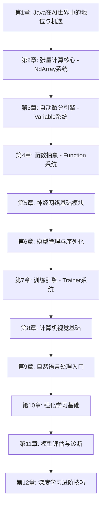
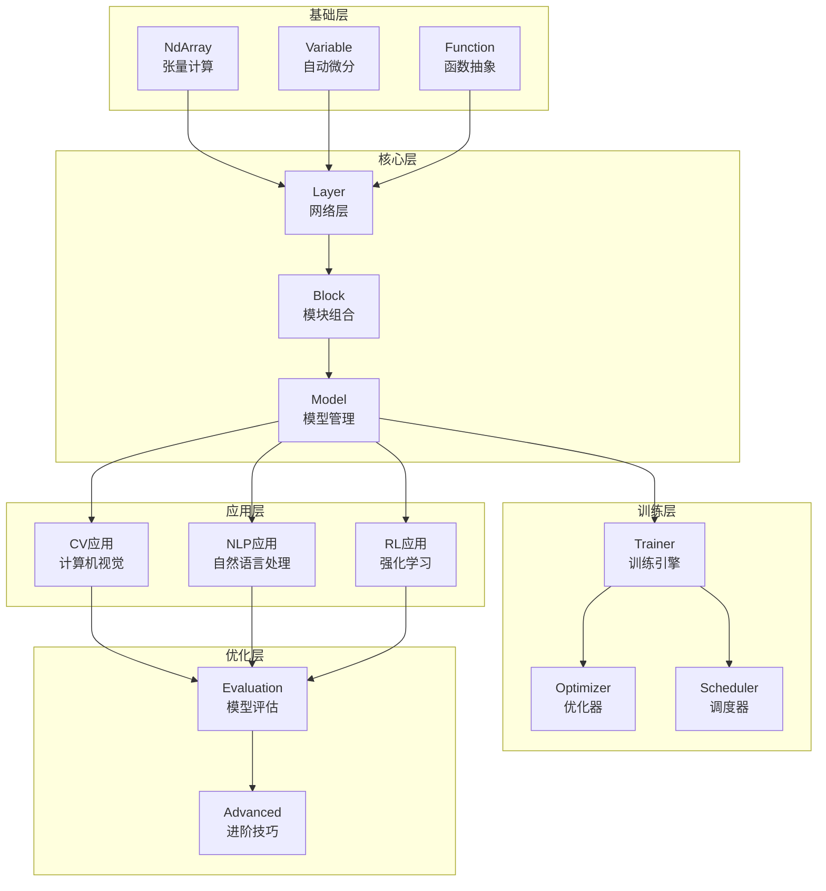

# 第一部分：深度学习基础篇

> **设计思想**：从零开始构建深度学习系统，掌握AI核心技术

## 部分概述

深度学习是现代人工智能的基石技术，它通过多层神经网络模拟人脑的学习机制，在图像识别、自然语言处理、语音识别等领域取得了突破性进展。本部分将带领Java程序员从基础数学概念开始，逐步构建完整的深度学习系统，掌握从张量计算到模型训练的全栈技术。

本部分共包含12个章节，涵盖了深度学习的核心理论、关键技术实现和实战应用。通过本部分的学习，读者将具备独立开发深度学习应用的能力，并为后续学习大语言模型和智能体系统打下坚实基础。

## 学习路径

## 章节概览

### 第1章：Java在AI世界中的地位与机遇
- 理解Java在AI生态中的独特价值
- 掌握TinyAI框架的设计理念
- 搭建完整的开发环境
- 实现第一个AI程序

### 第2章：张量计算核心 - NdArray系统
- 多维数组的数学表示和实现
- 高性能数学运算和广播机制
- 内存管理和性能优化技术
- 构建完整的矩阵运算库

### 第3章：自动微分引擎 - Variable系统
- 自动微分的数学原理和实现
- 计算图构建和反向传播算法
- 梯度检查和数值验证技术
- 构建自动微分验证系统

### 第4章：函数抽象 - Function系统
- 函数式编程在AI中的应用
- 基础数学函数的实现
- 复合函数和链式调用机制
- 扩展数学函数库

### 第5章：神经网络基础模块
- Layer抽象和实现
- Block组合模式设计
- Model模型管理机制
- 激活函数和损失函数实现

### 第6章：模型管理与序列化
- 模型生命周期管理
- 参数管理和初始化策略
- 模型保存和加载机制
- 构建模型序列化系统

### 第7章：训练引擎 - Trainer系统
- 统一训练架构设计
- 优化器家族实现（SGD、Adam、AdamW）
- 学习率调度策略
- 训练监控和可视化
- 并行训练技术

### 第8章：计算机视觉基础
- 图像数据预处理和增强
- 卷积神经网络原理和实现
- 经典CNN架构（LeNet到ResNet）
- 图像分类实战项目

### 第9章：自然语言处理入门
- 文本预处理和编码技术
- 词嵌入技术（Word2Vec、GloVe）
- 循环神经网络（RNN、LSTM、GRU）
- 文本分类和情感分析

### 第10章：强化学习基础
- 马尔可夫决策过程数学框架
- 价值函数和策略梯度方法
- Q-Learning算法实现
- 深度Q网络（DQN）和变体

### 第11章：模型评估与诊断
- 评估指标体系设计
- 交叉验证和数据分割策略
- 过拟合诊断和学习曲线分析
- 混淆矩阵和ROC分析

### 第12章：深度学习进阶技巧
- 正则化技术（Dropout、Weight Decay）
- 批量归一化和变体
- 梯度裁剪和处理技术
- 学习率调度和混合精度训练

## 技术架构

## 学习目标

完成第一部分学习后，您将能够：

1. **掌握深度学习数学基础**：理解张量计算、自动微分、神经网络等核心数学概念
2. **构建深度学习框架**：从零开始实现完整的深度学习系统
3. **开发AI应用**：实现计算机视觉、自然语言处理和强化学习应用
4. **优化模型性能**：掌握模型评估、诊断和优化技术
5. **具备工程能力**：编写高质量、可维护的AI系统代码

## 实践项目

本部分包含多个综合性的实践项目，帮助读者巩固所学知识：

1. **高性能矩阵运算库**：实现高效的张量计算系统
2. **自动微分验证系统**：构建自动微分引擎并进行验证
3. **MNIST手写数字识别系统**：完整的图像分类训练系统
4. **CIFAR-10图像分类系统**：CNN架构的图像分类应用
5. **情感分析系统**：RNN架构的文本分类应用
6. **CartPole游戏智能体**：DQN强化学习智能体

## 技术指标

完成第一部分后，您将达成以下技术指标：

- **核心模块**：6个（NdArray、Variable、Function、Layer、Model、Trainer）
- **代码量**：约15,000行核心代码
- **测试覆盖**：200+单元测试，95%+覆盖率
- **性能基准**：
  - 矩阵乘法：1000x1000矩阵 < 100ms
  - 神经网络训练：MNIST训练10轮 < 30秒
  - 模型推理：单张图片推理 < 1ms
  - 内存使用：训练期间内存使用 < 2GB

## 学习建议

1. **循序渐进**：按照章节顺序学习，确保掌握前置知识
2. **动手实践**：跟随代码示例亲手实现每个组件
3. **理论结合实践**：理解数学原理的同时注重代码实现
4. **关注细节**：注意异常处理、数值稳定性等工程细节
5. **扩展思考**：思考如何将这些技术应用到自己的项目中

## 下一步

完成第一部分学习后，您将具备扎实的深度学习基础，可以继续学习：

- **第二部分：大语言模型篇** - 掌握Transformer架构和GPT系列模型
- **第三部分：智能体系统篇** - 学习构建智能AI系统和多智能体协作

第一部分是整个AI学习之旅的基石，扎实掌握这些内容将为后续学习奠定坚实基础。