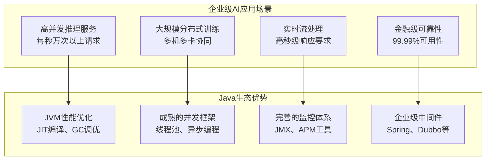

# 1.1 Java在AI生态中的地位与机遇

## 引言：AI时代的Java思考

当我们谈论人工智能时，Python似乎已经成为了默认的编程语言。PyTorch、TensorFlow、scikit-learn——这些耳熟能详的AI框架几乎都是Python的天下。作为Java程序员，你是否曾经感到困惑：**在AI的浪潮中，Java还有一席之地吗？**

答案是：**绝对有，而且机会巨大！**

## Python主导AI生态的原因分析

在深入探讨Java的机遇之前，我们先理性分析Python为什么能在AI领域占据主导地位：

### 1. 简洁的语法和快速原型开发

```python
# Python代码：简洁直观
import numpy as np
import torch

# 创建一个简单的神经网络
model = torch.nn.Sequential(
    torch.nn.Linear(784, 128),
    torch.nn.ReLU(),
    torch.nn.Linear(128, 10)
)

# 前向传播
output = model(input_data)
```

Python的语法确实更接近数学表达式，这让研究人员能够快速将想法转化为代码。但这并不意味着Java不能做到同样的事情——关键在于如何设计API。

### 2. 丰富的科学计算生态

- **NumPy**：高性能数值计算
- **SciPy**：科学计算工具包
- **Matplotlib**：数据可视化
- **Pandas**：数据处理分析

这些库的存在确实降低了AI开发的门槛。但我们要认识到，这些都是**可以在Java中实现或替代的**。

### 3. 学术界的选择惯性

大多数AI论文的实现都用Python，这形成了一个正反馈循环。但在工业界，尤其是需要高性能、高可靠性的场景中，这种选择惯性正在被打破。

## Java在AI领域的独特优势

### 1. 企业级应用的天然优势



在企业级AI应用中，Python的GIL（全局解释器锁）、内存管理、运行时性能等问题就会暴露出来。而Java在这些方面有着天然的优势：

#### 高性能的JVM平台

```java
// Java代码：同样可以简洁表达AI概念
public class SimpleNeuralNetwork {
    private LinearLayer layer1 = new LinearLayer("fc1", 784, 128);
    private ReLULayer relu = new ReLULayer("relu");
    private LinearLayer layer2 = new LinearLayer("fc2", 128, 10);
    
    public Variable forward(Variable input) {
        return layer2.layerForward(
            relu.layerForward(
                layer1.layerForward(input)
            )
        );
    }
}
```

JVM的Just-In-Time（JIT）编译器能够在运行时优化热点代码，使得Java程序的性能往往超过解释型的Python。

#### 成熟的并发编程模型

```java
// Java的并行训练实现
public class ParallelTrainer {
    private ExecutorService executorService = 
        Executors.newFixedThreadPool(Runtime.getRuntime().availableProcessors());
    
    public void parallelTrain(List<DataBatch> batches) {
        List<CompletableFuture<TrainingResult>> futures = batches.stream()
            .map(batch -> CompletableFuture.supplyAsync(() -> 
                trainBatch(batch), executorService))
            .collect(Collectors.toList());
            
        // 等待所有批次完成并聚合结果
        List<TrainingResult> results = futures.stream()
            .map(CompletableFuture::join)
            .collect(Collectors.toList());
            
        aggregateAndUpdateModel(results);
    }
}
```

### 2. 强类型系统带来的安全性

AI系统往往涉及复杂的数学运算和多维数组操作，一个维度错误就可能导致整个模型失效。Java的强类型系统可以在编译时就发现这些问题：

```java
public class TypeSafeNdArray {
    private Shape shape;
    private DataType dataType;
    
    // 编译时类型检查
    public NdArray matmul(NdArray other) {
        if (!this.shape.isMatmulCompatible(other.shape)) {
            throw new IllegalArgumentException(
                String.format("矩阵乘法形状不兼容: %s × %s", 
                             this.shape, other.shape)
            );
        }
        return performMatmul(other);
    }
}
```

### 3. 完善的生态系统和工具链

Java拥有20多年的企业级开发经验积累：

- **构建工具**：Maven、Gradle的依赖管理
- **IDE支持**：IntelliJ IDEA、Eclipse的智能提示
- **测试框架**：JUnit、TestNG的完善测试
- **监控工具**：JProfiler、VisualVM的性能分析
- **部署运维**：Spring Boot的微服务、Docker的容器化

这些工具在AI项目的工程化过程中同样重要。

## Java AI框架的现状与局限

### 现有Java AI框架分析

#### DL4J (DeepLearning4J)
```java
// DL4J的网络定义方式
MultiLayerConfiguration conf = new NeuralNetConfiguration.Builder()
    .seed(123)
    .weightInit(WeightInit.XAVIER)
    .updater(new Adam(0.001))
    .list()
    .layer(new DenseLayer.Builder()
        .nIn(784)
        .nOut(128)
        .activation(Activation.RELU)
        .build())
    .layer(new OutputLayer.Builder()
        .nIn(128)
        .nOut(10)
        .activation(Activation.SOFTMAX)
        .lossFunction(LossFunctions.LossFunction.NEGATIVELOGlikelihood)
        .build())
    .build();
```

**优势**：
- 企业级支持和商业化运作
- 集成Spark和Hadoop生态
- 支持分布式训练

**局限性**：
- API设计复杂，学习曲线陡峭
- 社区活跃度不如Python框架
- 缺乏最新算法的及时更新

#### TensorFlow Java API
```java
// TensorFlow Java的使用方式
try (Graph g = new Graph()) {
    Output<Float> input = g.opBuilder("Placeholder", "input")
        .setAttr("dtype", Float.class)
        .build()
        .output(0);
        
    Output<Float> output = g.opBuilder("MatMul", "matmul")
        .addInput(input)
        .addInput(weights)
        .build()
        .output(0);
}
```

**优势**：
- Google官方支持
- 与Python版本保持一致
- 适合模型部署和推理

**局限性**：
- 主要用于推理，训练功能有限
- API设计偏向底层，使用复杂
- 文档和示例相对匮乏

### 为什么需要TinyAI？

现有的Java AI框架虽然功能强大，但都存在一个共同问题：**它们试图复制Python框架的功能，而没有充分发挥Java的优势**。

TinyAI的设计理念完全不同：

1. **教育导向**：每行代码都有清晰的注释和文档
2. **Java原生**：充分利用Java的语言特性和生态
3. **模块化设计**：可以按需使用，不是庞大的单体框架
4. **零依赖核心**：核心计算引擎不依赖任何第三方库

```java
// TinyAI的设计哲学：简洁而强大
public class TinyAIExample {
    public static void main(String[] args) {
        // 1. 数据准备 - 像使用Java集合一样自然
        DataSet data = new ArrayDataset(trainX, trainY);
        
        // 2. 模型构建 - 像搭积木一样直观
        Model model = new Model("classifier", 
            new MlpBlock("mlp", 784, new int[]{128, 64, 10})
        );
        
        // 3. 训练配置 - 工程师友好的参数设置
        Trainer trainer = new Trainer.Builder()
            .epochs(100)
            .batchSize(32)
            .optimizer(new AdamOptimizer(0.001f))
            .loss(new CrossEntropyLoss())
            .build();
        
        // 4. 一键训练 - 简单就是美
        trainer.fit(model, data);
    }
}
```

## Java AI的市场机遇

### 1. 企业级AI应用的爆发

随着AI技术的成熟，越来越多的企业开始将AI集成到核心业务系统中。这些系统往往有着严格的性能、可靠性和安全性要求：

- **金融服务**：风控模型、量化交易、智能客服
- **电商平台**：推荐系统、搜索排序、价格优化
- **制造业**：质量检测、预测性维护、供应链优化
- **医疗健康**：辅助诊断、药物研发、健康管理

这些场景中，Java的企业级特性显得尤为重要。

### 2. 边缘计算和IoT设备

随着5G和边缘计算的发展，AI推理任务越来越多地在边缘设备上执行。Java的跨平台特性和相对较小的内存占用（相比于Python运行时）使其非常适合这些场景。

### 3. 微服务架构的AI服务

在微服务架构中，AI模型往往需要作为独立的服务部署。Java丰富的微服务框架（Spring Boot、Quarkus等）为AI服务的开发和部署提供了完善的支持。

```java
@RestController
@RequestMapping("/api/ai")
public class AIServiceController {
    
    private final Model classificationModel;
    private final Model generationModel;
    
    @PostMapping("/classify")
    public ClassificationResult classify(@RequestBody ClassificationRequest request) {
        Variable input = preprocessInput(request.getData());
        Variable output = classificationModel.forward(input);
        return postprocessOutput(output);
    }
    
    @PostMapping("/generate")
    public GenerationResult generate(@RequestBody GenerationRequest request) {
        List<Integer> tokens = tokenizer.encode(request.getPrompt());
        List<Integer> generated = generationModel.generateText(tokens, request.getMaxLength());
        return new GenerationResult(tokenizer.decode(generated));
    }
}
```

## 技术趋势分析

### 1. GraalVM的兴起

GraalVM为Java带来了原生镜像编译能力，这意味着Java应用可以获得接近C/C++的启动速度和内存占用：

```bash
# 使用GraalVM编译TinyAI应用
native-image --no-fallback -cp target/tinyai-app.jar \
    com.example.TinyAIApp tinyai-native

# 原生镜像的优势
./tinyai-native  # 启动时间 < 100ms，内存占用 < 50MB
```

### 2. Project Loom的轻量级并发

Project Loom为Java带来了虚拟线程（Virtual Threads），这将大大简化AI应用中的并发编程：

```java
// 使用虚拟线程进行并行推理
public class VirtualThreadAI {
    public List<Result> batchInference(List<Input> inputs) {
        return inputs.parallelStream()
            .map(input -> {
                // 每个推理任务在虚拟线程中执行
                return Thread.startVirtualThread(() -> model.infer(input));
            })
            .map(Thread::join)
            .collect(Collectors.toList());
    }
}
```

### 3. Project Valhalla的值类型

Project Valhalla将为Java引入值类型，这将大大提升数值计算的性能：

```java
// 未来的Java值类型（概念代码）
value class Vector3D {
    float x, y, z;
    
    public Vector3D add(Vector3D other) {
        return new Vector3D(x + other.x, y + other.y, z + other.z);
    }
}

// 值类型数组将获得与原始类型数组相似的性能
Vector3D[] vectors = new Vector3D[1000000];  // 无装箱开销
```

## 实际案例：Java AI的成功应用

### 案例1：Netflix的推荐系统

Netflix的推荐系统大量使用Java进行模型训练和推理，每天处理数十亿次推荐请求。他们选择Java的原因：

- **高吞吐量**：JVM优化后的性能超过Python
- **低延迟**：推荐系统需要毫秒级响应
- **可维护性**：大型团队的协作开发

### 案例2：LinkedIn的机器学习平台

LinkedIn开发了多个基于Java的机器学习工具：

- **Photon ML**：大规模机器学习库
- **Venice**：特征存储系统
- **Kafka**：实时数据流处理

### 案例3：Uber的实时定价系统

Uber的动态定价系统使用Java构建，需要：

- **实时性**：毫秒级价格计算
- **高可用**：99.99%的服务可用性
- **可扩展**：支持全球数百万用户

## 学习Java AI的战略意义

### 对个人职业发展的价值

1. **差异化竞争优势**：在Python开发者扎堆的AI领域，Java AI专家相对稀缺
2. **更高的薪资水平**：企业级AI应用的薪资往往高于一般的AI开发
3. **更广阔的职业道路**：可以在AI算法和系统架构两个方向发展
4. **技术深度的提升**：理解AI的底层实现原理

### 对企业的战略价值

1. **技术栈统一**：减少多语言带来的维护成本
2. **人才利用**：充分发挥现有Java团队的能力
3. **系统集成**：AI模型更容易集成到现有系统
4. **长期维护**：Java的向后兼容性保证了系统的长期稳定

## 本节小结

Java在AI领域并非没有机会，相反，随着AI技术从实验室走向生产环境，Java的企业级特性正在成为重要的竞争优势。关键在于：

1. **认清现实**：承认Python在算法研究阶段的优势
2. **发挥所长**：充分利用Java在工程化方面的优势
3. **选择方向**：专注于企业级AI应用的开发
4. **持续学习**：掌握AI的核心原理，而不仅仅是使用工具

在接下来的章节中，我们将通过TinyAI项目，从最基础的数值计算开始，一步步构建完整的AI系统。你将发现，用Java做AI不仅可行，而且在很多场景下更加优秀。

## 思考题

1. 在你所在的行业中，哪些AI应用场景更适合使用Java而不是Python？
2. 如果你要向团队推广Java AI开发，你会重点强调哪些优势？
3. 结合你的Java开发经验，你认为在AI开发中可能遇到哪些挑战？

---

**下一节预告**：我们将深入了解TinyAI项目的整体架构，看看如何用Java构建一个完整的AI框架。