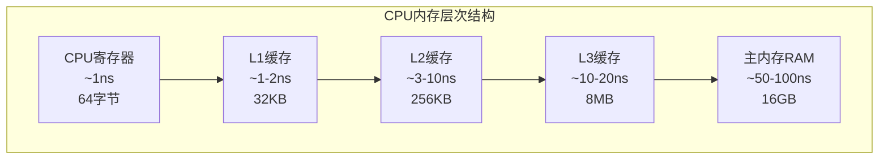

# 2.2 内存布局优化：行优先vs列优先

## 引言：看不见的性能杀手

想象一下，你在一个巨大的图书馆里寻找资料。如果书籍是随机摆放的，你可能需要跑遍整个图书馆；但如果书籍按照某种逻辑顺序排列，你就能快速找到所需的内容。

**数组的内存布局就是这样的"排列顺序"**——它决定了程序访问数据的效率，是深度学习框架性能的关键因素之一。

一个看似简单的矩阵乘法，在不同的内存布局下，性能差异可能达到10倍以上！

## 内存模型基础：CPU缓存层次结构

现代计算机的内存系统是分层的：



**关键洞察**：
- CPU从内存读取数据时，会一次性读取一个**缓存行**（通常64字节）
- 如果数据访问模式能够充分利用这64字节，性能就会显著提升
- 相反，如果频繁访问不相邻的内存位置，就会导致大量的缓存miss

## 行优先 vs 列优先存储

### 两种主要的存储方式

#### 1. 行优先存储（Row-Major，C-style）

```java
/**
 * 行优先存储示例
 * 矩阵：
 * [1, 2, 3]
 * [4, 5, 6]
 * [7, 8, 9]
 * 
 * 内存中的布局：[1, 2, 3, 4, 5, 6, 7, 8, 9]
 */
public class RowMajorLayout {
    
    private final float[] data;
    private final int rows;
    private final int cols;
    
    public RowMajorLayout(int rows, int cols) {
        this.rows = rows;
        this.cols = cols;
        this.data = new float[rows * cols];
    }
    
    /**
     * 计算一维索引：index = row * cols + col
     */
    private int getIndex(int row, int col) {
        return row * cols + col;
    }
    
    public float get(int row, int col) {
        return data[getIndex(row, col)];
    }
    
    public void set(int row, int col, float value) {
        data[getIndex(row, col)] = value;
    }
    
    /**
     * 高效的行遍历 - 连续内存访问
     */
    public float[] getRow(int row) {
        float[] result = new float[cols];
        int startIndex = row * cols;
        System.arraycopy(data, startIndex, result, 0, cols);
        return result;
    }
    
    /**
     * 低效的列遍历 - 跳跃内存访问
     */
    public float[] getColumn(int col) {
        float[] result = new float[rows];
        for (int i = 0; i < rows; i++) {
            result[i] = data[i * cols + col];  // 每次跳跃cols个位置
        }
        return result;
    }
}
```

#### 2. 列优先存储（Column-Major，Fortran-style）

```java
/**
 * 列优先存储示例
 * 矩阵：
 * [1, 2, 3]
 * [4, 5, 6]
 * [7, 8, 9]
 * 
 * 内存中的布局：[1, 4, 7, 2, 5, 8, 3, 6, 9]
 */
public class ColumnMajorLayout {
    
    private final float[] data;
    private final int rows;
    private final int cols;
    
    public ColumnMajorLayout(int rows, int cols) {
        this.rows = rows;
        this.cols = cols;
        this.data = new float[rows * cols];
    }
    
    /**
     * 计算一维索引：index = col * rows + row
     */
    private int getIndex(int row, int col) {
        return col * rows + row;
    }
    
    public float get(int row, int col) {
        return data[getIndex(row, col)];
    }
    
    public void set(int row, int col, float value) {
        data[getIndex(row, col)] = value;
    }
    
    /**
     * 高效的列遍历 - 连续内存访问
     */
    public float[] getColumn(int col) {
        float[] result = new float[rows];
        int startIndex = col * rows;
        System.arraycopy(data, startIndex, result, 0, rows);
        return result;
    }
    
    /**
     * 低效的行遍历 - 跳跃内存访问
     */
    public float[] getRow(int row) {
        float[] result = new float[cols];
        for (int i = 0; i < cols; i++) {
            result[i] = data[i * rows + row];  // 每次跳跃rows个位置
        }
        return result;
    }
}
```

## TinyAI中的步长（Stride）系统

为了同时支持行优先和列优先，以及各种切片操作，TinyAI使用步长系统：

```java
/**
 * 步长系统 - 灵活的内存布局抽象
 */
public class Stride {
    private final long[] strides;  // 每个维度的步长
    private final int[] shape;     // 数组形状
    
    public Stride(int[] shape, boolean rowMajor) {
        this.shape = shape.clone();
        this.strides = new long[shape.length];
        calculateStrides(rowMajor);
    }
    
    /**
     * 计算步长
     */
    private void calculateStrides(boolean rowMajor) {
        if (rowMajor) {
            // 行优先：从右到左计算步长
            strides[strides.length - 1] = 1;
            for (int i = strides.length - 2; i >= 0; i--) {
                strides[i] = strides[i + 1] * shape[i + 1];
            }
        } else {
            // 列优先：从左到右计算步长
            strides[0] = 1;
            for (int i = 1; i < strides.length; i++) {
                strides[i] = strides[i - 1] * shape[i - 1];
            }
        }
    }
    
    /**
     * 计算线性索引
     */
    public long computeIndex(int[] indices) {
        if (indices.length != strides.length) {
            throw new IllegalArgumentException("索引维度不匹配");
        }
        
        long index = 0;
        for (int i = 0; i < indices.length; i++) {
            if (indices[i] < 0 || indices[i] >= shape[i]) {
                throw new IndexOutOfBoundsException(
                    String.format("索引 %d 超出维度 %d 的范围 [0, %d)", 
                                indices[i], i, shape[i]));
            }
            index += indices[i] * strides[i];
        }
        return index;
    }
    
    /**
     * 检查内存是否连续
     */
    public boolean isContiguous() {
        long expectedStride = 1;
        for (int i = strides.length - 1; i >= 0; i--) {
            if (strides[i] != expectedStride) {
                return false;
            }
            expectedStride *= shape[i];
        }
        return true;
    }
}
```

## 实际性能测试

```java
/**
 * 内存布局性能基准测试
 */
public class MemoryLayoutBenchmark {
    
    public static void main(String[] args) {
        int size = 1000;
        
        // 创建两种布局的矩阵
        RowMajorLayout rowMajor = new RowMajorLayout(size, size);
        ColumnMajorLayout colMajor = new ColumnMajorLayout(size, size);
        
        // 初始化数据
        initializeMatrices(rowMajor, colMajor, size);
        
        // 测试行遍历性能
        testRowTraversal(rowMajor, colMajor, size);
        
        // 测试列遍历性能
        testColumnTraversal(rowMajor, colMajor, size);
        
        // 测试矩阵乘法性能
        testMatrixMultiplication(size);
    }
    
    private static void initializeMatrices(RowMajorLayout rowMajor, 
                                         ColumnMajorLayout colMajor, int size) {
        for (int i = 0; i < size; i++) {
            for (int j = 0; j < size; j++) {
                float value = i * size + j;
                rowMajor.set(i, j, value);
                colMajor.set(i, j, value);
            }
        }
    }
    
    private static void testRowTraversal(RowMajorLayout rowMajor, 
                                       ColumnMajorLayout colMajor, int size) {
        System.out.println("=== 行遍历性能测试 ===");
        
        // 行优先布局的行遍历（高效）
        long startTime = System.nanoTime();
        for (int i = 0; i < size; i++) {
            float[] row = rowMajor.getRow(i);
            processArray(row);  // 模拟处理
        }
        long rowMajorTime = System.nanoTime() - startTime;
        
        // 列优先布局的行遍历（低效）
        startTime = System.nanoTime();
        for (int i = 0; i < size; i++) {
            float[] row = colMajor.getRow(i);
            processArray(row);  // 模拟处理
        }
        long colMajorTime = System.nanoTime() - startTime;
        
        System.out.printf("行优先布局: %d ms%n", rowMajorTime / 1_000_000);
        System.out.printf("列优先布局: %d ms%n", colMajorTime / 1_000_000);
        System.out.printf("性能差异: %.2fx%n", (double) colMajorTime / rowMajorTime);
    }
    
    private static void testColumnTraversal(RowMajorLayout rowMajor, 
                                          ColumnMajorLayout colMajor, int size) {
        System.out.println("\n=== 列遍历性能测试 ===");
        
        // 行优先布局的列遍历（低效）
        long startTime = System.nanoTime();
        for (int j = 0; j < size; j++) {
            float[] col = rowMajor.getColumn(j);
            processArray(col);  // 模拟处理
        }
        long rowMajorTime = System.nanoTime() - startTime;
        
        // 列优先布局的列遍历（高效）
        startTime = System.nanoTime();
        for (int j = 0; j < size; j++) {
            float[] col = colMajor.getColumn(j);
            processArray(col);  // 模拟处理
        }
        long colMajorTime = System.nanoTime() - startTime;
        
        System.out.printf("行优先布局: %d ms%n", rowMajorTime / 1_000_000);
        System.out.printf("列优先布局: %d ms%n", colMajorTime / 1_000_000);
        System.out.printf("性能差异: %.2fx%n", (double) rowMajorTime / colMajorTime);
    }
    
    private static void testMatrixMultiplication(int size) {
        System.out.println("\n=== 矩阵乘法性能测试 ===");
        
        RowMajorLayout a = new RowMajorLayout(size, size);
        RowMajorLayout b = new RowMajorLayout(size, size);
        RowMajorLayout c = new RowMajorLayout(size, size);
        
        // 初始化
        for (int i = 0; i < size; i++) {
            for (int j = 0; j < size; j++) {
                a.set(i, j, (float) Math.random());
                b.set(i, j, (float) Math.random());
            }
        }
        
        // 测试标准算法
        long startTime = System.nanoTime();
        matmulStandard(a, b, c, size);
        long standardTime = System.nanoTime() - startTime;
        
        // 测试缓存优化算法
        startTime = System.nanoTime();
        matmulCacheOptimized(a, b, c, size);
        long optimizedTime = System.nanoTime() - startTime;
        
        System.out.printf("标准算法: %d ms%n", standardTime / 1_000_000);
        System.out.printf("缓存优化: %d ms%n", optimizedTime / 1_000_000);
        System.out.printf("性能提升: %.2fx%n", (double) standardTime / optimizedTime);
    }
    
    /**
     * 标准的三重循环矩阵乘法
     */
    private static void matmulStandard(RowMajorLayout a, RowMajorLayout b, 
                                      RowMajorLayout c, int size) {
        for (int i = 0; i < size; i++) {
            for (int j = 0; j < size; j++) {
                float sum = 0.0f;
                for (int k = 0; k < size; k++) {
                    sum += a.get(i, k) * b.get(k, j);
                }
                c.set(i, j, sum);
            }
        }
    }
    
    /**
     * 缓存优化的分块矩阵乘法
     */
    private static void matmulCacheOptimized(RowMajorLayout a, RowMajorLayout b, 
                                           RowMajorLayout c, int size) {
        int blockSize = 64;  // 缓存友好的块大小
        
        for (int ii = 0; ii < size; ii += blockSize) {
            for (int jj = 0; jj < size; jj += blockSize) {
                for (int kk = 0; kk < size; kk += blockSize) {
                    
                    int iMax = Math.min(ii + blockSize, size);
                    int jMax = Math.min(jj + blockSize, size);
                    int kMax = Math.min(kk + blockSize, size);
                    
                    for (int i = ii; i < iMax; i++) {
                        for (int j = jj; j < jMax; j++) {
                            float sum = (kk == 0) ? 0.0f : c.get(i, j);
                            
                            for (int k = kk; k < kMax; k++) {
                                sum += a.get(i, k) * b.get(k, j);
                            }
                            
                            c.set(i, j, sum);
                        }
                    }
                }
            }
        }
    }
    
    private static void processArray(float[] array) {
        // 模拟数组处理：简单的数学运算
        for (int i = 0; i < array.length; i++) {
            array[i] = (float) Math.sqrt(array[i] + 1.0);
        }
    }
}
```

## 智能布局选择策略

```java
/**
 * 智能布局选择器
 */
public class LayoutOptimizer {
    
    public enum AccessPattern {
        ROW_MAJOR,      // 主要按行访问
        COLUMN_MAJOR,   // 主要按列访问
        RANDOM,         // 随机访问
        SEQUENTIAL      // 顺序访问
    }
    
    /**
     * 根据访问模式推荐最优布局
     */
    public static boolean recommendRowMajor(AccessPattern pattern, int[] shape) {
        switch (pattern) {
            case ROW_MAJOR:
                return true;
            case COLUMN_MAJOR:
                return false;
            case RANDOM:
                // 随机访问时，选择缓存行利用率更高的布局
                return shape[shape.length - 1] >= 16;
            case SEQUENTIAL:
                return true;  // 顺序访问通常行优先更好
            default:
                return true;
        }
    }
    
    /**
     * 矩阵乘法布局优化策略
     */
    public static class MatMulLayoutStrategy {
        
        public record LayoutConfig(boolean aRowMajor, boolean bRowMajor, boolean cRowMajor) {}
        
        public static LayoutConfig optimize(int M, int K, int N) {
            // A: M×K, B: K×N, C: M×N
            
            boolean aRowMajor = true;   // A按行访问
            boolean bRowMajor = false;  // B按列访问（所以用列优先）
            boolean cRowMajor = true;   // C按行写入
            
            // 考虑缓存大小调整策略
            long l2CacheSize = 256 * 1024;  // 假设256KB L2缓存
            long matrixSize = (long) M * K * 4;  // float大小
            
            if (matrixSize > l2CacheSize) {
                // 大矩阵时需要特殊考虑
                aRowMajor = (K >= 16);  // 基于缓存行的启发式
                bRowMajor = (N < 16);   // 小的N时可能行优先更好
            }
            
            return new LayoutConfig(aRowMajor, bRowMajor, cRowMajor);
        }
    }
}
```

## 小节总结

### 核心要点
1. **内存布局影响性能**：合适的布局可以带来数倍的性能提升
2. **缓存友好性**：连续内存访问比跳跃访问快得多
3. **步长系统**：提供了灵活的内存布局抽象
4. **智能选择**：根据使用模式自动选择最优布局

### 实践指导
- **图像处理**：通常使用行优先存储
- **矩阵运算**：根据具体运算模式选择
- **大数据**：考虑分块算法提升缓存效率
- **并行计算**：布局选择需要配合并行策略

### 性能优化要点
- 优先考虑数据访问的局部性
- 使用分块算法处理大型数组
- 根据硬件特性调整块大小
- 在内存带宽和计算之间找到平衡

## 思考题

1. **布局选择题**：在一个图像卷积操作中，输入图像、卷积核、输出特征图分别应该使用什么内存布局？

2. **优化策略题**：如果要在ARM CPU上优化矩阵乘法，需要考虑哪些额外的因素？

3. **缓存分析题**：给定L1缓存32KB、缓存行64字节，如何确定矩阵分块的最优大小？

4. **内存管理题**：在深度学习训练中，如何平衡内存使用量和访问效率？

## 拓展阅读

- **计算机体系结构**：《计算机体系结构：量化研究方法》
- **高性能计算**：《高性能计算之并行编程技术》
- **缓存优化**：Intel优化参考手册
- **BLAS库设计**：OpenBLAS源码分析

---

**本小节完**：下一小节我们将学习广播机制的设计与实现，这是实现NumPy风格数组运算的关键技术。