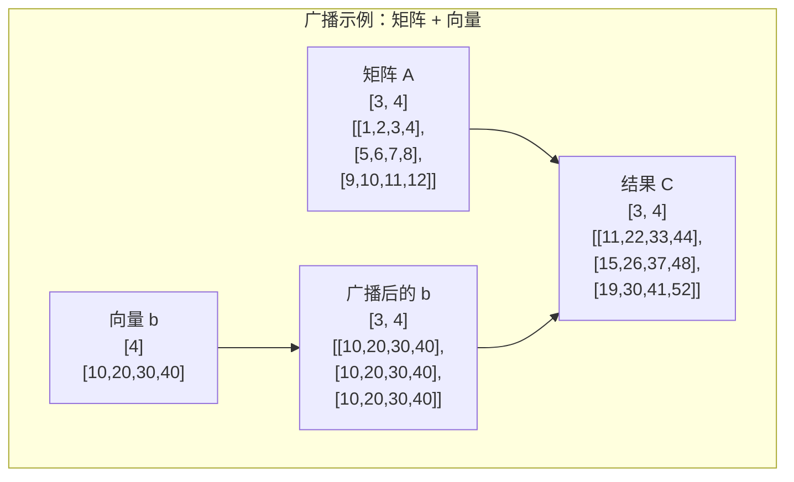

# 2.3 广播机制的设计与实现

## 引言：数组运算的魔法

想象一下，你要给班上每个学生的成绩都加10分。传统的做法是写一个循环，逐个处理每个学生的成绩。但是，如果有一种"魔法"能让你直接说"所有成绩 + 10"，计算机就自动理解并执行，那该多么优雅！

**这就是广播（Broadcasting）机制的魅力**——它让不同形状的数组可以进行数学运算，无需手动编写循环代码。

在NumPy中，你可以写出这样的代码：
```python
# Python NumPy示例
scores = np.array([[85, 90, 78], [92, 88, 95]])  # 2x3矩阵
bonus = 10                                        # 标量
final_scores = scores + bonus                     # 自动广播
```

## 广播机制的数学原理

### 广播规则

两个数组能够进行广播运算必须满足以下规则：

1. **从右往左比较维度**：从最后一个维度开始比较
2. **维度兼容性**：对于每个维度，要么大小相等，要么其中一个为1
3. **缺失维度当作1**：如果数组维度不同，缺失的维度视为大小1



### 广播规则检查器

```java
/**
 * 广播规则检查器
 */
public class BroadcastingRules {
    
    /**
     * 检查两个形状是否可以广播
     */
    public static boolean canBroadcast(int[] shape1, int[] shape2) {
        int maxDims = Math.max(shape1.length, shape2.length);
        
        for (int i = 0; i < maxDims; i++) {
            int dim1 = getDimension(shape1, i);
            int dim2 = getDimension(shape2, i);
            
            // 广播规则：维度相等或其中一个为1
            if (dim1 != dim2 && dim1 != 1 && dim2 != 1) {
                return false;
            }
        }
        
        return true;
    }
    
    /**
     * 获取指定位置的维度大小（从右往左索引）
     */
    private static int getDimension(int[] shape, int index) {
        int actualIndex = shape.length - 1 - index;
        return (actualIndex >= 0) ? shape[actualIndex] : 1;
    }
    
    /**
     * 计算广播后的结果形状
     */
    public static int[] getBroadcastShape(int[] shape1, int[] shape2) {
        if (!canBroadcast(shape1, shape2)) {
            throw new IllegalArgumentException("形状不兼容，无法广播: " + 
                Arrays.toString(shape1) + " 和 " + Arrays.toString(shape2));
        }
        
        int maxDims = Math.max(shape1.length, shape2.length);
        int[] resultShape = new int[maxDims];
        
        for (int i = 0; i < maxDims; i++) {
            int dim1 = getDimension(shape1, i);
            int dim2 = getDimension(shape2, i);
            
            // 取较大的维度
            resultShape[maxDims - 1 - i] = Math.max(dim1, dim2);
        }
        
        return resultShape;
    }
}
```

## TinyAI中的广播实现

### 核心广播引擎

```java
/**
 * 广播操作的核心实现
 */
public class BroadcastEngine {
    
    /**
     * 执行两个数组的广播运算
     */
    public static NdArray broadcastOperation(NdArray a, NdArray b, 
                                           BinaryOperation operation) {
        // 1. 检查是否可以广播
        if (!BroadcastingRules.canBroadcast(a.getShape().getDims(), 
                                           b.getShape().getDims())) {
            throw new IllegalArgumentException("数组形状不兼容，无法广播");
        }
        
        // 2. 计算结果形状
        int[] resultShape = BroadcastingRules.getBroadcastShape(
            a.getShape().getDims(), b.getShape().getDims());
        
        // 3. 创建结果数组
        NdArray result = NdArray.zeros(resultShape);
        
        // 4. 执行广播运算
        performBroadcastOperation(a, b, result, operation);
        
        return result;
    }
    
    /**
     * 执行具体的广播运算
     */
    private static void performBroadcastOperation(NdArray a, NdArray b, 
                                                 NdArray result, 
                                                 BinaryOperation operation) {
        int totalElements = result.size();
        
        // 并行计算
        IntStream.range(0, totalElements)
            .parallel()
            .forEach(linearIndex -> {
                // 将线性索引转换为多维索引
                int[] indices = linearToMultiIndex(linearIndex, result.getShape().getDims());
                
                // 获取广播后的值
                float aValue = getBroadcastValue(a, indices);
                float bValue = getBroadcastValue(b, indices);
                float resultValue = operation.apply(aValue, bValue);
                
                // 设置结果
                result.setFloat(resultValue, indices);
            });
    }
    
    /**
     * 获取广播后的值
     */
    private static float getBroadcastValue(NdArray array, int[] targetIndices) {
        int[] sourceIndices = new int[array.getDimension()];
        int offset = targetIndices.length - array.getDimension();
        
        for (int i = 0; i < array.getDimension(); i++) {
            int targetIndex = (i + offset >= 0) ? targetIndices[i + offset] : 0;
            int arrayDim = array.getShape().get(i);
            
            // 如果数组维度为1，索引始终为0（广播）
            sourceIndices[i] = (arrayDim == 1) ? 0 : targetIndex;
        }
        
        return array.getFloat(sourceIndices);
    }
    
    /**
     * 将线性索引转换为多维索引
     */
    private static int[] linearToMultiIndex(int linearIndex, int[] shape) {
        int[] indices = new int[shape.length];
        int remaining = linearIndex;
        
        for (int i = shape.length - 1; i >= 0; i--) {
            indices[i] = remaining % shape[i];
            remaining /= shape[i];
        }
        
        return indices;
    }
}
```

### 二元运算函数接口

```java
/**
 * 二元运算函数接口
 */
@FunctionalInterface
public interface BinaryOperation {
    float apply(float a, float b);
    
    // 预定义的常用运算
    BinaryOperation ADD = Float::sum;
    BinaryOperation SUBTRACT = (a, b) -> a - b;
    BinaryOperation MULTIPLY = (a, b) -> a * b;
    BinaryOperation DIVIDE = (a, b) -> a / b;
    BinaryOperation POWER = (a, b) -> (float) Math.pow(a, b);
    BinaryOperation MAX = Float::max;
    BinaryOperation MIN = Float::min;
}
```

### 优化的广播实现

```java
/**
 * 优化的广播实现
 * 针对常见模式进行特殊优化
 */
public class OptimizedBroadcasting {
    
    /**
     * 标量与数组的广播运算（最常见的情况）
     */
    public static NdArray scalarBroadcast(NdArray array, float scalar, 
                                         BinaryOperation operation) {
        NdArray result = array.copy();
        float[] data = result.getData();
        
        // 使用向量化操作
        IntStream.range(0, data.length)
            .parallel()
            .forEach(i -> data[i] = operation.apply(data[i], scalar));
        
        return result;
    }
    
    /**
     * 向量与矩阵的广播运算
     */
    public static NdArray vectorMatrixBroadcast(NdArray matrix, NdArray vector, 
                                               BinaryOperation operation, 
                                               boolean vectorIsRow) {
        if (matrix.getDimension() != 2 || vector.getDimension() != 1) {
            throw new IllegalArgumentException("矩阵必须是2维，向量必须是1维");
        }
        
        int rows = matrix.getShape().get(0);
        int cols = matrix.getShape().get(1);
        NdArray result = NdArray.zeros(rows, cols);
        
        float[] matrixData = matrix.getData();
        float[] vectorData = vector.getData();
        float[] resultData = result.getData();
        
        if (vectorIsRow) {
            // 行向量广播：每行都加上向量
            if (vector.size() != cols) {
                throw new IllegalArgumentException("行向量长度必须等于矩阵列数");
            }
            
            IntStream.range(0, rows)
                .parallel()
                .forEach(row -> {
                    for (int col = 0; col < cols; col++) {
                        int index = row * cols + col;
                        resultData[index] = operation.apply(matrixData[index], vectorData[col]);
                    }
                });
        } else {
            // 列向量广播：每列都加上向量
            if (vector.size() != rows) {
                throw new IllegalArgumentException("列向量长度必须等于矩阵行数");
            }
            
            IntStream.range(0, rows)
                .parallel()
                .forEach(row -> {
                    float vectorValue = vectorData[row];
                    for (int col = 0; col < cols; col++) {
                        int index = row * cols + col;
                        resultData[index] = operation.apply(matrixData[index], vectorValue);
                    }
                });
        }
        
        return result;
    }
}
```

## 实际应用示例

### 神经网络中的广播应用

```java
/**
 * 神经网络中广播机制的应用示例
 */
public class NeuralNetworkBroadcasting {
    
    /**
     * 线性层的前向传播：Y = XW + b
     * X: [batch_size, input_dim]
     * W: [input_dim, output_dim]  
     * b: [output_dim]
     * Y: [batch_size, output_dim]
     */
    public static NdArray linearForward(NdArray input, NdArray weight, NdArray bias) {
        // 矩阵乘法：XW
        NdArray output = input.matmul(weight);
        
        // 广播加法：+ b（bias会自动广播到每一行）
        return BroadcastEngine.broadcastOperation(output, bias, BinaryOperation.ADD);
    }
    
    /**
     * 批量归一化：(X - mean) / std
     * X: [batch_size, features]
     * mean: [features]
     * std: [features]
     */
    public static NdArray batchNormalization(NdArray input, NdArray mean, NdArray std) {
        // 减去均值（广播）
        NdArray centered = BroadcastEngine.broadcastOperation(input, mean, BinaryOperation.SUBTRACT);
        
        // 除以标准差（广播）
        return BroadcastEngine.broadcastOperation(centered, std, BinaryOperation.DIVIDE);
    }
    
    /**
     * 注意力机制中的缩放：Attention = softmax(QK^T / sqrt(d_k))
     * scores: [batch_size, num_heads, seq_len, seq_len]
     * scale: 标量 1/sqrt(d_k)
     */
    public static NdArray scaleAttentionScores(NdArray scores, float scale) {
        return OptimizedBroadcasting.scalarBroadcast(scores, scale, BinaryOperation.MULTIPLY);
    }
}
```

### 性能基准测试

```java
/**
 * 广播机制性能测试
 */
public class BroadcastingBenchmark {
    
    public static void main(String[] args) {
        testScalarBroadcast();
        testVectorMatrixBroadcast();
        testComplexBroadcast();
    }
    
    private static void testScalarBroadcast() {
        System.out.println("=== 标量广播性能测试 ===");
        
        int[] sizes = {1000, 10000, 100000, 1000000};
        
        for (int size : sizes) {
            NdArray array = NdArray.randn(size);
            float scalar = 3.14f;
            
            // 测试优化版本
            long startTime = System.nanoTime();
            NdArray result1 = OptimizedBroadcasting.scalarBroadcast(
                array, scalar, BinaryOperation.ADD);
            long optimizedTime = System.nanoTime() - startTime;
            
            // 测试通用版本
            startTime = System.nanoTime();
            NdArray scalarArray = NdArray.scalar(scalar);
            NdArray result2 = BroadcastEngine.broadcastOperation(
                array, scalarArray, BinaryOperation.ADD);
            long generalTime = System.nanoTime() - startTime;
            
            System.out.printf("大小 %d: 优化版 %d ms, 通用版 %d ms, 加速比 %.2fx%n",
                size, optimizedTime / 1_000_000, generalTime / 1_000_000,
                (double) generalTime / optimizedTime);
        }
    }
    
    private static void testVectorMatrixBroadcast() {
        System.out.println("\n=== 向量-矩阵广播性能测试 ===");
        
        int[] matrixSizes = {100, 500, 1000};
        
        for (int size : matrixSizes) {
            NdArray matrix = NdArray.randn(size, size);
            NdArray vector = NdArray.randn(size);
            
            // 测试行向量广播
            long startTime = System.nanoTime();
            NdArray result1 = OptimizedBroadcasting.vectorMatrixBroadcast(
                matrix, vector, BinaryOperation.ADD, true);
            long optimizedTime = System.nanoTime() - startTime;
            
            // 测试通用广播
            startTime = System.nanoTime();
            NdArray result2 = BroadcastEngine.broadcastOperation(
                matrix, vector, BinaryOperation.ADD);
            long generalTime = System.nanoTime() - startTime;
            
            System.out.printf("矩阵 %dx%d: 优化版 %d ms, 通用版 %d ms, 加速比 %.2fx%n",
                size, size, optimizedTime / 1_000_000, generalTime / 1_000_000,
                (double) generalTime / optimizedTime);
        }
    }
    
    private static void testComplexBroadcast() {
        System.out.println("\n=== 复杂广播性能测试 ===");
        
        // 测试高维广播
        NdArray tensor4d = NdArray.randn(2, 3, 100, 100);  // [2, 3, 100, 100]
        NdArray tensor2d = NdArray.randn(100, 100);         // [100, 100]
        
        long startTime = System.nanoTime();
        NdArray result = BroadcastEngine.broadcastOperation(
            tensor4d, tensor2d, BinaryOperation.ADD);
        long time = System.nanoTime() - startTime;
        
        System.out.printf("4D张量[2,3,100,100] + 2D矩阵[100,100]: %d ms%n", 
                         time / 1_000_000);
        
        // 验证结果正确性
        System.out.printf("结果形状: %s%n", Arrays.toString(result.getShape().getDims()));
    }
}
```

## 调试与验证

```java
/**
 * 广播兼容性调试工具
 */
public class BroadcastingDebugger {
    
    /**
     * 详细的广播兼容性检查
     */
    public static void debugBroadcastCompatibility(NdArray a, NdArray b) {
        System.out.println("=== 广播兼容性调试 ===");
        System.out.printf("数组A形状: %s%n", Arrays.toString(a.getShape().getDims()));
        System.out.printf("数组B形状: %s%n", Arrays.toString(b.getShape().getDims()));
        
        int[] shapeA = a.getShape().getDims();
        int[] shapeB = b.getShape().getDims();
        int maxDims = Math.max(shapeA.length, shapeB.length);
        
        System.out.println("\n维度对比（从右往左）:");
        System.out.println("位置\t数组A\t数组B\t兼容性");
        System.out.println("----\t----\t----\t------");
        
        boolean compatible = true;
        for (int i = 0; i < maxDims; i++) {
            int dimA = (i < shapeA.length) ? shapeA[shapeA.length - 1 - i] : 1;
            int dimB = (i < shapeB.length) ? shapeB[shapeB.length - 1 - i] : 1;
            
            boolean dimensionCompatible = (dimA == dimB || dimA == 1 || dimB == 1);
            compatible &= dimensionCompatible;
            
            System.out.printf("%d\t%d\t%d\t%s%n", i, dimA, dimB, 
                             dimensionCompatible ? "✓" : "✗");
        }
        
        System.out.printf("\n总体兼容性: %s%n", compatible ? "✓ 可以广播" : "✗ 不能广播");
        
        if (compatible) {
            int[] resultShape = BroadcastingRules.getBroadcastShape(shapeA, shapeB);
            System.out.printf("结果形状: %s%n", Arrays.toString(resultShape));
        }
    }
    
    /**
     * 广播规则示例测试
     */
    public static void demonstrateBroadcastingRules() {
        System.out.println("=== 广播规则示例 ===");
        
        // 示例1：矩阵 + 向量
        testBroadcast(new int[]{3, 4}, new int[]{4}, "矩阵[3,4] + 向量[4]");
        
        // 示例2：矩阵 + 标量
        testBroadcast(new int[]{3, 4}, new int[]{1}, "矩阵[3,4] + 标量[1]");
        
        // 示例3：三维张量 + 矩阵
        testBroadcast(new int[]{2, 3, 4}, new int[]{3, 4}, "张量[2,3,4] + 矩阵[3,4]");
        
        // 示例4：不兼容的形状
        testBroadcast(new int[]{3, 4}, new int[]{3}, "矩阵[3,4] + 向量[3] (失败)");
    }
    
    private static void testBroadcast(int[] shape1, int[] shape2, String description) {
        System.out.println("\n" + description);
        System.out.println("形状1: " + Arrays.toString(shape1));
        System.out.println("形状2: " + Arrays.toString(shape2));
        
        if (BroadcastingRules.canBroadcast(shape1, shape2)) {
            int[] resultShape = BroadcastingRules.getBroadcastShape(shape1, shape2);
            System.out.println("✓ 可以广播，结果形状: " + Arrays.toString(resultShape));
        } else {
            System.out.println("✗ 不能广播，形状不兼容");
        }
    }
}
```

## 小节总结

### 核心要点
1. **广播规则**：从右往左比较维度，维度相等或其中一个为1时兼容
2. **性能优化**：针对常见模式（标量、向量-矩阵）进行特殊优化
3. **内存效率**：广播不实际复制数据，而是虚拟扩展
4. **并行计算**：广播操作天然支持并行化

### 实践指导
- **神经网络**：广播在偏置添加、批量归一化中大量使用
- **数据处理**：广播简化了数组运算的代码编写
- **性能考虑**：选择合适的优化策略以获得最佳性能
- **调试工具**：使用调试工具验证广播兼容性

### 设计要点
- 支持NumPy风格的广播语义
- 提供高效的特殊化实现
- 良好的错误提示和调试支持
- 与其他数组操作无缝集成

## 思考题

1. **设计题**：如何实现三个或更多数组的同时广播？

2. **优化题**：在GPU环境下，广播操作的优化策略会有什么不同？

3. **内存题**：如何在保证性能的同时减少广播操作的内存开销？

4. **应用题**：设计一个自动选择最优广播策略的智能调度器。

## 拓展阅读

- **NumPy广播文档**：官方广播机制说明
- **BLAS库设计**：高性能线性代数库的实现
- **并行计算**：《并行算法设计与分析》
- **编译器优化**：向量化编译技术

---

**本小节完**：下一小节我们将学习数值稳定性与精度控制，这是实现可靠AI计算的重要保障。