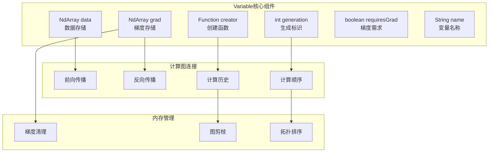
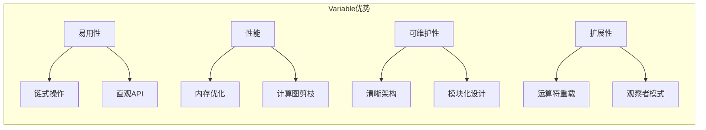

# 3.2 Variable类设计：数据与梯度的统一管理

## 引言：从张量到可微变量

在传统的数值计算中，我们处理的是**纯数据**——矩阵、向量、标量。但在深度学习中，我们需要的不仅仅是存储数据，还要**记住数据的计算历史**，以便进行梯度计算。

想象一下，你在学习骑自行车时：
- **数据**：当前的位置、速度、方向
- **梯度**：如何调整才能保持平衡
- **计算历史**：之前的操作如何影响当前状态

**Variable类就是深度学习中的"智能数据容器"**，它不仅存储数值，还记录计算历史，自动计算梯度。

## Variable类的设计哲学

### 核心设计原则

```java
/**
 * Variable类的设计哲学体现了几个核心原则：
 * 
 * 1. 数据与梯度的统一管理
 * 2. 计算历史的自动记录
 * 3. 内存使用的优化
 * 4. 链式操作的支持
 */
public class Variable {
    // 数据存储
    private final NdArray data;
    
    // 梯度存储
    private NdArray grad;
    
    // 计算历史记录
    private Function creator;
    
    // 生成标识
    private final int generation;
    
    // 是否需要梯度
    private final boolean requiresGrad;
    
    // 变量名称（调试用）
    private String name;
}
```

### 设计架构图



## Variable类的完整实现

### 核心数据结构

```java
package cn.tinyai.function;

import cn.tinyai.ndarr.NdArray;
import java.util.*;
import java.util.concurrent.atomic.AtomicInteger;

/**
 * Variable: 可微变量类
 * 
 * 这是自动微分系统的核心类，它将数据存储、梯度计算和计算历史管理
 * 统一在一个类中，为深度学习提供了强大的自动微分能力。
 * 
 * 关键特性：
 * - 数据与梯度的统一管理
 * - 自动构建计算图
 * - 支持链式操作
 * - 内存使用优化
 * 
 * @author TinyAI团队
 */
public class Variable {
    
    // 全局变量计数器，用于生成唯一ID
    private static final AtomicInteger GLOBAL_COUNTER = new AtomicInteger(0);
    
    // 核心数据
    private final NdArray data;          // 存储实际数值
    private NdArray grad;                // 存储梯度
    private Function creator;            // 创建此变量的函数
    private final int generation;        // 生成代数，用于计算图排序
    private final boolean requiresGrad;  // 是否需要计算梯度
    private final int id;                // 变量唯一标识
    private String name;                 // 变量名称（可选，调试用）
    
    /**
     * 构造函数：创建叶子变量（无创建函数）
     * 
     * @param data 数据
     * @param requiresGrad 是否需要梯度
     * @param name 变量名称
     */
    public Variable(NdArray data, boolean requiresGrad, String name) {
        this.data = Objects.requireNonNull(data, "数据不能为null");
        this.requiresGrad = requiresGrad;
        this.name = name;
        this.generation = 0;  // 叶子节点生成代数为0
        this.creator = null;  // 叶子节点无创建函数
        this.id = GLOBAL_COUNTER.incrementAndGet();
        
        // 如果需要梯度，初始化梯度为零
        if (requiresGrad) {
            this.grad = NdArray.zeros(data.shape());
        }
    }
    
    /**
     * 构造函数：创建计算生成的变量
     * 
     * @param data 数据
     * @param creator 创建函数
     */
    public Variable(NdArray data, Function creator) {
        this.data = Objects.requireNonNull(data, "数据不能为null");
        this.creator = creator;
        this.id = GLOBAL_COUNTER.incrementAndGet();
        
        // 计算生成代数：比输入变量的最大生成代数大1
        if (creator != null && creator.getInputs().length > 0) {
            this.generation = Arrays.stream(creator.getInputs())
                .mapToInt(Variable::getGeneration)
                .max()
                .orElse(0) + 1;
            
            // 如果任何输入需要梯度，则此变量也需要梯度
            this.requiresGrad = Arrays.stream(creator.getInputs())
                .anyMatch(Variable::requiresGrad);
        } else {
            this.generation = 0;
            this.requiresGrad = false;
        }
        
        // 如果需要梯度，初始化梯度为零
        if (requiresGrad) {
            this.grad = NdArray.zeros(data.shape());
        }
    }
    
    /**
     * 便利构造函数：创建需要梯度的叶子变量
     */
    public Variable(NdArray data, String name) {
        this(data, true, name);
    }
    
    /**
     * 便利构造函数：创建不需要梯度的叶子变量
     */
    public Variable(NdArray data) {
        this(data, false, null);
    }
    
    // ==================== 访问器方法 ====================
    
    public NdArray getData() { return data; }
    public NdArray getGrad() { return grad; }
    public Function getCreator() { return creator; }
    public int getGeneration() { return generation; }
    public boolean requiresGrad() { return requiresGrad; }
    public int getId() { return id; }
    public String getName() { return name; }
    
    public void setName(String name) { this.name = name; }
    
    /**
     * 设置梯度
     * 
     * @param grad 新的梯度值
     */
    public void setGrad(NdArray grad) {
        if (!requiresGrad) {
            throw new IllegalStateException("变量 " + name + " 不需要梯度");
        }
        
        if (grad != null && !Arrays.equals(grad.shape(), data.shape())) {
            throw new IllegalArgumentException(
                "梯度形状 " + Arrays.toString(grad.shape()) + 
                " 与数据形状 " + Arrays.toString(data.shape()) + " 不匹配");
        }
        
        this.grad = grad;
    }
    
    /**
     * 清零梯度
     */
    public void clearGrad() {
        if (grad != null) {
            grad.fill(0.0f);
        }
    }
    
    /**
     * 分离变量（创建不需要梯度的副本）
     * 
     * @return 分离后的变量
     */
    public Variable detach() {
        Variable detached = new Variable(data, false, name + "_detached");
        return detached;
    }
    
    // ==================== 反向传播核心 ====================
    
    /**
     * 反向传播主入口
     * 
     * 从当前变量开始，沿着计算图反向传播梯度。
     * 使用拓扑排序确保计算顺序正确。
     */
    public void backward() {
        backward(null);
    }
    
    /**
     * 反向传播，指定初始梯度
     * 
     * @param retainGraph 是否保留计算图（用于多次反向传播）
     */
    public void backward(Boolean retainGraph) {
        if (!requiresGrad) {
            throw new IllegalStateException("变量不需要梯度，无法进行反向传播");
        }
        
        // 设置初始梯度
        if (grad == null) {
            if (data.size() == 1) {
                // 标量变量，梯度初始化为1
                grad = NdArray.ones(data.shape());
            } else {
                throw new IllegalStateException("只有标量变量可以不指定初始梯度");
            }
        }
        
        // 执行反向传播
        backwardInternal(retainGraph != null ? retainGraph : false);
    }
    
    /**
     * 内部反向传播实现
     * 
     * @param retainGraph 是否保留计算图
     */
    private void backwardInternal(boolean retainGraph) {
        // 使用拓扑排序获取计算顺序
        List<Variable> topoOrder = getTopologicalOrder();
        
        // 反向遍历，计算梯度
        for (Variable var : topoOrder) {
            if (var.creator != null && var.requiresGrad) {
                // 计算输入变量的梯度
                NdArray[] inputGrads = var.creator.backward(var.grad);
                
                // 将梯度累积到输入变量
                Variable[] inputs = var.creator.getInputs();
                for (int i = 0; i < inputs.length; i++) {
                    if (inputs[i].requiresGrad && inputGrads[i] != null) {
                        if (inputs[i].grad == null) {
                            inputs[i].grad = inputGrads[i];
                        } else {
                            // 梯度累积
                            inputs[i].grad = inputs[i].grad.add(inputGrads[i]);
                        }
                    }
                }
                
                // 如果不保留图，清理计算历史以节省内存
                if (!retainGraph) {
                    var.creator = null;
                }
            }
        }
    }
    
    /**
     * 获取拓扑排序的变量列表
     * 
     * 使用深度优先搜索，按照生成代数从大到小排序，
     * 确保反向传播时计算顺序正确。
     * 
     * @return 拓扑排序的变量列表
     */
    private List<Variable> getTopologicalOrder() {
        Set<Variable> visited = new HashSet<>();
        List<Variable> result = new ArrayList<>();
        
        // 深度优先搜索
        dfsVisit(this, visited, result);
        
        // 按生成代数降序排序
        result.sort((a, b) -> Integer.compare(b.generation, a.generation));
        
        return result;
    }
    
    /**
     * 深度优先搜索访问节点
     */
    private void dfsVisit(Variable var, Set<Variable> visited, List<Variable> result) {
        if (visited.contains(var)) {
            return;
        }
        
        visited.add(var);
        
        // 访问输入节点
        if (var.creator != null) {
            for (Variable input : var.creator.getInputs()) {
                dfsVisit(input, visited, result);
            }
        }
        
        // 将当前节点添加到结果
        result.add(var);
    }
    
    // ==================== 运算操作符重载 ====================
    
    /**
     * 加法操作
     */
    public Variable add(Variable other) {
        return Add.apply(this, other);
    }
    
    public Variable add(double scalar) {
        return add(new Variable(NdArray.scalar((float)scalar)));
    }
    
    /**
     * 减法操作
     */
    public Variable sub(Variable other) {
        return Sub.apply(this, other);
    }
    
    public Variable sub(double scalar) {
        return sub(new Variable(NdArray.scalar((float)scalar)));
    }
    
    /**
     * 乘法操作
     */
    public Variable mul(Variable other) {
        return Mul.apply(this, other);
    }
    
    public Variable mul(double scalar) {
        return mul(new Variable(NdArray.scalar((float)scalar)));
    }
    
    /**
     * 除法操作
     */
    public Variable div(Variable other) {
        return Div.apply(this, other);
    }
    
    public Variable div(double scalar) {
        return div(new Variable(NdArray.scalar((float)scalar)));
    }
    
    /**
     * 幂运算
     */
    public Variable pow(double exponent) {
        return Pow.apply(this, exponent);
    }
    
    /**
     * 矩阵乘法
     */
    public Variable matmul(Variable other) {
        return MatMul.apply(this, other);
    }
    
    // ==================== 工具方法 ====================
    
    /**
     * 获取变量形状
     */
    public int[] shape() {
        return data.shape();
    }
    
    /**
     * 获取变量大小
     */
    public int size() {
        return data.size();
    }
    
    /**
     * 判断是否为标量
     */
    public boolean isScalar() {
        return data.size() == 1;
    }
    
    /**
     * 重塑变量形状
     */
    public Variable reshape(int... newShape) {
        return Reshape.apply(this, newShape);
    }
    
    /**
     * 转置变量
     */
    public Variable transpose() {
        return Transpose.apply(this);
    }
    
    /**
     * 求和操作
     */
    public Variable sum() {
        return Sum.apply(this);
    }
    
    public Variable sum(int axis, boolean keepDims) {
        return Sum.apply(this, axis, keepDims);
    }
    
    /**
     * 均值操作
     */
    public Variable mean() {
        return Mean.apply(this);
    }
    
    public Variable mean(int axis, boolean keepDims) {
        return Mean.apply(this, axis, keepDims);
    }
    
    // ==================== 调试和可视化 ====================
    
    /**
     * 打印变量信息
     */
    public void printInfo() {
        System.out.println("Variable Info:");
        System.out.println("  Name: " + (name != null ? name : "unnamed"));
        System.out.println("  ID: " + id);
        System.out.println("  Shape: " + Arrays.toString(shape()));
        System.out.println("  RequiresGrad: " + requiresGrad);
        System.out.println("  Generation: " + generation);
        System.out.println("  Creator: " + (creator != null ? creator.getClass().getSimpleName() : "None"));
        System.out.println("  Data: " + data);
        if (grad != null) {
            System.out.println("  Grad: " + grad);
        }
    }
    
    /**
     * 可视化计算图
     */
    public String visualizeGraph() {
        Set<Variable> visited = new HashSet<>();
        StringBuilder sb = new StringBuilder();
        sb.append("计算图:\n");
        
        visualizeGraphRecursive(this, visited, sb, 0);
        
        return sb.toString();
    }
    
    private void visualizeGraphRecursive(Variable var, Set<Variable> visited, 
                                       StringBuilder sb, int depth) {
        if (visited.contains(var)) {
            return;
        }
        visited.add(var);
        
        // 缩进
        for (int i = 0; i < depth; i++) {
            sb.append("  ");
        }
        
        // 变量信息
        sb.append("Variable(")
          .append("name=").append(var.name != null ? var.name : "unnamed")
          .append(", shape=").append(Arrays.toString(var.shape()))
          .append(", gen=").append(var.generation)
          .append(")\n");
        
        // 递归访问输入
        if (var.creator != null) {
            for (int i = 0; i < depth + 1; i++) {
                sb.append("  ");
            }
            sb.append("↑ ").append(var.creator.getClass().getSimpleName()).append("\n");
            
            for (Variable input : var.creator.getInputs()) {
                visualizeGraphRecursive(input, visited, sb, depth + 2);
            }
        }
    }
    
    @Override
    public String toString() {
        return String.format("Variable(name=%s, shape=%s, requiresGrad=%s)", 
                           name != null ? name : "unnamed", 
                           Arrays.toString(shape()), 
                           requiresGrad);
    }
    
    @Override
    public boolean equals(Object obj) {
        if (this == obj) return true;
        if (obj == null || getClass() != obj.getClass()) return false;
        Variable variable = (Variable) obj;
        return id == variable.id;
    }
    
    @Override
    public int hashCode() {
        return Objects.hash(id);
    }
}
```

## Variable类的使用示例

### 基础使用

```java
/**
 * Variable类基础使用示例
 */
public class VariableBasicExample {
    
    public static void main(String[] args) {
        // 创建叶子变量
        Variable x = new Variable(NdArray.of(2.0f), "x");
        Variable y = new Variable(NdArray.of(3.0f), "y");
        
        System.out.println("创建变量:");
        x.printInfo();
        y.printInfo();
        
        // 执行计算
        Variable z = x.mul(y).add(x.pow(2));  // z = x*y + x^2
        z.setName("z");
        
        System.out.println("\n计算结果:");
        z.printInfo();
        
        // 反向传播
        z.backward();
        
        System.out.println("\n梯度计算结果:");
        System.out.println("dz/dx = " + x.getGrad());  // 应该是 y + 2*x = 3 + 2*2 = 7
        System.out.println("dz/dy = " + y.getGrad());  // 应该是 x = 2
        
        // 可视化计算图
        System.out.println("\n计算图:");
        System.out.println(z.visualizeGraph());
    }
}
```

### 矩阵计算示例

```java
/**
 * Variable矩阵计算示例
 */
public class VariableMatrixExample {
    
    public static void main(String[] args) {
        // 创建矩阵变量
        float[][] dataX = {{1, 2}, {3, 4}};
        float[][] dataW = {{0.5f, -0.5f}, {0.2f, 0.8f}};
        
        Variable X = new Variable(NdArray.of(dataX), "X");
        Variable W = new Variable(NdArray.of(dataW), "W");
        
        // 矩阵乘法 + 激活函数
        Variable Z = X.matmul(W);  // Z = X @ W
        Variable A = sigmoid(Z);   // A = σ(Z)
        
        A.setName("A");
        
        System.out.println("前向传播结果:");
        A.printInfo();
        
        // 计算损失（假设目标为全1）
        Variable target = new Variable(NdArray.ones(A.shape()), "target");
        Variable loss = mse_loss(A, target);
        
        System.out.println("\n损失值:");
        loss.printInfo();
        
        // 反向传播
        loss.backward();
        
        System.out.println("\n梯度:");
        System.out.println("dL/dX:\n" + X.getGrad());
        System.out.println("dL/dW:\n" + W.getGrad());
    }
    
    // 辅助函数：Sigmoid激活
    private static Variable sigmoid(Variable x) {
        return Sigmoid.apply(x);
    }
    
    // 辅助函数：均方误差损失
    private static Variable mse_loss(Variable pred, Variable target) {
        Variable diff = pred.sub(target);
        return diff.pow(2).mean();
    }
}
```

## 内存优化策略

### 梯度累积优化

```java
/**
 * 梯度累积的内存优化实现
 */
public class GradientAccumulation {
    
    /**
     * 优化的梯度累积方法
     */
    public static void accumulateGradient(Variable var, NdArray newGrad) {
        if (!var.requiresGrad()) {
            return;
        }
        
        if (var.getGrad() == null) {
            // 首次设置梯度
            var.setGrad(newGrad);
        } else {
            // 原地累积，节省内存
            var.getGrad().addInPlace(newGrad);
        }
    }
    
    /**
     * 批量梯度清零
     */
    public static void clearGradients(Variable... variables) {
        for (Variable var : variables) {
            if (var.requiresGrad()) {
                var.clearGrad();
            }
        }
    }
}
```

### 计算图剪枝

```java
/**
 * 计算图自动剪枝，释放不必要的内存
 */
public class GraphPruning {
    
    /**
     * 剪枝计算图，移除不需要的历史记录
     */
    public static void pruneGraph(Variable root) {
        Set<Variable> visited = new HashSet<>();
        pruneRecursive(root, visited);
    }
    
    private static void pruneRecursive(Variable var, Set<Variable> visited) {
        if (visited.contains(var) || var.getCreator() == null) {
            return;
        }
        
        visited.add(var);
        
        // 递归剪枝输入节点
        for (Variable input : var.getCreator().getInputs()) {
            pruneRecursive(input, visited);
        }
        
        // 如果此变量不再需要梯度计算，清除创建历史
        if (!var.requiresGrad()) {
            var.creator = null;
        }
    }
}
```

## 设计模式分析

### 组合模式（Composite Pattern）

Variable类使用组合模式来构建计算图：

```java
/**
 * Variable作为组合模式中的组件
 */
public interface ComputationNode {
    NdArray forward();
    void backward(NdArray grad);
    List<ComputationNode> getChildren();
}

// Variable既可以是叶子节点，也可以是组合节点
public class Variable implements ComputationNode {
    // ... 实现组合模式接口
}
```

### 观察者模式（Observer Pattern）

用于监控变量状态变化：

```java
/**
 * 变量状态观察者
 */
public interface VariableObserver {
    void onDataChanged(Variable var, NdArray oldData, NdArray newData);
    void onGradChanged(Variable var, NdArray oldGrad, NdArray newGrad);
}

// Variable中添加观察者支持
private final List<VariableObserver> observers = new ArrayList<>();

public void addObserver(VariableObserver observer) {
    observers.add(observer);
}

private void notifyDataChanged(NdArray oldData, NdArray newData) {
    for (VariableObserver observer : observers) {
        observer.onDataChanged(this, oldData, newData);
    }
}
```

## 小节总结

### 核心要点回顾

1. **统一数据管理**：Variable类将数值数据、梯度信息和计算历史统一管理
2. **自动图构建**：通过creator引用自动构建计算图
3. **内存优化**：通过生成标识和图剪枝优化内存使用
4. **链式操作**：支持流畅的数学运算API

### 设计优势



### 使用建议

1. **合理命名**：为Variable设置有意义的名称，便于调试
2. **内存管理**：及时清理不需要的梯度和计算历史
3. **批量操作**：尽量使用批量操作提高效率
4. **调试工具**：利用可视化方法理解计算图结构

## 练习思考

### 基础练习

1. **实现Variable的深拷贝方法**，确保数据和梯度都被正确复制
2. **添加形状检查机制**，在运算前验证操作数形状的兼容性
3. **实现Variable的序列化功能**，支持保存和加载

### 进阶练习

1. **设计Variable池**，重用不再使用的Variable对象以优化内存
2. **实现计算图可视化**，生成DOT格式文件用于Graphviz渲染
3. **添加数值稳定性检查**，检测梯度爆炸和消失问题

### 思考题

1. 如果Variable需要支持复数运算，需要如何修改设计？
2. 如何在多线程环境下保证Variable的线程安全？
3. 对于超大模型，如何设计Variable使其支持分布式计算？

---

*下一节我们将深入探讨前向传播机制的Java实现，了解如何高效地执行数值计算。*