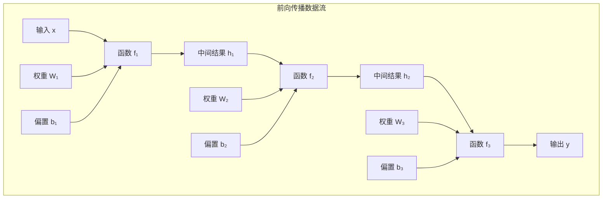
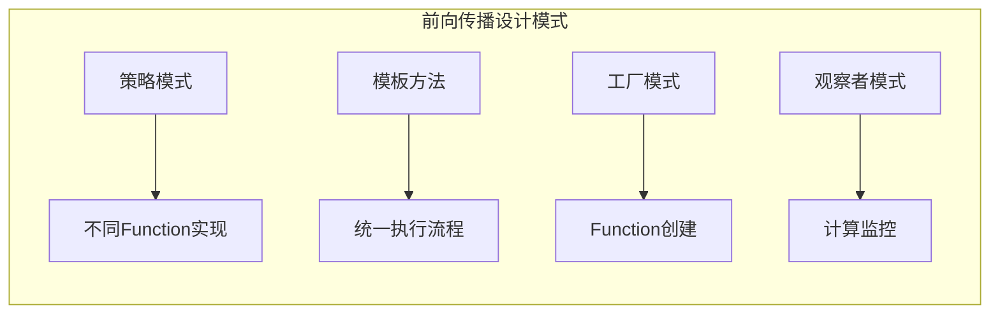

# 3.3 前向传播机制的Java实现

## 引言：数据流的艺术

想象一下水在河流中的流动：
- **水源**：输入数据从叶子变量开始
- **河道**：通过各种Function进行变换
- **汇聚**：最终流向输出结果

**前向传播就是深度学习中的"数据河流"**，它描述了数据如何从输入逐步变换到输出的过程。这个过程不仅要计算结果，还要为后续的梯度计算做好准备。

## 前向传播的数学基础

### 复合函数的计算

考虑一个三层神经网络的前向传播：

```
输入: x ∈ ℝⁿ
第一层: h₁ = σ(W₁x + b₁)
第二层: h₂ = σ(W₂h₁ + b₂)  
输出: y = W₃h₂ + b₃
```

这个过程可以表示为复合函数：`y = f₃(f₂(f₁(x)))`

### 计算图的前向遍历



## Function基类的设计

### 抽象Function类

```java
package cn.tinyai.function;

import cn.tinyai.ndarr.NdArray;

/**
 * Function: 可微函数的抽象基类
 * 
 * 这是自动微分系统的核心抽象，定义了所有可微函数的通用接口。
 */
public abstract class Function {
    
    protected Variable[] inputs;
    protected Variable[] outputs;
    protected boolean needSaveForBackward = true;
    
    /**
     * 前向传播计算 - 子类必须实现
     */
    protected abstract NdArray[] forwardImpl(NdArray... inputs);
    
    /**
     * 反向传播计算 - 子类必须实现
     */
    protected abstract NdArray[] backwardImpl(NdArray... gradOutputs);
    
    /**
     * 应用函数到输入变量（主要入口点）
     */
    public final Variable[] apply(Variable... inputs) {
        validateInputs(inputs);
        this.inputs = inputs.clone();
        
        // 提取数值数据
        NdArray[] inputData = Arrays.stream(inputs)
            .map(Variable::getData)
            .toArray(NdArray[]::new);
        
        // 执行前向传播计算
        NdArray[] outputData = forwardImpl(inputData);
        
        // 创建输出变量
        Variable[] outputVars = new Variable[outputData.length];
        for (int i = 0; i < outputData.length; i++) {
            boolean requiresGrad = Arrays.stream(inputs)
                .anyMatch(Variable::requiresGrad);
            
            if (requiresGrad) {
                outputVars[i] = new Variable(outputData[i], this);
            } else {
                outputVars[i] = new Variable(outputData[i], false, null);
            }
        }
        
        this.outputs = outputVars.clone();
        return outputVars;
    }
    
    /**
     * 单输入单输出的便利方法
     */
    public final Variable apply(Variable input) {
        Variable[] outputs = apply(new Variable[]{input});
        return outputs[0];
    }
    
    /**
     * 反向传播入口
     */
    public final NdArray[] backward(NdArray... gradOutputs) {
        if (inputs == null || inputs.length == 0) {
            return new NdArray[0];
        }
        
        NdArray[] gradInputs = backwardImpl(gradOutputs);
        validateGradients(gradInputs);
        return gradInputs;
    }
    
    public Variable[] getInputs() {
        return inputs != null ? inputs.clone() : new Variable[0];
    }
    
    protected void validateInputs(Variable... inputs) {
        if (inputs == null || inputs.length == 0) {
            throw new IllegalArgumentException("函数输入不能为空");
        }
        
        for (int i = 0; i < inputs.length; i++) {
            if (inputs[i] == null || inputs[i].getData() == null) {
                throw new IllegalArgumentException("第" + i + "个输入不能为null");
            }
        }
    }
    
    protected void validateGradients(NdArray[] gradients) {
        if (gradients == null || gradients.length != inputs.length) {
            throw new IllegalStateException("梯度数量与输入数量不匹配");
        }
    }
}
```

## 基础运算函数的实现

### 加法函数（Add）

```java
/**
 * Add: 加法函数
 * 实现: z = x + y
 * 梯度: ∂z/∂x = 1, ∂z/∂y = 1
 */
public class Add extends Function {
    
    @Override
    protected NdArray[] forwardImpl(NdArray... inputs) {
        NdArray x = inputs[0];
        NdArray y = inputs[1];
        NdArray result = x.add(y);  // 支持广播
        return new NdArray[]{result};
    }
    
    @Override
    protected NdArray[] backwardImpl(NdArray... gradOutputs) {
        NdArray gradOutput = gradOutputs[0];
        
        // 计算输入梯度
        NdArray gradX = gradOutput;
        NdArray gradY = gradOutput;
        
        // 处理广播：将梯度求和到原始形状
        gradX = sumToShape(gradX, inputs[0].shape());
        gradY = sumToShape(gradY, inputs[1].shape());
        
        return new NdArray[]{gradX, gradY};
    }
    
    /**
     * 处理广播的反向传播
     */
    private NdArray sumToShape(NdArray grad, int[] targetShape) {
        if (Arrays.equals(grad.shape(), targetShape)) {
            return grad;
        }
        
        NdArray result = grad;
        int[] gradShape = grad.shape();
        int dimDiff = gradShape.length - targetShape.length;
        
        // 对前面多余的维度求和
        for (int i = 0; i < dimDiff; i++) {
            result = result.sum(0, false);
        }
        
        // 处理大小为1的维度
        for (int i = 0; i < targetShape.length; i++) {
            if (targetShape[i] == 1 && result.shape()[i] > 1) {
                result = result.sum(i, true);
            }
        }
        
        return result;
    }
    
    public static Variable apply(Variable x, Variable y) {
        Add function = new Add();
        return function.apply(x, y)[0];
    }
}
```

### 乘法函数（Mul）

```java
/**
 * Mul: 乘法函数
 * 实现: z = x * y
 * 梯度: ∂z/∂x = y, ∂z/∂y = x
 */
public class Mul extends Function {
    
    private NdArray cachedX;
    private NdArray cachedY;
    
    @Override
    protected NdArray[] forwardImpl(NdArray... inputs) {
        NdArray x = inputs[0];
        NdArray y = inputs[1];
        
        // 缓存输入数据（反向传播需要）
        this.cachedX = x;
        this.cachedY = y;
        
        NdArray result = x.mul(y);
        return new NdArray[]{result};
    }
    
    @Override
    protected NdArray[] backwardImpl(NdArray... gradOutputs) {
        NdArray gradOutput = gradOutputs[0];
        
        // 计算输入梯度
        NdArray gradX = gradOutput.mul(cachedY);
        NdArray gradY = gradOutput.mul(cachedX);
        
        // 处理广播
        gradX = sumToShape(gradX, inputs[0].shape());
        gradY = sumToShape(gradY, inputs[1].shape());
        
        return new NdArray[]{gradX, gradY};
    }
    
    public static Variable apply(Variable x, Variable y) {
        Mul function = new Mul();
        return function.apply(x, y)[0];
    }
}
```

### 矩阵乘法函数（MatMul）

```java
/**
 * MatMul: 矩阵乘法函数
 * 实现: Z = X @ Y
 * 梯度: ∂Z/∂X = ∂Z/∂Z @ Y^T, ∂Z/∂Y = X^T @ ∂Z/∂Z
 */
public class MatMul extends Function {
    
    private NdArray cachedX;
    private NdArray cachedY;
    
    @Override
    protected NdArray[] forwardImpl(NdArray... inputs) {
        NdArray x = inputs[0];
        NdArray y = inputs[1];
        
        validateMatMulDimensions(x, y);
        
        this.cachedX = x;
        this.cachedY = y;
        
        NdArray result = x.matmul(y);
        return new NdArray[]{result};
    }
    
    @Override
    protected NdArray[] backwardImpl(NdArray... gradOutputs) {
        NdArray gradOutput = gradOutputs[0];
        
        // 计算梯度
        NdArray gradX = gradOutput.matmul(cachedY.transpose());
        NdArray gradY = cachedX.transpose().matmul(gradOutput);
        
        return new NdArray[]{gradX, gradY};
    }
    
    private void validateMatMulDimensions(NdArray x, NdArray y) {
        int[] xShape = x.shape();
        int[] yShape = y.shape();
        
        if (xShape.length < 2 || yShape.length < 2) {
            throw new IllegalArgumentException("矩阵乘法需要至少2维的输入");
        }
        
        int xCols = xShape[xShape.length - 1];
        int yRows = yShape[yShape.length - 2];
        
        if (xCols != yRows) {
            throw new IllegalArgumentException(
                "矩阵乘法维度不匹配: " + xCols + " != " + yRows);
        }
    }
    
    public static Variable apply(Variable x, Variable y) {
        MatMul function = new MatMul();
        return function.apply(x, y)[0];
    }
}
```

## 激活函数的实现

### Sigmoid激活函数

```java
/**
 * Sigmoid: Sigmoid激活函数
 * 实现: y = 1 / (1 + exp(-x))
 * 梯度: ∂y/∂x = σ(x) * (1 - σ(x))
 */
public class Sigmoid extends Function {
    
    private NdArray cachedOutput;
    
    @Override
    protected NdArray[] forwardImpl(NdArray... inputs) {
        NdArray x = inputs[0];
        
        // 数值稳定的Sigmoid计算
        NdArray result = x.copy();
        float[] data = result.getData();
        
        for (int i = 0; i < data.length; i++) {
            float val = data[i];
            if (val >= 0) {
                float exp_neg_x = (float) Math.exp(-val);
                data[i] = 1.0f / (1.0f + exp_neg_x);
            } else {
                float exp_x = (float) Math.exp(val);
                data[i] = exp_x / (1.0f + exp_x);
            }
        }
        
        this.cachedOutput = result;
        return new NdArray[]{result};
    }
    
    @Override
    protected NdArray[] backwardImpl(NdArray... gradOutputs) {
        NdArray gradOutput = gradOutputs[0];
        
        // 计算梯度: ∂σ/∂x = σ(x) * (1 - σ(x))
        NdArray ones = NdArray.ones(cachedOutput.shape());
        NdArray sigmoidGrad = cachedOutput.mul(ones.sub(cachedOutput));
        
        NdArray gradInput = gradOutput.mul(sigmoidGrad);
        return new NdArray[]{gradInput};
    }
    
    public static Variable apply(Variable x) {
        Sigmoid function = new Sigmoid();
        return function.apply(x)[0];
    }
}
```

### ReLU激活函数

```java
/**
 * ReLU: ReLU激活函数
 * 实现: y = max(0, x)
 * 梯度: ∂y/∂x = 1 if x > 0 else 0
 */
public class ReLU extends Function {
    
    private NdArray mask;
    
    @Override
    protected NdArray[] forwardImpl(NdArray... inputs) {
        NdArray x = inputs[0];
        
        NdArray result = x.copy();
        float[] data = result.getData();
        boolean[] maskData = new boolean[data.length];
        
        for (int i = 0; i < data.length; i++) {
            if (data[i] > 0) {
                maskData[i] = true;
            } else {
                maskData[i] = false;
                data[i] = 0.0f;
            }
        }
        
        this.mask = NdArray.fromBooleanMask(maskData, x.shape());
        return new NdArray[]{result};
    }
    
    @Override
    protected NdArray[] backwardImpl(NdArray... gradOutputs) {
        NdArray gradOutput = gradOutputs[0];
        NdArray gradInput = gradOutput.mul(mask);
        return new NdArray[]{gradInput};
    }
    
    public static Variable apply(Variable x) {
        ReLU function = new ReLU();
        return function.apply(x)[0];
    }
}
```

## 前向传播使用示例

### 基础计算示例

```java
public class ForwardPropagationExample {
    
    public static void main(String[] args) {
        // 创建输入变量
        Variable x = new Variable(NdArray.of(2.0f), "x");
        Variable y = new Variable(NdArray.of(3.0f), "y");
        
        // 构建计算图
        Variable z1 = x.mul(y);        // z1 = x * y = 6
        Variable z2 = x.add(y);        // z2 = x + y = 5
        Variable result = z1.add(z2);  // result = z1 + z2 = 11
        
        System.out.println("前向传播结果: " + result.getData());
        
        // 可视化计算图
        System.out.println(result.visualizeGraph());
    }
}
```

### 神经网络层示例

```java
public class NeuralLayerExample {
    
    public static void main(String[] args) {
        // 输入: 2个样本，3个特征
        float[][] inputData = {{1, 2, 3}, {4, 5, 6}};
        Variable X = new Variable(NdArray.of(inputData), "X");
        
        // 权重: 3个输入特征 -> 4个输出神经元
        float[][] weightData = {
            {0.1f, 0.2f, 0.3f, 0.4f},
            {0.5f, 0.6f, 0.7f, 0.8f},
            {0.9f, 1.0f, 1.1f, 1.2f}
        };
        Variable W = new Variable(NdArray.of(weightData), "W");
        
        // 偏置: 4个输出神经元
        float[] biasData = {0.1f, 0.2f, 0.3f, 0.4f};
        Variable b = new Variable(NdArray.of(biasData), "b");
        
        // 前向传播: Y = σ(X @ W + b)
        Variable linear = X.matmul(W).add(b);
        Variable output = Sigmoid.apply(linear);
        
        System.out.println("神经网络输出:");
        output.printInfo();
    }
}
```

## 性能优化策略

### 内存池优化

```java
/**
 * 简化的内存池管理器
 */
public class MemoryPool {
    
    private final Map<String, Queue<NdArray>> pools = new ConcurrentHashMap<>();
    
    public NdArray acquire(int[] shape) {
        String key = Arrays.toString(shape);
        Queue<NdArray> pool = pools.get(key);
        
        if (pool != null && !pool.isEmpty()) {
            NdArray array = pool.poll();
            array.fill(0.0f);
            return array;
        }
        return NdArray.zeros(shape);
    }
    
    public void release(NdArray array) {
        if (array != null) {
            String key = Arrays.toString(array.shape());
            pools.computeIfAbsent(key, k -> new ConcurrentLinkedQueue<>()).offer(array);
        }
    }
}
```

## 小节总结

### 核心要点回顾

1. **Function抽象**：统一的前向传播接口设计
2. **计算图构建**：自动记录计算历史
3. **数值稳定性**：特殊处理避免数值问题
4. **内存优化**：合理的缓存和内存管理策略

### 设计模式应用



## 练习思考

### 基础练习

1. 实现Power函数：`y = x^n`，支持任意指数
2. 实现Log函数：`y = log(x)`，注意数值稳定性
3. 实现Tanh激活函数：`y = tanh(x)`

### 进阶练习

1. 实现批量归一化的前向传播
2. 设计支持动态形状的函数系统
3. 实现GELU激活函数的数值稳定版本

---

*下一节我们将探讨反向传播算法的工程化实现，了解如何高效计算梯度。*