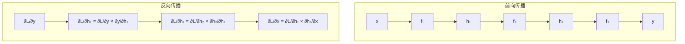
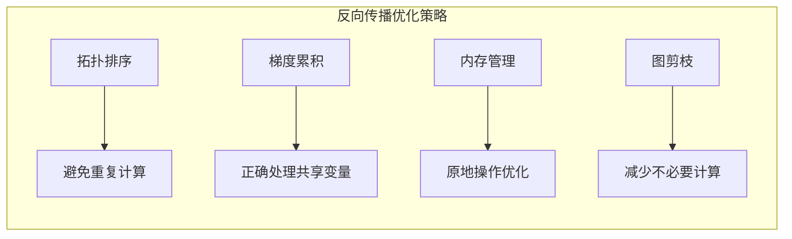

# 3.4 反向传播算法：链式法则的工程化

## 引言：梯度的逆流之旅

如果说前向传播是水流从山顶流向大海，那么**反向传播就是沿着水流轨迹逆流而上，寻找每一滴水的源头**。

在神经网络训练中：
- **前向传播**：计算损失函数的值
- **反向传播**：计算损失函数相对于每个参数的梯度
- **参数更新**：根据梯度调整参数，减少损失

**反向传播是深度学习的核心算法**，它让我们能够训练包含数百万参数的复杂神经网络。

## 链式法则的数学基础

### 单变量链式法则

对于复合函数 `y = f(g(x))`，链式法则表示为：

```
dy/dx = (dy/df) × (df/dg) × (dg/dx)
```

### 多变量链式法则

对于多变量复合函数，设 `z = f(x, y)`，其中 `x = g(t)`，`y = h(t)`：

```
dz/dt = (∂z/∂x) × (dx/dt) + (∂z/∂y) × (dy/dt)
```

### 计算图中的链式法则

在计算图中，每个节点都应用链式法则：



## 反向传播的核心实现

### Variable类的backward方法详解

```java
/**
 * Variable类中的反向传播核心实现
 */
public class Variable {
    
    /**
     * 反向传播主入口
     * 自动处理标量情况，设置初始梯度为1
     */
    public void backward() {
        if (!requiresGrad) {
            throw new IllegalStateException("变量不需要梯度，无法进行反向传播");
        }
        
        // 只有标量才能自动设置梯度为1
        if (!isScalar()) {
            throw new IllegalStateException("只有标量变量可以不指定初始梯度");
        }
        
        // 设置初始梯度
        this.grad = NdArray.ones(data.shape());
        
        // 执行反向传播
        backwardInternal();
    }
    
    /**
     * 反向传播，指定初始梯度
     */
    public void backward(NdArray grad) {
        if (!requiresGrad) {
            throw new IllegalStateException("变量不需要梯度，无法进行反向传播");
        }
        
        if (!Arrays.equals(grad.shape(), data.shape())) {
            throw new IllegalArgumentException("梯度形状与数据形状不匹配");
        }
        
        this.grad = grad;
        backwardInternal();
    }
    
    /**
     * 反向传播的内部实现
     * 使用拓扑排序确保正确的计算顺序
     */
    private void backwardInternal() {
        // 1. 获取拓扑排序的计算顺序
        List<Variable> topoOrder = getTopologicalOrder();
        
        // 2. 按照拓扑顺序反向遍历
        for (int i = topoOrder.size() - 1; i >= 0; i--) {
            Variable var = topoOrder.get(i);
            
            // 只处理有创建函数且需要梯度的变量
            if (var.creator != null && var.requiresGrad) {
                Function creator = var.creator;
                Variable[] inputs = creator.getInputs();
                
                // 计算输入变量的梯度
                NdArray[] inputGrads = creator.backward(var.grad);
                
                // 将梯度累积到输入变量
                for (int j = 0; j < inputs.length; j++) {
                    if (inputs[j].requiresGrad && inputGrads[j] != null) {
                        accumulateGradient(inputs[j], inputGrads[j]);
                    }
                }
            }
        }
    }
    
    /**
     * 梯度累积：处理同一变量多次使用的情况
     */
    private void accumulateGradient(Variable var, NdArray newGrad) {
        if (var.grad == null) {
            var.grad = newGrad;
        } else {
            // 梯度累积：多个路径的梯度需要相加
            var.grad = var.grad.add(newGrad);
        }
    }
    
    /**
     * 获取计算图的拓扑排序
     * 确保反向传播时的计算顺序正确
     */
    private List<Variable> getTopologicalOrder() {
        Set<Variable> visited = new HashSet<>();
        List<Variable> topoOrder = new ArrayList<>();
        
        // 深度优先搜索构建拓扑顺序
        topologicalSort(this, visited, topoOrder);
        
        return topoOrder;
    }
    
    private void topologicalSort(Variable var, Set<Variable> visited, List<Variable> topoOrder) {
        if (visited.contains(var)) {
            return;
        }
        
        visited.add(var);
        
        // 递归访问输入节点
        if (var.creator != null) {
            for (Variable input : var.creator.getInputs()) {
                topologicalSort(input, visited, topoOrder);
            }
        }
        
        // 将当前节点添加到拓扑序列
        topoOrder.add(var);
    }
}
```

## 复杂函数的反向传播实现

### 矩阵乘法的反向传播

```java
/**
 * 矩阵乘法的反向传播详细实现
 * 
 * 前向传播: Z = X @ Y
 * 反向传播: 
 *   ∂L/∂X = ∂L/∂Z @ Y^T
 *   ∂L/∂Y = X^T @ ∂L/∂Z
 */
public class MatMul extends Function {
    
    // 缓存前向传播的输入，反向传播时需要
    private NdArray cachedX;
    private NdArray cachedY;
    
    @Override
    protected NdArray[] forwardImpl(NdArray... inputs) {
        NdArray x = inputs[0];
        NdArray y = inputs[1];
        
        // 验证矩阵乘法的维度兼容性
        validateMatMulDimensions(x, y);
        
        // 缓存输入用于反向传播
        this.cachedX = x;
        this.cachedY = y;
        
        // 执行矩阵乘法
        NdArray result = x.matmul(y);
        
        return new NdArray[]{result};
    }
    
    @Override
    protected NdArray[] backwardImpl(NdArray... gradOutputs) {
        NdArray gradZ = gradOutputs[0];
        
        // 计算X的梯度: ∂L/∂X = ∂L/∂Z @ Y^T
        NdArray gradX = gradZ.matmul(cachedY.transpose());
        
        // 计算Y的梯度: ∂L/∂Y = X^T @ ∂L/∂Z  
        NdArray gradY = cachedX.transpose().matmul(gradZ);
        
        return new NdArray[]{gradX, gradY};
    }
    
    /**
     * 验证矩阵乘法维度
     */
    private void validateMatMulDimensions(NdArray x, NdArray y) {
        int[] xShape = x.shape();
        int[] yShape = y.shape();
        
        if (xShape.length < 2 || yShape.length < 2) {
            throw new IllegalArgumentException("矩阵乘法要求输入至少为2维");
        }
        
        // 检查内部维度是否匹配
        int xInner = xShape[xShape.length - 1];
        int yInner = yShape[yShape.length - 2];
        
        if (xInner != yInner) {
            throw new IllegalArgumentException(
                String.format("矩阵乘法内部维度不匹配: %d vs %d", xInner, yInner));
        }
    }
    
    /**
     * 矩阵乘法反向传播推导验证示例
     */
    public static void demonstrateGradientDerivation() {
        /*
         * 设 Z = X @ Y，其中：
         * X: [m, k] 矩阵
         * Y: [k, n] 矩阵  
         * Z: [m, n] 矩阵
         * 
         * Z[i,j] = Σ(k=0 to K-1) X[i,k] * Y[k,j]
         * 
         * 对X[i,k]求偏导：
         * ∂Z[u,v]/∂X[i,k] = δ(u,i) * Y[k,v]
         * 
         * 因此：
         * ∂L/∂X[i,k] = Σ(u,v) ∂L/∂Z[u,v] * ∂Z[u,v]/∂X[i,k]
         *             = Σ(v) ∂L/∂Z[i,v] * Y[k,v]
         *             = (∂L/∂Z @ Y^T)[i,k]
         * 
         * 类似地可以推导出Y的梯度公式
         */
        
        System.out.println("矩阵乘法反向传播推导完成");
    }
}
```

### Softmax的反向传播

```java
/**
 * Softmax函数的反向传播实现
 * 
 * Softmax是一个向量到向量的函数，其雅可比矩阵不是对角的
 * 这使得它的反向传播比元素级函数更复杂
 */
public class Softmax extends Function {
    
    private NdArray cachedOutput;
    
    @Override
    protected NdArray[] forwardImpl(NdArray... inputs) {
        NdArray x = inputs[0];
        
        // 数值稳定的Softmax实现
        // 减去最大值防止指数溢出
        NdArray maxVals = x.max(-1, true);
        NdArray shifted = x.sub(maxVals);
        
        // 计算指数
        NdArray exp = shifted.exp();
        
        // 计算总和
        NdArray sumExp = exp.sum(-1, true);
        
        // 计算Softmax
        NdArray result = exp.div(sumExp);
        
        // 缓存输出用于反向传播
        this.cachedOutput = result;
        
        return new NdArray[]{result};
    }
    
    @Override
    protected NdArray[] backwardImpl(NdArray... gradOutputs) {
        NdArray gradOutput = gradOutputs[0];
        NdArray softmax = cachedOutput;
        
        /*
         * Softmax的雅可比矩阵：
         * 对于 s_i = exp(x_i) / Σ_j exp(x_j)
         * 
         * ∂s_i/∂x_j = s_i * (δ_ij - s_j)
         * 
         * 其中 δ_ij 是Kronecker delta
         * 
         * 因此梯度为：
         * ∂L/∂x_i = Σ_j ∂L/∂s_j * ∂s_j/∂x_i
         *          = Σ_j ∂L/∂s_j * s_j * (δ_ji - s_i)
         *          = s_i * (∂L/∂s_i - Σ_j ∂L/∂s_j * s_j)
         */
        
        // 计算 Σ_j ∂L/∂s_j * s_j
        NdArray sumTerm = gradOutput.mul(softmax).sum(-1, true);
        
        // 计算最终梯度
        NdArray gradInput = softmax.mul(gradOutput.sub(sumTerm));
        
        return new NdArray[]{gradInput};
    }
    
    public static Variable apply(Variable x) {
        Softmax function = new Softmax();
        return function.apply(x)[0];
    }
}
```

### 交叉熵损失的反向传播

```java
/**
 * 交叉熵损失的反向传播
 * 
 * 对于分类问题，通常将Softmax和CrossEntropy组合使用
 * 这种组合有特别简洁的反向传播公式
 */
public class CrossEntropyLoss extends Function {
    
    private NdArray cachedPred;
    private NdArray cachedTarget;
    
    /**
     * 交叉熵损失前向传播
     * 
     * @param pred 预测概率分布 [batch_size, num_classes]
     * @param target 真实标签 [batch_size] (类别索引)
     */
    @Override
    protected NdArray[] forwardImpl(NdArray... inputs) {
        NdArray pred = inputs[0];    // 预测概率
        NdArray target = inputs[1];  // 真实标签索引
        
        this.cachedPred = pred;
        this.cachedTarget = target;
        
        // 计算交叉熵损失
        // L = -Σ_i log(pred[i, target[i]])
        
        int batchSize = pred.shape()[0];
        float totalLoss = 0.0f;
        
        for (int i = 0; i < batchSize; i++) {
            int trueClass = (int) target.getData()[i];
            float predProb = pred.getData()[i * pred.shape()[1] + trueClass];
            
            // 添加小的epsilon防止log(0)
            predProb = Math.max(predProb, 1e-12f);
            totalLoss -= (float) Math.log(predProb);
        }
        
        // 返回平均损失
        NdArray loss = NdArray.scalar(totalLoss / batchSize);
        
        return new NdArray[]{loss};
    }
    
    @Override
    protected NdArray[] backwardImpl(NdArray... gradOutputs) {
        NdArray gradOutput = gradOutputs[0];  // 通常是1.0
        
        /*
         * 交叉熵损失对Softmax输出的梯度有非常简洁的形式：
         * 
         * 对于样本i，类别j：
         * ∂L/∂pred[i,j] = (pred[i,j] - target_onehot[i,j]) / batch_size
         * 
         * 其中target_onehot是one-hot编码的目标
         */
        
        NdArray pred = cachedPred;
        NdArray target = cachedTarget;
        
        int batchSize = pred.shape()[0];
        int numClasses = pred.shape()[1];
        
        // 创建梯度数组
        NdArray gradPred = pred.copy();
        float[] gradData = gradPred.getData();
        
        // 对每个样本计算梯度
        for (int i = 0; i < batchSize; i++) {
            int trueClass = (int) target.getData()[i];
            
            // 对真实类别: grad = (pred - 1) / batch_size
            // 对其他类别: grad = pred / batch_size
            for (int j = 0; j < numClasses; j++) {
                int idx = i * numClasses + j;
                if (j == trueClass) {
                    gradData[idx] = (gradData[idx] - 1.0f) / batchSize;
                } else {
                    gradData[idx] = gradData[idx] / batchSize;
                }
            }
        }
        
        // 应用外部梯度（链式法则）
        gradPred = gradPred.mul(gradOutput);
        
        // target不需要梯度
        return new NdArray[]{gradPred, null};
    }
    
    public static Variable apply(Variable pred, Variable target) {
        CrossEntropyLoss function = new CrossEntropyLoss();
        return function.apply(pred, target)[0];
    }
}
```

## 反向传播的性能优化

### 计算图剪枝

```java
/**
 * 计算图剪枝优化
 * 
 * 在反向传播过程中，可以剪掉不需要梯度的分支，
 * 减少不必要的计算
 */
public class GraphPruning {
    
    /**
     * 标记需要梯度的节点
     */
    public static void markRequiredGradients(Variable root) {
        Set<Variable> visited = new HashSet<>();
        Set<Variable> requiresGrad = new HashSet<>();
        
        // 从根节点开始标记
        if (root.requiresGrad()) {
            markRequiredGradientsRecursive(root, visited, requiresGrad);
        }
        
        // 清理不需要梯度的节点的创建历史
        pruneUnnecessaryNodes(visited, requiresGrad);
    }
    
    private static void markRequiredGradientsRecursive(Variable var, 
                                                     Set<Variable> visited,
                                                     Set<Variable> requiresGrad) {
        if (visited.contains(var)) {
            return;
        }
        
        visited.add(var);
        
        if (var.requiresGrad()) {
            requiresGrad.add(var);
            
            // 递归标记输入节点
            if (var.getCreator() != null) {
                for (Variable input : var.getCreator().getInputs()) {
                    markRequiredGradientsRecursive(input, visited, requiresGrad);
                }
            }
        }
    }
    
    private static void pruneUnnecessaryNodes(Set<Variable> visited, 
                                            Set<Variable> requiresGrad) {
        for (Variable var : visited) {
            if (!requiresGrad.contains(var)) {
                // 清理不需要的计算历史
                var.creator = null;
            }
        }
    }
}
```

### 内存优化的反向传播

```java
/**
 * 内存优化的反向传播实现
 * 
 * 使用原地操作和梯度累积优化内存使用
 */
public class MemoryEfficientBackward {
    
    /**
     * 原地梯度累积
     */
    public static void accumulateGradientInPlace(Variable var, NdArray newGrad) {
        if (var.getGrad() == null) {
            var.setGrad(newGrad);
        } else {
            // 原地累积，避免创建新的数组
            var.getGrad().addInPlace(newGrad);
        }
    }
    
    /**
     * 批量梯度清零
     */
    public static void clearGradients(Collection<Variable> variables) {
        for (Variable var : variables) {
            if (var.requiresGrad() && var.getGrad() != null) {
                var.getGrad().fill(0.0f);
            }
        }
    }
    
    /**
     * 梯度范数计算（用于梯度裁剪）
     */
    public static float computeGradientNorm(Collection<Variable> variables) {
        float totalNorm = 0.0f;
        
        for (Variable var : variables) {
            if (var.requiresGrad() && var.getGrad() != null) {
                NdArray grad = var.getGrad();
                float[] gradData = grad.getData();
                
                for (float g : gradData) {
                    totalNorm += g * g;
                }
            }
        }
        
        return (float) Math.sqrt(totalNorm);
    }
}
```

## 反向传播调试工具

### 梯度检查

```java
/**
 * 数值梯度检查工具
 * 
 * 通过数值微分验证解析梯度的正确性
 */
public class GradientChecker {
    
    private static final float EPSILON = 1e-4f;
    private static final float TOLERANCE = 1e-3f;
    
    /**
     * 检查单个变量的梯度
     */
    public static boolean checkGradient(Variable var, Function lossFunction) {
        if (!var.requiresGrad()) {
            return true;
        }
        
        NdArray originalData = var.getData().copy();
        float[] data = originalData.getData();
        
        // 计算解析梯度
        Variable loss = lossFunction.apply(var)[0];
        loss.backward();
        NdArray analyticalGrad = var.getGrad();
        
        // 计算数值梯度
        NdArray numericalGrad = NdArray.zeros(var.shape());
        float[] numGradData = numericalGrad.getData();
        
        for (int i = 0; i < data.length; i++) {
            // f(x + ε)
            data[i] += EPSILON;
            var.setData(NdArray.of(data, var.shape()));
            Variable lossPlus = lossFunction.apply(var)[0];
            float lossValuePlus = lossPlus.getData().getData()[0];
            
            // f(x - ε)  
            data[i] -= 2 * EPSILON;
            var.setData(NdArray.of(data, var.shape()));
            Variable lossMinus = lossFunction.apply(var)[0];
            float lossValueMinus = lossMinus.getData().getData()[0];
            
            // 数值梯度: (f(x+ε) - f(x-ε)) / (2ε)
            numGradData[i] = (lossValuePlus - lossValueMinus) / (2 * EPSILON);
            
            // 恢复原值
            data[i] += EPSILON;
        }
        
        // 恢复原始数据
        var.setData(originalData);
        
        // 比较解析梯度和数值梯度
        return compareGradients(analyticalGrad, numericalGrad);
    }
    
    private static boolean compareGradients(NdArray analytical, NdArray numerical) {
        float[] analyticalData = analytical.getData();
        float[] numericalData = numerical.getData();
        
        for (int i = 0; i < analyticalData.length; i++) {
            float diff = Math.abs(analyticalData[i] - numericalData[i]);
            float sum = Math.abs(analyticalData[i]) + Math.abs(numericalData[i]);
            
            if (sum > 0 && diff / sum > TOLERANCE) {
                System.err.printf("梯度检查失败 [%d]: 解析=%.6f, 数值=%.6f, 相对误差=%.6f%n",
                    i, analyticalData[i], numericalData[i], diff / sum);
                return false;
            }
        }
        
        return true;
    }
}
```

## 反向传播使用示例

### 简单神经网络的完整训练

```java
public class BackpropagationExample {
    
    public static void main(String[] args) {
        // 创建简单的两层神经网络
        // 输入 -> 隐藏层(ReLU) -> 输出层(Sigmoid)
        
        // 输入数据 [batch_size=2, input_dim=3]
        float[][] inputData = {{1, 2, 3}, {4, 5, 6}};
        Variable X = new Variable(NdArray.of(inputData), "X");
        
        // 第一层权重 [input_dim=3, hidden_dim=4]
        Variable W1 = new Variable(
            NdArray.randomNormal(new int[]{3, 4}, 0.0f, 0.1f), "W1");
        Variable b1 = new Variable(NdArray.zeros(1, 4), "b1");
        
        // 第二层权重 [hidden_dim=4, output_dim=2]  
        Variable W2 = new Variable(
            NdArray.randomNormal(new int[]{4, 2}, 0.0f, 0.1f), "W2");
        Variable b2 = new Variable(NdArray.zeros(1, 2), "b2");
        
        // 目标标签
        float[][] targetData = {{1, 0}, {0, 1}};
        Variable target = new Variable(NdArray.of(targetData), false, "target");
        
        // 前向传播
        System.out.println("=== 前向传播 ===");
        
        // 第一层: h1 = ReLU(X @ W1 + b1)
        Variable z1 = X.matmul(W1).add(b1);
        Variable h1 = ReLU.apply(z1);
        
        // 第二层: h2 = Sigmoid(h1 @ W2 + b2)  
        Variable z2 = h1.matmul(W2).add(b2);
        Variable output = Sigmoid.apply(z2);
        
        System.out.println("网络输出: " + output.getData());
        
        // 计算损失（均方误差）
        Variable diff = output.sub(target);
        Variable loss = diff.pow(2).mean();
        
        System.out.println("损失值: " + loss.getData());
        
        // 反向传播
        System.out.println("\n=== 反向传播 ===");
        
        loss.backward();
        
        // 打印梯度
        System.out.println("W1梯度: " + W1.getGrad());
        System.out.println("b1梯度: " + b1.getGrad());
        System.out.println("W2梯度: " + W2.getGrad());
        System.out.println("b2梯度: " + b2.getGrad());
        
        // 参数更新（简单的SGD）
        float learningRate = 0.01f;
        updateParameters(W1, learningRate);
        updateParameters(b1, learningRate);
        updateParameters(W2, learningRate);
        updateParameters(b2, learningRate);
        
        System.out.println("\n参数更新完成");
    }
    
    private static void updateParameters(Variable param, float lr) {
        if (param.requiresGrad() && param.getGrad() != null) {
            NdArray update = param.getGrad().mul(-lr);
            param.setData(param.getData().add(update));
        }
    }
}
```

## 小节总结

### 核心要点回顾

1. **链式法则**：反向传播的数学基础
2. **拓扑排序**：确保梯度计算的正确顺序
3. **梯度累积**：处理变量在计算图中多次使用的情况
4. **性能优化**：内存管理和计算图剪枝

### 反向传播的关键优化



## 练习思考

### 基础练习

1. 实现Tanh激活函数的反向传播
2. 实现L1和L2正则化的梯度计算
3. 验证BatchNorm层的反向传播公式

### 进阶练习

1. 实现二阶梯度（Hessian矩阵）的计算
2. 设计支持稀疏梯度的优化算法
3. 实现动态计算图的内存优化策略

---

*下一节我们将探讨梯度累积与内存管理策略，了解如何在有限内存下训练大型模型。*