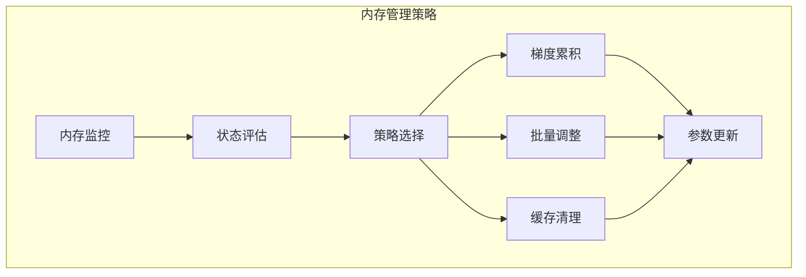

# 3.5 梯度累积与内存管理策略

## 引言：智能的内存管理

训练大型神经网络时，内存往往是最宝贵的资源。想象一下：
- **大模型**：参数量达到数十亿甚至数千亿
- **大批量**：为了稳定训练需要较大的batch size  
- **长序列**：处理长文本或视频序列
- **有限GPU**：显存容量始终是瓶颈

**梯度累积与内存管理就是在有限资源下实现无限可能的艺术**。

## 梯度累积的数学原理

### 批量梯度下降的等价性

当内存不足以处理完整批量时，可以分成小批量处理：

```
设总批量大小为 N，分成 K 个小批量，每个大小为 n = N/K

∇L = (1/N) * Σ_{i=1}^N ∇l_i
    = Σ_{k=1}^K (1/K) * ∇L_k
```

这证明了梯度累积的数学等价性。

## 内存监控器

```java
package cn.tinyai.memory;

import java.lang.management.ManagementFactory;
import java.lang.management.MemoryMXBean;
import java.lang.management.MemoryUsage;

/**
 * 内存监控器
 * 实时监控Java堆内存使用情况
 */
public class MemoryMonitor {
    
    private final MemoryMXBean memoryBean;
    private final double memoryWarningThreshold = 0.8; // 80%预警
    private final double memoryCriticalThreshold = 0.9; // 90%严重预警
    
    public MemoryMonitor() {
        this.memoryBean = ManagementFactory.getMemoryMXBean();
    }
    
    /**
     * 获取当前内存使用情况
     */
    public MemoryUsageInfo getCurrentMemoryUsage() {
        MemoryUsage heapUsage = memoryBean.getHeapMemoryUsage();
        long used = heapUsage.getUsed();
        long max = heapUsage.getMax();
        
        return new MemoryUsageInfo(used, max, (double) used / max);
    }
    
    /**
     * 检查内存状态
     */
    public MemoryStatus checkMemoryStatus() {
        double usage = getCurrentMemoryUsage().getUsageRatio();
        
        if (usage >= memoryCriticalThreshold) {
            return MemoryStatus.CRITICAL;
        } else if (usage >= memoryWarningThreshold) {
            return MemoryStatus.WARNING;
        } else {
            return MemoryStatus.NORMAL;
        }
    }
    
    /**
     * 强制垃圾回收
     */
    public void forceGarbageCollection() {
        System.gc();
        System.runFinalization();
    }
    
    /**
     * 内存使用信息
     */
    public static class MemoryUsageInfo {
        private final long used;
        private final long max;
        private final double usageRatio;
        
        public MemoryUsageInfo(long used, long max, double usageRatio) {
            this.used = used;
            this.max = max;
            this.usageRatio = usageRatio;
        }
        
        public long getUsed() { return used; }
        public long getMax() { return max; }
        public double getUsageRatio() { return usageRatio; }
        
        @Override
        public String toString() {
            return String.format("Memory[%dMB/%dMB (%.1f%%)]",
                used / 1024 / 1024, max / 1024 / 1024, usageRatio * 100);
        }
    }
    
    public enum MemoryStatus {
        NORMAL, WARNING, CRITICAL
    }
}
```

## 梯度累积器

```java
package cn.tinyai.function;

import cn.tinyai.ndarr.NdArray;
import cn.tinyai.memory.MemoryMonitor;
import java.util.*;
import java.util.concurrent.ConcurrentHashMap;

/**
 * 梯度累积器
 * 支持多种累积策略：同步、异步、内存感知
 */
public class GradientAccumulator {
    
    private final Map<Variable, NdArray> accumulatedGradients = new ConcurrentHashMap<>();
    private final MemoryMonitor memoryMonitor;
    private final AccumulationStrategy strategy;
    
    private int accumulationSteps = 0;
    private int targetAccumulationSteps = 4;
    private boolean isAccumulating = false;
    
    public GradientAccumulator(MemoryMonitor memoryMonitor, AccumulationStrategy strategy) {
        this.memoryMonitor = memoryMonitor;
        this.strategy = strategy;
    }
    
    /**
     * 开始新的累积周期
     */
    public void startAccumulation(int targetSteps) {
        this.targetAccumulationSteps = targetSteps;
        this.accumulationSteps = 0;
        this.isAccumulating = true;
        this.accumulatedGradients.clear();
        
        System.out.println("开始梯度累积，目标步数: " + targetSteps);
    }
    
    /**
     * 累积一个小批量的梯度
     */
    public void accumulateGradients(Collection<Variable> variables) {
        if (!isAccumulating) {
            throw new IllegalStateException("未开始梯度累积");
        }
        
        // 检查内存状态
        MemoryMonitor.MemoryStatus memoryStatus = memoryMonitor.checkMemoryStatus();
        if (memoryStatus == MemoryMonitor.MemoryStatus.CRITICAL) {
            emergencyMemoryCleanup();
        }
        
        // 根据策略累积梯度
        switch (strategy) {
            case SYNC:
                accumulateSync(variables);
                break;
            case ASYNC:
                accumulateAsync(variables);
                break;
            case MEMORY_AWARE:
                accumulateMemoryAware(variables, memoryStatus);
                break;
        }
        
        accumulationSteps++;
    }
    
    /**
     * 同步梯度累积
     */
    private void accumulateSync(Collection<Variable> variables) {
        for (Variable var : variables) {
            if (!var.requiresGrad() || var.getGrad() == null) {
                continue;
            }
            
            NdArray grad = var.getGrad();
            NdArray scaledGrad = grad.div((float) targetAccumulationSteps);
            
            accumulatedGradients.merge(var, scaledGrad, (oldGrad, newGrad) -> {
                return oldGrad == null ? newGrad : oldGrad.add(newGrad);
            });
        }
    }
    
    /**
     * 异步梯度累积（原地累积，节省内存）
     */
    private void accumulateAsync(Collection<Variable> variables) {
        for (Variable var : variables) {
            if (!var.requiresGrad() || var.getGrad() == null) {
                continue;
            }
            
            NdArray grad = var.getGrad();
            NdArray accumulatedGrad = accumulatedGradients.get(var);
            
            if (accumulatedGrad == null) {
                accumulatedGrad = grad.div((float) targetAccumulationSteps);
                accumulatedGradients.put(var, accumulatedGrad);
            } else {
                // 原地累积，节省内存
                NdArray scaledGrad = grad.div((float) targetAccumulationSteps);
                accumulatedGrad.addInPlace(scaledGrad);
            }
        }
    }
    
    /**
     * 内存感知的梯度累积
     */
    private void accumulateMemoryAware(Collection<Variable> variables, 
                                     MemoryMonitor.MemoryStatus memoryStatus) {
        if (memoryStatus == MemoryMonitor.MemoryStatus.WARNING) {
            accumulateAsync(variables); // 内存紧张时使用原地操作
        } else {
            accumulateSync(variables);  // 内存充足时使用同步累积
        }
    }
    
    /**
     * 完成累积并应用梯度
     */
    public void finishAccumulation(Collection<Variable> variables) {
        if (!isAccumulating) {
            throw new IllegalStateException("未在进行梯度累积");
        }
        
        // 将累积的梯度设置回变量
        for (Variable var : variables) {
            if (var.requiresGrad()) {
                NdArray accumulatedGrad = accumulatedGradients.get(var);
                if (accumulatedGrad != null) {
                    var.setGrad(accumulatedGrad);
                } else {
                    var.setGrad(NdArray.zeros(var.shape()));
                }
            }
        }
        
        // 清理累积状态
        isAccumulating = false;
        accumulatedGradients.clear();
        System.out.println("梯度累积完成");
    }
    
    /**
     * 紧急内存清理
     */
    private void emergencyMemoryCleanup() {
        memoryMonitor.forceGarbageCollection();
        
        // 保留最重要的梯度（按范数排序）
        if (accumulatedGradients.size() > 100) {
            List<Map.Entry<Variable, NdArray>> entries = new ArrayList<>(accumulatedGradients.entrySet());
            entries.sort((a, b) -> Float.compare(b.getValue().norm(), a.getValue().norm()));
            
            accumulatedGradients.clear();
            entries.stream().limit(100).forEach(entry -> 
                accumulatedGradients.put(entry.getKey(), entry.getValue()));
            
            System.out.println("紧急清理：保留了100个最重要的累积梯度");
        }
    }
    
    public enum AccumulationStrategy {
        SYNC,          // 同步累积
        ASYNC,         // 异步累积  
        MEMORY_AWARE   // 内存感知累积
    }
}
```

## 动态批量大小调整

```java
/**
 * 动态批量大小调整器
 * 根据内存使用情况自动调整批量大小
 */
public class DynamicBatchSizeAdjuster {
    
    private final MemoryMonitor memoryMonitor;
    private int currentBatchSize;
    private final int minBatchSize;
    private final int maxBatchSize;
    private final double targetMemoryRatio = 0.7; // 目标内存使用率70%
    
    public DynamicBatchSizeAdjuster(MemoryMonitor memoryMonitor, 
                                  int initialBatchSize, int minBatchSize, int maxBatchSize) {
        this.memoryMonitor = memoryMonitor;
        this.currentBatchSize = initialBatchSize;
        this.minBatchSize = minBatchSize;
        this.maxBatchSize = maxBatchSize;
    }
    
    /**
     * 根据内存使用情况调整批量大小
     */
    public int adjustBatchSize() {
        double currentRatio = memoryMonitor.getCurrentMemoryUsage().getUsageRatio();
        int newBatchSize = currentBatchSize;
        
        if (currentRatio > targetMemoryRatio + 0.1) {
            // 内存使用过高，减小批量大小
            newBatchSize = Math.max(minBatchSize, (int) (currentBatchSize * 0.8));
            System.out.printf("内存过高(%.1f%%)，减小批量: %d -> %d%n",
                currentRatio * 100, currentBatchSize, newBatchSize);
        } else if (currentRatio < targetMemoryRatio - 0.1) {
            // 内存使用较低，增大批量大小
            newBatchSize = Math.min(maxBatchSize, (int) (currentBatchSize * 1.2));
            if (newBatchSize > currentBatchSize) {
                System.out.printf("内存较低(%.1f%%)，增大批量: %d -> %d%n",
                    currentRatio * 100, currentBatchSize, newBatchSize);
            }
        }
        
        currentBatchSize = newBatchSize;
        return currentBatchSize;
    }
    
    public int getCurrentBatchSize() {
        return currentBatchSize;
    }
}
```

## 内存高效训练示例

```java
public class MemoryEfficientTrainingExample {
    
    public static void main(String[] args) {
        // 初始化内存管理组件
        MemoryMonitor memoryMonitor = new MemoryMonitor();
        GradientAccumulator gradAccumulator = new GradientAccumulator(
            memoryMonitor, GradientAccumulator.AccumulationStrategy.MEMORY_AWARE);
        DynamicBatchSizeAdjuster batchAdjuster = new DynamicBatchSizeAdjuster(
            memoryMonitor, 32, 8, 128);
        
        // 模拟大批量训练
        simulateLargeBatchTraining(memoryMonitor, gradAccumulator, batchAdjuster);
    }
    
    private static void simulateLargeBatchTraining(MemoryMonitor memoryMonitor,
                                                 GradientAccumulator gradAccumulator,
                                                 DynamicBatchSizeAdjuster batchAdjuster) {
        
        // 创建模拟网络参数
        List<Variable> parameters = createMockParameters();
        
        int targetTotalBatchSize = 256; // 目标大批量大小
        int epochs = 5;
        
        System.out.println("开始内存高效训练演示");
        System.out.println("目标批量大小: " + targetTotalBatchSize);
        
        for (int epoch = 0; epoch < epochs; epoch++) {
            System.out.println("\n=== Epoch " + (epoch + 1) + " ===");
            
            // 动态调整批量大小
            int currentBatchSize = batchAdjuster.adjustBatchSize();
            int accumulationSteps = targetTotalBatchSize / currentBatchSize;
            
            // 开始梯度累积
            gradAccumulator.startAccumulation(accumulationSteps);
            
            for (int step = 0; step < accumulationSteps; step++) {
                // 模拟小批量前向传播和反向传播
                simulateMiniBatchTraining(parameters, currentBatchSize);
                
                // 累积梯度
                gradAccumulator.accumulateGradients(parameters);
                
                // 打印内存状态
                MemoryMonitor.MemoryUsageInfo memInfo = memoryMonitor.getCurrentMemoryUsage();
                System.out.printf("Step %d/%d - %s%n", 
                    step + 1, accumulationSteps, memInfo);
            }
            
            // 完成累积，应用梯度
            gradAccumulator.finishAccumulation(parameters);
            
            // 模拟参数更新
            updateParameters(parameters, 0.001f);
            
            // 清理梯度
            clearGradients(parameters);
        }
        
        System.out.println("\n训练完成");
    }
    
    private static List<Variable> createMockParameters() {
        List<Variable> params = new ArrayList<>();
        
        // 创建一些模拟参数
        params.add(new Variable(NdArray.randomNormal(new int[]{100, 50}, 0.0f, 0.1f), "W1"));
        params.add(new Variable(NdArray.zeros(1, 50), "b1"));
        params.add(new Variable(NdArray.randomNormal(new int[]{50, 10}, 0.0f, 0.1f), "W2"));
        params.add(new Variable(NdArray.zeros(1, 10), "b2"));
        
        return params;
    }
    
    private static void simulateMiniBatchTraining(List<Variable> parameters, int batchSize) {
        // 模拟为每个参数生成随机梯度
        for (Variable param : parameters) {
            if (param.requiresGrad()) {
                NdArray randomGrad = NdArray.randomNormal(param.shape(), 0.0f, 0.01f);
                param.setGrad(randomGrad);
            }
        }
    }
    
    private static void updateParameters(List<Variable> parameters, float learningRate) {
        for (Variable param : parameters) {
            if (param.requiresGrad() && param.getGrad() != null) {
                NdArray update = param.getGrad().mul(-learningRate);
                param.setData(param.getData().add(update));
            }
        }
    }
    
    private static void clearGradients(List<Variable> parameters) {
        for (Variable param : parameters) {
            if (param.requiresGrad()) {
                param.clearGrad();
            }
        }
    }
}
```

## 小节总结

### 核心要点回顾

1. **梯度累积**：用小批量模拟大批量训练的等价算法
2. **内存监控**：实时监控和预警内存使用状况
3. **动态调整**：根据内存状况动态调整批量大小
4. **策略模式**：支持多种累积策略适应不同场景

### 内存优化架构



### 最佳实践建议

1. **监控优先**：始终监控内存使用情况
2. **渐进调整**：批量大小调整应该渐进式进行
3. **策略切换**：根据内存压力动态切换累积策略
4. **及时清理**：定期清理不必要的中间结果

## 练习思考

### 基础练习

1. 实现内存使用率的滑动窗口监控
2. 设计支持优先级的梯度缓存策略
3. 实现基于阈值的自动垃圾回收触发器

### 进阶练习

1. 设计分布式环境下的梯度累积协调机制
2. 实现基于梯度重要性的选择性累积算法
3. 开发支持混合精度的内存优化策略

---

*至此，第3章自动微分引擎的全部内容已完成。下一章我们将探讨函数抽象与数学运算的设计与实现。*