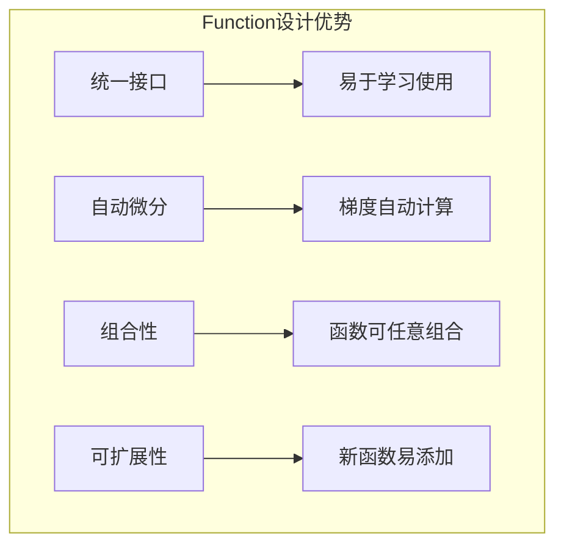

# 4.1 Function抽象类的设计哲学

## 引言：函数式思维的力量

在数学中，函数是连接输入和输出的桥梁。在深度学习中，**Function抽象类就是连接数据变换和梯度计算的核心桥梁**。

想象一下乐高积木：
- **基础积木块**：每个Function都是一个基础的计算单元
- **组合规则**：通过明确的接口可以任意组合
- **复杂结构**：简单积木可以构建复杂的神经网络

**Function抽象类的设计哲学就是让深度学习变成"搭积木"的艺术**。

## 设计哲学的核心原则

### 1. 单一职责原则

每个Function只负责一种特定的数学运算：

```java
// ✅ 好的设计：职责单一
public class Add extends Function {
    // 只负责加法运算
}

// ❌ 坏的设计：职责混合
public class MathOperations extends Function {
    // 既做加法又做乘法，职责不清
}
```

### 2. 开闭原则

对扩展开放，对修改封闭：

```java
public abstract class Function {
    // 稳定的核心接口
    protected abstract NdArray[] forwardImpl(NdArray... inputs);
    protected abstract NdArray[] backwardImpl(NdArray... gradOutputs);
}

// 扩展新功能
public class NewActivationFunction extends Function {
    // 实现新的激活函数，不影响现有代码
}
```

## Function抽象类的核心设计

```java
package cn.tinyai.function;

import cn.tinyai.ndarr.NdArray;
import java.util.*;

/**
 * Function: 可微函数的抽象基类
 * 
 * 设计哲学：
 * 1. 统一接口：所有数学运算都遵循相同的接口规范
 * 2. 自动微分：内置前向和反向传播机制
 * 3. 组合性：可以任意组合构建复杂计算图
 * 4. 可扩展性：通过继承轻松添加新的运算类型
 */
public abstract class Function {
    
    // 函数名称（用于调试）
    protected String functionName;
    
    // 输入输出变量缓存
    protected Variable[] inputs;
    protected Variable[] outputs;
    
    // 函数执行统计
    protected final FunctionStats stats = new FunctionStats();
    
    protected Function() {
        this.functionName = this.getClass().getSimpleName();
    }
    
    // ==================== 核心抽象方法 ====================
    
    /**
     * 前向传播实现 - 子类必须实现
     */
    protected abstract NdArray[] forwardImpl(NdArray... inputs);
    
    /**
     * 反向传播实现 - 子类必须实现
     */
    protected abstract NdArray[] backwardImpl(NdArray... gradOutputs);
    
    // ==================== 公共接口方法 ====================
    
    /**
     * 应用函数到输入变量（主要入口点）
     */
    public final Variable[] apply(Variable... inputs) {
        long startTime = System.nanoTime();
        
        try {
            // 1. 验证输入
            validateInputs(inputs);
            
            // 2. 保存输入引用
            this.inputs = Arrays.copyOf(inputs, inputs.length);
            
            // 3. 执行前向传播
            NdArray[] inputData = extractData(inputs);
            NdArray[] outputData = forwardImpl(inputData);
            
            // 4. 创建输出变量
            Variable[] outputVars = createOutputVariables(outputData, inputs);
            this.outputs = Arrays.copyOf(outputVars, outputVars.length);
            
            // 5. 更新统计信息
            stats.recordExecution(System.nanoTime() - startTime, true);
            
            return outputVars;
            
        } catch (Exception e) {
            stats.recordExecution(System.nanoTime() - startTime, false);
            throw new FunctionExecutionException("函数执行失败: " + functionName, e);
        }
    }
    
    /**
     * 单输入单输出的便利方法
     */
    public final Variable apply(Variable input) {
        return apply(new Variable[]{input})[0];
    }
    
    /**
     * 反向传播入口
     */
    public final NdArray[] backward(NdArray... gradOutputs) {
        try {
            validateGradientInputs(gradOutputs);
            return backwardImpl(gradOutputs);
        } catch (Exception e) {
            throw new FunctionExecutionException("反向传播失败: " + functionName, e);
        }
    }
    
    // ==================== 辅助方法 ====================
    
    protected NdArray[] extractData(Variable[] variables) {
        return Arrays.stream(variables)
            .map(Variable::getData)
            .toArray(NdArray[]::new);
    }
    
    protected Variable[] createOutputVariables(NdArray[] outputData, Variable[] inputs) {
        Variable[] outputVars = new Variable[outputData.length];
        boolean requiresGrad = Arrays.stream(inputs).anyMatch(Variable::requiresGrad);
        
        for (int i = 0; i < outputData.length; i++) {
            if (requiresGrad) {
                outputVars[i] = new Variable(outputData[i], this);
            } else {
                outputVars[i] = new Variable(outputData[i], false, null);
            }
        }
        
        return outputVars;
    }
    
    // ==================== 验证方法 ====================
    
    protected void validateInputs(Variable... inputs) {
        if (inputs == null || inputs.length == 0) {
            throw new IllegalArgumentException("输入不能为空");
        }
        
        for (int i = 0; i < inputs.length; i++) {
            if (inputs[i] == null || inputs[i].getData() == null) {
                throw new IllegalArgumentException("第" + i + "个输入无效");
            }
        }
        
        validateInputsImpl(inputs);
    }
    
    protected void validateInputsImpl(Variable... inputs) {
        // 子类可重写添加特定验证
    }
    
    protected void validateGradientInputs(NdArray... gradOutputs) {
        if (outputs == null || gradOutputs == null || 
            gradOutputs.length != outputs.length) {
            throw new IllegalArgumentException("梯度数量与输出数量不匹配");
        }
    }
    
    // ==================== 访问器方法 ====================
    
    public String getFunctionName() { return functionName; }
    public Variable[] getInputs() { return inputs != null ? inputs.clone() : new Variable[0]; }
    public Variable[] getOutputs() { return outputs != null ? outputs.clone() : new Variable[0]; }
    public FunctionStats getStats() { return stats; }
    
    @Override
    public String toString() {
        return functionName + "[" + (inputs != null ? inputs.length : 0) + 
               "->" + (outputs != null ? outputs.length : 0) + "]";
    }
}
```

## 函数统计类

```java
/**
 * 函数执行统计信息
 */
public static class FunctionStats {
    private long executionCount = 0;
    private long totalTime = 0;
    private long failures = 0;
    
    public synchronized void recordExecution(long timeNanos, boolean success) {
        executionCount++;
        totalTime += timeNanos;
        if (!success) failures++;
    }
    
    public long getExecutionCount() { return executionCount; }
    public double getAvgTime() { 
        return executionCount > 0 ? (double) totalTime / executionCount / 1_000_000.0 : 0;
    }
    public double getSuccessRate() {
        return executionCount > 0 ? (double) (executionCount - failures) / executionCount : 0;
    }
    
    @Override
    public String toString() {
        return String.format("Stats[%d calls, %.2fms avg, %.1f%% success]",
            executionCount, getAvgTime(), getSuccessRate() * 100);
    }
}
```

## 设计模式的运用

### 模板方法模式

```java
public abstract class Function {
    
    // 模板方法：定义算法骨架
    public final Variable[] apply(Variable... inputs) {
        // 1. 前置处理
        validateInputs(inputs);
        
        // 2. 核心计算（子类实现）
        NdArray[] result = forwardImpl(extractData(inputs));
        
        // 3. 后置处理
        return createOutputVariables(result, inputs);
    }
    
    // 抽象方法：子类必须实现
    protected abstract NdArray[] forwardImpl(NdArray... inputs);
}
```

### 工厂方法模式

```java
public class FunctionFactory {
    
    public static Function createFunction(String type) {
        switch (type.toLowerCase()) {
            case "add": return new Add();
            case "mul": return new Mul();
            case "sigmoid": return new Sigmoid();
            case "relu": return new ReLU();
            default: throw new IllegalArgumentException("未知函数类型: " + type);
        }
    }
}
```

## 自定义Function示例

```java
/**
 * 自定义激活函数：Swish
 * Swish(x) = x * sigmoid(x)
 */
public class Swish extends Function {
    
    private NdArray cachedInput;
    private NdArray cachedSigmoid;
    
    @Override
    protected NdArray[] forwardImpl(NdArray... inputs) {
        NdArray x = inputs[0];
        this.cachedInput = x;
        
        // 计算sigmoid(x)
        NdArray sigmoid = computeSigmoid(x);
        this.cachedSigmoid = sigmoid;
        
        // Swish(x) = x * sigmoid(x)
        NdArray result = x.mul(sigmoid);
        return new NdArray[]{result};
    }
    
    @Override
    protected NdArray[] backwardImpl(NdArray... gradOutputs) {
        NdArray gradOutput = gradOutputs[0];
        
        // Swish导数: sigmoid(x) * (1 + x * (1 - sigmoid(x)))
        NdArray sigmoid = cachedSigmoid;
        NdArray x = cachedInput;
        
        NdArray ones = NdArray.ones(x.shape());
        NdArray derivative = sigmoid.mul(ones.add(x.mul(ones.sub(sigmoid))));
        
        return new NdArray[]{gradOutput.mul(derivative)};
    }
    
    private NdArray computeSigmoid(NdArray x) {
        // 数值稳定的sigmoid实现
        NdArray result = x.copy();
        float[] data = result.getData();
        
        for (int i = 0; i < data.length; i++) {
            float val = data[i];
            data[i] = val >= 0 ? 
                1.0f / (1.0f + (float) Math.exp(-val)) :
                (float) Math.exp(val) / (1.0f + (float) Math.exp(val));
        }
        
        return result;
    }
    
    public static Variable apply(Variable x) {
        return new Swish().apply(x);
    }
}
```

## 使用示例

```java
public class FunctionDesignExample {
    
    public static void main(String[] args) {
        // 创建输入
        Variable x = new Variable(NdArray.of(new float[]{-1, 0, 1, 2}), "x");
        
        // 使用不同激活函数
        Variable sigmoid_out = Sigmoid.apply(x);
        Variable relu_out = ReLU.apply(x);
        Variable swish_out = Swish.apply(x);
        
        System.out.println("输入: " + x.getData());
        System.out.println("Sigmoid: " + sigmoid_out.getData());
        System.out.println("ReLU: " + relu_out.getData());
        System.out.println("Swish: " + swish_out.getData());
        
        // 函数组合
        Variable composed = Swish.apply(x.mul(2.0).add(1.0));
        System.out.println("Swish(2*x + 1): " + composed.getData());
        
        // 反向传播
        Variable loss = composed.pow(2).mean();
        loss.backward();
        System.out.println("x的梯度: " + x.getGrad());
    }
}
```

## 小节总结

### 设计哲学核心

1. **统一抽象**：所有数学运算都遵循相同的Function接口
2. **组合性**：简单函数可以组合成复杂计算
3. **可扩展性**：通过继承轻松添加新的运算类型
4. **高性能**：内置性能统计和优化机制

### 架构优势



### 使用建议

1. **继承实现**：通过继承Function基类实现新运算
2. **验证完整**：重写validateInputsImpl添加特定验证
3. **缓存优化**：合理缓存中间结果用于反向传播
4. **异常处理**：提供清晰的错误信息

## 练习思考

### 基础练习

1. 实现LeakyReLU激活函数
2. 实现Dropout函数（训练时随机置零）
3. 添加函数执行时间的详细统计

### 进阶练习

1. 设计支持多输出的Function基类扩展
2. 实现函数的序列化和反序列化
3. 设计函数执行的并行化机制

---

*下一节我们将实现基础数学运算函数，构建深度学习的计算基石。*