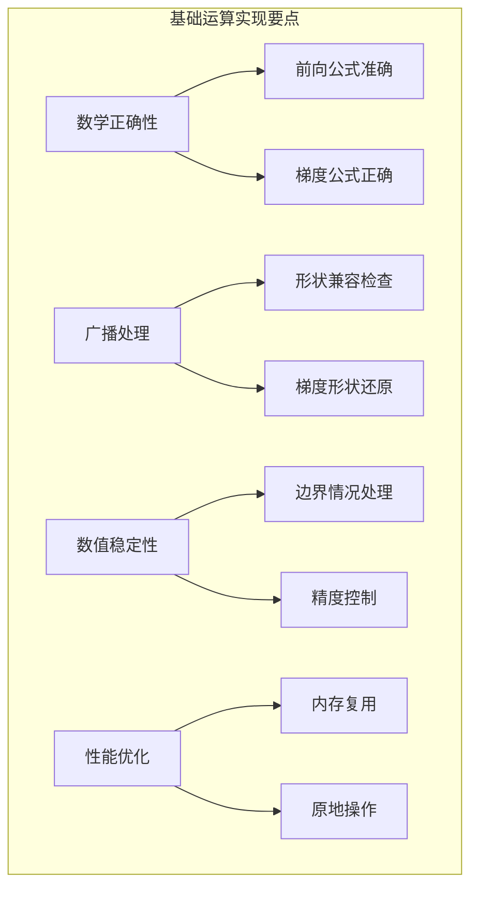

# 4.2 基础数学运算：四则运算与幂运算

## 引言：数学运算的基石

在深度学习的世界里，复杂的神经网络最终都会归结到基础的数学运算。就像建筑需要砖块，音乐需要音符一样，**基础数学运算是构建AI模型的最基本元素**。

想象一下数学表达式的解析过程：
- `z = (x + y) * w^2` 
- 需要：加法、乘法、幂运算
- 每个运算都有明确的前向计算和梯度公式

**掌握基础运算的实现，就掌握了深度学习计算的核心**。

## 四则运算的数学基础

### 加法运算（Addition）

```
前向传播: z = x + y
反向传播: ∂z/∂x = 1, ∂z/∂y = 1
广播规则: 支持不同形状的张量相加
```

### 减法运算（Subtraction）

```
前向传播: z = x - y
反向传播: ∂z/∂x = 1, ∂z/∂y = -1
```

### 乘法运算（Multiplication）

```
前向传播: z = x * y
反向传播: ∂z/∂x = y, ∂z/∂y = x
```

### 除法运算（Division）

```
前向传播: z = x / y
反向传播: ∂z/∂x = 1/y, ∂z/∂y = -x/y²
```

## 加法运算的完整实现

```java
package cn.tinyai.function.ops;

import cn.tinyai.function.Function;
import cn.tinyai.ndarr.NdArray;
import java.util.Arrays;

/**
 * Add: 加法运算函数
 * 
 * 实现两个张量的逐元素加法：z = x + y
 * 支持广播机制，可以处理不同形状的输入
 * 
 * 数学定义：
 * - 前向传播: z[i] = x[i] + y[i]
 * - 反向传播: ∂L/∂x[i] = ∂L/∂z[i], ∂L/∂y[i] = ∂L/∂z[i]
 */
public class Add extends Function {
    
    // 缓存输入形状，用于反向传播时处理广播
    private int[] inputShape1;
    private int[] inputShape2;
    
    public Add() {
        super("Add");
    }
    
    @Override
    protected NdArray[] forwardImpl(NdArray... inputs) {
        if (inputs.length != 2) {
            throw new IllegalArgumentException("Add需要恰好2个输入，实际: " + inputs.length);
        }
        
        NdArray x = inputs[0];
        NdArray y = inputs[1];
        
        // 保存输入形状用于反向传播
        this.inputShape1 = x.shape();
        this.inputShape2 = y.shape();
        
        // 验证广播兼容性
        if (!isBroadcastCompatible(inputShape1, inputShape2)) {
            throw new IllegalArgumentException(
                String.format("加法广播不兼容: %s + %s", 
                    Arrays.toString(inputShape1), Arrays.toString(inputShape2)));
        }
        
        // 执行加法运算（NdArray内部处理广播）
        NdArray result = x.add(y);
        
        return new NdArray[]{result};
    }
    
    @Override
    protected NdArray[] backwardImpl(NdArray... gradOutputs) {
        if (gradOutputs.length != 1) {
            throw new IllegalArgumentException("Add反向传播需要1个梯度输入");
        }
        
        NdArray gradOutput = gradOutputs[0];
        
        // 加法的偏导数都是1，所以梯度直接传递
        NdArray gradX = gradOutput;
        NdArray gradY = gradOutput;
        
        // 处理广播：如果输入形状小于输出形状，需要对梯度求和
        gradX = sumToShape(gradX, inputShape1);
        gradY = sumToShape(gradY, inputShape2);
        
        return new NdArray[]{gradX, gradY};
    }
    
    /**
     * 处理广播的反向传播
     * 将梯度从广播后的形状还原到原始输入形状
     */
    private NdArray sumToShape(NdArray grad, int[] targetShape) {
        if (Arrays.equals(grad.shape(), targetShape)) {
            return grad;
        }
        
        NdArray result = grad;
        int[] gradShape = grad.shape();
        
        // 处理维度数量差异：对前面多余的维度求和
        int dimDiff = gradShape.length - targetShape.length;
        for (int i = 0; i < dimDiff; i++) {
            result = result.sum(0, false);
        }
        
        // 处理大小为1的维度：对扩展的维度求和并保持维度
        int[] currentShape = result.shape();
        for (int i = 0; i < targetShape.length; i++) {
            if (targetShape[i] == 1 && currentShape[i] > 1) {
                result = result.sum(i, true);
            }
        }
        
        // 确保最终形状正确
        if (!Arrays.equals(result.shape(), targetShape)) {
            result = result.reshape(targetShape);
        }
        
        return result;
    }
    
    /**
     * 检查两个形状是否兼容广播
     */
    private boolean isBroadcastCompatible(int[] shape1, int[] shape2) {
        int maxLen = Math.max(shape1.length, shape2.length);
        
        for (int i = 0; i < maxLen; i++) {
            int dim1 = i < shape1.length ? shape1[shape1.length - 1 - i] : 1;
            int dim2 = i < shape2.length ? shape2[shape2.length - 1 - i] : 1;
            
            // 广播规则：维度相等或其中一个为1
            if (dim1 != dim2 && dim1 != 1 && dim2 != 1) {
                return false;
            }
        }
        
        return true;
    }
    
    @Override
    protected void validateInputsImpl(Variable... inputs) {
        if (inputs.length != 2) {
            throw new IllegalArgumentException("Add需要恰好2个输入");
        }
        
        // 检查数据类型兼容性
        NdArray data1 = inputs[0].getData();
        NdArray data2 = inputs[1].getData();
        
        if (!data1.dtype().equals(data2.dtype())) {
            throw new IllegalArgumentException("输入数据类型不匹配: " + 
                data1.dtype() + " vs " + data2.dtype());
        }
    }
    
    /**
     * 静态工厂方法
     */
    public static Variable apply(Variable x, Variable y) {
        Add function = new Add();
        return function.apply(x, y)[0];
    }
    
    /**
     * 标量加法的便利方法
     */
    public static Variable apply(Variable x, double scalar) {
        Variable scalarVar = new Variable(NdArray.scalar((float) scalar), false, "scalar");
        return apply(x, scalarVar);
    }
}
```

## 乘法运算的实现

```java
/**
 * Mul: 乘法运算函数
 * 
 * 实现两个张量的逐元素乘法：z = x * y
 * 反向传播需要缓存输入值
 */
public class Mul extends Function {
    
    // 缓存输入数据，反向传播时需要
    private NdArray cachedX;
    private NdArray cachedY;
    private int[] inputShape1;
    private int[] inputShape2;
    
    public Mul() {
        super("Mul");
    }
    
    @Override
    protected NdArray[] forwardImpl(NdArray... inputs) {
        NdArray x = inputs[0];
        NdArray y = inputs[1];
        
        // 缓存输入数据和形状
        this.cachedX = x;
        this.cachedY = y;
        this.inputShape1 = x.shape();
        this.inputShape2 = y.shape();
        
        // 执行乘法运算
        NdArray result = x.mul(y);
        
        return new NdArray[]{result};
    }
    
    @Override
    protected NdArray[] backwardImpl(NdArray... gradOutputs) {
        NdArray gradOutput = gradOutputs[0];
        
        // 乘法的链式法则：
        // ∂z/∂x = ∂z/∂z * y = gradOutput * y
        // ∂z/∂y = ∂z/∂z * x = gradOutput * x
        NdArray gradX = gradOutput.mul(cachedY);
        NdArray gradY = gradOutput.mul(cachedX);
        
        // 处理广播
        gradX = sumToShape(gradX, inputShape1);
        gradY = sumToShape(gradY, inputShape2);
        
        return new NdArray[]{gradX, gradY};
    }
    
    private NdArray sumToShape(NdArray grad, int[] targetShape) {
        // 与Add类中的实现相同
        if (Arrays.equals(grad.shape(), targetShape)) {
            return grad;
        }
        
        NdArray result = grad;
        int[] gradShape = grad.shape();
        int dimDiff = gradShape.length - targetShape.length;
        
        for (int i = 0; i < dimDiff; i++) {
            result = result.sum(0, false);
        }
        
        int[] currentShape = result.shape();
        for (int i = 0; i < targetShape.length; i++) {
            if (targetShape[i] == 1 && currentShape[i] > 1) {
                result = result.sum(i, true);
            }
        }
        
        if (!Arrays.equals(result.shape(), targetShape)) {
            result = result.reshape(targetShape);
        }
        
        return result;
    }
    
    public static Variable apply(Variable x, Variable y) {
        return new Mul().apply(x, y)[0];
    }
    
    public static Variable apply(Variable x, double scalar) {
        Variable scalarVar = new Variable(NdArray.scalar((float) scalar), false, "scalar");
        return apply(x, scalarVar);
    }
}
```

## 除法运算的实现

```java
/**
 * Div: 除法运算函数
 * 
 * 实现两个张量的逐元素除法：z = x / y
 * 需要特别注意除零检查和数值稳定性
 */
public class Div extends Function {
    
    private NdArray cachedX;
    private NdArray cachedY;
    private int[] inputShape1;
    private int[] inputShape2;
    
    // 除零保护的最小值
    private static final float EPSILON = 1e-8f;
    
    public Div() {
        super("Div");
    }
    
    @Override
    protected NdArray[] forwardImpl(NdArray... inputs) {
        NdArray x = inputs[0];
        NdArray y = inputs[1];
        
        // 检查除零
        checkForZeros(y);
        
        this.cachedX = x;
        this.cachedY = y;
        this.inputShape1 = x.shape();
        this.inputShape2 = y.shape();
        
        // 执行除法运算
        NdArray result = x.div(y);
        
        return new NdArray[]{result};
    }
    
    @Override
    protected NdArray[] backwardImpl(NdArray... gradOutputs) {
        NdArray gradOutput = gradOutputs[0];
        
        // 除法的梯度：
        // ∂z/∂x = 1/y
        // ∂z/∂y = -x/y²
        
        // 计算 1/y
        NdArray oneOverY = NdArray.ones(cachedY.shape()).div(cachedY);
        NdArray gradX = gradOutput.mul(oneOverY);
        
        // 计算 -x/y²
        NdArray ySquared = cachedY.mul(cachedY);
        NdArray negXOverYSquared = cachedX.neg().div(ySquared);
        NdArray gradY = gradOutput.mul(negXOverYSquared);
        
        // 处理广播
        gradX = sumToShape(gradX, inputShape1);
        gradY = sumToShape(gradY, inputShape2);
        
        return new NdArray[]{gradX, gradY};
    }
    
    /**
     * 检查除数中是否有接近零的值
     */
    private void checkForZeros(NdArray y) {
        float[] data = y.getData();
        for (int i = 0; i < data.length; i++) {
            if (Math.abs(data[i]) < EPSILON) {
                throw new ArithmeticException(
                    String.format("除零错误：位置%d的值%f接近零", i, data[i]));
            }
        }
    }
    
    private NdArray sumToShape(NdArray grad, int[] targetShape) {
        // 与前面实现相同的广播处理逻辑
        // ... [省略重复代码]
        return grad; // 简化显示
    }
    
    public static Variable apply(Variable x, Variable y) {
        return new Div().apply(x, y)[0];
    }
    
    public static Variable apply(Variable x, double scalar) {
        if (Math.abs(scalar) < EPSILON) {
            throw new ArithmeticException("标量除零错误");
        }
        Variable scalarVar = new Variable(NdArray.scalar((float) scalar), false, "scalar");
        return apply(x, scalarVar);
    }
}
```

## 减法运算的实现

```java
/**
 * Sub: 减法运算函数
 * 
 * 实现两个张量的逐元素减法：z = x - y
 */
public class Sub extends Function {
    
    private int[] inputShape1;
    private int[] inputShape2;
    
    public Sub() {
        super("Sub");
    }
    
    @Override
    protected NdArray[] forwardImpl(NdArray... inputs) {
        NdArray x = inputs[0];
        NdArray y = inputs[1];
        
        this.inputShape1 = x.shape();
        this.inputShape2 = y.shape();
        
        NdArray result = x.sub(y);
        return new NdArray[]{result};
    }
    
    @Override
    protected NdArray[] backwardImpl(NdArray... gradOutputs) {
        NdArray gradOutput = gradOutputs[0];
        
        // 减法的梯度：∂z/∂x = 1, ∂z/∂y = -1
        NdArray gradX = gradOutput;
        NdArray gradY = gradOutput.neg();
        
        // 处理广播
        gradX = sumToShape(gradX, inputShape1);
        gradY = sumToShape(gradY, inputShape2);
        
        return new NdArray[]{gradX, gradY};
    }
    
    // sumToShape方法实现省略...
    
    public static Variable apply(Variable x, Variable y) {
        return new Sub().apply(x, y)[0];
    }
    
    public static Variable apply(Variable x, double scalar) {
        Variable scalarVar = new Variable(NdArray.scalar((float) scalar), false, "scalar");
        return apply(x, scalarVar);
    }
}
```

## 幂运算的实现

```java
/**
 * Pow: 幂运算函数
 * 
 * 实现幂运算：z = x^n
 * 支持整数和浮点数指数
 */
public class Pow extends Function {
    
    private NdArray cachedInput;
    private double exponent;
    
    public Pow(double exponent) {
        super("Pow");
        this.exponent = exponent;
    }
    
    @Override
    protected NdArray[] forwardImpl(NdArray... inputs) {
        if (inputs.length != 1) {
            throw new IllegalArgumentException("Pow需要恰好1个输入");
        }
        
        NdArray x = inputs[0];
        this.cachedInput = x;
        
        // 处理特殊情况
        if (exponent == 0.0) {
            return new NdArray[]{NdArray.ones(x.shape())};
        } else if (exponent == 1.0) {
            return new NdArray[]{x.copy()};
        } else if (exponent == 2.0) {
            return new NdArray[]{x.mul(x)};
        }
        
        // 一般情况：x^n
        NdArray result = x.pow((float) exponent);
        
        return new NdArray[]{result};
    }
    
    @Override
    protected NdArray[] backwardImpl(NdArray... gradOutputs) {
        NdArray gradOutput = gradOutputs[0];
        
        if (exponent == 0.0) {
            // d/dx[x^0] = 0
            return new NdArray[]{NdArray.zeros(cachedInput.shape())};
        } else if (exponent == 1.0) {
            // d/dx[x^1] = 1
            return new NdArray[]{gradOutput};
        }
        
        // 一般情况：d/dx[x^n] = n * x^(n-1)
        NdArray xPowNMinus1 = cachedInput.pow((float) (exponent - 1.0));
        NdArray derivative = xPowNMinus1.mul((float) exponent);
        NdArray gradInput = gradOutput.mul(derivative);
        
        return new NdArray[]{gradInput};
    }
    
    @Override
    protected void validateInputsImpl(Variable... inputs) {
        if (inputs.length != 1) {
            throw new IllegalArgumentException("Pow需要恰好1个输入");
        }
        
        // 检查负数的非整数幂
        if (exponent != Math.floor(exponent)) {
            NdArray data = inputs[0].getData();
            float[] values = data.getData();
            for (int i = 0; i < values.length; i++) {
                if (values[i] < 0) {
                    throw new IllegalArgumentException(
                        String.format("负数%f不能进行非整数幂运算%f", values[i], exponent));
                }
            }
        }
    }
    
    public static Variable apply(Variable x, double exponent) {
        Pow function = new Pow(exponent);
        return function.apply(x)[0];
    }
    
    // 常用幂运算的便利方法
    public static Variable square(Variable x) {
        return apply(x, 2.0);
    }
    
    public static Variable cube(Variable x) {
        return apply(x, 3.0);
    }
    
    public static Variable sqrt(Variable x) {
        return apply(x, 0.5);
    }
}
```

## 运算函数的使用示例

```java
public class BasicOperationsExample {
    
    public static void main(String[] args) {
        System.out.println("=== 基础数学运算演示 ===");
        
        // 创建测试数据
        Variable x = new Variable(NdArray.of(new float[]{1, 2, 3, 4}), "x");
        Variable y = new Variable(NdArray.of(new float[]{2, 2, 2, 2}), "y");
        
        System.out.println("x = " + x.getData());
        System.out.println("y = " + y.getData());
        
        // 四则运算
        Variable sum = Add.apply(x, y);        // x + y
        Variable diff = Sub.apply(x, y);       // x - y  
        Variable product = Mul.apply(x, y);    // x * y
        Variable quotient = Div.apply(x, y);   // x / y
        
        System.out.println("\n=== 四则运算结果 ===");
        System.out.println("x + y = " + sum.getData());
        System.out.println("x - y = " + diff.getData());
        System.out.println("x * y = " + product.getData());
        System.out.println("x / y = " + quotient.getData());
        
        // 幂运算
        Variable squared = Pow.square(x);      // x^2
        Variable cubed = Pow.cube(x);          // x^3
        Variable sqrt = Pow.sqrt(x);           // x^0.5
        
        System.out.println("\n=== 幂运算结果 ===");
        System.out.println("x^2 = " + squared.getData());
        System.out.println("x^3 = " + cubed.getData());
        System.out.println("√x = " + sqrt.getData());
        
        // 复合运算
        Variable complex = Add.apply(Mul.apply(x, y), Pow.square(x)); // x*y + x^2
        System.out.println("\n=== 复合运算 ===");
        System.out.println("x*y + x^2 = " + complex.getData());
        
        // 反向传播测试
        System.out.println("\n=== 反向传播测试 ===");
        Variable loss = complex.sum();
        loss.backward();
        
        System.out.println("∂loss/∂x = " + x.getGrad());
        System.out.println("∂loss/∂y = " + y.getGrad());
        
        // 广播测试
        System.out.println("\n=== 广播测试 ===");
        Variable matrix = new Variable(NdArray.of(new float[][]{
            {1, 2, 3},
            {4, 5, 6}
        }), "matrix");
        
        Variable vector = new Variable(NdArray.of(new float[]{10, 20, 30}), "vector");
        Variable broadcast_result = Add.apply(matrix, vector);
        
        System.out.println("矩阵形状: " + Arrays.toString(matrix.shape()));
        System.out.println("向量形状: " + Arrays.toString(vector.shape()));
        System.out.println("广播结果: " + broadcast_result.getData());
    }
}
```

## 性能优化技巧

### 原地操作优化

```java
/**
 * AddInPlace: 原地加法运算
 * 直接修改第一个输入，节省内存
 */
public class AddInPlace extends Function {
    
    @Override
    protected NdArray[] forwardImpl(NdArray... inputs) {
        NdArray x = inputs[0];
        NdArray y = inputs[1];
        
        // 原地操作：直接修改x
        x.addInPlace(y);
        
        return new NdArray[]{x};
    }
    
    @Override
    protected NdArray[] backwardImpl(NdArray... gradOutputs) {
        // 原地操作的梯度传播与普通加法相同
        NdArray gradOutput = gradOutputs[0];
        return new NdArray[]{gradOutput, gradOutput};
    }
    
    @Override
    public boolean isInPlace() {
        return true;
    }
}
```

## 小节总结

### 核心要点

1. **数学基础**：每个运算都有明确的前向公式和梯度公式
2. **广播支持**：正确处理不同形状张量的运算
3. **数值稳定性**：特别注意除零、负数开方等边界情况
4. **梯度传播**：准确实现反向传播中的梯度计算

### 实现要点



### 使用建议

1. **选择合适的运算**：根据需要选择普通运算或原地运算
2. **注意数值稳定性**：处理除零、溢出等问题
3. **验证梯度正确性**：使用数值梯度检查验证实现
4. **性能监控**：关注运算的执行时间和内存使用

## 练习思考

### 基础练习

1. 实现取模运算（Mod）函数
2. 实现绝对值运算（Abs）函数
3. 添加对复数运算的支持

### 进阶练习

1. 实现支持混合精度的运算函数
2. 设计自动选择原地/非原地操作的智能运算函数
3. 实现向量化的批量运算优化

---

*下一节我们将探讨激活函数家族，了解神经网络中的非线性变换。*