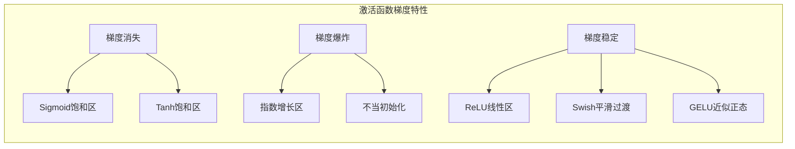
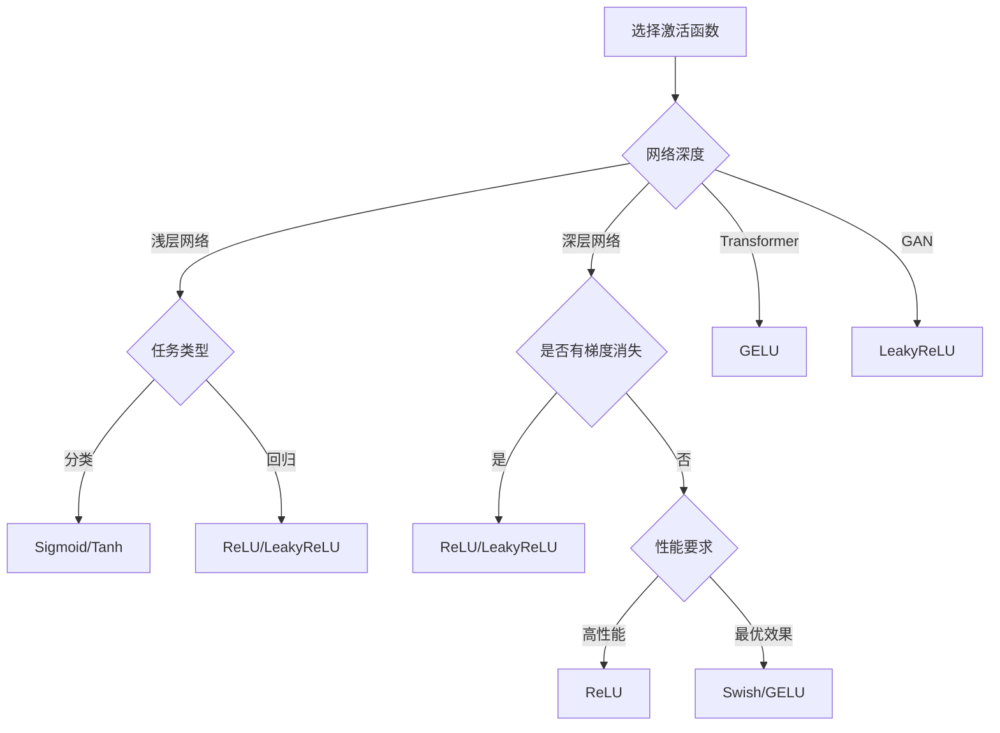
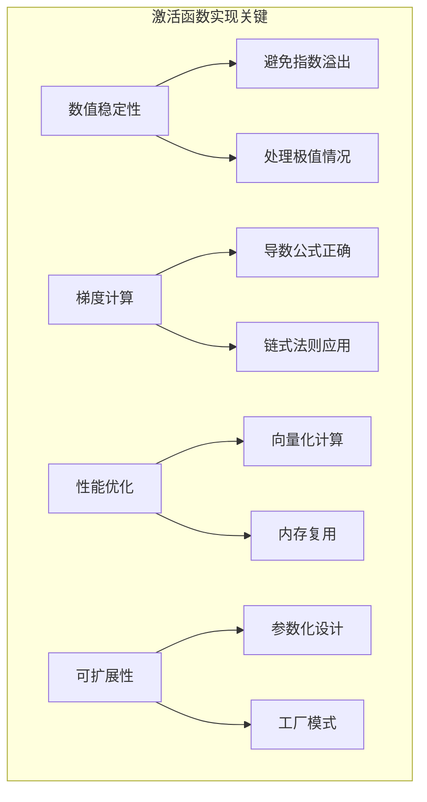

# 4.3 激活函数家族：从Sigmoid到GELU

## 引言：神经网络的"开关"

在神经网络中，激活函数就像细胞膜上的离子通道，决定着信息是否能够传递。想象一下：
- **线性变换**：就像水管中的直流，信息平淡地流过
- **激活函数**：像调节阀门，为信息流注入非线性的"生命力"
- **网络能力**：没有激活函数，再深的网络也只能做线性变换

**激活函数是神经网络获得非线性表达能力的关键**。

## 激活函数的数学特性

### 基本要求

一个好的激活函数通常需要满足：

```
1. 非线性：f(ax + by) ≠ af(x) + bf(y)
2. 可微性：在定义域内几乎处处可微
3. 单调性：通常要求单调递增
4. 输出范围：有界或无界的合理范围
5. 计算效率：前向和反向传播都要高效
```

### 梯度特性分析



## 经典激活函数实现

### Sigmoid函数

```java
package cn.tinyai.function.activation;

import cn.tinyai.function.Function;
import cn.tinyai.ndarr.NdArray;

/**
 * Sigmoid: S型激活函数
 * 
 * 数学定义：σ(x) = 1 / (1 + e^(-x))
 * 值域：(0, 1)
 * 
 * 特点：
 * - 输出范围有界，适合概率解释
 * - 平滑可微，梯度连续
 * - 存在梯度消失问题
 * - 输出不以零为中心
 */
public class Sigmoid extends Function {
    
    private NdArray cachedOutput;
    
    public Sigmoid() {
        super("Sigmoid");
    }
    
    @Override
    protected NdArray[] forwardImpl(NdArray... inputs) {
        if (inputs.length != 1) {
            throw new IllegalArgumentException("Sigmoid需要恰好1个输入");
        }
        
        NdArray x = inputs[0];
        NdArray result = computeSigmoid(x);
        
        // 缓存输出用于反向传播
        this.cachedOutput = result;
        
        return new NdArray[]{result};
    }
    
    /**
     * 数值稳定的Sigmoid计算
     * 
     * 为避免指数溢出，使用分段计算：
     * - 当x >= 0时：σ(x) = 1 / (1 + e^(-x))
     * - 当x < 0时：σ(x) = e^x / (1 + e^x)
     */
    private NdArray computeSigmoid(NdArray x) {
        NdArray result = x.copy();
        float[] data = result.getData();
        
        for (int i = 0; i < data.length; i++) {
            float val = data[i];
            if (val >= 0) {
                float exp_neg_x = (float) Math.exp(-val);
                data[i] = 1.0f / (1.0f + exp_neg_x);
            } else {
                float exp_x = (float) Math.exp(val);
                data[i] = exp_x / (1.0f + exp_x);
            }
        }
        
        return result;
    }
    
    @Override
    protected NdArray[] backwardImpl(NdArray... gradOutputs) {
        NdArray gradOutput = gradOutputs[0];
        
        // Sigmoid的导数：σ'(x) = σ(x) * (1 - σ(x))
        NdArray ones = NdArray.ones(cachedOutput.shape());
        NdArray sigmoidDerivative = cachedOutput.mul(ones.sub(cachedOutput));
        
        NdArray gradInput = gradOutput.mul(sigmoidDerivative);
        
        return new NdArray[]{gradInput};
    }
    
    public static Variable apply(Variable x) {
        return new Sigmoid().apply(x);
    }
}
```

### Tanh函数

```java
/**
 * Tanh: 双曲正切激活函数
 * 
 * 数学定义：tanh(x) = (e^x - e^(-x)) / (e^x + e^(-x))
 * 值域：(-1, 1)
 * 
 * 特点：
 * - 输出以零为中心
 * - 比Sigmoid收敛更快
 * - 仍存在梯度消失问题
 */
public class Tanh extends Function {
    
    private NdArray cachedOutput;
    
    public Tanh() {
        super("Tanh");
    }
    
    @Override
    protected NdArray[] forwardImpl(NdArray... inputs) {
        NdArray x = inputs[0];
        NdArray result = computeTanh(x);
        this.cachedOutput = result;
        return new NdArray[]{result};
    }
    
    private NdArray computeTanh(NdArray x) {
        NdArray result = x.copy();
        float[] data = result.getData();
        
        for (int i = 0; i < data.length; i++) {
            float val = data[i];
            
            // 使用数值稳定的计算方式
            if (Math.abs(val) > 20) {
                // 防止溢出，当|x|很大时直接使用符号
                data[i] = val > 0 ? 1.0f : -1.0f;
            } else {
                float exp_2x = (float) Math.exp(2 * val);
                data[i] = (exp_2x - 1) / (exp_2x + 1);
            }
        }
        
        return result;
    }
    
    @Override
    protected NdArray[] backwardImpl(NdArray... gradOutputs) {
        NdArray gradOutput = gradOutputs[0];
        
        // Tanh的导数：tanh'(x) = 1 - tanh²(x)
        NdArray ones = NdArray.ones(cachedOutput.shape());
        NdArray tanhSquared = cachedOutput.mul(cachedOutput);
        NdArray tanhDerivative = ones.sub(tanhSquared);
        
        NdArray gradInput = gradOutput.mul(tanhDerivative);
        
        return new NdArray[]{gradInput};
    }
    
    public static Variable apply(Variable x) {
        return new Tanh().apply(x);
    }
}
```

### ReLU函数

```java
/**
 * ReLU: 修正线性单元
 * 
 * 数学定义：ReLU(x) = max(0, x)
 * 值域：[0, +∞)
 * 
 * 特点：
 * - 计算简单高效
 * - 缓解梯度消失问题
 * - 存在"神经元死亡"问题
 * - 输出不以零为中心
 */
public class ReLU extends Function {
    
    private NdArray inputMask;  // 保存正值位置的掩码
    
    public ReLU() {
        super("ReLU");
    }
    
    @Override
    protected NdArray[] forwardImpl(NdArray... inputs) {
        NdArray x = inputs[0];
        
        NdArray result = x.copy();
        float[] data = result.getData();
        boolean[] mask = new boolean[data.length];
        
        for (int i = 0; i < data.length; i++) {
            if (data[i] > 0) {
                mask[i] = true;
                // data[i] 保持不变
            } else {
                mask[i] = false;
                data[i] = 0.0f;
            }
        }
        
        // 保存掩码用于反向传播
        this.inputMask = createMaskArray(mask, x.shape());
        
        return new NdArray[]{result};
    }
    
    @Override
    protected NdArray[] backwardImpl(NdArray... gradOutputs) {
        NdArray gradOutput = gradOutputs[0];
        
        // ReLU的梯度：正值位置为1，其他位置为0
        NdArray gradInput = gradOutput.mul(inputMask);
        
        return new NdArray[]{gradInput};
    }
    
    private NdArray createMaskArray(boolean[] mask, int[] shape) {
        NdArray maskArray = NdArray.zeros(shape);
        float[] maskData = maskArray.getData();
        
        for (int i = 0; i < mask.length; i++) {
            maskData[i] = mask[i] ? 1.0f : 0.0f;
        }
        
        return maskArray;
    }
    
    public static Variable apply(Variable x) {
        return new ReLU().apply(x);
    }
}
```

### LeakyReLU函数

```java
/**
 * LeakyReLU: 泄漏修正线性单元
 * 
 * 数学定义：LeakyReLU(x) = max(αx, x)，其中α是小的正数（通常0.01）
 * 
 * 特点：
 * - 解决ReLU的"神经元死亡"问题
 * - 负值有小的非零梯度
 * - 计算简单高效
 */
public class LeakyReLU extends Function {
    
    private final float negativeSlope;
    private NdArray cachedInput;
    
    public LeakyReLU(float negativeSlope) {
        super("LeakyReLU");
        this.negativeSlope = negativeSlope;
    }
    
    public LeakyReLU() {
        this(0.01f);  // 默认斜率0.01
    }
    
    @Override
    protected NdArray[] forwardImpl(NdArray... inputs) {
        NdArray x = inputs[0];
        this.cachedInput = x;
        
        NdArray result = x.copy();
        float[] data = result.getData();
        
        for (int i = 0; i < data.length; i++) {
            if (data[i] < 0) {
                data[i] *= negativeSlope;
            }
            // 正值保持不变
        }
        
        return new NdArray[]{result};
    }
    
    @Override
    protected NdArray[] backwardImpl(NdArray... gradOutputs) {
        NdArray gradOutput = gradOutputs[0];
        
        NdArray result = gradOutput.copy();
        float[] gradData = result.getData();
        float[] inputData = cachedInput.getData();
        
        for (int i = 0; i < gradData.length; i++) {
            if (inputData[i] < 0) {
                gradData[i] *= negativeSlope;
            }
            // 正值梯度保持不变
        }
        
        return new NdArray[]{result};
    }
    
    public static Variable apply(Variable x, float negativeSlope) {
        return new LeakyReLU(negativeSlope).apply(x);
    }
    
    public static Variable apply(Variable x) {
        return new LeakyReLU().apply(x);
    }
}
```

## 现代激活函数

### Swish函数

```java
/**
 * Swish: 自门控激活函数
 * 
 * 数学定义：Swish(x) = x * σ(x) = x * sigmoid(x)
 * 
 * 特点：
 * - 平滑非单调
 * - 上无界，下有界
 * - 在深层网络中表现优异
 */
public class Swish extends Function {
    
    private NdArray cachedInput;
    private NdArray cachedSigmoid;
    
    public Swish() {
        super("Swish");
    }
    
    @Override
    protected NdArray[] forwardImpl(NdArray... inputs) {
        NdArray x = inputs[0];
        this.cachedInput = x;
        
        // 计算sigmoid(x)
        NdArray sigmoid = computeSigmoid(x);
        this.cachedSigmoid = sigmoid;
        
        // Swish(x) = x * sigmoid(x)
        NdArray result = x.mul(sigmoid);
        
        return new NdArray[]{result};
    }
    
    @Override
    protected NdArray[] backwardImpl(NdArray... gradOutputs) {
        NdArray gradOutput = gradOutputs[0];
        
        // Swish的导数：
        // d/dx[x * σ(x)] = σ(x) + x * σ(x) * (1 - σ(x))
        //                = σ(x) * (1 + x * (1 - σ(x)))
        
        NdArray sigmoid = cachedSigmoid;
        NdArray x = cachedInput;
        
        NdArray ones = NdArray.ones(x.shape());
        NdArray term = x.mul(ones.sub(sigmoid));
        NdArray derivative = sigmoid.mul(ones.add(term));
        
        NdArray gradInput = gradOutput.mul(derivative);
        
        return new NdArray[]{gradInput};
    }
    
    private NdArray computeSigmoid(NdArray x) {
        // 复用前面Sigmoid类中的实现
        NdArray result = x.copy();
        float[] data = result.getData();
        
        for (int i = 0; i < data.length; i++) {
            float val = data[i];
            if (val >= 0) {
                float exp_neg_x = (float) Math.exp(-val);
                data[i] = 1.0f / (1.0f + exp_neg_x);
            } else {
                float exp_x = (float) Math.exp(val);
                data[i] = exp_x / (1.0f + exp_x);
            }
        }
        
        return result;
    }
    
    public static Variable apply(Variable x) {
        return new Swish().apply(x);
    }
}
```

### GELU函数

```java
/**
 * GELU: 高斯误差线性单元
 * 
 * 数学定义：GELU(x) = x * Φ(x)，其中Φ(x)是标准正态分布的累积分布函数
 * 近似公式：GELU(x) ≈ 0.5 * x * (1 + tanh(√(2/π) * (x + 0.044715 * x³)))
 * 
 * 特点：
 * - 基于概率的激活函数
 * - 在Transformer模型中广泛使用
 * - 平滑的非线性特性
 */
public class GELU extends Function {
    
    private NdArray cachedInput;
    
    // GELU近似计算的常数
    private static final float SQRT_2_OVER_PI = (float) Math.sqrt(2.0 / Math.PI);
    private static final float GELU_COEFF = 0.044715f;
    
    public GELU() {
        super("GELU");
    }
    
    @Override
    protected NdArray[] forwardImpl(NdArray... inputs) {
        NdArray x = inputs[0];
        this.cachedInput = x;
        
        // GELU近似计算：0.5 * x * (1 + tanh(√(2/π) * (x + 0.044715 * x³)))
        NdArray result = x.copy();
        float[] data = result.getData();
        
        for (int i = 0; i < data.length; i++) {
            float val = data[i];
            float x_cubed = val * val * val;
            float inner = SQRT_2_OVER_PI * (val + GELU_COEFF * x_cubed);
            float tanh_val = (float) Math.tanh(inner);
            data[i] = 0.5f * val * (1.0f + tanh_val);
        }
        
        return new NdArray[]{result};
    }
    
    @Override
    protected NdArray[] backwardImpl(NdArray... gradOutputs) {
        NdArray gradOutput = gradOutputs[0];
        
        // GELU导数的近似计算
        NdArray result = gradOutput.copy();
        float[] gradData = result.getData();
        float[] inputData = cachedInput.getData();
        
        for (int i = 0; i < gradData.length; i++) {
            float x = inputData[i];
            
            // 计算GELU的导数
            float x_squared = x * x;
            float x_cubed = x_squared * x;
            
            float inner = SQRT_2_OVER_PI * (x + GELU_COEFF * x_cubed);
            float tanh_val = (float) Math.tanh(inner);
            float sech_squared = 1.0f - tanh_val * tanh_val;
            
            float derivative_inner = SQRT_2_OVER_PI * (1.0f + 3.0f * GELU_COEFF * x_squared);
            
            float gelu_derivative = 0.5f * (1.0f + tanh_val) + 
                                   0.5f * x * sech_squared * derivative_inner;
            
            gradData[i] *= gelu_derivative;
        }
        
        return new NdArray[]{result};
    }
    
    public static Variable apply(Variable x) {
        return new GELU().apply(x);
    }
}
```

## 激活函数对比与选择

### 激活函数工厂

```java
/**
 * 激活函数工厂类
 */
public class ActivationFactory {
    
    public enum ActivationType {
        SIGMOID, TANH, RELU, LEAKY_RELU, SWISH, GELU
    }
    
    public static Function create(ActivationType type, Object... params) {
        switch (type) {
            case SIGMOID:
                return new Sigmoid();
            case TANH:
                return new Tanh();
            case RELU:
                return new ReLU();
            case LEAKY_RELU:
                float slope = params.length > 0 ? (Float) params[0] : 0.01f;
                return new LeakyReLU(slope);
            case SWISH:
                return new Swish();
            case GELU:
                return new GELU();
            default:
                throw new IllegalArgumentException("未知激活函数类型: " + type);
        }
    }
    
    /**
     * 根据应用场景推荐激活函数
     */
    public static Function recommend(String scenario) {
        switch (scenario.toLowerCase()) {
            case "classification":
                return new ReLU();  // 分类任务推荐ReLU
            case "regression":
                return new LeakyReLU();  // 回归任务推荐LeakyReLU
            case "transformer":
                return new GELU();  // Transformer推荐GELU
            case "gan":
                return new LeakyReLU(0.2f);  // GAN推荐LeakyReLU
            default:
                return new ReLU();  // 默认推荐ReLU
        }
    }
}
```

### 激活函数性能对比

```java
public class ActivationBenchmark {
    
    public static void main(String[] args) {
        System.out.println("=== 激活函数对比测试 ===");
        
        // 创建测试数据
        Variable x = new Variable(
            NdArray.of(new float[]{-3, -2, -1, 0, 1, 2, 3}), "x");
        
        // 测试不同激活函数
        Function[] activations = {
            new Sigmoid(), new Tanh(), new ReLU(), 
            new LeakyReLU(), new Swish(), new GELU()
        };
        
        System.out.println("输入: " + x.getData());
        System.out.println();
        
        for (Function activation : activations) {
            Variable output = activation.apply(x);
            System.out.println(activation.getFunctionName() + ": " + output.getData());
        }
        
        // 梯度测试
        System.out.println("\n=== 梯度对比测试 ===");
        
        for (Function activation : activations) {
            Variable x_test = new Variable(
                NdArray.of(new float[]{-1, 0, 1}), "x_test");
            
            Variable output = activation.apply(x_test);
            Variable loss = output.sum();
            loss.backward();
            
            System.out.println(activation.getFunctionName() + " 梯度: " + x_test.getGrad());
            x_test.clearGrad();
        }
    }
}
```

## 激活函数选择指南

### 选择决策树



### 应用建议

1. **通用推荐**：ReLU - 简单高效，适合大多数场景
2. **深层网络**：LeakyReLU - 避免神经元死亡
3. **Transformer**：GELU - 专门为Transformer设计
4. **需要概率输出**：Sigmoid - 输出范围(0,1)
5. **追求最优性能**：Swish - 在很多任务上表现最好

## 小节总结

### 核心要点

1. **数学特性**：每个激活函数都有独特的数学性质和适用场景
2. **梯度行为**：理解梯度消失/爆炸对训练的影响
3. **计算效率**：平衡计算复杂度与模型性能
4. **场景适配**：根据具体任务选择合适的激活函数

### 实现要点



## 练习思考

### 基础练习

1. 实现ELU（指数线性单元）激活函数
2. 实现Mish激活函数：Mish(x) = x * tanh(softplus(x))
3. 对比不同激活函数在梯度消失方面的表现

### 进阶练习

1. 设计参数化的激活函数家族
2. 实现自适应激活函数（可学习参数）
3. 分析激活函数对网络收敛速度的影响

---

*下一节我们将探讨矩阵运算，包括点积、卷积与池化等核心操作。*