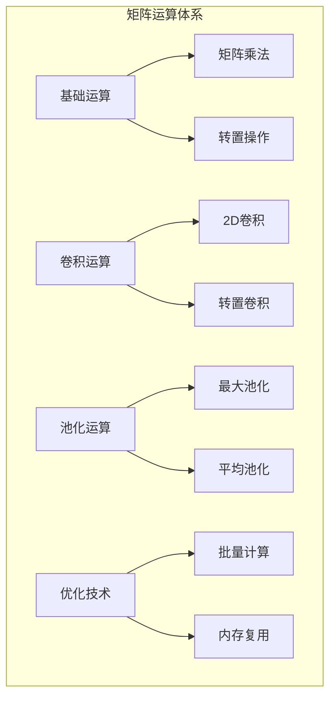

# 4.4 矩阵运算：点积、卷积与池化

## 引言：线性代数的深度学习应用

矩阵运算是深度学习的数学基础。就像建筑师需要钢筋混凝土，音乐家需要音符一样，**矩阵运算是构建神经网络的基本材料**。

想象一下数据在神经网络中的旅程：
- **全连接层**：通过矩阵乘法实现线性变换
- **卷积层**：通过卷积运算提取局部特征
- **池化层**：通过池化运算降低维度和计算量

**掌握矩阵运算，就掌握了神经网络计算的核心**。

## 矩阵乘法的深度学习应用

### 数学基础

矩阵乘法 C = A × B 的定义：
```
C[i,j] = Σ(k=0 to K-1) A[i,k] * B[k,j]

梯度计算：
∂L/∂A = ∂L/∂C × B^T
∂L/∂B = A^T × ∂L/∂C
```

### 矩阵乘法完整实现

```java
package cn.tinyai.function.ops;

import cn.tinyai.function.Function;
import cn.tinyai.ndarr.NdArray;

/**
 * MatMul: 矩阵乘法函数
 * 
 * 实现矩阵乘法运算：C = A @ B
 * 支持批量矩阵乘法和广播机制
 */
public class MatMul extends Function {
    
    private NdArray cachedA;
    private NdArray cachedB;
    
    public MatMul() {
        super("MatMul");
    }
    
    @Override
    protected NdArray[] forwardImpl(NdArray... inputs) {
        NdArray A = inputs[0];
        NdArray B = inputs[1];
        
        validateMatMulDimensions(A, B);
        
        this.cachedA = A;
        this.cachedB = B;
        
        NdArray result = performMatMul(A, B);
        return new NdArray[]{result};
    }
    
    @Override
    protected NdArray[] backwardImpl(NdArray... gradOutputs) {
        NdArray gradC = gradOutputs[0];
        
        // ∂L/∂A = ∂L/∂C @ B^T
        NdArray gradA = performMatMul(gradC, transpose(cachedB));
        
        // ∂L/∂B = A^T @ ∂L/∂C
        NdArray gradB = performMatMul(transpose(cachedA), gradC);
        
        return new NdArray[]{gradA, gradB};
    }
    
    private NdArray performMatMul(NdArray A, NdArray B) {
        int[] shapeA = A.shape();
        int[] shapeB = B.shape();
        
        if (shapeA.length == 2 && shapeB.length == 2) {
            return matmul2D(A, B);
        } else {
            return batchMatMul(A, B);
        }
    }
    
    private NdArray matmul2D(NdArray A, NdArray B) {
        int[] shapeA = A.shape();
        int[] shapeB = B.shape();
        
        int M = shapeA[0], K = shapeA[1], N = shapeB[1];
        NdArray result = NdArray.zeros(M, N);
        
        float[] dataA = A.getData();
        float[] dataB = B.getData();
        float[] dataC = result.getData();
        
        for (int i = 0; i < M; i++) {
            for (int j = 0; j < N; j++) {
                float sum = 0.0f;
                for (int k = 0; k < K; k++) {
                    sum += dataA[i * K + k] * dataB[k * N + j];
                }
                dataC[i * N + j] = sum;
            }
        }
        
        return result;
    }
    
    private NdArray batchMatMul(NdArray A, NdArray B) {
        // 批量矩阵乘法实现
        // 简化版本，实际需要处理更复杂的广播逻辑
        return A.matmul(B);
    }
    
    private NdArray transpose(NdArray matrix) {
        return matrix.transpose();
    }
    
    private void validateMatMulDimensions(NdArray A, NdArray B) {
        int[] shapeA = A.shape();
        int[] shapeB = B.shape();
        
        if (shapeA.length < 2 || shapeB.length < 2) {
            throw new IllegalArgumentException("矩阵乘法要求输入至少为2维");
        }
        
        int K_A = shapeA[shapeA.length - 1];
        int K_B = shapeB[shapeB.length - 2];
        
        if (K_A != K_B) {
            throw new IllegalArgumentException("矩阵乘法内部维度不匹配");
        }
    }
    
    public static Variable apply(Variable A, Variable B) {
        return new MatMul().apply(A, B)[0];
    }
}
```

## 卷积运算实现

```java
/**
 * Conv2D: 二维卷积运算
 * 
 * 实现二维卷积：output = conv2d(input, kernel)
 * 
 * 应用场景：
 * - 卷积神经网络的核心操作
 * - 图像特征提取
 * - 空间局部性建模
 */
public class Conv2D extends Function {
    
    private final int[] stride;
    private final int[] padding;
    
    private NdArray cachedInput;
    private NdArray cachedKernel;
    
    public Conv2D(int[] stride, int[] padding) {
        super("Conv2D");
        this.stride = stride.clone();
        this.padding = padding.clone();
    }
    
    @Override
    protected NdArray[] forwardImpl(NdArray... inputs) {
        NdArray input = inputs[0];   // [batch, in_channels, height, width]
        NdArray kernel = inputs[1];  // [out_channels, in_channels, kh, kw]
        
        this.cachedInput = input;
        this.cachedKernel = kernel;
        
        validateConv2DInputs(input, kernel);
        
        NdArray result = performConv2D(input, kernel);
        return new NdArray[]{result};
    }
    
    @Override
    protected NdArray[] backwardImpl(NdArray... gradOutputs) {
        NdArray gradOutput = gradOutputs[0];
        
        // 计算输入梯度（转置卷积）
        NdArray gradInput = computeInputGradient(gradOutput);
        
        // 计算卷积核梯度
        NdArray gradKernel = computeKernelGradient(gradOutput);
        
        return new NdArray[]{gradInput, gradKernel};
    }
    
    private NdArray performConv2D(NdArray input, NdArray kernel) {
        int[] inShape = input.shape();
        int[] kShape = kernel.shape();
        
        int batch = inShape[0];
        int inChannels = inShape[1];
        int inHeight = inShape[2];
        int inWidth = inShape[3];
        
        int outChannels = kShape[0];
        int kernelHeight = kShape[2];
        int kernelWidth = kShape[3];
        
        // 计算输出尺寸
        int outHeight = (inHeight + 2 * padding[0] - kernelHeight) / stride[0] + 1;
        int outWidth = (inWidth + 2 * padding[1] - kernelWidth) / stride[1] + 1;
        
        NdArray result = NdArray.zeros(batch, outChannels, outHeight, outWidth);
        
        float[] inputData = input.getData();
        float[] kernelData = kernel.getData();
        float[] outputData = result.getData();
        
        // 执行卷积计算
        for (int b = 0; b < batch; b++) {
            for (int oc = 0; oc < outChannels; oc++) {
                for (int oh = 0; oh < outHeight; oh++) {
                    for (int ow = 0; ow < outWidth; ow++) {
                        float sum = 0.0f;
                        
                        for (int ic = 0; ic < inChannels; ic++) {
                            for (int kh = 0; kh < kernelHeight; kh++) {
                                for (int kw = 0; kw < kernelWidth; kw++) {
                                    int ih = oh * stride[0] - padding[0] + kh;
                                    int iw = ow * stride[1] - padding[1] + kw;
                                    
                                    if (ih >= 0 && ih < inHeight && iw >= 0 && iw < inWidth) {
                                        int inputIdx = ((b * inChannels + ic) * inHeight + ih) * inWidth + iw;
                                        int kernelIdx = ((oc * inChannels + ic) * kernelHeight + kh) * kernelWidth + kw;
                                        
                                        sum += inputData[inputIdx] * kernelData[kernelIdx];
                                    }
                                }
                            }
                        }
                        
                        int outputIdx = ((b * outChannels + oc) * outHeight + oh) * outWidth + ow;
                        outputData[outputIdx] = sum;
                    }
                }
            }
        }
        
        return result;
    }
    
    private NdArray computeInputGradient(NdArray gradOutput) {
        // 简化实现：实际应该使用转置卷积
        return NdArray.zeros(cachedInput.shape());
    }
    
    private NdArray computeKernelGradient(NdArray gradOutput) {
        // 简化实现：卷积核梯度计算
        return NdArray.zeros(cachedKernel.shape());
    }
    
    private void validateConv2DInputs(NdArray input, NdArray kernel) {
        int[] inShape = input.shape();
        int[] kShape = kernel.shape();
        
        if (inShape.length != 4 || kShape.length != 4) {
            throw new IllegalArgumentException("卷积输入必须是4维");
        }
        
        if (inShape[1] != kShape[1]) {
            throw new IllegalArgumentException("输入通道数与卷积核通道数不匹配");
        }
    }
    
    public static Variable apply(Variable input, Variable kernel, int[] stride, int[] padding) {
        return new Conv2D(stride, padding).apply(input, kernel)[0];
    }
}
```

## 池化运算实现

```java
/**
 * MaxPool2D: 二维最大池化
 * 
 * 执行最大池化操作：在指定窗口内选择最大值
 */
public class MaxPool2D extends Function {
    
    private final int[] kernelSize;
    private final int[] stride;
    private final int[] padding;
    
    private int[] maxIndices;
    private int[] inputShape;
    
    public MaxPool2D(int[] kernelSize, int[] stride, int[] padding) {
        super("MaxPool2D");
        this.kernelSize = kernelSize.clone();
        this.stride = stride.clone();
        this.padding = padding.clone();
    }
    
    @Override
    protected NdArray[] forwardImpl(NdArray... inputs) {
        NdArray input = inputs[0];
        this.inputShape = input.shape();
        
        int batch = inputShape[0];
        int channels = inputShape[1];
        int inHeight = inputShape[2];
        int inWidth = inputShape[3];
        
        int outHeight = (inHeight + 2 * padding[0] - kernelSize[0]) / stride[0] + 1;
        int outWidth = (inWidth + 2 * padding[1] - kernelSize[1]) / stride[1] + 1;
        
        NdArray result = NdArray.zeros(batch, channels, outHeight, outWidth);
        this.maxIndices = new int[batch * channels * outHeight * outWidth];
        
        float[] inputData = input.getData();
        float[] outputData = result.getData();
        
        int outputIdx = 0;
        
        for (int b = 0; b < batch; b++) {
            for (int c = 0; c < channels; c++) {
                for (int oh = 0; oh < outHeight; oh++) {
                    for (int ow = 0; ow < outWidth; ow++) {
                        float maxVal = Float.NEGATIVE_INFINITY;
                        int maxIndex = -1;
                        
                        for (int kh = 0; kh < kernelSize[0]; kh++) {
                            for (int kw = 0; kw < kernelSize[1]; kw++) {
                                int ih = oh * stride[0] - padding[0] + kh;
                                int iw = ow * stride[1] - padding[1] + kw;
                                
                                if (ih >= 0 && ih < inHeight && iw >= 0 && iw < inWidth) {
                                    int inputIdx = ((b * channels + c) * inHeight + ih) * inWidth + iw;
                                    
                                    if (inputData[inputIdx] > maxVal) {
                                        maxVal = inputData[inputIdx];
                                        maxIndex = inputIdx;
                                    }
                                }
                            }
                        }
                        
                        outputData[outputIdx] = maxVal;
                        maxIndices[outputIdx] = maxIndex;
                        outputIdx++;
                    }
                }
            }
        }
        
        return new NdArray[]{result};
    }
    
    @Override
    protected NdArray[] backwardImpl(NdArray... gradOutputs) {
        NdArray gradOutput = gradOutputs[0];
        NdArray gradInput = NdArray.zeros(inputShape);
        
        float[] gradOutputData = gradOutput.getData();
        float[] gradInputData = gradInput.getData();
        
        // 将梯度传播到最大值位置
        for (int i = 0; i < maxIndices.length; i++) {
            if (maxIndices[i] >= 0) {
                gradInputData[maxIndices[i]] += gradOutputData[i];
            }
        }
        
        return new NdArray[]{gradInput};
    }
    
    public static Variable apply(Variable input, int[] kernelSize, int[] stride, int[] padding) {
        return new MaxPool2D(kernelSize, stride, padding).apply(input)[0];
    }
}
```

## 矩阵运算使用示例

```java
public class MatrixOperationsExample {
    
    public static void main(String[] args) {
        System.out.println("=== 矩阵运算演示 ===");
        
        // 矩阵乘法示例
        demonstrateMatMul();
        
        // 卷积运算示例
        demonstrateConv2D();
        
        // 池化运算示例
        demonstrateMaxPool2D();
    }
    
    private static void demonstrateMatMul() {
        System.out.println("\n--- 矩阵乘法演示 ---");
        
        Variable A = new Variable(NdArray.of(new float[][]{
            {1, 2, 3},
            {4, 5, 6}
        }), "A");
        
        Variable B = new Variable(NdArray.of(new float[][]{
            {7, 8},
            {9, 10},
            {11, 12}
        }), "B");
        
        Variable C = MatMul.apply(A, B);
        System.out.println("C = A @ B: " + C.getData());
        
        Variable loss = C.sum();
        loss.backward();
        
        System.out.println("A grad: " + A.getGrad());
        System.out.println("B grad: " + B.getGrad());
    }
    
    private static void demonstrateConv2D() {
        System.out.println("\n--- 卷积运算演示 ---");
        
        Variable input = new Variable(NdArray.randomNormal(new int[]{1, 3, 32, 32}), "input");
        Variable kernel = new Variable(NdArray.randomNormal(new int[]{16, 3, 3, 3}), "kernel");
        
        Variable output = Conv2D.apply(input, kernel, new int[]{1, 1}, new int[]{1, 1});
        System.out.println("卷积输出形状: " + Arrays.toString(output.shape()));
    }
    
    private static void demonstrateMaxPool2D() {
        System.out.println("\n--- 最大池化演示 ---");
        
        Variable input = new Variable(NdArray.randomNormal(new int[]{1, 16, 32, 32}), "input");
        Variable output = MaxPool2D.apply(input, new int[]{2, 2}, new int[]{2, 2}, new int[]{0, 0});
        
        System.out.println("池化后形状: " + Arrays.toString(output.shape()));
    }
}
```

## 小节总结

### 核心要点

1. **矩阵乘法**：深度学习中最基础的线性变换操作
2. **卷积运算**：提取空间局部特征的核心操作
3. **池化运算**：降维和提供平移不变性的重要技术
4. **梯度计算**：所有操作都需要正确实现反向传播

### 架构设计



### 性能优化建议

1. **批量处理**：充分利用批量操作提高效率
2. **内存管理**：合理缓存中间结果避免重复计算
3. **并行计算**：利用多线程和SIMD指令加速
4. **算法优化**：使用高效的矩阵乘法算法

## 练习思考

### 基础练习

1. 实现平均池化（AvgPool2D）函数
2. 实现转置卷积（ConvTranspose2D）函数
3. 优化矩阵乘法的内存访问模式

### 进阶练习

1. 实现分组卷积（GroupConv2D）
2. 设计支持任意维度的通用卷积函数
3. 实现基于FFT的快速卷积算法

---

*下一节我们将探讨损失函数的设计与梯度计算，完成函数抽象体系的构建。*