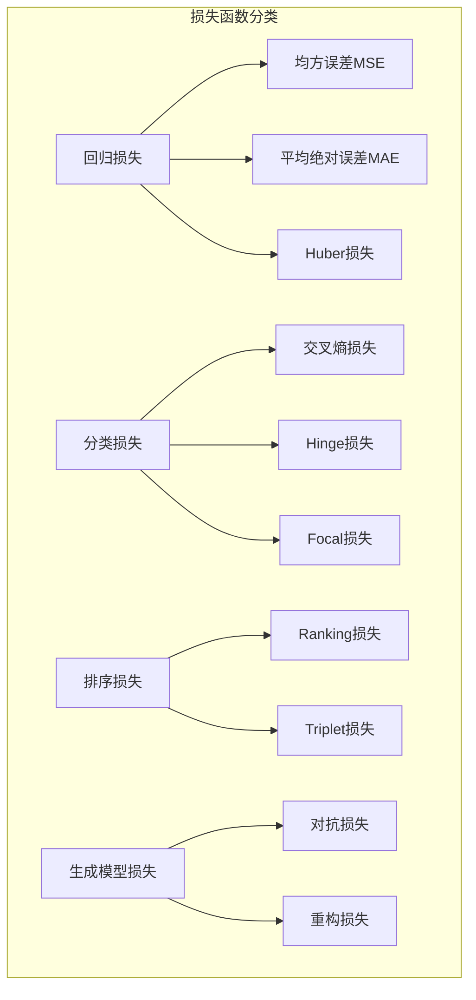
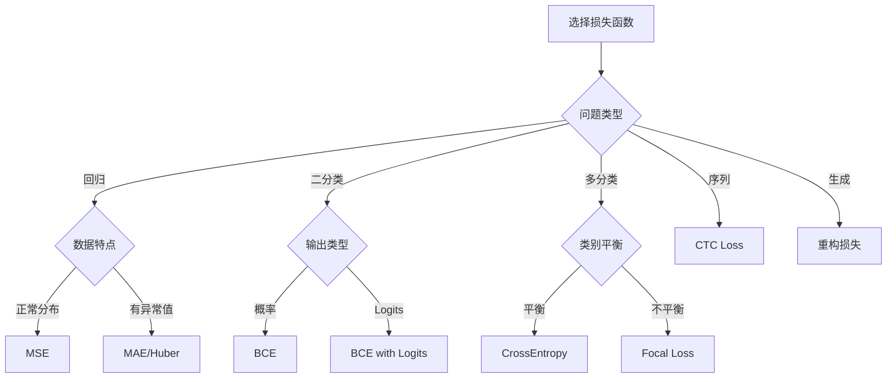

# 4.5 损失函数设计与梯度计算

## 引言：学习的指南针

损失函数就像是机器学习的"指南针"，它告诉模型当前的表现离目标有多远，应该朝哪个方向调整。想象一下：

- **登山者**：需要指南针找到正确的方向
- **模型训练**：需要损失函数指导参数更新
- **优化过程**：通过最小化损失函数达到最优解

**损失函数是连接问题定义和算法优化的关键桥梁**。

## 损失函数的数学基础

### 损失函数的基本要求

一个好的损失函数通常需要满足：

```
1. 非负性：L(y, ŷ) ≥ 0
2. 同一性：L(y, y) = 0
3. 可微性：几乎处处可微
4. 单调性：预测越准确，损失越小
5. 收敛性：有利于优化算法收敛
```

### 常见损失函数分类



## 回归损失函数

### 均方误差损失（MSE）

```java
package cn.tinyai.function.loss;

import cn.tinyai.function.Function;
import cn.tinyai.ndarr.NdArray;

/**
 * MSELoss: 均方误差损失函数
 * 
 * 数学定义：MSE = (1/n) × Σ(yᵢ - ŷᵢ)²
 * 
 * 特点：
 * - 对异常值敏感
 * - 梯度随误差线性增长
 * - 适用于回归问题
 * - 计算简单高效
 */
public class MSELoss extends Function {
    
    private final String reduction;  // "mean", "sum", "none"
    
    // 缓存用于反向传播
    private NdArray cachedPrediction;
    private NdArray cachedTarget;
    private int numElements;
    
    public MSELoss(String reduction) {
        super("MSELoss");
        this.reduction = reduction;
    }
    
    public MSELoss() {
        this("mean");  // 默认使用均值
    }
    
    @Override
    protected NdArray[] forwardImpl(NdArray... inputs) {
        if (inputs.length != 2) {
            throw new IllegalArgumentException("MSELoss需要2个输入：prediction和target");
        }
        
        NdArray prediction = inputs[0];
        NdArray target = inputs[1];
        
        // 验证形状匹配
        if (!java.util.Arrays.equals(prediction.shape(), target.shape())) {
            throw new IllegalArgumentException("预测值和目标值形状不匹配");
        }
        
        // 缓存输入
        this.cachedPrediction = prediction;
        this.cachedTarget = target;
        this.numElements = prediction.size();
        
        // 计算 (y - ŷ)²
        NdArray diff = prediction.sub(target);
        NdArray squaredDiff = diff.mul(diff);
        
        // 根据reduction方式处理
        NdArray loss;
        switch (reduction) {
            case "mean":
                loss = NdArray.scalar(squaredDiff.sum().getData()[0] / numElements);
                break;
            case "sum":
                loss = NdArray.scalar(squaredDiff.sum().getData()[0]);
                break;
            case "none":
                loss = squaredDiff;
                break;
            default:
                throw new IllegalArgumentException("不支持的reduction方式: " + reduction);
        }
        
        return new NdArray[]{loss};
    }
    
    @Override
    protected NdArray[] backwardImpl(NdArray... gradOutputs) {
        NdArray gradOutput = gradOutputs[0];
        
        // MSE对预测值的梯度：∂L/∂ŷ = 2(ŷ - y) / n
        NdArray diff = cachedPrediction.sub(cachedTarget);
        NdArray gradPrediction = diff.mul(2.0f);
        
        // 根据reduction方式调整梯度
        if ("mean".equals(reduction)) {
            gradPrediction = gradPrediction.div((float) numElements);
        }
        
        // 应用外部梯度
        if (gradOutput.size() == 1) {
            // 标量损失的情况
            float gradScale = gradOutput.getData()[0];
            gradPrediction = gradPrediction.mul(gradScale);
        } else {
            // 向量损失的情况
            gradPrediction = gradPrediction.mul(gradOutput);
        }
        
        // 目标值不需要梯度
        NdArray gradTarget = null;
        
        return new NdArray[]{gradPrediction, gradTarget};
    }
    
    public static Variable apply(Variable prediction, Variable target, String reduction) {
        return new MSELoss(reduction).apply(prediction, target)[0];
    }
    
    public static Variable apply(Variable prediction, Variable target) {
        return new MSELoss().apply(prediction, target)[0];
    }
}
```

### 平均绝对误差损失（MAE）

```java
/**
 * MAELoss: 平均绝对误差损失函数
 * 
 * 数学定义：MAE = (1/n) × Σ|yᵢ - ŷᵢ|
 * 
 * 特点：
 * - 对异常值不敏感
 * - 梯度为常数（符号函数）
 * - 在零点不可微
 * - 更鲁棒的回归损失
 */
public class MAELoss extends Function {
    
    private final String reduction;
    private NdArray cachedPrediction;
    private NdArray cachedTarget;
    private int numElements;
    
    public MAELoss(String reduction) {
        super("MAELoss");
        this.reduction = reduction;
    }
    
    public MAELoss() {
        this("mean");
    }
    
    @Override
    protected NdArray[] forwardImpl(NdArray... inputs) {
        NdArray prediction = inputs[0];
        NdArray target = inputs[1];
        
        this.cachedPrediction = prediction;
        this.cachedTarget = target;
        this.numElements = prediction.size();
        
        // 计算 |y - ŷ|
        NdArray diff = prediction.sub(target);
        NdArray absDiff = diff.abs();
        
        NdArray loss;
        switch (reduction) {
            case "mean":
                loss = NdArray.scalar(absDiff.sum().getData()[0] / numElements);
                break;
            case "sum":
                loss = NdArray.scalar(absDiff.sum().getData()[0]);
                break;
            case "none":
                loss = absDiff;
                break;
            default:
                throw new IllegalArgumentException("不支持的reduction方式: " + reduction);
        }
        
        return new NdArray[]{loss};
    }
    
    @Override
    protected NdArray[] backwardImpl(NdArray... gradOutputs) {
        NdArray gradOutput = gradOutputs[0];
        
        // MAE对预测值的梯度：∂L/∂ŷ = sign(ŷ - y)
        NdArray diff = cachedPrediction.sub(cachedTarget);
        NdArray gradPrediction = diff.sign();
        
        if ("mean".equals(reduction)) {
            gradPrediction = gradPrediction.div((float) numElements);
        }
        
        // 应用外部梯度
        if (gradOutput.size() == 1) {
            float gradScale = gradOutput.getData()[0];
            gradPrediction = gradPrediction.mul(gradScale);
        } else {
            gradPrediction = gradPrediction.mul(gradOutput);
        }
        
        return new NdArray[]{gradPrediction, null};
    }
    
    public static Variable apply(Variable prediction, Variable target, String reduction) {
        return new MAELoss(reduction).apply(prediction, target)[0];
    }
    
    public static Variable apply(Variable prediction, Variable target) {
        return new MAELoss().apply(prediction, target)[0];
    }
}
```

## 分类损失函数

### 交叉熵损失

```java
/**
 * CrossEntropyLoss: 交叉熵损失函数
 * 
 * 数学定义：CE = -Σ yᵢ log(ŷᵢ)
 * 对于多分类：CE = -log(ŷ_correct_class)
 * 
 * 特点：
 * - 适用于分类问题
 * - 结合Softmax使用
 * - 梯度友好
 * - 概率解释清晰
 */
public class CrossEntropyLoss extends Function {
    
    private final String reduction;
    private final boolean fromLogits;  // 输入是否为logits
    
    private NdArray cachedPrediction;
    private NdArray cachedTarget;
    private NdArray cachedSoftmax;  // 缓存softmax结果
    
    public CrossEntropyLoss(String reduction, boolean fromLogits) {
        super("CrossEntropyLoss");
        this.reduction = reduction;
        this.fromLogits = fromLogits;
    }
    
    public CrossEntropyLoss() {
        this("mean", true);
    }
    
    @Override
    protected NdArray[] forwardImpl(NdArray... inputs) {
        NdArray prediction = inputs[0];  // [batch_size, num_classes] 或 logits
        NdArray target = inputs[1];      // [batch_size] 类别索引
        
        this.cachedPrediction = prediction;
        this.cachedTarget = target;
        
        // 如果输入是logits，先应用softmax
        NdArray probs;
        if (fromLogits) {
            probs = softmax(prediction);
            this.cachedSoftmax = probs;
        } else {
            probs = prediction;
            this.cachedSoftmax = null;
        }
        
        // 计算交叉熵损失
        NdArray loss = computeCrossEntropy(probs, target);
        
        return new NdArray[]{loss};
    }
    
    @Override
    protected NdArray[] backwardImpl(NdArray... gradOutputs) {
        NdArray gradOutput = gradOutputs[0];
        
        if (fromLogits && cachedSoftmax != null) {
            // 对于softmax + cross entropy的组合，梯度有简化形式
            // ∂L/∂logits = (softmax - one_hot_target) / batch_size
            NdArray gradPrediction = computeLogitsGradient();
            
            // 应用外部梯度
            if (gradOutput.size() == 1) {
                float gradScale = gradOutput.getData()[0];
                gradPrediction = gradPrediction.mul(gradScale);
            }
            
            return new NdArray[]{gradPrediction, null};
        } else {
            // 一般情况的梯度计算
            return computeGeneralGradient(gradOutput);
        }
    }
    
    /**
     * Softmax函数实现
     */
    private NdArray softmax(NdArray logits) {
        int[] shape = logits.shape();
        int batchSize = shape[0];
        int numClasses = shape[1];
        
        NdArray result = NdArray.zeros(shape);
        float[] logitsData = logits.getData();
        float[] resultData = result.getData();
        
        for (int i = 0; i < batchSize; i++) {
            // 找到每个样本的最大值（数值稳定性）
            float maxVal = Float.NEGATIVE_INFINITY;
            for (int j = 0; j < numClasses; j++) {
                maxVal = Math.max(maxVal, logitsData[i * numClasses + j]);
            }
            
            // 计算指数和
            float sumExp = 0.0f;
            for (int j = 0; j < numClasses; j++) {
                float exp = (float) Math.exp(logitsData[i * numClasses + j] - maxVal);
                resultData[i * numClasses + j] = exp;
                sumExp += exp;
            }
            
            // 归一化
            for (int j = 0; j < numClasses; j++) {
                resultData[i * numClasses + j] /= sumExp;
            }
        }
        
        return result;
    }
    
    /**
     * 计算交叉熵损失
     */
    private NdArray computeCrossEntropy(NdArray probs, NdArray target) {
        int[] probsShape = probs.shape();
        int batchSize = probsShape[0];
        int numClasses = probsShape[1];
        
        float[] probsData = probs.getData();
        float[] targetData = target.getData();
        
        float totalLoss = 0.0f;
        
        for (int i = 0; i < batchSize; i++) {
            int targetClass = (int) targetData[i];
            
            if (targetClass < 0 || targetClass >= numClasses) {
                throw new IllegalArgumentException("目标类别索引越界: " + targetClass);
            }
            
            float prob = probsData[i * numClasses + targetClass];
            
            // 添加小的epsilon防止log(0)
            prob = Math.max(prob, 1e-12f);
            
            totalLoss -= (float) Math.log(prob);
        }
        
        // 根据reduction方式处理
        switch (reduction) {
            case "mean":
                return NdArray.scalar(totalLoss / batchSize);
            case "sum":
                return NdArray.scalar(totalLoss);
            case "none":
                // 为简化，返回平均损失
                return NdArray.scalar(totalLoss / batchSize);
            default:
                throw new IllegalArgumentException("不支持的reduction方式: " + reduction);
        }
    }
    
    /**
     * 计算logits的梯度（softmax + cross entropy的简化形式）
     */
    private NdArray computeLogitsGradient() {
        int[] shape = cachedSoftmax.shape();
        int batchSize = shape[0];
        int numClasses = shape[1];
        
        NdArray gradLogits = cachedSoftmax.copy();
        float[] gradData = gradLogits.getData();
        float[] targetData = cachedTarget.getData();
        
        // 对于正确类别，梯度为 (prob - 1)，其他类别梯度为 prob
        for (int i = 0; i < batchSize; i++) {
            int targetClass = (int) targetData[i];
            gradData[i * numClasses + targetClass] -= 1.0f;
        }
        
        // 根据reduction方式调整
        if ("mean".equals(reduction)) {
            gradLogits = gradLogits.div((float) batchSize);
        }
        
        return gradLogits;
    }
    
    /**
     * 一般情况的梯度计算
     */
    private NdArray[] computeGeneralGradient(NdArray gradOutput) {
        // 简化实现
        NdArray gradPrediction = NdArray.zeros(cachedPrediction.shape());
        return new NdArray[]{gradPrediction, null};
    }
    
    public static Variable apply(Variable prediction, Variable target, String reduction, boolean fromLogits) {
        return new CrossEntropyLoss(reduction, fromLogits).apply(prediction, target)[0];
    }
    
    public static Variable apply(Variable prediction, Variable target) {
        return new CrossEntropyLoss().apply(prediction, target)[0];
    }
}
```

### 二元交叉熵损失

```java
/**
 * BCELoss: 二元交叉熵损失函数
 * 
 * 数学定义：BCE = -[y*log(ŷ) + (1-y)*log(1-ŷ)]
 * 
 * 特点：
 * - 适用于二分类问题
 * - 输出需要在(0,1)范围内
 * - 通常与Sigmoid配合使用
 */
public class BCELoss extends Function {
    
    private final String reduction;
    private final boolean withLogits;
    
    private NdArray cachedPrediction;
    private NdArray cachedTarget;
    private NdArray cachedSigmoid;
    
    public BCELoss(String reduction, boolean withLogits) {
        super("BCELoss");
        this.reduction = reduction;
        this.withLogits = withLogits;
    }
    
    public BCELoss() {
        this("mean", false);
    }
    
    @Override
    protected NdArray[] forwardImpl(NdArray... inputs) {
        NdArray prediction = inputs[0];
        NdArray target = inputs[1];
        
        this.cachedPrediction = prediction;
        this.cachedTarget = target;
        
        // 如果输入是logits，先应用sigmoid
        NdArray probs;
        if (withLogits) {
            probs = sigmoid(prediction);
            this.cachedSigmoid = probs;
        } else {
            probs = prediction;
        }
        
        // 计算BCE损失
        NdArray loss = computeBCE(probs, target);
        
        return new NdArray[]{loss};
    }
    
    @Override
    protected NdArray[] backwardImpl(NdArray... gradOutputs) {
        NdArray gradOutput = gradOutputs[0];
        
        if (withLogits && cachedSigmoid != null) {
            // sigmoid + BCE的简化梯度：σ(x) - y
            NdArray gradPrediction = cachedSigmoid.sub(cachedTarget);
            
            if ("mean".equals(reduction)) {
                gradPrediction = gradPrediction.div((float) cachedTarget.size());
            }
            
            // 应用外部梯度
            if (gradOutput.size() == 1) {
                float gradScale = gradOutput.getData()[0];
                gradPrediction = gradPrediction.mul(gradScale);
            }
            
            return new NdArray[]{gradPrediction, null};
        } else {
            // 一般情况的梯度计算
            return computeGeneralBCEGradient(gradOutput);
        }
    }
    
    private NdArray sigmoid(NdArray x) {
        NdArray result = x.copy();
        float[] data = result.getData();
        
        for (int i = 0; i < data.length; i++) {
            float val = data[i];
            if (val >= 0) {
                float exp_neg_x = (float) Math.exp(-val);
                data[i] = 1.0f / (1.0f + exp_neg_x);
            } else {
                float exp_x = (float) Math.exp(val);
                data[i] = exp_x / (1.0f + exp_x);
            }
        }
        
        return result;
    }
    
    private NdArray computeBCE(NdArray probs, NdArray target) {
        float[] probsData = probs.getData();
        float[] targetData = target.getData();
        
        float totalLoss = 0.0f;
        
        for (int i = 0; i < probsData.length; i++) {
            float p = Math.max(Math.min(probsData[i], 1 - 1e-12f), 1e-12f);  // 数值稳定性
            float y = targetData[i];
            
            totalLoss -= y * Math.log(p) + (1 - y) * Math.log(1 - p);
        }
        
        switch (reduction) {
            case "mean":
                return NdArray.scalar(totalLoss / probsData.length);
            case "sum":
                return NdArray.scalar(totalLoss);
            case "none":
                // 简化实现
                return NdArray.scalar(totalLoss / probsData.length);
            default:
                throw new IllegalArgumentException("不支持的reduction方式: " + reduction);
        }
    }
    
    private NdArray[] computeGeneralBCEGradient(NdArray gradOutput) {
        // 简化实现
        return new NdArray[]{NdArray.zeros(cachedPrediction.shape()), null};
    }
    
    public static Variable apply(Variable prediction, Variable target, String reduction, boolean withLogits) {
        return new BCELoss(reduction, withLogits).apply(prediction, target)[0];
    }
    
    public static Variable apply(Variable prediction, Variable target) {
        return new BCELoss().apply(prediction, target)[0];
    }
}
```

## 损失函数使用示例

```java
public class LossFunctionsExample {
    
    public static void main(String[] args) {
        System.out.println("=== 损失函数演示 ===");
        
        // 回归损失示例
        demonstrateRegressionLoss();
        
        // 分类损失示例
        demonstrateClassificationLoss();
        
        // 二分类损失示例
        demonstrateBinaryClassificationLoss();
    }
    
    private static void demonstrateRegressionLoss() {
        System.out.println("\n--- 回归损失演示 ---");
        
        // 创建预测值和目标值
        Variable prediction = new Variable(NdArray.of(new float[]{2.5f, 1.8f, 3.2f, 0.9f}), "prediction");
        Variable target = new Variable(NdArray.of(new float[]{3.0f, 2.0f, 3.0f, 1.0f}), "target");
        
        System.out.println("预测值: " + prediction.getData());
        System.out.println("目标值: " + target.getData());
        
        // MSE损失
        Variable mseLoss = MSELoss.apply(prediction, target);
        System.out.println("MSE损失: " + mseLoss.getData());
        
        // MAE损失
        Variable maeLoss = MAELoss.apply(prediction, target);
        System.out.println("MAE损失: " + maeLoss.getData());
        
        // 反向传播
        mseLoss.backward();
        System.out.println("MSE梯度: " + prediction.getGrad());
    }
    
    private static void demonstrateClassificationLoss() {
        System.out.println("\n--- 多分类损失演示 ---");
        
        // 创建logits和目标类别
        Variable logits = new Variable(NdArray.of(new float[][]{
            {2.0f, 1.0f, 0.1f},  // 预测类别0
            {0.5f, 2.5f, 0.2f},  // 预测类别1  
            {0.1f, 0.2f, 3.0f}   // 预测类别2
        }), "logits");
        
        Variable target = new Variable(NdArray.of(new float[]{0, 1, 2}), "target");
        
        System.out.println("Logits形状: " + java.util.Arrays.toString(logits.shape()));
        System.out.println("目标类别: " + target.getData());
        
        // 交叉熵损失
        Variable ceLoss = CrossEntropyLoss.apply(logits, target);
        System.out.println("交叉熵损失: " + ceLoss.getData());
        
        // 反向传播
        ceLoss.backward();
        System.out.println("Logits梯度形状: " + java.util.Arrays.toString(logits.getGrad().shape()));
    }
    
    private static void demonstrateBinaryClassificationLoss() {
        System.out.println("\n--- 二分类损失演示 ---");
        
        // 创建logits和二分类目标
        Variable logits = new Variable(NdArray.of(new float[]{1.5f, -0.8f, 2.1f, -1.2f}), "logits");
        Variable target = new Variable(NdArray.of(new float[]{1.0f, 0.0f, 1.0f, 0.0f}), "target");
        
        System.out.println("Logits: " + logits.getData());
        System.out.println("目标: " + target.getData());
        
        // BCE损失（带logits）
        Variable bceLoss = BCELoss.apply(logits, target, "mean", true);
        System.out.println("BCE损失: " + bceLoss.getData());
        
        // 反向传播
        bceLoss.backward();
        System.out.println("Logits梯度: " + logits.getGrad());
    }
}
```

## 损失函数选择指南

### 选择决策树



### 应用建议

1. **回归任务**：
   - 正常情况：MSE
   - 有异常值：MAE或Huber损失
   - 需要概率预测：负对数似然

2. **分类任务**：
   - 二分类：BCE或BCE with Logits
   - 多分类：CrossEntropy
   - 类别不平衡：Focal Loss或加权损失

3. **特殊任务**：
   - 排序：Ranking Loss
   - 相似性学习：Triplet Loss
   - 生成模型：重构损失 + 正则化

## 小节总结

### 核心要点

1. **数学原理**：每个损失函数都有明确的数学定义和梯度公式
2. **适用场景**：不同损失函数适用于不同类型的问题
3. **数值稳定性**：实现时需要考虑数值稳定性问题
4. **梯度特性**：了解损失函数的梯度特性对训练很重要

### 实现架构

```mermaid
graph TB
    subgraph "损失函数架构"
        A[基础设计] --> A1[Function继承]
        A --> A2[缓存机制]
        A --> A3[Reduction支持]
        
        B[数值稳定性] --> B1[防止log(0)]
        B --> B2[防止除零]
        B --> B3[梯度裁剪]
        
        C[性能优化] --> C1[向量化计算]
        C --> C2[内存复用]
        C --> C3[批量处理]
    end
```

## 练习思考

### 基础练习

1. 实现Huber损失函数
2. 实现Focal损失处理类别不平衡
3. 添加标签平滑到CrossEntropy损失

### 进阶练习

1. 实现Triplet损失用于相似性学习
2. 设计自适应权重的损失函数
3. 实现支持软标签的损失函数

---

*至此，第4章函数抽象与数学运算的内容已全部完成。我们已经构建了完整的深度学习计算基础设施。*