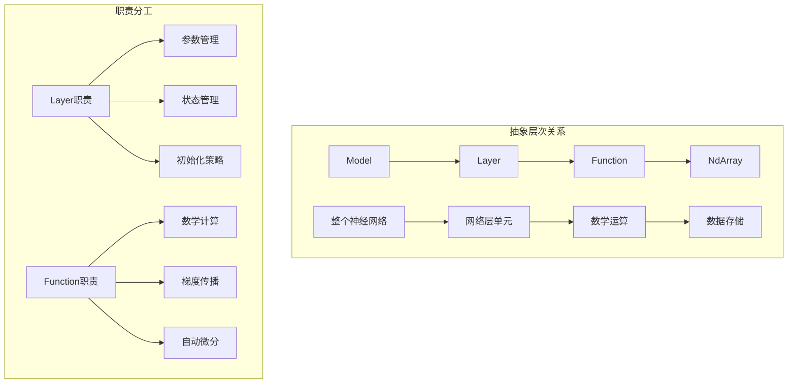
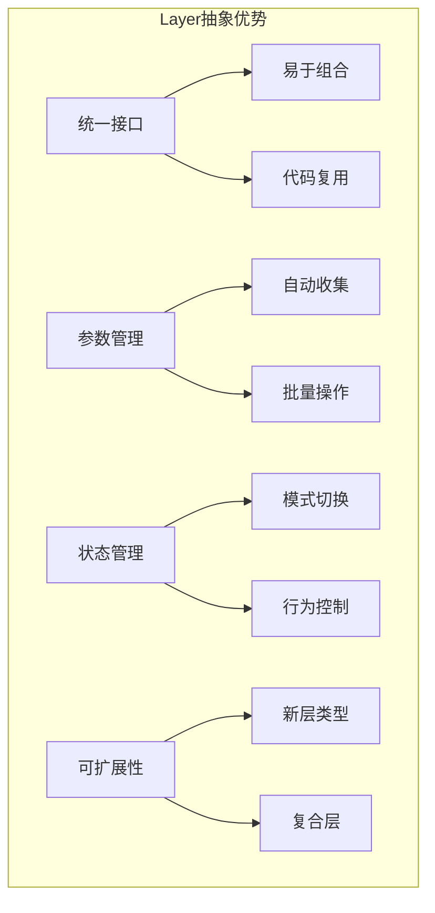

# 5.1 Layer抽象：神经网络的基本单元

## 引言：搭建神经网络的积木

如果说Function是数学运算的原子，那么**Layer就是神经网络的分子**。想象一下：

- **乐高积木**：每个Layer都是一个标准化的积木块
- **组装规则**：通过统一的接口可以任意组合
- **复杂结构**：简单的Layer可以构建复杂的神经网络
- **可重用性**：同样的Layer可以在不同地方重复使用

**Layer抽象让神经网络的构建变成了"搭积木"的艺术**。

## Layer抽象的设计哲学

### 核心设计原则

```java
/**
 * Layer抽象的设计哲学：
 * 
 * 1. 统一接口：所有神经网络层都遵循相同的接口
 * 2. 参数管理：自动管理可训练参数
 * 3. 状态管理：支持训练和推理模式切换
 * 4. 组合性：层可以任意组合构建复杂网络
 * 5. 可扩展性：通过继承轻松添加新的层类型
 */
```

### Layer与Function的关系



## Layer抽象基类设计

```java
package cn.tinyai.nnet;

import cn.tinyai.function.Variable;
import java.util.*;
import java.util.concurrent.atomic.AtomicLong;

/**
 * Layer: 神经网络层的抽象基类
 * 
 * 这是构建神经网络的基本单元，提供了：
 * - 统一的前向传播接口
 * - 自动的参数管理
 * - 训练/推理模式切换
 * - 层的组合和嵌套支持
 * 
 * @author TinyAI团队
 */
public abstract class Layer {
    
    // 全局层计数器
    private static final AtomicLong GLOBAL_LAYER_COUNT = new AtomicLong(0);
    
    // 层的基本信息
    protected final long layerId;
    protected String layerName;
    protected boolean isTraining = true;  // 默认为训练模式
    
    // 参数管理
    protected final Map<String, Variable> parameters = new LinkedHashMap<>();
    protected final Map<String, Variable> buffers = new LinkedHashMap<>();
    
    // 子层管理（用于复合层）
    protected final Map<String, Layer> subLayers = new LinkedHashMap<>();
    
    // 层的统计信息
    protected final LayerStats stats = new LayerStats();
    
    /**
     * 构造函数
     */
    protected Layer() {
        this.layerId = GLOBAL_LAYER_COUNT.incrementAndGet();
        this.layerName = this.getClass().getSimpleName() + "_" + layerId;
    }
    
    protected Layer(String name) {
        this();
        this.layerName = name;
    }
    
    // ==================== 核心抽象方法 ====================
    
    /**
     * 前向传播 - 子类必须实现
     * 
     * @param inputs 输入变量数组
     * @return 输出变量数组
     */
    public abstract Variable[] forward(Variable... inputs);
    
    /**
     * 构建层 - 在第一次调用forward时被调用
     * 子类可以重写此方法来创建参数
     * 
     * @param inputShapes 输入形状数组
     */
    protected void build(int[]... inputShapes) {
        // 默认不做任何操作
    }
    
    // ==================== 参数管理 ====================
    
    /**
     * 添加可训练参数
     */
    protected void addParameter(String name, Variable parameter) {
        if (parameters.containsKey(name)) {
            throw new IllegalArgumentException("参数 " + name + " 已存在");
        }
        
        if (!parameter.requiresGrad()) {
            throw new IllegalArgumentException("参数必须需要梯度");
        }
        
        parameters.put(name, parameter);
    }
    
    /**
     * 添加不可训练的缓冲区（如BatchNorm的running_mean）
     */
    protected void addBuffer(String name, Variable buffer) {
        if (buffers.containsKey(name)) {
            throw new IllegalArgumentException("缓冲区 " + name + " 已存在");
        }
        
        buffers.put(name, buffer);
    }
    
    /**
     * 获取指定参数
     */
    public Variable getParameter(String name) {
        Variable param = parameters.get(name);
        if (param == null) {
            throw new IllegalArgumentException("参数 " + name + " 不存在");
        }
        return param;
    }
    
    /**
     * 获取指定缓冲区
     */
    public Variable getBuffer(String name) {
        Variable buffer = buffers.get(name);
        if (buffer == null) {
            throw new IllegalArgumentException("缓冲区 " + name + " 不存在");
        }
        return buffer;
    }
    
    /**
     * 获取所有参数
     */
    public Collection<Variable> getParameters() {
        List<Variable> allParams = new ArrayList<>(parameters.values());
        
        // 递归收集子层的参数
        for (Layer subLayer : subLayers.values()) {
            allParams.addAll(subLayer.getParameters());
        }
        
        return allParams;
    }
    
    /**
     * 获取所有缓冲区
     */
    public Collection<Variable> getBuffers() {
        List<Variable> allBuffers = new ArrayList<>(buffers.values());
        
        // 递归收集子层的缓冲区
        for (Layer subLayer : subLayers.values()) {
            allBuffers.addAll(subLayer.getBuffers());
        }
        
        return allBuffers;
    }
    
    /**
     * 获取参数数量
     */
    public int getParameterCount() {
        int count = 0;
        for (Variable param : getParameters()) {
            count += param.size();
        }
        return count;
    }
    
    // ==================== 子层管理 ====================
    
    /**
     * 添加子层
     */
    protected void addSubLayer(String name, Layer layer) {
        if (subLayers.containsKey(name)) {
            throw new IllegalArgumentException("子层 " + name + " 已存在");
        }
        
        subLayers.put(name, layer);
    }
    
    /**
     * 获取子层
     */
    public Layer getSubLayer(String name) {
        Layer layer = subLayers.get(name);
        if (layer == null) {
            throw new IllegalArgumentException("子层 " + name + " 不存在");
        }
        return layer;
    }
    
    /**
     * 获取所有子层
     */
    public Collection<Layer> getSubLayers() {
        return new ArrayList<>(subLayers.values());
    }
    
    // ==================== 模式管理 ====================
    
    /**
     * 设置为训练模式
     */
    public Layer train() {
        return train(true);
    }
    
    /**
     * 设置训练模式
     */
    public Layer train(boolean training) {
        this.isTraining = training;
        
        // 递归设置子层的模式
        for (Layer subLayer : subLayers.values()) {
            subLayer.train(training);
        }
        
        return this;
    }
    
    /**
     * 设置为推理模式
     */
    public Layer eval() {
        return train(false);
    }
    
    /**
     * 检查是否为训练模式
     */
    public boolean isTraining() {
        return isTraining;
    }
    
    // ==================== 参数初始化 ====================
    
    /**
     * 初始化层的参数
     */
    public void initializeParameters() {
        initializeParameters(new XavierInitializer());
    }
    
    /**
     * 使用指定初始化器初始化参数
     */
    public void initializeParameters(ParameterInitializer initializer) {
        for (Map.Entry<String, Variable> entry : parameters.entrySet()) {
            String name = entry.getKey();
            Variable param = entry.getValue();
            
            initializer.initialize(name, param);
        }
        
        // 递归初始化子层
        for (Layer subLayer : subLayers.values()) {
            subLayer.initializeParameters(initializer);
        }
    }
    
    // ==================== 梯度管理 ====================
    
    /**
     * 清零所有参数的梯度
     */
    public void zeroGrad() {
        for (Variable param : getParameters()) {
            if (param.requiresGrad()) {
                param.clearGrad();
            }
        }
    }
    
    /**
     * 获取梯度范数
     */
    public float getGradNorm() {
        float totalNorm = 0.0f;
        
        for (Variable param : getParameters()) {
            if (param.requiresGrad() && param.getGrad() != null) {
                float[] gradData = param.getGrad().getData();
                for (float g : gradData) {
                    totalNorm += g * g;
                }
            }
        }
        
        return (float) Math.sqrt(totalNorm);
    }
    
    /**
     * 梯度裁剪
     */
    public void clipGradients(float maxNorm) {
        float gradNorm = getGradNorm();
        
        if (gradNorm > maxNorm) {
            float scale = maxNorm / gradNorm;
            
            for (Variable param : getParameters()) {
                if (param.requiresGrad() && param.getGrad() != null) {
                    param.getGrad().mulInPlace(scale);
                }
            }
        }
    }
    
    // ==================== 层信息 ====================
    
    /**
     * 获取层的描述信息
     */
    public LayerInfo getLayerInfo() {
        return new LayerInfo(
            layerName,
            this.getClass().getSimpleName(),
            getParameterCount(),
            parameters.size(),
            subLayers.size(),
            isTraining
        );
    }
    
    /**
     * 打印层的结构信息
     */
    public void printStructure() {
        printStructure(0);
    }
    
    private void printStructure(int indent) {
        String indentStr = "  ".repeat(indent);
        LayerInfo info = getLayerInfo();
        
        System.out.println(indentStr + info.getName() + " (" + info.getType() + ")");
        System.out.println(indentStr + "  参数: " + info.getParameterCount() + 
                          ", 子层: " + info.getSubLayerCount());
        
        // 递归打印子层
        for (Layer subLayer : subLayers.values()) {
            subLayer.printStructure(indent + 1);
        }
    }
    
    // ==================== 工具方法 ====================
    
    public long getLayerId() { return layerId; }
    public String getLayerName() { return layerName; }
    public void setLayerName(String name) { this.layerName = name; }
    public LayerStats getStats() { return stats; }
    
    @Override
    public String toString() {
        return layerName + "(" + this.getClass().getSimpleName() + ")";
    }
    
    @Override
    public boolean equals(Object obj) {
        if (this == obj) return true;
        if (obj == null || getClass() != obj.getClass()) return false;
        Layer layer = (Layer) obj;
        return layerId == layer.layerId;
    }
    
    @Override
    public int hashCode() {
        return Objects.hash(layerId);
    }
}
```

## 参数初始化策略

```java
/**
 * 参数初始化器接口
 */
public interface ParameterInitializer {
    void initialize(String name, Variable parameter);
}

/**
 * Xavier/Glorot初始化器
 */
public class XavierInitializer implements ParameterInitializer {
    
    private final String mode;  // "fan_in", "fan_out", "fan_avg"
    
    public XavierInitializer(String mode) {
        this.mode = mode;
    }
    
    public XavierInitializer() {
        this("fan_avg");
    }
    
    @Override
    public void initialize(String name, Variable parameter) {
        int[] shape = parameter.shape();
        
        if (shape.length < 2) {
            // 1D参数（如偏置），使用零初始化
            parameter.getData().fill(0.0f);
            return;
        }
        
        // 计算扇入和扇出
        int fanIn = shape[shape.length - 1];
        int fanOut = shape[shape.length - 2];
        
        int fan;
        switch (mode) {
            case "fan_in":
                fan = fanIn;
                break;
            case "fan_out":  
                fan = fanOut;
                break;
            case "fan_avg":
            default:
                fan = (fanIn + fanOut) / 2;
                break;
        }
        
        // Xavier初始化：std = sqrt(2.0 / fan)
        float std = (float) Math.sqrt(2.0 / fan);
        
        // 生成正态分布随机数
        Random random = new Random();
        float[] data = parameter.getData().getData();
        
        for (int i = 0; i < data.length; i++) {
            data[i] = (float) (random.nextGaussian() * std);
        }
    }
}

/**
 * He初始化器（适用于ReLU激活函数）
 */
public class HeInitializer implements ParameterInitializer {
    
    @Override
    public void initialize(String name, Variable parameter) {
        int[] shape = parameter.shape();
        
        if (shape.length < 2) {
            parameter.getData().fill(0.0f);
            return;
        }
        
        // He初始化：std = sqrt(2.0 / fan_in)
        int fanIn = shape[shape.length - 1];
        float std = (float) Math.sqrt(2.0 / fanIn);
        
        Random random = new Random();
        float[] data = parameter.getData().getData();
        
        for (int i = 0; i < data.length; i++) {
            data[i] = (float) (random.nextGaussian() * std);
        }
    }
}
```

## Layer信息管理

```java
/**
 * 层信息类
 */
public class LayerInfo {
    private final String name;
    private final String type;
    private final int parameterCount;
    private final int parameterTensorCount;
    private final int subLayerCount;
    private final boolean isTraining;
    
    public LayerInfo(String name, String type, int parameterCount, 
                    int parameterTensorCount, int subLayerCount, boolean isTraining) {
        this.name = name;
        this.type = type;
        this.parameterCount = parameterCount;
        this.parameterTensorCount = parameterTensorCount;
        this.subLayerCount = subLayerCount;
        this.isTraining = isTraining;
    }
    
    // Getters
    public String getName() { return name; }
    public String getType() { return type; }
    public int getParameterCount() { return parameterCount; }
    public int getParameterTensorCount() { return parameterTensorCount; }
    public int getSubLayerCount() { return subLayerCount; }
    public boolean isTraining() { return isTraining; }
    
    @Override
    public String toString() {
        return String.format("%s(%s) [params=%d, tensors=%d, sublayers=%d, training=%s]",
            name, type, parameterCount, parameterTensorCount, subLayerCount, isTraining);
    }
}

/**
 * 层统计信息
 */
public class LayerStats {
    private long forwardCount = 0;
    private long totalForwardTime = 0; // 纳秒
    private long memoryUsage = 0;
    
    public synchronized void recordForward(long timeNanos, long memoryBytes) {
        forwardCount++;
        totalForwardTime += timeNanos;
        memoryUsage = Math.max(memoryUsage, memoryBytes);
    }
    
    public long getForwardCount() { return forwardCount; }
    public double getAvgForwardTime() { 
        return forwardCount > 0 ? (double) totalForwardTime / forwardCount / 1_000_000.0 : 0;
    }
    public long getPeakMemoryUsage() { return memoryUsage; }
    
    @Override
    public String toString() {
        return String.format("Stats[forwards=%d, avg_time=%.2fms, peak_memory=%dMB]",
            forwardCount, getAvgForwardTime(), memoryUsage / 1024 / 1024);
    }
}
```

## Layer使用示例

```java
/**
 * 简单的全连接层示例
 */
public class SimpleLinear extends Layer {
    
    private final int inputSize;
    private final int outputSize;
    private final boolean useBias;
    
    private boolean isBuilt = false;
    
    public SimpleLinear(int inputSize, int outputSize, boolean useBias) {
        super();
        this.inputSize = inputSize;
        this.outputSize = outputSize;
        this.useBias = useBias;
    }
    
    public SimpleLinear(int inputSize, int outputSize) {
        this(inputSize, outputSize, true);
    }
    
    @Override
    protected void build(int[]... inputShapes) {
        if (isBuilt) return;
        
        // 创建权重参数 [inputSize, outputSize]
        Variable weight = new Variable(
            NdArray.zeros(inputSize, outputSize), true, layerName + ".weight");
        addParameter("weight", weight);
        
        // 创建偏置参数（如果需要）
        if (useBias) {
            Variable bias = new Variable(
                NdArray.zeros(outputSize), true, layerName + ".bias");
            addParameter("bias", bias);
        }
        
        isBuilt = true;
    }
    
    @Override
    public Variable[] forward(Variable... inputs) {
        if (inputs.length != 1) {
            throw new IllegalArgumentException("Linear层需要恰好1个输入");
        }
        
        Variable input = inputs[0];
        
        // 第一次调用时构建层
        if (!isBuilt) {
            build(input.shape());
            initializeParameters();
        }
        
        long startTime = System.nanoTime();
        
        // 执行线性变换: output = input @ weight + bias
        Variable weight = getParameter("weight");
        Variable output = input.matmul(weight);
        
        if (useBias) {
            Variable bias = getParameter("bias");
            output = output.add(bias);
        }
        
        // 记录统计信息
        long forwardTime = System.nanoTime() - startTime;
        stats.recordForward(forwardTime, 0);
        
        return new Variable[]{output};
    }
}

/**
 * Layer使用示例
 */
public class LayerExample {
    
    public static void main(String[] args) {
        System.out.println("=== Layer抽象示例 ===");
        
        // 创建简单的线性层
        SimpleLinear layer = new SimpleLinear(3, 2, true);
        layer.setLayerName("linear1");
        
        // 创建输入
        Variable input = new Variable(NdArray.of(new float[][]{
            {1, 2, 3},
            {4, 5, 6}
        }), "input");
        
        System.out.println("输入形状: " + Arrays.toString(input.shape()));
        
        // 前向传播
        Variable[] output = layer.forward(input);
        
        System.out.println("输出形状: " + Arrays.toString(output[0].shape()));
        System.out.println("输出数据: " + output[0].getData());
        
        // 查看层信息
        System.out.println("\n层信息:");
        System.out.println(layer.getLayerInfo());
        
        // 查看参数
        System.out.println("\n参数信息:");
        for (Variable param : layer.getParameters()) {
            System.out.println(param.getName() + ": " + Arrays.toString(param.shape()));
        }
        
        // 反向传播测试
        Variable loss = output[0].sum();
        loss.backward();
        
        System.out.println("\n梯度信息:");
        System.out.println("权重梯度形状: " + Arrays.toString(layer.getParameter("weight").getGrad().shape()));
        System.out.println("偏置梯度形状: " + Arrays.toString(layer.getParameter("bias").getGrad().shape()));
        
        // 模式切换测试
        System.out.println("\n模式切换:");
        System.out.println("当前模式: " + (layer.isTraining() ? "训练" : "推理"));
        
        layer.eval();
        System.out.println("切换后模式: " + (layer.isTraining() ? "训练" : "推理"));
        
        // 统计信息
        System.out.println("\n统计信息:");
        System.out.println(layer.getStats());
    }
}
```

## 小节总结

### 核心要点

1. **统一抽象**：Layer为所有神经网络层提供统一的接口
2. **参数管理**：自动管理可训练参数和缓冲区
3. **状态管理**：支持训练和推理模式的切换
4. **组合性**：Layer可以嵌套组合构建复杂网络

### 设计优势



### 使用建议

1. **继承实现**：通过继承Layer基类实现具体的网络层
2. **参数管理**：正确使用addParameter和addBuffer管理参数
3. **延迟构建**：在build方法中创建参数，支持动态形状推断
4. **模式感知**：在forward方法中根据isTraining调整行为

## 练习思考

### 基础练习

1. 实现Dropout层，支持训练和推理模式
2. 实现简单的Embedding层
3. 添加层的序列化和反序列化功能

### 进阶练习

1. 设计支持动态图的Layer基类
2. 实现Layer的自动形状推断机制
3. 设计支持分布式训练的Layer抽象

---

*下一节我们将实现具体的全连接层，展示Layer抽象的实际应用。*