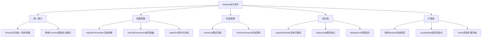
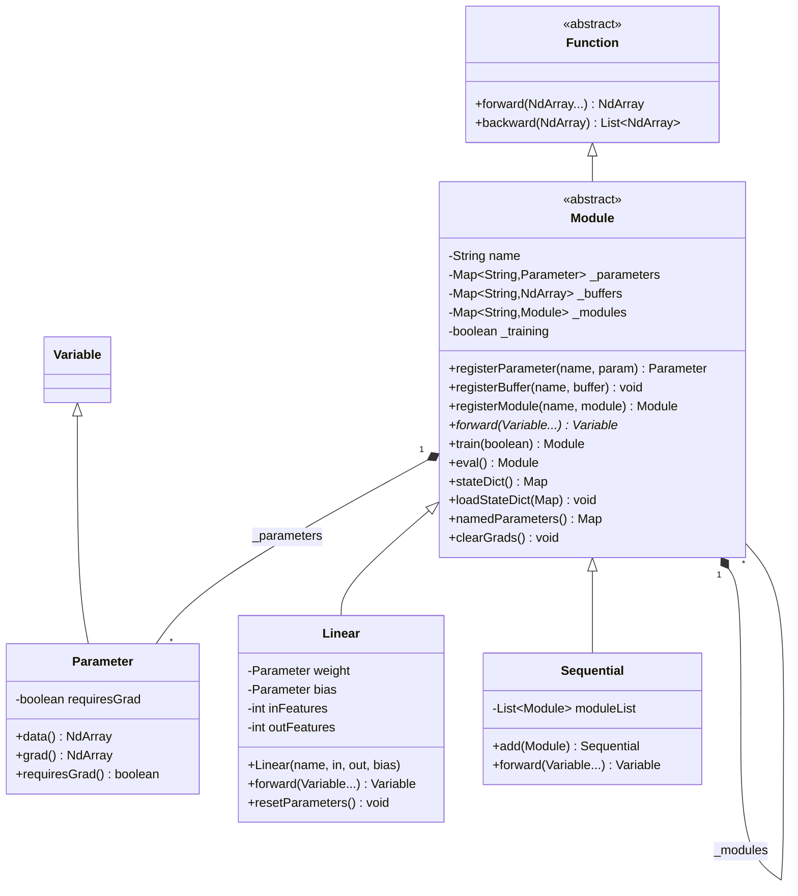

# 5.1 Module抽象：神经网络的基石

## 引言：从积木到智能

想象你正在用乐高积木搭建一座城堡：

- **标准化接口**：每块积木都有统一的凸起和凹槽，可以任意组合
- **层次化构建**：小积木组成中等模块，中等模块组成大型结构
- **可复用性**：同样的积木可以在不同地方重复使用
- **模块化设计**：城门、塔楼、城墙都是独立的模块

**Module抽象将神经网络的构建变成了"搭积木"的艺术**。在TinyAI V2架构中，我们采用类似PyTorch的Module设计，让网络构建变得简单而优雅。

## 为什么需要Module抽象？

### 问题：没有Module的困境

在没有统一抽象的情况下，构建神经网络会遇到诸多问题：

```java
// 混乱的代码：手动管理参数和计算
float[] weights1 = new float[784 * 128];
float[] bias1 = new float[128];
float[] weights2 = new float[128 * 10];
float[] bias2 = new float[10];

// 手动初始化
for (int i = 0; i < weights1.length; i++) {
    weights1[i] = (float)(Math.random() * 0.1);
}

// 手动前向传播
NdArray hidden = matmul(input, weights1).add(bias1);
hidden = relu(hidden);
NdArray output = matmul(hidden, weights2).add(bias2);

// 手动梯度清零
Arrays.fill(grad_weights1, 0);
Arrays.fill(grad_bias1, 0);
Arrays.fill(grad_weights2, 0);
Arrays.fill(grad_bias2, 0);
```

**问题显而易见**：
- 😵 参数管理混乱，容易遗漏
- 🔄 代码重复，难以维护
- ❌ 无法复用，每次都要重写
- 💥 容易出错，调试困难

### 解决方案：Module统一抽象

```java
// 优雅的代码：使用Module抽象
Sequential model = new Sequential("model")
    .add(new Linear("fc1", 784, 128))
    .add(new ReLU("relu"))
    .add(new Linear("fc2", 128, 10));

// 前向传播
Variable output = model.forward(input);

// 参数管理
Map<String, Parameter> params = model.namedParameters();

// 梯度清零
model.clearGrads();
```

**优势明显**：
- ✅ 统一接口，易于理解
- 🔧 自动管理，不易出错
- ♻️ 高度复用，提升效率
- 🎯 清晰表达，可读性强

## Module设计哲学

### 核心设计原则

TinyAI V2的Module设计遵循五大原则：



### 与PyTorch的对齐

TinyAI V2的Module设计高度对齐PyTorch风格：

| 特性 | PyTorch | TinyAI V2 | 说明 |
|------|---------|-----------|------|
| **基类** | `torch.nn.Module` | `Module` | 继承Function，保留自动微分 |
| **参数注册** | `register_parameter()` | `registerParameter()` | 自动收集可训练参数 |
| **缓冲区** | `register_buffer()` | `registerBuffer()` | 管理非可训练张量 |
| **模式切换** | `train()/eval()` | `train()/eval()` | 训练/推理模式 |
| **状态管理** | `state_dict()` | `stateDict()` | 序列化模型状态 |
| **参数冻结** | `requires_grad_()` | `freeze()/unfreeze()` | 控制梯度计算 |
| **命名参数** | `named_parameters()` | `namedParameters()` | 分层命名路径 |

## Module核心设计

### 类图架构



### 核心字段详解

```java
public abstract class Module extends Function implements Serializable {
    
    // ========== 基础信息 ==========
    /**
     * 模块名称
     * 用于标识模块，构建分层命名路径
     */
    protected String name;
    
    // ========== 参数管理 ==========
    /**
     * 可训练参数集合
     * key: 参数名称 (如 "weight", "bias")
     * value: Parameter对象
     */
    protected Map<String, Parameter> _parameters;
    
    /**
     * 非可训练缓冲区集合
     * 用于存储统计量，如BatchNorm的running_mean、running_var
     * key: 缓冲区名称
     * value: NdArray对象
     */
    protected Map<String, NdArray> _buffers;
    
    /**
     * 子模块集合
     * 用于组合多个Module，构建复杂网络
     * key: 子模块名称
     * value: Module对象
     */
    protected Map<String, Module> _modules;
    
    // ========== 状态管理 ==========
    /**
     * 是否处于训练模式
     * true: 训练模式（Dropout启用，BatchNorm使用批次统计）
     * false: 推理模式（Dropout禁用，BatchNorm使用固定统计）
     */
    protected boolean _training = true;
    
    /**
     * 是否已初始化
     * 用于延迟初始化场景
     */
    protected boolean _initialized = false;
    
    // ========== 层次结构 ==========
    /**
     * 父模块引用
     * transient避免序列化时的循环引用问题
     */
    protected transient Module _parent;
}
```

## Module核心方法

### 1. 参数注册机制

Module提供三种注册机制，分别管理不同类型的对象：

```java
/**
 * 注册可训练参数
 * 
 * @param paramName 参数名称
 * @param param 参数对象（可为null，延迟初始化）
 * @return 注册的参数对象
 */
public Parameter registerParameter(String paramName, Parameter param) {
    // 检查名称冲突
    if (_parameters.containsKey(paramName) ||
            _buffers.containsKey(paramName) ||
            _modules.containsKey(paramName)) {
        throw new IllegalArgumentException(
            "Parameter name '" + paramName + "' conflicts");
    }
    _parameters.put(paramName, param);
    return param;
}

/**
 * 注册非可训练缓冲区
 * 
 * 用于管理不参与梯度计算但需要序列化的张量，
 * 如BatchNorm的running_mean、running_var等
 */
public void registerBuffer(String bufferName, NdArray buffer) {
    if (_parameters.containsKey(bufferName) ||
            _buffers.containsKey(bufferName) ||
            _modules.containsKey(bufferName)) {
        throw new IllegalArgumentException(
            "Buffer name '" + bufferName + "' conflicts");
    }
    _buffers.put(bufferName, buffer);
}

/**
 * 注册子模块
 * 
 * 自动设置子模块的父引用，子模块的参数自动纳入父模块管理
 */
public Module registerModule(String moduleName, Module module) {
    if (_parameters.containsKey(moduleName) ||
            _buffers.containsKey(moduleName) ||
            _modules.containsKey(moduleName)) {
        throw new IllegalArgumentException(
            "Module name '" + moduleName + "' conflicts");
    }
    if (module != null) {
        module._parent = this;  // 设置父引用
    }
    _modules.put(moduleName, module);
    return module;
}
```

**使用示例**：

```java
public class Linear extends Module {
    private Parameter weight;
    private Parameter bias;
    
    public Linear(String name, int inFeatures, int outFeatures, boolean useBias) {
        super(name);
        
        // 注册权重参数
        NdArray weightData = NdArray.of(Shape.of(outFeatures, inFeatures));
        this.weight = registerParameter("weight", new Parameter(weightData));
        
        // 注册偏置参数（可选）
        if (useBias) {
            NdArray biasData = NdArray.of(Shape.of(outFeatures));
            this.bias = registerParameter("bias", new Parameter(biasData));
        }
    }
}
```

### 2. 参数收集机制

Module提供递归参数收集，自动构建分层命名路径：

```java
/**
 * 递归收集所有参数及其完整路径
 * 
 * 自动构建分层命名路径，如 "encoder.layer1.weight"
 * 
 * @param prefix 路径前缀
 * @param recurse 是否递归遍历子模块
 * @return 完整路径到参数的映射
 */
public Map<String, Parameter> namedParameters(String prefix, boolean recurse) {
    Map<String, Parameter> result = new LinkedHashMap<>();
    
    // 收集当前模块的参数
    for (Map.Entry<String, Parameter> entry : _parameters.entrySet()) {
        String fullName = prefix.isEmpty() ? 
            entry.getKey() : prefix + "." + entry.getKey();
        if (entry.getValue() != null) {
            result.put(fullName, entry.getValue());
        }
    }
    
    // 递归收集子模块的参数
    if (recurse) {
        for (Map.Entry<String, Module> entry : _modules.entrySet()) {
            if (entry.getValue() != null) {
                String childPrefix = prefix.isEmpty() ? 
                    entry.getKey() : prefix + "." + entry.getKey();
                result.putAll(entry.getValue().namedParameters(childPrefix, true));
            }
        }
    }
    
    return result;
}

// PyTorch风格的便捷方法
public Map<String, Parameter> namedParameters() {
    return namedParameters("", true);
}

public Collection<Parameter> parameters() {
    return namedParameters().values();
}
```

**使用示例**：

```java
Sequential model = new Sequential("model")
    .add(new Linear("fc1", 784, 128))
    .add(new ReLU("relu"))
    .add(new Linear("fc2", 128, 10));

// 获取所有参数及其路径
Map<String, Parameter> params = model.namedParameters();
// 结果：
// "0.weight" -> Parameter(shape=[128, 784])
// "0.bias" -> Parameter(shape=[128])
// "2.weight" -> Parameter(shape=[10, 128])
// "2.bias" -> Parameter(shape=[10])

// 统计参数数量
long totalParams = model.numParameters();
long trainableParams = model.numParameters(true);
```

### 3. 模式切换机制

```java
/**
 * 设置训练/推理模式
 * 
 * 递归设置当前模块及所有子模块的模式
 * 
 * @param mode true为训练模式，false为推理模式
 * @return 当前模块（支持链式调用）
 */
public Module train(boolean mode) {
    _training = mode;
    for (Module child : _modules.values()) {
        if (child != null) {
            child.train(mode);  // 递归设置子模块
        }
    }
    return this;
}

// 便捷方法
public Module train() {
    return train(true);
}

public Module eval() {
    return train(false);
}

public boolean isTraining() {
    return _training;
}
```

**使用示例**：

```java
// 创建模型
Sequential model = new Sequential("model")
    .add(new Linear("fc1", 128, 64))
    .add(new Dropout("dropout", 0.5f))  // Dropout层
    .add(new Linear("fc2", 64, 10));

// 训练模式
model.train();
Variable output = model.forward(input);  // Dropout启用，随机丢弃

// 推理模式
model.eval();
Variable output = model.forward(input);  // Dropout禁用，保留所有神经元
```

### 4. 状态序列化

Module提供完整的状态序列化支持，用于模型保存和加载：

```java
/**
 * 导出模型状态字典
 * 
 * 包含所有参数和缓冲区的数据（不含梯度）
 * 
 * @return 完整路径到张量数据的映射
 */
public Map<String, NdArray> stateDict() {
    Map<String, NdArray> state = new LinkedHashMap<>();
    
    // 收集参数
    for (Map.Entry<String, Parameter> entry : namedParameters().entrySet()) {
        if (entry.getValue() != null && entry.getValue().getValue() != null) {
            NdArray data = entry.getValue().getValue();
            // 创建数据副本
            NdArray dataCopy = data.getShape().isMatrix() ?
                NdArray.of(data.getMatrix()) : NdArray.of(data.getArray(), data.getShape());
            state.put(entry.getKey(), dataCopy);
        }
    }
    
    // 收集缓冲区
    for (Map.Entry<String, NdArray> entry : namedBuffers().entrySet()) {
        if (entry.getValue() != null) {
            NdArray buffer = entry.getValue();
            NdArray bufferCopy = buffer.getShape().isMatrix() ?
                NdArray.of(buffer.getMatrix()) : NdArray.of(buffer.getArray(), buffer.getShape());
            state.put(entry.getKey(), bufferCopy);
        }
    }
    
    return state;
}

/**
 * 加载模型状态字典
 * 
 * @param stateDict 状态字典
 * @param strict 是否严格匹配（键必须完全一致）
 */
public void loadStateDict(Map<String, NdArray> stateDict, boolean strict) {
    // 实现省略，详见源码
}
```

**使用示例**：

```java
// 保存模型
Map<String, NdArray> state = model.stateDict();
// 将state保存到文件...

// 加载模型
Map<String, NdArray> loadedState = ...; // 从文件加载
model.loadStateDict(loadedState, true);  // 严格模式加载
```

### 5. 前向传播

```java
/**
 * 层的前向传播
 * 
 * 子类必须实现此方法定义具体的前向传播逻辑
 * 
 * @param inputs 输入变量数组
 * @return 前向传播结果
 */
public abstract Variable forward(Variable... inputs);
```

**实现示例**：

```java
public class Linear extends Module {
    private Parameter weight;
    private Parameter bias;
    
    @Override
    public Variable forward(Variable... inputs) {
        Variable x = inputs[0];
        
        // 线性变换：y = xW^T + b
        Variable y = x.matMul(weight.transpose());
        
        if (bias != null) {
            y = y.add(bias);
        }
        
        return y;
    }
}
```

## 高级特性

### 1. 参数冻结与解冻

```java
/**
 * 冻结所有参数
 * 
 * 将所有参数的requiresGrad设置为false，
 * 使其在反向传播时不计算梯度。
 * 常用于迁移学习场景，冻结预训练层。
 */
public Module freeze() {
    for (Parameter param : namedParameters().values()) {
        if (param != null) {
            param.setRequiresGrad(false);
        }
    }
    return this;
}

/**
 * 解冻所有参数
 */
public Module unfreeze() {
    for (Parameter param : namedParameters().values()) {
        if (param != null) {
            param.setRequiresGrad(true);
        }
    }
    return this;
}
```

**使用场景：迁移学习**

```java
// 加载预训练模型
Sequential backbone = loadPretrainedModel();

// 冻结预训练层
backbone.freeze();

// 添加新的分类头
Sequential model = new Sequential("transfer_learning")
    .add(backbone)  // 冻结的特征提取器
    .add(new Linear("classifier", 512, 10));  // 新的分类层

// 只训练分类层
long frozenParams = backbone.numParameters(true);  // 0
long trainableParams = model.numParameters(true);  // 5130（只有classifier）
```

### 2. 参数统计

```java
/**
 * 统计参数数量
 * 
 * @param onlyTrainable 是否只统计可训练参数
 * @return 参数总数
 */
public long numParameters(boolean onlyTrainable) {
    long count = 0;
    for (Parameter param : namedParameters().values()) {
        if (param != null && param.data() != null) {
            if (!onlyTrainable || param.requiresGrad()) {
                count += param.data().getShape().size();
            }
        }
    }
    return count;
}

/**
 * 获取模型参数摘要
 */
public String parameterSummary() {
    StringBuilder sb = new StringBuilder();
    sb.append("=".repeat(60)).append("\n");
    sb.append(String.format("%-40s %15s\n", "Layer (type)", "Param #"));
    sb.append("=".repeat(60)).append("\n");
    
    for (Map.Entry<String, Parameter> entry : namedParameters().entrySet()) {
        if (entry.getValue() != null && entry.getValue().data() != null) {
            long paramCount = entry.getValue().data().getShape().size();
            String trainable = entry.getValue().requiresGrad() ? "" : " (frozen)";
            sb.append(String.format("%-40s %,15d%s\n", 
                    entry.getKey(), paramCount, trainable));
        }
    }
    
    sb.append("=".repeat(60)).append("\n");
    sb.append(String.format("Total params: %,d\n", numParameters(false)));
    sb.append(String.format("Trainable params: %,d\n", numParameters(true)));
    sb.append("=".repeat(60)).append("\n");
    
    return sb.toString();
}
```

**使用示例**：

```java
Sequential model = new Sequential("model")
    .add(new Linear("fc1", 784, 128))
    .add(new ReLU("relu"))
    .add(new Linear("fc2", 128, 10));

System.out.println(model.parameterSummary());
// 输出：
// ============================================================
// Layer (type)                                      Param #
// ============================================================
// 0.weight                                          100,352
// 0.bias                                                128
// 2.weight                                            1,280
// 2.bias                                                 10
// ============================================================
// Total params: 101,770
// Trainable params: 101,770
// ============================================================
```

### 3. 函数应用

```java
/**
 * 对当前模块及所有子模块应用函数
 * 
 * 用于批量操作，如统一初始化、冻结参数等
 */
public void apply(Consumer<Module> fn) {
    fn.accept(this);
    for (Module child : _modules.values()) {
        if (child != null) {
            child.apply(fn);
        }
    }
}
```

**使用示例：自定义初始化**

```java
import io.leavesfly.tinyai.nnet.v2.init.Initializers;

// 方式1：对所有Linear层应用Xavier初始化
model.apply(module -> {
    if (module instanceof Linear) {
        Linear linear = (Linear) module;
        Initializers.xavierNormal(linear.getWeight().data());
    }
});

// 方式2：打印所有模块信息
model.apply(module -> {
    System.out.println(module.getName() + ": " + module.getClass().getSimpleName());
});
```

## 完整示例：构建简单分类器

让我们通过一个完整的示例，展示Module的使用：

```java
package io.leavesfly.tinyai.example;

import io.leavesfly.tinyai.func.Variable;
import io.leavesfly.tinyai.ndarr.NdArray;
import io.leavesfly.tinyai.ndarr.Shape;
import io.leavesfly.tinyai.nnet.v2.core.Module;
import io.leavesfly.tinyai.nnet.v2.layer.dnn.Linear;
import io.leavesfly.tinyai.nnet.v2.layer.dnn.Dropout;
import io.leavesfly.tinyai.nnet.v2.layer.activation.ReLU;

/**
 * 简单的两层全连接分类器
 */
class SimpleClassifier extends Module {
    private final Linear fc1;
    private final ReLU relu;
    private final Dropout dropout;
    private final Linear fc2;
    
    public SimpleClassifier(String name, int inputSize, int hiddenSize, int numClasses) {
        super(name);
        
        // 创建子模块
        fc1 = new Linear("fc1", inputSize, hiddenSize, true);
        relu = new ReLU("relu");
        dropout = new Dropout("dropout", 0.5f);
        fc2 = new Linear("fc2", hiddenSize, numClasses, true);
        
        // 注册子模块
        registerModule("fc1", fc1);
        registerModule("relu", relu);
        registerModule("dropout", dropout);
        registerModule("fc2", fc2);
    }
    
    @Override
    public Variable forward(Variable... inputs) {
        Variable x = inputs[0];
        
        // 前向传播
        x = fc1.forward(x);
        x = relu.forward(x);
        x = dropout.forward(x);
        x = fc2.forward(x);
        
        return x;
    }
}

public class ModuleExample {
    public static void main(String[] args) {
        // 1. 创建模型
        SimpleClassifier model = new SimpleClassifier("mnist_classifier", 784, 256, 10);
        System.out.println("模型创建成功");
        
        // 2. 查看参数
        System.out.println("\n" + model.parameterSummary());
        
        // 3. 训练模式
        model.train();
        
        // 创建测试数据
        NdArray inputData = NdArray.of(Shape.of(4, 784));  // batch_size=4
        Variable input = new Variable(inputData);
        
        // 前向传播
        Variable output = model.forward(input);
        System.out.println("训练输出形状: " + output.getValue().getShape());
        
        // 4. 推理模式
        model.eval();
        output = model.forward(input);
        System.out.println("推理输出形状: " + output.getValue().getShape());
        
        // 5. 保存模型
        Map<String, NdArray> state = model.stateDict();
        System.out.println("\n模型状态包含 " + state.size() + " 个张量");
        
        // 6. 清除梯度
        model.clearGrads();
        System.out.println("梯度已清除");
    }
}
```

**运行输出**：

```
模型创建成功

============================================================
Layer (type)                                      Param #
============================================================
fc1.weight                                      200,704
fc1.bias                                            256
fc2.weight                                        2,560
fc2.bias                                             10
============================================================
Total params: 203,530
Trainable params: 203,530
============================================================

训练输出形状: Shape[4, 10]
推理输出形状: Shape[4, 10]

模型状态包含 4 个张量
梯度已清除
```

## V1 vs V2 对比

| 特性 | V1 (LayerAble) | V2 (Module) |
|------|---------------|-------------|
| **继承关系** | LayerAble → Function | Module → Function |
| **参数管理** | 手动Map管理 | registerParameter自动注册 |
| **命名路径** | 手动拼接 | namedParameters自动生成 |
| **模式切换** | ❌ 不支持 | ✅ train()/eval() |
| **参数冻结** | ❌ 不支持 | ✅ freeze()/unfreeze() |
| **状态序列化** | 部分支持 | ✅ stateDict/loadStateDict |
| **子模块管理** | 手动管理 | registerModule自动管理 |
| **缓冲区** | ❌ 不支持 | ✅ registerBuffer |
| **API风格** | 自定义 | PyTorch风格 |

## 本节小结

本节我们学习了TinyAI V2的Module抽象设计：

### 核心要点

1. **统一抽象**
   - Module是所有神经网络组件的基类
   - 继承Function保留自动微分能力
   - 提供统一的forward接口

2. **参数管理**
   - registerParameter注册可训练参数
   - registerBuffer管理非可训练张量
   - namedParameters自动构建分层路径

3. **状态管理**
   - train()/eval()模式切换
   - freeze()/unfreeze()参数冻结
   - stateDict()状态序列化

4. **组合能力**
   - registerModule注册子模块
   - 递归参数收集
   - 自动梯度清零

5. **PyTorch对齐**
   - API命名与PyTorch一致
   - 设计理念高度相似
   - 降低学习成本

### 关键收获

✅ **理解Module的设计哲学**：统一接口、参数管理、状态管理、组合性、扩展性

✅ **掌握核心方法**：registerParameter、namedParameters、train/eval、stateDict

✅ **学会使用高级特性**：freeze/unfreeze、numParameters、apply

✅ **建立PyTorch思维**：V2的设计让你能无缝迁移PyTorch经验

### 下一步

在下一节中，我们将学习**Linear层的实现**，看看如何基于Module抽象构建具体的神经网络层。

---

**思考题**：

1. Module为什么要同时管理_parameters、_buffers和_modules三种对象？
2. namedParameters()是如何实现递归参数收集的？
3. 如果要实现一个自定义的激活层，需要继承Module并实现哪些方法？

（答案见章节末尾附录）
