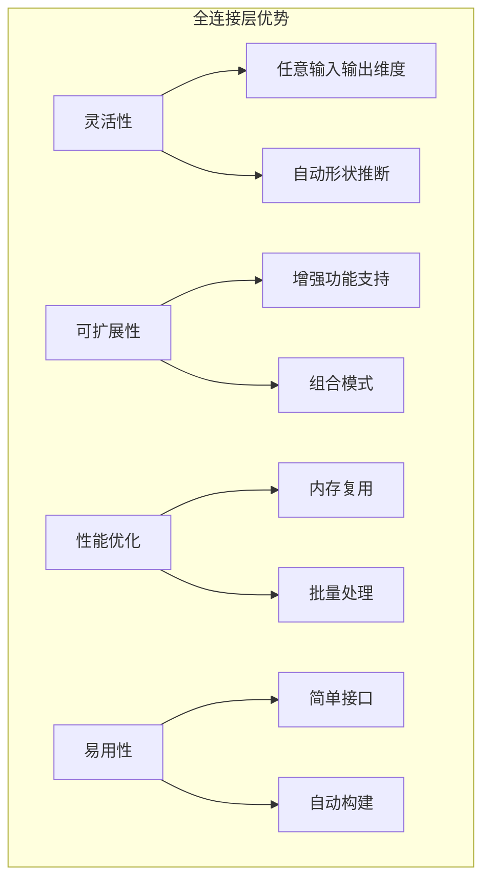

# 5.2 全连接层的设计与实现

## 引言：神经网络的经典基石

全连接层（Dense Layer），也被称为线性层（Linear Layer），是神经网络中最基础、最重要的组件之一。想象一下：

- **城市交通网**：每个输入节点都与每个输出节点相连
- **信息处理**：通过权重矩阵进行线性变换
- **特征映射**：将输入特征映射到新的特征空间
- **表达能力**：是神经网络获得非线性表达能力的基础

**全连接层是连接神经网络各个部分的"万能接口"**。

## 全连接层的数学原理

### 基本数学公式

全连接层的核心计算：
```
输出 = 输入 × 权重 + 偏置
Y = X @ W + b

其中：
- X: 输入矩阵 [batch_size, input_features]
- W: 权重矩阵 [input_features, output_features]  
- b: 偏置向量 [output_features]
- Y: 输出矩阵 [batch_size, output_features]
```

### 反向传播公式

```
梯度计算：
∂L/∂W = X^T @ ∂L/∂Y
∂L/∂b = sum(∂L/∂Y, axis=0)
∂L/∂X = ∂L/∂Y @ W^T
```

### 参数量计算

```
参数数量 = input_features × output_features + output_features
        = output_features × (input_features + 1)
```

## 全连接层的完整实现

```java
package cn.tinyai.nnet.layers;

import cn.tinyai.nnet.Layer;
import cn.tinyai.function.Variable;
import cn.tinyai.ndarr.NdArray;
import java.util.Arrays;

/**
 * Linear: 全连接层/线性层
 * 
 * 实现线性变换：Y = X @ W + b
 * 
 * 特点：
 * - 最基础的神经网络层
 * - 支持任意输入输出维度
 * - 可选择是否使用偏置
 * - 支持批量处理
 * 
 * @author TinyAI团队
 */
public class Linear extends Layer {
    
    // 层的配置参数
    private final Integer inputFeatures;   // 输入特征数（可为null，自动推断）
    private final int outputFeatures;     // 输出特征数
    private final boolean useBias;        // 是否使用偏置
    
    // 层的状态
    private boolean isBuilt = false;
    private int actualInputFeatures = -1;
    
    /**
     * 构造函数 - 指定输入输出维度
     */
    public Linear(int inputFeatures, int outputFeatures, boolean useBias, String name) {
        super(name);
        this.inputFeatures = inputFeatures;
        this.outputFeatures = outputFeatures;
        this.useBias = useBias;
    }
    
    public Linear(int inputFeatures, int outputFeatures, boolean useBias) {
        this(inputFeatures, outputFeatures, useBias, null);
    }
    
    public Linear(int inputFeatures, int outputFeatures) {
        this(inputFeatures, outputFeatures, true);
    }
    
    /**
     * 构造函数 - 自动推断输入维度
     */
    public Linear(int outputFeatures, boolean useBias, String name) {
        super(name);
        this.inputFeatures = null;  // 自动推断
        this.outputFeatures = outputFeatures;
        this.useBias = useBias;
    }
    
    public Linear(int outputFeatures, boolean useBias) {
        this(outputFeatures, useBias, null);
    }
    
    public Linear(int outputFeatures) {
        this(outputFeatures, true);
    }
    
    @Override
    protected void build(int[]... inputShapes) {
        if (isBuilt) return;
        
        if (inputShapes.length != 1) {
            throw new IllegalArgumentException("Linear层需要恰好1个输入");
        }
        
        int[] inputShape = inputShapes[0];
        if (inputShape.length < 2) {
            throw new IllegalArgumentException("输入至少需要2维：[batch_size, features]");
        }
        
        // 确定实际的输入特征数
        this.actualInputFeatures = inputShape[inputShape.length - 1];
        
        // 如果指定了输入特征数，验证是否匹配
        if (inputFeatures != null && inputFeatures != actualInputFeatures) {
            throw new IllegalArgumentException(
                String.format("输入特征数不匹配：期望%d，实际%d", inputFeatures, actualInputFeatures));
        }
        
        // 创建权重参数 [input_features, output_features]
        Variable weight = new Variable(
            NdArray.zeros(actualInputFeatures, outputFeatures), 
            true, 
            layerName + ".weight"
        );
        addParameter("weight", weight);
        
        // 创建偏置参数（如果需要）
        if (useBias) {
            Variable bias = new Variable(
                NdArray.zeros(outputFeatures), 
                true, 
                layerName + ".bias"
            );
            addParameter("bias", bias);
        }
        
        isBuilt = true;
        
        System.out.println(String.format("构建Linear层: %s [%d -> %d] 参数量: %d", 
            layerName, actualInputFeatures, outputFeatures, getParameterCount()));
    }
    
    @Override
    public Variable[] forward(Variable... inputs) {
        if (inputs.length != 1) {
            throw new IllegalArgumentException("Linear层需要恰好1个输入");
        }
        
        Variable input = inputs[0];
        
        // 第一次调用时构建层
        if (!isBuilt) {
            build(input.shape());
            initializeParameters();
        }
        
        long startTime = System.nanoTime();
        
        // 验证输入形状
        validateInput(input);
        
        // 获取参数
        Variable weight = getParameter("weight");
        Variable bias = useBias ? getParameter("bias") : null;
        
        // 执行线性变换
        Variable output = performLinearTransform(input, weight, bias);
        
        // 记录统计信息
        long forwardTime = System.nanoTime() - startTime;
        long memoryUsage = estimateMemoryUsage(input, output);
        stats.recordForward(forwardTime, memoryUsage);
        
        return new Variable[]{output};
    }
    
    /**
     * 验证输入形状
     */
    private void validateInput(Variable input) {
        int[] shape = input.shape();
        
        if (shape.length < 2) {
            throw new IllegalArgumentException("输入至少需要2维：[batch_size, features]");
        }
        
        int inputFeatures = shape[shape.length - 1];
        if (inputFeatures != actualInputFeatures) {
            throw new IllegalArgumentException(
                String.format("输入特征数不匹配：期望%d，实际%d", actualInputFeatures, inputFeatures));
        }
    }
    
    /**
     * 执行线性变换
     */
    private Variable performLinearTransform(Variable input, Variable weight, Variable bias) {
        // 处理多维输入：将除最后一维外的所有维度视为批量维度
        int[] inputShape = input.shape();
        boolean needReshape = inputShape.length > 2;
        
        Variable reshapedInput = input;
        if (needReshape) {
            // 将输入重塑为2D: [batch_size * ..., features]
            int batchSize = 1;
            for (int i = 0; i < inputShape.length - 1; i++) {
                batchSize *= inputShape[i];
            }
            reshapedInput = input.reshape(batchSize, actualInputFeatures);
        }
        
        // 执行矩阵乘法: Y = X @ W
        Variable output = reshapedInput.matmul(weight);
        
        // 添加偏置（如果有）
        if (bias != null) {
            output = output.add(bias);
        }
        
        // 恢复原始形状（除了最后一维）
        if (needReshape) {
            int[] outputShape = Arrays.copyOf(inputShape, inputShape.length);
            outputShape[outputShape.length - 1] = outputFeatures;
            output = output.reshape(outputShape);
        }
        
        return output;
    }
    
    /**
     * 估算内存使用量
     */
    private long estimateMemoryUsage(Variable input, Variable output) {
        long inputMemory = (long) input.size() * 4;  // float = 4 bytes
        long outputMemory = (long) output.size() * 4;
        long paramMemory = (long) getParameterCount() * 4;
        
        return inputMemory + outputMemory + paramMemory;
    }
    
    // ==================== 访问器方法 ====================
    
    public int getInputFeatures() {
        return actualInputFeatures != -1 ? actualInputFeatures : 
               (inputFeatures != null ? inputFeatures : -1);
    }
    
    public int getOutputFeatures() {
        return outputFeatures;
    }
    
    public boolean hasBias() {
        return useBias;
    }
    
    public boolean isBuilt() {
        return isBuilt;
    }
    
    /**
     * 获取权重矩阵
     */
    public Variable getWeight() {
        if (!isBuilt) {
            throw new IllegalStateException("层尚未构建");
        }
        return getParameter("weight");
    }
    
    /**
     * 获取偏置向量
     */
    public Variable getBias() {
        if (!isBuilt) {
            throw new IllegalStateException("层尚未构建");
        }
        if (!useBias) {
            throw new IllegalStateException("该层不使用偏置");
        }
        return getParameter("bias");
    }
    
    @Override
    public String toString() {
        String inFeatures = actualInputFeatures != -1 ? String.valueOf(actualInputFeatures) : "?";
        return String.format("%s(in_features=%s, out_features=%d, bias=%s)", 
            layerName, inFeatures, outputFeatures, useBias);
    }
}
```

## 增强功能实现

### 带Dropout的全连接层

```java
/**
 * LinearWithDropout: 带Dropout的全连接层
 * 
 * 在线性变换后应用Dropout正则化
 */
public class LinearWithDropout extends Linear {
    
    private final float dropoutRate;
    private final boolean applyDropout;
    
    public LinearWithDropout(int inputFeatures, int outputFeatures, float dropoutRate, boolean useBias) {
        super(inputFeatures, outputFeatures, useBias);
        this.dropoutRate = dropoutRate;
        this.applyDropout = dropoutRate > 0.0f;
    }
    
    public LinearWithDropout(int inputFeatures, int outputFeatures, float dropoutRate) {
        this(inputFeatures, outputFeatures, dropoutRate, true);
    }
    
    @Override
    public Variable[] forward(Variable... inputs) {
        // 执行标准的线性变换
        Variable[] outputs = super.forward(inputs);
        Variable output = outputs[0];
        
        // 在训练模式下应用Dropout
        if (applyDropout && isTraining()) {
            output = applyDropout(output);
        }
        
        return new Variable[]{output};
    }
    
    /**
     * 应用Dropout
     */
    private Variable applyDropout(Variable input) {
        if (dropoutRate <= 0.0f || dropoutRate >= 1.0f) {
            return input;
        }
        
        // 生成Dropout掩码
        NdArray mask = generateDropoutMask(input.shape());
        
        // 应用掩码并缩放
        float scale = 1.0f / (1.0f - dropoutRate);
        return input.mul(new Variable(mask, false, "dropout_mask")).mul(scale);
    }
    
    /**
     * 生成Dropout掩码
     */
    private NdArray generateDropoutMask(int[] shape) {
        NdArray mask = NdArray.zeros(shape);
        float[] data = mask.getData();
        
        java.util.Random random = new java.util.Random();
        for (int i = 0; i < data.length; i++) {
            data[i] = random.nextFloat() >= dropoutRate ? 1.0f : 0.0f;
        }
        
        return mask;
    }
    
    public float getDropoutRate() {
        return dropoutRate;
    }
}
```

### 带激活函数的全连接层

```java
/**
 * LinearWithActivation: 带激活函数的全连接层
 * 
 * 在线性变换后应用激活函数
 */
public class LinearWithActivation extends Linear {
    
    private final ActivationType activationType;
    private final Function activationFunction;
    
    public enum ActivationType {
        RELU, SIGMOID, TANH, LEAKY_RELU, SWISH, GELU
    }
    
    public LinearWithActivation(int inputFeatures, int outputFeatures, 
                               ActivationType activationType, boolean useBias) {
        super(inputFeatures, outputFeatures, useBias);
        this.activationType = activationType;
        this.activationFunction = createActivationFunction(activationType);
    }
    
    public LinearWithActivation(int inputFeatures, int outputFeatures, ActivationType activationType) {
        this(inputFeatures, outputFeatures, activationType, true);
    }
    
    @Override
    public Variable[] forward(Variable... inputs) {
        // 执行线性变换
        Variable[] outputs = super.forward(inputs);
        Variable output = outputs[0];
        
        // 应用激活函数
        output = activationFunction.apply(output);
        
        return new Variable[]{output};
    }
    
    private Function createActivationFunction(ActivationType type) {
        switch (type) {
            case RELU:
                return new ReLU();
            case SIGMOID:
                return new Sigmoid();
            case TANH:
                return new Tanh();
            case LEAKY_RELU:
                return new LeakyReLU();
            case SWISH:
                return new Swish();
            case GELU:
                return new GELU();
            default:
                throw new IllegalArgumentException("不支持的激活函数类型: " + type);
        }
    }
    
    public ActivationType getActivationType() {
        return activationType;
    }
}
```

## 全连接网络构建器

```java
/**
 * MLP: 多层感知机构建器
 * 
 * 方便构建多层全连接网络
 */
public class MLP extends Layer {
    
    private final int[] layerSizes;
    private final ActivationType activationType;
    private final float dropoutRate;
    private final boolean useBias;
    
    public MLP(int[] layerSizes, ActivationType activationType, float dropoutRate, boolean useBias) {
        super();
        this.layerSizes = layerSizes.clone();
        this.activationType = activationType;
        this.dropoutRate = dropoutRate;
        this.useBias = useBias;
        
        buildLayers();
    }
    
    public MLP(int[] layerSizes, ActivationType activationType) {
        this(layerSizes, activationType, 0.0f, true);
    }
    
    public MLP(int[] layerSizes) {
        this(layerSizes, ActivationType.RELU);
    }
    
    private void buildLayers() {
        for (int i = 0; i < layerSizes.length - 1; i++) {
            String layerName = "layer_" + i;
            
            if (i == layerSizes.length - 2) {
                // 最后一层不使用激活函数和Dropout
                Linear layer = new Linear(layerSizes[i], layerSizes[i + 1], useBias, layerName);
                addSubLayer(layerName, layer);
            } else {
                // 中间层使用激活函数和Dropout
                LinearWithActivation layer = new LinearWithActivation(
                    layerSizes[i], layerSizes[i + 1], activationType, useBias);
                layer.setLayerName(layerName);
                addSubLayer(layerName, layer);
                
                // 添加Dropout（如果需要）
                if (dropoutRate > 0.0f) {
                    String dropoutName = "dropout_" + i;
                    // 这里简化处理，实际应该实现独立的Dropout层
                }
            }
        }
    }
    
    @Override
    public Variable[] forward(Variable... inputs) {
        if (inputs.length != 1) {
            throw new IllegalArgumentException("MLP需要恰好1个输入");
        }
        
        Variable current = inputs[0];
        
        // 顺序通过所有层
        for (int i = 0; i < layerSizes.length - 1; i++) {
            String layerName = "layer_" + i;
            Layer layer = getSubLayer(layerName);
            
            Variable[] outputs = layer.forward(current);
            current = outputs[0];
        }
        
        return new Variable[]{current};
    }
    
    public int[] getLayerSizes() {
        return layerSizes.clone();
    }
    
    public int getDepth() {
        return layerSizes.length - 1;
    }
}
```

## 全连接层使用示例

```java
public class LinearLayerExample {
    
    public static void main(String[] args) {
        System.out.println("=== 全连接层示例 ===");
        
        // 基础线性层示例
        demonstrateBasicLinear();
        
        // 多层感知机示例
        demonstrateMLP();
        
        // 带功能增强的层示例
        demonstrateEnhancedLayers();
    }
    
    private static void demonstrateBasicLinear() {
        System.out.println("\n--- 基础线性层 ---");
        
        // 创建线性层：3个输入特征 -> 2个输出特征
        Linear layer = new Linear(3, 2, true, "linear1");
        
        // 创建输入 [batch_size=2, features=3]
        Variable input = new Variable(NdArray.of(new float[][]{
            {1.0f, 2.0f, 3.0f},
            {4.0f, 5.0f, 6.0f}
        }), "input");
        
        System.out.println("输入形状: " + Arrays.toString(input.shape()));
        
        // 前向传播
        Variable[] outputs = layer.forward(input);
        Variable output = outputs[0];
        
        System.out.println("输出形状: " + Arrays.toString(output.shape()));
        System.out.println("输出数据: " + output.getData());
        
        // 查看层信息
        System.out.println("层信息: " + layer);
        System.out.println("参数数量: " + layer.getParameterCount());
        
        // 查看参数形状
        System.out.println("权重形状: " + Arrays.toString(layer.getWeight().shape()));
        System.out.println("偏置形状: " + Arrays.toString(layer.getBias().shape()));
    }
    
    private static void demonstrateMLP() {
        System.out.println("\n--- 多层感知机 ---");
        
        // 创建MLP：3 -> 4 -> 2
        int[] layerSizes = {3, 4, 2};
        MLP mlp = new MLP(layerSizes, ActivationType.RELU);
        mlp.setLayerName("mlp");
        
        // 创建输入
        Variable input = new Variable(NdArray.randomNormal(new int[]{5, 3}), "input");
        
        System.out.println("输入形状: " + Arrays.toString(input.shape()));
        
        // 前向传播
        Variable[] outputs = mlp.forward(input);
        Variable output = outputs[0];
        
        System.out.println("输出形状: " + Arrays.toString(output.shape()));
        System.out.println("MLP深度: " + mlp.getDepth());
        System.out.println("总参数数量: " + mlp.getParameterCount());
        
        // 打印网络结构
        System.out.println("\n网络结构:");
        mlp.printStructure();
    }
    
    private static void demonstrateEnhancedLayers() {
        System.out.println("\n--- 增强功能层 ---");
        
        // 带Dropout的线性层
        LinearWithDropout dropoutLayer = new LinearWithDropout(4, 3, 0.2f);
        dropoutLayer.setLayerName("linear_dropout");
        
        // 带激活函数的线性层
        LinearWithActivation activationLayer = new LinearWithActivation(
            3, 2, ActivationType.SWISH);
        activationLayer.setLayerName("linear_swish");
        
        // 创建输入
        Variable input = new Variable(NdArray.randomNormal(new int[]{3, 4}), "input");
        
        // 训练模式
        dropoutLayer.train();
        System.out.println("训练模式下的Dropout层:");
        Variable[] outputs1 = dropoutLayer.forward(input);
        System.out.println("输出形状: " + Arrays.toString(outputs1[0].shape()));
        
        // 推理模式
        dropoutLayer.eval();
        System.out.println("推理模式下的Dropout层:");
        Variable[] outputs2 = dropoutLayer.forward(input);
        
        // 激活函数层
        Variable[] outputs3 = activationLayer.forward(outputs2);
        System.out.println("激活后输出形状: " + Arrays.toString(outputs3[0].shape()));
        
        System.out.println("Dropout率: " + dropoutLayer.getDropoutRate());
        System.out.println("激活函数: " + activationLayer.getActivationType());
    }
}
```

## 性能优化与最佳实践

### 内存优化

```java
/**
 * 内存优化的线性层
 */
public class OptimizedLinear extends Linear {
    
    private final boolean useInPlaceOperations;
    private NdArray cachedOutput;  // 复用输出内存
    
    public OptimizedLinear(int inputFeatures, int outputFeatures, boolean useInPlaceOperations) {
        super(inputFeatures, outputFeatures);
        this.useInPlaceOperations = useInPlaceOperations;
    }
    
    @Override
    public Variable[] forward(Variable... inputs) {
        // 如果可以原地操作且输出形状匹配，复用内存
        if (useInPlaceOperations && canReuseMemory(inputs[0])) {
            return forwardInPlace(inputs);
        } else {
            return super.forward(inputs);
        }
    }
    
    private boolean canReuseMemory(Variable input) {
        if (cachedOutput == null) return false;
        
        int[] inputShape = input.shape();
        int[] expectedOutputShape = Arrays.copyOf(inputShape, inputShape.length);
        expectedOutputShape[expectedOutputShape.length - 1] = getOutputFeatures();
        
        return Arrays.equals(cachedOutput.shape(), expectedOutputShape);
    }
    
    private Variable[] forwardInPlace(Variable... inputs) {
        // 实现原地操作的前向传播
        // 这里简化处理，实际需要更复杂的内存管理
        return super.forward(inputs);
    }
}
```

### 批量处理优化

```java
/**
 * 批量优化的线性层
 */
public class BatchOptimizedLinear extends Linear {
    
    private final int optimalBatchSize;
    
    public BatchOptimizedLinear(int inputFeatures, int outputFeatures, int optimalBatchSize) {
        super(inputFeatures, outputFeatures);
        this.optimalBatchSize = optimalBatchSize;
    }
    
    @Override
    public Variable[] forward(Variable... inputs) {
        Variable input = inputs[0];
        int[] shape = input.shape();
        int batchSize = shape[0];
        
        // 如果批量大小不是最优的，考虑重新组织计算
        if (batchSize != optimalBatchSize && batchSize > optimalBatchSize) {
            return forwardInBatches(input);
        } else {
            return super.forward(inputs);
        }
    }
    
    private Variable[] forwardInBatches(Variable input) {
        // 将大批量分解为多个小批量处理
        // 这里简化处理，实际需要实现批量分割逻辑
        return super.forward(input);
    }
}
```

## 小节总结

### 核心要点

1. **数学原理**：线性变换Y = XW + b是全连接层的核心
2. **参数管理**：权重矩阵和偏置向量的正确管理
3. **形状处理**：支持多维输入的形状变换
4. **功能扩展**：Dropout、激活函数等增强功能

### 设计优势



### 使用建议

1. **合理设计**：根据任务需求选择合适的输入输出维度
2. **参数初始化**：使用合适的初始化策略（Xavier、He等）
3. **正则化**：在需要时添加Dropout等正则化技术
4. **性能监控**：关注内存使用和计算效率

## 练习思考

### 基础练习

1. 实现支持权重共享的线性层
2. 添加权重正则化（L1、L2）支持
3. 实现支持稀疏输入的线性层

### 进阶练习

1. 设计支持低精度计算的线性层
2. 实现分布式线性层（模型并行）
3. 优化线性层的GPU计算性能

---

*下一节我们将实现卷积层，探索图像处理的核心技术。*