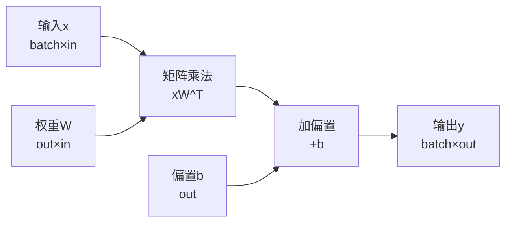
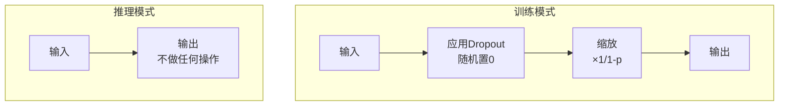

# 5.2 Linear层实现：全连接的艺术

## 引言：神经网络的基石

Linear层（全连接层）是深度学习中最基础也最重要的层。想象它是一个**信息转换器**：

- **输入**：一组特征向量
- **转换**：通过权重矩阵进行线性变换
- **输出**：新的特征表示

```
输入: [x1, x2, x3, ..., xn]
      ↓ 
权重矩阵W和偏置b
      ↓
输出: [y1, y2, y3, ..., ym]
```

**数学公式**：`y = xW^T + b`

在本节中，我们将深入探讨TinyAI V2的Linear层实现，包括标准Linear和延迟初始化的LazyLinear。

## Linear层的数学原理

### 线性变换的本质

```java
/**
 * 线性变换：y = xW^T + b
 * 
 * 输入x的形状: (batch_size, in_features)
 * 权重W的形状: (out_features, in_features)
 * 偏置b的形状: (out_features,)
 * 输出y的形状: (batch_size, out_features)
 */
```

### 前向传播计算



### 反向传播推导

前向传播：`y = xW^T + b`

反向传播梯度：
```
∂L/∂x = ∂L/∂y · W
∂L/∂W = (∂L/∂y)^T · x
∂L/∂b = sum(∂L/∂y, axis=0)
```

## Linear层实现

### 完整代码

```java
package io.leavesfly.tinyai.nnet.v2.layer.dnn;

import io.leavesfly.tinyai.func.Variable;
import io.leavesfly.tinyai.ndarr.NdArray;
import io.leavesfly.tinyai.ndarr.Shape;
import io.leavesfly.tinyai.nnet.v2.core.Module;
import io.leavesfly.tinyai.nnet.v2.core.Parameter;
import io.leavesfly.tinyai.nnet.v2.init.Initializers;

/**
 * V2版本的线性层（全连接层）
 * 
 * 实现线性变换：y = xW^T + b
 */
public class Linear extends Module {
    
    // 可训练参数
    private Parameter weight;  // 权重矩阵
    private Parameter bias;    // 偏置向量
    
    // 层配置
    private final int inFeatures;   // 输入特征数
    private final int outFeatures;  // 输出特征数
    private final boolean useBias;  // 是否使用偏置
    
    /**
     * 构造函数
     */
    public Linear(String name, int inFeatures, int outFeatures, boolean useBias) {
        super(name);
        this.inFeatures = inFeatures;
        this.outFeatures = outFeatures;
        this.useBias = useBias;
        
        // 创建并注册参数
        NdArray weightData = NdArray.of(Shape.of(outFeatures, inFeatures));
        this.weight = registerParameter("weight", new Parameter(weightData));
        
        if (useBias) {
            NdArray biasData = NdArray.of(Shape.of(outFeatures));
            this.bias = registerParameter("bias", new Parameter(biasData));
        }
        
        // 初始化参数
        init();
    }
    
    /**
     * 参数初始化
     * 使用Kaiming均匀初始化（适配ReLU激活）
     */
    @Override
    public void resetParameters() {
        Initializers.kaimingUniform(weight.data(), 0, "fan_in", "relu");
        if (bias != null) {
            Initializers.zeros(bias.data());
        }
    }
    
    /**
     * 前向传播
     */
    @Override
    public Variable forward(Variable... inputs) {
        Variable x = inputs[0];
        
        // 线性变换：y = xW^T + b
        Variable y = x.matMul(weight.transpose());
        
        if (bias != null) {
            y = y.add(bias);
        }
        
        return y;
    }
    
    // Getter方法
    public Parameter getWeight() { return weight; }
    public Parameter getBias() { return bias; }
    public int getInFeatures() { return inFeatures; }
    public int getOutFeatures() { return outFeatures; }
}
```

### 关键设计要点

#### 1. 参数注册机制

```java
// 创建权重参数
NdArray weightData = NdArray.of(Shape.of(outFeatures, inFeatures));
this.weight = registerParameter("weight", new Parameter(weightData));

// 注册偏置参数（可选）
if (useBias) {
    NdArray biasData = NdArray.of(Shape.of(outFeatures));
    this.bias = registerParameter("bias", new Parameter(biasData));
}
```

**为什么这样设计**：
- ✅ 参数自动纳入Module管理
- ✅ 支持自动梯度收集
- ✅ stateDict可以序列化
- ✅ 命名规范统一

#### 2. Kaiming初始化

```java
Initializers.kaimingUniform(weight.data(), 0, "fan_in", "relu");
```

**为什么使用Kaiming初始化**：
- 专为ReLU激活函数设计
- 保持前向传播方差稳定
- 防止梯度消失/爆炸
- 加速网络收敛

**初始化公式**：
```
std = sqrt(2 / fan_in)
weight ~ Uniform(-bound, bound)
其中 bound = sqrt(3) * std
```

#### 3. 矩阵转置

```java
Variable y = x.matMul(weight.transpose());
```

**为什么需要转置**：
- 权重存储格式：`(out_features, in_features)`
- 矩阵乘法要求：`(batch, in) × (in, out) = (batch, out)`
- 转置后：`(out, in)^T = (in, out)`

### 使用示例

```java
// 创建Linear层：784 -> 128
Linear fc = new Linear("fc1", 784, 128, true);

// 准备输入数据 (batch_size=4, features=784)
NdArray inputData = NdArray.of(Shape.of(4, 784));
Variable input = new Variable(inputData);

// 前向传播
Variable output = fc.forward(input);
System.out.println("输出形状: " + output.getShape());  // [4, 128]

// 查看参数
Parameter weight = fc.getWeight();
System.out.println("权重形状: " + weight.data().getShape());  // [128, 784]
System.out.println("权重需要梯度: " + weight.requiresGrad());  // true
```

## LazyLinear：延迟初始化

### 动机：为什么需要LazyLinear？

在构建网络时，我们常常不知道输入维度：

```java
// 问题：不知道输入维度
Sequential model = new Sequential("model")
    .add(new Flatten())           // 输出维度未知
    .add(new Linear("fc", ???, 128))  // 输入维度无法确定
    .add(new ReLU());
```

**LazyLinear的解决方案**：

```java
// 解决：延迟初始化
Sequential model = new Sequential("model")
    .add(new Flatten())
    .add(new LazyLinear("fc", 128))  // 无需指定输入维度
    .add(new ReLU());

// 首次前向传播时自动推断
Variable output = model.forward(input);  // 根据input.shape初始化
```

### LazyLinear实现

```java
package io.leavesfly.tinyai.nnet.v2.layer.dnn;

import io.leavesfly.tinyai.func.Variable;
import io.leavesfly.tinyai.ndarr.NdArray;
import io.leavesfly.tinyai.ndarr.Shape;
import io.leavesfly.tinyai.nnet.v2.core.LazyModule;
import io.leavesfly.tinyai.nnet.v2.core.Parameter;
import io.leavesfly.tinyai.nnet.v2.init.Initializers;

/**
 * 延迟初始化线性层
 * 
 * 在首次前向传播时根据实际输入自动推断并初始化参数
 */
public class LazyLinear extends LazyModule {
    
    private Parameter weight;
    private Parameter bias;
    private Integer inFeatures;  // 延迟推断，初始为null
    private final int outFeatures;
    private final boolean useBias;
    
    public LazyLinear(String name, int outFeatures, boolean useBias) {
        super(name);
        this.inFeatures = null;  // 延迟推断
        this.outFeatures = outFeatures;
        this.useBias = useBias;
    }
    
    /**
     * 根据输入形状初始化参数
     */
    @Override
    protected void initialize(Shape... inputShapes) {
        Shape inputShape = inputShapes[0];
        
        // 推断输入维度（最后一维）
        int dimNum = inputShape.getDimNum();
        if (dimNum < 2) {
            throw new IllegalArgumentException(
                "LazyLinear requires input with at least 2 dimensions");
        }
        this.inFeatures = inputShape.getDimension(dimNum - 1);
        
        // 创建参数
        NdArray weightData = NdArray.of(Shape.of(outFeatures, inFeatures));
        this.weight = registerParameter("weight", new Parameter(weightData));
        
        if (useBias) {
            NdArray biasData = NdArray.of(Shape.of(outFeatures));
            this.bias = registerParameter("bias", new Parameter(biasData));
        }
    }
    
    @Override
    public void resetParameters() {
        if (weight != null) {
            Initializers.kaimingUniform(weight.data(), 0, "fan_in", "relu");
        }
        if (bias != null) {
            Initializers.zeros(bias.data());
        }
    }
    
    @Override
    public Variable forward(Variable... inputs) {
        // 检查并触发延迟初始化
        checkLazyInitialization(inputs);
        
        Variable x = inputs[0];
        
        // 线性变换
        Variable y = x.matMul(weight.transpose());
        
        if (bias != null) {
            y = y.add(bias);
        }
        
        return y;
    }
}
```

### LazyModule基类

```java
public abstract class LazyModule extends Module {
    
    protected boolean _hasUnInitializedParams = true;
    
    /**
     * 根据输入形状初始化参数
     * 子类必须实现此方法
     */
    protected abstract void initialize(Shape... inputShapes);
    
    /**
     * 检查并触发延迟初始化
     */
    protected void checkLazyInitialization(Variable... inputs) {
        if (!_hasUnInitializedParams) {
            return;  // 已初始化
        }
        
        // 提取输入形状
        Shape[] inputShapes = new Shape[inputs.length];
        for (int i = 0; i < inputs.length; i++) {
            inputShapes[i] = inputs[i].getShape();
        }
        
        // 调用initialize方法
        initialize(inputShapes);
        _hasUnInitializedParams = false;
        _initialized = true;
        
        // 初始化参数值
        resetParameters();
    }
}
```

### 使用对比

```java
// 标准Linear：需要明确输入维度
Linear standard = new Linear("fc", 784, 128);

// LazyLinear：无需指定输入维度
LazyLinear lazy = new LazyLinear("fc", 128);

// 首次前向传播时自动初始化
Variable output = lazy.forward(input);  // 根据input.shape推断inFeatures

// 初始化后可以查看
System.out.println("推断的输入维度: " + lazy.getInFeatures());  // 784
```

## Dropout层：正则化技术

### Dropout原理

Dropout在训练时随机丢弃部分神经元，防止过拟合：



**Inverted Dropout**：
```
训练时：output = input * mask / (1-p)
推理时：output = input（无需缩放）
```

### Dropout实现

```java
public class Dropout extends Module {
    
    private final float p;  // dropout概率
    private final Random random;
    
    public Dropout(String name, float p) {
        super(name);
        if (p < 0 || p >= 1) {
            throw new IllegalArgumentException("Dropout p must be in [0, 1)");
        }
        this.p = p;
        this.random = new Random();
    }
    
    @Override
    public Variable forward(Variable... inputs) {
        Variable x = inputs[0];
        
        // 推理模式：直接返回
        if (!_training) {
            return x;
        }
        
        // 训练模式：应用dropout
        if (p == 0) {
            return x;
        }
        
        // 生成dropout mask
        Variable mask = generateMask(x);
        
        // 应用mask并缩放（inverted dropout）
        Variable masked = x.mul(mask);
        float scale = 1.0f / (1 - p);
        return masked.mul(new Variable(scale));
    }
    
    private Variable generateMask(Variable input) {
        int totalElements = input.getElementCount();
        float[] maskData = new float[totalElements];
        for (int i = 0; i < maskData.length; i++) {
            maskData[i] = random.nextFloat() > p ? 1.0f : 0.0f;
        }
        NdArray maskArray = NdArray.of(maskData, input.getShape());
        Variable maskVar = new Variable(maskArray);
        maskVar.setRequireGrad(false);  // mask不需要梯度
        return maskVar;
    }
}
```

### 使用示例

```java
// 创建Dropout层
Dropout dropout = new Dropout("dropout", 0.5f);

// 训练模式
dropout.train();
Variable trainOutput = dropout.forward(input);  // 随机丢弃50%

// 推理模式
dropout.eval();
Variable evalOutput = dropout.forward(input);   // 保留所有神经元
```

## 完整示例：MLP分类器

```java
/**
 * 多层感知机分类器
 */
class MLPClassifier extends Module {
    private final Linear fc1;
    private final ReLU relu1;
    private final Dropout dropout;
    private final Linear fc2;
    private final ReLU relu2;
    private final Linear fc3;
    
    public MLPClassifier(String name) {
        super(name);
        
        // 层定义
        fc1 = new Linear("fc1", 784, 256, true);
        relu1 = new ReLU("relu1");
        dropout = new Dropout("dropout", 0.5f);
        fc2 = new Linear("fc2", 256, 128, true);
        relu2 = new ReLU("relu2");
        fc3 = new Linear("fc3", 128, 10, true);
        
        // 注册子模块
        registerModule("fc1", fc1);
        registerModule("relu1", relu1);
        registerModule("dropout", dropout);
        registerModule("fc2", fc2);
        registerModule("relu2", relu2);
        registerModule("fc3", fc3);
    }
    
    @Override
    public Variable forward(Variable... inputs) {
        Variable x = inputs[0];
        
        x = fc1.forward(x);
        x = relu1.forward(x);
        x = dropout.forward(x);
        
        x = fc2.forward(x);
        x = relu2.forward(x);
        
        x = fc3.forward(x);
        
        return x;
    }
}

// 使用
public class MLPExample {
    public static void main(String[] args) {
        // 创建模型
        MLPClassifier model = new MLPClassifier("mnist_mlp");
        
        // 查看参数
        System.out.println(model.parameterSummary());
        
        // 训练模式
        model.train();
        NdArray trainInput = NdArray.of(Shape.of(32, 784));
        Variable trainOutput = model.forward(new Variable(trainInput));
        
        // 推理模式
        model.eval();
        NdArray testInput = NdArray.of(Shape.of(1, 784));
        Variable testOutput = model.forward(new Variable(testInput));
    }
}
```

**输出**：
```
============================================================
Layer (type)                                      Param #
============================================================
fc1.weight                                      200,704
fc1.bias                                            256
fc2.weight                                       32,768
fc2.bias                                            128
fc3.weight                                        1,280
fc3.bias                                             10
============================================================
Total params: 235,146
Trainable params: 235,146
============================================================
```

## 参数初始化策略

### 常见初始化方法

TinyAI V2提供多种初始化策略：

```java
import io.leavesfly.tinyai.nnet.v2.init.Initializers;

// 1. Kaiming均匀初始化（适配ReLU）
Initializers.kaimingUniform(weight.data(), 0, "fan_in", "relu");

// 2. Kaiming正态初始化
Initializers.kaimingNormal(weight.data(), 0, "fan_in", "relu");

// 3. Xavier均匀初始化（适配Sigmoid/Tanh）
Initializers.xavierUniform(weight.data());

// 4. Xavier正态初始化
Initializers.xavierNormal(weight.data());

// 5. 零初始化（常用于偏置）
Initializers.zeros(bias.data());

// 6. 常数初始化
Initializers.constant(bias.data(), 0.01f);
```

### 自定义初始化

```java
// 方式1：重写resetParameters
public class CustomLinear extends Linear {
    @Override
    public void resetParameters() {
        // 自定义初始化逻辑
        Initializers.xavierNormal(getWeight().data());
        Initializers.constant(getBias().data(), 0.1f);
    }
}

// 方式2：外部统一初始化
model.apply(module -> {
    if (module instanceof Linear) {
        Linear linear = (Linear) module;
        Initializers.xavierNormal(linear.getWeight().data());
    }
});
```

## V1 vs V2对比

| 特性 | V1 (AffineLayer) | V2 (Linear) |
|------|-----------------|-------------|
| **参数管理** | 手动Map管理 | registerParameter自动注册 |
| **初始化** | 随机初始化 | Kaiming/Xavier策略初始化 |
| **API命名** | AffineLayer | Linear（PyTorch风格） |
| **延迟初始化** | ❌ 不支持 | ✅ LazyLinear支持 |
| **Dropout** | 独立实现 | 继承Module统一管理 |
| **模式切换** | ❌ 不支持 | ✅ train()/eval() |

## 本节小结

### 核心要点

1. **Linear层设计**
   - 继承Module，参数自动管理
   - Kaiming初始化适配ReLU
   - 支持可选偏置

2. **LazyLinear延迟初始化**
   - 首次前向传播时推断输入维度
   - 简化网络定义代码
   - 适用于动态网络架构

3. **Dropout正则化**
   - 训练时随机丢弃神经元
   - Inverted Dropout简化推理
   - train()/eval()自动切换

4. **参数初始化**
   - Kaiming适配ReLU
   - Xavier适配Sigmoid/Tanh
   - 支持自定义初始化策略

### 实践练习

1. 实现一个带有BatchNorm的Linear层
2. 对比不同初始化策略对训练的影响
3. 使用LazyLinear构建一个动态网络

---

**下一节预告**：我们将学习卷积层（Conv2d）的实现，探索计算机视觉的核心技术。
