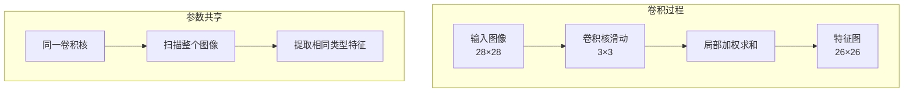
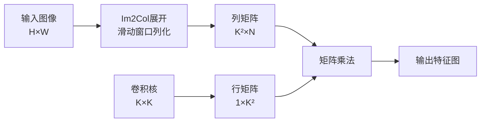

# 5.3 卷积层：计算机视觉的基石

## 引言：从像素到特征

卷积神经网络(CNN)彻底改变了计算机视觉领域。想象一下：

- **滑动窗口**：卷积核在图像上滑动，提取局部特征
- **参数共享**：同一个卷积核在整个图像上共享，大幅减少参数
- **空间层次**：底层提取边缘，高层组合成复杂特征
- **平移不变性**：无论物体在哪里，都能识别出来

```
输入图像 → 卷积层 → 特征图 → 池化层 → 更抽象的特征
```

本节将深入探讨TinyAI V2的卷积层实现，包括Conv2d和各种池化层。

## 卷积的数学原理

### 二维卷积计算

卷积操作本质上是**局部加权求和**：

```java
/**
 * 二维卷积：output[i,j] = Σ Σ input[i+m, j+n] * kernel[m,n]
 * 
 * 输入: (batch, in_channels, height, width)
 * 卷积核: (out_channels, in_channels, kernel_h, kernel_w)
 * 输出: (batch, out_channels, out_h, out_w)
 */
```

### 输出尺寸计算

```
out_height = ⌊(height + 2×padding - kernel_height) / stride⌋ + 1
out_width = ⌊(width + 2×padding - kernel_width) / stride⌋ + 1
```

**示例计算**：
```
输入: 28×28, kernel: 5×5, stride: 1, padding: 0
输出: (28 + 0 - 5)/1 + 1 = 24×24

输入: 28×28, kernel: 5×5, stride: 1, padding: 2
输出: (28 + 4 - 5)/1 + 1 = 28×28 (same padding)
```

### 卷积的直观理解



## Conv2d层实现

### 完整代码

```java
package io.leavesfly.tinyai.nnet.v2.layer.conv;

import io.leavesfly.tinyai.func.Variable;
import io.leavesfly.tinyai.ndarr.NdArray;
import io.leavesfly.tinyai.ndarr.Shape;
import io.leavesfly.tinyai.nnet.v2.core.Module;
import io.leavesfly.tinyai.nnet.v2.core.Parameter;
import io.leavesfly.tinyai.nnet.v2.init.Initializers;

/**
 * V2版本的Conv2d层
 * 
 * 二维卷积层，使用Im2Col算法优化计算
 */
public class Conv2d extends Module {
    
    private Parameter weight;  // 卷积核权重
    private Parameter bias;    // 偏置（可选）
    
    private final int inChannels;   // 输入通道数
    private final int outChannels;  // 输出通道数
    private final int kernelHeight; // 卷积核高度
    private final int kernelWidth;  // 卷积核宽度
    private final int stride;       // 步长
    private final int padding;      // 填充
    private final boolean useBias;  // 是否使用偏置
    
    /**
     * 构造函数（正方形卷积核）
     */
    public Conv2d(String name, int inChannels, int outChannels, int kernelSize,
                  int stride, int padding, boolean useBias) {
        this(name, inChannels, outChannels, kernelSize, kernelSize, 
             stride, padding, useBias);
    }
    
    /**
     * 构造函数（非正方形卷积核）
     */
    public Conv2d(String name, int inChannels, int outChannels, 
                  int kernelHeight, int kernelWidth,
                  int stride, int padding, boolean useBias) {
        super(name);
        this.inChannels = inChannels;
        this.outChannels = outChannels;
        this.kernelHeight = kernelHeight;
        this.kernelWidth = kernelWidth;
        this.stride = stride;
        this.padding = padding;
        this.useBias = useBias;
        
        initializeParameters();
        init();
    }
    
    private void initializeParameters() {
        // 权重形状: (out_channels, in_channels, kernel_h, kernel_w)
        Shape weightShape = Shape.of(outChannels, inChannels, 
                                     kernelHeight, kernelWidth);
        weight = registerParameter("weight", new Parameter(NdArray.of(weightShape)));
        
        if (useBias) {
            // 偏置形状: (out_channels,)
            bias = registerParameter("bias", 
                                    new Parameter(NdArray.of(Shape.of(outChannels))));
        }
    }
    
    @Override
    public void resetParameters() {
        // 使用Kaiming初始化（He初始化）
        Initializers.kaimingUniform(weight.data());
        
        if (useBias) {
            Initializers.zeros(bias.data());
        }
    }
    
    @Override
    public Variable forward(Variable... inputs) {
        Variable x = inputs[0];
        
        // 验证输入维度
        if (x.ndim() != 4) {
            throw new IllegalArgumentException(
                "Expected 4D input (batch, channels, height, width)");
        }
        
        if (x.size(1) != inChannels) {
            throw new IllegalArgumentException(
                String.format("Expected %d input channels, got %d", 
                             inChannels, x.size(1)));
        }
        
        // 创建底层卷积Function（Im2Col优化）
        io.leavesfly.tinyai.func.matrix.Conv2d convFunc = 
            new io.leavesfly.tinyai.func.matrix.Conv2d(stride, padding);
        
        // 执行卷积运算
        Variable output = convFunc.call(x, weight);
        
        // 添加偏置
        if (useBias) {
            output = addBias(output);
        }
        
        return output;
    }
    
    /**
     * 添加偏置
     * bias形状: [OC] -> 广播到 [B, OC, OH, OW]
     */
    private Variable addBias(Variable output) {
        int outChannels = output.size(1);
        Variable biasReshaped = bias.reshape(Shape.of(1, outChannels, 1, 1));
        return output.add(biasReshaped);
    }
}
```

### 关键设计要点

#### 1. Im2Col算法优化

传统卷积计算复杂度高，TinyAI使用**Im2Col（Image to Column）**算法优化：

```java
/**
 * Im2Col原理：
 * 1. 将输入图像展开成列矩阵
 * 2. 将卷积核展平成行矩阵
 * 3. 通过矩阵乘法完成卷积
 * 
 * 优势：
 * - 充分利用高度优化的矩阵乘法库
 * - 计算效率大幅提升
 * - 易于并行化
 */
```



#### 2. 参数形状设计

```java
// 权重形状: (out_channels, in_channels, kernel_height, kernel_width)
// 输入形状: (batch_size, in_channels, height, width)
// 输出形状: (batch_size, out_channels, out_height, out_width)
```

**为什么这样设计**：
- ✅ 符合PyTorch约定
- ✅ 便于批量处理
- ✅ 易于理解和调试

#### 3. 偏置广播

```java
// bias形状: [out_channels] 
// 需要广播到: [batch, out_channels, height, width]
Variable biasReshaped = bias.reshape(Shape.of(1, outChannels, 1, 1));
return output.add(biasReshaped);
```

### 使用示例

```java
// 创建3x3卷积层：1 -> 6 channels
Conv2d conv = new Conv2d("conv1", 1, 6, 3, 1, 0, true);

// 输入: (4, 1, 28, 28)
NdArray input = NdArray.of(Shape.of(4, 1, 28, 28));
Variable x = new Variable(input);

// 前向传播
Variable output = conv.forward(x);
System.out.println("输出形状: " + output.getShape());  // [4, 6, 26, 26]

// 查看参数
System.out.println("权重形状: " + conv.getParameter("weight").data().getShape());
// [6, 1, 3, 3] = 54个参数
```

## 池化层

### MaxPool2d：最大池化

最大池化在每个窗口内取最大值，降低空间维度：

```java
public class MaxPool2d extends Module {
    
    private final int kernelHeight;
    private final int kernelWidth;
    private final int stride;
    private final int padding;
    
    public MaxPool2d(String name, int kernelSize, int stride, int padding) {
        this(name, kernelSize, kernelSize, stride, padding);
    }
    
    public MaxPool2d(String name, int kernelHeight, int kernelWidth, 
                     int stride, int padding) {
        super(name);
        this.kernelHeight = kernelHeight;
        this.kernelWidth = kernelWidth;
        this.stride = stride;
        this.padding = padding;
        init();
    }
    
    @Override
    public Variable forward(Variable... inputs) {
        Variable x = inputs[0];
        
        if (x.ndim() != 4) {
            throw new IllegalArgumentException("Expected 4D input");
        }
        
        // 获取输入尺寸
        int batchSize = x.size(0);
        int channels = x.size(1);
        int height = x.size(2);
        int width = x.size(3);
        
        // 计算输出尺寸
        int outHeight = (height + 2 * padding - kernelHeight) / stride + 1;
        int outWidth = (width + 2 * padding - kernelWidth) / stride + 1;
        
        // 执行最大池化
        NdArray inputData = x.getValue();
        NdArray output = performMaxPooling(inputData, batchSize, channels,
                                          height, width, outHeight, outWidth);
        
        Variable result = new Variable(output);
        result.setRequireGrad(x.isRequireGrad());
        return result;
    }
    
    private NdArray performMaxPooling(NdArray inputData, 
                                     int batchSize, int channels,
                                     int height, int width, 
                                     int outHeight, int outWidth) {
        Shape outputShape = Shape.of(batchSize, channels, outHeight, outWidth);
        float[] outputData = new float[batchSize * channels * outHeight * outWidth];
        
        for (int n = 0; n < batchSize; n++) {
            for (int c = 0; c < channels; c++) {
                for (int oh = 0; oh < outHeight; oh++) {
                    for (int ow = 0; ow < outWidth; ow++) {
                        float maxVal = Float.NEGATIVE_INFINITY;
                        
                        // 在池化窗口内找最大值
                        for (int ph = 0; ph < kernelHeight; ph++) {
                            for (int pw = 0; pw < kernelWidth; pw++) {
                                int ih = oh * stride + ph - padding;
                                int iw = ow * stride + pw - padding;
                                
                                if (ih >= 0 && ih < height && iw >= 0 && iw < width) {
                                    float val = inputData.get(n, c, ih, iw);
                                    maxVal = Math.max(maxVal, val);
                                }
                            }
                        }
                        
                        int idx = ((n * channels + c) * outHeight + oh) * outWidth + ow;
                        outputData[idx] = maxVal == Float.NEGATIVE_INFINITY ? 0.0f : maxVal;
                    }
                }
            }
        }
        
        return NdArray.of(outputData, outputShape);
    }
}
```

### AvgPool2d：平均池化

平均池化计算窗口内的平均值：

```java
public class AvgPool2d extends Module {
    // 实现类似MaxPool2d，但计算平均值而非最大值
    
    private NdArray performAvgPooling(...) {
        // ...
        float sum = 0;
        int count = 0;
        
        for (int ph = 0; ph < kernelHeight; ph++) {
            for (int pw = 0; pw < kernelWidth; pw++) {
                int ih = oh * stride + ph - padding;
                int iw = ow * stride + pw - padding;
                
                if (ih >= 0 && ih < height && iw >= 0 && iw < width) {
                    sum += inputData.get(n, c, ih, iw);
                    count++;
                }
            }
        }
        
        outputData[idx] = count > 0 ? sum / count : 0.0f;
        // ...
    }
}
```

### 池化层对比

| 特性 | MaxPool2d | AvgPool2d |
|------|-----------|-----------|
| **计算方式** | 取窗口最大值 | 取窗口平均值 |
| **特征保留** | 保留显著特征 | 平滑特征 |
| **梯度传播** | 仅最大值位置 | 均匀分配 |
| **应用场景** | 特征提取 | 全局池化 |
| **计算复杂度** | O(k²) | O(k²) |

## 完整示例：LeNet-5

让我们实现经典的LeNet-5网络：

```java
/**
 * LeNet-5: 经典的手写数字识别网络
 */
class LeNet5 extends Module {
    private final Conv2d conv1;
    private final ReLU relu1;
    private final MaxPool2d pool1;
    
    private final Conv2d conv2;
    private final ReLU relu2;
    private final MaxPool2d pool2;
    
    private final Linear fc1;
    private final ReLU relu3;
    private final Dropout dropout;
    
    private final Linear fc2;
    private final ReLU relu4;
    
    private final Linear fc3;
    
    public LeNet5(String name, int numClasses) {
        super(name);
        
        // 卷积块1: 1 -> 6 channels, 5x5 kernel
        conv1 = new Conv2d("conv1", 1, 6, 5, 5, 1, 0, true);
        relu1 = new ReLU("relu1");
        pool1 = new MaxPool2d("pool1", 2, 2, 0);
        
        // 卷积块2: 6 -> 16 channels, 5x5 kernel
        conv2 = new Conv2d("conv2", 6, 16, 5, 5, 1, 0, true);
        relu2 = new ReLU("relu2");
        pool2 = new MaxPool2d("pool2", 2, 2, 0);
        
        // 全连接层1: 16*4*4 -> 120
        fc1 = new Linear("fc1", 16 * 4 * 4, 120, true);
        relu3 = new ReLU("relu3");
        dropout = new Dropout("dropout", 0.5f);
        
        // 全连接层2: 120 -> 84
        fc2 = new Linear("fc2", 120, 84, true);
        relu4 = new ReLU("relu4");
        
        // 输出层: 84 -> numClasses
        fc3 = new Linear("fc3", 84, numClasses, true);
        
        // 注册所有子模块
        registerModule("conv1", conv1);
        registerModule("relu1", relu1);
        registerModule("pool1", pool1);
        registerModule("conv2", conv2);
        registerModule("relu2", relu2);
        registerModule("pool2", pool2);
        registerModule("fc1", fc1);
        registerModule("relu3", relu3);
        registerModule("dropout", dropout);
        registerModule("fc2", fc2);
        registerModule("relu4", relu4);
        registerModule("fc3", fc3);
    }
    
    @Override
    public Variable forward(Variable... inputs) {
        Variable x = inputs[0];
        
        // 卷积块1: Conv -> ReLU -> Pool
        // (N, 1, 28, 28) -> (N, 6, 24, 24) -> (N, 6, 12, 12)
        x = conv1.forward(x);
        x = relu1.forward(x);
        x = pool1.forward(x);
        
        // 卷积块2: Conv -> ReLU -> Pool
        // (N, 6, 12, 12) -> (N, 16, 8, 8) -> (N, 16, 4, 4)
        x = conv2.forward(x);
        x = relu2.forward(x);
        x = pool2.forward(x);
        
        // 展平: (N, 16, 4, 4) -> (N, 256)
        x = flatten(x);
        
        // 全连接块1
        x = fc1.forward(x);
        x = relu3.forward(x);
        x = dropout.forward(x);
        
        // 全连接块2
        x = fc2.forward(x);
        x = relu4.forward(x);
        
        // 输出层
        x = fc3.forward(x);
        
        return x;
    }
    
    private Variable flatten(Variable x) {
        int batchSize = x.size(0);
        int flatSize = x.size(1) * x.size(2) * x.size(3);
        return x.reshape(Shape.of(batchSize, flatSize));
    }
}

// 使用示例
public class LeNet5Example {
    public static void main(String[] args) {
        // 创建模型
        LeNet5 model = new LeNet5("lenet5", 10);
        
        // 查看参数
        System.out.println(model.parameterSummary());
        
        // 训练模式
        model.train();
        NdArray input = NdArray.of(Shape.of(4, 1, 28, 28));
        Variable output = model.forward(new Variable(input));
        
        System.out.println("输出形状: " + output.getShape());  // [4, 10]
    }
}
```

**输出**：
```
============================================================
Layer (type)                                      Param #
============================================================
conv1.weight                                          150
conv1.bias                                              6
conv2.weight                                        2,400
conv2.bias                                             16
fc1.weight                                         30,720
fc1.bias                                              120
fc2.weight                                         10,080
fc2.bias                                               84
fc3.weight                                            840
fc3.bias                                               10
============================================================
Total params: 44,426
Trainable params: 44,426
============================================================
输出形状: Shape[4, 10]
```

## 卷积层设计模式

### 1. 标准卷积块

```java
/**
 * Conv -> BatchNorm -> ReLU
 */
class ConvBlock extends Module {
    private final Conv2d conv;
    private final BatchNorm2d bn;
    private final ReLU relu;
    
    public ConvBlock(String name, int in, int out, int kernel, 
                     int stride, int padding) {
        super(name);
        conv = new Conv2d("conv", in, out, kernel, stride, padding, false);
        bn = new BatchNorm2d("bn", out);
        relu = new ReLU("relu");
        
        registerModule("conv", conv);
        registerModule("bn", bn);
        registerModule("relu", relu);
    }
    
    @Override
    public Variable forward(Variable... inputs) {
        Variable x = inputs[0];
        x = conv.forward(x);
        x = bn.forward(x);
        x = relu.forward(x);
        return x;
    }
}
```

### 2. 残差块（ResNet）

```java
/**
 * 残差连接: y = F(x) + x
 */
class ResidualBlock extends Module {
    private final Conv2d conv1;
    private final BatchNorm2d bn1;
    private final ReLU relu1;
    private final Conv2d conv2;
    private final BatchNorm2d bn2;
    private final ReLU relu2;
    
    public ResidualBlock(String name, int channels) {
        super(name);
        conv1 = new Conv2d("conv1", channels, channels, 3, 1, 1, false);
        bn1 = new BatchNorm2d("bn1", channels);
        relu1 = new ReLU("relu1");
        conv2 = new Conv2d("conv2", channels, channels, 3, 1, 1, false);
        bn2 = new BatchNorm2d("bn2", channels);
        relu2 = new ReLU("relu2");
        
        // 注册子模块...
    }
    
    @Override
    public Variable forward(Variable... inputs) {
        Variable x = inputs[0];
        Variable identity = x;  // 保存输入
        
        // 残差分支
        x = conv1.forward(x);
        x = bn1.forward(x);
        x = relu1.forward(x);
        x = conv2.forward(x);
        x = bn2.forward(x);
        
        // 跳跃连接
        x = x.add(identity);
        x = relu2.forward(x);
        
        return x;
    }
}
```

## V1 vs V2对比

| 特性 | V1 | V2 |
|------|----|----|
| **卷积实现** | 原始嵌套循环 | Im2Col优化算法 |
| **API命名** | 自定义 | PyTorch风格 |
| **参数管理** | 手动管理 | registerParameter |
| **池化层** | 基础实现 | 完整MaxPool/AvgPool |
| **性能** | 较慢 | 高度优化 |
| **易用性** | 中等 | 高（链式调用）|

## 本节小结

### 核心要点

1. **Conv2d设计**
   - Im2Col算法优化卷积计算
   - Kaiming初始化适配ReLU
   - 支持任意kernel size、stride、padding

2. **池化层**
   - MaxPool2d提取显著特征
   - AvgPool2d平滑特征
   - 降低空间维度，防止过拟合

3. **LeNet-5实现**
   - 经典CNN架构
   - 卷积+池化+全连接
   - 44K参数识别手写数字

4. **设计模式**
   - 标准卷积块(Conv-BN-ReLU)
   - 残差块(ResNet)
   - 模块化组合

### 实践练习

1. 实现深度可分离卷积(Depthwise Separable Convolution)
2. 构建VGG16网络架构
3. 对比不同池化策略的效果

---

**下一节预告**：我们将学习归一化层（LayerNorm和BatchNorm），探索训练稳定性的关键技术。
