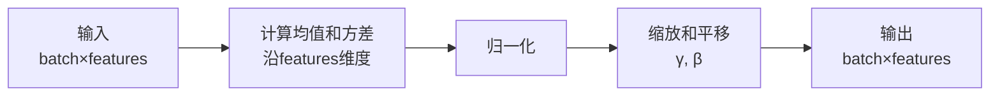
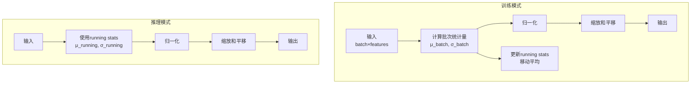
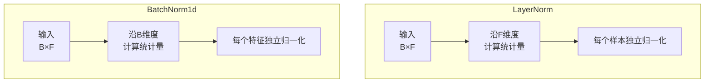

# 5.4 归一化层：训练稳定性的关键

## 引言：为什么需要归一化？

深度神经网络训练面临的核心挑战之一是**内部协变量偏移(Internal Covariate Shift)**：

- **问题**：每层输入分布随训练不断变化，导致训练不稳定
- **后果**：需要更小的学习率，训练缓慢，容易陷入局部最优
- **解决方案**：归一化技术！

```
输入 → 归一化 → 激活函数 → 稳定的梯度流动
```

**归一化的核心思想**：将数据分布标准化，使其均值为0，方差为1。

本节将探讨LayerNorm和BatchNorm1d两种重要的归一化技术。

## 归一化的数学原理

### 标准化公式

所有归一化层都遵循相同的数学形式：

```
y = γ × (x - μ) / σ + β

其中：
- μ: 均值
- σ: 标准差 = sqrt(方差 + ε)
- γ: 缩放参数(可学习)
- β: 平移参数(可学习)
- ε: 数值稳定性常数(通常1e-5)
```

**为什么需要γ和β**？
- 归一化可能破坏网络的表达能力
- γ和β允许网络学习**恢复**原始分布的能力
- 如果γ=σ, β=μ，可以完全恢复归一化前的值

## LayerNorm：层归一化

### 设计原理

LayerNorm在**特征维度**上计算统计量，与批次大小无关：



**特点**：
- ✅ 与批次大小无关，适合小批量训练
- ✅ 训练和推理行为一致，不需要running stats
- ✅ 在Transformer中广泛使用
- ❌ 对CNN效果不如BatchNorm

### LayerNorm实现

```java
package io.leavesfly.tinyai.nnet.v2.layer.norm;

import io.leavesfly.tinyai.func.Variable;
import io.leavesfly.tinyai.ndarr.NdArray;
import io.leavesfly.tinyai.ndarr.Shape;
import io.leavesfly.tinyai.nnet.v2.core.Module;
import io.leavesfly.tinyai.nnet.v2.core.Parameter;
import io.leavesfly.tinyai.nnet.v2.init.Initializers;

/**
 * LayerNorm层
 * 
 * 在特征维度上进行归一化
 */
public class LayerNorm extends Module {
    
    private Parameter gamma;  // 缩放参数
    private Parameter beta;   // 平移参数
    private final int normalizedShape;
    private final float eps;
    
    public LayerNorm(String name, int normalizedShape, float eps) {
        super(name);
        this.normalizedShape = normalizedShape;
        this.eps = eps;
        
        // 创建可训练参数
        NdArray gammaData = NdArray.of(Shape.of(normalizedShape));
        NdArray betaData = NdArray.of(Shape.of(normalizedShape));
        
        this.gamma = registerParameter("gamma", new Parameter(gammaData));
        this.beta = registerParameter("beta", new Parameter(betaData));
        
        init();
    }
    
    public LayerNorm(String name, int normalizedShape) {
        this(name, normalizedShape, 1e-5f);
    }
    
    @Override
    public void resetParameters() {
        // gamma初始化为1
        Initializers.ones(gamma.data());
        // beta初始化为0
        Initializers.zeros(beta.data());
    }
    
    @Override
    public Variable forward(Variable... inputs) {
        Variable x = inputs[0];
        
        // 计算均值和方差（在最后一维）
        Variable mean = x.mean(-1, true);
        Variable variance = x.var(-1, true);
        
        // 归一化
        Variable normalized = x.sub(mean)
                               .div(variance.add(new Variable(eps)).sqrt());
        
        // 应用缩放和平移
        return normalized.mul(gamma).add(beta);
    }
}
```

### 使用示例

```java
// 创建LayerNorm层
LayerNorm ln = new LayerNorm("ln", 128);

// 输入: (batch=4, features=128)
NdArray input = NdArray.of(Shape.of(4, 128));
Variable x = new Variable(input);

// 前向传播
Variable output = ln.forward(x);
System.out.println("输出形状: " + output.getShape());  // [4, 128]

// 训练和推理行为一致
ln.train();
Variable trainOutput = ln.forward(x);

ln.eval();
Variable evalOutput = ln.forward(x);
// trainOutput 和 evalOutput 结果相同
```

## BatchNorm1d：批归一化

### 设计原理

BatchNorm1d在**批次维度**上计算统计量：



**特点**：
- ✅ 对CNN效果显著，加速训练
- ✅ 具有正则化效果，减少过拟合
- ❌ 依赖批次大小，小批量效果差
- ❌ 训练和推理行为不同

### 关键概念：Running Statistics

```java
/**
 * Running Statistics: 移动平均统计量
 * 
 * 训练时更新：
 * running_mean = (1-momentum) × running_mean + momentum × batch_mean
 * running_var = (1-momentum) × running_var + momentum × batch_var
 * 
 * 推理时使用：
 * 使用训练过程中累积的running stats进行归一化
 * 
 * momentum参数（通常0.1）：
 * - 控制新批次统计量的权重
 * - 越大，running stats更新越快
 */
```

### BatchNorm1d实现

```java
public class BatchNorm1d extends Module {
    
    private Parameter gamma;  // 缩放参数
    private Parameter beta;   // 平移参数
    
    private final int numFeatures;
    private final float eps;
    private final float momentum;
    private final boolean affine;
    private final boolean trackRunningStats;
    
    public BatchNorm1d(String name, int numFeatures, float eps, float momentum,
                       boolean affine, boolean trackRunningStats) {
        super(name);
        this.numFeatures = numFeatures;
        this.eps = eps;
        this.momentum = momentum;
        this.affine = affine;
        this.trackRunningStats = trackRunningStats;
        
        // 创建可学习参数
        if (affine) {
            this.gamma = registerParameter("gamma", 
                new Parameter(NdArray.of(Shape.of(numFeatures))));
            this.beta = registerParameter("beta", 
                new Parameter(NdArray.of(Shape.of(numFeatures))));
        }
        
        // 创建移动平均缓冲区
        if (trackRunningStats) {
            NdArray runningMean = NdArray.of(new float[numFeatures], 
                Shape.of(numFeatures));
            NdArray runningVar = NdArray.of(new float[numFeatures], 
                Shape.of(numFeatures));
            
            // running_var初始化为1
            for (int i = 0; i < numFeatures; i++) {
                runningVar.getArray()[i] = 1.0f;
            }
            
            registerBuffer("running_mean", runningMean);
            registerBuffer("running_var", runningVar);
            registerBuffer("num_batches_tracked", NdArray.of(new float[]{0}, Shape.of(1)));
        }
        
        init();
    }
    
    public BatchNorm1d(String name, int numFeatures) {
        this(name, numFeatures, 1e-5f, 0.1f, true, true);
    }
    
    @Override
    public void resetParameters() {
        if (affine) {
            Initializers.ones(gamma.data());
            Initializers.zeros(beta.data());
        }
        resetRunningStats();
    }
    
    @Override
    public Variable forward(Variable... inputs) {
        Variable x = inputs[0];
        
        // 输入形状检查
        int[] dims = x.sizes();
        if (dims.length < 2 || dims[1] != numFeatures) {
            throw new IllegalArgumentException(
                String.format("Expected %d features, got %d", 
                             numFeatures, dims[1]));
        }
        
        if (isTraining()) {
            return forwardTraining(x);
        } else {
            return forwardInference(x);
        }
    }
    
    private Variable forwardTraining(Variable x) {
        // 计算批次统计量
        Variable batchMean = x.mean(0, false);
        Variable batchVar = x.var(0, false);
        
        // 更新running stats
        if (trackRunningStats) {
            updateRunningStats(batchMean.getValue(), batchVar.getValue());
        }
        
        // 归一化
        Variable normalized = normalize(x, batchMean, batchVar);
        
        // 应用缩放和平移
        return applyAffineTransform(normalized);
    }
    
    private Variable forwardInference(Variable x) {
        if (!trackRunningStats) {
            throw new IllegalStateException(
                "Cannot use eval mode without trackRunningStats");
        }
        
        // 使用running stats
        NdArray runningMean = getBuffer("running_mean");
        NdArray runningVar = getBuffer("running_var");
        
        Variable mean = new Variable(runningMean);
        Variable var = new Variable(runningVar);
        
        Variable normalized = normalize(x, mean, var);
        return applyAffineTransform(normalized);
    }
    
    private Variable normalize(Variable x, Variable mean, Variable var) {
        Variable centered = x.sub(mean);
        Variable epsVar = new Variable(eps);
        epsVar.setRequireGrad(false);
        Variable std = var.add(epsVar).sqrt();
        return centered.div(std);
    }
    
    private Variable applyAffineTransform(Variable normalized) {
        if (affine) {
            return normalized.mul(gamma).add(beta);
        }
        return normalized;
    }
    
    private void updateRunningStats(NdArray batchMean, NdArray batchVar) {
        NdArray runningMean = getBuffer("running_mean");
        NdArray runningVar = getBuffer("running_var");
        
        float[] runningMeanData = runningMean.getArray();
        float[] runningVarData = runningVar.getArray();
        float[] batchMeanData = batchMean.getArray();
        float[] batchVarData = batchVar.getArray();
        
        // 移动平均更新
        for (int i = 0; i < numFeatures; i++) {
            runningMeanData[i] = (1 - momentum) * runningMeanData[i] + 
                                 momentum * batchMeanData[i];
            runningVarData[i] = (1 - momentum) * runningVarData[i] + 
                                momentum * batchVarData[i];
        }
        
        // 更新批次计数
        getBuffer("num_batches_tracked").getArray()[0] += 1;
    }
}
```

### 使用示例

```java
// 创建BatchNorm1d层
BatchNorm1d bn = new BatchNorm1d("bn1", 64);

// 训练模式
bn.train();
NdArray trainInput = NdArray.of(Shape.of(32, 64));  // batch=32
Variable trainOutput = bn.forward(new Variable(trainInput));

// 推理模式
bn.eval();
NdArray testInput = NdArray.of(Shape.of(1, 64));  // batch=1也可以
Variable testOutput = bn.forward(new Variable(testInput));

// 访问统计量
NdArray runningMean = bn.getRunningMean();
NdArray runningVar = bn.getRunningVar();
long numBatches = bn.getNumBatchesTracked();
```

## LayerNorm vs BatchNorm1d

### 归一化维度对比



### 详细对比表

| 特性 | LayerNorm | BatchNorm1d |
|------|-----------|-------------|
| **归一化维度** | 特征维度 | 批次维度 |
| **批次依赖** | 无 | 有 |
| **小批量** | ✅ 效果好 | ❌ 效果差 |
| **推理模式** | 与训练一致 | 使用running stats |
| **running stats** | 不需要 | 需要 |
| **适用场景** | NLP, Transformer | CV, CNN |
| **参数数量** | 2×features | 2×features |
| **计算复杂度** | O(features) | O(features) |

### 应用场景

```java
// 场景1: NLP任务 - 使用LayerNorm
Sequential nlpModel = new Sequential("nlp")
    .add(new Embedding("embed", vocabSize, embeddingDim))
    .add(new LayerNorm("ln1", embeddingDim))  // ✅
    .add(new TransformerEncoder("encoder"))
    .add(new LayerNorm("ln2", embeddingDim))  // ✅
    .add(new Linear("fc", embeddingDim, numClasses));

// 场景2: CNN任务 - 使用BatchNorm1d
class ConvBlock extends Module {
    private final Conv2d conv;
    private final BatchNorm1d bn;  // ✅ 对CNN效果好
    private final ReLU relu;
    
    public ConvBlock(String name, int in, int out) {
        super(name);
        conv = new Conv2d("conv", in, out, 3, 1, 1, false);
        bn = new BatchNorm1d("bn", out);
        relu = new ReLU("relu");
        // ...
    }
}

// 场景3: 小批量训练 - 使用LayerNorm
model.train();
// BatchNorm1d在batch_size=1时效果差
// LayerNorm不受批次大小影响 ✅
```

## 完整示例：带归一化的ResNet块

```java
/**
 * ResNet残差块 with BatchNorm
 */
class ResidualBlock extends Module {
    private final Conv2d conv1;
    private final BatchNorm1d bn1;
    private final ReLU relu1;
    
    private final Conv2d conv2;
    private final BatchNorm1d bn2;
    
    private final ReLU relu2;
    
    public ResidualBlock(String name, int channels) {
        super(name);
        
        // 第一个卷积块
        conv1 = new Conv2d("conv1", channels, channels, 3, 1, 1, false);
        bn1 = new BatchNorm1d("bn1", channels);
        relu1 = new ReLU("relu1");
        
        // 第二个卷积块
        conv2 = new Conv2d("conv2", channels, channels, 3, 1, 1, false);
        bn2 = new BatchNorm1d("bn2", channels);
        
        relu2 = new ReLU("relu2");
        
        // 注册子模块
        registerModule("conv1", conv1);
        registerModule("bn1", bn1);
        registerModule("relu1", relu1);
        registerModule("conv2", conv2);
        registerModule("bn2", bn2);
        registerModule("relu2", relu2);
    }
    
    @Override
    public Variable forward(Variable... inputs) {
        Variable x = inputs[0];
        Variable identity = x;  // 保存输入
        
        // 第一个块: Conv -> BN -> ReLU
        x = conv1.forward(x);
        x = bn1.forward(x);
        x = relu1.forward(x);
        
        // 第二个块: Conv -> BN
        x = conv2.forward(x);
        x = bn2.forward(x);
        
        // 残差连接
        x = x.add(identity);
        x = relu2.forward(x);
        
        return x;
    }
}

// 使用
public class ResNetExample {
    public static void main(String[] args) {
        ResidualBlock resBlock = new ResidualBlock("res1", 64);
        
        // 训练模式
        resBlock.train();
        NdArray input = NdArray.of(Shape.of(16, 64, 32, 32));
        Variable output = resBlock.forward(new Variable(input));
        
        System.out.println("输出形状: " + output.getShape());  // [16, 64, 32, 32]
        
        // 查看running stats
        BatchNorm1d bn1 = (BatchNorm1d) resBlock.getModule("bn1");
        System.out.println("处理批次数: " + bn1.getNumBatchesTracked());
    }
}
```

## 归一化的最佳实践

### 1. 选择合适的归一化层

```java
/**
 * 决策树：
 * 
 * 是CNN任务？
 *   是 -> BatchNorm2d/BatchNorm1d
 *   否 -> 是NLP任务？
 *          是 -> LayerNorm
 *          否 -> 批次大小很小？
 *                 是 -> LayerNorm
 *                 否 -> BatchNorm1d
 */
```

### 2. 归一化的位置

```java
// 方式1: Conv -> BN -> ReLU (推荐)
x = conv.forward(x);
x = bn.forward(x);
x = relu.forward(x);

// 方式2: Conv -> ReLU -> BN (不推荐)
x = conv.forward(x);
x = relu.forward(x);
x = bn.forward(x);  // ReLU打破了归一化的对称性
```

### 3. 训练技巧

```java
// 冻结BN层
model.apply(module -> {
    if (module instanceof BatchNorm1d) {
        BatchNorm1d bn = (BatchNorm1d) module;
        bn.eval();  // 固定在推理模式
        bn.freeze();  // 冻结参数
    }
});

// 重置BN统计量
model.apply(module -> {
    if (module instanceof BatchNorm1d) {
        ((BatchNorm1d) module).resetRunningStats();
    }
});
```

## 本节小结

### 核心要点

1. **归一化原理**
   - 标准化数据分布(μ=0, σ=1)
   - 加速训练，提高稳定性
   - γ和β恢复表达能力

2. **LayerNorm**
   - 特征维度归一化
   - 与批次大小无关
   - 适合NLP和Transformer

3. **BatchNorm1d**
   - 批次维度归一化
   - 需要running stats
   - 适合CNN任务

4. **关键差异**
   - 归一化维度不同
   - 批次依赖性不同
   - 应用场景不同

### 实践建议

✅ CNN任务首选BatchNorm
✅ NLP任务首选LayerNorm
✅ 小批量训练使用LayerNorm
✅ 归一化放在激活函数之前

---

**下一节预告**：我们将学习Sequential容器和模块组合模式，掌握构建复杂网络的艺术。
