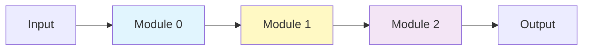

# 5.5 Sequential容器：模块组合的艺术

## 引言：像搭积木一样构建网络

想象你在用乐高积木搭建一座城堡，你不会关心每块积木内部的细节，只需要知道如何将它们组合在一起。**Sequential容器**就是神经网络的"积木盒"：

- **顺序组合**：按顺序连接多个模块
- **链式调用**：优雅的API设计
- **自动管理**：参数自动收集和梯度传播
- **模块化**：构建可复用的网络块

```
Input → Module1 → Module2 → Module3 → Output
```

本节将深入探讨TinyAI V2的容器设计，包括Sequential、ModuleList等高级组合模式。

## Sequential：顺序容器

### 设计理念

Sequential是最常用的容器，将多个模块按顺序连接：



**核心特点**：
- ✅ 自动顺序执行
- ✅ 支持链式调用
- ✅ 参数自动管理
- ✅ 清晰的网络结构

### Sequential实现

```java
package io.leavesfly.tinyai.nnet.v2.container;

import io.leavesfly.tinyai.func.Variable;
import core.io.leavesfly.tinyai.nnet.Module;

import java.util.ArrayList;
import java.util.List;

/**
 * Sequential容器
 * 
 * 按顺序组合多个模块
 */
public class Sequential extends Module {
    
    private final List<Module> moduleList;
    private int moduleCount = 0;
    
    public Sequential(String name) {
        super(name);
        this.moduleList = new ArrayList<>();
    }
    
    public Sequential() {
        this("sequential");
    }
    
    /**
     * 添加模块到容器
     * 支持链式调用
     */
    public Sequential add(Module module) {
        if (module == null) {
            throw new IllegalArgumentException("Cannot add null module");
        }
        
        // 自动命名：使用索引
        String moduleName = String.valueOf(moduleCount);
        registerModule(moduleName, module);
        moduleList.add(module);
        moduleCount++;
        
        return this;  // 支持链式调用
    }
    
    /**
     * 添加模块（指定名称）
     */
    public Sequential add(String name, Module module) {
        if (module == null) {
            throw new IllegalArgumentException("Cannot add null module");
        }
        
        registerModule(name, module);
        moduleList.add(module);
        moduleCount++;
        
        return this;
    }
    
    @Override
    public Variable forward(Variable... inputs) {
        if (moduleList.isEmpty()) {
            throw new IllegalStateException("Sequential is empty");
        }
        
        if (inputs.length == 0) {
            throw new IllegalArgumentException("Requires at least one input");
        }
        
        // 顺序前向传播
        Variable output = inputs[0];
        for (Module module : moduleList) {
            output = module.forward(output);
        }
        
        return output;
    }
    
    /**
     * 获取指定索引的模块
     */
    public Module get(int index) {
        return moduleList.get(index);
    }
    
    /**
     * 获取模块数量
     */
    public int size() {
        return moduleList.size();
    }
    
    public boolean isEmpty() {
        return moduleList.isEmpty();
    }
    
    @Override
    public String toString() {
        StringBuilder sb = new StringBuilder();
        sb.append("Sequential{name='").append(name).append("', modules=[\n");
        for (int i = 0; i < moduleList.size(); i++) {
            sb.append("  (").append(i).append("): ")
              .append(moduleList.get(i)).append("\n");
        }
        sb.append("]}");
        return sb.toString();
    }
}
```

### 使用示例：三种风格

#### 风格1：链式调用（推荐）

```java
// 最优雅的方式
Sequential model = new Sequential("mlp")
    .add(new Linear("fc1", 784, 256))
    .add(new ReLU("relu1"))
    .add(new Dropout("dropout", 0.5f))
    .add(new Linear("fc2", 256, 128))
    .add(new ReLU("relu2"))
    .add(new Linear("fc3", 128, 10));

Variable output = model.forward(input);
```

#### 风格2：逐步添加

```java
Sequential model = new Sequential("mlp");

model.add(new Linear("fc1", 784, 256));
model.add(new ReLU("relu1"));
model.add(new Dropout("dropout", 0.5f));
model.add(new Linear("fc2", 256, 128));
model.add(new ReLU("relu2"));
model.add(new Linear("fc3", 128, 10));
```

#### 风格3：指定名称

```java
Sequential model = new Sequential("mlp")
    .add("hidden1", new Linear("fc1", 784, 256))
    .add("activation1", new ReLU("relu1"))
    .add("regularization", new Dropout("dropout", 0.5f))
    .add("hidden2", new Linear("fc2", 256, 128))
    .add("activation2", new ReLU("relu2"))
    .add("output", new Linear("fc3", 128, 10));
```

## 构建可复用的网络块

### 设计模式：封装常用组合

```java
/**
 * 卷积块：Conv -> BN -> ReLU
 */
class ConvBlock extends Module {
    private final Sequential block;
    
    public ConvBlock(String name, int in, int out, int kernel, 
                     int stride, int padding) {
        super(name);
        
        block = new Sequential(name + "_block")
            .add(new Conv2d("conv", in, out, kernel, stride, padding, false))
            .add(new BatchNorm1d("bn", out))
            .add(new ReLU("relu"));
        
        registerModule("block", block);
    }
    
    @Override
    public Variable forward(Variable... inputs) {
        return block.forward(inputs);
    }
}

// 使用
ConvBlock conv1 = new ConvBlock("conv1", 3, 64, 3, 1, 1);
Variable output = conv1.forward(input);
```

### MLP块：可配置的多层感知机

```java
/**
 * MLP块：灵活的多层感知机构建器
 */
class MLPBlock extends Module {
    private final Sequential mlp;
    
    /**
     * @param name 块名称
     * @param layerSizes 每层的神经元数量 [input, hidden1, hidden2, ..., output]
     * @param dropout dropout概率
     * @param batchNorm 是否使用BatchNorm
     */
    public MLPBlock(String name, int[] layerSizes, float dropout, boolean batchNorm) {
        super(name);
        
        mlp = new Sequential(name + "_mlp");
        
        for (int i = 0; i < layerSizes.length - 1; i++) {
            int inFeatures = layerSizes[i];
            int outFeatures = layerSizes[i + 1];
            boolean isLastLayer = (i == layerSizes.length - 2);
            
            // 添加线性层
            mlp.add(new Linear("fc" + i, inFeatures, outFeatures, true));
            
            // 非最后一层才添加激活和正则化
            if (!isLastLayer) {
                if (batchNorm) {
                    mlp.add(new BatchNorm1d("bn" + i, outFeatures));
                }
                mlp.add(new ReLU("relu" + i));
                if (dropout > 0) {
                    mlp.add(new Dropout("dropout" + i, dropout));
                }
            }
        }
        
        registerModule("mlp", mlp);
    }
    
    @Override
    public Variable forward(Variable... inputs) {
        return mlp.forward(inputs);
    }
}

// 使用：创建784->256->128->10的MLP
MLPBlock mlp = new MLPBlock("classifier", 
                            new int[]{784, 256, 128, 10}, 
                            0.5f,    // dropout
                            true);   // batchNorm
```

### 残差块：ResNet的核心

```java
/**
 * 残差块：实现跳跃连接
 */
class ResidualBlock extends Module {
    private final Sequential residual;
    private final Module shortcut;
    private final ReLU finalRelu;
    
    public ResidualBlock(String name, int channels) {
        super(name);
        
        // 残差分支
        residual = new Sequential(name + "_residual")
            .add(new Conv2d("conv1", channels, channels, 3, 1, 1, false))
            .add(new BatchNorm1d("bn1", channels))
            .add(new ReLU("relu1"))
            .add(new Conv2d("conv2", channels, channels, 3, 1, 1, false))
            .add(new BatchNorm1d("bn2", channels));
        
        // 跳跃连接（恒等映射）
        shortcut = new Module("shortcut") {
            @Override
            public Variable forward(Variable... inputs) {
                return inputs[0];
            }
        };
        
        finalRelu = new ReLU("final_relu");
        
        registerModule("residual", residual);
        registerModule("shortcut", shortcut);
        registerModule("final_relu", finalRelu);
    }
    
    @Override
    public Variable forward(Variable... inputs) {
        Variable x = inputs[0];
        
        // 残差分支
        Variable residualOut = residual.forward(x);
        
        // 跳跃连接
        Variable shortcutOut = shortcut.forward(x);
        
        // 相加并激活
        Variable out = residualOut.add(shortcutOut);
        return finalRelu.forward(out);
    }
}
```

## ModuleList：动态模块列表

### 使用场景

当需要动态数量的模块时，使用ModuleList：

```java
/**
 * 深度可变的网络
 */
class DeepNetwork extends Module {
    private final ModuleList layers;
    private final int depth;
    
    public DeepNetwork(String name, int depth, int features) {
        super(name);
        this.depth = depth;
        
        layers = new ModuleList("layers");
        
        // 动态添加层
        for (int i = 0; i < depth; i++) {
            layers.add(new Sequential("layer" + i)
                .add(new Linear("fc", features, features))
                .add(new ReLU("relu"))
            );
        }
        
        registerModule("layers", layers);
    }
    
    @Override
    public Variable forward(Variable... inputs) {
        Variable x = inputs[0];
        
        // 依次通过所有层
        for (int i = 0; i < depth; i++) {
            x = layers.get(i).forward(x);
        }
        
        return x;
    }
}

// 创建不同深度的网络
DeepNetwork shallow = new DeepNetwork("net", 5, 128);    // 5层
DeepNetwork deep = new DeepNetwork("net", 20, 128);      // 20层
```

## 完整示例：VGG16网络

让我们用Sequential构建经典的VGG16网络：

```java
/**
 * VGG16网络
 */
class VGG16 extends Module {
    private final Sequential features;
    private final Sequential classifier;
    
    public VGG16(String name, int numClasses) {
        super(name);
        
        // 特征提取部分
        features = new Sequential("features")
            // Block 1: 64 channels
            .add(new Conv2d("conv1_1", 3, 64, 3, 1, 1, true))
            .add(new ReLU("relu1_1"))
            .add(new Conv2d("conv1_2", 64, 64, 3, 1, 1, true))
            .add(new ReLU("relu1_2"))
            .add(new MaxPool2d("pool1", 2, 2, 0))
            
            // Block 2: 128 channels
            .add(new Conv2d("conv2_1", 64, 128, 3, 1, 1, true))
            .add(new ReLU("relu2_1"))
            .add(new Conv2d("conv2_2", 128, 128, 3, 1, 1, true))
            .add(new ReLU("relu2_2"))
            .add(new MaxPool2d("pool2", 2, 2, 0))
            
            // Block 3: 256 channels
            .add(new Conv2d("conv3_1", 128, 256, 3, 1, 1, true))
            .add(new ReLU("relu3_1"))
            .add(new Conv2d("conv3_2", 256, 256, 3, 1, 1, true))
            .add(new ReLU("relu3_2"))
            .add(new Conv2d("conv3_3", 256, 256, 3, 1, 1, true))
            .add(new ReLU("relu3_3"))
            .add(new MaxPool2d("pool3", 2, 2, 0))
            
            // Block 4: 512 channels
            .add(new Conv2d("conv4_1", 256, 512, 3, 1, 1, true))
            .add(new ReLU("relu4_1"))
            .add(new Conv2d("conv4_2", 512, 512, 3, 1, 1, true))
            .add(new ReLU("relu4_2"))
            .add(new Conv2d("conv4_3", 512, 512, 3, 1, 1, true))
            .add(new ReLU("relu4_3"))
            .add(new MaxPool2d("pool4", 2, 2, 0))
            
            // Block 5: 512 channels
            .add(new Conv2d("conv5_1", 512, 512, 3, 1, 1, true))
            .add(new ReLU("relu5_1"))
            .add(new Conv2d("conv5_2", 512, 512, 3, 1, 1, true))
            .add(new ReLU("relu5_2"))
            .add(new Conv2d("conv5_3", 512, 512, 3, 1, 1, true))
            .add(new ReLU("relu5_3"))
            .add(new MaxPool2d("pool5", 2, 2, 0));
        
        // 分类器部分
        classifier = new Sequential("classifier")
            .add(new Linear("fc1", 512 * 7 * 7, 4096, true))
            .add(new ReLU("relu_fc1"))
            .add(new Dropout("dropout1", 0.5f))
            .add(new Linear("fc2", 4096, 4096, true))
            .add(new ReLU("relu_fc2"))
            .add(new Dropout("dropout2", 0.5f))
            .add(new Linear("fc3", 4096, numClasses, true));
        
        registerModule("features", features);
        registerModule("classifier", classifier);
    }
    
    @Override
    public Variable forward(Variable... inputs) {
        Variable x = inputs[0];
        
        // 特征提取
        x = features.forward(x);
        
        // 展平
        int batchSize = x.size(0);
        x = x.reshape(Shape.of(batchSize, -1));
        
        // 分类
        x = classifier.forward(x);
        
        return x;
    }
}

// 使用
public class VGGExample {
    public static void main(String[] args) {
        VGG16 model = new VGG16("vgg16", 1000);
        
        System.out.println(model.parameterSummary());
        
        // 输入: (batch=1, channels=3, height=224, width=224)
        NdArray input = NdArray.of(Shape.of(1, 3, 224, 224));
        Variable output = model.forward(new Variable(input));
        
        System.out.println("输出形状: " + output.getShape());  // [1, 1000]
    }
}
```

## 高级组合模式

### 1. 嵌套Sequential

```java
/**
 * 多分支网络
 */
class MultiBranchNet extends Module {
    private final Sequential branch1;
    private final Sequential branch2;
    private final Sequential fusion;
    
    public MultiBranchNet(String name) {
        super(name);
        
        // 分支1：深层网络
        branch1 = new Sequential("branch1")
            .add(new Linear("fc1", 128, 64))
            .add(new ReLU("relu1"))
            .add(new Linear("fc2", 64, 32))
            .add(new ReLU("relu2"));
        
        // 分支2：浅层网络
        branch2 = new Sequential("branch2")
            .add(new Linear("fc", 128, 32))
            .add(new ReLU("relu"));
        
        // 融合层
        fusion = new Sequential("fusion")
            .add(new Linear("fc", 64, 10));  // 32+32=64
        
        registerModule("branch1", branch1);
        registerModule("branch2", branch2);
        registerModule("fusion", fusion);
    }
    
    @Override
    public Variable forward(Variable... inputs) {
        Variable x = inputs[0];
        
        // 两个分支并行处理
        Variable out1 = branch1.forward(x);
        Variable out2 = branch2.forward(x);
        
        // 拼接特征
        Variable concat = Variable.concat(new Variable[]{out1, out2}, 1);
        
        // 融合
        return fusion.forward(concat);
    }
}
```

### 2. 条件执行

```java
/**
 * 带跳跃连接的条件网络
 */
class ConditionalNet extends Module {
    private final Sequential mainPath;
    private final boolean useShortcut;
    
    public ConditionalNet(String name, boolean useShortcut) {
        super(name);
        this.useShortcut = useShortcut;
        
        mainPath = new Sequential("main")
            .add(new Linear("fc1", 128, 128))
            .add(new ReLU("relu1"))
            .add(new Linear("fc2", 128, 128))
            .add(new ReLU("relu2"));
        
        registerModule("main", mainPath);
    }
    
    @Override
    public Variable forward(Variable... inputs) {
        Variable x = inputs[0];
        Variable out = mainPath.forward(x);
        
        // 条件跳跃连接
        if (useShortcut) {
            out = out.add(x);
        }
        
        return out;
    }
}
```

## 设计原则与最佳实践

### 1. 单一职责原则

```java
// ✅ 好的设计：每个块职责单一
class FeatureExtractor extends Module {
    private final Sequential features;
    // 只负责特征提取
}

class Classifier extends Module {
    private final Sequential classifier;
    // 只负责分类
}

// ❌ 不好的设计：职责混乱
class MixedModel extends Module {
    // 特征提取、分类、后处理混在一起
}
```

### 2. 参数化设计

```java
// ✅ 好的设计：灵活可配置
public ConvBlock(String name, int in, int out, int kernel, 
                 boolean batchNorm, String activation) {
    // 根据参数构建不同配置的块
}

// ❌ 不好的设计：写死配置
public ConvBlock(String name) {
    // 固定的配置，不灵活
}
```

### 3. 命名规范

```java
// ✅ 好的命名
Sequential encoder = new Sequential("encoder");
Sequential decoder = new Sequential("decoder");
Conv2d conv1 = new Conv2d("conv1", ...);

// ❌ 不好的命名
Sequential s1 = new Sequential("s1");
Conv2d c = new Conv2d("c", ...);
```

## 本节小结

### 核心要点

1. **Sequential容器**
   - 顺序组合多个模块
   - 支持链式调用
   - 自动参数管理

2. **网络块封装**
   - ConvBlock: Conv+BN+ReLU
   - MLPBlock: 灵活的多层感知机
   - ResidualBlock: 残差连接

3. **组合模式**
   - 嵌套Sequential
   - ModuleList动态列表
   - 多分支网络

4. **设计原则**
   - 单一职责
   - 参数化设计
   - 清晰命名

### 实践建议

✅ 使用Sequential简化网络定义
✅ 封装常用组合为可复用块
✅ 遵循清晰的命名规范
✅ 保持模块职责单一

---

**第5章总结**：

我们系统学习了TinyAI V2的神经网络构建体系：
1. **Module抽象** - 统一的基类设计
2. **Linear层** - 全连接和延迟初始化
3. **卷积层** - Im2Col优化和池化
4. **归一化层** - LayerNorm和BatchNorm
5. **Sequential容器** - 优雅的组合模式

掌握这些内容后，你已经能够构建各种复杂的深度学习模型！
