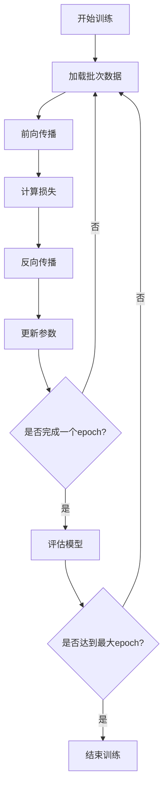

# 7.1 Trainer架构：训练流程的统一管理

> "设计精良的训练架构，如同一位经验丰富的教练，能够统筹训练过程的每一个细节，让深度学习模型在最优的指导下成长。"

训练引擎是深度学习框架的核心组件之一，它负责协调数据、模型、优化器、损失函数等各个组件，确保训练过程的高效执行。在TinyAI框架中，我们将设计一个功能完善、架构清晰的Trainer系统，为各种深度学习任务提供统一的训练管理平台。

## 7.1.1 训练循环的标准化设计

深度学习的训练过程本质上是一个重复的循环：前向传播 → 损失计算 → 反向传播 → 参数更新。让我们首先理解这个循环的核心逻辑，然后设计一个通用的Trainer架构。

### 训练循环的基本流程



基于TinyAI现有的架构，我们可以看到训练的核心组件已经存在：

```java
/**
 * TinyAI训练器架构设计
 * 
 * 该类整合了TinyAI框架中的各个训练组件，提供统一的训练管理接口
 */
public class Trainer {
    // 核心训练组件
    private DataSet dataSet;        // 数据集
    private Model model;            // 模型
    private Loss loss;              // 损失函数
    private Optimizer optimizer;    // 优化器
    private Monitor monitor;        // 训练监控器
    private Evaluator evaluator;    // 模型评估器
    
    // 训练配置
    private int maxEpoch;          // 最大训练轮数
    private TrainingState state;   // 训练状态管理
    
    // 并行训练支持
    private boolean enableParallelTraining;
    private int parallelThreadCount;
    private ExecutorService executorService;
}
```

### 训练状态管理系统

在实际的训练过程中，我们需要维护训练的状态信息，包括当前epoch、损失历史、学习率等。让我们设计一个专门的状态管理类：

```java
/**
 * 训练状态管理类
 * 
 * 负责维护训练过程中的所有状态信息，支持训练的暂停、恢复和检查点保存
 */
public class TrainingState {
    private int currentEpoch;                    // 当前训练轮数
    private int totalBatches;                    // 总批次数
    private int currentBatch;                    // 当前批次
    private long startTime;                      // 训练开始时间
    private long epochStartTime;                 // 当前epoch开始时间
    
    // 训练历史记录
    private List<Float> lossHistory;             // 损失历史
    private List<Float> accuracyHistory;         // 准确率历史
    private List<Long> epochTimeHistory;         // 每个epoch的训练时间
    
    // 最佳模型记录
    private float bestLoss = Float.MAX_VALUE;    // 最佳损失值
    private float bestAccuracy = 0.0f;           // 最佳准确率
    private int bestEpoch = 0;                   // 最佳模型对应的epoch
    
    /**
     * 开始新的训练轮次
     */
    public void startNewEpoch(int epoch) {
        this.currentEpoch = epoch;
        this.epochStartTime = System.currentTimeMillis();
        this.currentBatch = 0;
        
        System.out.printf("=== Epoch %d 开始 ===\n", epoch + 1);
    }
    
    /**
     * 结束当前训练轮次
     */
    public void endEpoch(float loss, float accuracy) {
        long epochTime = System.currentTimeMillis() - epochStartTime;
        
        // 记录历史
        lossHistory.add(loss);
        accuracyHistory.add(accuracy);
        epochTimeHistory.add(epochTime);
        
        // 更新最佳记录
        if (loss < bestLoss) {
            bestLoss = loss;
            bestAccuracy = accuracy;
            bestEpoch = currentEpoch;
        }
        
        System.out.printf("Epoch %d 完成 - 损失: %.6f, 准确率: %.4f, 耗时: %dms\n",
                         currentEpoch + 1, loss, accuracy, epochTime);
    }
    
    /**
     * 保存训练检查点
     */
    public void saveCheckpoint(String path) {
        Map<String, Object> checkpoint = new HashMap<>();
        checkpoint.put("epoch", currentEpoch);
        checkpoint.put("loss_history", lossHistory);
        checkpoint.put("accuracy_history", accuracyHistory);
        checkpoint.put("best_loss", bestLoss);
        checkpoint.put("best_accuracy", bestAccuracy);
        checkpoint.put("best_epoch", bestEpoch);
        
        System.out.println("检查点已保存到: " + path);
    }
}
```

## 7.1.2 统一的训练接口设计

为了提供清晰、易用的API，我们需要设计一套标准的训练接口。这个接口应该足够灵活，能够适应不同的训练场景。

```java
/**
 * 训练器核心实现
 * 
 * 提供统一的训练管理接口，支持单线程和并行训练模式
 */
public class Trainer {
    
    /**
     * 训练器初始化
     * 
     * @param dataSet 训练数据集
     * @param model 待训练模型
     * @param loss 损失函数
     * @param optimizer 优化器
     */
    public void init(DataSet dataSet, Model model, Loss loss, Optimizer optimizer) {
        this.dataSet = dataSet;
        this.model = model;
        this.loss = loss;
        this.optimizer = optimizer;
        this.state = new TrainingState();
        
        // 验证组件兼容性
        validateComponents();
        
        // 初始化监控器
        if (monitor != null) {
            monitor.init(maxEpoch);
        }
        
        System.out.println("训练器初始化完成");
        System.out.printf("模型: %s, 参数量: %d\n", 
                         model.getName(), model.getParameterCount());
        System.out.printf("数据集大小: %d, 批次数: %d\n", 
                         dataSet.getSize(), dataSet.getBatches().size());
    }
    
    /**
     * 开始训练
     * 
     * @param verbose 是否显示详细信息
     * @return 训练结果
     */
    public TrainingResult train(boolean verbose) {
        state.startTraining();
        
        try {
            for (int epoch = 0; epoch < maxEpoch; epoch++) {
                trainOneEpoch(epoch, verbose);
                
                // 模型评估
                if (evaluator != null) {
                    float accuracy = evaluator.evaluate();
                    state.recordAccuracy(accuracy);
                }
                
                // 检查早停条件
                if (shouldEarlyStop()) {
                    System.out.println("满足早停条件，提前结束训练");
                    break;
                }
            }
        } catch (Exception e) {
            System.err.println("训练过程中发生错误: " + e.getMessage());
            throw new RuntimeException("训练失败", e);
        }
        
        return generateTrainingResult();
    }
    
    /**
     * 训练单个epoch
     */
    private void trainOneEpoch(int epoch, boolean verbose) {
        state.startNewEpoch(epoch);
        float epochLoss = 0.0f;
        int batchCount = 0;
        
        // 获取批次数据
        List<Batch> batches = dataSet.getBatches();
        
        for (Batch batch : batches) {
            float batchLoss = trainOneBatch(batch, verbose);
            epochLoss += batchLoss;
            batchCount++;
            
            state.currentBatch = batchCount;
            
            if (verbose && batchCount % 50 == 0) {
                System.out.printf("  批次 %d/%d, 当前损失: %.6f\n", 
                                 batchCount, batches.size(), batchLoss);
            }
        }
        
        float avgLoss = epochLoss / batchCount;
        state.endEpoch(avgLoss, 0.0f); // 准确率在评估阶段计算
        
        // 更新监控器
        if (monitor != null) {
            monitor.collectInfo(avgLoss);
            monitor.printTrainInfo();
        }
    }
    
    /**
     * 训练单个批次
     */
    private float trainOneBatch(Batch batch, boolean verbose) {
        // 准备输入数据
        Variable input = batch.toVariableX().setRequireGrad(false);
        Variable target = batch.toVariableY().setRequireGrad(false);
        
        // 前向传播
        Variable prediction = model.forward(input);
        
        // 计算损失
        Variable lossVar = loss.loss(target, prediction);
        float lossValue = lossVar.getValue().getNumber().floatValue();
        
        // 清空梯度
        model.clearGrads();
        
        // 反向传播
        lossVar.backward();
        
        // 参数更新
        optimizer.update();
        
        // 断开计算图连接，释放内存
        lossVar.unChainBackward();
        
        return lossValue;
    }
}
```

### 组件兼容性验证

为了确保训练过程的稳定性，我们需要在训练开始前验证各个组件之间的兼容性：

```java
/**
 * 验证训练组件的兼容性
 */
private void validateComponents() {
    // 验证数据集
    if (dataSet == null || dataSet.getBatches().isEmpty()) {
        throw new IllegalArgumentException("数据集不能为空");
    }
    
    // 验证模型
    if (model == null) {
        throw new IllegalArgumentException("模型不能为空");
    }
    
    // 验证损失函数
    if (loss == null) {
        throw new IllegalArgumentException("损失函数不能为空");
    }
    
    // 验证优化器
    if (optimizer == null) {
        throw new IllegalArgumentException("优化器不能为空");
    }
    
    // 验证数据维度兼容性
    Batch sampleBatch = dataSet.getBatches().get(0);
    Variable sampleInput = sampleBatch.toVariableX();
    
    try {
        Variable sampleOutput = model.forward(sampleInput);
        Variable sampleTarget = sampleBatch.toVariableY();
        
        // 验证输出和目标的维度匹配
        if (!isShapeCompatible(sampleOutput.getValue().getShape(), 
                              sampleTarget.getValue().getShape())) {
            throw new IllegalArgumentException(
                String.format("模型输出维度 %s 与目标维度 %s 不匹配",
                            sampleOutput.getValue().getShape(),
                            sampleTarget.getValue().getShape()));
        }
        
        System.out.println("组件兼容性验证通过");
    } catch (Exception e) {
        throw new RuntimeException("组件兼容性验证失败: " + e.getMessage(), e);
    }
}
```

## 7.1.3 实践项目：构建简单的训练器

让我们通过一个实际的例子来演示如何使用我们设计的Trainer架构：

```java
/**
 * 简单训练器示例
 * 
 * 演示如何使用TinyAI训练器进行MNIST数字识别
 */
public class TrainerExample {
    
    public static void main(String[] args) {
        // 1. 准备数据
        int batchSize = 32;
        DataSet dataSet = new MnistDataSet(batchSize);
        
        // 2. 创建模型
        Block mlpBlock = new MlpBlock("mnist_mlp", batchSize, 
                                     Config.ActiveFunc.ReLU, 
                                     784, 128, 64, 10);
        Model model = new Model("MNIST_Classifier", mlpBlock);
        
        // 3. 配置训练组件
        Loss loss = new SoftmaxCrossEntropy();
        Optimizer optimizer = new Adam(model, 0.001f);
        Monitor monitor = new Monitor("training_log.txt");
        Evaluator evaluator = new AccuracyEval(new Classify(), model, dataSet);
        
        // 4. 创建训练器
        Trainer trainer = new Trainer(50, monitor, evaluator);
        
        // 5. 初始化并开始训练
        trainer.init(dataSet, model, loss, optimizer);
        TrainingResult result = trainer.train(true);
        
        // 6. 查看训练结果
        System.out.println("训练完成！");
        System.out.printf("最终准确率: %.4f\n", result.getFinalAccuracy());
        System.out.printf("最佳准确率: %.4f (第 %d 轮)\n", 
                         result.getBestAccuracy(), result.getBestEpoch());
    }
}
```

## 本节总结

在本节中，我们设计了TinyAI框架的训练器架构，主要包括：

1. **标准化的训练循环**：定义了前向传播、损失计算、反向传播、参数更新的标准流程
2. **训练状态管理**：实现了完整的状态跟踪和检查点保存机制
3. **统一的训练接口**：提供了简洁易用的API，支持多种训练场景
4. **组件兼容性验证**：确保各组件之间的正确匹配

这个架构为后续章节中讨论的优化器、学习率调度、训练监控等功能提供了坚实的基础。在下一节中，我们将深入探讨优化器的实现细节。