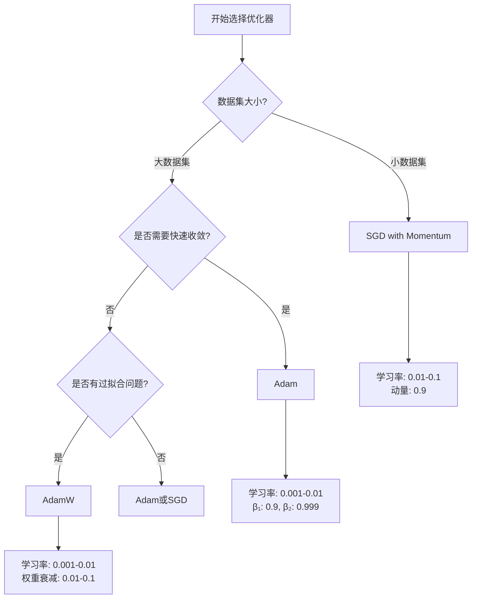

# 7.2 优化器家族：SGD、Adam与AdamW

> "优化器是深度学习的指南针，它们指引着模型参数在损失函数的复杂地形中找到最优路径。每一种优化算法都有其独特的导航策略，适应不同的学习场景。"

在深度学习中，优化器负责根据损失函数的梯度信息来更新模型参数，其选择和配置直接影响模型的训练效果和收敛速度。本节将深入探讨三种最重要的优化器：SGD、Adam和AdamW，理解它们的数学原理、实现细节以及应用场景。

## 7.2.1 随机梯度下降（SGD）：经典而强大

SGD（Stochastic Gradient Descent）是最基础也是最重要的优化算法。虽然算法简单，但其变种（特别是带动量的SGD）在许多场景下仍然是最优选择。

### SGD的数学原理

标准SGD的更新公式非常简单：

```
θ = θ - η * ∇J(θ)
```

其中：
- θ 是模型参数
- η 是学习率
- ∇J(θ) 是损失函数关于参数的梯度

### 动量SGD的改进

标准SGD的问题在于可能在损失函数的峡谷中震荡，收敛缓慢。动量SGD通过引入历史梯度信息来解决这个问题：

```
v = β * v + (1 - β) * ∇J(θ)
θ = θ - η * v
```

让我们在TinyAI框架中实现一个完整的SGD优化器：

```java
/**
 * SGD优化器实现
 * 
 * 支持标准SGD和带动量的SGD，以及权重衰减等功能
 */
public class SGDOptimizer extends Optimizer {
    
    private float learningRate;              // 学习率
    private float momentum;                  // 动量系数
    private float weightDecay;               // 权重衰减系数
    private boolean nesterov;                // 是否使用Nesterov动量
    
    // 动量缓存：参数名 -> 动量值
    private Map<String, NdArray> momentumCache;
    
    /**
     * 构造函数
     * 
     * @param target 目标模型
     * @param learningRate 学习率
     * @param momentum 动量系数 (0.0 表示不使用动量)
     * @param weightDecay 权重衰减系数
     * @param nesterov 是否使用Nesterov动量
     */
    public SGDOptimizer(Model target, float learningRate, float momentum, 
                       float weightDecay, boolean nesterov) {
        super(target);
        this.learningRate = learningRate;
        this.momentum = momentum;
        this.weightDecay = weightDecay;
        this.nesterov = nesterov;
        this.momentumCache = new HashMap<>();
        
        System.out.printf("SGD优化器初始化: lr=%.4f, momentum=%.2f, decay=%.6f, nesterov=%b\n",
                         learningRate, momentum, weightDecay, nesterov);
    }
    
    /**
     * 简化构造函数（仅学习率）
     */
    public SGDOptimizer(Model target, float learningRate) {
        this(target, learningRate, 0.0f, 0.0f, false);
    }
    
    /**
     * 带动量的构造函数
     */
    public SGDOptimizer(Model target, float learningRate, float momentum) {
        this(target, learningRate, momentum, 0.0f, false);
    }
    
    @Override
    public void updateOne(Parameter parameter) {
        String paramName = getParameterName(parameter);
        
        // 检查梯度是否存在
        if (parameter.getGrad() == null) {
            return;
        }
        
        NdArray grad = parameter.getGrad().copy(); // 复制梯度，避免修改原始梯度
        
        // 应用权重衰减
        if (weightDecay > 0.0f) {
            grad = grad.add(parameter.getValue().mulNum(weightDecay));
        }
        
        // 应用动量
        if (momentum > 0.0f) {
            NdArray velocity = momentumCache.get(paramName);
            
            if (velocity == null) {
                // 首次更新，初始化动量
                velocity = grad.copy();
                momentumCache.put(paramName, velocity);
            } else {
                // 更新动量：v = β * v + g
                velocity = velocity.mulNum(momentum).add(grad);
                momentumCache.put(paramName, velocity);
            }
            
            // 选择更新方式
            if (nesterov) {
                // Nesterov动量：θ = θ - η * (β * v + g)
                NdArray update = velocity.mulNum(momentum).add(grad).mulNum(learningRate);
                parameter.setValue(parameter.getValue().sub(update));
            } else {
                // 标准动量：θ = θ - η * v
                parameter.setValue(parameter.getValue().sub(velocity.mulNum(learningRate)));
            }
        } else {
            // 标准SGD：θ = θ - η * g
            parameter.setValue(parameter.getValue().sub(grad.mulNum(learningRate)));
        }
    }
    
    /**
     * 获取参数的唯一标识名
     */
    private String getParameterName(Parameter parameter) {
        // 这里可以根据实际需要实现参数名获取逻辑
        return Integer.toString(parameter.hashCode());
    }
    
    /**
     * 清空动量缓存
     */
    public void resetMomentum() {
        momentumCache.clear();
        System.out.println("SGD动量缓存已清空");
    }
    
    /**
     * 获取当前学习率
     */
    public float getLearningRate() {
        return learningRate;
    }
    
    /**
     * 动态调整学习率
     */
    public void setLearningRate(float newLearningRate) {
        this.learningRate = newLearningRate;
        System.out.printf("学习率已调整为: %.6f\n", newLearningRate);
    }
}
```

## 7.2.2 Adam优化器：自适应学习的艺术

Adam（Adaptive Moment Estimation）结合了动量方法和自适应学习率的优点，是目前最流行的优化算法之一。

### Adam的数学原理

Adam维护两个移动平均：
1. **一阶矩估计**（动量）：`m_t = β₁ * m_{t-1} + (1 - β₁) * g_t`
2. **二阶矩估计**（梯度平方）：`v_t = β₂ * v_{t-1} + (1 - β₂) * g_t²`

然后进行偏差校正并更新参数：
```
m̂_t = m_t / (1 - β₁^t)
v̂_t = v_t / (1 - β₂^t)
θ_t = θ_{t-1} - η * m̂_t / (√v̂_t + ε)
```

### TinyAI中的Adam实现

让我们基于现有的Adam类进行扩展和优化：

```java
/**
 * Adam优化器增强实现
 * 
 * 实现完整的Adam算法，包括偏差校正、数值稳定性处理等
 */
public class AdamOptimizer extends Optimizer {
    
    private float learningRate = 0.001f;    // 学习率
    private float beta1 = 0.9f;            // 一阶矩衰减率
    private float beta2 = 0.999f;          // 二阶矩衰减率
    private float epsilon = 1e-4f;         // 数值稳定性常数
    private float weightDecay = 0.0f;      // 权重衰减
    
    // 动量缓存
    private Map<String, NdArray> firstMomentCache;  // 一阶矩 m
    private Map<String, NdArray> secondMomentCache; // 二阶矩 v
    
    private int timeStep = 0;              // 时间步计数器
    
    /**
     * 完整构造函数
     */
    public AdamOptimizer(Model target, float learningRate, float beta1, 
                        float beta2, float epsilon, float weightDecay) {
        super(target);
        this.learningRate = learningRate;
        this.beta1 = beta1;
        this.beta2 = beta2;
        this.epsilon = epsilon;
        this.weightDecay = weightDecay;
        
        this.firstMomentCache = new HashMap<>();
        this.secondMomentCache = new HashMap<>();
        
        System.out.printf("Adam优化器初始化: lr=%.4f, β₁=%.3f, β₂=%.3f, ε=%.0e\n",
                         learningRate, beta1, beta2, epsilon);
    }
    
    /**
     * 简化构造函数
     */
    public AdamOptimizer(Model target, float learningRate) {
        this(target, learningRate, 0.9f, 0.999f, 1e-4f, 0.0f);
    }
    
    /**
     * 使用TinyAI默认参数的构造函数
     */
    public AdamOptimizer(Model target) {
        this(target, 0.001f);
    }
    
    @Override
    public void update() {
        timeStep++; // 增加时间步
        super.update(); // 调用父类的批量更新方法
    }
    
    @Override
    public void updateOne(Parameter parameter) {
        String paramName = getParameterName(parameter);
        
        // 检查梯度
        if (parameter.getGrad() == null) {
            return;
        }
        
        NdArray grad = parameter.getGrad().copy();
        
        // 应用权重衰减
        if (weightDecay > 0.0f) {
            grad = grad.add(parameter.getValue().mulNum(weightDecay));
        }
        
        // 获取或初始化动量缓存
        NdArray m = firstMomentCache.get(paramName);
        NdArray v = secondMomentCache.get(paramName);
        
        if (m == null) {
            m = NdArray.zeros(grad.getShape());
            v = NdArray.zeros(grad.getShape());
        }
        
        // 更新一阶矩和二阶矩
        m = m.mulNum(beta1).add(grad.mulNum(1 - beta1));
        v = v.mulNum(beta2).add(grad.square().mulNum(1 - beta2));
        
        // 偏差校正
        float beta1Power = (float) Math.pow(beta1, timeStep);
        float beta2Power = (float) Math.pow(beta2, timeStep);
        
        float biasCorrection1 = 1.0f - beta1Power;
        float biasCorrection2 = 1.0f - beta2Power;
        
        NdArray mHat = m.divNum(biasCorrection1);
        NdArray vHat = v.divNum(biasCorrection2);
        
        // 参数更新
        NdArray denominator = vHat.sqrt().addNum(epsilon);
        NdArray update = mHat.div(denominator).mulNum(learningRate);
        
        parameter.setValue(parameter.getValue().sub(update));
        
        // 保存更新后的动量
        firstMomentCache.put(paramName, m);
        secondMomentCache.put(paramName, v);
    }
    
    /**
     * 获取参数唯一标识
     */
    private String getParameterName(Parameter parameter) {
        return Integer.toString(parameter.hashCode());
    }
    
    /**
     * 重置优化器状态
     */
    public void reset() {
        firstMomentCache.clear();
        secondMomentCache.clear();
        timeStep = 0;
        System.out.println("Adam优化器状态已重置");
    }
    
    /**
     * 获取优化器统计信息
     */
    public void printStats() {
        System.out.printf("Adam统计: 时间步=%d, 缓存参数数=%d\n", 
                         timeStep, firstMomentCache.size());
        
        if (timeStep > 0) {
            float beta1Correction = 1.0f - (float) Math.pow(beta1, timeStep);
            float beta2Correction = 1.0f - (float) Math.pow(beta2, timeStep);
            System.out.printf("当前偏差校正系数: β₁=%.6f, β₂=%.6f\n", 
                             beta1Correction, beta2Correction);
        }
    }
}
```

## 7.2.3 AdamW：权重衰减的正确处理

AdamW是Adam的改进版本，主要解决了权重衰减在Adam中的实现问题。在标准Adam中，权重衰减被当作梯度的一部分，这会影响自适应学习率的计算。AdamW将权重衰减解耦，直接应用到参数更新中。

### AdamW的关键改进

AdamW的核心思想是将权重衰减从梯度计算中分离出来：

```java
/**
 * AdamW优化器实现
 * 
 * 解耦权重衰减的Adam优化器，提供更好的正则化效果
 */
public class AdamWOptimizer extends Optimizer {
    
    private float learningRate = 0.001f;
    private float beta1 = 0.9f;
    private float beta2 = 0.999f;
    private float epsilon = 1e-4f;
    private float weightDecay = 0.01f;     // AdamW中权重衰减通常设置为0.01
    
    private Map<String, NdArray> firstMomentCache;
    private Map<String, NdArray> secondMomentCache;
    private int timeStep = 0;
    
    /**
     * AdamW构造函数
     */
    public AdamWOptimizer(Model target, float learningRate, float beta1, 
                         float beta2, float epsilon, float weightDecay) {
        super(target);
        this.learningRate = learningRate;
        this.beta1 = beta1;
        this.beta2 = beta2;
        this.epsilon = epsilon;
        this.weightDecay = weightDecay;
        
        this.firstMomentCache = new HashMap<>();
        this.secondMomentCache = new HashMap<>();
        
        System.out.printf("AdamW优化器初始化: lr=%.4f, weight_decay=%.4f\n",
                         learningRate, weightDecay);
    }
    
    /**
     * 简化构造函数
     */
    public AdamWOptimizer(Model target, float learningRate, float weightDecay) {
        this(target, learningRate, 0.9f, 0.999f, 1e-4f, weightDecay);
    }
    
    @Override
    public void update() {
        timeStep++;
        super.update();
    }
    
    @Override
    public void updateOne(Parameter parameter) {
        String paramName = getParameterName(parameter);
        
        if (parameter.getGrad() == null) {
            return;
        }
        
        NdArray grad = parameter.getGrad(); // 注意：不包含权重衰减
        
        // 获取或初始化动量缓存
        NdArray m = firstMomentCache.get(paramName);
        NdArray v = secondMomentCache.get(paramName);
        
        if (m == null) {
            m = NdArray.zeros(grad.getShape());
            v = NdArray.zeros(grad.getShape());
        }
        
        // 更新动量（不包含权重衰减）
        m = m.mulNum(beta1).add(grad.mulNum(1 - beta1));
        v = v.mulNum(beta2).add(grad.square().mulNum(1 - beta2));
        
        // 偏差校正
        float biasCorrection1 = 1.0f - (float) Math.pow(beta1, timeStep);
        float biasCorrection2 = 1.0f - (float) Math.pow(beta2, timeStep);
        
        NdArray mHat = m.divNum(biasCorrection1);
        NdArray vHat = v.divNum(biasCorrection2);
        
        // AdamW的关键：分离权重衰减和梯度更新
        // 1. 梯度更新部分
        NdArray gradientUpdate = mHat.div(vHat.sqrt().addNum(epsilon));
        
        // 2. 权重衰减部分（直接应用到参数）
        NdArray weightDecayUpdate = parameter.getValue().mulNum(weightDecay);
        
        // 3. 组合更新
        NdArray totalUpdate = gradientUpdate.add(weightDecayUpdate).mulNum(learningRate);
        
        parameter.setValue(parameter.getValue().sub(totalUpdate));
        
        // 保存动量状态
        firstMomentCache.put(paramName, m);
        secondMomentCache.put(paramName, v);
    }
    
    private String getParameterName(Parameter parameter) {
        return Integer.toString(parameter.hashCode());
    }
    
    /**
     * 动态调整权重衰减
     */
    public void setWeightDecay(float newWeightDecay) {
        this.weightDecay = newWeightDecay;
        System.out.printf("权重衰减调整为: %.6f\n", newWeightDecay);
    }
    
    /**
     * 获取当前权重衰减值
     */
    public float getWeightDecay() {
        return weightDecay;
    }
}
```

## 7.2.4 优化器性能对比实验

为了更好地理解不同优化器的特性，让我们设计一个对比实验：

```java
/**
 * 优化器性能对比实验
 * 
 * 在相同的任务上比较SGD、Adam和AdamW的性能
 */
public class OptimizerComparison {
    
    public static void main(String[] args) {
        System.out.println("=== 优化器性能对比实验 ===\n");
        
        // 创建相同的数据集和模型架构
        DataSet dataSet = createTestDataSet();
        
        // 测试不同的优化器
        testSGD(dataSet);
        testAdam(dataSet);
        testAdamW(dataSet);
        
        System.out.println("实验完成！");
    }
    
    /**
     * 测试SGD优化器
     */
    private static void testSGD(DataSet dataSet) {
        System.out.println("1. 测试SGD优化器");
        System.out.println("-".repeat(40));
        
        // 创建模型
        Model model = createModel("SGD_Model");
        
        // 配置SGD优化器
        SGDOptimizer optimizer = new SGDOptimizer(model, 0.01f, 0.9f); // 学习率0.01，动量0.9
        
        // 训练并记录结果
        TrainingResult result = trainModel(model, optimizer, dataSet, "SGD");
        
        System.out.printf("SGD结果: 最终损失=%.6f, 最佳准确率=%.4f\n\n", 
                         result.getFinalLoss(), result.getBestAccuracy());
    }
    
    /**
     * 测试Adam优化器
     */
    private static void testAdam(DataSet dataSet) {
        System.out.println("2. 测试Adam优化器");
        System.out.println("-".repeat(40));
        
        Model model = createModel("Adam_Model");
        AdamOptimizer optimizer = new AdamOptimizer(model, 0.001f); // 学习率0.001
        
        TrainingResult result = trainModel(model, optimizer, dataSet, "Adam");
        
        System.out.printf("Adam结果: 最终损失=%.6f, 最佳准确率=%.4f\n\n", 
                         result.getFinalLoss(), result.getBestAccuracy());
    }
    
    /**
     * 测试AdamW优化器
     */
    private static void testAdamW(DataSet dataSet) {
        System.out.println("3. 测试AdamW优化器");
        System.out.println("-".repeat(40));
        
        Model model = createModel("AdamW_Model");
        AdamWOptimizer optimizer = new AdamWOptimizer(model, 0.001f, 0.01f); // 学习率0.001，权重衰减0.01
        
        TrainingResult result = trainModel(model, optimizer, dataSet, "AdamW");
        
        System.out.printf("AdamW结果: 最终损失=%.6f, 最佳准确率=%.4f\n\n", 
                         result.getFinalLoss(), result.getBestAccuracy());
    }
    
    /**
     * 创建测试模型
     */
    private static Model createModel(String name) {
        Block mlpBlock = new MlpBlock(name, 32, Config.ActiveFunc.ReLU, 
                                     784, 128, 64, 10);
        return new Model(name, mlpBlock);
    }
    
    /**
     * 创建测试数据集
     */
    private static DataSet createTestDataSet() {
        // 使用MNIST数据集进行测试
        return new MnistDataSet(32);
    }
    
    /**
     * 训练模型并返回结果
     */
    private static TrainingResult trainModel(Model model, Optimizer optimizer, 
                                           DataSet dataSet, String optimizerName) {
        // 配置训练组件
        Loss loss = new SoftmaxCrossEntropy();
        Monitor monitor = new Monitor();
        Evaluator evaluator = new AccuracyEval(new Classify(), model, dataSet);
        
        // 创建训练器
        Trainer trainer = new Trainer(20, monitor, evaluator); // 20个epoch
        
        // 训练模型
        trainer.init(dataSet, model, loss, optimizer);
        TrainingResult result = trainer.train(false); // 不显示详细日志
        
        System.out.printf("%s训练完成，耗时: %.2f秒\n", 
                         optimizerName, result.getTotalTrainingTime() / 1000.0);
        
        return result;
    }
}
```

## 7.2.5 优化器选择指南

不同的优化器适用于不同的场景，选择合适的优化器对训练成功至关重要：

### 选择决策树



### 实用建议

```java
/**
 * 优化器选择建议工具类
 */
public class OptimizerSelector {
    
    /**
     * 根据任务特征推荐优化器
     */
    public static Optimizer recommendOptimizer(Model model, DataSet dataSet, String taskType) {
        int dataSize = dataSet.getSize();
        int modelParams = model.getParameterCount();
        
        System.out.println("=== 优化器推荐系统 ===");
        System.out.printf("数据集大小: %d, 模型参数量: %d\n", dataSize, modelParams);
        System.out.printf("任务类型: %s\n", taskType);
        
        // 基于经验规则推荐
        if (dataSize < 10000) {
            // 小数据集推荐SGD
            System.out.println("推荐: SGD with Momentum（小数据集，更好的泛化能力）");
            return new SGDOptimizer(model, 0.01f, 0.9f);
            
        } else if (taskType.equals("vision") && modelParams > 1000000) {
            // 大型视觉模型推荐AdamW
            System.out.println("推荐: AdamW（大型视觉模型，防止过拟合）");
            return new AdamWOptimizer(model, 0.001f, 0.01f);
            
        } else if (taskType.equals("nlp")) {
            // NLP任务推荐AdamW
            System.out.println("推荐: AdamW（NLP任务的标准选择）");
            return new AdamWOptimizer(model, 0.001f, 0.01f);
            
        } else {
            // 默认推荐Adam
            System.out.println("推荐: Adam（通用性强，收敛快）");
            return new AdamOptimizer(model, 0.001f);
        }
    }
    
    /**
     * 优化器超参数调优建议
     */
    public static void printTuningTips(Optimizer optimizer) {
        System.out.println("\n=== 超参数调优建议 ===");
        
        if (optimizer instanceof SGDOptimizer) {
            System.out.println("SGD调优建议:");
            System.out.println("- 学习率: 从0.1开始，观察损失曲线");
            System.out.println("- 如果损失震荡，降低学习率");
            System.out.println("- 如果收敛太慢，增加学习率");
            System.out.println("- 动量: 0.9是很好的起始值");
            
        } else if (optimizer instanceof AdamOptimizer) {
            System.out.println("Adam调优建议:");
            System.out.println("- 学习率: 0.001是很好的起始值");
            System.out.println("- 如果收敛慢，可以尝试0.003或0.01");
            System.out.println("- β₁, β₂: 默认值0.9, 0.999通常不需要调整");
            System.out.println("- epsilon: 如果遇到数值问题，可以调整为1e-4");
            
        } else if (optimizer instanceof AdamWOptimizer) {
            System.out.println("AdamW调优建议:");
            System.out.println("- 学习率: 与Adam相同，从0.001开始");
            System.out.println("- 权重衰减: 0.01是常用值");
            System.out.println("- 对于大模型，可以尝试0.1的权重衰减");
            System.out.println("- 权重衰减比L2正则化效果更好");
        }
    }
}
```

## 本节总结

在本节中，我们深入探讨了三种重要的优化器：

1. **SGD**：经典而可靠，特别适合小数据集和需要良好泛化能力的场景
2. **Adam**：快速收敛，适用于大多数深度学习任务
3. **AdamW**：解耦权重衰减的Adam，特别适合大型模型和NLP任务

每种优化器都有其独特的优势和适用场景。在实际应用中，建议：
- 从Adam开始尝试，它通常能给出不错的结果
- 如果数据集较小或需要更好的泛化，考虑SGD
- 如果模型较大或有过拟合问题，选择AdamW

下一节我们将探讨学习率调度策略，进一步优化训练过程。