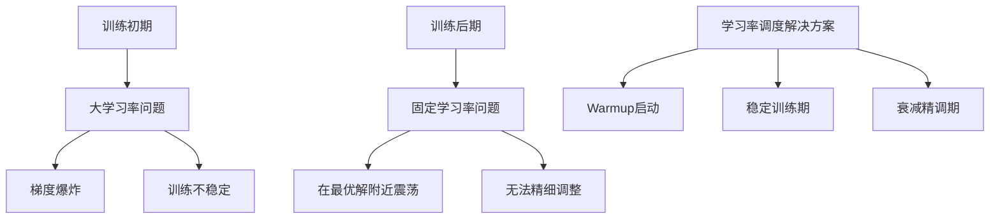

# 7.3 学习率调度：Warmup与衰减策略

> "学习率就像驾驶时的油门控制，开始时需要缓慢加速（warmup），稳定行驶时保持适中速度，在接近目标时逐渐减速（衰减），这样才能既快速又安全地到达终点。"

学习率是深度学习中最重要的超参数之一，它直接影响模型的收敛速度和最终性能。固定的学习率往往无法在整个训练过程中都保持最优，因此需要采用学习率调度策略来动态调整学习率。本节将深入探讨各种学习率调度方法，包括Warmup技术、各种衰减策略以及它们在TinyAI框架中的实现。

## 7.3.1 学习率调度的重要性

### 为什么需要学习率调度？

在训练初期，模型参数是随机初始化的，使用较大的学习率可能导致训练不稳定。随着训练的进行，我们希望学习率逐渐减小，以便更精细地调整参数，避免在最优解附近震荡。



### 学习率调度器抽象设计

让我们首先设计一个通用的学习率调度器接口：

```java
/**
 * 学习率调度器抽象基类
 * 
 * 定义了学习率调度的基本接口，支持各种调度策略
 */
public abstract class LRScheduler {
    
    protected float baseLearningRate;        // 基础学习率
    protected float currentLearningRate;     // 当前学习率
    protected int currentStep;               // 当前步数
    protected int totalSteps;                // 总步数
    protected Optimizer optimizer;           // 关联的优化器
    
    /**
     * 构造函数
     */
    public LRScheduler(Optimizer optimizer, float baseLearningRate, int totalSteps) {
        this.optimizer = optimizer;
        this.baseLearningRate = baseLearningRate;
        this.currentLearningRate = baseLearningRate;
        this.totalSteps = totalSteps;
        this.currentStep = 0;
    }
    
    /**
     * 计算当前步数对应的学习率
     */
    public abstract float calculateLearningRate();
    
    /**
     * 执行一步学习率更新
     */
    public void step() {
        currentStep++;
        currentLearningRate = calculateLearningRate();
        updateOptimizerLearningRate();
        
        if (currentStep % 100 == 0 || currentStep <= 10) {
            System.out.printf("Step %d/%d: 学习率 = %.6f\n", 
                             currentStep, totalSteps, currentLearningRate);
        }
    }
    
    /**
     * 更新优化器中的学习率
     */
    protected void updateOptimizerLearningRate() {
        if (optimizer instanceof SGDOptimizer) {
            ((SGDOptimizer) optimizer).setLearningRate(currentLearningRate);
        }
        // 可以扩展支持其他优化器
    }
    
    public float getCurrentLearningRate() {
        return currentLearningRate;
    }
    
    public int getCurrentStep() {
        return currentStep;
    }
}
```

## 7.3.2 Warmup预热机制

Warmup是一种在训练初期逐渐增加学习率的技术，特别适用于大批次训练和Transformer等复杂模型。

### 线性Warmup实现

```java
/**
 * 线性Warmup学习率调度器
 * 
 * 在warmup期间线性增加学习率，达到目标学习率后保持不变或应用其他衰减策略
 */
public class LinearWarmupScheduler extends LRScheduler {
    
    private int warmupSteps;                 // Warmup步数
    private float warmupStartLR;             // Warmup起始学习率
    private LRScheduler postWarmupScheduler; // Warmup后的调度器
    
    /**
     * 构造函数
     */
    public LinearWarmupScheduler(Optimizer optimizer, float baseLearningRate, 
                               int totalSteps, int warmupSteps, float warmupStartLR) {
        super(optimizer, baseLearningRate, totalSteps);
        this.warmupSteps = warmupSteps;
        this.warmupStartLR = warmupStartLR;
        this.currentLearningRate = warmupStartLR;
        
        System.out.printf("线性Warmup调度器: 起始LR=%.6f, 目标LR=%.6f, Warmup步数=%d\n",
                         warmupStartLR, baseLearningRate, warmupSteps);
    }
    
    /**
     * 设置Warmup后的调度器
     */
    public void setPostWarmupScheduler(LRScheduler scheduler) {
        this.postWarmupScheduler = scheduler;
    }
    
    @Override
    public float calculateLearningRate() {
        if (currentStep <= warmupSteps) {
            // Warmup阶段：线性增加
            float progress = (float) currentStep / warmupSteps;
            return warmupStartLR + (baseLearningRate - warmupStartLR) * progress;
        } else {
            // Warmup后阶段
            if (postWarmupScheduler != null) {
                int adjustedStep = currentStep - warmupSteps;
                postWarmupScheduler.currentStep = adjustedStep;
                return postWarmupScheduler.calculateLearningRate();
            } else {
                return baseLearningRate;
            }
        }
    }
    
    public boolean isInWarmup() {
        return currentStep <= warmupSteps;
    }
}
```

## 7.3.3 经典衰减策略

### 阶梯衰减（Step Decay）

```java
/**
 * 阶梯衰减学习率调度器
 */
public class StepLRScheduler extends LRScheduler {
    
    private int stepSize;          // 衰减间隔
    private float gamma;           // 衰减系数
    
    public StepLRScheduler(Optimizer optimizer, float baseLearningRate, 
                          int stepSize, float gamma) {
        super(optimizer, baseLearningRate, Integer.MAX_VALUE);
        this.stepSize = stepSize;
        this.gamma = gamma;
        
        System.out.printf("阶梯衰减调度器: stepSize=%d, gamma=%.3f\n", stepSize, gamma);
    }
    
    @Override
    public float calculateLearningRate() {
        int decayCount = currentStep / stepSize;
        return baseLearningRate * (float) Math.pow(gamma, decayCount);
    }
}
```

### 余弦退火（Cosine Annealing）

```java
/**
 * 余弦退火学习率调度器
 */
public class CosineAnnealingLRScheduler extends LRScheduler {
    
    private float minLearningRate;    // 最小学习率
    
    public CosineAnnealingLRScheduler(Optimizer optimizer, float maxLearningRate, 
                                     float minLearningRate, int totalSteps) {
        super(optimizer, maxLearningRate, totalSteps);
        this.minLearningRate = minLearningRate;
        
        System.out.printf("余弦退火调度器: max_lr=%.6f, min_lr=%.6f, steps=%d\n",
                         maxLearningRate, minLearningRate, totalSteps);
    }
    
    @Override
    public float calculateLearningRate() {
        float progress = (float) currentStep / totalSteps;
        progress = Math.min(progress, 1.0f);
        
        return minLearningRate + (baseLearningRate - minLearningRate) * 
               0.5f * (1.0f + (float) Math.cos(Math.PI * progress));
    }
}
```

## 7.3.4 组合调度策略

```java
/**
 * 组合学习率调度器
 * 
 * 支持将多个调度策略组合使用，如Warmup + 余弦衰减
 */
public class CombinedLRScheduler extends LRScheduler {
    
    private LinearWarmupScheduler warmupScheduler;
    private CosineAnnealingLRScheduler cosineScheduler;
    
    /**
     * Warmup + 余弦退火组合
     */
    public CombinedLRScheduler(Optimizer optimizer, float maxLearningRate, 
                              float minLearningRate, int totalSteps, 
                              int warmupSteps) {
        super(optimizer, maxLearningRate, totalSteps);
        
        // 创建Warmup调度器
        warmupScheduler = new LinearWarmupScheduler(
            optimizer, maxLearningRate, totalSteps, warmupSteps, 0.0f);
        
        // 创建余弦退火调度器
        int postWarmupSteps = totalSteps - warmupSteps;
        cosineScheduler = new CosineAnnealingLRScheduler(
            optimizer, maxLearningRate, minLearningRate, postWarmupSteps);
        
        warmupScheduler.setPostWarmupScheduler(cosineScheduler);
        
        System.out.printf("组合调度器: Warmup(%d步) + 余弦退火(%d步)\n", 
                         warmupSteps, postWarmupSteps);
    }
    
    @Override
    public float calculateLearningRate() {
        return warmupScheduler.calculateLearningRate();
    }
    
    @Override
    public void step() {
        warmupScheduler.step();
        this.currentStep = warmupScheduler.getCurrentStep();
        this.currentLearningRate = warmupScheduler.getCurrentLearningRate();
    }
    
    public String getCurrentPhase() {
        if (warmupScheduler.isInWarmup()) {
            return "Warmup";
        } else {
            return "CosineAnnealing";
        }
    }
}
```

## 7.3.5 学习率调度器应用示例

```java
/**
 * 学习率调度器应用示例
 */
public class LRSchedulerExample {
    
    public static void main(String[] args) {
        System.out.println("=== 学习率调度器应用示例 ===\n");
        
        testLinearWarmup();
        testCosineAnnealing();
        testCombinedScheduler();
    }
    
    private static void testLinearWarmup() {
        System.out.println("1. 测试线性Warmup调度器");
        System.out.println("-".repeat(40));
        
        Model model = createTestModel();
        SGDOptimizer optimizer = new SGDOptimizer(model, 0.1f);
        
        LinearWarmupScheduler scheduler = new LinearWarmupScheduler(
            optimizer, 0.1f, 1000, 100, 0.01f);
        
        simulateTraining(scheduler, 200, "LinearWarmup");
        System.out.println();
    }
    
    private static void testCosineAnnealing() {
        System.out.println("2. 测试余弦退火调度器");
        System.out.println("-".repeat(40));
        
        Model model = createTestModel();
        AdamOptimizer optimizer = new AdamOptimizer(model, 0.001f);
        
        CosineAnnealingLRScheduler scheduler = new CosineAnnealingLRScheduler(
            optimizer, 0.001f, 0.00001f, 1000);
        
        simulateTraining(scheduler, 200, "CosineAnnealing");
        System.out.println();
    }
    
    private static void testCombinedScheduler() {
        System.out.println("3. 测试组合调度器（Warmup + 余弦退火）");
        System.out.println("-".repeat(40));
        
        Model model = createTestModel();
        AdamOptimizer optimizer = new AdamOptimizer(model, 0.001f);
        
        CombinedLRScheduler scheduler = new CombinedLRScheduler(
            optimizer, 0.001f, 0.00001f, 1000, 100);
        
        simulateTraining(scheduler, 200, "Combined");
        System.out.println();
    }
    
    private static void simulateTraining(LRScheduler scheduler, int steps, String name) {
        System.out.printf("开始%s调度器模拟训练...\n", name);
        
        for (int step = 0; step < steps; step++) {
            scheduler.step();
            
            if (step % 50 == 0 || step < 10) {
                System.out.printf("  Step %d: LR = %.6f\n", 
                                 step + 1, scheduler.getCurrentLearningRate());
            }
        }
        
        System.out.printf("%s调度器测试完成\n", name);
    }
    
    private static Model createTestModel() {
        Block mlpBlock = new MlpBlock("test_model", 16, Config.ActiveFunc.ReLU, 
                                     10, 20, 5);
        return new Model("TestModel", mlpBlock);
    }
}
```

## 7.3.6 选择指南和最佳实践

### 调度器选择决策树

1. **Transformer模型**：推荐Warmup + 余弦退火
2. **大规模视觉任务**：推荐阶梯衰减
3. **小数据集**：推荐较保守的调度策略
4. **快速实验**：从余弦退火开始

### 超参数调优建议

- **Warmup步数**：通常设为总步数的5-10%
- **最小学习率**：设为最大学习率的1/100到1/1000
- **衰减系数**：阶梯衰减中常用0.1，指数衰减中常用0.95-0.99

## 本节总结

学习率调度是训练成功的关键因素之一。本节介绍了：

1. **Warmup技术**：解决训练初期的不稳定问题
2. **各种衰减策略**：阶梯衰减、指数衰减、余弦退火等
3. **组合策略**：将多种调度方法有机结合
4. **实际应用**：完整的代码示例和选择指南

合理的学习率调度能够显著提升模型的训练效果和最终性能。在下一节中，我们将探讨训练监控和可视化技术。