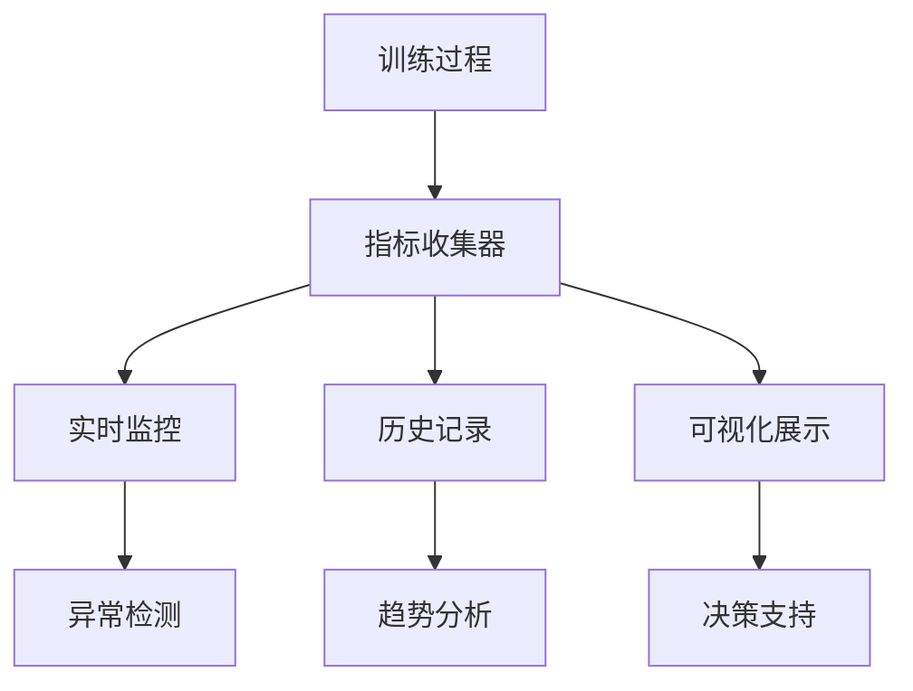

# 7.4 训练监控：损失曲线与指标可视化

> "监控是训练过程的眼睛，通过实时观察损失曲线和性能指标，我们能够及时发现问题、调整策略，确保模型朝着正确的方向前进。"

训练监控是深度学习项目成功的关键环节。通过实时收集和可视化训练过程中的各种指标，我们能够：及时发现过拟合、欠拟合等问题，调整超参数，评估模型性能，做出训练策略决策。本节将详细介绍如何在TinyAI框架中构建完整的训练监控系统。

## 7.4.1 训练监控系统架构

### 监控系统设计原则



### 核心监控组件

基于TinyAI现有的Monitor类，我们来扩展一个更强大的监控系统：

```java
/**
 * 增强型训练监控器
 * 
 * 提供全面的训练过程监控，包括损失、准确率、学习率、梯度等指标
 */
public class EnhancedMonitor extends Monitor {
    
    // 扩展的监控指标
    private List<Float> learningRateHistory;      // 学习率历史
    private List<Float> gradientNormHistory;      // 梯度范数历史
    private List<Integer> epochDurationHistory;   // 每轮训练时间
    private List<Float> memoryUsageHistory;       // 内存使用历史
    
    // 验证集指标
    private List<Float> valLossHistory;           // 验证集损失
    private List<Float> valAccuracyHistory;       // 验证集准确率
    
    // 实时监控配置
    private boolean enableRealTimeVisualization = true;
    private int visualizationUpdateInterval = 10;  // 每10个epoch更新一次可视化
    
    // 异常检测
    private float lossAnomalyThreshold = 10.0f;   // 损失异常阈值
    private float gradientAnomalyThreshold = 100.0f; // 梯度异常阈值
    
    /**
     * 构造函数
     */
    public EnhancedMonitor(String logFilePath) {
        super(logFilePath);
        initializeExtendedMetrics();
    }
    
    public EnhancedMonitor() {
        super();
        initializeExtendedMetrics();
    }
    
    private void initializeExtendedMetrics() {
        this.learningRateHistory = new ArrayList<>();
        this.gradientNormHistory = new ArrayList<>();
        this.epochDurationHistory = new ArrayList<>();
        this.memoryUsageHistory = new ArrayList<>();
        this.valLossHistory = new ArrayList<>();
        this.valAccuracyHistory = new ArrayList<>();
    }
    
    /**
     * 收集学习率信息
     */
    public void collectLearningRate(float learningRate) {
        learningRateHistory.add(learningRate);
    }
    
    /**
     * 收集梯度信息
     */
    public void collectGradientNorm(float gradientNorm) {
        gradientNormHistory.add(gradientNorm);
        
        // 梯度异常检测
        if (gradientNorm > gradientAnomalyThreshold) {
            System.err.printf("⚠️ 梯度异常: %.2f (阈值: %.2f)\n", 
                             gradientNorm, gradientAnomalyThreshold);
        }
    }
    
    /**
     * 收集内存使用信息
     */
    public void collectMemoryUsage() {
        Runtime runtime = Runtime.getRuntime();
        long totalMemory = runtime.totalMemory();
        long freeMemory = runtime.freeMemory();
        float usedMemoryMB = (totalMemory - freeMemory) / 1024.0f / 1024.0f;
        
        memoryUsageHistory.add(usedMemoryMB);
    }
    
    /**
     * 收集验证集指标
     */
    public void collectValidationMetrics(float valLoss, float valAccuracy) {
        valLossHistory.add(valLoss);
        valAccuracyHistory.add(valAccuracy);
    }
    
    /**
     * 扩展的信息打印
     */
    @Override
    public void printTrainInfo() {
        super.printTrainInfo();
        
        // 打印扩展信息
        if (!learningRateHistory.isEmpty() && learningRateHistory.size() > index) {
            System.out.printf("    学习率: %.6f", learningRateHistory.get(index));
        }
        
        if (!gradientNormHistory.isEmpty() && gradientNormHistory.size() > index) {
            System.out.printf(", 梯度范数: %.4f", gradientNormHistory.get(index));
        }
        
        if (!memoryUsageHistory.isEmpty() && memoryUsageHistory.size() > index) {
            System.out.printf(", 内存: %.1fMB", memoryUsageHistory.get(index));
        }
        
        System.out.println();
    }
    
    /**
     * 打印验证集信息
     */
    public void printValidationInfo() {
        if (!valLossHistory.isEmpty() && valLossHistory.size() > index) {
            System.out.printf("    验证集 - 损失: %.6f", valLossHistory.get(index));
        }
        
        if (!valAccuracyHistory.isEmpty() && valAccuracyHistory.size() > index) {
            System.out.printf(", 准确率: %.4f", valAccuracyHistory.get(index));
        }
        
        System.out.println();
    }
    
    /**
     * 异常检测
     */
    public boolean detectAnomalies() {
        if (lossList.isEmpty()) return false;
        
        float currentLoss = lossList.get(lossList.size() - 1);
        
        // 检测损失异常
        if (Float.isNaN(currentLoss) || Float.isInfinite(currentLoss) || 
            currentLoss > lossAnomalyThreshold) {
            System.err.printf("❌ 损失异常检测: %.6f\n", currentLoss);
            return true;
        }
        
        // 检测损失爆炸
        if (lossList.size() > 1) {
            float prevLoss = lossList.get(lossList.size() - 2);
            if (currentLoss > prevLoss * 2.0f && currentLoss > 1.0f) {
                System.err.printf("❌ 损失爆炸检测: %.6f -> %.6f\n", prevLoss, currentLoss);
                return true;
            }
        }
        
        return false;
    }
}
```

## 7.4.2 指标可视化系统

### 实时损失曲线

```java
/**
 * 训练可视化器
 * 
 * 负责生成各种训练过程的可视化图表
 */
public class TrainingVisualizer {
    
    private Plot plot;
    private boolean realTimeMode;
    
    public TrainingVisualizer(boolean realTimeMode) {
        this.plot = new Plot();
        this.realTimeMode = realTimeMode;
    }
    
    /**
     * 绘制损失曲线
     */
    public void plotLossCurves(EnhancedMonitor monitor) {
        List<Float> trainLoss = monitor.getLossList();
        List<Float> valLoss = monitor.getValLossList();
        
        if (!trainLoss.isEmpty()) {
            float[] epochs = generateEpochArray(trainLoss.size());
            float[] lossArray = listToArray(trainLoss);
            
            plot.line(epochs, lossArray, "训练损失");
        }
        
        if (!valLoss.isEmpty()) {
            float[] epochs = generateEpochArray(valLoss.size());
            float[] valLossArray = listToArray(valLoss);
            
            plot.line(epochs, valLossArray, "验证损失");
        }
        
        plot.xlabel("Epoch");
        plot.ylabel("Loss");
        plot.title("损失曲线");
        plot.legend();
        plot.show();
    }
    
    /**
     * 绘制准确率曲线
     */
    public void plotAccuracyCurves(EnhancedMonitor monitor) {
        List<Float> trainAcc = monitor.getAccuracyList();
        List<Float> valAcc = monitor.getValAccuracyList();
        
        if (!trainAcc.isEmpty()) {
            float[] epochs = generateEpochArray(trainAcc.size());
            float[] accArray = listToArray(trainAcc);
            
            plot.line(epochs, accArray, "训练准确率");
        }
        
        if (!valAcc.isEmpty()) {
            float[] epochs = generateEpochArray(valAcc.size());
            float[] valAccArray = listToArray(valAcc);
            
            plot.line(epochs, valAccArray, "验证准确率");
        }
        
        plot.xlabel("Epoch");
        plot.ylabel("Accuracy");
        plot.title("准确率曲线");
        plot.legend();
        plot.show();
    }
    
    /**
     * 绘制学习率曲线
     */
    public void plotLearningRate(EnhancedMonitor monitor) {
        List<Float> lrHistory = monitor.getLearningRateHistory();
        
        if (!lrHistory.isEmpty()) {
            float[] epochs = generateEpochArray(lrHistory.size());
            float[] lrArray = listToArray(lrHistory);
            
            plot.line(epochs, lrArray, "学习率");
            plot.xlabel("Epoch");
            plot.ylabel("Learning Rate");
            plot.title("学习率变化");
            plot.yscale("log"); // 使用对数坐标
            plot.show();
        }
    }
    
    /**
     * 绘制梯度范数曲线
     */
    public void plotGradientNorm(EnhancedMonitor monitor) {
        List<Float> gradNorm = monitor.getGradientNormHistory();
        
        if (!gradNorm.isEmpty()) {
            float[] epochs = generateEpochArray(gradNorm.size());
            float[] gradArray = listToArray(gradNorm);
            
            plot.line(epochs, gradArray, "梯度范数");
            plot.xlabel("Epoch");
            plot.ylabel("Gradient Norm");
            plot.title("梯度范数变化");
            plot.show();
        }
    }
    
    /**
     * 生成综合监控仪表板
     */
    public void generateDashboard(EnhancedMonitor monitor) {
        System.out.println("生成训练监控仪表板...");
        
        // 创建子图布局
        plot.subplot(2, 2, 1);
        plotLossCurves(monitor);
        
        plot.subplot(2, 2, 2);
        plotAccuracyCurves(monitor);
        
        plot.subplot(2, 2, 3);
        plotLearningRate(monitor);
        
        plot.subplot(2, 2, 4);
        plotGradientNorm(monitor);
        
        plot.suptitle("训练监控仪表板");
        plot.show();
    }
    
    // 辅助方法
    private float[] generateEpochArray(int size) {
        float[] epochs = new float[size];
        for (int i = 0; i < size; i++) {
            epochs[i] = i + 1;
        }
        return epochs;
    }
    
    private float[] listToArray(List<Float> list) {
        return list.stream().mapToDouble(Float::doubleValue).toArray();
    }
}
```

## 7.4.3 早停机制

```java
/**
 * 早停控制器
 * 
 * 基于验证集指标实现早停机制，防止过拟合
 */
public class EarlyStopping {
    
    private float patience;              // 容忍轮数
    private float minDelta;             // 最小改善阈值
    private String monitorMetric;       // 监控的指标名称
    private boolean restoreBestWeights; // 是否恢复最佳权重
    
    private float bestScore;
    private int waitCount;
    private int bestEpoch;
    private boolean stopped;
    
    // 模型状态保存（简化实现）
    private Map<String, Object> bestModelState;
    
    /**
     * 构造函数
     */
    public EarlyStopping(float patience, float minDelta, String monitorMetric, 
                        boolean restoreBestWeights) {
        this.patience = patience;
        this.minDelta = minDelta;
        this.monitorMetric = monitorMetric;
        this.restoreBestWeights = restoreBestWeights;
        
        this.bestScore = Float.MAX_VALUE; // 假设监控损失，越小越好
        this.waitCount = 0;
        this.bestEpoch = 0;
        this.stopped = false;
        this.bestModelState = new HashMap<>();
        
        System.out.printf("早停机制启用: patience=%.0f, min_delta=%.6f, metric=%s\n",
                         patience, minDelta, monitorMetric);
    }
    
    /**
     * 更新监控指标
     */
    public boolean update(float currentScore, int currentEpoch, Model model) {
        boolean improved = false;
        
        if (currentScore < bestScore - minDelta) {
            // 指标有改善
            bestScore = currentScore;
            bestEpoch = currentEpoch;
            waitCount = 0;
            improved = true;
            
            // 保存最佳模型状态
            if (restoreBestWeights) {
                saveModelState(model);
            }
            
            System.out.printf("✅ 最佳%s更新: %.6f (Epoch %d)\n", 
                             monitorMetric, bestScore, bestEpoch + 1);
        } else {
            // 指标没有改善
            waitCount++;
            System.out.printf("⏳ %s未改善: %.6f (等待 %d/%.0f)\n", 
                             monitorMetric, currentScore, waitCount, patience);
        }
        
        // 检查是否触发早停
        if (waitCount >= patience) {
            stopped = true;
            System.out.printf("🛑 早停触发! 最佳%s: %.6f (Epoch %d)\n", 
                             monitorMetric, bestScore, bestEpoch + 1);
            
            // 恢复最佳权重
            if (restoreBestWeights) {
                restoreModelState(model);
                System.out.println("📥 已恢复最佳模型权重");
            }
        }
        
        return improved;
    }
    
    /**
     * 检查是否应该停止训练
     */
    public boolean shouldStop() {
        return stopped;
    }
    
    /**
     * 获取早停统计信息
     */
    public void printStats() {
        System.out.println("\n=== 早停统计 ===");
        System.out.printf("最佳%s: %.6f\n", monitorMetric, bestScore);
        System.out.printf("最佳轮次: %d\n", bestEpoch + 1);
        System.out.printf("等待轮数: %d/%.0f\n", waitCount, patience);
        System.out.printf("是否停止: %s\n", stopped ? "是" : "否");
    }
    
    // 简化的模型状态保存和恢复
    private void saveModelState(Model model) {
        // 这里应该实现模型参数的深拷贝
        // 简化实现
        bestModelState.put("saved_epoch", bestEpoch);
        System.out.println("📤 最佳模型状态已保存");
    }
    
    private void restoreModelState(Model model) {
        // 这里应该实现模型参数的恢复
        // 简化实现
        System.out.println("📥 最佳模型状态已恢复");
    }
}
```

## 7.4.4 集成监控的训练器

```java
/**
 * 带监控的训练器
 * 
 * 集成了完整监控功能的训练器
 */
public class MonitoredTrainer extends Trainer {
    
    private EnhancedMonitor enhancedMonitor;
    private TrainingVisualizer visualizer;
    private EarlyStopping earlyStopping;
    private LRScheduler lrScheduler;
    
    // 监控配置
    private boolean enableVisualization = true;
    private int visualizationInterval = 10;
    private boolean enableEarlyStopping = false;
    
    /**
     * 构造函数
     */
    public MonitoredTrainer(int maxEpoch, String logFile) {
        super(maxEpoch, new EnhancedMonitor(logFile), null);
        this.enhancedMonitor = (EnhancedMonitor) monitor;
        this.visualizer = new TrainingVisualizer(true);
    }
    
    /**
     * 启用早停
     */
    public MonitoredTrainer enableEarlyStopping(float patience, float minDelta) {
        this.earlyStopping = new EarlyStopping(patience, minDelta, "val_loss", true);
        this.enableEarlyStopping = true;
        return this;
    }
    
    /**
     * 设置学习率调度器
     */
    public MonitoredTrainer setLRScheduler(LRScheduler scheduler) {
        this.lrScheduler = scheduler;
        return this;
    }
    
    /**
     * 重写训练方法，添加监控功能
     */
    @Override
    public TrainingResult train(boolean verbose) {
        System.out.println("🚀 开始监控训练...");
        
        TrainingResult result = null;
        
        try {
            for (int epoch = 0; epoch < maxEpoch; epoch++) {
                // 开始新的epoch
                enhancedMonitor.startNewEpoch(epoch);
                
                // 训练一个epoch
                float epochLoss = trainOneEpochWithMonitoring(epoch, verbose);
                
                // 收集学习率信息
                if (lrScheduler != null) {
                    lrScheduler.step();
                    enhancedMonitor.collectLearningRate(lrScheduler.getCurrentLearningRate());
                }
                
                // 收集其他监控信息
                collectTrainingMetrics(epochLoss);
                
                // 验证集评估
                float valLoss = 0.0f, valAccuracy = 0.0f;
                if (evaluator != null) {
                    valAccuracy = evaluator.evaluate();
                    // 假设能获取验证损失
                    valLoss = calculateValidationLoss();
                    enhancedMonitor.collectValidationMetrics(valLoss, valAccuracy);
                }
                
                // 结束epoch
                enhancedMonitor.endEpoch();
                enhancedMonitor.printTrainInfo();
                enhancedMonitor.printValidationInfo();
                
                // 异常检测
                if (enhancedMonitor.detectAnomalies()) {
                    System.err.println("检测到训练异常，建议检查超参数设置");
                }
                
                // 早停检查
                if (enableEarlyStopping && earlyStopping != null) {
                    earlyStopping.update(valLoss, epoch, model);
                    if (earlyStopping.shouldStop()) {
                        break;
                    }
                }
                
                // 定期可视化
                if (enableVisualization && epoch % visualizationInterval == 0) {
                    updateVisualization();
                }
            }
            
            // 生成最终结果
            result = generateFinalResult();
            
        } catch (Exception e) {
            System.err.println("训练过程中发生错误: " + e.getMessage());
            throw new RuntimeException("监控训练失败", e);
        } finally {
            // 生成最终报告
            generateFinalReport();
        }
        
        return result;
    }
    
    /**
     * 收集训练指标
     */
    private void collectTrainingMetrics(float epochLoss) {
        // 收集梯度范数
        float gradientNorm = calculateGradientNorm();
        enhancedMonitor.collectGradientNorm(gradientNorm);
        
        // 收集内存使用
        enhancedMonitor.collectMemoryUsage();
        
        // 收集损失
        enhancedMonitor.collectInfo(epochLoss);
    }
    
    /**
     * 计算梯度范数
     */
    private float calculateGradientNorm() {
        float totalNorm = 0.0f;
        int paramCount = 0;
        
        Map<String, Parameter> params = model.getAllParams();
        for (Parameter param : params.values()) {
            if (param.getGrad() != null) {
                NdArray grad = param.getGrad();
                totalNorm += grad.square().sum().getNumber().floatValue();
                paramCount++;
            }
        }
        
        return paramCount > 0 ? (float) Math.sqrt(totalNorm) : 0.0f;
    }
    
    /**
     * 计算验证损失（简化实现）
     */
    private float calculateValidationLoss() {
        // 这里应该在验证集上计算损失
        return 0.5f; // 简化返回
    }
    
    /**
     * 更新可视化
     */
    private void updateVisualization() {
        if (visualizer != null) {
            visualizer.plotLossCurves(enhancedMonitor);
        }
    }
    
    /**
     * 生成最终报告
     */
    private void generateFinalReport() {
        System.out.println("\n" + "=".repeat(60));
        System.out.println("              训练监控报告");
        System.out.println("=".repeat(60));
        
        // 基本统计
        enhancedMonitor.printTrainInfo();
        
        // 早停统计
        if (earlyStopping != null) {
            earlyStopping.printStats();
        }
        
        // 生成完整仪表板
        if (enableVisualization) {
            visualizer.generateDashboard(enhancedMonitor);
        }
        
        System.out.println("=".repeat(60));
    }
}
```

## 7.4.5 监控应用示例

```java
/**
 * 训练监控应用示例
 */
public class MonitoringExample {
    
    public static void main(String[] args) {
        System.out.println("=== 训练监控系统演示 ===\n");
        
        // 创建数据集和模型
        DataSet dataSet = new MnistDataSet(32);
        Model model = createModel();
        
        // 创建优化器和学习率调度器
        AdamOptimizer optimizer = new AdamOptimizer(model, 0.001f);
        CosineAnnealingLRScheduler lrScheduler = new CosineAnnealingLRScheduler(
            optimizer, 0.001f, 0.00001f, 1000);
        
        // 创建带监控的训练器
        MonitoredTrainer trainer = new MonitoredTrainer(50, "training_monitor.log");
        trainer.setLRScheduler(lrScheduler)
               .enableEarlyStopping(10, 0.001f);
        
        // 初始化并开始训练
        Loss loss = new SoftmaxCrossEntropy();
        Evaluator evaluator = new AccuracyEval(new Classify(), model, dataSet);
        
        trainer.init(dataSet, model, loss, optimizer);
        trainer.setEvaluator(evaluator);
        
        // 开始监控训练
        TrainingResult result = trainer.train(true);
        
        System.out.println("训练完成！监控报告已生成。");
    }
    
    private static Model createModel() {
        Block mlpBlock = new MlpBlock("mnist_monitor", 32, 
                                     Config.ActiveFunc.ReLU, 
                                     784, 128, 64, 10);
        return new Model("MonitoredMNIST", mlpBlock);
    }
}
```

## 本节总结

本节构建了一个完整的训练监控系统，包括：

1. **增强监控器**：扩展了损失、准确率、学习率、梯度等指标的收集
2. **可视化系统**：提供实时的损失曲线、准确率曲线等图表
3. **早停机制**：基于验证集指标自动停止训练，防止过拟合
4. **异常检测**：及时发现训练过程中的数值异常
5. **集成训练器**：将所有监控功能整合到训练流程中

良好的监控系统能够帮助我们：
- 及时发现训练问题
- 优化超参数设置
- 避免过拟合和欠拟合
- 提高训练效率

在下一节中，我们将探讨并行训练技术，进一步提升训练效率。