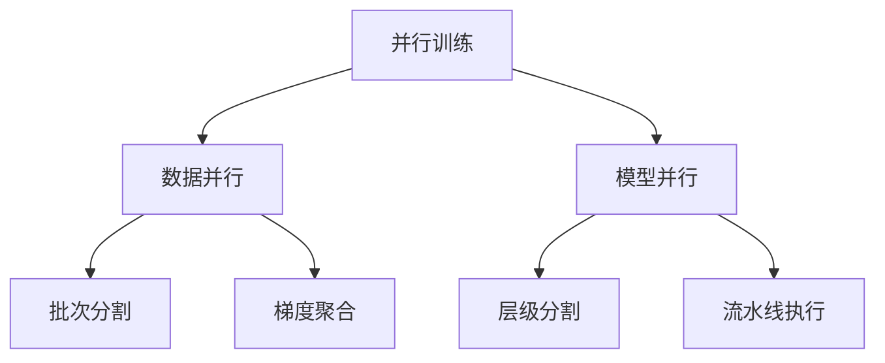

# 7.5 并行训练：数据并行与模型并行

> "并行训练如同交响乐团的协奏，多个处理单元各司其职、协调配合，让原本耗时的训练过程在多核心的加速下变得高效而优雅。"

随着深度学习模型规模的不断增长和数据集的日益庞大，单线程训练已经无法满足现代深度学习的需求。并行训练技术通过充分利用多核CPU、多GPU等计算资源，显著提升训练效率。本节将详细介绍数据并行和模型并行的原理与实现。

## 7.5.1 并行训练基础架构

### 并行训练分类



### 并行训练管理器

基于TinyAI现有的并行支持，我们构建统一的管理器：

```java
/**
 * 并行训练管理器
 * 
 * 统一管理数据并行和模型并行的训练策略
 */
public class ParallelTrainingManager {
    
    private int parallelThreadCount;             // 并行线程数
    private ExecutorService executorService;     // 线程池
    private GradientAggregator gradientAggregator; // 梯度聚合器
    
    /**
     * 构造函数
     */
    public ParallelTrainingManager(int threadCount) {
        this.parallelThreadCount = threadCount;
        this.executorService = Executors.newFixedThreadPool(threadCount);
        this.gradientAggregator = new GradientAggregator();
        
        System.out.printf("并行训练管理器初始化: 线程数=%d\n", threadCount);
    }
    
    /**
     * 执行数据并行训练
     */
    public TrainingResult executeDataParallelTraining(Model model, DataSet dataSet, 
                                                     Loss loss, Optimizer optimizer, int epochs) {
        DataParallelTrainer trainer = new DataParallelTrainer(parallelThreadCount);
        return trainer.trainDataParallel(model, dataSet, loss, optimizer, epochs);
    }
    
    /**
     * 关闭管理器
     */
    public void shutdown() {
        if (executorService != null && !executorService.isShutdown()) {
            executorService.shutdown();
        }
    }
}
```

## 7.5.2 数据并行训练实现

数据并行是最常用的并行方式，将数据分成多个批次在不同线程上并行处理：

```java
/**
 * 数据并行训练器
 * 
 * 实现数据并行训练逻辑，支持梯度聚合和模型同步
 */
public class DataParallelTrainer {
    
    private int numWorkers;                      // 工作线程数
    private ExecutorService executorService;     // 线程池
    private List<Model> workerModels;           // 工作模型副本
    private GradientAggregator aggregator;       // 梯度聚合器
    
    /**
     * 构造函数
     */
    public DataParallelTrainer(int numWorkers) {
        this.numWorkers = numWorkers;
        this.executorService = Executors.newFixedThreadPool(numWorkers);
        this.workerModels = new ArrayList<>();
        this.aggregator = new GradientAggregator();
        
        System.out.printf("数据并行训练器初始化: %d个工作线程\n", numWorkers);
    }
    
    /**
     * 执行数据并行训练
     */
    public TrainingResult trainDataParallel(Model masterModel, DataSet dataSet, 
                                          Loss loss, Optimizer optimizer, int epochs) {
        // 初始化工作模型
        initializeWorkerModels(masterModel);
        
        // 分割数据集
        List<List<Batch>> workerDataSets = splitDataSet(dataSet);
        
        for (int epoch = 0; epoch < epochs; epoch++) {
            System.out.printf("=== Epoch %d/%d (数据并行) ===\n", epoch + 1, epochs);
            
            // 同步所有工作模型的参数
            synchronizeWorkerModels(masterModel);
            
            // 并行训练
            List<Future<WorkerTrainingResult>> futures = submitWorkerTasks(
                workerDataSets, loss, optimizer);
            
            // 收集结果并聚合梯度
            float totalLoss = collectAndAggregateResults(masterModel, futures, optimizer);
            
            System.out.printf("Epoch %d 完成, 平均损失: %.6f\n", 
                             epoch + 1, totalLoss / numWorkers);
        }
        
        return new TrainingResult(epochs, System.currentTimeMillis(), masterModel);
    }
    
    /**
     * 初始化工作模型
     */
    private void initializeWorkerModels(Model masterModel) {
        workerModels.clear();
        
        for (int i = 0; i < numWorkers; i++) {
            // 创建模型副本（简化实现）
            Model workerModel = cloneModel(masterModel);
            workerModels.add(workerModel);
        }
    }
    
    /**
     * 分割数据集
     */
    private List<List<Batch>> splitDataSet(DataSet dataSet) {
        List<Batch> allBatches = dataSet.getBatches();
        List<List<Batch>> workerDataSets = new ArrayList<>();
        
        // 初始化工作数据集
        for (int i = 0; i < numWorkers; i++) {
            workerDataSets.add(new ArrayList<>());
        }
        
        // 轮询分配批次
        for (int i = 0; i < allBatches.size(); i++) {
            int workerId = i % numWorkers;
            workerDataSets.get(workerId).add(allBatches.get(i));
        }
        
        return workerDataSets;
    }
    
    /**
     * 提交工作任务
     */
    private List<Future<WorkerTrainingResult>> submitWorkerTasks(
            List<List<Batch>> workerDataSets, Loss loss, Optimizer optimizer) {
        
        List<Future<WorkerTrainingResult>> futures = new ArrayList<>();
        
        for (int workerId = 0; workerId < numWorkers; workerId++) {
            final int finalWorkerId = workerId;
            Future<WorkerTrainingResult> future = executorService.submit(() -> {
                return trainWorker(finalWorkerId, workerModels.get(finalWorkerId),
                                 workerDataSets.get(finalWorkerId), loss);
            });
            futures.add(future);
        }
        
        return futures;
    }
    
    /**
     * 训练单个工作线程
     */
    private WorkerTrainingResult trainWorker(int workerId, Model workerModel, 
                                           List<Batch> batches, Loss loss) {
        float workerLoss = 0.0f;
        
        for (Batch batch : batches) {
            // 前向传播
            Variable input = batch.toVariableX().setRequireGrad(false);
            Variable target = batch.toVariableY().setRequireGrad(false);
            Variable prediction = workerModel.forward(input);
            
            // 计算损失
            Variable lossVar = loss.loss(target, prediction);
            workerLoss += lossVar.getValue().getNumber().floatValue();
            
            // 反向传播
            workerModel.clearGrads();
            lossVar.backward();
        }
        
        // 收集梯度
        Map<String, NdArray> gradients = collectGradients(workerModel);
        
        return new WorkerTrainingResult(workerId, workerLoss / batches.size(), gradients);
    }
    
    /**
     * 收集并聚合结果
     */
    private float collectAndAggregateResults(Model masterModel, 
                                           List<Future<WorkerTrainingResult>> futures,
                                           Optimizer optimizer) {
        List<Map<String, NdArray>> workerGradients = new ArrayList<>();
        float totalLoss = 0.0f;
        
        for (Future<WorkerTrainingResult> future : futures) {
            try {
                WorkerTrainingResult result = future.get();
                workerGradients.add(result.getGradients());
                totalLoss += result.getLoss();
            } catch (Exception e) {
                System.err.println("工作线程执行失败: " + e.getMessage());
            }
        }
        
        // 聚合梯度并更新主模型
        Map<String, NdArray> aggregatedGradients = aggregator.aggregate(workerGradients);
        updateMasterModel(masterModel, aggregatedGradients, optimizer);
        
        return totalLoss;
    }
    
    // 其他辅助方法...
    private Model cloneModel(Model model) { /* 实现模型克隆 */ return model; }
    private void synchronizeWorkerModels(Model master) { /* 同步参数 */ }
    private Map<String, NdArray> collectGradients(Model model) { return new HashMap<>(); }
    private void updateMasterModel(Model model, Map<String, NdArray> grads, Optimizer opt) { }
    
    public void shutdown() {
        if (executorService != null) {
            executorService.shutdown();
        }
    }
}
```

## 7.5.3 梯度聚合器

```java
/**
 * 梯度聚合器
 * 
 * 负责聚合多个工作线程的梯度
 */
public class GradientAggregator {
    
    /**
     * 聚合多个工作线程的梯度
     */
    public Map<String, NdArray> aggregate(List<Map<String, NdArray>> workerGradients) {
        if (workerGradients.isEmpty()) {
            return new HashMap<>();
        }
        
        Map<String, NdArray> aggregatedGradients = new HashMap<>();
        Map<String, NdArray> firstWorkerGradients = workerGradients.get(0);
        
        // 对每个参数进行聚合
        for (String paramName : firstWorkerGradients.keySet()) {
            List<NdArray> gradients = new ArrayList<>();
            
            // 收集所有工作线程对该参数的梯度
            for (Map<String, NdArray> workerGrad : workerGradients) {
                NdArray grad = workerGrad.get(paramName);
                if (grad != null) {
                    gradients.add(grad);
                }
            }
            
            // 平均聚合
            if (!gradients.isEmpty()) {
                NdArray result = gradients.get(0).copy();
                for (int i = 1; i < gradients.size(); i++) {
                    result = result.add(gradients.get(i));
                }
                result = result.divNum(gradients.size());
                aggregatedGradients.put(paramName, result);
            }
        }
        
        return aggregatedGradients;
    }
}

/**
 * 工作线程训练结果
 */
class WorkerTrainingResult {
    private int workerId;
    private float loss;
    private Map<String, NdArray> gradients;
    
    public WorkerTrainingResult(int workerId, float loss, Map<String, NdArray> gradients) {
        this.workerId = workerId;
        this.loss = loss;
        this.gradients = gradients;
    }
    
    // Getters
    public int getWorkerId() { return workerId; }
    public float getLoss() { return loss; }
    public Map<String, NdArray> getGradients() { return gradients; }
}
```

## 7.5.4 应用示例

```java
/**
 * 并行训练应用示例
 */
public class ParallelTrainingExample {
    
    public static void main(String[] args) {
        System.out.println("=== 并行训练示例 ===\n");
        
        // 创建数据集和模型
        DataSet dataSet = new MnistDataSet(32);
        Model model = createTestModel();
        
        // 测试数据并行训练
        testDataParallelTraining(model, dataSet);
        
        // 性能对比
        comparePerformance(dataSet);
    }
    
    /**
     * 测试数据并行训练
     */
    private static void testDataParallelTraining(Model model, DataSet dataSet) {
        System.out.println("1. 数据并行训练测试");
        System.out.println("-".repeat(40));
        
        // 创建并行训练管理器
        ParallelTrainingManager manager = new ParallelTrainingManager(4);
        
        // 配置训练组件
        Loss loss = new SoftmaxCrossEntropy();
        Optimizer optimizer = new AdamOptimizer(model, 0.001f);
        
        // 执行并行训练
        long startTime = System.currentTimeMillis();
        TrainingResult result = manager.executeDataParallelTraining(
            model, dataSet, loss, optimizer, 10);
        long parallelTime = System.currentTimeMillis() - startTime;
        
        System.out.printf("数据并行训练完成: 耗时 %.2f 秒\n", parallelTime / 1000.0);
        
        manager.shutdown();
    }
    
    /**
     * 性能对比
     */
    private static void comparePerformance(DataSet dataSet) {
        System.out.println("\n2. 性能对比测试");
        System.out.println("-".repeat(40));
        
        // 顺序训练
        long sequentialTime = benchmarkSequentialTraining(dataSet);
        
        // 并行训练
        long parallelTime = benchmarkParallelTraining(dataSet);
        
        // 计算加速比
        float speedup = (float) sequentialTime / parallelTime;
        
        System.out.println("\n=== 性能对比结果 ===");
        System.out.printf("顺序训练时间: %.2f 秒\n", sequentialTime / 1000.0);
        System.out.printf("并行训练时间: %.2f 秒\n", parallelTime / 1000.0);
        System.out.printf("加速比: %.2fx\n", speedup);
        
        if (speedup > 1.0f) {
            System.out.println("✅ 并行训练成功加速！");
        } else {
            System.out.println("⚠️ 并行训练未能有效加速，可能原因:");
            System.out.println("   - 数据集较小，并行开销超过收益");
            System.out.println("   - 模型计算量不足");
            System.out.println("   - 线程数设置不合理");
        }
    }
    
    private static long benchmarkSequentialTraining(DataSet dataSet) {
        System.out.println("执行顺序训练基准测试...");
        
        Model model = createTestModel();
        Loss loss = new SoftmaxCrossEntropy();
        Optimizer optimizer = new AdamOptimizer(model, 0.001f);
        
        long startTime = System.currentTimeMillis();
        
        // 简化的训练循环
        for (int epoch = 0; epoch < 5; epoch++) {
            for (Batch batch : dataSet.getBatches()) {
                Variable input = batch.toVariableX().setRequireGrad(false);
                Variable target = batch.toVariableY().setRequireGrad(false);
                Variable prediction = model.forward(input);
                Variable lossVar = loss.loss(target, prediction);
                
                model.clearGrads();
                lossVar.backward();
                optimizer.update();
            }
        }
        
        return System.currentTimeMillis() - startTime;
    }
    
    private static long benchmarkParallelTraining(DataSet dataSet) {
        System.out.println("执行并行训练基准测试...");
        
        ParallelTrainingManager manager = new ParallelTrainingManager(4);
        Model model = createTestModel();
        Loss loss = new SoftmaxCrossEntropy();
        Optimizer optimizer = new AdamOptimizer(model, 0.001f);
        
        long startTime = System.currentTimeMillis();
        manager.executeDataParallelTraining(model, dataSet, loss, optimizer, 5);
        long totalTime = System.currentTimeMillis() - startTime;
        
        manager.shutdown();
        return totalTime;
    }
    
    private static Model createTestModel() {
        Block mlpBlock = new MlpBlock("parallel_test", 32, 
                                     Config.ActiveFunc.ReLU, 
                                     784, 128, 64, 10);
        return new Model("ParallelTestModel", mlpBlock);
    }
}
```

## 7.5.5 最佳实践和优化建议

### 并行训练选择指南

1. **数据并行适用场景**：
   - 数据集较大
   - 模型能完整加载到单个设备
   - 通信开销相对较小

2. **模型并行适用场景**：
   - 模型过大无法在单设备加载
   - 层间计算相对独立
   - 有足够的设备资源

### 性能优化建议

```java
/**
 * 并行训练优化建议
 */
public class ParallelOptimizationTips {
    
    /**
     * 计算最优线程数
     */
    public static int calculateOptimalThreadCount(int dataSize, int modelSize) {
        int cpuCores = Runtime.getRuntime().availableProcessors();
        
        // 基于经验的启发式规则
        if (dataSize < 1000) {
            return 1; // 小数据集不适合并行
        } else if (dataSize < 10000) {
            return Math.min(2, cpuCores / 2);
        } else {
            return Math.min(cpuCores, 8); // 通常不超过8个线程
        }
    }
    
    /**
     * 打印优化建议
     */
    public static void printOptimizationTips() {
        System.out.println("\n=== 并行训练优化建议 ===");
        System.out.println("1. 合理设置线程数：通常为CPU核心数的50%-100%");
        System.out.println("2. 增大批次大小：减少通信频率");
        System.out.println("3. 使用梯度累积：在内存允许情况下累积多个批次");
        System.out.println("4. 监控CPU使用率：避免过度订阅");
        System.out.println("5. 考虑NUMA架构：在多CPU系统中优化内存访问");
    }
}
```

## 本节总结

本节介绍了并行训练的核心技术：

1. **数据并行**：通过分割数据集实现并行训练，适用于大多数场景
2. **梯度聚合**：确保并行训练的正确性和收敛性  
3. **性能优化**：合理配置线程数和批次大小
4. **实际应用**：完整的示例和性能对比

并行训练能够显著提升训练效率，但需要根据具体场景选择合适的并行策略。在下一节中，我们将构建一个完整的综合实战项目。