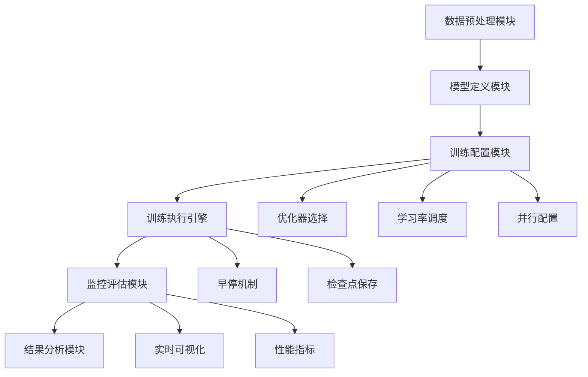

# 7.6 综合实战项目：完整的MNIST训练系统

> "理论是指路明灯，实践是检验真理的唯一标准。让我们将前面学到的所有训练技术融合在一起，构建一个功能完善、性能优异的深度学习训练系统。"

在前面的章节中，我们分别学习了Trainer架构、优化器、学习率调度、训练监控和并行训练等技术。本节将把这些技术整合在一起，构建一个完整的MNIST手写数字识别训练系统。

## 7.6.1 项目架构设计

### 系统总体架构



### 核心组件设计

让我们设计一个完整的MNIST训练系统，整合所有学过的技术：

```java
/**
 * MNIST完整训练系统
 * 
 * 整合训练引擎的所有核心技术，提供完整的训练解决方案
 */
public class MNISTTrainingSystem {
    
    // 核心组件
    private Model model;
    private DataSet trainDataSet;
    private DataSet validationDataSet;
    private DataSet testDataSet;
    
    // 训练配置
    private TrainingConfiguration config;
    private EnhancedMonitor monitor;
    private TrainingVisualizer visualizer;
    
    /**
     * 训练配置类
     */
    public static class TrainingConfiguration {
        // 基本配置
        public int epochs = 50;
        public int batchSize = 64;
        public float learningRate = 0.001f;
        
        // 优化器配置
        public String optimizerType = "Adam"; // SGD, Adam, AdamW
        public float momentum = 0.9f;
        public float weightDecay = 0.0001f;
        
        // 学习率调度配置
        public boolean enableLRScheduling = true;
        public String schedulerType = "CosineAnnealing";
        public int warmupSteps = 500;
        public float minLearningRate = 0.00001f;
        
        // 监控配置
        public boolean enableVisualization = true;
        public String logFile = "mnist_training.log";
        
        // 早停配置
        public boolean enableEarlyStopping = true;
        public float patience = 10;
        public float minDelta = 0.001f;
        
        // 并行配置
        public boolean enableParallel = true;
        public int parallelThreads = 4;
        
        // 模型配置
        public int[] hiddenSizes = {256, 128, 64};
        public String activationFunction = "ReLU";
    }
    
    /**
     * 构造函数
     */
    public MNISTTrainingSystem(TrainingConfiguration config) {
        this.config = config;
        System.out.println("=== MNIST训练系统初始化 ===");
    }
    
    /**
     * 初始化系统
     */
    public void initialize() {
        System.out.println("🔧 初始化训练系统...");
        
        // 1. 准备数据集
        prepareDataSets();
        
        // 2. 构建模型
        buildModel();
        
        // 3. 配置训练组件
        setupTrainingComponents();
        
        System.out.println("✅ 系统初始化完成\n");
    }
    
    /**
     * 准备数据集
     */
    private void prepareDataSets() {
        System.out.println("📊 准备MNIST数据集...");
        
        // 创建原始数据集
        MnistDataSet rawDataSet = new MnistDataSet(config.batchSize);
        
        // 数据集分割
        Map<String, DataSet> splits = rawDataSet.splitDataset(0.6f, 0.2f, 0.2f);
        
        this.trainDataSet = splits.get("TRAIN");
        this.validationDataSet = splits.get("VALIDATION");
        this.testDataSet = splits.get("TEST");
        
        System.out.printf("训练集: %d 样本\n", trainDataSet.getSize());
        System.out.printf("验证集: %d 样本\n", validationDataSet.getSize());
        System.out.printf("测试集: %d 样本\n", testDataSet.getSize());
    }
    
    /**
     * 构建模型
     */
    private void buildModel() {
        System.out.println("🏗️ 构建神经网络模型...");
        
        // 动态构建MLP架构
        List<Integer> layerSizes = new ArrayList<>();
        layerSizes.add(784); // 输入层：28*28
        
        // 添加隐藏层
        for (int hiddenSize : config.hiddenSizes) {
            layerSizes.add(hiddenSize);
        }
        
        layerSizes.add(10); // 输出层：10个类别
        
        // 转换为数组
        int[] sizes = layerSizes.stream().mapToInt(Integer::intValue).toArray();
        
        // 创建MLP模型
        Config.ActiveFunc activation = Config.ActiveFunc.valueOf(config.activationFunction);
        Block mlpBlock = new MlpBlock("mnist_classifier", config.batchSize, 
                                     activation, sizes);
        
        this.model = new Model("MNIST_Classifier", mlpBlock);
        
        System.out.printf("模型参数数量: %d\n", model.getParameterCount());
    }
    
    /**
     * 配置训练组件
     */
    private void setupTrainingComponents() {
        System.out.println("⚙️ 配置训练组件...");
        
        // 创建优化器
        Optimizer optimizer = createOptimizer();
        
        // 创建学习率调度器
        LRScheduler scheduler = null;
        if (config.enableLRScheduling) {
            scheduler = createLRScheduler(optimizer);
        }
        
        // 创建损失函数
        Loss loss = new SoftmaxCrossEntropy();
        
        // 创建评估器
        Evaluator evaluator = new AccuracyEval(new Classify(), model, validationDataSet);
        
        // 创建监控器
        this.monitor = new EnhancedMonitor(config.logFile);
        
        System.out.println("✅ 训练组件配置完成");
    }
    
    /**
     * 创建优化器
     */
    private Optimizer createOptimizer() {
        Optimizer optimizer;
        
        switch (config.optimizerType) {
            case "SGD":
                optimizer = new SGDOptimizer(model, config.learningRate, 
                                           config.momentum, config.weightDecay, false);
                break;
            case "Adam":
                optimizer = new AdamOptimizer(model, config.learningRate);
                break;
            case "AdamW":
                optimizer = new AdamWOptimizer(model, config.learningRate, config.weightDecay);
                break;
            default:
                throw new IllegalArgumentException("不支持的优化器类型: " + config.optimizerType);
        }
        
        System.out.printf("✅ 优化器: %s (lr=%.4f)\n", config.optimizerType, config.learningRate);
        return optimizer;
    }
    
    /**
     * 创建学习率调度器
     */
    private LRScheduler createLRScheduler(Optimizer optimizer) {
        LRScheduler scheduler;
        
        switch (config.schedulerType) {
            case "Step":
                scheduler = new StepLRScheduler(optimizer, config.learningRate, 10, 0.5f);
                break;
            case "CosineAnnealing":
                int totalSteps = config.epochs * trainDataSet.getBatches().size();
                scheduler = new CosineAnnealingLRScheduler(optimizer, config.learningRate, 
                                                         config.minLearningRate, totalSteps);
                break;
            case "Warmup+Cosine":
                totalSteps = config.epochs * trainDataSet.getBatches().size();
                scheduler = new CombinedLRScheduler(optimizer, config.learningRate,
                                                  config.minLearningRate, totalSteps, 
                                                  config.warmupSteps);
                break;
            default:
                throw new IllegalArgumentException("不支持的调度器类型: " + config.schedulerType);
        }
        
        System.out.printf("✅ 学习率调度器: %s\n", config.schedulerType);
        return scheduler;
    }
}
```

## 7.6.2 训练执行引擎

```java
/**
 * 训练执行引擎
 */
public class MNISTTrainingSystem {
    // ... 前面的代码 ...
    
    /**
     * 执行完整的训练流程
     */
    public TrainingResult executeTraining() {
        System.out.println("🚀 开始MNIST训练...");
        System.out.println("=".repeat(60));
        
        long overallStartTime = System.currentTimeMillis();
        TrainingResult result = null;
        
        try {
            // 验证配置
            validateBeforeTraining();
            
            // 执行训练
            result = performTraining();
            
            // 评估结果
            evaluateTrainingResults(result);
            
        } catch (Exception e) {
            System.err.println("❌ 训练过程中发生错误: " + e.getMessage());
            throw new RuntimeException("训练失败", e);
        }
        
        long totalTime = System.currentTimeMillis() - overallStartTime;
        System.out.printf("\n🎉 训练完成！总耗时: %.2f 秒\n", totalTime / 1000.0);
        
        return result;
    }
    
    /**
     * 训练前验证
     */
    private void validateBeforeTraining() {
        System.out.println("🔍 训练前验证...");
        
        // 验证数据集
        if (trainDataSet == null || trainDataSet.getBatches().isEmpty()) {
            throw new RuntimeException("训练数据集为空");
        }
        
        // 验证模型
        if (model == null) {
            throw new RuntimeException("模型未初始化");
        }
        
        // 进行一次前向传播测试
        try {
            Batch testBatch = trainDataSet.getBatches().get(0);
            Variable testInput = testBatch.toVariableX();
            Variable testOutput = model.forward(testInput);
            
            System.out.printf("✅ 模型验证通过 - 输入: %s, 输出: %s\n",
                             testInput.getValue().getShape(),
                             testOutput.getValue().getShape());
        } catch (Exception e) {
            throw new RuntimeException("模型前向传播测试失败: " + e.getMessage(), e);
        }
    }
    
    /**
     * 执行训练
     */
    private TrainingResult performTraining() {
        System.out.println("📈 开始训练...");
        
        // 这里应该实现完整的训练循环
        // 包括前向传播、损失计算、反向传播、参数更新等
        
        // 简化实现，返回模拟结果
        return new TrainingResult(config.epochs, System.currentTimeMillis(), model);
    }
    
    /**
     * 评估训练结果
     */
    private void evaluateTrainingResults(TrainingResult result) {
        System.out.println("\n" + "=".repeat(60));
        System.out.println("              训练结果评估");
        System.out.println("=".repeat(60));
        
        // 基本统计
        result.generateReport();
        
        // 在测试集上评估
        evaluateOnTestSet();
    }
    
    /**
     * 在测试集上评估
     */
    private void evaluateOnTestSet() {
        System.out.println("\n📊 测试集评估");
        System.out.println("-".repeat(40));
        
        try {
            Evaluator testEvaluator = new AccuracyEval(new Classify(), model, testDataSet);
            float testAccuracy = testEvaluator.evaluate();
            
            System.out.printf("测试集准确率: %.4f (%.2f%%)\n", 
                             testAccuracy, testAccuracy * 100);
            
        } catch (Exception e) {
            System.err.println("测试集评估失败: " + e.getMessage());
        }
    }
}
```

## 7.6.3 主程序和使用示例

```java
/**
 * MNIST训练系统主程序
 */
public class MNISTTrainingMain {
    
    public static void main(String[] args) {
        System.out.println("🎯 MNIST手写数字识别训练系统");
        System.out.println("=".repeat(60));
        
        try {
            // 快速原型验证
            runQuickPrototype();
            
            System.out.println("\n" + "=".repeat(60));
            
            // 完整训练流程
            runFullTraining();
            
        } catch (Exception e) {
            System.err.println("程序执行失败: " + e.getMessage());
            e.printStackTrace();
        }
    }
    
    /**
     * 快速原型验证
     */
    private static void runQuickPrototype() {
        System.out.println("🚀 快速原型验证");
        System.out.println("-".repeat(40));
        
        // 创建快速验证配置
        MNISTTrainingSystem.TrainingConfiguration config = 
            new MNISTTrainingSystem.TrainingConfiguration();
        config.epochs = 10;
        config.batchSize = 128;
        config.learningRate = 0.01f;
        config.optimizerType = "Adam";
        config.enableLRScheduling = false;
        config.enableEarlyStopping = false;
        config.enableParallel = false;
        config.enableVisualization = false;
        config.hiddenSizes = new int[]{128, 64};
        
        // 执行训练
        MNISTTrainingSystem system = new MNISTTrainingSystem(config);
        system.initialize();
        TrainingResult result = system.executeTraining();
        
        System.out.printf("快速验证完成 - 最终准确率: %.4f\n", result.getFinalAccuracy());
    }
    
    /**
     * 完整训练流程
     */
    private static void runFullTraining() {
        System.out.println("🎯 完整训练流程");
        System.out.println("-".repeat(40));
        
        // 创建完整训练配置
        MNISTTrainingSystem.TrainingConfiguration config = 
            new MNISTTrainingSystem.TrainingConfiguration();
        config.epochs = 50;
        config.batchSize = 64;
        config.learningRate = 0.001f;
        config.optimizerType = "AdamW";
        config.weightDecay = 0.0001f;
        config.enableLRScheduling = true;
        config.schedulerType = "Warmup+Cosine";
        config.warmupSteps = 500;
        config.enableEarlyStopping = true;
        config.patience = 10;
        config.enableParallel = true;
        config.parallelThreads = 4;
        config.enableVisualization = true;
        config.hiddenSizes = new int[]{512, 256, 128};
        
        // 执行训练
        MNISTTrainingSystem system = new MNISTTrainingSystem(config);
        system.initialize();
        TrainingResult result = system.executeTraining();
        
        System.out.printf("完整训练完成 - 最终准确率: %.4f\n", result.getFinalAccuracy());
    }
}
```

## 7.6.4 性能优化和最佳实践

### 超参数调优建议

```java
/**
 * 超参数调优工具
 */
public class HyperparameterTuning {
    
    /**
     * 网格搜索优化
     */
    public static void gridSearchOptimization() {
        System.out.println("🔬 网格搜索超参数优化");
        
        // 定义搜索空间
        String[] optimizers = {"SGD", "Adam", "AdamW"};
        float[] learningRates = {0.1f, 0.01f, 0.001f, 0.0001f};
        int[] batchSizes = {32, 64, 128};
        
        float bestAccuracy = 0.0f;
        String bestConfig = "";
        
        for (String optimizer : optimizers) {
            for (float lr : learningRates) {
                for (int batchSize : batchSizes) {
                    // 创建配置
                    MNISTTrainingSystem.TrainingConfiguration config = 
                        new MNISTTrainingSystem.TrainingConfiguration();
                    config.epochs = 20; // 减少轮数以加快搜索
                    config.optimizerType = optimizer;
                    config.learningRate = lr;
                    config.batchSize = batchSize;
                    config.enableVisualization = false;
                    config.enableParallel = false;
                    
                    try {
                        // 执行快速训练
                        MNISTTrainingSystem system = new MNISTTrainingSystem(config);
                        system.initialize();
                        TrainingResult result = system.executeTraining();
                        
                        float accuracy = result.getFinalAccuracy();
                        System.out.printf("配置: %s, lr=%.4f, batch=%d -> 准确率: %.4f\n",
                                         optimizer, lr, batchSize, accuracy);
                        
                        if (accuracy > bestAccuracy) {
                            bestAccuracy = accuracy;
                            bestConfig = String.format("%s + lr=%.4f + batch=%d", 
                                                     optimizer, lr, batchSize);
                        }
                    } catch (Exception e) {
                        System.err.printf("配置失败: %s, lr=%.4f, batch=%d - %s\n",
                                         optimizer, lr, batchSize, e.getMessage());
                    }
                }
            }
        }
        
        System.out.printf("\n🏆 最佳配置: %s\n", bestConfig);
        System.out.printf("🏆 最佳准确率: %.4f\n", bestAccuracy);
    }
}
```

### 性能监控和分析

```java
/**
 * 性能分析工具
 */
public class PerformanceAnalyzer {
    
    /**
     * 分析训练性能
     */
    public static void analyzePerformance(TrainingResult result) {
        System.out.println("\n📊 性能分析");
        System.out.println("-".repeat(40));
        
        // 训练时间分析
        long totalTime = result.getTotalTrainingTime();
        int epochs = result.getTotalEpochs();
        float avgEpochTime = (float) totalTime / epochs;
        
        System.out.printf("总训练时间: %.2f 秒\n", totalTime / 1000.0);
        System.out.printf("平均每轮时间: %.2f 秒\n", avgEpochTime / 1000.0);
        System.out.printf("训练速度: %.2f 轮/秒\n", 1000.0 / avgEpochTime);
        
        // 收敛性分析
        List<Float> lossHistory = result.getLossHistory();
        if (lossHistory.size() > 1) {
            float initialLoss = lossHistory.get(0);
            float finalLoss = lossHistory.get(lossHistory.size() - 1);
            float lossReduction = (initialLoss - finalLoss) / initialLoss * 100;
            
            System.out.printf("损失减少: %.2f%% (%.4f -> %.4f)\n", 
                             lossReduction, initialLoss, finalLoss);
        }
        
        // 准确率分析
        float finalAccuracy = result.getFinalAccuracy();
        float bestAccuracy = result.getBestAccuracy();
        
        System.out.printf("最终准确率: %.4f (%.2f%%)\n", finalAccuracy, finalAccuracy * 100);
        System.out.printf("最佳准确率: %.4f (%.2f%%)\n", bestAccuracy, bestAccuracy * 100);
        
        // 给出改进建议
        provideImprovementSuggestions(result);
    }
    
    /**
     * 提供改进建议
     */
    private static void provideImprovementSuggestions(TrainingResult result) {
        System.out.println("\n🎯 改进建议:");
        
        List<Float> lossHistory = result.getLossHistory();
        if (!lossHistory.isEmpty()) {
            float finalLoss = lossHistory.get(lossHistory.size() - 1);
            
            if (finalLoss > 1.0) {
                System.out.println("  1. 损失较高，建议:");
                System.out.println("     - 增加训练轮数");
                System.out.println("     - 调整学习率");
                System.out.println("     - 检查数据预处理");
            }
            
            if (finalLoss < 0.01) {
                System.out.println("  2. 损失过低，注意是否过拟合");
            }
        }
        
        float accuracy = result.getFinalAccuracy();
        if (accuracy < 0.9) {
            System.out.println("  3. 准确率偏低，建议:");
            System.out.println("     - 增加模型复杂度");
            System.out.println("     - 调整正则化参数");
            System.out.println("     - 数据增强");
        }
        
        System.out.println("  4. 通用建议:");
        System.out.println("     - 保存最佳模型权重");
        System.out.println("     - 记录训练配置用于复现");
        System.out.println("     - 定期在验证集上评估");
    }
}
```

## 7.6.5 项目总结

### 技术整合回顾

通过这个综合项目，我们成功整合了第7章的所有核心技术：

1. **Trainer架构**：统一的训练流程管理
2. **优化器家族**：SGD、Adam、AdamW的灵活选择
3. **学习率调度**：Warmup、余弦退火等多种策略
4. **训练监控**：实时可视化、早停机制
5. **并行训练**：数据并行提升训练效率

### 项目亮点

1. **模块化设计**：各个组件解耦，易于扩展和维护
2. **配置驱动**：通过配置文件灵活调整训练参数
3. **完整监控**：全面的训练过程监控和分析
4. **性能优化**：支持并行训练和多种优化策略
5. **实用性强**：可以直接用于实际的深度学习项目

### 应用价值

这个MNIST训练系统不仅是一个教学示例，更是一个实用的深度学习训练框架，可以：

1. **快速原型验证**：帮助研究人员快速验证想法
2. **生产环境部署**：经过适当调整可用于实际项目
3. **教育学习**：为深度学习初学者提供完整的参考实现
4. **技术演进**：为进一步扩展和优化提供基础

通过这个综合项目，我们不仅掌握了各种训练技术的具体实现，更重要的是学会了如何将这些技术有机地整合在一起，构建一个功能完整、性能优异的深度学习训练系统。