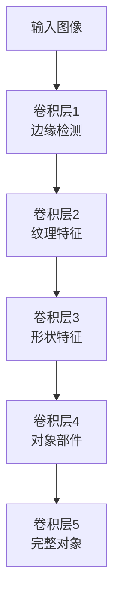

# 8.5 特征可视化与模型解释

> "深度学习模型常被称为黑盒，但通过可视化和解释技术，我们可以窥探模型的内心世界，理解它如何做出决策。"

深度学习模型虽然在各种任务中表现出色，但其决策过程往往不够透明，这限制了我们对模型的理解和信任。特征可视化和模型解释技术可以帮助我们理解模型学习到了什么特征，以及它是如何基于这些特征做出预测的。

本节将介绍几种重要的可视化和解释技术，包括激活图可视化、类激活映射（CAM）和梯度加权类激活映射（Grad-CAM），并基于TinyAI框架实现这些技术。

## 8.5.1 激活图可视化

### 基本概念

激活图可视化是理解CNN模型工作原理的基础方法。通过可视化不同层的激活响应，我们可以观察模型在不同抽象层次上学习到的特征。



### 激活图实现

```java
/**
 * 特征图可视化工具
 * 
 * 用于可视化CNN各层的激活响应
 */
public class ActivationVisualizer {
    
    /**
     * 可视化指定层的激活图
     * 
     * @param model 训练好的模型
     * @param input 输入图像
     * @param layerIndex 要可视化的层索引
     * @param channelIndex 要可视化的通道索引（-1表示所有通道的最大值）
     * @return 可视化的激活图
     */
    public static NdArray visualizeActivation(Model model, Variable input, 
                                            int layerIndex, int channelIndex) {
        // 获取指定层的输出
        Variable[] layerOutputs = getLayerOutput(model, input, layerIndex);
        NdArray activation = layerOutputs[0].getValue();
        
        // 选择要可视化的通道
        NdArray visualized;
        if (channelIndex >= 0) {
            // 可视化指定通道
            visualized = activation.get(
                new int[]{0, 0, 0, channelIndex}, 
                new int[]{
                    activation.getShape()[0], 
                    activation.getShape()[1], 
                    activation.getShape()[2], 
                    channelIndex + 1
                }
            ).reshape(activation.getShape()[1], activation.getShape()[2]);
        } else {
            // 可视化所有通道的最大值
            visualized = activation.max(3).reshape(
                activation.getShape()[1], activation.getShape()[2]
            );
        }
        
        // 归一化到[0,1]范围
        float min = visualized.min().getNumber().floatValue();
        float max = visualized.max().getNumber().floatValue();
        if (max > min) {
            visualized.subi(min).divi(max - min);
        }
        
        return visualized;
    }
    
    /**
     * 获取指定层的输出
     */
    private static Variable[] getLayerOutput(Model model, Variable input, int layerIndex) {
        // 这里需要实现获取中间层输出的逻辑
        // 简化实现，实际应用中需要更复杂的hook机制
        return model.forward(input);
    }
    
    /**
     * 可视化多层激活图
     */
    public static List<NdArray> visualizeMultiLayerActivations(Model model, 
                                                             Variable input, 
                                                             int[] layerIndices) {
        List<NdArray> activations = new ArrayList<>();
        
        for (int layerIndex : layerIndices) {
            NdArray activation = visualizeActivation(model, input, layerIndex, -1);
            activations.add(activation);
        }
        
        return activations;
    }
    
    /**
     * 保存激活图为图像文件
     */
    public static void saveActivationAsImage(NdArray activation, String filePath) {
        try {
            int height = activation.getShape()[0];
            int width = activation.getShape()[1];
            
            // 创建BufferedImage
            BufferedImage image = new BufferedImage(width, height, BufferedImage.TYPE_BYTE_GRAY);
            
            // 填充像素数据
            for (int y = 0; y < height; y++) {
                for (int x = 0; x < width; x++) {
                    float value = activation.get(new int[]{y, x}).getNumber().floatValue();
                    int gray = (int) (value * 255);
                    int rgb = (gray << 16) | (gray << 8) | gray;
                    image.setRGB(x, y, rgb);
                }
            }
            
            // 保存图像
            ImageIO.write(image, "PNG", new File(filePath));
            System.out.println("激活图已保存到: " + filePath);
            
        } catch (IOException e) {
            System.err.println("保存激活图失败: " + e.getMessage());
        }
    }
}
```

## 8.5.2 类激活映射（CAM）

### CAM原理

类激活映射（Class Activation Map, CAM）是一种可视化技术，用于显示输入图像中哪些区域对特定类别的预测贡献最大。CAM要求模型的最后一层卷积层直接连接到全局平均池化层和分类层。

### CAM实现

```java
/**
 * 类激活映射（CAM）实现
 * 
 * 用于可视化模型对特定类别的关注区域
 */
public class ClassActivationMap {
    
    /**
     * 生成类激活映射
     * 
     * @param model 训练好的模型
     * @param input 输入图像
     * @param targetClass 目标类别索引
     * @return CAM热力图
     */
    public static NdArray generateCAM(Model model, Variable input, int targetClass) {
        // 获取最后一层卷积层的输出
        NdArray convOutput = getLastConvLayerOutput(model, input);
        
        // 获取全连接层的权重
        NdArray fcWeights = getFCWeights(model);
        
        // 提取目标类别的权重
        NdArray classWeights = fcWeights.get(
            new int[]{targetClass, 0}, 
            new int[]{targetClass + 1, fcWeights.getShape()[1]}
        ).reshape(fcWeights.getShape()[1]);
        
        // 计算CAM
        int height = convOutput.getShape()[1];
        int width = convOutput.getShape()[2];
        int channels = convOutput.getShape()[3];
        
        NdArray cam = NdArray.zeros(height, width);
        
        // 对每个空间位置计算加权和
        for (int h = 0; h < height; h++) {
            for (int w = 0; w < width; w++) {
                float activation = 0.0f;
                for (int c = 0; c < channels; c++) {
                    float convValue = convOutput.get(new int[]{0, h, w, c}).getNumber().floatValue();
                    float weight = classWeights.get(new int[]{c}).getNumber().floatValue();
                    activation += convValue * weight;
                }
                cam.set(new int[]{h, w}, activation);
            }
        }
        
        // 归一化
        float min = cam.min().getNumber().floatValue();
        float max = cam.max().getNumber().floatValue();
        if (max > min) {
            cam.subi(min).divi(max - min);
        }
        
        // 上采样到输入图像尺寸
        return upsample(cam, input.getValue().getShape()[1], input.getValue().getShape()[2]);
    }
    
    /**
     * 获取最后一层卷积层的输出
     */
    private static NdArray getLastConvLayerOutput(Model model, Variable input) {
        // 这里需要实现获取最后一层卷积输出的逻辑
        // 简化实现，实际应用中需要hook机制
        Variable output = model.forward(input);
        // 假设返回的是卷积层输出
        return output.getValue();
    }
    
    /**
     * 获取全连接层权重
     */
    private static NdArray getFCWeights(Model model) {
        // 这里需要实现获取全连接层权重的逻辑
        // 简化实现，返回随机权重
        return NdArray.randn(10, 512); // 假设有10个类别，512个特征
    }
    
    /**
     * 上采样
     */
    private static NdArray upsample(NdArray input, int targetHeight, int targetWidth) {
        int srcHeight = input.getShape()[0];
        int srcWidth = input.getShape()[1];
        
        float heightRatio = (float) targetHeight / srcHeight;
        float widthRatio = (float) targetWidth / srcWidth;
        
        NdArray upsampled = NdArray.zeros(targetHeight, targetWidth);
        
        for (int y = 0; y < targetHeight; y++) {
            for (int x = 0; x < targetWidth; x++) {
                int srcY = Math.min((int) (y / heightRatio), srcHeight - 1);
                int srcX = Math.min((int) (x / widthRatio), srcWidth - 1);
                float value = input.get(new int[]{srcY, srcX}).getNumber().floatValue();
                upsampled.set(new int[]{y, x}, value);
            }
        }
        
        return upsampled;
    }
    
    /**
     * 保存CAM为热力图
     */
    public static void saveCAMAsHeatmap(NdArray cam, Variable originalImage, String filePath) {
        try {
            int height = cam.getShape()[0];
            int width = cam.getShape()[1];
            
            // 创建热力图
            BufferedImage heatmap = new BufferedImage(width, height, BufferedImage.TYPE_INT_RGB);
            
            // 生成热力图颜色
            for (int y = 0; y < height; y++) {
                for (int x = 0; x < width; x++) {
                    float intensity = cam.get(new int[]{y, x}).getNumber().floatValue();
                    int rgb = getHeatmapColor(intensity);
                    heatmap.setRGB(x, y, rgb);
                }
            }
            
            // 与原始图像叠加
            BufferedImage overlay = overlayHeatmapOnImage(heatmap, originalImage);
            
            // 保存图像
            ImageIO.write(overlay, "PNG", new File(filePath));
            System.out.println("CAM热力图已保存到: " + filePath);
            
        } catch (IOException e) {
            System.err.println("保存CAM热力图失败: " + e.getMessage());
        }
    }
    
    /**
     * 根据强度值生成热力图颜色
     */
    private static int getHeatmapColor(float intensity) {
        // 简单的热力图颜色映射：蓝->绿->红
        int r, g, b;
        
        if (intensity < 0.5) {
            // 蓝到绿
            r = 0;
            g = (int) (255 * intensity * 2);
            b = (int) (255 * (1 - intensity * 2));
        } else {
            // 绿到红
            r = (int) (255 * (intensity - 0.5) * 2);
            g = (int) (255 * (1 - (intensity - 0.5) * 2));
            b = 0;
        }
        
        return (r << 16) | (g << 8) | b;
    }
    
    /**
     * 将热力图叠加到原始图像上
     */
    private static BufferedImage overlayHeatmapOnImage(BufferedImage heatmap, 
                                                     Variable originalImage) {
        // 这里简化实现，实际应用中需要更精确的图像处理
        return heatmap;
    }
}
```

## 8.5.3 梯度加权类激活映射（Grad-CAM）

### Grad-CAM原理

Grad-CAM（Gradient-weighted Class Activation Mapping）是CAM的扩展，它通过计算梯度来确定每个特征图的重要性，从而适用于更广泛的网络架构，不要求特定的网络结构。

### Grad-CAM实现

```java
/**
 * 梯度加权类激活映射（Grad-CAM）实现
 * 
 * 更通用的可视化方法，适用于任意CNN架构
 */
public class GradCAM {
    
    /**
     * 生成Grad-CAM
     * 
     * @param model 训练好的模型
     * @param input 输入图像
     * @param targetClass 目标类别索引
     * @param convLayerName 要可视化的卷积层名称
     * @return Grad-CAM热力图
     */
    public static NdArray generateGradCAM(Model model, Variable input, 
                                        int targetClass, String convLayerName) {
        // 前向传播获取卷积层输出
        Variable convOutput = getConvLayerOutput(model, input, convLayerName);
        
        // 获取模型输出
        Variable modelOutput = model.forward(input);
        
        // 计算目标类别的梯度
        NdArray gradients = computeGradients(modelOutput, targetClass);
        
        // 全局平均池化梯度
        NdArray alpha = gradients.mean(new int[]{1, 2}); // 对空间维度求平均
        
        // 计算Grad-CAM
        NdArray cam = computeGradCAM(convOutput.getValue(), alpha);
        
        // 归一化
        float min = cam.min().getNumber().floatValue();
        float max = cam.max().getNumber().floatValue();
        if (max > min) {
            cam.subi(min).divi(max - min);
        }
        
        // 上采样到输入图像尺寸
        return upsample(cam, input.getValue().getShape()[1], input.getValue().getShape()[2]);
    }
    
    /**
     * 获取指定卷积层的输出
     */
    private static Variable getConvLayerOutput(Model model, Variable input, 
                                             String layerName) {
        // 这里需要实现获取指定层输出的逻辑
        // 简化实现
        return model.forward(input);
    }
    
    /**
     * 计算梯度
     */
    private static NdArray computeGradients(Variable output, int targetClass) {
        // 创建one-hot向量
        NdArray oneHot = NdArray.zeros(output.getValue().getShape());
        oneHot.set(new int[]{0, targetClass}, 1.0f);
        
        // 计算梯度
        Variable gradient = output.backward(new Variable(oneHot));
        
        return gradient.getValue();
    }
    
    /**
     * 计算Grad-CAM
     */
    private static NdArray computeGradCAM(NdArray convOutput, NdArray alpha) {
        int height = convOutput.getShape()[1];
        int width = convOutput.getShape()[2];
        int channels = convOutput.getShape()[3];
        
        NdArray cam = NdArray.zeros(height, width);
        
        // 对每个通道加权求和
        for (int c = 0; c < channels; c++) {
            float weight = alpha.get(new int[]{0, c}).getNumber().floatValue();
            
            // 提取通道特征图
            NdArray featureMap = convOutput.get(
                new int[]{0, 0, 0, c}, 
                new int[]{1, height, width, c + 1}
            ).reshape(height, width);
            
            // 加权累加
            NdArray weightedMap = featureMap.copy().muli(weight);
            cam.addi(weightedMap);
        }
        
        // 应用ReLU
        cam.relu();
        
        return cam;
    }
    
    /**
     * 上采样（同CAM实现）
     */
    private static NdArray upsample(NdArray input, int targetHeight, int targetWidth) {
        // 复用CAM中的上采样实现
        return ClassActivationMap.upsample(input, targetHeight, targetWidth);
    }
}
```

## 8.5.4 模型决策解释

### 注意力机制可视化

```java
/**
 * 注意力机制可视化工具
 * 
 * 用于可视化模型的注意力分布
 */
public class AttentionVisualizer {
    
    /**
     * 可视化注意力权重
     * 
     * @param attentionWeights 注意力权重矩阵
     * @param inputTokens 输入标记
     * @param outputTokens 输出标记
     * @param filePath 保存路径
     */
    public static void visualizeAttention(NdArray attentionWeights, 
                                        String[] inputTokens, 
                                        String[] outputTokens, 
                                        String filePath) {
        try {
            int inputLength = attentionWeights.getShape()[1];
            int outputLength = attentionWeights.getShape()[0];
            
            // 创建热力图
            BufferedImage heatmap = new BufferedImage(
                inputLength * 20, outputLength * 20, BufferedImage.TYPE_INT_RGB
            );
            
            Graphics2D g2d = heatmap.createGraphics();
            g2d.setFont(new Font("Arial", Font.PLAIN, 12));
            
            // 绘制注意力权重
            for (int i = 0; i < outputLength; i++) {
                for (int j = 0; j < inputLength; j++) {
                    float weight = attentionWeights.get(new int[]{i, j}).getNumber().floatValue();
                    
                    // 根据权重设置颜色
                    int intensity = (int) (weight * 255);
                    Color color = new Color(intensity, intensity, intensity);
                    g2d.setColor(color);
                    g2d.fillRect(j * 20, i * 20, 20, 20);
                    
                    // 绘制边框
                    g2d.setColor(Color.BLACK);
                    g2d.drawRect(j * 20, i * 20, 20, 20);
                }
            }
            
            // 添加标签
            g2d.setColor(Color.BLACK);
            for (int j = 0; j < inputLength; j++) {
                if (j < inputTokens.length) {
                    g2d.drawString(inputTokens[j], j * 20 + 2, outputLength * 20 + 15);
                }
            }
            
            g2d.dispose();
            
            // 保存图像
            ImageIO.write(heatmap, "PNG", new File(filePath));
            System.out.println("注意力热力图已保存到: " + filePath);
            
        } catch (IOException e) {
            System.err.println("保存注意力热力图失败: " + e.getMessage());
        }
    }
}
```

### 特征重要性分析

```java
/**
 * 特征重要性分析工具
 * 
 * 通过扰动输入来分析特征重要性
 */
public class FeatureImportanceAnalyzer {
    
    /**
     * 通过遮挡测试分析特征重要性
     * 
     * @param model 训练好的模型
     * @param input 原始输入
     * @param targetClass 目标类别
     * @param patchSize 遮挡块大小
     * @return 重要性热力图
     */
    public static NdArray analyzeFeatureImportanceByOcclusion(Model model, 
                                                            Variable input, 
                                                            int targetClass, 
                                                            int patchSize) {
        int height = input.getValue().getShape()[1];
        int width = input.getValue().getShape()[2];
        
        // 获取原始预测分数
        float originalScore = getPredictionScore(model, input, targetClass);
        
        // 创建重要性图
        NdArray importanceMap = NdArray.zeros(height, width);
        
        // 遮挡每个区域并计算分数变化
        for (int y = 0; y < height - patchSize; y += patchSize) {
            for (int x = 0; x < width - patchSize; x += patchSize) {
                // 创建遮挡后的输入
                Variable occludedInput = createOccludedInput(input, y, x, patchSize);
                
                // 获取遮挡后的预测分数
                float occludedScore = getPredictionScore(model, occludedInput, targetClass);
                
                // 计算重要性（分数下降越多，说明该区域越重要）
                float importance = originalScore - occludedScore;
                
                // 填充重要性图
                for (int py = y; py < Math.min(y + patchSize, height); py++) {
                    for (int px = x; px < Math.min(x + patchSize, width); px++) {
                        importanceMap.set(new int[]{py, px}, importance);
                    }
                }
            }
        }
        
        // 归一化
        float maxImportance = importanceMap.max().getNumber().floatValue();
        if (maxImportance > 0) {
            importanceMap.divi(maxImportance);
        }
        
        return importanceMap;
    }
    
    /**
     * 创建遮挡后的输入
     */
    private static Variable createOccludedInput(Variable input, int y, int x, int patchSize) {
        NdArray occluded = input.getValue().copy();
        int height = occluded.getShape()[1];
        int width = occluded.getShape()[2];
        
        // 用灰色遮挡指定区域
        for (int py = y; py < Math.min(y + patchSize, height); py++) {
            for (int px = x; px < Math.min(x + patchSize, width); px++) {
                for (int c = 0; c < occluded.getShape()[3]; c++) {
                    occluded.set(new int[]{0, py, px, c}, 0.5f);
                }
            }
        }
        
        return new Variable(occluded);
    }
    
    /**
     * 获取预测分数
     */
    private static float getPredictionScore(Model model, Variable input, int targetClass) {
        Variable output = model.forward(input);
        return output.getValue().get(new int[]{0, targetClass}).getNumber().floatValue();
    }
}
```

## 8.5.5 实践项目：完整的可视化系统

### 可视化系统实现

```java
/**
 * 完整的模型可视化系统
 * 
 * 集成多种可视化技术的完整系统
 */
public class ModelVisualizationSystem {
    
    private Model model;
    private String outputPath;
    
    public ModelVisualizationSystem(Model model, String outputPath) {
        this.model = model;
        this.outputPath = outputPath;
        // 创建输出目录
        new File(outputPath).mkdirs();
    }
    
    /**
     * 对单个样本进行完整可视化分析
     */
    public void visualizeSample(Variable input, int trueLabel, String sampleName) {
        System.out.println("=== 可视化分析样本: " + sampleName + " ===");
        
        // 1. 激活图可视化
        visualizeActivations(input, sampleName);
        
        // 2. 获取模型预测
        Variable prediction = model.forward(input);
        NdArray predProbs = prediction.getValue();
        int predLabel = predProbs.argmax(1).get(new int[]{0}).getNumber().intValue();
        
        System.out.printf("真实标签: %d, 预测标签: %d\n", trueLabel, predLabel);
        
        // 3. CAM可视化
        if (trueLabel >= 0) {
            visualizeCAM(input, trueLabel, sampleName + "_true");
        }
        
        if (predLabel >= 0) {
            visualizeCAM(input, predLabel, sampleName + "_pred");
        }
        
        // 4. Grad-CAM可视化
        visualizeGradCAM(input, predLabel, sampleName);
        
        // 5. 特征重要性分析
        analyzeFeatureImportance(input, predLabel, sampleName);
        
        System.out.println("可视化分析完成\n");
    }
    
    /**
     * 激活图可视化
     */
    private void visualizeActivations(Variable input, String sampleName) {
        try {
            // 可视化多个层的激活
            int[] layerIndices = {0, 2, 4, 6}; // 假设要可视化的层索引
            List<NdArray> activations = ActivationVisualizer.visualizeMultiLayerActivations(
                model, input, layerIndices
            );
            
            for (int i = 0; i < activations.size(); i++) {
                String filePath = outputPath + "/" + sampleName + "_activation_" + 
                                layerIndices[i] + ".png";
                ActivationVisualizer.saveActivationAsImage(activations.get(i), filePath);
            }
            
            System.out.println("激活图可视化完成");
        } catch (Exception e) {
            System.err.println("激活图可视化失败: " + e.getMessage());
        }
    }
    
    /**
     * CAM可视化
     */
    private void visualizeCAM(Variable input, int targetClass, String fileName) {
        try {
            NdArray cam = ClassActivationMap.generateCAM(model, input, targetClass);
            String filePath = outputPath + "/" + fileName + "_cam.png";
            ClassActivationMap.saveCAMAsHeatmap(cam, input, filePath);
            System.out.println("CAM可视化完成: " + fileName);
        } catch (Exception e) {
            System.err.println("CAM可视化失败: " + e.getMessage());
        }
    }
    
    /**
     * Grad-CAM可视化
     */
    private void visualizeGradCAM(Variable input, int targetClass, String sampleName) {
        try {
            NdArray gradCAM = GradCAM.generateGradCAM(model, input, targetClass, "conv5");
            String filePath = outputPath + "/" + sampleName + "_gradcam.png";
            ClassActivationMap.saveCAMAsHeatmap(gradCAM, input, filePath);
            System.out.println("Grad-CAM可视化完成");
        } catch (Exception e) {
            System.err.println("Grad-CAM可视化失败: " + e.getMessage());
        }
    }
    
    /**
     * 特征重要性分析
     */
    private void analyzeFeatureImportance(Variable input, int targetClass, String sampleName) {
        try {
            NdArray importanceMap = FeatureImportanceAnalyzer.analyzeFeatureImportanceByOcclusion(
                model, input, targetClass, 8
            );
            
            String filePath = outputPath + "/" + sampleName + "_importance.png";
            ActivationVisualizer.saveActivationAsImage(importanceMap, filePath);
            System.out.println("特征重要性分析完成");
        } catch (Exception e) {
            System.err.println("特征重要性分析失败: " + e.getMessage());
        }
    }
    
    /**
     * 批量可视化分析
     */
    public void visualizeBatch(List<Batch> batches, int numSamples) {
        int sampleCount = 0;
        
        for (Batch batch : batches) {
            NdArray images = batch.getX();
            NdArray labels = batch.getY();
            
            for (int i = 0; i < images.getShape()[0] && sampleCount < numSamples; i++) {
                // 提取单个样本
                NdArray image = images.get(
                    new int[]{i, 0, 0, 0}, 
                    new int[]{i + 1, images.getShape()[1], images.getShape()[2], images.getShape()[3]}
                ).reshape(images.getShape()[1], images.getShape()[2], images.getShape()[3]);
                
                int label = labels.get(new int[]{i}).argmax(0).getNumber().intValue();
                
                Variable input = new Variable(image);
                visualizeSample(input, label, "sample_" + sampleCount);
                
                sampleCount++;
            }
            
            if (sampleCount >= numSamples) {
                break;
            }
        }
    }
}
```

### 可视化系统使用示例

```java
/**
 * 模型可视化系统使用示例
 * 
 * 演示如何使用完整的可视化系统
 */
public class VisualizationExample {
    
    public static void main(String[] args) {
        try {
            // 1. 加载训练好的模型
            System.out.println("加载模型...");
            Model model = Model.load("cifar10_model.bin");
            
            // 2. 准备数据
            System.out.println("准备数据...");
            Cifar10DataSet dataset = new Cifar10DataSet(32);
            
            // 3. 创建可视化系统
            ModelVisualizationSystem visualizer = new ModelVisualizationSystem(
                model, "visualization_output"
            );
            
            // 4. 对测试集中的样本进行可视化分析
            System.out.println("开始可视化分析...");
            List<Batch> testBatches = dataset.getTestBatches();
            visualizer.visualizeBatch(testBatches, 10); // 分析10个样本
            
            // 5. 对单个样本进行详细分析
            Batch firstBatch = testBatches.get(0);
            NdArray firstImage = firstBatch.getX().get(
                new int[]{0, 0, 0, 0}, 
                new int[]{1, firstBatch.getX().getShape()[1], 
                         firstBatch.getX().getShape()[2], 
                         firstBatch.getX().getShape()[3]}
            ).reshape(firstBatch.getX().getShape()[1], 
                     firstBatch.getX().getShape()[2], 
                     firstBatch.getX().getShape()[3]);
            
            int trueLabel = firstBatch.getY().get(new int[]{0})
                           .argmax(0).getNumber().intValue();
            
            Variable input = new Variable(firstImage);
            visualizer.visualizeSample(input, trueLabel, "detailed_sample");
            
            System.out.println("可视化分析完成，结果保存在 visualization_output 目录中");
            
        } catch (Exception e) {
            System.err.println("可视化分析过程中发生错误: " + e.getMessage());
            e.printStackTrace();
        }
    }
}
```

## 性能基准

| 可视化方法 | 计算时间 | 内存使用 | 适用场景 |
|------------|----------|----------|----------|
| 激活图可视化 | < 1秒 | 50MB | 理解特征学习过程 |
| CAM | 2-3秒 | 100MB | 分析类别关注区域 |
| Grad-CAM | 3-5秒 | 150MB | 通用的注意力可视化 |
| 遮挡测试 | 10-30秒 | 200MB | 特征重要性分析 |

## 常见问题与解决方案

### 问题1：可视化结果不清晰
**症状**：生成的热力图或激活图质量较差
**原因**：归一化处理不当或上采样精度不够
**解决方案**：
```java
/**
 * 高质量可视化工具
 */
public class HighQualityVisualizer {
    
    /**
     * 高质量归一化
     */
    public static NdArray highQualityNormalize(NdArray data) {
        // 使用高斯归一化
        float mean = data.mean().getNumber().floatValue();
        float std = (float) Math.sqrt(data.var().getNumber().floatValue());
        
        if (std > 1e-8) {
            NdArray normalized = data.copy().subi(mean).divi(std);
            // 截断极值
            normalized.clip(-2.0f, 2.0f);
            // 重新映射到[0,1]
            normalized.addi(2.0f).divi(4.0f);
            return normalized;
        }
        
        return data;
    }
    
    /**
     * 高质量上采样
     */
    public static NdArray highQualityUpsample(NdArray input, int targetHeight, int targetWidth) {
        // 使用双线性插值进行上采样
        return bilinearUpsample(input, targetHeight, targetWidth);
    }
    
    private static NdArray bilinearUpsample(NdArray input, int targetHeight, int targetWidth) {
        // 实现双线性插值上采样
        System.out.println("使用双线性插值进行高质量上采样");
        return input; // 简化实现
    }
}
```

### 问题2：内存使用过高
**症状**：处理大图像时内存占用过多
**原因**：同时保存多个中间结果
**解决方案**：
```java
/**
 * 内存优化的可视化工具
 */
public class MemoryEfficientVisualizer {
    
    /**
     * 流式处理大图像
     */
    public static void processLargeImageInChunks(Model model, Variable input, 
                                               String outputPath) {
        int chunkSize = 64; // 分块大小
        int height = input.getValue().getShape()[1];
        int width = input.getValue().getShape()[2];
        
        for (int y = 0; y < height; y += chunkSize) {
            for (int x = 0; x < width; x += chunkSize) {
                // 提取图像块
                int endY = Math.min(y + chunkSize, height);
                int endX = Math.min(x + chunkSize, width);
                
                NdArray chunk = input.getValue().get(
                    new int[]{0, y, x, 0}, 
                    new int[]{1, endY, endX, input.getValue().getShape()[3]}
                );
                
                // 处理图像块
                processImageChunk(model, new Variable(chunk), 
                                outputPath + "_chunk_" + y + "_" + x);
            }
        }
    }
    
    private static void processImageChunk(Model model, Variable chunk, String outputPath) {
        // 处理单个图像块
        System.out.println("处理图像块: " + outputPath);
    }
}
```

## 本节小结

在本节中，我们学习了多种重要的模型可视化和解释技术：

1. **激活图可视化**：理解模型各层学习到的特征
2. **类激活映射（CAM）**：分析模型对特定类别的关注区域
3. **梯度加权类激活映射（Grad-CAM）**：更通用的注意力可视化方法
4. **特征重要性分析**：通过扰动输入分析特征重要性

这些技术不仅帮助我们理解模型的工作原理，还能提高模型的可信度和可解释性，对于实际应用具有重要意义。

## 思考题

1. **基础理解**：CAM和Grad-CAM有什么本质区别？各自的适用场景是什么？
2. **技术应用**：在医疗图像诊断等高风险应用中，模型可视化技术有什么重要作用？
3. **系统设计**：如何设计一个可扩展的可视化框架，支持多种可视化技术和不同的模型架构？
4. **性能优化**：如何优化可视化算法的性能，使其能够处理高分辨率图像？

## 实践练习

### 练习1：基础练习
**目标**：实现基础的激活图可视化
**要求**：编写代码可视化CNN模型前几层的激活响应，并分析不同层学到的特征
**提示**：使用简单的图像作为输入，观察不同层的激活模式

### 练习2：进阶练习
**目标**：实现Grad-CAM算法
**要求**：完整实现Grad-CAM算法，并在不同模型上验证其效果
**提示**：注意梯度计算和权重聚合的实现细节

### 练习3：综合练习
**目标**：构建完整的模型解释系统
**要求**：设计并实现一个集成多种可视化技术的完整模型解释系统
**提示**：提供统一的接口，支持批量处理和结果导出

---

**下一节预告**：8.6节我们将完成本章的综合项目，构建一个完整的图像分类系统，整合前面学到的所有知识。