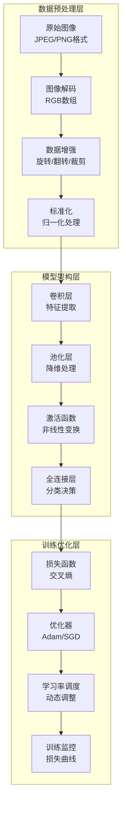

# 第8章：计算机视觉基础

> **设计思想**：将深度学习应用于图像处理，掌握CV基础技术

## 章节概述

计算机视觉是人工智能领域的重要分支，它致力于让计算机理解和处理图像及视频数据。在深度学习时代，卷积神经网络（CNN）的出现彻底改变了计算机视觉领域，使得图像分类、目标检测、图像分割等任务的性能得到了显著提升。

本章将带领Java程序员深入理解计算机视觉的基础知识，从图像预处理到经典CNN架构，再到完整的图像分类系统实现。我们将基于TinyAI框架，通过实际的代码示例和项目实践，帮助读者掌握计算机视觉的核心技术。

## 学习目标

完成本章学习后，你将：

- ✅ **掌握图像处理基础**：理解图像的数字化表示和基本处理技术
- ✅ **理解CNN核心原理**：掌握卷积、池化等核心操作的数学原理和实现
- ✅ **实现经典网络架构**：从LeNet到ResNet，理解网络架构的演进历程
- ✅ **构建完整CV系统**：实现从数据预处理到模型训练的完整流程
- ✅ **具备特征可视化能力**：掌握模型解释和可视化技术

## 章节内容

### 8.1 图像数据预处理与增强
**学习重点**：掌握图像数据的预处理技术和数据增强方法
- 图像的数字化表示和格式转换
- 标准化和归一化技术
- 数据增强：旋转、翻转、裁剪等
- 批处理和并行预处理

### 8.2 卷积神经网络基础：卷积与池化操作
**学习重点**：理解卷积和池化操作的数学原理和实现细节
- 卷积操作的数学定义和实现
- 池化操作的作用和类型
- 步长和填充的处理
- 多通道卷积的实现

### 8.3 经典CNN架构：从LeNet到ResNet
**学习重点**：理解CNN架构的演进历程和设计思想
- LeNet-5的经典架构分析
- AlexNet的深度网络突破
- VGG的简洁设计理念
- ResNet的残差连接创新

### 8.4 图像分类实战：CIFAR-10挑战
**学习重点**：实现完整的图像分类系统并进行性能优化
- CIFAR-10数据集介绍和分析
- 完整的分类流程实现
- 模型性能优化技巧
- 结果分析和可视化

### 8.5 特征可视化与模型解释
**学习重点**：掌握深度学习模型的可视化和解释技术
- 激活图可视化
- 类激活映射（CAM）
- 梯度加权类激活映射（Grad-CAM）
- 模型决策解释

### 8.6 综合项目：构建图像分类系统
**学习重点**：通过完整项目实践巩固所学知识
- 设计完整的图像分类系统架构
- 实现数据预处理流水线
- 训练和优化CNN模型
- 部署和测试分类系统

## 技术架构图

## 实践项目

**项目名称**：基于TinyAI的CIFAR-10图像分类系统

**项目目标**：
- 实现完整的图像分类流水线：数据预处理、模型训练、结果评估
- 构建多种CNN架构并比较性能
- 实现模型可视化和解释功能
- 优化训练过程，提升分类准确率

**技术要求**：
- 代码质量：完整注释、单元测试覆盖率>90%
- 性能指标：CIFAR-10分类准确率>85%
- 功能完整性：支持训练、评估、预测全流程

**预期成果**：
- 可运行的完整图像分类系统
- 性能测试报告和对比分析
- 模型可视化结果展示
- 技术文档和使用说明

## 本章小结

第8章将为读者建立起计算机视觉领域的完整知识体系，从基础的图像处理技术到先进的深度学习模型，再到实际的项目应用。通过本章的学习，读者将具备独立开发计算机视觉应用的能力，为后续章节中更高级的视觉任务（如目标检测、图像分割等）打下坚实基础。

---

**下一章预告**：第9章我们将进入自然语言处理领域，学习文本数据的处理技术和词嵌入等核心技术，这将为后续的大语言模型学习奠定基础。