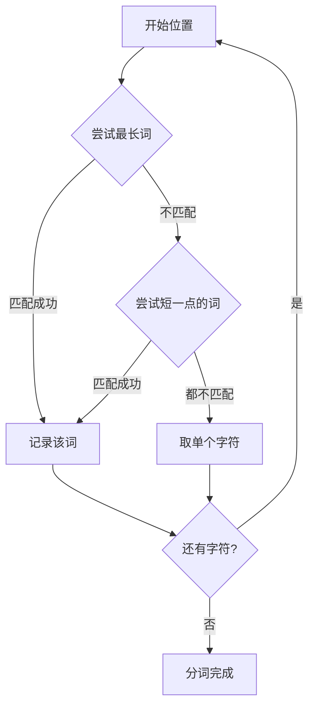
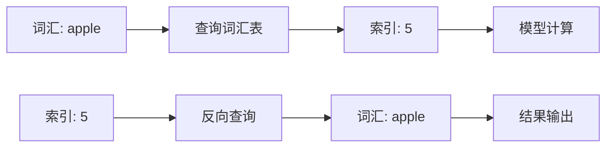
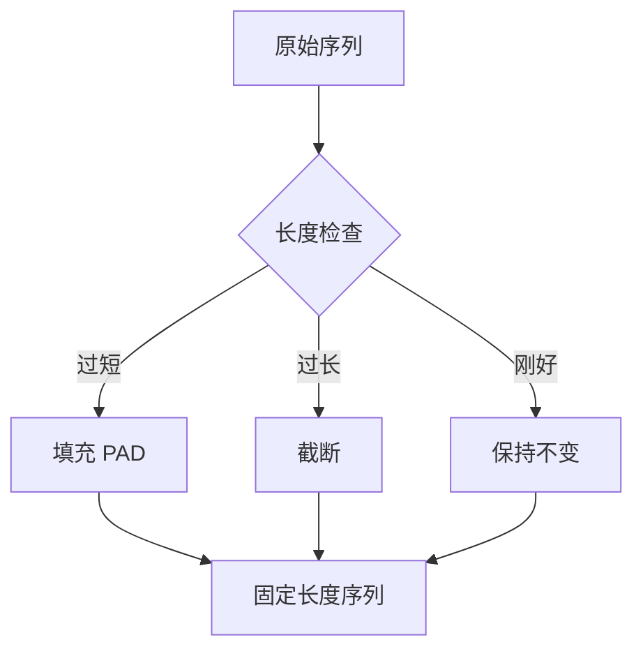
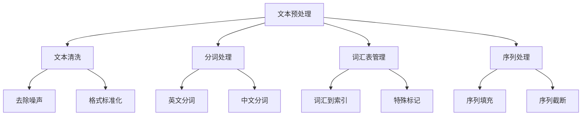

# 9.1 文本预处理：分词与编码

> **本节学习目标**：掌握文本数据的预处理技术和编码方法，为后续的NLP模型训练做好数据准备

## 内容概览

在自然语言处理任务中，原始文本数据通常需要经过一系列预处理步骤才能被机器学习模型有效利用。这些预处理步骤包括文本清洗、分词、编码等，它们直接影响着模型的性能和效果。本节将详细介绍文本预处理的核心技术，并基于TinyAI框架实现一个完整的文本预处理流水线。

## 为什么需要文本预处理？

### 从"做菜"理解文本预处理

想象你要用食材做一道菜。新鲜的食材买回来后不能直接下锅，需要先经过一系列处理：

- **清洗食材**：去掉泥土、杂质、不能吃的部分（类比**文本清洗**）
- **切配加工**：把整块食材切成合适的大小（类比**分词处理**）
- **标准化准备**：统一切块大小、摆放顺序（类比**编码转换**）

文本预处理就像是给计算机准备"食材"。原始文本就像刚买回来的食材，包含各种"杂质"和"不规则的形状"，计算机无法直接"烹饪"（处理）。我们需要通过预处理将文本转换为计算机能够"消化"的标准数值形式。

### 文本预处理的核心步骤


1. **文本清洗**：去除无关字符、标点符号、HTML标签等噪声数据
2. **分词处理**：将连续的文本切分为有意义的词汇单元
3. **编码转换**：将词汇映射为数值索引，形成模型可处理的数字序列

文本数据与图像或数值数据不同，它是一种非结构化的符号序列。为了让计算机能够处理和理解文本，我们需要将其转换为数值形式。这个转换过程直接影响着后续模型的效果。

## 9.1.1 文本清洗和标准化

### 技术原理：像"洗菜"一样清洗文本

文本清洗就像我们洗菜一样：买回来的蔬菜可能带着泥土、枯叶、虫眼，我们需要把这些"噪声"去掉，只保留能吃的部分。

**网页文本的"泥土"包括：**
- HTML标签（如`<p>`, `<div>`）：就像菜叶上的泥土
- 特殊字符和符号：就像菜根上的须根
- 多余的空格：就像菜叶间的杂质

**标准化就像"切菜规范"：**
- 统一大小写：就像把食材切成统一的大小
- 统一数字格式：就像把"一斤"、"500g"都转换为标准单位
- 统一标点符号：就像统一摆盘样式

文本清洗是预处理的第一步，目的是去除噪声数据，保留有用信息。这一步看似简单，但直接影响后续处理的质量。

### 文本清洗的实现

TinyAI框架提供了`TextCleaner`工具类来完成文本清洗工作。主要功能包括：

**核心清洗操作：**
1. **移除HTML标签**：使用正则表达式`<[^>]*>`匹配并删除所有标签
2. **统一空白字符**：将多个连续空格、制表符、换行符统一为单个空格
3. **过滤特殊字符**：只保留字母、数字、中文和基本标点符号
4. **去除首尾空格**：使用`trim()`方法清理边界空白

**标准化处理：**
1. **大小写转换**：将英文统一转为小写，避免"Apple"和"apple"被当作不同单词
2. **数字格式统一**：将"1,234"转换为"1234"，方便后续处理
3. **日期格式统一**：根据需求统一日期表示方式

```java
// 使用示例：清洗网页抓取的文本
String rawText = "<p>这是一个包含HTML标签的文本！价格是$1,234.56。</p>";
String cleaned = TextCleaner.cleanText(rawText);      // 去除HTML和特殊字符
String normalized = TextCleaner.normalizeText(cleaned); // 标准化处理

// 输出结果：
// 原始文本: <p>这是一个包含HTML标签的文本！价格是$1,234.56。</p>
// 清洗后: 这是一个包含HTML标签的文本！价格是1234.56。
// 标准化后: 这是一个包含html标签的文本！价格是1234.56。
```

## 9.1.2 分词算法详解

### 技术原理：像"切蛋糕"一样分词

**分词就像切蛋糕**：一整块蛋糕（完整文本）需要切成合适的小块（词汇单元）才能分享给大家（让计算机理解）。

**英文分词 vs 中文分词：**

- **英文像"切好线的巧克力"**：已经有明显的分割线（空格），直接掰开就行
  ```
  "Hello world" → ["Hello", "world"]
  ```

- **中文像"一整块蛋糕"**：没有明显分割线，需要根据经验（词典）判断从哪里切
  ```
  "自然语言处理" → ["自然语言", "处理"] 或 ["自然", "语言", "处理"]？
  ```

### 分词的挑战

中文分词的难点在于**切分歧义**。就像切蛋糕时要考虑：
- 每块要多大？（词的长度）
- 从哪里切？（词的边界）
- 怎样切最合理？（符合语义）

例如："结婚的和尚未结婚的" 可以理解为：
- "结婚的" + "和" + "尚未" + "结婚的"
- "结婚的" + "和尚" + "未" + "结婚的"

分词是将连续的文本切分为有意义的词汇单元的过程。不同的语言有不同的分词需求，比如英文可以通过空格自然分词，而中文则需要专门的分词算法。

### 基于规则的分词

**英文分词**相对简单，因为单词之间有天然的分隔符（空格）。TinyAI提供了两种基本的分词方式：

1. **按空格分词**：直接使用空格作为分隔符
   - 输入：`"Hello world"`
   - 输出：`["Hello", "world"]`

2. **按标点分词**：将标点符号也作为独立的词元
   - 输入：`"Hello, world!"`
   - 输出：`["Hello", ",", "world", "!"]`

这两种方法就像用不同的"切法"：空格分词只在空格处切开，标点分词则会在标点符号处额外切一刀。

```java
// 示例：英文分词
String text = "Hello, world! This is a test.";
List<String> tokens = SimpleTokenizer.tokenizeByPunctuation(text);
// 结果: ["Hello", ",", "world", "!", "This", "is", "a", "test", "."]

### 中文分词实现：前向最大匹配算法

**算法原理：像"拼图"一样找词**

想象你在玩拼图游戏，有一堆不同大小的拼图块（词典中的词），你需要从左到右把它们拼到一条线上（文本）。前向最大匹配的策略是：

1. **优先用大块**：先尝试最大的拼图块能否匹配
2. **逐步缩小**：如果大块不行，试试小一点的
3. **实在不行用单字**：如果所有词都不匹配，就用单个字符



**实际例子：**

假设词典包含：`["自然语言", "处理", "技术", "自然", "语言"]`

对文本"自然语言处理技术"的分词过程：

1. 位置0：尝试"自然语言处"（5字）→ 不在词典 → 尝试"自然语言"（4字）→ **匹配✓**
2. 位置4：尝试"处理技术"（4字）→ 不在词典 → 尝试"处理"（2字）→ **匹配✓**
3. 位置6：尝试"技术"（2字）→ **匹配✓**

最终结果：`["自然语言", "处理", "技术"]`

TinyAI的`ChineseTokenizer`实现了这个算法，使用时只需提供词典即可：

```java
// 创建词典
Set<String> dict = new HashSet<>(Arrays.asList(
    "自然语言", "处理", "技术", "人工智能"
));

// 创建分词器并使用
ChineseTokenizer tokenizer = new ChineseTokenizer(dict);
List<String> tokens = tokenizer.forwardMaxMatch("自然语言处理技术");
// 结果: ["自然语言", "处理", "技术"]
```

## 9.1.3 词汇表构建和管理

### 技术原理：词汇表就像"电话簿"

想象一个老式电话簿：
- **名字**对应**词汇**
- **电话号码**对应**数值索引**

当你想打电话给"张三"时，你在电话簿里查到他的号码是"123"，然后拨打这个数字。同样，当计算机要处理"自然语言"这个词时，它会在词汇表里查到索引"42"，然后用这个数字进行计算。



### 特殊标记的作用

词汇表中有几个特殊的"保留席位"，就像医院预留的急诊床位：

- **`<PAD>`（填充）**：像快递箱里的填充物，把短句子"填充"到统一长度
- **`<UNK>`（未知词）**：像字典里的"[生僻字]"标注，表示不认识的词
- **`<SOS>`（句子开始）**：像文章的开头引号，标记句子开始
- **`<EOS>`（句子结束）**：像文章的结尾句号，标记句子结束

在将文本转换为数值序列之前，我们需要构建一个词汇表（Vocabulary），用于维护词汇与其索引之间的映射关系。

### 词汇表的实现

TinyAI的`Vocabulary`类提供了完整的词汇表管理功能：

**核心功能：**

1. **双向映射**：维护"词汇→索引"和"索引→词汇"两个方向的查询
   - `wordToIndex`：快速查找词汇对应的数字（打电话时查号码）
   - `indexToWord`：快速查找数字对应的词汇（看到号码查名字）

2. **添加词汇**：自动分配递增的索引号
   ```java
   Vocabulary vocab = new Vocabulary();
   vocab.addToken("apple");   // 获得索引 4（前4个是特殊标记）
   vocab.addToken("banana");  // 获得索引 5
   ```

3. **查询机制**：支持正向和反向查询
   ```java
   int idx = vocab.getIndex("apple");  // 返回 4
   String word = vocab.getWord(4);      // 返回 "apple"
   ```

4. **未知词处理**：遇到词汇表中没有的词时，自动返回`<UNK>`的索引
   ```java
   int idx = vocab.getIndex("unknownword");  // 返回 <UNK> 的索引（1）
   ```

**词汇表构建示例：**

```java
// 从训练文本构建词汇表
Vocabulary vocab = new Vocabulary();
List<String> trainingTexts = Arrays.asList(
    "我喜欢苹果",
    "苹果很好吃",
    "我也喜欢香蕉"
);

// 遍历所有文本，添加词汇
for (String text : trainingTexts) {
    List<String> tokens = tokenizer.tokenize(text);
    vocab.addTokens(tokens);  // 批量添加
}

System.out.println("词汇表大小: " + vocab.size());
// 输出: 词汇表大小: 8  (4个特殊标记 + 4个词汇)

## 9.1.4 序列填充和截断

### 技术原理：像"整理书架"一样统一序列长度

想象你有一个书架，每层格子的宽度都是固定的（比如30厘米）：

- **短书**（短句子）：宽度不够，需要用**书立**（填充符`<PAD>`）撑住
- **长书**（长句子）：宽度超了，需要**截掉一部分**（截断）才能放进去



**为什么需要统一长度？**

神经网络就像流水线上的机器，每次只能处理固定规格的"零件"。如果输入长度不一致，就像给机器喂了大小不一的零件，会导致处理失败。

**填充和截断策略：**

1. **填充（Padding）**：在序列末尾添加特殊标记`<PAD>`
   ```
   原始: ["我", "喜欢", "苹果"]        (长度3)
   填充: ["我", "喜欢", "苹果", "<PAD>", "<PAD>"]  (长度5)
   ```

2. **截断（Truncation）**：保留序列的前N个或后N个元素
   ```
   原始: ["我", "非常", "喜欢", "吃", "苹果"]  (长度5)
   截断: ["我", "非常", "喜欢"]              (长度3，从左)
   ```

由于模型通常需要固定长度的输入序列，我们需要对文本序列进行填充或截断处理。这是批量训练的必要步骤。

### 序列处理的实现

TinyAI的`SequenceProcessor`提供了灵活的序列处理功能：

**关键参数说明：**

- `maxLength`：目标长度（书架格子的宽度）
- `padValue`：填充值（通常使用`<PAD>`的索引，默认为0）
- `truncateFromLeft`：截断方向
  - `false`：保留开头，截断末尾（常用于文本分类）
  - `true`：保留末尾，截断开头（用于保留最新信息）

**处理逻辑：**

```java
// 示例1：填充短序列
List<Integer> shortSeq = Arrays.asList(5, 10, 15);  // 长度3
List<Integer> padded = SequenceProcessor.padOrTruncate(
    shortSeq, 5, 0, false
);
// 结果: [5, 10, 15, 0, 0]  // 末尾填充0

// 示例2：截断长序列
List<Integer> longSeq = Arrays.asList(5, 10, 15, 20, 25, 30);  // 长度6
List<Integer> truncated = SequenceProcessor.padOrTruncate(
    longSeq, 4, 0, false
);
// 结果: [5, 10, 15, 20]  // 保留前4个

// 示例3：批量处理多个序列
List<List<Integer>> batch = Arrays.asList(
    Arrays.asList(1, 2),           // 短序列
    Arrays.asList(3, 4, 5, 6, 7)   // 长序列
);
int[][] processed = SequenceProcessor.batchPadOrTruncate(batch, 4, 0);
// 结果:
// [[1, 2, 0, 0],
//  [3, 4, 5, 6]]

## 9.1.5 完整的文本预处理流水线

### 流水线架构：从原始文本到数值序列

就像汽车制造流水线一样，文本预处理也需要经过多个"工位"，每个工位完成特定的加工任务：


**流水线处理流程：**

1. **清洗工位**：去除HTML标签、特殊字符（洗菜）
2. **标准化工位**：统一格式、大小写（切菜）
3. **分词工位**：切分为词汇单元（配菜）
4. **添加边界**：加上`<SOS>`和`<EOS>`标记（摆盘）
5. **索引转换**：词汇映射为数字（编码）
6. **填充截断**：统一序列长度（装盒）

现在我们将所有组件组合成一个完整的文本预处理流水线：

### TextPreprocessor：一站式预处理方案

TinyAI的`TextPreprocessor`类封装了完整的预处理流程，使用起来非常简单：

**核心方法：**

1. **`preprocessText(text, maxLength)`**：处理单个文本
2. **`preprocessBatch(texts, maxLength)`**：批量处理文本

**内部处理步骤：**

```java
public int[] preprocessText(String text, int maxLength) {
    // 步骤1: 清洗和标准化
    String cleaned = TextCleaner.cleanText(text);
    String normalized = TextCleaner.normalizeText(cleaned);
    
    // 步骤2: 分词
    List<String> tokens = tokenizer.forwardMaxMatch(normalized);
    
    // 步骤3: 添加边界标记 <SOS> ... <EOS>
    tokens.add(0, Vocabulary.SOS_TOKEN);
    tokens.add(Vocabulary.EOS_TOKEN);
    
    // 步骤4: 词汇转索引
    List<Integer> indices = tokens.stream()
        .map(vocabulary::getIndex)
        .collect(Collectors.toList());
    
    // 步骤5: 填充/截断到固定长度
    List<Integer> processed = SequenceProcessor.padOrTruncate(
        indices, maxLength, vocabulary.getPadIndex(), false);
    
    // 步骤6: 转为数组返回
    return processed.stream().mapToInt(Integer::intValue).toArray();
}
```

**使用示例：**

```java
// 创建预处理器
TextPreprocessor preprocessor = new TextPreprocessor(vocab, tokenizer);

// 处理单个文本
String text = "这部电影很好看";
int[] sequence = preprocessor.preprocessText(text, 10);
// 结果: [2, 45, 78, 12, 23, 3, 0, 0, 0, 0]
//       ↑   ↑   ↑   ↑   ↑  ↑  ↑  ↑  ↑  ↑
//     SOS 这部电影 很 好看 EOS PAD...

// 批量处理
List<String> texts = Arrays.asList("很好看", "不推荐");
int[][] batch = preprocessor.preprocessBatch(texts, 10);

## 9.1.6 实际应用示例：情感分析数据预处理

### 完整的预处理流程演示

让我们通过一个电影评论情感分析的例子，看看如何从零开始构建完整的文本预处理流水线：

**场景描述：**我们要构建一个电影评论情感分析系统，需要先将用户的评论文本转换为模型可以处理的数值序列。

**步骤1：准备词典**

首先收集常见的电影评论词汇，构建分词词典：

```java
Set<String> dictionary = new HashSet<>(Arrays.asList(
    "这部", "电影", "非常", "好看", "推荐", "很", "糟糕", "浪费", "时间"
    // ... 实际应用中可能有几千到几万个词
));
```

**步骤2：构建词汇表**

从训练数据中提取所有词汇，建立"词汇-索引"映射：

```java
Vocabulary vocabulary = new Vocabulary();
for (String text : trainingTexts) {
    List<String> tokens = tokenizer.forwardMaxMatch(text);
    vocabulary.addTokens(tokens);  // 自动添加新词并分配索引
}
```

**步骤3：预处理流水线**

```java
TextPreprocessor preprocessor = new TextPreprocessor(vocabulary, tokenizer);
String review = "这部电影很好看，推荐观看！";
int[] sequence = preprocessor.preprocessText(review, 20);
```

**处理过程可视化：**

```
原始文本: "这部电影很好看，推荐观看！"
    ↓ 清洗
"这部电影很好看推荐观看"
    ↓ 分词
["这部", "电影", "很", "好看", "推荐", "观看"]
    ↓ 添加边界
["<SOS>", "这部", "电影", "很", "好看", "推荐", "观看", "<EOS>"]
    ↓ 转索引
[2, 45, 78, 12, 23, 56, 89, 3]
    ↓ 填充到长度20
[2, 45, 78, 12, 23, 56, 89, 3, 0, 0, 0, 0, 0, 0, 0, 0, 0, 0, 0, 0]
```

**批量处理示例：**

```java
List<String> reviews = Arrays.asList(
    "很好看的电影",
    "不推荐",
    "浪费时间"
);

int[][] batchSequences = preprocessor.preprocessBatch(reviews, 15);
// 得到一个 3×15 的矩阵，每行是一条评论的数值序列
```

**关键要点：**

1. **词汇表要完整**：训练集中的所有词汇都应该在词汇表中
2. **长度要合适**：`maxLength`设置过短会丢失信息，过长会浪费计算资源
3. **特殊标记很重要**：`<SOS>`、`<EOS>`帮助模型理解句子边界
4. **批量处理更高效**：一次处理多条文本，充分利用并行计算

## 本节小结

### 核心知识回顾

本节通过"做菜"、"切蛋糕"、"电话簿"、"整理书架"等生活化的类比，深入浅出地介绍了文本预处理的核心技术：



**关键技术点：**

1. **文本清洗**：像洗菜一样去除"泥土"（HTML标签、特殊字符），保留有用信息
2. **分词算法**：
   - 英文：按空格切分（像切好线的巧克力）
   - 中文：前向最大匹配（像拼图游戏，优先用大块）
3. **词汇表**：像电话簿一样建立"词汇-索引"双向映射
4. **序列处理**：像整理书架一样统一长度（短的填充，长的截断）
5. **流水线**：组合所有步骤，实现一站式预处理

**实践要点：**

- 文本预处理是NLP的"地基"，质量直接影响模型效果
- TinyAI提供了完整的预处理工具链，开箱即用
- 关键参数（词典、最大长度、特殊标记）需要根据具体任务调整
- 批量处理比单条处理效率更高

### 思考与练习

1. **思考题**：为什么中文分词比英文分词更复杂？如果用前向最大匹配处理"结婚的和尚未结婚的"会有什么问题？

2. **实践题**：尝试为自己感兴趣的领域（如新闻、微博、对话）构建一个词典，并使用TinyAI的预处理流水线处理一些样本文本。

3. **扩展题**：研究一下除了前向最大匹配，还有哪些中文分词算法？它们各有什么优缺点？

## 下一步学习

在下一节中，我们将学习**词嵌入技术**，了解如何将离散的词汇转换为连续的向量表示。

如果说本节的"索引"是给每个词汇分配一个"号码"，那么词嵌入就是给每个词汇分配一个"坐标"，让意思相近的词在向量空间中也靠得更近。这就像是从"通讯录"升级到"地图"，让计算机能够理解词与词之间的语义关系。