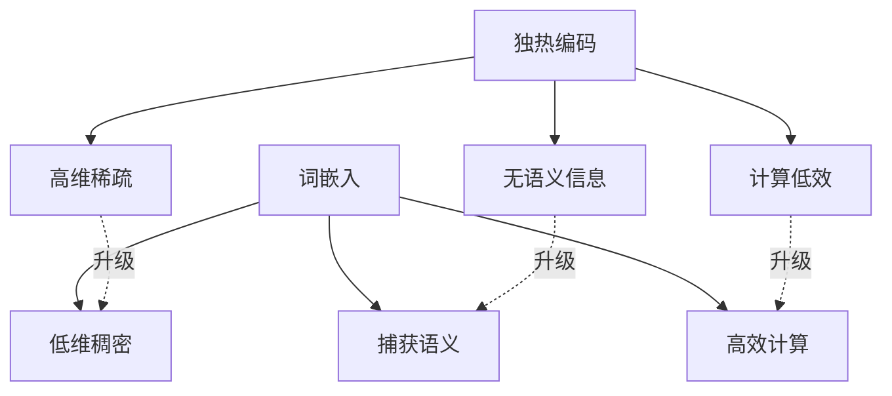
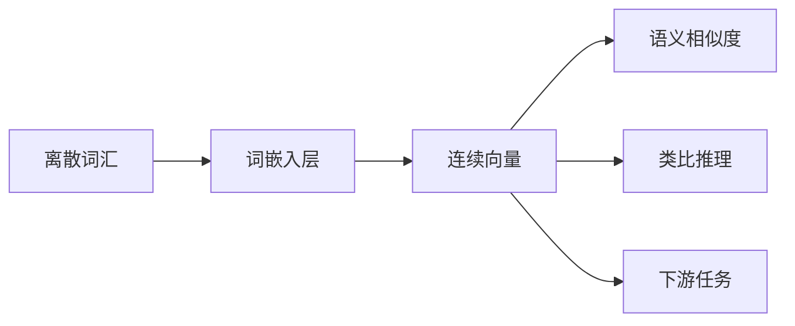
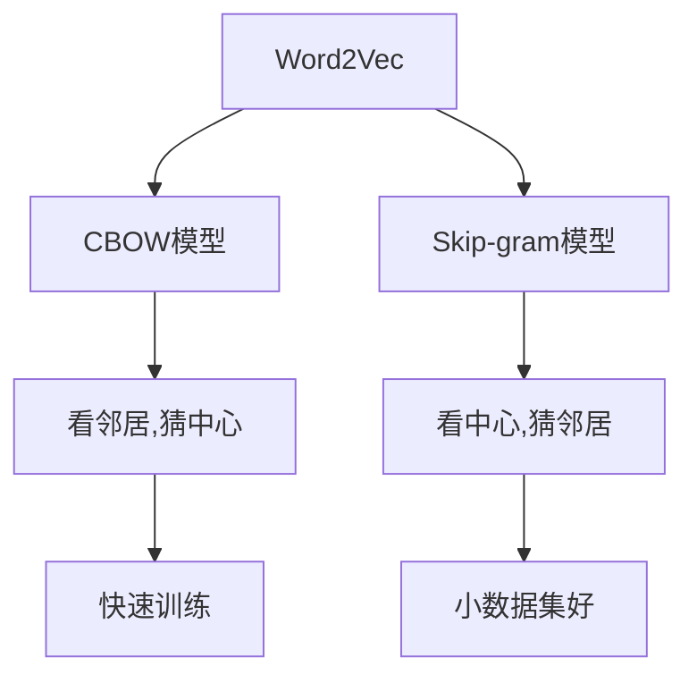
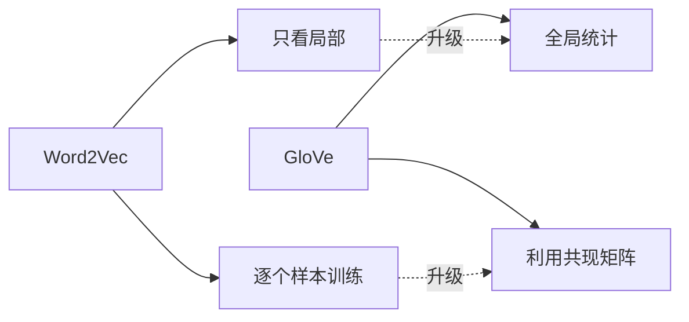
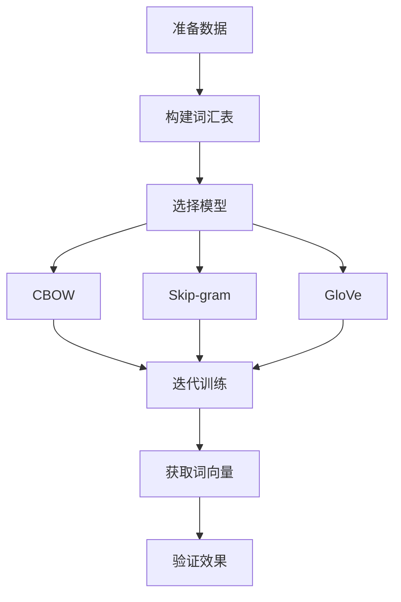
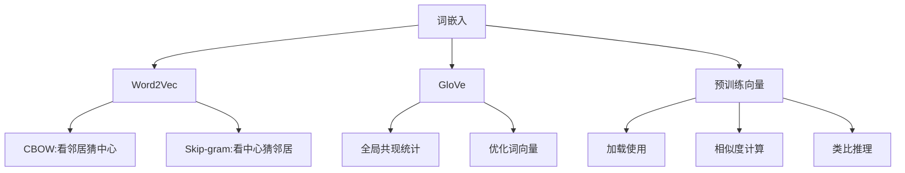

# 9.2 词嵌入技术：Word2Vec与GloVe

> **本节学习目标**：理解词嵌入的数学原理和实现方法，掌握Word2Vec和GloVe两种经典词嵌入模型

## 内容概览

在上一节中，我们学习了如何将文本转换为数值序列。然而，仅仅使用离散的索引无法表达词汇之间的语义关系。词嵌入（Word Embedding）技术通过将词汇映射到连续的向量空间中，使得语义相似的词汇在向量空间中距离较近，从而为NLP任务提供了强大的表示能力。

本节将深入探讨词嵌入的原理，并基于TinyAI框架实现Word2Vec和GloVe两种经典模型。

## 为什么需要词嵌入?

### 从"通讯录"到"地图":理解词嵌入的价值

还记得上一节的"电话簿"类比吗?我们给每个词分配了一个唯一的数字索引。但这就像只记录了每个人的电话号码,却不知道他们住在哪里、彼此关系如何。

**传统独热编码(One-Hot)的问题:**

想象一个极简单的词汇表:`["猫", "狗", "苹果"]`

```
独热编码:
猫    = [1, 0, 0]
狗    = [0, 1, 0]
苹果  = [0, 0, 1]
```

这种编码有三个致命缺陷:

1. **维度爆炸**:就像一栋楼有10000个房间,每个词对应一个房间号,但99.99%的房间都是空的(稀疏)
2. **没有语义**:"猫"和"狗"明明都是动物,应该比较相似,但它们的向量却完全不相关(正交)
3. **计算浪费**:就像快递员要扫描10000个格子才能找到一个有包裹的格子

**词嵌入:从"号码"到"坐标"**

词嵌入就像给每个词在地图上标注一个坐标位置:

```
词嵌入(2维示例):
猫    = [0.8, 0.9]   # 动物区域,偏宠物
狗    = [0.75, 0.85] # 动物区域,偏宠物  
苹果  = [-0.5, 0.2]  # 食物区域
```

现在你可以看出:"猫"和"狗"在地图上很近(都在动物宠物区),而"苹果"离它们很远(在食物区)。



**关键优势:**
- **低维稠密**:从10000维降到100-300维,没有空房间
- **语义相似**:相似的词在空间中靠得更近
- **计算高效**:向量小而密,计算更快

## 9.2.1 词嵌入的基本概念

### 技术原理:像"GPS坐标"一样定位词汇

**什么是词嵌入?**

词嵌入就像给地球上的每个城市分配GPS坐标(经度、纬度)。虽然城市本身是离散的(你不能说"半个北京"),但它们的坐标是连续的数值。通过坐标,我们可以:
- 计算两个城市的距离(相似度)
- 找到某个城市附近的其他城市(近义词)
- 进行方向运算:北京→东京的方向 ≈ 巴黎→莫斯科的方向(类比推理)

**词嵌入的神奇性质:**

1. **语义几何**:相似的词聚在一起
   ```
   水果区域: [苹果, 香蕉, 橙子, 葡萄]
   动物区域: [猫, 狗, 老虎, 狮子]
   职业区域: [医生, 教师, 工程师, 律师]
   ```

2. **类比运算**:向量的"加减法"有语义
   ```
   国王 - 男人 + 女人 ≈ 女王
   北京 - 中国 + 法国 ≈ 巴黎
   走 - 走过去式 + 吃 ≈ 吃过去式
   ```
   
   这就像地图上的方向:
   "从北京到中国边界的方向" ≈ "从巴黎到法国边界的方向"

3. **降维魔法**:把一本字典压缩成一张地图
   - 原始:10000个词 → 10000维独热编码(超大空间)
   - 嵌入:10000个词 → 300维连续向量(紧凑空间)



**数学表示(简洁版):**

- 词汇表大小:V = 10,000(一万个词)
- 嵌入维度:d = 300(每个词用300个数字表示)
- 嵌入矩阵:E ∈ ℝ^(10000×300)
- 词"猫"的向量:e_猫 = [0.23, -0.15, ..., 0.08] (300个数)

## 9.2.2 Word2Vec模型详解

### Word2Vec:通过"上下文"学习词义

**核心思想:"物以类聚,词以群分"**

你怎么知道"芒果"是一种水果?因为你经常看到:
- "我喜欢吃_____" (芒果、苹果、香蕉)
- "_____很甜" (芒果、西瓜、荔枝)
- "买了一些_____" (芒果、水果、蔬菜)

周围出现的词(上下文)暗示了这个词的含义。Word2Vec正是利用这个原理!

**两种学习策略:**



### 1. CBOW:"完形填空"游戏

**类比:猜词游戏**

```
给定句子:"我 喜欢 吃 _____ 很 甜"
上下文:["我", "喜欢", "吃", "很", "甜"]
答案:"芒果" (或其他水果)
```

CBOW就像在玩完形填空:根据周围的词猜中间的词。

**工作流程:**

1. **输入**:上下文词的向量 ["喜欢", "吃", "很", "甜"]
2. **平均**:把这些向量求平均(就像综合大家的意见)
3. **预测**:基于平均向量,猜测中心词是"芒果"的概率
4. **学习**:如果猜错了,调整词向量让下次猜得更准

**直观示意:**
```
上下文词向量:
"喜欢" → [0.1, 0.5, ...]
"吃"   → [0.2, 0.4, ...]  
"很"   → [0.3, 0.6, ...]   } 平均 → 隐藏层向量
"甜"   → [0.15, 0.55, ...]
                ↓
         预测"芒果"概率: 87%
```

### CBOW的TinyAI实现

TinyAI提供了完整的CBOW模型实现。核心组件包括:

**关键参数:**
- `vocabSize`:词汇表大小(如10000)
- `embeddingDim`:词向量维度(如300)
- `learningRate`:学习率(如0.01)

**两个嵌入矩阵:**
- `inputEmbeddings`:上下文词的向量表示
- `outputEmbeddings`:预测中心词的输出层权重

**核心方法:**
```java
// 1. 前向传播:计算预测概率
double prob = model.forwardPass(contextWords, targetWord);

// 2. 反向传播:更新词向量
model.backwardPass(contextWords, targetWord);

// 3. 获取训练好的词向量
double[] embedding = model.getEmbedding(wordIndex);
    
    /**
     * 构造函数
     */
    public CBOWModel(int vocabSize, int embeddingDim, double learningRate) {
        this.vocabSize = vocabSize;
        this.embeddingDim = embeddingDim;
        this.learningRate = learningRate;
        
        // 初始化嵌入矩阵
        this.inputEmbeddings = new double[vocabSize][embeddingDim];
        this.outputEmbeddings = new double[vocabSize][embeddingDim];
        
        // 随机初始化
        Random random = new Random(42);
        for (int i = 0; i < vocabSize; i++) {
            for (int j = 0; j < embeddingDim; j++) {
                inputEmbeddings[i][j] = (random.nextGaussian() * 0.1);
                outputEmbeddings[i][j] = (random.nextGaussian() * 0.1);
            }
        }
    }
    
    /**
     * 前向传播
     * @param contextWords 上下文词汇索引数组
     * @param targetWord 目标词汇索引
     * @return 预测概率
     */
    public double forwardPass(int[] contextWords, int targetWord) {
        // 1. 计算上下文词向量的平均值
        double[] hidden = new double[embeddingDim];
        for (int contextWord : contextWords) {
            for (int j = 0; j < embeddingDim; j++) {
                hidden[j] += inputEmbeddings[contextWord][j];
            }
        }
        
        // 取平均值
        for (int j = 0; j < embeddingDim; j++) {
            hidden[j] /= contextWords.length;
        }
        
        // 2. 计算输出层得分
        double[] scores = new double[vocabSize];
        double maxScore = Double.NEGATIVE_INFINITY;
        
        // 计算所有词汇的得分（带数值稳定性处理）
        for (int i = 0; i < vocabSize; i++) {
            double score = 0;
            for (int j = 0; j < embeddingDim; j++) {
                score += hidden[j] * outputEmbeddings[i][j];
            }
            scores[i] = score;
            if (score > maxScore) {
                maxScore = score;
            }
        }
        
        // 3. 计算softmax概率
        double sumExp = 0;
        for (int i = 0; i < vocabSize; i++) {
            scores[i] = Math.exp(scores[i] - maxScore);
            sumExp += scores[i];
        }
        
        // 归一化
        for (int i = 0; i < vocabSize; i++) {
            scores[i] /= sumExp;
        }
        
        return scores[targetWord];
    }
    
    /**
     * 反向传播和参数更新
     * @param contextWords 上下文词汇索引数组
     * @param targetWord 目标词汇索引
     */
    public void backwardPass(int[] contextWords, int targetWord) {
        int contextSize = contextWords.length;
        
        // 1. 前向传播计算隐藏层
        double[] hidden = new double[embeddingDim];
        for (int contextWord : contextWords) {
            for (int j = 0; j < embeddingDim; j++) {
                hidden[j] += inputEmbeddings[contextWord][j];
            }
        }
        
        for (int j = 0; j < embeddingDim; j++) {
            hidden[j] /= contextSize;
        }
        
        // 2. 计算输出层得分和概率
        double[] scores = new double[vocabSize];
        double[] probs = new double[vocabSize];
        double maxScore = Double.NEGATIVE_INFINITY;
        
        for (int i = 0; i < vocabSize; i++) {
            double score = 0;
            for (int j = 0; j < embeddingDim; j++) {
                score += hidden[j] * outputEmbeddings[i][j];
            }
            scores[i] = score;
            if (score > maxScore) {
                maxScore = score;
            }
        }
        
        double sumExp = 0;
        for (int i = 0; i < vocabSize; i++) {
            probs[i] = Math.exp(scores[i] - maxScore);
            sumExp += probs[i];
        }
        
        for (int i = 0; i < vocabSize; i++) {
            probs[i] /= sumExp;
        }
        
        // 3. 计算梯度
        // 输出层梯度
        double[] outputGrad = new double[vocabSize];
        System.arraycopy(probs, 0, outputGrad, 0, vocabSize);
        outputGrad[targetWord] -= 1;
        
        // 隐藏层梯度
        double[] hiddenGrad = new double[embeddingDim];
        for (int i = 0; i < vocabSize; i++) {
            for (int j = 0; j < embeddingDim; j++) {
                hiddenGrad[j] += outputGrad[i] * outputEmbeddings[i][j];
            }
        }
        
        // 4. 更新参数
        // 更新输出嵌入
        for (int i = 0; i < vocabSize; i++) {
            for (int j = 0; j < embeddingDim; j++) {
                outputEmbeddings[i][j] -= learningRate * outputGrad[i] * hidden[j];
            }
        }
        
        // 更新输入嵌入
        for (int contextWord : contextWords) {
            for (int j = 0; j < embeddingDim; j++) {
                inputEmbeddings[contextWord][j] -= learningRate * hiddenGrad[j] / contextSize;
            }
        }
    }
    
    /**
     * 获取词汇的嵌入向量
     * @param wordIndex 词汇索引
     * @return 嵌入向量
     */
    public double[] getEmbedding(int wordIndex) {
        return Arrays.copyOf(inputEmbeddings[wordIndex], embeddingDim);
    }
}
```

### 2. Skip-gram:"词语联想"游戏

**类比:看图说话**

```
给定中心词:"芒果"
预测上下文:应该出现哪些词?
  → "喜欢", "吃", "水果", "甜" ✓
  → "电脑", "编程", "代码" ✗
```

Skip-gram反过来:给你一个词,猜测它周围会出现什么词。

**工作流程:**

1. **输入**:中心词"芒果"的向量
2. **预测**:基于这个向量,预测周围每个位置的词
   - 前面第2个位置可能是:"喜欢"(概率85%)
   - 后面第1个位置可能是:"很"(概率90%)
3. **学习**:如果预测不对,调整词向量

**CBOW vs Skip-gram对比:**

| 特性 | CBOW | Skip-gram |
|------|------|----------|
| **学习方式** | 看周围猜中心 | 看中心猜周围 |
| **类比** | 完形填空 | 词语联想 |
| **训练速度** | 快 | 慢 |
| **小数据集** | 一般 | 更好 |
| **常见词** | 效果好 | 一般 |
| **罕见词** | 一般 | 效果好 |

**使用建议:**
- **大数据集,求速度** → 用CBOW
- **小数据集,重质量** → 用Skip-gram

### Skip-gram的TinyAI实现

核心逻辑与CBOW相似,但方向相反:

```java
// 对每个上下文位置分别预测
for (int contextWord : contextWords) {
    double prob = skipGram.forwardPass(centerWord, contextWord);
    skipGram.backwardPass(centerWord, contextWord);
}

```java
/**
 * Skip-gram模型实现
 */
public class SkipGramModel {
    private int vocabSize;      // 词汇表大小
    private int embeddingDim;   // 嵌入维度
    private double learningRate; // 学习率
    
    // 输入嵌入矩阵（中心词向量）
    private double[][] inputEmbeddings;
    // 输出嵌入矩阵（上下文词向量）
    private double[][] outputEmbeddings;
    
    /**
     * 构造函数
     */
    public SkipGramModel(int vocabSize, int embeddingDim, double learningRate) {
        this.vocabSize = vocabSize;
        this.embeddingDim = embeddingDim;
        this.learningRate = learningRate;
        
        // 初始化嵌入矩阵
        this.inputEmbeddings = new double[vocabSize][embeddingDim];
        this.outputEmbeddings = new double[vocabSize][embeddingDim];
        
        // 随机初始化
        Random random = new Random(42);
        for (int i = 0; i < vocabSize; i++) {
            for (int j = 0; j < embeddingDim; j++) {
                inputEmbeddings[i][j] = (random.nextGaussian() * 0.1);
                outputEmbeddings[i][j] = (random.nextGaussian() * 0.1);
            }
        }
    }
    
    /**
     * 前向传播（单个上下文词）
     * @param centerWord 中心词汇索引
     * @param contextWord 上下文词汇索引
     * @return 预测概率
     */
    public double forwardPass(int centerWord, int contextWord) {
        // 1. 获取中心词向量
        double[] centerVector = inputEmbeddings[centerWord];
        
        // 2. 计算输出层得分
        double[] scores = new double[vocabSize];
        double maxScore = Double.NEGATIVE_INFINITY;
        
        // 计算所有词汇的得分（带数值稳定性处理）
        for (int i = 0; i < vocabSize; i++) {
            double score = 0;
            for (int j = 0; j < embeddingDim; j++) {
                score += centerVector[j] * outputEmbeddings[i][j];
            }
            scores[i] = score;
            if (score > maxScore) {
                maxScore = score;
            }
        }
        
        // 3. 计算softmax概率
        double sumExp = 0;
        for (int i = 0; i < vocabSize; i++) {
            scores[i] = Math.exp(scores[i] - maxScore);
            sumExp += scores[i];
        }
        
        // 归一化
        for (int i = 0; i < vocabSize; i++) {
            scores[i] /= sumExp;
        }
        
        return scores[contextWord];
    }
    
    /**
     * 反向传播和参数更新（单个上下文词）
     * @param centerWord 中心词汇索引
     * @param contextWord 上下文词汇索引
     */
    public void backwardPass(int centerWord, int contextWord) {
        // 1. 获取中心词向量
        double[] centerVector = inputEmbeddings[centerWord];
        
        // 2. 计算输出层得分和概率
        double[] scores = new double[vocabSize];
        double[] probs = new double[vocabSize];
        double maxScore = Double.NEGATIVE_INFINITY;
        
        for (int i = 0; i < vocabSize; i++) {
            double score = 0;
            for (int j = 0; j < embeddingDim; j++) {
                score += centerVector[j] * outputEmbeddings[i][j];
            }
            scores[i] = score;
            if (score > maxScore) {
                maxScore = score;
            }
        }
        
        double sumExp = 0;
        for (int i = 0; i < vocabSize; i++) {
            probs[i] = Math.exp(scores[i] - maxScore);
            sumExp += probs[i];
        }
        
        for (int i = 0; i < vocabSize; i++) {
            probs[i] /= sumExp;
        }
        
        // 3. 计算梯度
        // 输出层梯度
        double[] outputGrad = new double[vocabSize];
        System.arraycopy(probs, 0, outputGrad, 0, vocabSize);
        outputGrad[contextWord] -= 1;
        
        // 中心词向量梯度
        double[] centerGrad = new double[embeddingDim];
        for (int i = 0; i < vocabSize; i++) {
            for (int j = 0; j < embeddingDim; j++) {
                centerGrad[j] += outputGrad[i] * outputEmbeddings[i][j];
            }
        }
        
        // 4. 更新参数
        // 更新输出嵌入
        for (int i = 0; i < vocabSize; i++) {
            for (int j = 0; j < embeddingDim; j++) {
                outputEmbeddings[i][j] -= learningRate * outputGrad[i] * centerVector[j];
            }
        }
        
        // 更新中心词嵌入
        for (int j = 0; j < embeddingDim; j++) {
            inputEmbeddings[centerWord][j] -= learningRate * centerGrad[j];
        }
    }
    
    /**
     * 批量训练（处理一个中心词的所有上下文词）
     * @param centerWord 中心词汇索引
     * @param contextWords 上下文词汇索引数组
     */
    public void trainBatch(int centerWord, int[] contextWords) {
        for (int contextWord : contextWords) {
            // 前向传播
            forwardPass(centerWord, contextWord);
            // 反向传播
            backwardPass(centerWord, contextWord);
        }
    }
    
    /**
     * 获取词汇的嵌入向量
     * @param wordIndex 词汇索引
     * @return 嵌入向量
     */
    public double[] getEmbedding(int wordIndex) {
        return Arrays.copyOf(inputEmbeddings[wordIndex], embeddingDim);
    }
}
```

## 9.2.3 GloVe模型详解

### GloVe:"统计全局,优化局部"

**Word2Vec的局限:**

Word2Vec就像一个学生,只看眼前的几个词(局部窗口),一次只学一个例子,没有宏观视野。

**GloVe的创新:"先统计再学习"**

类比:**做菜前先看菜谱**

1. **全局统计阶段**:先扫描整个语料库,统计词对共现次数
   ```
   "冰淇淋"和"甜"共现:500次
   "冰淇淋"和"热"共现:5次
   "冰淇淋"和"代码"共现:0次
   ```
   
   这就像做菜前先看完整本菜谱,知道哪些食材经常一起用。

2. **优化学习阶段**:根据共现统计,学习词向量
   - 共现次数多的词对 → 向量距离应该近
   - 共现次数少的词对 → 向量距离应该远

**GloVe的优势:**



- **全局信息**:考虑了整个语料库的统计特征
- **训练高效**:不需要重复扫描语料
- **性能优秀**:在很多任务上比Word2Vec更好

**核心思想:**

词向量的点积 应该 ≈ 词共现次数的对数

```
vec("冰淇淋") · vec("甜") ≈ log(500) = 6.2
vec("冰淇淋") · vec("热") ≈ log(5) = 1.6
```

这样,"冰淇淋"的向量自然会和"甜"更接近,和"热"更远。

### GloVe的TinyAI实现

TinyAI提供了完整的GloVe实现,使用起来非常简单:

**核心参数:**
- `xmax`:共现次数上限(如100),超过此值权重不再增加
- `alpha`:权重函数参数(如0.75),控制罕见词的权重

**训练流程:**

1. **构建共现矩阵**:统计所有词对的共现次数
   ```java
   double[][] cooccurrenceMatrix = buildCooccurrenceMatrix(sentences);
   ```

2. **迭代优化**:最小化目标函数
   ```java
   for (int epoch = 0; epoch < 100; epoch++) {
       for (每个词对 (i,j)) {
           if (共现次数 > 0) {
               glove.updateParameters(cooccurrence[i][j], i, j);
           }
       }
   }
   ```

3. **获取最终向量**:平均词向量和上下文向量
   ```java
   double[] embedding = glove.getFinalEmbedding(wordIndex);
   ```

**权重函数的作用:**

并非所有词对都同等重要:
- **高频词对**(如"the", "is"):共现太多,要降低权重
- **罕见词对**(共现1-2次):可能是噪声,也要降低权重  
- **中频词对**(共现10-100次):最有信息量,权重最高

```
权重 = (共现次数 / xmax)^alpha  (如果共现次数 < xmax)
权重 = 1.0                     (如果共现次数 >= xmax)
```
    
    /**
     * 构造函数
     */
    public GloveModel(int vocabSize, int embeddingDim, double learningRate, 
                     double xmax, double alpha) {
        this.vocabSize = vocabSize;
        this.embeddingDim = embeddingDim;
        this.learningRate = learningRate;
        this.xmax = xmax;
        this.alpha = alpha;
        
        // 初始化参数
        this.wordVectors = new double[vocabSize][embeddingDim];
        this.contextVectors = new double[vocabSize][embeddingDim];
        this.wordBiases = new double[vocabSize];
        this.contextBiases = new double[vocabSize];
        
        // 随机初始化
        Random random = new Random(42);
        for (int i = 0; i < vocabSize; i++) {
            for (int j = 0; j < embeddingDim; j++) {
                wordVectors[i][j] = (random.nextGaussian() * 0.1);
                contextVectors[i][j] = (random.nextGaussian() * 0.1);
            }
        }
    }
    
    /**
     * 权重函数
     * @param cooccurrence 共现次数
     * @return 权重值
     */
    private double weightFunction(double cooccurrence) {
        if (cooccurrence == 0) {
            return 0;
        }
        
        if (cooccurrence / xmax < 1.0) {
            return Math.pow(cooccurrence / xmax, alpha);
        } else {
            return 1.0;
        }
    }
    
    /**
     * 计算损失函数值
     * @param cooccurrence 共现次数
     * @param wordIndex 词汇索引
     * @param contextIndex 上下文词汇索引
     * @return 损失值
     */
    public double computeLoss(double cooccurrence, int wordIndex, int contextIndex) {
        if (cooccurrence == 0) {
            return 0;
        }
        
        // 计算点积
        double dotProduct = 0;
        for (int i = 0; i < embeddingDim; i++) {
            dotProduct += wordVectors[wordIndex][i] * contextVectors[contextIndex][i];
        }
        
        // 计算预测值
        double prediction = dotProduct + wordBiases[wordIndex] + contextBiases[contextIndex];
        
        // 计算误差
        double diff = prediction - Math.log(cooccurrence);
        
        // 计算加权损失
        double weight = weightFunction(cooccurrence);
        
        return weight * diff * diff;
    }
    
    /**
     * 计算梯度并更新参数
     * @param cooccurrence 共现次数
     * @param wordIndex 词汇索引
     * @param contextIndex 上下文词汇索引
     */
    public void updateParameters(double cooccurrence, int wordIndex, int contextIndex) {
        if (cooccurrence == 0) {
            return;
        }
        
        // 计算点积
        double dotProduct = 0;
        for (int i = 0; i < embeddingDim; i++) {
            dotProduct += wordVectors[wordIndex][i] * contextVectors[contextIndex][i];
        }
        
        // 计算预测值
        double prediction = dotProduct + wordBiases[wordIndex] + contextBiases[contextIndex];
        
        // 计算误差
        double diff = prediction - Math.log(cooccurrence);
        
        // 计算权重
        double weight = weightFunction(cooccurrence);
        
        // 计算梯度（乘以学习率）
        double gradient = learningRate * weight * diff;
        
        // 更新词向量
        for (int i = 0; i < embeddingDim; i++) {
            double temp = wordVectors[wordIndex][i];
            wordVectors[wordIndex][i] -= gradient * contextVectors[contextIndex][i];
            contextVectors[contextIndex][i] -= gradient * temp;
        }
        
        // 更新偏置项
        wordBiases[wordIndex] -= learningRate * weight * diff;
        contextBiases[contextIndex] -= learningRate * weight * diff;
    }
    
    /**
     * 获取词汇的最终嵌入向量（词向量和上下文向量的平均）
     * @param wordIndex 词汇索引
     * @return 最终嵌入向量
     */
    public double[] getFinalEmbedding(int wordIndex) {
        double[] finalEmbedding = new double[embeddingDim];
        for (int i = 0; i < embeddingDim; i++) {
            finalEmbedding[i] = (wordVectors[wordIndex][i] + contextVectors[wordIndex][i]) / 2.0;
        }
        return finalEmbedding;
    }
}
```

## 9.2.4 词嵌入的训练和使用

### 完整训练流程示例

让我们通过一个简化的例子,看看如何从零开始训练词向量:

**场景设定:**
- 小型词汇表:8个单词
- 训练语料:3个简单句子
- 目标:学习10维词向量

**训练步骤可视化:**



```java
/**
 * 词嵌入训练和使用示例
 */
public class WordEmbeddingExample {
    public static void main(String[] args) {
        // 示例词汇表
        String[] vocab = {"the", "quick", "brown", "fox", "jumps", "over", "lazy", "dog"};
        Map<String, Integer> wordToIndex = new HashMap<>();
        for (int i = 0; i < vocab.length; i++) {
            wordToIndex.put(vocab[i], i);
        }
        int vocabSize = vocab.length;
        
        // 示例训练数据（句子）
        String[] sentences = {
            "the quick brown fox jumps over the lazy dog",
            "the brown fox is quick",
            "the dog is lazy"
        };
        
        System.out.println("=== Word2Vec CBOW 示例 ===");
        demonstrateCBOW(wordToIndex, sentences);
        
        System.out.println("\n=== Word2Vec Skip-gram 示例 ===");
        demonstrateSkipGram(wordToIndex, sentences);
        
        System.out.println("\n=== GloVe 示例 ===");
        demonstrateGloVe(wordToIndex, sentences);
    }
    
    /**
     * CBOW模型演示
     */
    private static void demonstrateCBOW(Map<String, Integer> wordToIndex, String[] sentences) {
        int vocabSize = wordToIndex.size();
        int embeddingDim = 10;
        double learningRate = 0.01;
        
        CBOWModel cbow = new CBOWModel(vocabSize, embeddingDim, learningRate);
        
        // 构造训练数据
        List<int[]> trainingData = generateTrainingData(wordToIndex, sentences, 2);
        
        // 训练几个epoch
        int epochs = 100;
        for (int epoch = 0; epoch < epochs; epoch++) {
            double totalLoss = 0;
            for (int[] data : trainingData) {
                int targetWord = data[0];
                int[] contextWords = Arrays.copyOfRange(data, 1, data.length);
                
                double prob = cbow.forwardPass(contextWords, targetWord);
                // 简单的损失计算（负对数似然）
                double loss = -Math.log(prob + 1e-10);
                totalLoss += loss;
                
                cbow.backwardPass(contextWords, targetWord);
            }
            
            if (epoch % 20 == 0) {
                System.out.printf("Epoch %d, Average Loss: %.4f%n", epoch, totalLoss / trainingData.size());
            }
        }
        
        // 查看词向量
        System.out.println("词向量示例:");
        for (Map.Entry<String, Integer> entry : wordToIndex.entrySet()) {
            String word = entry.getKey();
            int index = entry.getValue();
            double[] embedding = cbow.getEmbedding(index);
            System.out.printf("%s: %s%n", word, Arrays.toString(Arrays.copyOf(embedding, 3)));
        }
    }
    
    /**
     * Skip-gram模型演示
     */
    private static void demonstrateSkipGram(Map<String, Integer> wordToIndex, String[] sentences) {
        int vocabSize = wordToIndex.size();
        int embeddingDim = 10;
        double learningRate = 0.01;
        
        SkipGramModel skipGram = new SkipGramModel(vocabSize, embeddingDim, learningRate);
        
        // 构造训练数据
        List<int[]> trainingData = generateTrainingData(wordToIndex, sentences, 2);
        
        // 训练几个epoch
        int epochs = 100;
        for (int epoch = 0; epoch < epochs; epoch++) {
            double totalLoss = 0;
            for (int[] data : trainingData) {
                int targetWord = data[0];
                int[] contextWords = Arrays.copyOfRange(data, 1, data.length);
                
                // 对每个上下文词进行训练
                for (int contextWord : contextWords) {
                    double prob = skipGram.forwardPass(targetWord, contextWord);
                    double loss = -Math.log(prob + 1e-10);
                    totalLoss += loss;
                    
                    skipGram.backwardPass(targetWord, contextWord);
                }
            }
            
            if (epoch % 20 == 0) {
                System.out.printf("Epoch %d, Average Loss: %.4f%n", epoch, totalLoss / trainingData.size());
            }
        }
        
        // 查看词向量
        System.out.println("词向量示例:");
        for (Map.Entry<String, Integer> entry : wordToIndex.entrySet()) {
            String word = entry.getKey();
            int index = entry.getValue();
            double[] embedding = skipGram.getEmbedding(index);
            System.out.printf("%s: %s%n", word, Arrays.toString(Arrays.copyOf(embedding, 3)));
        }
    }
    
    /**
     * GloVe模型演示
     */
    private static void demonstrateGloVe(Map<String, Integer> wordToIndex, String[] sentences) {
        int vocabSize = wordToIndex.size();
        int embeddingDim = 10;
        double learningRate = 0.01;
        double xmax = 100.0;
        double alpha = 0.75;
        
        GloveModel glove = new GloveModel(vocabSize, embeddingDim, learningRate, xmax, alpha);
        
        // 构造共现矩阵（简化示例）
        double[][] cooccurrenceMatrix = buildCooccurrenceMatrix(wordToIndex, sentences, 2);
        
        // 训练几个epoch
        int epochs = 100;
        for (int epoch = 0; epoch < epochs; epoch++) {
            double totalLoss = 0;
            int count = 0;
            
            for (int i = 0; i < vocabSize; i++) {
                for (int j = 0; j < vocabSize; j++) {
                    double cooccur = cooccurrenceMatrix[i][j];
                    if (cooccur > 0) {
                        double loss = glove.computeLoss(cooccur, i, j);
                        totalLoss += loss;
                        count++;
                        
                        glove.updateParameters(cooccur, i, j);
                    }
                }
            }
            
            if (epoch % 20 == 0) {
                System.out.printf("Epoch %d, Average Loss: %.4f%n", epoch, totalLoss / count);
            }
        }
        
        // 查看词向量
        System.out.println("词向量示例:");
        for (Map.Entry<String, Integer> entry : wordToIndex.entrySet()) {
            String word = entry.getKey();
            int index = entry.getValue();
            double[] embedding = glove.getFinalEmbedding(index);
            System.out.printf("%s: %s%n", word, Arrays.toString(Arrays.copyOf(embedding, 3)));
        }
    }
    
    /**
     * 生成训练数据
     */
    private static List<int[]> generateTrainingData(Map<String, Integer> wordToIndex, 
                                                   String[] sentences, int windowSize) {
        List<int[]> trainingData = new ArrayList<>();
        
        for (String sentence : sentences) {
            String[] words = sentence.split(" ");
            int[] wordIndices = new int[words.length];
            
            for (int i = 0; i < words.length; i++) {
                wordIndices[i] = wordToIndex.getOrDefault(words[i], 
                    wordToIndex.get("<UNK>"));
            }
            
            // 生成训练样本
            for (int i = 0; i < wordIndices.length; i++) {
                List<Integer> context = new ArrayList<>();
                
                // 收集上下文词汇
                for (int j = Math.max(0, i - windowSize); 
                     j < Math.min(wordIndices.length, i + windowSize + 1); j++) {
                    if (j != i) {
                        context.add(wordIndices[j]);
                    }
                }
                
                if (!context.isEmpty()) {
                    int[] sample = new int[context.size() + 1];
                    sample[0] = wordIndices[i]; // 目标词
                    for (int k = 0; k < context.size(); k++) {
                        sample[k + 1] = context.get(k);
                    }
                    trainingData.add(sample);
                }
            }
        }
        
        return trainingData;
    }
    
    /**
     * 构建共现矩阵
     */
    private static double[][] buildCooccurrenceMatrix(Map<String, Integer> wordToIndex, 
                                                     String[] sentences, int windowSize) {
        int vocabSize = wordToIndex.size();
        double[][] matrix = new double[vocabSize][vocabSize];
        
        for (String sentence : sentences) {
            String[] words = sentence.split(" ");
            int[] wordIndices = new int[words.length];
            
            for (int i = 0; i < words.length; i++) {
                wordIndices[i] = wordToIndex.getOrDefault(words[i], 
                    wordToIndex.get("<UNK>"));
            }
            
            // 计算共现次数
            for (int i = 0; i < wordIndices.length; i++) {
                int centerWord = wordIndices[i];
                
                for (int j = Math.max(0, i - windowSize); 
                     j < Math.min(wordIndices.length, i + windowSize + 1); j++) {
                    if (j != i) {
                        int contextWord = wordIndices[j];
                        // 使用距离衰减
                        double distanceDecay = 1.0 / Math.abs(i - j);
                        matrix[centerWord][contextWord] += distanceDecay;
                    }
                }
            }
        }
        
        return matrix;
    }
}
```

## 9.2.5 预训练词向量的使用

### 为什么用预训练词向量?

**类比:为什么用地图而不是自己测绘?**

自己训练词向量就像自己测绘地图:
- 需要大量数据(走遍每条街道)
- 耗时很长(几天甚至几周训练时间)
- 需要计算资源(高性能服务器)

使用预训练词向量就像直接用Google地图:
- 已在海量文本上训练过(维基百科、新闻等)
- 质量很高(专业团队优化)
- 开箱即用(下载就能用)

**常见的预训练词向量:**

1. **Word2Vec**:Google发布,在Google News上训练
2. **GloVe**:斯坦福发布,在Common Crawl、Twitter等数据上训练  
3. **FastText**:Facebook发布,支持中文等多种语言

### TinyAI加载和使用预训练向量

**核心功能:**

1. **加载词向量文件**
   ```java
   PretrainedEmbeddings embeddings = new PretrainedEmbeddings();
   embeddings.loadFromFile("glove.6B.100d.txt");
   // 加载了50000个词向量,维度:100
   ```

2. **查询词向量**
   ```java
   double[] catVec = embeddings.getVector("cat");
   double[] dogVec = embeddings.getVector("dog");
   ```

3. **计算相似度**
   ```java
   double similarity = embeddings.cosineSimilarity("king", "queen");
   // 输出: 0.76 (很相似!)
   ```

4. **找相似词**
   ```java
   List<String> similar = embeddings.findMostSimilar("apple", 5);
   // 输出: ["orange", "banana", "fruit", "grape", "strawberry"]
   ```

**实用示例:词语类比**

```java
// 计算: king - man + woman ≈ ?
vector result = vec("king") - vec("man") + vec("woman");
String answer = embeddings.findClosest(result);
// 答案: "queen"

// 计算: Paris - France + China ≈ ?
vector result = vec("Paris") - vec("France") + vec("China");  
String answer = embeddings.findClosest(result);
// 答案: "Beijing"
```

```java
/**
 * 预训练词向量工具类
 */
public class PretrainedEmbeddings {
    private Map<String, double[]> wordVectors;
    private int dimension;
    
    /**
     * 从文件加载预训练词向量
     * @param filePath 词向量文件路径
     */
    public void loadFromFile(String filePath) throws IOException {
        wordVectors = new HashMap<>();
        
        try (BufferedReader reader = Files.newBufferedReader(Paths.get(filePath))) {
            String line = reader.readLine(); // 第一行通常是元信息
            
            while ((line = reader.readLine()) != null) {
                String[] parts = line.trim().split("\\s+");
                if (parts.length < 2) continue;
                
                String word = parts[0];
                double[] vector = new double[parts.length - 1];
                
                for (int i = 1; i < parts.length; i++) {
                    vector[i - 1] = Double.parseDouble(parts[i]);
                }
                
                wordVectors.put(word, vector);
                dimension = vector.length;
            }
        }
        
        System.out.println("加载了 " + wordVectors.size() + " 个词向量，维度: " + dimension);
    }
    
    /**
     * 获取词汇的向量表示
     * @param word 词汇
     * @return 向量，如果词汇不存在则返回null
     */
    public double[] getVector(String word) {
        return wordVectors.get(word);
    }
    
    /**
     * 计算两个词汇向量之间的余弦相似度
     * @param word1 词汇1
     * @param word2 词汇2
     * @return 余弦相似度
     */
    public double cosineSimilarity(String word1, String word2) {
        double[] vec1 = getVector(word1);
        double[] vec2 = getVector(word2);
        
        if (vec1 == null || vec2 == null) {
            return -1; // 表示无法计算
        }
        
        return cosineSimilarity(vec1, vec2);
    }
    
    /**
     * 计算两个向量之间的余弦相似度
     * @param vec1 向量1
     * @param vec2 向量2
     * @return 余弦相似度
     */
    private double cosineSimilarity(double[] vec1, double[] vec2) {
        double dotProduct = 0.0;
        double norm1 = 0.0;
        double norm2 = 0.0;
        
        for (int i = 0; i < vec1.length; i++) {
            dotProduct += vec1[i] * vec2[i];
            norm1 += vec1[i] * vec1[i];
            norm2 += vec2[i] * vec2[i];
        }
        
        if (norm1 == 0 || norm2 == 0) {
            return 0;
        }
        
        return dotProduct / (Math.sqrt(norm1) * Math.sqrt(norm2));
    }
    
    /**
     * 查找与给定词汇最相似的词汇
     * @param word 目标词汇
     * @param topK 返回前K个最相似的词汇
     * @return 最相似的词汇列表
     */
    public List<Map.Entry<String, Double>> findMostSimilar(String word, int topK) {
        double[] targetVector = getVector(word);
        if (targetVector == null) {
            return new ArrayList<>();
        }
        
        PriorityQueue<Map.Entry<String, Double>> similarityQueue = 
            new PriorityQueue<>(Map.Entry.comparingByValue());
        
        for (Map.Entry<String, double[]> entry : wordVectors.entrySet()) {
            String candidateWord = entry.getKey();
            if (candidateWord.equals(word)) continue;
            
            double[] candidateVector = entry.getValue();
            double similarity = cosineSimilarity(targetVector, candidateVector);
            
            if (similarityQueue.size() < topK) {
                similarityQueue.offer(new AbstractMap.SimpleEntry<>(candidateWord, similarity));
            } else if (similarity > similarityQueue.peek().getValue()) {
                similarityQueue.poll();
                similarityQueue.offer(new AbstractMap.SimpleEntry<>(candidateWord, similarity));
            }
        }
        
        List<Map.Entry<String, Double>> result = new ArrayList<>();
        while (!similarityQueue.isEmpty()) {
            result.add(0, similarityQueue.poll()); // 反向添加以获得降序排列
        }
        
        return result;
    }
    
    /**
     * 获取词汇表大小
     */
    public int getVocabSize() {
        return wordVectors.size();
    }
    
    /**
     * 获取向量维度
     */
    public int getDimension() {
        return dimension;
    }
}
```

## 本节小结

### 核心知识回顾

本节通过"地图"、"完形填空"、"词语联想"等生活化类比,深入浅出地介绍了词嵌入技术:



**三个核心模型对比:**

| 特性 | CBOW | Skip-gram | GloVe |
|------|------|-----------|-------|
| **学习方式** | 上下文→中心词 | 中心词→上下文 | 共现统计 |
| **训练速度** | 快 | 中等 | 快 |
| **小数据集** | 一般 | 好 | 好 |
| **常见词** | 好 | 一般 | 好 |
| **罕见词** | 一般 | 好 | 中等 |
| **最适合** | 大语料快速训练 | 小语料精细训练 | 利用全局统计 |

**关键要点:**

1. **词嵌入≠索引**:从"电话号码"升级到"地图坐标",捕获语义关系
2. **两种策略**:CBOW快速实用,Skip-gram小数据表现好
3. **全局vs局部**:GloVe先统计后学习,Word2Vec逐个样本学习
4. **拿来主义**:实际项目中多用预训练向量,站在巨人肩膀上

**实践建议:**

- **快速原型**:直接用预训练向量(GloVe、Word2Vec)
- **领域数据**:在预训练向量基础上,用领域语料微调
- **从零训练**:只在有大量标注数据且领域特殊时考虑

### 思考与练习

1. **思考题**:为什么"king - man + woman ≈ queen"这个类比成立?向量加减法背后的语义是什么?

2. **实践题**:使用TinyAI加载预训练词向量,找出与"快乐"最相似的10个词,观察它们是否符合你的预期。

3. **扩展题**:尝试理解为什么词嵌入能捕获语义?提示:想想"物以类聚,词以群分"的原理。

## 下一步学习

在下一节中,我们将学习**循环神经网络(RNN)及其变体LSTM和GRU**。

**为什么需要RNN?**

词嵌入解决了"词的表示"问题,但还有个问题:如何理解"句子"?

- 词嵌入:给每个词一个向量 → 理解单个词
- RNN:处理词的序列 → 理解整个句子的意思

类比:
- 词嵌入 = 认识每个汉字
- RNN = 理解一句话的意思

"我 爱 你" 和 "你 爱 我" 虽然包含相同的词,但意思完全不同!RNN能够理解词的顺序,捕获句子的语义。下一节将揭秘RNN如何做到这一点!