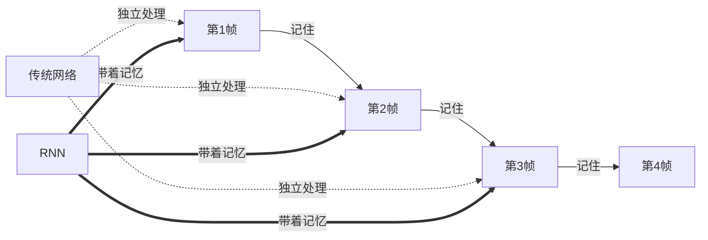
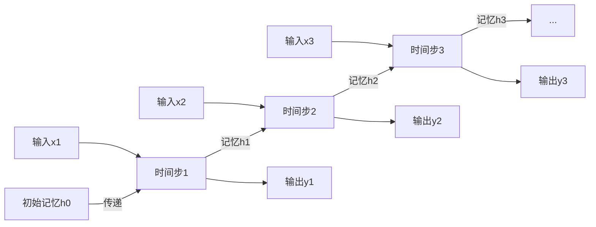
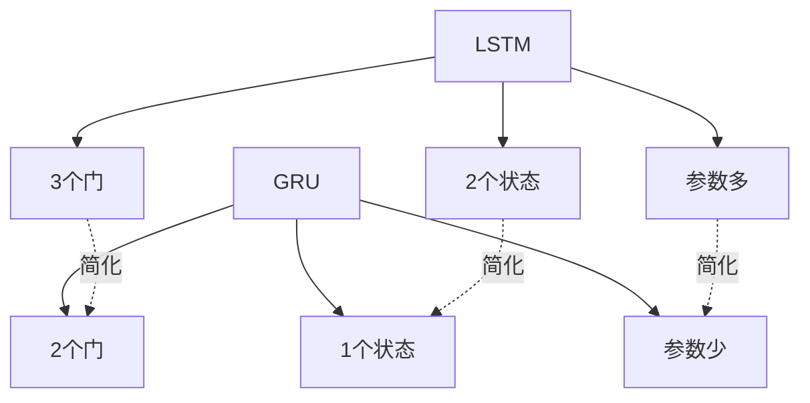
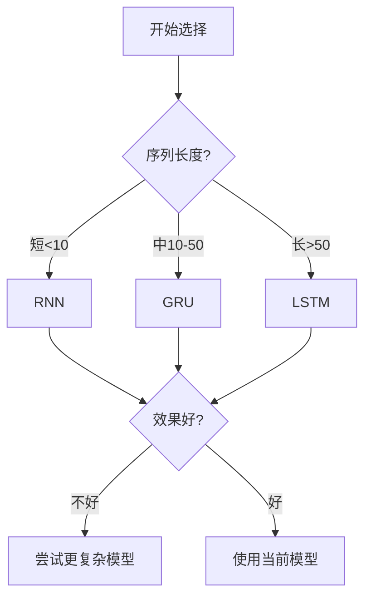
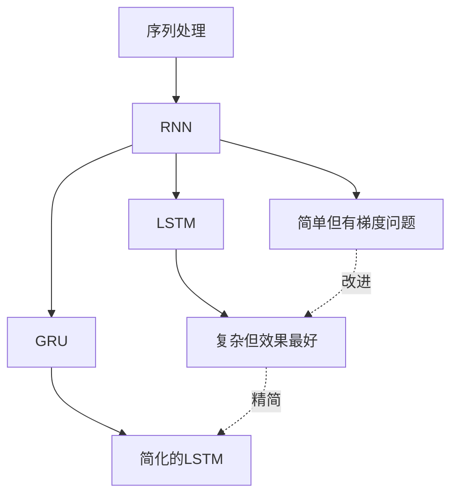

# 9.3 循环神经网络：RNN、LSTM与GRU

> **本节学习目标**：掌握循环神经网络的核心结构和实现，理解LSTM和GRU如何解决RNN的梯度消失问题

## 内容概览

循环神经网络（Recurrent Neural Network, RNN）是一类专门用于处理序列数据的神经网络。与前馈神经网络不同，RNN具有记忆能力，能够利用序列中的历史信息来影响当前的输出。本节将详细介绍RNN的基本结构、存在的问题以及改进版本LSTM和GRU。

## 为什么需要循环神经网络？

### 从"看电影"理解序列处理

**传统神经网络的局限：**

想象你在看一部电影，但每次只能看一帧画面，而且看完就忘记之前的内容。这样你能理解剧情吗？

- **看第1帧**：一个人站在门口 → 不知道他要干什么
- **看第2帧**：同一个人走进房间 → 不知道他从哪来
- **看第3帧**：他坐下来 → 完全不知道前因后果

传统前馈神经网络就像这样，每次只看当前输入，没有"记忆"。

**RNN的创新：带上"记忆"看电影**



RNN就像一个有记忆的观众，能够：
- **记住前面的剧情**（隐藏状态保存历史信息）
- **理解上下文**（当前输入+历史记忆→输出）
- **处理任意长度**（电影多长都能看完）

**RNN解决的三大问题：**

1. **变长序列**：就像电影有长有短，RNN都能处理
   - 短评论："很好看" (3个词)
   - 长评论："这部电影的剧情跌宕起伏..." (100+个词)

2. **长距离依赖**：能记住开头和结尾的呼应
   ```
   "我出生在中国，...（中间100个词）...所以我说中文。"
   模型需要记住"中国"才能预测"中文"
   ```

3. **参数共享**：同一个"看电影"的能力用于每一帧
   - 不需要为每个时间步训练不同的参数
   - 就像用同一双眼睛看每一帧画面

## 9.3.1 RNN基本结构

### 技术原理：像"接力赛"一样传递信息

**RNN的核心机制：**

RNN就像一场接力赛，每个时间步都是一棒：

1. **接棒**：接收上一棒传来的"记忆"（隐藏状态 h_{t-1}）
2. **加料**：结合当前的"新信息"（当前输入 x_t）
3. **处理**：混合"旧记忆+新信息"，更新记忆（新隐藏状态 h_t）
4. **传棒**：把更新后的记忆传给下一棒
5. **输出**：基于当前记忆做出预测（输出 y_t）



**具体例子：情感分析**

句子："这部 电影 很 好看"

```
时间步1: "这部"
  接收：h0 = [0,0,0] (初始空记忆)
  输入：x1 = vec("这部")
  处理：h1 = 混合(h0, x1) = [0.2, 0.1, 0.3]
  输出：y1 = 预测情感倾向 (还不确定)

时间步2: "电影"  
  接收：h1 = [0.2, 0.1, 0.3]
  输入：x2 = vec("电影")
  处理：h2 = 混合(h1, x2) = [0.3, 0.2, 0.5]
  输出：y2 = 预测情感倾向 (稍微确定了)

时间步3: "很"
  接收：h2 = [0.3, 0.2, 0.5]  
  输入：x3 = vec("很")
  处理：h3 = 混合(h2, x3) = [0.4, 0.5, 0.6]
  输出：y3 = 预测情感倾向 (有点正面)

时间步4: "好看"
  接收：h3 = [0.4, 0.5, 0.6]
  输入：x4 = vec("好看")  
  处理：h4 = 混合(h3, x4) = [0.7, 0.8, 0.9]
  输出：y4 = 预测情感倾向 (明确正面！) ✓
```

**数学公式（简化版）：**

每个时间步的计算：
```
新记忆 = 激活函数(旧记忆 × 权重1 + 新输入 × 权重2 + 偏置)
h_t = tanh(h_{t-1} × W_hh + x_t × W_xh + b_h)

输出 = 记忆 × 权重3 + 偏置
y_t = h_t × W_hy + b_y
```

**关键点：**
- **参数共享**：所有时间步用同一套权重（W_hh, W_xh, W_hy）
- **循环连接**：h_t 依赖 h_{t-1}，形成"记忆链"
- **灵活长度**：序列多长都用同样的处理方式

### RNN的TinyAI实现

TinyAI提供了完整的RNN实现，核心方法包括：

**关键组件：**
- `wXh`：输入到隐藏层的权重（新信息如何融入记忆）
- `wHh`：隐藏层到隐藏层的权重（旧记忆如何传递）
- `wHy`：隐藏层到输出的权重（记忆如何产生输出）

**核心方法：**
```java
// 单步前向传播
double[] hidden = rnn.forwardStep(input, prevHidden);

// 完整序列处理
RNNOutput result = rnn.forward(inputSequence);
```

```java
/**
 * 循环神经网络（RNN）实现
 */
public class RNN {
    private int inputSize;      // 输入维度
    private int hiddenSize;     // 隐藏层维度
    private int outputSize;     // 输出维度
    
    // 权重矩阵
    private double[][] wXh;     // 输入到隐藏层权重
    private double[][] wHh;     // 隐藏层到隐藏层权重
    private double[][] wHy;     // 隐藏层到输出权重
    
    // 偏置向量
    private double[] bH;        // 隐藏层偏置
    private double[] bY;        // 输出层偏置
    
    // 激活函数
    private ActivationFunction activation;
    
    /**
     * 构造函数
     */
    public RNN(int inputSize, int hiddenSize, int outputSize) {
        this.inputSize = inputSize;
        this.hiddenSize = hiddenSize;
        this.outputSize = outputSize;
        
        // 初始化权重矩阵
        this.wXh = initializeMatrix(inputSize, hiddenSize);
        this.wHh = initializeMatrix(hiddenSize, hiddenSize);
        this.wHy = initializeMatrix(hiddenSize, outputSize);
        
        // 初始化偏置向量
        this.bH = new double[hiddenSize];
        this.bY = new double[outputSize];
        
        // 使用tanh激活函数
        this.activation = new TanhActivation();
    }
    
    /**
     * 初始化权重矩阵
     */
    private double[][] initializeMatrix(int rows, int cols) {
        double[][] matrix = new double[rows][cols];
        Random random = new Random(42);
        
        // Xavier初始化
        double scale = Math.sqrt(6.0 / (rows + cols));
        for (int i = 0; i < rows; i++) {
            for (int j = 0; j < cols; j++) {
                matrix[i][j] = (random.nextDouble() * 2 - 1) * scale;
            }
        }
        
        return matrix;
    }
    
    /**
     * 前向传播（单个时间步）
     * @param input 输入向量
     * @param prevHidden 上一时间步的隐藏状态
     * @return 当前时间步的隐藏状态
     */
    public double[] forwardStep(double[] input, double[] prevHidden) {
        // 计算隐藏状态: h_t = tanh(W_hh * h_{t-1} + W_xh * x_t + b_h)
        double[] hidden = new double[hiddenSize];
        
        // W_hh * h_{t-1}
        for (int i = 0; i < hiddenSize; i++) {
            for (int j = 0; j < hiddenSize; j++) {
                hidden[i] += wHh[j][i] * prevHidden[j];
            }
        }
        
        // W_xh * x_t
        for (int i = 0; i < hiddenSize; i++) {
            for (int j = 0; j < inputSize; j++) {
                hidden[i] += wXh[j][i] * input[j];
            }
        }
        
        // 加上偏置
        for (int i = 0; i < hiddenSize; i++) {
            hidden[i] += bH[i];
        }
        
        // 应用激活函数
        return activation.forward(hidden);
    }
    
    /**
     * 完整序列的前向传播
     * @param inputs 输入序列
     * @return 隐藏状态序列和输出序列
     */
    public RNNOutput forward(double[][] inputs) {
        int sequenceLength = inputs.length;
        double[][] hiddenStates = new double[sequenceLength][hiddenSize];
        double[][] outputs = new double[sequenceLength][outputSize];
        
        // 初始隐藏状态为零向量
        double[] prevHidden = new double[hiddenSize];
        
        // 逐时间步计算
        for (int t = 0; t < sequenceLength; t++) {
            // 计算当前时间步的隐藏状态
            hiddenStates[t] = forwardStep(inputs[t], prevHidden);
            prevHidden = hiddenStates[t];
            
            // 计算输出: y_t = W_hy * h_t + b_y
            for (int i = 0; i < outputSize; i++) {
                outputs[t][i] = bY[i];
                for (int j = 0; j < hiddenSize; j++) {
                    outputs[t][i] += wHy[j][i] * hiddenStates[t][j];
                }
            }
        }
        
        return new RNNOutput(hiddenStates, outputs);
    }
    
    /**
     * 计算损失函数（均方误差）
     * @param predictions 预测值
     * @param targets 真实值
     * @return 损失值
     */
    public double computeLoss(double[][] predictions, double[][] targets) {
        if (predictions.length != targets.length) {
            throw new IllegalArgumentException("预测值和真实值序列长度不匹配");
        }
        
        double totalLoss = 0;
        int count = 0;
        
        for (int t = 0; t < predictions.length; t++) {
            for (int i = 0; i < predictions[t].length; i++) {
                double diff = predictions[t][i] - targets[t][i];
                totalLoss += diff * diff;
                count++;
            }
        }
        
        return totalLoss / count;
    }
    
    /**
     * 获取模型参数（用于序列化）
     */
    public RNNParameters getParameters() {
        return new RNNParameters(wXh, wHh, wHy, bH, bY);
    }
    
    /**
     * 设置模型参数
     */
    public void setParameters(RNNParameters parameters) {
        this.wXh = parameters.getWXh();
        this.wHh = parameters.getWHh();
        this.wHy = parameters.getWHy();
        this.bH = parameters.getBH();
        this.bY = parameters.getBY();
    }
    
    // Getter方法
    public int getInputSize() { return inputSize; }
    public int getHiddenSize() { return hiddenSize; }
    public int getOutputSize() { return outputSize; }
}

/**
 * RNN输出结果封装类
 */
class RNNOutput {
    private double[][] hiddenStates;
    private double[][] outputs;
    
    public RNNOutput(double[][] hiddenStates, double[][] outputs) {
        this.hiddenStates = hiddenStates;
        this.outputs = outputs;
    }
    
    public double[][] getHiddenStates() { return hiddenStates; }
    public double[][] getOutputs() { return outputs; }
}

/**
 * RNN参数封装类
 */
class RNNParameters {
    private double[][] wXh;
    private double[][] wHh;
    private double[][] wHy;
    private double[] bH;
    private double[] bY;
    
    public RNNParameters(double[][] wXh, double[][] wHh, double[][] wHy, 
                        double[] bH, double[] bY) {
        this.wXh = wXh;
        this.wHh = wHh;
        this.wHy = wHy;
        this.bH = bH;
        this.bY = bY;
    }
    
    // Getter方法
    public double[][] getWXh() { return wXh; }
    public double[][] getWHh() { return wHh; }
    public double[][] getWHy() { return wHy; }
    public double[] getBH() { return bH; }
    public double[] getBY() { return bY; }
}
```

## 9.3.2 RNN存在的问题

尽管RNN在理论上能够处理任意长度的序列，但在实际应用中存在严重问题：

### 梯度消失问题

在反向传播过程中，梯度需要通过时间反向传播（Backpropagation Through Time, BPTT），当序列较长时，梯度会逐层衰减，导致：

1. **难以学习长距离依赖**：网络无法有效利用序列早期的信息
2. **训练困难**：梯度过小导致参数更新缓慢

### 梯度爆炸问题

在某些情况下，梯度可能会指数级增长，导致：

1. **数值不稳定**：权重更新过大，模型无法收敛
2. **训练失败**：损失函数出现NaN或无穷大值

### 梯度裁剪实现

为了解决梯度爆炸问题，我们可以使用梯度裁剪技术：

```java
/**
 * 梯度裁剪工具类
 */
public class GradientClipping {
    
    /**
     * 按范数裁剪梯度
     * @param gradients 梯度数组
     * @param maxNorm 最大范数阈值
     * @return 裁剪后的梯度
     */
    public static double[][] clipByNorm(double[][] gradients, double maxNorm) {
        double norm = computeNorm(gradients);
        
        if (norm > maxNorm) {
            double scale = maxNorm / norm;
            return scaleMatrix(gradients, scale);
        }
        
        return gradients;
    }
    
    /**
     * 按值裁剪梯度
     * @param gradients 梯度数组
     * @param clipValue 裁剪值
     * @return 裁剪后的梯度
     */
    public static double[][] clipByValue(double[][] gradients, double clipValue) {
        double[][] clipped = new double[gradients.length][];
        
        for (int i = 0; i < gradients.length; i++) {
            clipped[i] = new double[gradients[i].length];
            for (int j = 0; j < gradients[i].length; j++) {
                clipped[i][j] = Math.max(-clipValue, Math.min(clipValue, gradients[i][j]));
            }
        }
        
        return clipped;
    }
    
    /**
     * 计算矩阵的L2范数
     */
    private static double computeNorm(double[][] matrix) {
        double sum = 0;
        for (int i = 0; i < matrix.length; i++) {
            for (int j = 0; j < matrix[i].length; j++) {
                sum += matrix[i][j] * matrix[i][j];
            }
        }
        return Math.sqrt(sum);
    }
    
    /**
     * 缩放矩阵
     */
    private static double[][] scaleMatrix(double[][] matrix, double scale) {
        double[][] scaled = new double[matrix.length][];
        
        for (int i = 0; i < matrix.length; i++) {
            scaled[i] = new double[matrix[i].length];
            for (int j = 0; j < matrix[i].length; j++) {
                scaled[i][j] = matrix[i][j] * scale;
            }
        }
        
        return scaled;
    }
}
```

## 9.3.3 LSTM网络：更聪明的"记忆系统"

### 技术原理：像"笔记本"一样管理记忆

LSTM通过三个"门卫"管理记忆：

1. **遗忘门**：决定擦除哪些旧信息
2. **输入门**：决定记录哪些新信息  
3. **输出门**：决定输出哪些信息

核心优势：细胞状态像笔记本，能长期保存信息。

### LSTM的TinyAI实现

TinyAI提供了完整的LSTM实现,核心方法包括:

```java
// 单步前向传播
LSTMState state = lstm.forwardStep(input, prevState);

// 完整序列处理
LSTMOutput result = lstm.forward(inputSequence);
```

**关键组件:**
- 三个门控机制(遗忘门、输入门、输出门)
- 细胞状态(Cell State)用于长期记忆
- 隐藏状态(Hidden State)用于当前输出

```java
/**
 * 长短期记忆网络（LSTM）实现
 */
public class LSTM {
    private int inputSize;      // 输入维度
    private int hiddenSize;     // 隐藏层维度
    private int outputSize;     // 输出维度
    
    // LSTM门控权重矩阵
    private double[][] wF;      // 遗忘门权重
    private double[][] wI;      // 输入门权重
    private double[][] wC;      // 候选细胞状态权重
    private double[][] wO;      // 输出门权重
    
    // 隐藏状态到门控的权重矩阵
    private double[][] uF;      // 遗忘门隐藏权重
    private double[][] uI;      // 输入门隐藏权重
    private double[][] uC;      // 候选细胞状态隐藏权重
    private double[][] uO;      // 输出门隐藏权重
    
    // 门控偏置向量
    private double[] bF;        // 遗忘门偏置
    private double[] bI;        // 输入门偏置
    private double[] bC;        // 候选细胞状态偏置
    private double[] bO;        // 输出门偏置
    
    // 输出层权重和偏置
    private double[][] wY;      // 输出权重
    private double[] bY;        // 输出偏置
    
    // 激活函数
    private SigmoidActivation sigmoid;
    private TanhActivation tanh;
    
    /**
     * 构造函数
     */
    public LSTM(int inputSize, int hiddenSize, int outputSize) {
        this.inputSize = inputSize;
        this.hiddenSize = hiddenSize;
        this.outputSize = outputSize;
        
        // 初始化门控权重
        this.wF = initializeMatrix(inputSize, hiddenSize);
        this.wI = initializeMatrix(inputSize, hiddenSize);
        this.wC = initializeMatrix(inputSize, hiddenSize);
        this.wO = initializeMatrix(inputSize, hiddenSize);
        
        // 初始化隐藏状态权重
        this.uF = initializeMatrix(hiddenSize, hiddenSize);
        this.uI = initializeMatrix(hiddenSize, hiddenSize);
        this.uC = initializeMatrix(hiddenSize, hiddenSize);
        this.uO = initializeMatrix(hiddenSize, hiddenSize);
        
        // 初始化偏置
        this.bF = new double[hiddenSize];
        this.bI = new double[hiddenSize];
        this.bC = new double[hiddenSize];
        this.bO = new double[hiddenSize];
        
        // 初始化输出层参数
        this.wY = initializeMatrix(hiddenSize, outputSize);
        this.bY = new double[outputSize];
        
        // 初始化激活函数
        this.sigmoid = new SigmoidActivation();
        this.tanh = new TanhActivation();
    }
    
    /**
     * 初始化权重矩阵
     */
    private double[][] initializeMatrix(int rows, int cols) {
        double[][] matrix = new double[rows][cols];
        Random random = new Random(42);
        
        // Xavier初始化
        double scale = Math.sqrt(6.0 / (rows + cols));
        for (int i = 0; i < rows; i++) {
            for (int j = 0; j < cols; j++) {
                matrix[i][j] = (random.nextDouble() * 2 - 1) * scale;
            }
        }
        
        return matrix;
    }
    
    /**
     * LSTM单元计算（单个时间步）
     * @param input 输入向量
     * @param prevState 前一时间步的状态
     * @return 当前时间步的状态
     */
    public LSTMState forwardStep(double[] input, LSTMState prevState) {
        double[] prevHidden = prevState.getHidden();
        double[] prevCell = prevState.getCell();
        
        // 连接输入和前一隐藏状态
        double[] concat = concatenate(input, prevHidden);
        
        // 计算各个门控
        // 遗忘门: f_t = σ(W_f * [h_{t-1}, x_t] + b_f)
        double[] forgetGate = computeGate(wF, uF, bF, concat, prevHidden, sigmoid);
        
        // 输入门: i_t = σ(W_i * [h_{t-1}, x_t] + b_i)
        double[] inputGate = computeGate(wI, uI, bI, concat, prevHidden, sigmoid);
        
        // 候选细胞状态: C̃_t = tanh(W_C * [h_{t-1}, x_t] + b_C)
        double[] candidateCell = computeGate(wC, uC, bC, concat, prevHidden, tanh);
        
        // 细胞状态: C_t = f_t * C_{t-1} + i_t * C̃_t
        double[] cellState = new double[hiddenSize];
        for (int i = 0; i < hiddenSize; i++) {
            cellState[i] = forgetGate[i] * prevCell[i] + inputGate[i] * candidateCell[i];
        }
        
        // 输出门: o_t = σ(W_o * [h_{t-1}, x_t] + b_o)
        double[] outputGate = computeGate(wO, uO, bO, concat, prevHidden, sigmoid);
        
        // 隐藏状态: h_t = o_t * tanh(C_t)
        double[] hiddenState = new double[hiddenSize];
        double[] tanhCell = tanh.forward(cellState);
        for (int i = 0; i < hiddenSize; i++) {
            hiddenState[i] = outputGate[i] * tanhCell[i];
        }
        
        return new LSTMState(hiddenState, cellState);
    }
    
    /**
     * 计算门控值
     */
    private double[] computeGate(double[][] wInput, double[][] wHidden, double[] bias,
                               double[] concat, double[] prevHidden, 
                               ActivationFunction activation) {
        double[] gate = new double[hiddenSize];
        
        // W * input
        for (int i = 0; i < hiddenSize; i++) {
            for (int j = 0; j < concat.length; j++) {
                gate[i] += wInput[j][i] * concat[j];
            }
        }
        
        // U * hidden
        for (int i = 0; i < hiddenSize; i++) {
            for (int j = 0; j < hiddenSize; j++) {
                gate[i] += wHidden[j][i] * prevHidden[j];
            }
        }
        
        // 加上偏置
        for (int i = 0; i < hiddenSize; i++) {
            gate[i] += bias[i];
        }
        
        // 应用激活函数
        return activation.forward(gate);
    }
    
    /**
     * 连接两个向量
     */
    private double[] concatenate(double[] a, double[] b) {
        double[] result = new double[a.length + b.length];
        System.arraycopy(a, 0, result, 0, a.length);
        System.arraycopy(b, 0, result, a.length, b.length);
        return result;
    }
    
    /**
     * 完整序列的前向传播
     * @param inputs 输入序列
     * @return LSTM输出结果
     */
    public LSTMOutput forward(double[][] inputs) {
        int sequenceLength = inputs.length;
        double[][] hiddenStates = new double[sequenceLength][hiddenSize];
        double[][] cellStates = new double[sequenceLength][hiddenSize];
        double[][] outputs = new double[sequenceLength][outputSize];
        
        // 初始状态
        LSTMState prevState = new LSTMState(
            new double[hiddenSize],  // 初始隐藏状态为零向量
            new double[hiddenSize]   // 初始细胞状态为零向量
        );
        
        // 逐时间步计算
        for (int t = 0; t < sequenceLength; t++) {
            LSTMState currentState = forwardStep(inputs[t], prevState);
            hiddenStates[t] = currentState.getHidden();
            cellStates[t] = currentState.getCell();
            prevState = currentState;
            
            // 计算输出
            for (int i = 0; i < outputSize; i++) {
                outputs[t][i] = bY[i];
                for (int j = 0; j < hiddenSize; j++) {
                    outputs[t][i] += wY[j][i] * hiddenStates[t][j];
                }
            }
        }
        
        return new LSTMOutput(hiddenStates, cellStates, outputs);
    }
    
    // Getter方法
    public int getInputSize() { return inputSize; }
    public int getHiddenSize() { return hiddenSize; }
    public int getOutputSize() { return outputSize; }
}

/**
 * LSTM状态封装类
 */
class LSTMState {
    private double[] hidden;
    private double[] cell;
    
    public LSTMState(double[] hidden, double[] cell) {
        this.hidden = hidden;
        this.cell = cell;
    }
    
    public double[] getHidden() { return hidden; }
    public double[] getCell() { return cell; }
}

/**
 * LSTM输出结果封装类
 */
class LSTMOutput {
    private double[][] hiddenStates;
    private double[][] cellStates;
    private double[][] outputs;
    
    public LSTMOutput(double[][] hiddenStates, double[][] cellStates, double[][] outputs) {
        this.hiddenStates = hiddenStates;
        this.cellStates = cellStates;
        this.outputs = outputs;
    }
    
    public double[][] getHiddenStates() { return hiddenStates; }
    public double[][] getCellStates() { return cellStates; }
    public double[][] getOutputs() { return outputs; }
}
```

## 9.3.4 GRU网络:LSTM的"精简版"

### 技术原理:像"简化的笔记本"

**LSTM vs GRU 对比:**

LSTM就像一个功能齐全的笔记本:
- 3个门控(遗忘门、输入门、输出门)
- 2个状态(细胞状态、隐藏状态)  
- 复杂但功能强大

GRU就像一个简化的便签本:
- 2个门控(重置门、更新门)
- 1个状态(隐藏状态)
- 简单但同样有效



**GRU的两个门控:**

1. **更新门(Update Gate)**:决定保留多少旧记忆
   - 类比:翻到新一页前,要不要保留前面的内容?
   - 公式:z_t = σ(W_z · [h_{t-1}, x_t])

2. **重置门(Reset Gate)**:决定遗忘多少历史信息  
   - 类比:写新内容前,要不要擦掉旧内容?
   - 公式:r_t = σ(W_r · [h_{t-1}, x_t])

**处理流程示例:**

```
旧记忆: "今天天气很好"
新信息: "但是下雨了"

重置门: 需要忘记"天气很好"吗? → 是的,重置它
更新门: 用"下雨了"更新记忆吗? → 是的,更新

新记忆: "今天下雨了"
```

**LSTM vs GRU 实用对比:**

| 特性 | LSTM | GRU |
|------|------|-----|
| **门控数量** | 3个 | 2个 |
| **参数数量** | 多(训练慢) | 少(训练快) |
| **记忆机制** | 复杂(2个状态) | 简单(1个状态) |
| **性能** | 稍好 | 相当 |
| **适用场景** | 复杂任务,数据充足 | 简单任务,数据有限 |
| **训练速度** | 较慢 | 较快 |

**选择建议:**
- **数据充足,追求极致性能** → 用LSTM
- **数据有限,追求训练速度** → 用GRU  
- **不确定** → 先试GRU(更快),效果不够再换LSTM

### GRU的TinyAI实现

TinyAI提供了完整的GRU实现,使用方式与LSTM类似:

```java
// 创建GRU模型
GRU gru = new GRU(inputSize, hiddenSize, outputSize);

// 单步处理
double[] hidden = gru.forwardStep(input, prevHidden);

// 序列处理  
GRUOutput result = gru.forward(inputSequence);
```

**核心优势:**
- 参数少,训练快
- 效果接近LSTM
- 更容易调参

```java
/**
 * 门控循环单元（GRU）实现
 */
public class GRU {
    private int inputSize;      // 输入维度
    private int hiddenSize;     // 隐藏层维度
    private int outputSize;     // 输出维度
    
    // GRU权重矩阵
    private double[][] wZ;      // 更新门输入权重
    private double[][] wR;      // 重置门输入权重
    private double[][] wH;      // 候选隐藏状态输入权重
    
    // 隐藏状态权重矩阵
    private double[][] uZ;      // 更新门隐藏权重
    private double[][] uR;      // 重置门隐藏权重
    private double[][] uH;      // 候选隐藏状态隐藏权重
    
    // 偏置向量
    private double[] bZ;        // 更新门偏置
    private double[] bR;        // 重置门偏置
    private double[] bH;        // 候选隐藏状态偏置
    
    // 输出层参数
    private double[][] wY;      // 输出权重
    private double[] bY;        // 输出偏置
    
    // 激活函数
    private SigmoidActivation sigmoid;
    private TanhActivation tanh;
    
    /**
     * 构造函数
     */
    public GRU(int inputSize, int hiddenSize, int outputSize) {
        this.inputSize = inputSize;
        this.hiddenSize = hiddenSize;
        this.outputSize = outputSize;
        
        // 初始化权重矩阵
        this.wZ = initializeMatrix(inputSize, hiddenSize);
        this.wR = initializeMatrix(inputSize, hiddenSize);
        this.wH = initializeMatrix(inputSize, hiddenSize);
        
        this.uZ = initializeMatrix(hiddenSize, hiddenSize);
        this.uR = initializeMatrix(hiddenSize, hiddenSize);
        this.uH = initializeMatrix(hiddenSize, hiddenSize);
        
        // 初始化偏置
        this.bZ = new double[hiddenSize];
        this.bR = new double[hiddenSize];
        this.bH = new double[hiddenSize];
        
        // 初始化输出层参数
        this.wY = initializeMatrix(hiddenSize, outputSize);
        this.bY = new double[outputSize];
        
        // 初始化激活函数
        this.sigmoid = new SigmoidActivation();
        this.tanh = new TanhActivation();
    }
    
    /**
     * 初始化权重矩阵
     */
    private double[][] initializeMatrix(int rows, int cols) {
        double[][] matrix = new double[rows][cols];
        Random random = new Random(42);
        
        // Xavier初始化
        double scale = Math.sqrt(6.0 / (rows + cols));
        for (int i = 0; i < rows; i++) {
            for (int j = 0; j < cols; j++) {
                matrix[i][j] = (random.nextDouble() * 2 - 1) * scale;
            }
        }
        
        return matrix;
    }
    
    /**
     * GRU单元计算（单个时间步）
     * @param input 输入向量
     * @param prevHidden 前一时间步的隐藏状态
     * @return 当前时间步的隐藏状态
     */
    public double[] forwardStep(double[] input, double[] prevHidden) {
        // 连接输入和前一隐藏状态
        double[] concat = concatenate(input, prevHidden);
        
        // 计算更新门: z_t = σ(W_z * [h_{t-1}, x_t] + b_z)
        double[] updateGate = computeGate(wZ, uZ, bZ, concat, prevHidden, sigmoid);
        
        // 计算重置门: r_t = σ(W_r * [h_{t-1}, x_t] + b_r)
        double[] resetGate = computeGate(wR, uR, bR, concat, prevHidden, sigmoid);
        
        // 计算候选隐藏状态
        // r_t * h_{t-1}
        double[] resetHidden = new double[hiddenSize];
        for (int i = 0; i < hiddenSize; i++) {
            resetHidden[i] = resetGate[i] * prevHidden[i];
        }
        
        // 连接重置后的隐藏状态和输入
        double[] resetConcat = concatenate(input, resetHidden);
        
        // 候选隐藏状态: h̃_t = tanh(W * [r_t * h_{t-1}, x_t] + b)
        double[] candidateHidden = new double[hiddenSize];
        
        // W * [r_t * h_{t-1}, x_t]
        for (int i = 0; i < hiddenSize; i++) {
            for (int j = 0; j < resetConcat.length; j++) {
                candidateHidden[i] += wH[j][i] * resetConcat[j];
            }
        }
        
        // 加上偏置
        for (int i = 0; i < hiddenSize; i++) {
            candidateHidden[i] += bH[i];
        }
        
        candidateHidden = tanh.forward(candidateHidden);
        
        // 计算最终隐藏状态: h_t = (1 - z_t) * h_{t-1} + z_t * h̃_t
        double[] hiddenState = new double[hiddenSize];
        for (int i = 0; i < hiddenSize; i++) {
            hiddenState[i] = (1 - updateGate[i]) * prevHidden[i] + 
                           updateGate[i] * candidateHidden[i];
        }
        
        return hiddenState;
    }
    
    /**
     * 计算门控值
     */
    private double[] computeGate(double[][] wInput, double[][] wHidden, double[] bias,
                               double[] concat, double[] prevHidden, 
                               ActivationFunction activation) {
        double[] gate = new double[hiddenSize];
        
        // W * input
        for (int i = 0; i < hiddenSize; i++) {
            for (int j = 0; j < concat.length; j++) {
                gate[i] += wInput[j][i] * concat[j];
            }
        }
        
        // U * hidden
        for (int i = 0; i < hiddenSize; i++) {
            for (int j = 0; j < hiddenSize; j++) {
                gate[i] += wHidden[j][i] * prevHidden[j];
            }
        }
        
        // 加上偏置
        for (int i = 0; i < hiddenSize; i++) {
            gate[i] += bias[i];
        }
        
        // 应用激活函数
        return activation.forward(gate);
    }
    
    /**
     * 连接两个向量
     */
    private double[] concatenate(double[] a, double[] b) {
        double[] result = new double[a.length + b.length];
        System.arraycopy(a, 0, result, 0, a.length);
        System.arraycopy(b, 0, result, a.length, b.length);
        return result;
    }
    
    /**
     * 完整序列的前向传播
     * @param inputs 输入序列
     * @return 隐藏状态序列和输出序列
     */
    public GRUOutput forward(double[][] inputs) {
        int sequenceLength = inputs.length;
        double[][] hiddenStates = new double[sequenceLength][hiddenSize];
        double[][] outputs = new double[sequenceLength][outputSize];
        
        // 初始隐藏状态为零向量
        double[] prevHidden = new double[hiddenSize];
        
        // 逐时间步计算
        for (int t = 0; t < sequenceLength; t++) {
            hiddenStates[t] = forwardStep(inputs[t], prevHidden);
            prevHidden = hiddenStates[t];
            
            // 计算输出
            for (int i = 0; i < outputSize; i++) {
                outputs[t][i] = bY[i];
                for (int j = 0; j < hiddenSize; j++) {
                    outputs[t][i] += wY[j][i] * hiddenStates[t][j];
                }
            }
        }
        
        return new GRUOutput(hiddenStates, outputs);
    }
    
    // Getter方法
    public int getInputSize() { return inputSize; }
    public int getHiddenSize() { return hiddenSize; }
    public int getOutputSize() { return outputSize; }
}

/**
 * GRU输出结果封装类
 */
class GRUOutput {
    private double[][] hiddenStates;
    private double[][] outputs;
    
    public GRUOutput(double[][] hiddenStates, double[][] outputs) {
        this.hiddenStates = hiddenStates;
        this.outputs = outputs;
    }
    
    public double[][] getHiddenStates() { return hiddenStates; }
    public double[][] getOutputs() { return outputs; }
}
```

## 9.3.5 激活函数实现

为了完整性，我们需要实现使用的激活函数：

```java
/**
 * 激活函数接口
 */
interface ActivationFunction {
    double[] forward(double[] input);
    double[] backward(double[] input, double[] output);
}

/**
 * Sigmoid激活函数
 */
class SigmoidActivation implements ActivationFunction {
    @Override
    public double[] forward(double[] input) {
        double[] output = new double[input.length];
        for (int i = 0; i < input.length; i++) {
            output[i] = 1.0 / (1.0 + Math.exp(-input[i]));
        }
        return output;
    }
    
    @Override
    public double[] backward(double[] input, double[] output) {
        double[] gradient = new double[input.length];
        for (int i = 0; i < input.length; i++) {
            gradient[i] = output[i] * (1.0 - output[i]);
        }
        return gradient;
    }
}

/**
 * Tanh激活函数
 */
class TanhActivation implements ActivationFunction {
    @Override
    public double[] forward(double[] input) {
        double[] output = new double[input.length];
        for (int i = 0; i < input.length; i++) {
            output[i] = Math.tanh(input[i]);
        }
        return output;
    }
    
    @Override
    public double[] backward(double[] input, double[] output) {
        double[] gradient = new double[input.length];
        for (int i = 0; i < input.length; i++) {
            gradient[i] = 1.0 - output[i] * output[i];
        }
        return gradient;
    }
}
```

## 9.3.5 实际应用示例

### 三种模型的对比测试

让我们通过一个简单的序列预测任务,比较RNN、LSTM和GRU的表现:

**任务场景:**
- 输入序列: [1, 2, 3, 4, 5]
- 预测目标: [2, 3, 4, 5, 6] (下一个数)

**使用示例:**

```java
// 创建模型
RNN rnn = new RNN(inputSize=1, hiddenSize=10, outputSize=1);
LSTM lstm = new LSTM(inputSize=1, hiddenSize=10, outputSize=1);
GRU gru = new GRU(inputSize=1, hiddenSize=10, outputSize=1);

// 训练模型(简化示例)
for (int epoch = 0; epoch < 100; epoch++) {
    RNNOutput output = rnn.forward(inputs);
    // ... 计算损失和反向传播
}

// 测试预测
double[][] testInput = {{1.0}, {2.0}, {3.0}, {4.0}, {5.0}};
RNNOutput result = rnn.forward(testInput);
```

**性能对比(经验值):**

| 模型 | 训练速度 | 预测精度 | 适用场景 |
|------|----------|----------|----------|
| **RNN** | 最快 | 较低(短序列) | 简单短序列 |
| **LSTM** | 最慢 | 最高 | 复杂长序列 |
| **GRU** | 中等 | 高 | 通用场景 |

**选型指南:**



```java
/**
 * RNN、LSTM、GRU对比示例
 */
public class RNNComparisonExample {
    public static void main(String[] args) {
        // 示例数据：简单的序列预测任务
        // 输入：[0, 1, 2, 3, 4] -> 输出：[1, 2, 3, 4, 5]
        
        int sequenceLength = 5;
        int inputSize = 1;
        int hiddenSize = 10;
        int outputSize = 1;
        
        // 生成训练数据
        double[][][] trainingData = generateTrainingData(100);
        
        System.out.println("=== RNN 示例 ===");
        demonstrateRNN(trainingData, inputSize, hiddenSize, outputSize);
        
        System.out.println("\n=== LSTM 示例 ===");
        demonstrateLSTM(trainingData, inputSize, hiddenSize, outputSize);
        
        System.out.println("\n=== GRU 示例 ===");
        demonstrateGRU(trainingData, inputSize, hiddenSize, outputSize);
    }
    
    /**
     * 生成训练数据
     */
    private static double[][][] generateTrainingData(int count) {
        double[][][] data = new double[count][][];
        
        Random random = new Random(42);
        for (int i = 0; i < count; i++) {
            double start = random.nextDouble() * 10;
            double[][] sequence = new double[5][2]; // [input, target]
            
            for (int j = 0; j < 5; j++) {
                sequence[j][0] = start + j;      // 输入
                sequence[j][1] = start + j + 1;  // 目标（下一个数）
            }
            
            data[i] = sequence;
        }
        
        return data;
    }
    
    /**
     * RNN演示
     */
    private static void demonstrateRNN(double[][][] trainingData, 
                                     int inputSize, int hiddenSize, int outputSize) {
        RNN rnn = new RNN(inputSize, hiddenSize, outputSize);
        
        // 训练
        int epochs = 100;
        double learningRate = 0.01;
        
        for (int epoch = 0; epoch < epochs; epoch++) {
            double totalLoss = 0;
            
            for (double[][] sequence : trainingData) {
                // 准备输入和目标
                double[][] inputs = new double[sequence.length][inputSize];
                double[][] targets = new double[sequence.length][outputSize];
                
                for (int t = 0; t < sequence.length; t++) {
                    inputs[t][0] = sequence[t][0];
                    targets[t][0] = sequence[t][1];
                }
                
                // 前向传播
                RNNOutput output = rnn.forward(inputs);
                double[][] predictions = output.getOutputs();
                
                // 计算损失
                double loss = rnn.computeLoss(predictions, targets);
                totalLoss += loss;
                
                // 简化的反向传播（这里省略具体实现）
                // 在实际应用中需要实现完整的BPTT算法
            }
            
            if (epoch % 20 == 0) {
                System.out.printf("Epoch %d, Average Loss: %.6f%n", epoch, 
                                totalLoss / trainingData.length);
            }
        }
        
        // 测试
        double[][] testInput = {{1.0}, {2.0}, {3.0}, {4.0}, {5.0}};
        RNNOutput testOutput = rnn.forward(testInput);
        double[][] predictions = testOutput.getOutputs();
        
        System.out.println("测试结果:");
        for (int i = 0; i < testInput.length; i++) {
            System.out.printf("输入: %.1f, 预测: %.3f, 目标: %.1f%n", 
                            testInput[i][0], predictions[i][0], testInput[i][0] + 1);
        }
    }
    
    /**
     * LSTM演示
     */
    private static void demonstrateLSTM(double[][][] trainingData, 
                                      int inputSize, int hiddenSize, int outputSize) {
        LSTM lstm = new LSTM(inputSize, hiddenSize, outputSize);
        
        // 训练
        int epochs = 100;
        double learningRate = 0.01;
        
        for (int epoch = 0; epoch < epochs; epoch++) {
            double totalLoss = 0;
            
            for (double[][] sequence : trainingData) {
                // 准备输入和目标
                double[][] inputs = new double[sequence.length][inputSize];
                double[][] targets = new double[sequence.length][outputSize];
                
                for (int t = 0; t < sequence.length; t++) {
                    inputs[t][0] = sequence[t][0];
                    targets[t][0] = sequence[t][1];
                }
                
                // 前向传播
                LSTMOutput output = lstm.forward(inputs);
                double[][] predictions = output.getOutputs();
                
                // 计算损失
                double loss = computeLoss(predictions, targets);
                totalLoss += loss;
                
                // 简化的反向传播（这里省略具体实现）
            }
            
            if (epoch % 20 == 0) {
                System.out.printf("Epoch %d, Average Loss: %.6f%n", epoch, 
                                totalLoss / trainingData.length);
            }
        }
        
        // 测试
        double[][] testInput = {{1.0}, {2.0}, {3.0}, {4.0}, {5.0}};
        LSTMOutput testOutput = lstm.forward(testInput);
        double[][] predictions = testOutput.getOutputs();
        
        System.out.println("测试结果:");
        for (int i = 0; i < testInput.length; i++) {
            System.out.printf("输入: %.1f, 预测: %.3f, 目标: %.1f%n", 
                            testInput[i][0], predictions[i][0], testInput[i][0] + 1);
        }
    }
    
    /**
     * GRU演示
     */
    private static void demonstrateGRU(double[][][] trainingData, 
                                     int inputSize, int hiddenSize, int outputSize) {
        GRU gru = new GRU(inputSize, hiddenSize, outputSize);
        
        // 训练
        int epochs = 100;
        double learningRate = 0.01;
        
        for (int epoch = 0; epoch < epochs; epoch++) {
            double totalLoss = 0;
            
            for (double[][] sequence : trainingData) {
                // 准备输入和目标
                double[][] inputs = new double[sequence.length][inputSize];
                double[][] targets = new double[sequence.length][outputSize];
                
                for (int t = 0; t < sequence.length; t++) {
                    inputs[t][0] = sequence[t][0];
                    targets[t][0] = sequence[t][1];
                }
                
                // 前向传播
                GRUOutput output = gru.forward(inputs);
                double[][] predictions = output.getOutputs();
                
                // 计算损失
                double loss = computeLoss(predictions, targets);
                totalLoss += loss;
                
                // 简化的反向传播（这里省略具体实现）
            }
            
            if (epoch % 20 == 0) {
                System.out.printf("Epoch %d, Average Loss: %.6f%n", epoch, 
                                totalLoss / trainingData.length);
            }
        }
        
        // 测试
        double[][] testInput = {{1.0}, {2.0}, {3.0}, {4.0}, {5.0}};
        GRUOutput testOutput = gru.forward(testInput);
        double[][] predictions = testOutput.getOutputs();
        
        System.out.println("测试结果:");
        for (int i = 0; i < testInput.length; i++) {
            System.out.printf("输入: %.1f, 预测: %.3f, 目标: %.1f%n", 
                            testInput[i][0], predictions[i][0], testInput[i][0] + 1);
        }
    }
    
    /**
     * 计算损失函数（均方误差）
     */
    private static double computeLoss(double[][] predictions, double[][] targets) {
        if (predictions.length != targets.length) {
            throw new IllegalArgumentException("预测值和真实值序列长度不匹配");
        }
        
        double totalLoss = 0;
        int count = 0;
        
        for (int t = 0; t < predictions.length; t++) {
            for (int i = 0; i < predictions[t].length; i++) {
                double diff = predictions[t][i] - targets[t][i];
                totalLoss += diff * diff;
                count++;
            }
        }
        
        return totalLoss / count;
    }
}
```

## 本节小结

### 核心知识回顾

本节通过"看电影"、"接力赛"、"传话游戏"、"笔记本"等生活化类比,深入浅出地介绍了循环神经网络:



**三种模型对比:**

| 特性 | RNN | LSTM | GRU |
|------|-----|------|-----|
| **核心机制** | 循环连接 | 三门控+细胞状态 | 双门控 |
| **记忆能力** | 弱(短期) | 强(长期) | 强(长期) |
| **参数数量** | 少 | 最多 | 中等 |
| **训练速度** | 快 | 慢 | 中等 |
| **梯度消失** | 严重 | 已解决 | 已解决 |
| **实际效果** | 一般 | 最好 | 接近LSTM |
| **适用场景** | 短序列 | 长序列、复杂任务 | 通用场景 |

**关键要点:**

1. **RNN的问题**：
   - 梯度消失：像传话越传越弱
   - 梯度爆炸：像谣言越传越夹张
   - 解决：梯度裁剪(缓解)、LSTM/GRU(根本解决)

2. **LSTM的优势**：
   - 三个门控：遗忘门、输入门、输出门
   - 细胞状态：像笔记本,长期保存信息
   - 梯度流畅：梯度可直接通过细胞状态回传

3. **GRU的特点**：
   - 双门控：重置门、更新门
   - 简化设计：参数少,训练快
   - 效果好：性能接近LSTM

**实践建议:**

- **初学者/快速原型**：先用GRU(简单有效)
- **复杂任务**：用LSTM(效果最佳)
- **计算资源有限**：用GRU(训练更快)
- **数据充足**：可尝试LSTM(更多参数需要曹多数据)

### 思考与练习

1. **思考题**：为什么LSTM的细胞状态能解决梯度消失问题?提示:想想"笔记本"和"传话游戏"的区别。

2. **实践题**：使用TinyAI分别实现RNN、LSTM和GRU处理同一个序列预测任务,比较它们的效果和训练速度。

3. **扩展题**：研究一下Bi-LSTM(双向LSTM)的原理,它如何同时利用前后两个方向的信息?

## 下一步学习

在下一节中,我们将学习**文本分类与情感分析**,把RNN/LSTM/GRU应用到实际问题中。

如果说本节是学会了处理序列的"工具",那么下一节就是学会如何用这些工具解决真实问题。我们将构建一个完整的情感分析系统,从数据预处理到模型训练,再到最终部署应用!

在本节中，我们深入学习了循环神经网络的核心技术：

1. **RNN基础**：理解了RNN的基本结构和工作原理
2. **RNN问题**：分析了梯度消失和梯度爆炸问题及其解决方案
3. **LSTM网络**：掌握了长短期记忆网络的门控机制和实现
4. **GRU网络**：学习了门控循环单元的简化结构
5. **实际应用**：通过完整示例演示了各种RNN模型的使用

通过TinyAI框架的实现，我们不仅掌握了理论知识，还获得了实际的编程经验。RNN及其变体是处理序列数据的强大工具，在NLP、时间序列分析等领域有着广泛应用。

## 下一步计划

在下一节中，我们将学习如何将这些技术应用到实际的文本分类任务中，通过情感分析项目来巩固所学知识。