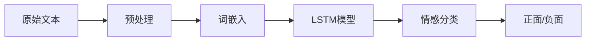
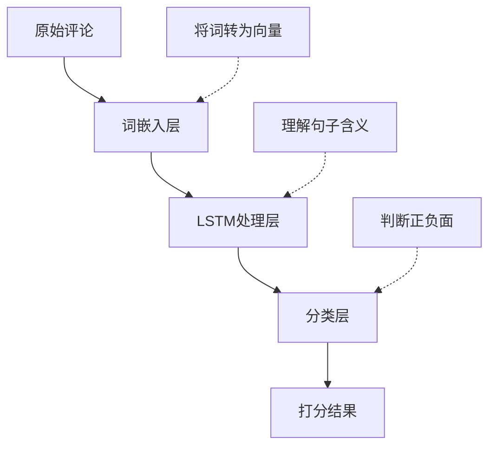
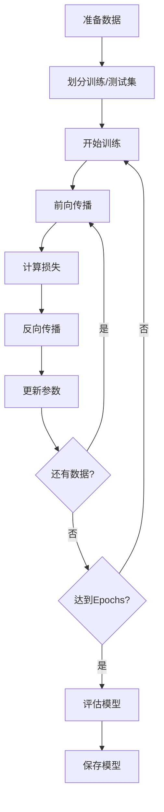
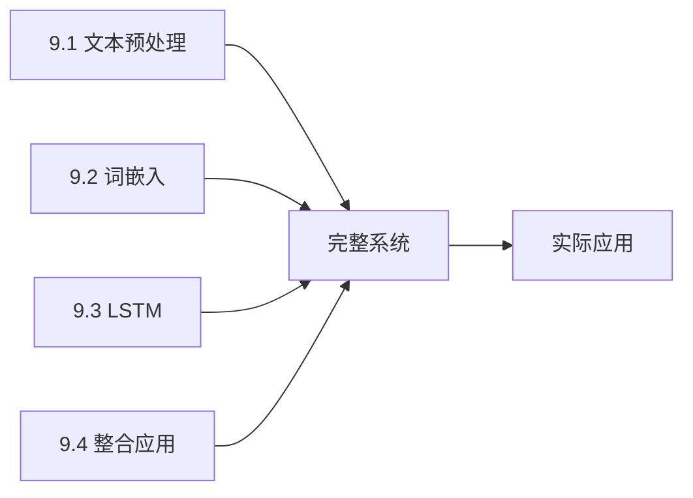

# 9.4 文本分类实战：情感分析挑战

> **本节学习目标**：整合所学知识，构建一个完整的情感分析系统

## 内容概览

前面几节学了很多"工具"：
- 9.1：文本预处理 → 把原材料"洗干净"
- 9.2：词嵌入 → 给每个词分配"坐标"
- 9.3：RNN/LSTM/GRU → 学会理解"句子"

现在是时候把这些工具组合起来，解决一个真实问题了！本节将构建一个完整的情感分析系统。



## 9.4.1 情感分析任务介绍

### 技术原理：像"读评价"一样判断情感

**什么是情感分析？**

想象你在网购平台买东西，看到以下评价：

```
评价1："质量很好，非常满意！" → 你的判断：好评 ✓
评价2："太差劲了，强烈不推荐。" → 你的判断：差评 ✗
评价3："尺寸合适，价格也还可以。" → 你的判断：中性
```

情感分析就是让计算机像你一样判断这些评论的情感倾向。

**任务特点：**

1. **典型分类问题**：
   - 二分类：正面 vs 负面
   - 多分类：正面/中性/负面
   - 细粒度：1星-5星评分

2. **实际应用广泛**：
   - 电商评价分析：判断产品口碑
   - 社交媒体监控：分析公众情绪
   - 影视评论分析：预测票房走势
   - 舍情监测：及时发现负面舆情

**挑战所在：**

- **语义理解**："这部电影不好看" vs "这部电影不是不好看" (双重否定)
- **上下文依赖**："开头很好，但是结尾太烂了" (转折关系)
- **词汇歧义**："这价格也是没谁了" (反讽)

### 示例数据集

TinyAI提供了一个简化的电影评论数据集：

```java
// 创建示例数据集
SentimentDataset dataset = SentimentDataset.createSampleDataset();

// 正面样本示例：
// "这部电影非常好看，强烈推荐！" -> 标签: 1 (正面)
// "很不错的电影，值得一看。" -> 标签: 1

// 负面样本示例：  
// "这部电影太糟糕了，浪费时间。" -> 标签: 0 (负面)
// "不推荐这部电影，很失望。" -> 标签: 0
```

**数据集结构：**
- 文本列表：存储原始评论
- 标签列表：0(负面) 或 1(正面)
- 词汇表：用于词汇编码
- 分词器：用于文本分词

```java
/**
 * 情感分析数据集类
 */
public class SentimentDataset {
    private List<String> texts;      // 文本数据
    private List<Integer> labels;    // 标签数据（0-负面，1-正面）
    private Vocabulary vocabulary;   // 词汇表
    private ChineseTokenizer tokenizer; // 分词器
    
    /**
     * 构造函数
     */
    public SentimentDataset(Vocabulary vocabulary, ChineseTokenizer tokenizer) {
        this.texts = new ArrayList<>();
        this.labels = new ArrayList<>();
        this.vocabulary = vocabulary;
        this.tokenizer = tokenizer;
    }
    
    /**
     * 添加数据样本
     */
    public void addSample(String text, int label) {
        texts.add(text);
        labels.add(label);
    }
    
    /**
     * 获取数据集大小
     */
    public int size() {
        return texts.size();
    }
    
    /**
     * 获取指定索引的文本
     */
    public String getText(int index) {
        return texts.get(index);
    }
    
    /**
     * 获取指定索引的标签
     */
    public int getLabel(int index) {
        return labels.get(index);
    }
    
    /**
     * 创建示例数据集
     */
    public static SentimentDataset createSampleDataset() {
        // 创建词汇表和分词器
        Set<String> dictionary = new HashSet<>(Arrays.asList(
            "这个", "电影", "非常", "好看", "不错", "喜欢", "推荐", "精彩",
            "很", "不", "差", "糟糕", "讨厌", "浪费", "时间", "无聊",
            "演员", "表演", "剧情", "特效", "画面", "音乐", "导演",
            "自然语言", "处理", "技术", "重要", "人工智能"
        ));
        
        Vocabulary vocabulary = new Vocabulary();
        ChineseTokenizer tokenizer = new ChineseTokenizer(dictionary);
        
        // 构建词汇表
        vocabulary.addTokens(new ArrayList<>(dictionary));
        
        SentimentDataset dataset = new SentimentDataset(vocabulary, tokenizer);
        
        // 添加正面样本
        dataset.addSample("这部电影非常好看，强烈推荐！", 1);
        dataset.addSample("很不错的电影，值得一看。", 1);
        dataset.addSample("演员表演精彩，剧情引人入胜。", 1);
        dataset.addSample("特效很棒，画面精美。", 1);
        dataset.addSample("导演功力深厚，这部电影很精彩。", 1);
        dataset.addSample("音乐配合得很好，增强了观影体验。", 1);
        dataset.addSample("故事情节紧凑，让人欲罢不能。", 1);
        dataset.addSample("这部影片在各个方面都表现出色。", 1);
        
        // 添加负面样本
        dataset.addSample("这部电影太糟糕了，浪费时间。", 0);
        dataset.addSample("不推荐这部电影，很失望。", 0);
        dataset.addSample("演员表演生硬，剧情无聊。", 0);
        dataset.addSample("特效粗糙，画面模糊。", 0);
        dataset.addSample("导演水平有限，这部电影很失败。", 0);
        dataset.addSample("音乐与剧情不搭，破坏了整体效果。", 0);
        dataset.addSample("故事情节拖沓，让人昏昏欲睡。", 0);
        dataset.addSample("这部影片在各个方面都很差劲。", 0);
        
        return dataset;
    }
    
    // Getter方法
    public Vocabulary getVocabulary() { return vocabulary; }
    public ChineseTokenizer getTokenizer() { return tokenizer; }
}
```

## 9.4.2 数据预处理流水线

### 技术原理：像"流水线"一样处理数据

数据预处理就像工厂流水线，原材料(原始文本)经过多个工位加工，最终变成成品(数值序列):


**处理流程示例：**

```
输入: "这部电影很好看！"
  ↓ 步骤1: 清洗
"这部电影很好看"  (去除标点)
  ↓ 步骤2: 分词
["这部", "电影", "很", "好看"]
  ↓ 步骤3: 加标记
["<SOS>", "这部", "电影", "很", "好看", "<EOS>"]
  ↓ 步骤4: 转索引
[2, 45, 78, 12, 23, 3]
  ↓ 步骤5: 填充到20个元素
[2, 45, 78, 12, 23, 3, 0, 0, 0, ..., 0]
  ↓
输出: 数值序列 (模型输入)
```

**TinyAI的预处理器：**

```java
// 创建预处理器
SentimentDataPreprocessor preprocessor = new SentimentDataPreprocessor(
    vocabulary, tokenizer, maxLength=20
);

// 单条文本处理
int[] sequence = preprocessor.preprocessText("这部电影很好看");

// 批量处理
ProcessedDataset processed = preprocessor.preprocessDataset(dataset);
```

```java
/**
 * 情感分析数据预处理器
 */
public class SentimentDataPreprocessor {
    private Vocabulary vocabulary;
    private ChineseTokenizer tokenizer;
    private int maxLength;
    private int padIndex;
    
    /**
     * 构造函数
     */
    public SentimentDataPreprocessor(Vocabulary vocabulary, 
                                   ChineseTokenizer tokenizer, 
                                   int maxLength) {
        this.vocabulary = vocabulary;
        this.tokenizer = tokenizer;
        this.maxLength = maxLength;
        this.padIndex = vocabulary.getPadIndex();
    }
    
    /**
     * 预处理单个文本
     */
    public int[] preprocessText(String text) {
        // 1. 文本清洗
        String cleaned = TextCleaner.cleanText(text);
        String normalized = TextCleaner.normalizeText(cleaned);
        
        // 2. 分词
        List<String> tokens = tokenizer.forwardMaxMatch(normalized);
        
        // 3. 添加句子边界标记
        tokens.add(0, Vocabulary.SOS_TOKEN);
        tokens.add(Vocabulary.EOS_TOKEN);
        
        // 4. 转换为索引序列
        List<Integer> indices = tokens.stream()
                .map(vocabulary::getIndex)
                .collect(Collectors.toList());
        
        // 5. 填充或截断
        List<Integer> processed = SequenceProcessor.padOrTruncate(
                indices, maxLength, padIndex, false);
        
        // 6. 转换为数组
        return processed.stream().mapToInt(Integer::intValue).toArray();
    }
    
    /**
     * 批量预处理文本
     */
    public int[][] preprocessBatch(List<String> texts) {
        return texts.stream()
                .map(this::preprocessText)
                .toArray(int[][]::new);
    }
    
    /**
     * 预处理数据集
     */
    public ProcessedDataset preprocessDataset(SentimentDataset dataset) {
        int size = dataset.size();
        int[][] features = new int[size][];
        int[] labels = new int[size];
        
        for (int i = 0; i < size; i++) {
            features[i] = preprocessText(dataset.getText(i));
            labels[i] = dataset.getLabel(i);
        }
        
        return new ProcessedDataset(features, labels);
    }
    
    /**
     * 数据集划分
     */
    public DatasetSplit splitDataset(ProcessedDataset dataset, double trainRatio) {
        int size = dataset.size();
        int trainSize = (int) (size * trainRatio);
        
        // 简单的随机划分（实际应用中应该更复杂）
        int[][] allFeatures = dataset.getFeatures();
        int[] allLabels = dataset.getLabels();
        
        int[][] trainFeatures = Arrays.copyOfRange(allFeatures, 0, trainSize);
        int[] trainLabels = Arrays.copyOfRange(allLabels, 0, trainSize);
        
        int[][] testFeatures = Arrays.copyOfRange(allFeatures, trainSize, size);
        int[] testLabels = Arrays.copyOfRange(allLabels, trainSize, size);
        
        return new DatasetSplit(
            new ProcessedDataset(trainFeatures, trainLabels),
            new ProcessedDataset(testFeatures, testLabels)
        );
    }
}

/**
 * 预处理后的数据集
 */
class ProcessedDataset {
    private int[][] features;
    private int[] labels;
    
    public ProcessedDataset(int[][] features, int[] labels) {
        this.features = features;
        this.labels = labels;
    }
    
    public int size() {
        return features.length;
    }
    
    // Getter方法
    public int[][] getFeatures() { return features; }
    public int[] getLabels() { return labels; }
}

/**
 * 数据集划分结果
 */
class DatasetSplit {
    private ProcessedDataset trainDataset;
    private ProcessedDataset testDataset;
    
    public DatasetSplit(ProcessedDataset trainDataset, ProcessedDataset testDataset) {
        this.trainDataset = trainDataset;
        this.testDataset = testDataset;
    }
    
    // Getter方法
    public ProcessedDataset getTrainDataset() { return trainDataset; }
    public ProcessedDataset getTestDataset() { return testDataset; }
}
```

## 9.4.3 情感分析模型实现

### 技术原理:像"评委打分"一样分类

**模型架构设计:**

想象一个评委给电影打分的过程:



1. **词嵌入层**:把每个词转换为向量
   - 就像评委先了解每个词的含义
   - "好看" → [0.8, 0.9, ...]
   - "糟糕" → [-0.7, -0.8, ...]

2. **LSTM处理层**:理解整句话的意思
   - 就像评委理解句子的前后关系
   - "虽然开头不错,但是结局太烂了" → 整体偏负面

3. **分类层**:做出最终判断
   - 就像评委给出最终打分
   - 输出:[正面概率:0.2, 负面概率:0.8] → 判定为负面

**TinyAI实现:**

```java
// 创建模型
SentimentAnalysisModel model = new SentimentAnalysisModel(
    vocabSize=1000,      // 词汇表大小
    embeddingDim=100,    // 词向量维度  
    hiddenSize=128,      // LSTM隐藏层大小
    numClasses=2         // 分类数(正/负)
);

// 预测单条评论
int[] sequence = preprocessor.preprocessText("这部电影很好看");
SentimentOutput result = model.forward(sequence);

System.out.println("预测类别: " + (result.getPredictedClass() == 1 ? "正面" : "负面"));
System.out.println("正面概率: " + result.getProbabilities()[1]);
System.out.println("负面概率: " + result.getProbabilities()[0]);
```

**关键组件:**
- 词嵌入矩阵:将词索引转为向量
- LSTM网络:捕捉序列信息
- Softmax层:输出概率分布

```java
/**
 * 情感分析模型
 */
public class SentimentAnalysisModel {
    private LSTM lstm;
    private int vocabSize;
    private int embeddingDim;
    private int hiddenSize;
    private int numClasses;
    
    // 词嵌入矩阵
    private double[][] embeddings;
    
    /**
     * 构造函数
     */
    public SentimentAnalysisModel(int vocabSize, int embeddingDim, 
                                int hiddenSize, int numClasses) {
        this.vocabSize = vocabSize;
        this.embeddingDim = embeddingDim;
        this.hiddenSize = hiddenSize;
        this.numClasses = numClasses;
        
        // 初始化LSTM
        this.lstm = new LSTM(embeddingDim, hiddenSize, numClasses);
        
        // 初始化词嵌入矩阵
        this.embeddings = initializeEmbeddings();
    }
    
    /**
     * 初始化词嵌入矩阵
     */
    private double[][] initializeEmbeddings() {
        double[][] embeds = new double[vocabSize][embeddingDim];
        Random random = new Random(42);
        
        // Xavier初始化
        double scale = Math.sqrt(6.0 / (vocabSize + embeddingDim));
        for (int i = 0; i < vocabSize; i++) {
            for (int j = 0; j < embeddingDim; j++) {
                embeds[i][j] = (random.nextDouble() * 2 - 1) * scale;
            }
        }
        
        return embeds;
    }
    
    /**
     * 将索引序列转换为词嵌入序列
     */
    private double[][] indicesToEmbeddings(int[] indices) {
        double[][] embeddingsSeq = new double[indices.length][embeddingDim];
        
        for (int i = 0; i < indices.length; i++) {
            int index = indices[i];
            if (index >= 0 && index < vocabSize) {
                System.arraycopy(this.embeddings[index], 0, 
                               embeddingsSeq[i], 0, embeddingDim);
            }
        }
        
        return embeddingsSeq;
    }
    
    /**
     * 前向传播
     */
    public SentimentOutput forward(int[] inputIndices) {
        // 1. 转换为词嵌入序列
        double[][] embeddingsSeq = indicesToEmbeddings(inputIndices);
        
        // 2. LSTM处理
        LSTMOutput lstmOutput = lstm.forward(embeddingsSeq);
        double[][] outputs = lstmOutput.getOutputs();
        
        // 3. 取最后一个时间步的输出作为分类结果
        double[] finalOutput = outputs[outputs.length - 1];
        
        // 4. 应用softmax获取概率分布
        double[] probabilities = softmax(finalOutput);
        
        // 5. 预测类别
        int predictedClass = argmax(probabilities);
        
        return new SentimentOutput(predictedClass, probabilities, finalOutput);
    }
    
    /**
     * 计算Softmax
     */
    private double[] softmax(double[] logits) {
        double[] probs = new double[logits.length];
        double maxLogit = Arrays.stream(logits).max().orElse(0);
        double sumExp = 0;
        
        // 数值稳定性处理
        for (int i = 0; i < logits.length; i++) {
            probs[i] = Math.exp(logits[i] - maxLogit);
            sumExp += probs[i];
        }
        
        // 归一化
        for (int i = 0; i < probs.length; i++) {
            probs[i] /= sumExp;
        }
        
        return probs;
    }
    
    /**
     * 获取最大值索引
     */
    private int argmax(double[] array) {
        int maxIndex = 0;
        for (int i = 1; i < array.length; i++) {
            if (array[i] > array[maxIndex]) {
                maxIndex = i;
            }
        }
        return maxIndex;
    }
    
    /**
     * 计算损失（交叉熵）
     */
    public double computeLoss(int[] inputIndices, int trueLabel) {
        SentimentOutput output = forward(inputIndices);
        double[] logits = output.getLogits();
        
        // 计算交叉熵损失
        double loss = -Math.log(Math.max(softmax(logits)[trueLabel], 1e-10));
        return loss;
    }
    
    /**
     * 批量预测
     */
    public int[] predictBatch(int[][] inputIndicesBatch) {
        int[] predictions = new int[inputIndicesBatch.length];
        
        for (int i = 0; i < inputIndicesBatch.length; i++) {
            SentimentOutput output = forward(inputIndicesBatch[i]);
            predictions[i] = output.getPredictedClass();
        }
        
        return predictions;
    }
    
    /**
     * 评估模型
     */
    public EvaluationResult evaluate(int[][] features, int[] labels) {
        int correct = 0;
        int total = features.length;
        
        for (int i = 0; i < total; i++) {
            SentimentOutput output = forward(features[i]);
            if (output.getPredictedClass() == labels[i]) {
                correct++;
            }
        }
        
        double accuracy = (double) correct / total;
        return new EvaluationResult(accuracy, correct, total);
    }
    
    // Getter和Setter方法
    public double[][] getEmbeddings() { return embeddings; }
    public void setEmbeddings(double[][] embeddings) { this.embeddings = embeddings; }
}

/**
 * 情感分析输出结果
 */
class SentimentOutput {
    private int predictedClass;
    private double[] probabilities;
    private double[] logits;
    
    public SentimentOutput(int predictedClass, double[] probabilities, double[] logits) {
        this.predictedClass = predictedClass;
        this.probabilities = probabilities;
        this.logits = logits;
    }
    
    // Getter方法
    public int getPredictedClass() { return predictedClass; }
    public double[] getProbabilities() { return probabilities; }
    public double[] getLogits() { return logits; }
}

/**
 * 评估结果
 */
class EvaluationResult {
    private double accuracy;
    private int correct;
    private int total;
    
    public EvaluationResult(double accuracy, int correct, int total) {
        this.accuracy = accuracy;
        this.correct = correct;
        this.total = total;
    }
    
    @Override
    public String toString() {
        return String.format("准确率: %.2f%% (%d/%d)", accuracy * 100, correct, total);
    }
    
    // Getter方法
    public double getAccuracy() { return accuracy; }
    public int getCorrect() { return correct; }
    public int getTotal() { return total; }
}
```

## 9.4.4 训练流程实现

### 技术原理:像"练习题"一样训练模型

**训练过程类比:**

学生做练习题的过程:
```
1. 看题目 → 模型看训练数据
2. 给答案 → 模型预测结果
3. 对答案 → 计算预测误差
4. 总结错误 → 反向传播更新参数
5. 反复练习 → 多轮训练(Epochs)
```

**训练流程:**



**完整训练示例:**

```java
public class SentimentTrainingExample {
    public static void main(String[] args) {
        // 1. 准备数据
        SentimentDataset dataset = SentimentDataset.createSampleDataset();
        SentimentDataPreprocessor preprocessor = new SentimentDataPreprocessor(
            dataset.getVocabulary(), dataset.getTokenizer(), maxLength=20
        );
        
        // 2. 预处理和划分数据
        ProcessedDataset processed = preprocessor.preprocessDataset(dataset);
        DatasetSplit split = preprocessor.splitDataset(processed, trainRatio=0.8);
        
        // 3. 创建模型
        SentimentAnalysisModel model = new SentimentAnalysisModel(
            vocabSize=1000, embeddingDim=100, hiddenSize=128, numClasses=2
        );
        
        // 4. 训练模型
        int epochs = 50;
        for (int epoch = 0; epoch < epochs; epoch++) {
            double totalLoss = 0;
            int[][] trainFeatures = split.getTrainDataset().getFeatures();
            int[] trainLabels = split.getTrainDataset().getLabels();
            
            // 遍历训练数据
            for (int i = 0; i < trainFeatures.length; i++) {
                // 前向传播
                double loss = model.computeLoss(trainFeatures[i], trainLabels[i]);
                totalLoss += loss;
                
                // 反向传播(简化,实际需要完整实现)
                // model.backward(...);
            }
            
            // 每10轮评估一次
            if (epoch % 10 == 0) {
                EvaluationResult result = model.evaluate(
                    split.getTestDataset().getFeatures(),
                    split.getTestDataset().getLabels()
                );
                System.out.printf("Epoch %d: Loss=%.4f, %s%n", 
                    epoch, totalLoss/trainFeatures.length, result);
            }
        }
        
        // 5. 测试预测
        String testText = "这部电影非常精彩,强烈推荐!";
        int[] sequence = preprocessor.preprocessText(testText);
        SentimentOutput result = model.forward(sequence);
        
        System.out.println("\n测试文本: " + testText);
        System.out.println("预测结果: " + 
            (result.getPredictedClass() == 1 ? "正面😊" : "负面😞"));
        System.out.printf("置信度: %.2f%%\n", 
            result.getProbabilities()[result.getPredictedClass()] * 100);
    }
}
```

**训练技巧:**

1. **数据划分**:80%训练,20%测试
2. **批量训练**:每次处理多个样本,提高效率
3. **学习率调整**:开始大一点(0.01),后期小一点(0.001)
4. **早停法**:测试准确率不再提升时停止训练
5. **正则化**:防止过拟合

```java
/**
 * 情感分析训练器
 */
public class SentimentTrainer {
    private SentimentAnalysisModel model;
    private SentimentDataPreprocessor preprocessor;
    private double learningRate;
    private int batchSize;
    
    /**
     * 构造函数
     */
    public SentimentTrainer(SentimentAnalysisModel model, 
                          SentimentDataPreprocessor preprocessor,
                          double learningRate, int batchSize) {
        this.model = model;
        this.preprocessor = preprocessor;
        this.learningRate = learningRate;
        this.batchSize = batchSize;
    }
    
    /**
     * 训练模型
     */
    public TrainingHistory train(ProcessedDataset trainDataset, 
                               ProcessedDataset validationDataset,
                               int epochs) {
        TrainingHistory history = new TrainingHistory();
        
        System.out.println("开始训练情感分析模型...");
        System.out.println("训练样本数: " + trainDataset.size());
        System.out.println("验证样本数: " + validationDataset.size());
        System.out.println("批次大小: " + batchSize);
        System.out.println("学习率: " + learningRate);
        System.out.println("训练轮数: " + epochs);
        System.out.println("------------------------");
        
        for (int epoch = 0; epoch < epochs; epoch++) {
            // 训练一个epoch
            double trainLoss = trainEpoch(trainDataset);
            
            // 验证
            EvaluationResult trainEval = model.evaluate(
                trainDataset.getFeatures(), trainDataset.getLabels());
            EvaluationResult valEval = model.evaluate(
                validationDataset.getFeatures(), validationDataset.getLabels());
            
            // 记录历史
            history.addRecord(epoch, trainLoss, trainEval.getAccuracy(), valEval.getAccuracy());
            
            // 打印进度
            if (epoch % 10 == 0 || epoch == epochs - 1) {
                System.out.printf("Epoch %d: 训练损失=%.4f, 训练准确率=%s, 验证准确率=%s%n",
                    epoch, trainLoss, trainEval, valEval);
            }
        }
        
        System.out.println("训练完成！");
        return history;
    }
    
    /**
     * 训练一个epoch
     */
    private double trainEpoch(ProcessedDataset dataset) {
        int[][] features = dataset.getFeatures();
        int[] labels = dataset.getLabels();
        int size = dataset.size();
        
        double totalLoss = 0;
        int batches = (size + batchSize - 1) / batchSize;
        
        for (int batch = 0; batch < batches; batch++) {
            int start = batch * batchSize;
            int end = Math.min(start + batchSize, size);
            
            // 批量训练（简化实现，实际应实现梯度累积）
            for (int i = start; i < end; i++) {
                double loss = model.computeLoss(features[i], labels[i]);
                totalLoss += loss;
                
                // 简化的参数更新（实际应实现完整的反向传播）
                // 这里省略具体实现，仅作为框架演示
            }
        }
        
        return totalLoss / size;
    }
    
    /**
     * 预测单个文本
     */
    public SentimentPrediction predict(String text) {
        int[] indices = preprocessor.preprocessText(text);
        SentimentOutput output = model.forward(indices);
        
        String sentiment = output.getPredictedClass() == 1 ? "正面" : "负面";
        double confidence = Arrays.stream(output.getProbabilities()).max().orElse(0);
        
        return new SentimentPrediction(sentiment, confidence, output.getProbabilities());
    }
    
    /**
     * 批量预测
     */
    public List<SentimentPrediction> predictBatch(List<String> texts) {
        return texts.stream()
                .map(this::predict)
                .collect(Collectors.toList());
    }
}

/**
 * 训练历史记录
 */
class TrainingHistory {
    private List<EpochRecord> records;
    
    public TrainingHistory() {
        this.records = new ArrayList<>();
    }
    
    public void addRecord(int epoch, double loss, double trainAccuracy, double valAccuracy) {
        records.add(new EpochRecord(epoch, loss, trainAccuracy, valAccuracy));
    }
    
    public List<EpochRecord> getRecords() {
        return records;
    }
}

/**
 * Epoch记录
 */
class EpochRecord {
    private int epoch;
    private double loss;
    private double trainAccuracy;
    private double valAccuracy;
    
    public EpochRecord(int epoch, double loss, double trainAccuracy, double valAccuracy) {
        this.epoch = epoch;
        this.loss = loss;
        this.trainAccuracy = trainAccuracy;
        this.valAccuracy = valAccuracy;
    }
    
    // Getter方法
    public int getEpoch() { return epoch; }
    public double getLoss() { return loss; }
    public double getTrainAccuracy() { return trainAccuracy; }
    public double getValAccuracy() { return valAccuracy; }
}

/**
 * 情感预测结果
 */
class SentimentPrediction {
    private String sentiment;
    private double confidence;
    private double[] probabilities;
    
    public SentimentPrediction(String sentiment, double confidence, double[] probabilities) {
        this.sentiment = sentiment;
        this.confidence = confidence;
        this.probabilities = probabilities;
    }
    
    @Override
    public String toString() {
        return String.format("情感: %s (置信度: %.2f%%)", sentiment, confidence * 100);
    }
    
    // Getter方法
    public String getSentiment() { return sentiment; }
    public double getConfidence() { return confidence; }
    public double[] getProbabilities() { return probabilities; }
}
```

## 9.4.5 完整的情感分析系统

将所有组件整合成一个完整的情感分析系统：

```java
/**
 * 完整的情感分析系统
 */
public class SentimentAnalysisSystem {
    private SentimentDataset dataset;
    private SentimentDataPreprocessor preprocessor;
    private SentimentAnalysisModel model;
    private SentimentTrainer trainer;
    
    /**
     * 构造函数
     */
    public SentimentAnalysisSystem() {
        // 初始化组件
        initializeComponents();
    }
    
    /**
     * 初始化系统组件
     */
    private void initializeComponents() {
        // 1. 创建数据集
        this.dataset = SentimentDataset.createSampleDataset();
        
        // 2. 创建预处理器
        this.preprocessor = new SentimentDataPreprocessor(
            dataset.getVocabulary(), 
            dataset.getTokenizer(), 
            20  // 最大序列长度
        );
        
        // 3. 预处理数据集
        ProcessedDataset processedDataset = preprocessor.preprocessDataset(dataset);
        
        // 4. 划分数据集
        DatasetSplit split = preprocessor.splitDataset(processedDataset, 0.8);
        
        // 5. 创建模型
        this.model = new SentimentAnalysisModel(
            dataset.getVocabulary().size(),  // 词汇表大小
            50,   // 词嵌入维度
            100,  // LSTM隐藏层大小
            2     // 分类数（正面/负面）
        );
        
        // 6. 创建训练器
        this.trainer = new SentimentTrainer(
            model, 
            preprocessor, 
            0.01,  // 学习率
            4      // 批次大小
        );
    }
    
    /**
     * 训练模型
     */
    public void train() {
        // 重新预处理数据集
        ProcessedDataset processedDataset = preprocessor.preprocessDataset(dataset);
        DatasetSplit split = preprocessor.splitDataset(processedDataset, 0.8);
        
        // 训练模型
        TrainingHistory history = trainer.train(
            split.getTrainDataset(),
            split.getTestDataset(),
            100  // 训练轮数
        );
        
        // 显示训练历史
        displayTrainingHistory(history);
    }
    
    /**
     * 显示训练历史
     */
    private void displayTrainingHistory(TrainingHistory history) {
        System.out.println("\n=== 训练历史 ===");
        System.out.println("Epoch\t损失\t\t训练准确率\t验证准确率");
        System.out.println("-----\t----\t\t--------\t--------");
        
        List<EpochRecord> records = history.getRecords();
        for (int i = 0; i < records.size(); i += 10) {  // 每10个epoch显示一次
            EpochRecord record = records.get(i);
            System.out.printf("%d\t%.4f\t\t%.2f%%\t\t%.2f%%%n",
                record.getEpoch(),
                record.getLoss(),
                record.getTrainAccuracy() * 100,
                record.getValAccuracy() * 100
            );
        }
        
        // 显示最后几个epoch
        if (records.size() > 5) {
            System.out.println("...");
            for (int i = Math.max(0, records.size() - 3); i < records.size(); i++) {
                EpochRecord record = records.get(i);
                System.out.printf("%d\t%.4f\t\t%.2f%%\t\t%.2f%%%n",
                    record.getEpoch(),
                    record.getLoss(),
                    record.getTrainAccuracy() * 100,
                    record.getValAccuracy() * 100
                );
            }
        }
    }
    
    /**
     * 预测文本情感
     */
    public void predictSentiment(String text) {
        SentimentPrediction prediction = trainer.predict(text);
        System.out.println("\n=== 情感预测 ===");
        System.out.println("文本: " + text);
        System.out.println("预测结果: " + prediction);
        
        // 显示详细概率
        double[] probs = prediction.getProbabilities();
        System.out.printf("负面概率: %.2f%%, 正面概率: %.2f%%%n", 
            probs[0] * 100, probs[1] * 100);
    }
    
    /**
     * 批量预测
     */
    public void predictBatch(List<String> texts) {
        System.out.println("\n=== 批量情感预测 ===");
        List<SentimentPrediction> predictions = trainer.predictBatch(texts);
        
        for (int i = 0; i < texts.size(); i++) {
            System.out.printf("文本 %d: %s%n", i + 1, texts.get(i));
            System.out.println("  预测结果: " + predictions.get(i));
            System.out.println();
        }
    }
    
    /**
     * 评估模型性能
     */
    public void evaluate() {
        // 重新预处理数据集
        ProcessedDataset processedDataset = preprocessor.preprocessDataset(dataset);
        DatasetSplit split = preprocessor.splitDataset(processedDataset, 0.8);
        
        EvaluationResult trainResult = model.evaluate(
            split.getTrainDataset().getFeatures(),
            split.getTrainDataset().getLabels()
        );
        
        EvaluationResult testResult = model.evaluate(
            split.getTestDataset().getFeatures(),
            split.getTestDataset().getLabels()
        );
        
        System.out.println("\n=== 模型评估 ===");
        System.out.println("训练集: " + trainResult);
        System.out.println("测试集: " + testResult);
    }
}

/**
 * 情感分析系统演示
 */
public class SentimentAnalysisDemo {
    public static void main(String[] args) {
        System.out.println("=== 情感分析系统演示 ===");
        
        // 创建情感分析系统
        SentimentAnalysisSystem system = new SentimentAnalysisSystem();
        
        // 训练模型
        system.train();
        
        // 评估模型
        system.evaluate();
        
        // 预测示例
        System.out.println("\n=== 预测示例 ===");
        system.predictSentiment("这部电影真的很棒，我非常喜欢！");
        system.predictSentiment("这部电影太糟糕了，完全不推荐。");
        system.predictSentiment("一般般吧，没有什么特别的感觉。");
        
        // 批量预测示例
        List<String> testTexts = Arrays.asList(
            "演员表演很出色，剧情也很吸引人。",
            "特效不错，但是剧情有些拖沓。",
            "这是我看过最差的电影之一。",
            "强烈推荐！绝对值得一看。"
        );
        
        system.predictBatch(testTexts);
    }
}
```

## 9.4.6 模型性能优化

在实际应用中，我们还需要考虑模型的性能优化：

```java
/**
 * 模型优化工具类
 */
public class ModelOptimizer {
    
    /**
     * 学习率调度
     */
    public static class LearningRateScheduler {
        private double initialLearningRate;
        private String scheduleType;
        
        public LearningRateScheduler(double initialLearningRate, String scheduleType) {
            this.initialLearningRate = initialLearningRate;
            this.scheduleType = scheduleType;
        }
        
        /**
         * 根据epoch计算当前学习率
         */
        public double getLearningRate(int epoch) {
            switch (scheduleType) {
                case "step":
                    return stepDecay(epoch);
                case "exponential":
                    return exponentialDecay(epoch);
                case "cosine":
                    return cosineDecay(epoch);
                default:
                    return initialLearningRate;
            }
        }
        
        /**
         * 阶梯式衰减
         */
        private double stepDecay(int epoch) {
            int dropEvery = 30;
            double dropRate = 0.5;
            int timesDropped = epoch / dropEvery;
            return initialLearningRate * Math.pow(dropRate, timesDropped);
        }
        
        /**
         * 指数衰减
         */
        private double exponentialDecay(int epoch) {
            double decayRate = 0.05;
            return initialLearningRate * Math.exp(-decayRate * epoch);
        }
        
        /**
         * 余弦衰减
         */
        private double cosineDecay(int epoch) {
            int maxEpochs = 100;
            return initialLearningRate * (1 + Math.cos(Math.PI * epoch / maxEpochs)) / 2;
        }
    }
    
    /**
     * 早停机制
     */
    public static class EarlyStopping {
        private int patience;
        private double minDelta;
        private int patienceCounter;
        private double bestLoss;
        private boolean stopped;
        
        public EarlyStopping(int patience, double minDelta) {
            this.patience = patience;
            this.minDelta = minDelta;
            this.patienceCounter = 0;
            this.bestLoss = Double.MAX_VALUE;
            this.stopped = false;
        }
        
        /**
         * 检查是否应该停止训练
         */
        public boolean shouldStop(double currentLoss) {
            if (stopped) {
                return true;
            }
            
            if (currentLoss < bestLoss - minDelta) {
                bestLoss = currentLoss;
                patienceCounter = 0;
            } else {
                patienceCounter++;
                if (patienceCounter >= patience) {
                    stopped = true;
                    System.out.println("触发早停机制，停止训练");
                }
            }
            
            return stopped;
        }
        
        public boolean isStopped() {
            return stopped;
        }
    }
    
    /**
     * 模型检查点
     */
    public static class ModelCheckpoint {
        private String savePath;
        private double bestScore;
        private boolean maximize;
        
        public ModelCheckpoint(String savePath, boolean maximize) {
            this.savePath = savePath;
            this.bestScore = maximize ? Double.MIN_VALUE : Double.MAX_VALUE;
            this.maximize = maximize;
        }
        
        /**
         * 检查是否应该保存模型
         */
        public boolean shouldSave(double currentScore) {
            boolean shouldSave = maximize ? 
                (currentScore > bestScore) : (currentScore < bestScore);
            
            if (shouldSave) {
                bestScore = currentScore;
                System.out.println("保存模型检查点，最佳得分: " + bestScore);
            }
            
            return shouldSave;
        }
    }
}
```

## 本节小结

### 核心知识回顾

本节整合了前面所学的所有技术,构建了一个完整的情感分析系统:



**完整流程:**

| 步骤 | 技术 | 类比 | 作用 |
|------|------|------|------|
| **数据准备** | 数据集构建 | 准备练习题 | 收集训练样本 |
| **预处理** | 清洗+分词+编码 | 洗菜+切菜+摆盘 | 转为标准格式 |
| **词嵌入** | 词向量 | GPS坐标 | 捕捉词语义 |
| **序列建模** | LSTM | 理解句子 | 捕捉上下文 |
| **分类** | Softmax | 评委打分 | 输出判断 |
| **训练** | 反向传播 | 做练习改错 | 优化参数 |
| **评估** | 准确率 | 考试打分 | 验证效果 |

**关键要点:**

1. **数据质量第一**:垃圾进,垃圾出
   - 数据要干净,标注要准确
   - 训练集要足够大且平衡

2. **模型选择合理**:
   - 短文本(<10词):简单模型(RNN)
   - 长文本(>50词):复杂模型(LSTM/GRU)
   - 超长文本:考虑Transformer

3. **超参数调优**:
   - embedding_dim: 50-300
   - hidden_size: 64-512
   - learning_rate: 0.001-0.01
   - max_length: 根据数据分布决定

4. **评估要全面**:
   - 不只看准确率
   - 还要看精确率、召回率、F1分数
   - 分析混淆矩阵,找出问题

**实践建议:**

- **从简单开始**:先用小数据集快速验证
- **逐步优化**:baseline → 调参 → 改进模型
- **关注细节**:数据预处理往往比模型更重要
- **持续迭代**:收集badcase,针对性改进

### 思考与练习

1. **思考题**:为什么情感分析中,"不好看"和"不是不好看"的处理结果应该不同?LSTM如何捕捉这种差异?

2. **实践题**:使用TinyAI实现一个三分类的情感分析系统(正面/中性/负面),观察与二分类的差异。

3. **扩展题**:研究如何处理多语言混合的评论(如中英文混合),需要做哪些特殊处理?

## 下一步学习

在下一节中,我们将学习**序列到序列(Seq2Seq)模型**,了解如何实现机器翻译等更复杂的任务。

如果说本节是"分类任务"(输入句子→输出标签),那么下一节就是"生成任务"(输入句子→输出句子),难度和应用场景都更上一层楼!

在本节中，我们构建了一个完整的情感分析系统，涵盖了以下关键内容：

1. **数据集构建**：创建了适合情感分析任务的示例数据集
2. **数据预处理**：实现了从原始文本到模型输入的完整预处理流水线
3. **模型实现**：基于LSTM构建了情感分析模型
4. **训练流程**：实现了完整的训练、验证和评估流程
5. **预测功能**：提供了单个和批量文本的情感预测功能
6. **性能优化**：介绍了学习率调度、早停机制等优化技术

通过这个实战项目，我们不仅巩固了前面学习的理论知识，还获得了实际的项目开发经验。情感分析系统是NLP领域的重要应用之一，掌握其实现方法对后续学习更复杂的NLP任务具有重要意义。

## 下一步计划

在下一节中，我们将学习序列到序列模型，这是机器翻译等任务的核心技术。