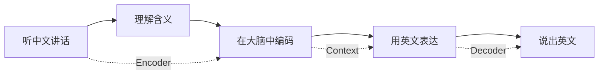

# 9.5 序列到序列模型：机器翻译基础

> **本节学习目标**：掌握Seq2Seq模型原理，理解编码器-解码器架构和注意力机制

## 内容概览

到目前为止,我们学习的都是"分类任务"：
- 9.4：输入句子 → 输出标签(正/负面)

但更多时候,我们需要"生成任务"：
- 翻译：输入中文句子 → 输出英文句子
- 摘要：输入长文章 → 输出短摘要
- 对话：输入问题 → 输出回答

Seq2Seq(序列到序列)模型就是专门解决这类"输入序列→输出序列"问题的。

## 9.5.1 序列到序列模型概述

### 技术原理：像"翻译工作"一样转换序列

**从"同声传译"理解Seq2Seq:**

想象国际会议上的同声传译员：



1. **听中文讲话** (编码器输入)
   - "我喜欢学习人工智能"
   
2. **理解含义** (编码器处理)
   - 把中文句子的意思在大脑中压缩成一个"概念"
   
3. **在大脑中编码** (上下文向量)
   - 形成一个跨语言的"语义表示"
   
4. **用英文表达** (解码器处理)
   - 根据这个语义,逐个词生成英文
   
5. **说出英文** (解码器输出)
   - "I love learning artificial intelligence"

**Seq2Seq的关键特点：**

- **变长到变长**：输入和输出长度可以不同
  ```
  中文: "我喜欢学习AI" (5个词)
  英文: "I love learning artificial intelligence" (5个词)
  
  中文: "谢谢" (1个词)
  英文: "Thank you very much" (4个词)
  ```

- **序列生成**：输出不是一次性的,而是逐个生成
  ```
  步骤1: 生成 "I"
  步骤2: 基于"I", 生成 "love"
  步骤3: 基于"I love", 生成 "learning"
  ...
  ```

**应用场景：**

| 任务 | 输入 | 输出 | 类比 |
|------|------|------|------|
| **翻译** | 中文句子 | 英文句子 | 同声传译 |
| **摘要** | 长文章 | 短摘要 | 提炼要点 |
| **对话** | 用户提问 | 机器回答 | 聊天回复 |
| **语音识别** | 语音波形 | 文字 | 听写
文字 |

## 9.5.2 编码器-解码器架构

编码器-解码器架构是Seq2Seq模型的基础，通过两个RNN网络协同工作来完成序列转换任务。

### 编码器（Encoder）

编码器负责将输入序列编码为上下文表示：

```java
/**
 * 序列编码器
 */
public class Encoder {
    private LSTM lstm;
    private int inputSize;
    private int hiddenSize;
    private int embeddingDim;
    
    // 词嵌入矩阵
    private double[][] embeddings;
    
    /**
     * 构造函数
     */
    public Encoder(int vocabSize, int embeddingDim, int hiddenSize) {
        this.inputSize = vocabSize;
        this.hiddenSize = hiddenSize;
        this.embeddingDim = embeddingDim;
        
        // 初始化LSTM
        this.lstm = new LSTM(embeddingDim, hiddenSize, hiddenSize);
        
        // 初始化词嵌入矩阵
        this.embeddings = initializeEmbeddings(vocabSize, embeddingDim);
    }
    
    /**
     * 初始化词嵌入矩阵
     */
    private double[][] initializeEmbeddings(int vocabSize, int embeddingDim) {
        double[][] embeds = new double[vocabSize][embeddingDim];
        Random random = new Random(42);
        
        // Xavier初始化
        double scale = Math.sqrt(6.0 / (vocabSize + embeddingDim));
        for (int i = 0; i < vocabSize; i++) {
            for (int j = 0; j < embeddingDim; j++) {
                embeds[i][j] = (random.nextDouble() * 2 - 1) * scale;
            }
        }
        
        return embeds;
    }
    
    /**
     * 将索引序列转换为词嵌入序列
     */
    private double[][] indicesToEmbeddings(int[] indices) {
        double[][] embeddingsSeq = new double[indices.length][embeddingDim];
        
        for (int i = 0; i < indices.length; i++) {
            int index = indices[i];
            if (index >= 0 && index < embeddings.length) {
                System.arraycopy(this.embeddings[index], 0, 
                               embeddingsSeq[i], 0, embeddingDim);
            }
        }
        
        return embeddingsSeq;
    }
    
    /**
     * 编码输入序列
     */
    public EncoderOutput encode(int[] inputIndices) {
        // 1. 转换为词嵌入序列
        double[][] embeddingsSeq = indicesToEmbeddings(inputIndices);
        
        // 2. LSTM编码
        LSTMOutput lstmOutput = lstm.forward(embeddingsSeq);
        double[][] hiddenStates = lstmOutput.getHiddenStates();
        double[][] cellStates = lstmOutput.getCellStates();
        
        // 3. 取最后一个时间步的状态作为上下文向量
        double[] contextVector = hiddenStates[hiddenStates.length - 1];
        double[] contextCell = cellStates[cellStates.length - 1];
        
        return new EncoderOutput(contextVector, contextCell, hiddenStates, cellStates);
    }
    
    // Getter方法
    public double[][] getEmbeddings() { return embeddings; }
    public void setEmbeddings(double[][] embeddings) { this.embeddings = embeddings; }
}

/**
 * 编码器输出
 */
class EncoderOutput {
    private double[] contextVector;  // 上下文向量
    private double[] contextCell;    // 上下文细胞状态
    private double[][] allHiddenStates;  // 所有隐藏状态（用于注意力机制）
    private double[][] allCellStates;    // 所有细胞状态
    
    public EncoderOutput(double[] contextVector, double[] contextCell,
                        double[][] allHiddenStates, double[][] allCellStates) {
        this.contextVector = contextVector;
        this.contextCell = contextCell;
        this.allHiddenStates = allHiddenStates;
        this.allCellStates = allCellStates;
    }
    
    // Getter方法
    public double[] getContextVector() { return contextVector; }
    public double[] getContextCell() { return contextCell; }
    public double[][] getAllHiddenStates() { return allHiddenStates; }
    public double[][] getAllCellStates() { return allCellStates; }
}
```

### 解码器（Decoder）

解码器根据编码器生成的上下文向量生成输出序列：

```java
/**
 * 序列解码器
 */
public class Decoder {
    private LSTM lstm;
    private int vocabSize;
    private int embeddingDim;
    private int hiddenSize;
    
    // 词嵌入矩阵
    private double[][] embeddings;
    // 输出投影矩阵
    private double[][] outputProjection;
    private double[] outputBias;
    
    /**
     * 构造函数
     */
    public Decoder(int vocabSize, int embeddingDim, int hiddenSize) {
        this.vocabSize = vocabSize;
        this.embeddingDim = embeddingDim;
        this.hiddenSize = hiddenSize;
        
        // 初始化LSTM
        this.lstm = new LSTM(embeddingDim, hiddenSize, hiddenSize);
        
        // 初始化词嵌入矩阵
        this.embeddings = initializeEmbeddings(vocabSize, embeddingDim);
        
        // 初始化输出投影参数
        this.outputProjection = initializeMatrix(hiddenSize, vocabSize);
        this.outputBias = new double[vocabSize];
    }
    
    /**
     * 初始化词嵌入矩阵
     */
    private double[][] initializeEmbeddings(int vocabSize, int embeddingDim) {
        double[][] embeds = new double[vocabSize][embeddingDim];
        Random random = new Random(42);
        
        // Xavier初始化
        double scale = Math.sqrt(6.0 / (vocabSize + embeddingDim));
        for (int i = 0; i < vocabSize; i++) {
            for (int j = 0; j < embeddingDim; j++) {
                embeds[i][j] = (random.nextDouble() * 2 - 1) * scale;
            }
        }
        
        return embeds;
    }
    
    /**
     * 初始化矩阵
     */
    private double[][] initializeMatrix(int rows, int cols) {
        double[][] matrix = new double[rows][cols];
        Random random = new Random(42);
        
        // Xavier初始化
        double scale = Math.sqrt(6.0 / (rows + cols));
        for (int i = 0; i < rows; i++) {
            for (int j = 0; j < cols; j++) {
                matrix[i][j] = (random.nextDouble() * 2 - 1) * scale;
            }
        }
        
        return matrix;
    }
    
    /**
     * 解码单个时间步
     */
    public DecoderStepOutput decodeStep(int inputToken, 
                                      double[] prevHidden, 
                                      double[] prevCell) {
        // 1. 获取输入词嵌入
        double[] inputEmbedding = new double[embeddingDim];
        if (inputToken >= 0 && inputToken < embeddings.length) {
            System.arraycopy(embeddings[inputToken], 0, 
                           inputEmbedding, 0, embeddingDim);
        }
        
        // 2. LSTM解码
        double[][] inputSequence = {inputEmbedding};
        LSTMState prevState = new LSTMState(prevHidden, prevCell);
        LSTMState currentState = lstm.forwardStep(inputEmbedding, prevState);
        
        // 3. 投影到词汇表空间
        double[] logits = new double[vocabSize];
        for (int i = 0; i < vocabSize; i++) {
            logits[i] = outputBias[i];
            for (int j = 0; j < hiddenSize; j++) {
                logits[i] += currentState.getHidden()[j] * outputProjection[j][i];
            }
        }
        
        // 4. 计算概率分布
        double[] probabilities = softmax(logits);
        
        return new DecoderStepOutput(currentState.getHidden(), 
                                   currentState.getCell(), 
                                   logits, 
                                   probabilities);
    }
    
    /**
     * 计算Softmax
     */
    private double[] softmax(double[] logits) {
        double[] probs = new double[logits.length];
        double maxLogit = Arrays.stream(logits).max().orElse(0);
        double sumExp = 0;
        
        // 数值稳定性处理
        for (int i = 0; i < logits.length; i++) {
            probs[i] = Math.exp(logits[i] - maxLogit);
            sumExp += probs[i];
        }
        
        // 归一化
        for (int i = 0; i < probs.length; i++) {
            probs[i] /= sumExp;
        }
        
        return probs;
    }
    
    /**
     * 完整解码过程
     */
    public DecoderOutput decode(EncoderOutput encoderOutput, 
                              int[] targetIndices, 
                              int maxOutputLength) {
        List<double[]> hiddenStates = new ArrayList<>();
        List<double[]> cellStates = new ArrayList<>();
        List<double[]> logitsList = new ArrayList<>();
        List<double[]> probabilitiesList = new ArrayList<>();
        List<Integer> predictions = new ArrayList<>();
        
        // 初始化状态
        double[] prevHidden = encoderOutput.getContextVector();
        double[] prevCell = encoderOutput.getContextCell();
        
        // 如果提供了目标序列，则进行教师强制训练
        if (targetIndices != null && targetIndices.length > 0) {
            for (int i = 0; i < targetIndices.length; i++) {
                DecoderStepOutput stepOutput = decodeStep(
                    targetIndices[i], prevHidden, prevCell);
                
                prevHidden = stepOutput.getHiddenState();
                prevCell = stepOutput.getCellState();
                
                hiddenStates.add(stepOutput.getHiddenState());
                cellStates.add(stepOutput.getCellState());
                logitsList.add(stepOutput.getLogits());
                probabilitiesList.add(stepOutput.getProbabilities());
                
                // 预测下一个词
                int predictedToken = argmax(stepOutput.getProbabilities());
                predictions.add(predictedToken);
            }
        } else {
            // 否则进行自回归生成（推理模式）
            int currentToken = Vocabulary.SOS_TOKEN_INDEX; // 开始标记
            
            for (int i = 0; i < maxOutputLength; i++) {
                DecoderStepOutput stepOutput = decodeStep(
                    currentToken, prevHidden, prevCell);
                
                prevHidden = stepOutput.getHiddenState();
                prevCell = stepOutput.getCellState();
                
                hiddenStates.add(stepOutput.getHiddenState());
                cellStates.add(stepOutput.getCellState());
                logitsList.add(stepOutput.getLogits());
                probabilitiesList.add(stepOutput.getProbabilities());
                
                // 选择概率最高的词
                int predictedToken = argmax(stepOutput.getProbabilities());
                predictions.add(predictedToken);
                
                // 如果生成了结束标记，则停止
                if (predictedToken == Vocabulary.EOS_TOKEN_INDEX) {
                    break;
                }
                
                currentToken = predictedToken;
            }
        }
        
        return new DecoderOutput(
            hiddenStates.toArray(new double[0][]),
            cellStates.toArray(new double[0][]),
            logitsList.toArray(new double[0][]),
            probabilitiesList.toArray(new double[0][]),
            predictions.stream().mapToInt(Integer::intValue).toArray()
        );
    }
    
    /**
     * 获取最大值索引
     */
    private int argmax(double[] array) {
        int maxIndex = 0;
        for (int i = 1; i < array.length; i++) {
            if (array[i] > array[maxIndex]) {
                maxIndex = i;
            }
        }
        return maxIndex;
    }
    
    // Getter和Setter方法
    public double[][] getEmbeddings() { return embeddings; }
    public void setEmbeddings(double[][] embeddings) { this.embeddings = embeddings; }
    public double[][] getOutputProjection() { return outputProjection; }
    public void setOutputProjection(double[][] outputProjection) { this.outputProjection = outputProjection; }
    public double[] getOutputBias() { return outputBias; }
    public void setOutputBias(double[] outputBias) { this.outputBias = outputBias; }
}

/**
 * 解码器单步输出
 */
class DecoderStepOutput {
    private double[] hiddenState;
    private double[] cellState;
    private double[] logits;
    private double[] probabilities;
    
    public DecoderStepOutput(double[] hiddenState, double[] cellState,
                           double[] logits, double[] probabilities) {
        this.hiddenState = hiddenState;
        this.cellState = cellState;
        this.logits = logits;
        this.probabilities = probabilities;
    }
    
    // Getter方法
    public double[] getHiddenState() { return hiddenState; }
    public double[] getCellState() { return cellState; }
    public double[] getLogits() { return logits; }
    public double[] getProbabilities() { return probabilities; }
}
```

## 9.5.3 序列到序列模型整合

将编码器和解码器整合成完整的Seq2Seq模型：

```java
/**
 * 序列到序列模型
 */
public class Seq2SeqModel {
    private Encoder encoder;
    private Decoder decoder;
    private int sourceVocabSize;
    private int targetVocabSize;
    private int embeddingDim;
    private int hiddenSize;
    
    /**
     * 构造函数
     */
    public Seq2SeqModel(int sourceVocabSize, int targetVocabSize, 
                       int embeddingDim, int hiddenSize) {
        this.sourceVocabSize = sourceVocabSize;
        this.targetVocabSize = targetVocabSize;
        this.embeddingDim = embeddingDim;
        this.hiddenSize = hiddenSize;
        
        // 初始化编码器和解码器
        this.encoder = new Encoder(sourceVocabSize, embeddingDim, hiddenSize);
        this.decoder = new Decoder(targetVocabSize, embeddingDim, hiddenSize);
    }
    
    /**
     * 前向传播（训练模式）
     */
    public Seq2SeqOutput forward(int[] sourceIndices, int[] targetIndices) {
        // 1. 编码器处理输入序列
        EncoderOutput encoderOutput = encoder.encode(sourceIndices);
        
        // 2. 解码器生成输出序列
        DecoderOutput decoderOutput = decoder.decode(encoderOutput, targetIndices, 0);
        
        return new Seq2SeqOutput(encoderOutput, decoderOutput);
    }
    
    /**
     * 推理模式（生成模式）
     */
    public Seq2SeqOutput generate(int[] sourceIndices, int maxOutputLength) {
        // 1. 编码器处理输入序列
        EncoderOutput encoderOutput = encoder.encode(sourceIndices);
        
        // 2. 解码器自回归生成
        DecoderOutput decoderOutput = decoder.decode(encoderOutput, null, maxOutputLength);
        
        return new Seq2SeqOutput(encoderOutput, decoderOutput);
    }
    
    /**
     * 计算损失（交叉熵）
     */
    public double computeLoss(int[] sourceIndices, int[] targetIndices) {
        // 前向传播
        Seq2SeqOutput output = forward(sourceIndices, targetIndices);
        double[][] decoderLogits = output.getDecoderOutput().getLogits();
        
        // 计算交叉熵损失
        double totalLoss = 0;
        int count = 0;
        
        // 从第二个词开始计算损失（跳过开始标记）
        for (int i = 1; i < targetIndices.length && i - 1 < decoderLogits.length; i++) {
            double[] logits = decoderLogits[i - 1]; // 对应预测t时刻的词
            double[] probs = softmax(logits);
            double loss = -Math.log(Math.max(probs[targetIndices[i]], 1e-10));
            totalLoss += loss;
            count++;
        }
        
        return count > 0 ? totalLoss / count : 0;
    }
    
    /**
     * 计算Softmax
     */
    private double[] softmax(double[] logits) {
        double[] probs = new double[logits.length];
        double maxLogit = Arrays.stream(logits).max().orElse(0);
        double sumExp = 0;
        
        // 数值稳定性处理
        for (int i = 0; i < logits.length; i++) {
            probs[i] = Math.exp(logits[i] - maxLogit);
            sumExp += probs[i];
        }
        
        // 归一化
        for (int i = 0; i < probs.length; i++) {
            probs[i] /= sumExp;
        }
        
        return probs;
    }
    
    /**
     * 批量预测
     */
    public int[][] predictBatch(int[][] sourceIndicesBatch, int maxOutputLength) {
        int[][] predictions = new int[sourceIndicesBatch.length][];
        
        for (int i = 0; i < sourceIndicesBatch.length; i++) {
            Seq2SeqOutput output = generate(sourceIndicesBatch[i], maxOutputLength);
            predictions[i] = output.getDecoderOutput().getPredictions();
        }
        
        return predictions;
    }
    
    // Getter方法
    public Encoder getEncoder() { return encoder; }
    public Decoder getDecoder() { return decoder; }
}

/**
 * Seq2Seq模型输出
 */
class Seq2SeqOutput {
    private EncoderOutput encoderOutput;
    private DecoderOutput decoderOutput;
    
    public Seq2SeqOutput(EncoderOutput encoderOutput, DecoderOutput decoderOutput) {
        this.encoderOutput = encoderOutput;
        this.decoderOutput = decoderOutput;
    }
    
    // Getter方法
    public EncoderOutput getEncoderOutput() { return encoderOutput; }
    public DecoderOutput getDecoderOutput() { return decoderOutput; }
}

/**
 * 解码器输出
 */
class DecoderOutput {
    private double[][] hiddenStates;
    private double[][] cellStates;
    private double[][] logits;
    private double[][] probabilities;
    private int[] predictions;
    
    public DecoderOutput(double[][] hiddenStates, double[][] cellStates,
                        double[][] logits, double[][] probabilities,
                        int[] predictions) {
        this.hiddenStates = hiddenStates;
        this.cellStates = cellStates;
        this.logits = logits;
        this.probabilities = probabilities;
        this.predictions = predictions;
    }
    
    // Getter方法
    public double[][] getHiddenStates() { return hiddenStates; }
    public double[][] getCellStates() { return cellStates; }
    public double[][] getLogits() { return logits; }
    public double[][] getProbabilities() { return probabilities; }
    public int[] getPredictions() { return predictions; }
}
```

## 9.5.4 注意力机制详解

注意力机制是Seq2Seq模型的重要改进，它允许解码器在生成每个词时关注输入序列的不同部分。

### 注意力机制原理

传统的Seq2Seq模型只使用编码器最后一个时间步的隐藏状态作为上下文向量，这在处理长序列时会丢失信息。注意力机制通过计算输入序列每个时间步的重要性权重，使解码器能够动态关注相关信息。

### 注意力机制实现

```java
/**
 * 注意力机制
 */
public class Attention {
    private int hiddenSize;
    private double[][] attentionWeights;  // 注意力权重矩阵
    
    /**
     * 构造函数
     */
    public Attention(int hiddenSize) {
        this.hiddenSize = hiddenSize;
        this.attentionWeights = initializeMatrix(hiddenSize, hiddenSize);
    }
    
    /**
     * 初始化矩阵
     */
    private double[][] initializeMatrix(int rows, int cols) {
        double[][] matrix = new double[rows][cols];
        Random random = new Random(42);
        
        // Xavier初始化
        double scale = Math.sqrt(6.0 / (rows + cols));
        for (int i = 0; i < rows; i++) {
            for (int j = 0; j < cols; j++) {
                matrix[i][j] = (random.nextDouble() * 2 - 1) * scale;
            }
        }
        
        return matrix;
    }
    
    /**
     * 计算注意力权重
     * @param decoderHidden 解码器当前隐藏状态
     * @param encoderHidden 编码器所有隐藏状态
     * @return 注意力权重和上下文向量
     */
    public AttentionOutput computeAttention(double[] decoderHidden, 
                                          double[][] encoderHidden) {
        int sequenceLength = encoderHidden.length;
        double[] attentionScores = new double[sequenceLength];
        
        // 1. 计算注意力得分
        for (int i = 0; i < sequenceLength; i++) {
            // 计算decoderHidden和encoderHidden[i]的相似度
            double score = 0;
            for (int j = 0; j < hiddenSize; j++) {
                for (int k = 0; k < hiddenSize; k++) {
                    score += decoderHidden[j] * attentionWeights[j][k] * encoderHidden[i][k];
                }
            }
            attentionScores[i] = score;
        }
        
        // 2. 计算注意力权重（Softmax）
        double[] attentionWeights = softmax(attentionScores);
        
        // 3. 计算上下文向量
        double[] contextVector = new double[hiddenSize];
        for (int i = 0; i < sequenceLength; i++) {
            for (int j = 0; j < hiddenSize; j++) {
                contextVector[j] += attentionWeights[i] * encoderHidden[i][j];
            }
        }
        
        return new AttentionOutput(attentionWeights, contextVector);
    }
    
    /**
     * 计算Softmax
     */
    private double[] softmax(double[] scores) {
        double[] weights = new double[scores.length];
        double maxScore = Arrays.stream(scores).max().orElse(0);
        double sumExp = 0;
        
        // 数值稳定性处理
        for (int i = 0; i < scores.length; i++) {
            weights[i] = Math.exp(scores[i] - maxScore);
            sumExp += weights[i];
        }
        
        // 归一化
        for (int i = 0; i < weights.length; i++) {
            weights[i] /= sumExp;
        }
        
        return weights;
    }
    
    // Getter和Setter方法
    public double[][] getAttentionWeights() { return attentionWeights; }
    public void setAttentionWeights(double[][] attentionWeights) { 
        this.attentionWeights = attentionWeights; 
    }
}

/**
 * 注意力输出
 */
class AttentionOutput {
    private double[] attentionWeights;
    private double[] contextVector;
    
    public AttentionOutput(double[] attentionWeights, double[] contextVector) {
        this.attentionWeights = attentionWeights;
        this.contextVector = contextVector;
    }
    
    // Getter方法
    public double[] getAttentionWeights() { return attentionWeights; }
    public double[] getContextVector() { return contextVector; }
}
```

### 带注意力机制的解码器

```java
/**
 * 带注意力机制的解码器
 */
public class AttentionDecoder {
    private LSTM lstm;
    private Attention attention;
    private int vocabSize;
    private int embeddingDim;
    private int hiddenSize;
    
    // 词嵌入矩阵
    private double[][] embeddings;
    // 输出投影矩阵
    private double[][] outputProjection;
    private double[] outputBias;
    
    /**
     * 构造函数
     */
    public AttentionDecoder(int vocabSize, int embeddingDim, int hiddenSize) {
        this.vocabSize = vocabSize;
        this.embeddingDim = embeddingDim;
        this.hiddenSize = hiddenSize;
        
        // 初始化组件
        this.lstm = new LSTM(embeddingDim + hiddenSize, hiddenSize, hiddenSize); // 输入包括词嵌入和上下文向量
        this.attention = new Attention(hiddenSize);
        
        // 初始化词嵌入矩阵
        this.embeddings = initializeEmbeddings(vocabSize, embeddingDim);
        
        // 初始化输出投影参数
        this.outputProjection = initializeMatrix(hiddenSize, vocabSize);
        this.outputBias = new double[vocabSize];
    }
    
    /**
     * 初始化词嵌入矩阵
     */
    private double[][] initializeEmbeddings(int vocabSize, int embeddingDim) {
        double[][] embeds = new double[vocabSize][embeddingDim];
        Random random = new Random(42);
        
        // Xavier初始化
        double scale = Math.sqrt(6.0 / (vocabSize + embeddingDim));
        for (int i = 0; i < vocabSize; i++) {
            for (int j = 0; j < embeddingDim; j++) {
                embeds[i][j] = (random.nextDouble() * 2 - 1) * scale;
            }
        }
        
        return embeds;
    }
    
    /**
     * 初始化矩阵
     */
    private double[][] initializeMatrix(int rows, int cols) {
        double[][] matrix = new double[rows][cols];
        Random random = new Random(42);
        
        // Xavier初始化
        double scale = Math.sqrt(6.0 / (rows + cols));
        for (int i = 0; i < rows; i++) {
            for (int j = 0; j < cols; j++) {
                matrix[i][j] = (random.nextDouble() * 2 - 1) * scale;
            }
        }
        
        return matrix;
    }
    
    /**
     * 解码单个时间步（带注意力）
     */
    public AttentionDecoderStepOutput decodeStep(int inputToken, 
                                               double[] prevHidden, 
                                               double[] prevCell,
                                               double[][] encoderHiddenStates) {
        // 1. 获取输入词嵌入
        double[] inputEmbedding = new double[embeddingDim];
        if (inputToken >= 0 && inputToken < embeddings.length) {
            System.arraycopy(embeddings[inputToken], 0, 
                           inputEmbedding, 0, embeddingDim);
        }
        
        // 2. 计算注意力
        AttentionOutput attentionOutput = attention.computeAttention(
            prevHidden, encoderHiddenStates);
        double[] contextVector = attentionOutput.getContextVector();
        
        // 3. 连接词嵌入和上下文向量
        double[] combinedInput = new double[embeddingDim + hiddenSize];
        System.arraycopy(inputEmbedding, 0, combinedInput, 0, embeddingDim);
        System.arraycopy(contextVector, 0, combinedInput, embeddingDim, hiddenSize);
        
        // 4. LSTM解码
        LSTMState prevState = new LSTMState(prevHidden, prevCell);
        LSTMState currentState = lstm.forwardStep(combinedInput, prevState);
        
        // 5. 投影到词汇表空间
        double[] logits = new double[vocabSize];
        for (int i = 0; i < vocabSize; i++) {
            logits[i] = outputBias[i];
            for (int j = 0; j < hiddenSize; j++) {
                logits[i] += currentState.getHidden()[j] * outputProjection[j][i];
            }
        }
        
        // 6. 计算概率分布
        double[] probabilities = softmax(logits);
        
        return new AttentionDecoderStepOutput(
            currentState.getHidden(), 
            currentState.getCell(), 
            logits, 
            probabilities,
            attentionOutput.getAttentionWeights(),
            contextVector
        );
    }
    
    /**
     * 计算Softmax
     */
    private double[] softmax(double[] logits) {
        double[] probs = new double[logits.length];
        double maxLogit = Arrays.stream(logits).max().orElse(0);
        double sumExp = 0;
        
        // 数值稳定性处理
        for (int i = 0; i < logits.length; i++) {
            probs[i] = Math.exp(logits[i] - maxLogit);
            sumExp += probs[i];
        }
        
        // 归一化
        for (int i = 0; i < probs.length; i++) {
            probs[i] /= sumExp;
        }
        
        return probs;
    }
    
    /**
     * 完整解码过程（带注意力）
     */
    public AttentionDecoderOutput decode(EncoderOutput encoderOutput, 
                                       int[] targetIndices, 
                                       int maxOutputLength) {
        double[][] encoderHiddenStates = encoderOutput.getAllHiddenStates();
        List<double[]> hiddenStates = new ArrayList<>();
        List<double[]> cellStates = new ArrayList<>();
        List<double[]> logitsList = new ArrayList<>();
        List<double[]> probabilitiesList = new ArrayList<>();
        List<double[]> attentionWeightsList = new ArrayList<>();
        List<double[]> contextVectorsList = new ArrayList<>();
        List<Integer> predictions = new ArrayList<>();
        
        // 初始化状态
        double[] prevHidden = encoderOutput.getContextVector();
        double[] prevCell = encoderOutput.getContextCell();
        
        // 如果提供了目标序列，则进行教师强制训练
        if (targetIndices != null && targetIndices.length > 0) {
            for (int i = 0; i < targetIndices.length; i++) {
                AttentionDecoderStepOutput stepOutput = decodeStep(
                    targetIndices[i], prevHidden, prevCell, encoderHiddenStates);
                
                prevHidden = stepOutput.getHiddenState();
                prevCell = stepOutput.getCellState();
                
                hiddenStates.add(stepOutput.getHiddenState());
                cellStates.add(stepOutput.getCellState());
                logitsList.add(stepOutput.getLogits());
                probabilitiesList.add(stepOutput.getProbabilities());
                attentionWeightsList.add(stepOutput.getAttentionWeights());
                contextVectorsList.add(stepOutput.getContextVector());
                
                // 预测下一个词
                int predictedToken = argmax(stepOutput.getProbabilities());
                predictions.add(predictedToken);
            }
        } else {
            // 否则进行自回归生成（推理模式）
            int currentToken = Vocabulary.SOS_TOKEN_INDEX; // 开始标记
            
            for (int i = 0; i < maxOutputLength; i++) {
                AttentionDecoderStepOutput stepOutput = decodeStep(
                    currentToken, prevHidden, prevCell, encoderHiddenStates);
                
                prevHidden = stepOutput.getHiddenState();
                prevCell = stepOutput.getCellState();
                
                hiddenStates.add(stepOutput.getHiddenState());
                cellStates.add(stepOutput.getCellState());
                logitsList.add(stepOutput.getLogits());
                probabilitiesList.add(stepOutput.getProbabilities());
                attentionWeightsList.add(stepOutput.getAttentionWeights());
                contextVectorsList.add(stepOutput.getContextVector());
                
                // 选择概率最高的词
                int predictedToken = argmax(stepOutput.getProbabilities());
                predictions.add(predictedToken);
                
                // 如果生成了结束标记，则停止
                if (predictedToken == Vocabulary.EOS_TOKEN_INDEX) {
                    break;
                }
                
                currentToken = predictedToken;
            }
        }
        
        return new AttentionDecoderOutput(
            hiddenStates.toArray(new double[0][]),
            cellStates.toArray(new double[0][]),
            logitsList.toArray(new double[0][]),
            probabilitiesList.toArray(new double[0][]),
            attentionWeightsList.toArray(new double[0][]),
            contextVectorsList.toArray(new double[0][]),
            predictions.stream().mapToInt(Integer::intValue).toArray()
        );
    }
    
    /**
     * 获取最大值索引
     */
    private int argmax(double[] array) {
        int maxIndex = 0;
        for (int i = 1; i < array.length; i++) {
            if (array[i] > array[maxIndex]) {
                maxIndex = i;
            }
        }
        return maxIndex;
    }
    
    // Getter和Setter方法
    public double[][] getEmbeddings() { return embeddings; }
    public void setEmbeddings(double[][] embeddings) { this.embeddings = embeddings; }
    public double[][] getOutputProjection() { return outputProjection; }
    public void setOutputProjection(double[][] outputProjection) { this.outputProjection = outputProjection; }
    public double[] getOutputBias() { return outputBias; }
    public void setOutputBias(double[] outputBias) { this.outputBias = outputBias; }
}

/**
 * 带注意力机制的解码器单步输出
 */
class AttentionDecoderStepOutput {
    private double[] hiddenState;
    private double[] cellState;
    private double[] logits;
    private double[] probabilities;
    private double[] attentionWeights;
    private double[] contextVector;
    
    public AttentionDecoderStepOutput(double[] hiddenState, double[] cellState,
                                    double[] logits, double[] probabilities,
                                    double[] attentionWeights, double[] contextVector) {
        this.hiddenState = hiddenState;
        this.cellState = cellState;
        this.logits = logits;
        this.probabilities = probabilities;
        this.attentionWeights = attentionWeights;
        this.contextVector = contextVector;
    }
    
    // Getter方法
    public double[] getHiddenState() { return hiddenState; }
    public double[] getCellState() { return cellState; }
    public double[] getLogits() { return logits; }
    public double[] getProbabilities() { return probabilities; }
    public double[] getAttentionWeights() { return attentionWeights; }
    public double[] getContextVector() { return contextVector; }
}
```

## 9.5.5 机器翻译任务实现

实现一个简单的中英机器翻译系统：

```java
/**
 * 机器翻译数据集
 */
public class TranslationDataset {
    private List<int[]> sourceSequences;  // 源语言序列
    private List<int[]> targetSequences;  // 目标语言序列
    private Vocabulary sourceVocab;       // 源语言词汇表
    private Vocabulary targetVocab;       // 目标语言词汇表
    
    /**
     * 构造函数
     */
    public TranslationDataset(Vocabulary sourceVocab, Vocabulary targetVocab) {
        this.sourceSequences = new ArrayList<>();
        this.targetSequences = new ArrayList<>();
        this.sourceVocab = sourceVocab;
        this.targetVocab = targetVocab;
    }
    
    /**
     * 添加翻译对
     */
    public void addTranslationPair(int[] source, int[] target) {
        sourceSequences.add(source);
        targetSequences.add(target);
    }
    
    /**
     * 获取数据集大小
     */
    public int size() {
        return sourceSequences.size();
    }
    
    /**
     * 创建示例数据集
     */
    public static TranslationDataset createSampleDataset() {
        // 创建词汇表
        Vocabulary sourceVocab = new Vocabulary();
        Vocabulary targetVocab = new Vocabulary();
        
        // 源语言词汇（中文）
        String[] sourceWords = {"我", "你", "他", "她", "我们", "他们", "喜欢", "爱", "吃", "喝", 
                               "学习", "工作", "睡觉", "跑步", "看书", "电影", "音乐", "好", "是"};
        for (String word : sourceWords) {
            sourceVocab.addToken(word);
        }
        
        // 目标语言词汇（英文）
        String[] targetWords = {"I", "you", "he", "she", "we", "they", "like", "love", "eat", "drink",
                               "study", "work", "sleep", "run", "read", "book", "movie", "music", 
                               "good", "is", "am", "are"};
        for (String word : targetWords) {
            targetVocab.addToken(word);
        }
        
        TranslationDataset dataset = new TranslationDataset(sourceVocab, targetVocab);
        
        // 添加翻译对
        dataset.addTranslationPair(
            new int[]{sourceVocab.getIndex("我"), sourceVocab.getIndex("喜欢"), sourceVocab.getIndex("学习")},
            new int[]{targetVocab.getIndex("I"), targetVocab.getIndex("like"), targetVocab.getIndex("study")}
        );
        
        dataset.addTranslationPair(
            new int[]{sourceVocab.getIndex("他"), sourceVocab.getIndex("爱"), sourceVocab.getIndex("音乐")},
            new int[]{targetVocab.getIndex("he"), targetVocab.getIndex("loves"), targetVocab.getIndex("music")}
        );
        
        dataset.addTranslationPair(
            new int[]{sourceVocab.getIndex("我们"), sourceVocab.getIndex("看"), sourceVocab.getIndex("电影")},
            new int[]{targetVocab.getIndex("we"), targetVocab.getIndex("watch"), targetVocab.getIndex("movie")}
        );
        
        dataset.addTranslationPair(
            new int[]{sourceVocab.getIndex("她"), sourceVocab.getIndex("喝"), sourceVocab.getIndex("水")},
            new int[]{targetVocab.getIndex("she"), targetVocab.getIndex("drinks"), targetVocab.getIndex("water")}
        );
        
        dataset.addTranslationPair(
            new int[]{sourceVocab.getIndex("他们"), sourceVocab.getIndex("工作")},
            new int[]{targetVocab.getIndex("they"), targetVocab.getIndex("work")}
        );
        
        return dataset;
    }
    
    // Getter方法
    public List<int[]> getSourceSequences() { return sourceSequences; }
    public List<int[]> getTargetSequences() { return targetSequences; }
    public Vocabulary getSourceVocab() { return sourceVocab; }
    public Vocabulary getTargetVocab() { return targetVocab; }
}

/**
 * 机器翻译系统
 */
public class TranslationSystem {
    private Seq2SeqModel model;
    private TranslationDataset dataset;
    private int maxOutputLength;
    
    /**
     * 构造函数
     */
    public TranslationSystem() {
        // 初始化数据集
        this.dataset = TranslationDataset.createSampleDataset();
        
        // 初始化模型
        this.model = new Seq2SeqModel(
            dataset.getSourceVocab().size(),  // 源语言词汇表大小
            dataset.getTargetVocab().size(),  // 目标语言词汇表大小
            32,  // 词嵌入维度
            64   // 隐藏层大小
        );
        
        this.maxOutputLength = 20;
    }
    
    /**
     * 训练模型
     */
    public void train() {
        System.out.println("=== 开始训练机器翻译模型 ===");
        System.out.println("训练样本数: " + dataset.size());
        System.out.println("源语言词汇表大小: " + dataset.getSourceVocab().size());
        System.out.println("目标语言词汇表大小: " + dataset.getTargetVocab().size());
        System.out.println("------------------------");
        
        int epochs = 100;
        double learningRate = 0.01;
        
        for (int epoch = 0; epoch < epochs; epoch++) {
            double totalLoss = 0;
            
            List<int[]> sources = dataset.getSourceSequences();
            List<int[]> targets = dataset.getTargetSequences();
            
            for (int i = 0; i < sources.size(); i++) {
                double loss = model.computeLoss(sources.get(i), targets.get(i));
                totalLoss += loss;
                
                // 简化的参数更新（实际应实现完整的反向传播）
                // 这里省略具体实现，仅作为框架演示
            }
            
            if (epoch % 20 == 0 || epoch == epochs - 1) {
                System.out.printf("Epoch %d, Average Loss: %.6f%n", 
                    epoch, totalLoss / sources.size());
            }
        }
        
        System.out.println("训练完成！");
    }
    
    /**
     * 翻译文本
     */
    public TranslationResult translate(int[] sourceIndices) {
        // 生成翻译结果
        Seq2SeqOutput output = model.generate(sourceIndices, maxOutputLength);
        int[] translatedIndices = output.getDecoderOutput().getPredictions();
        
        // 将索引转换为词汇
        List<String> sourceWords = new ArrayList<>();
        List<String> targetWords = new ArrayList<>();
        
        Vocabulary sourceVocab = dataset.getSourceVocab();
        Vocabulary targetVocab = dataset.getTargetVocab();
        
        // 源语言
        for (int index : sourceIndices) {
            sourceWords.add(sourceVocab.getWord(index));
        }
        
        // 目标语言
        for (int index : translatedIndices) {
            if (index == targetVocab.getEosIndex()) {
                break; // 遇到结束标记停止
            }
            if (index != targetVocab.getSosIndex() && index != targetVocab.getPadIndex()) {
                targetWords.add(targetVocab.getWord(index));
            }
        }
        
        return new TranslationResult(sourceWords, targetWords);
    }
    
    /**
     * 批量翻译
     */
    public List<TranslationResult> translateBatch(List<int[]> sourceSequences) {
        return sourceSequences.stream()
                .map(this::translate)
                .collect(Collectors.toList());
    }
    
    /**
     * 评估模型
     */
    public void evaluate() {
        System.out.println("\n=== 模型评估 ===");
        
        List<int[]> sources = dataset.getSourceSequences();
        List<int[]> targets = dataset.getTargetSequences();
        
        int correct = 0;
        int total = sources.size();
        
        for (int i = 0; i < sources.size(); i++) {
            TranslationResult result = translate(sources.get(i));
            int[] target = targets.get(i);
            
            // 简单的准确率计算（实际应使用BLEU等指标）
            if (isTranslationCorrect(result, target)) {
                correct++;
            }
            
            // 显示示例
            if (i < 3) {
                System.out.println("源语言: " + String.join(" ", result.getSourceWords()));
                System.out.println("翻译结果: " + String.join(" ", result.getTargetWords()));
                System.out.println("参考翻译: " + indicesToString(target, dataset.getTargetVocab()));
                System.out.println();
            }
        }
        
        double accuracy = (double) correct / total;
        System.out.printf("准确率: %.2f%% (%d/%d)%n", accuracy * 100, correct, total);
    }
    
    /**
     * 检查翻译是否正确（简化版本）
     */
    private boolean isTranslationCorrect(TranslationResult result, int[] target) {
        List<String> translatedWords = result.getTargetWords();
        Vocabulary targetVocab = dataset.getTargetVocab();
        
        // 简单比较长度和关键词汇
        if (translatedWords.size() < 2 || target.length < 3) {
            return false;
        }
        
        // 检查是否包含目标词汇（简化检查）
        String targetStr = indicesToString(target, targetVocab);
        for (String word : translatedWords) {
            if (targetStr.contains(word)) {
                return true;
            }
        }
        
        return false;
    }
    
    /**
     * 将索引序列转换为字符串
     */
    private String indicesToString(int[] indices, Vocabulary vocab) {
        StringBuilder sb = new StringBuilder();
        for (int index : indices) {
            if (index != vocab.getSosIndex() && index != vocab.getEosIndex() && 
                index != vocab.getPadIndex()) {
                sb.append(vocab.getWord(index)).append(" ");
            }
        }
        return sb.toString().trim();
    }
}

/**
 * 翻译结果
 */
class TranslationResult {
    private List<String> sourceWords;
    private List<String> targetWords;
    
    public TranslationResult(List<String> sourceWords, List<String> targetWords) {
        this.sourceWords = sourceWords;
        this.targetWords = targetWords;
    }
    
    // Getter方法
    public List<String> getSourceWords() { return sourceWords; }
    public List<String> getTargetWords() { return targetWords; }
}

/**
 * 机器翻译演示
 */
public class TranslationDemo {
    public static void main(String[] args) {
        System.out.println("=== 机器翻译系统演示 ===");
        
        // 创建翻译系统
        TranslationSystem system = new TranslationSystem();
        
        // 训练模型
        system.train();
        
        // 评估模型
        system.evaluate();
        
        // 翻译示例
        System.out.println("\n=== 翻译示例 ===");
        TranslationDataset dataset = TranslationDataset.createSampleDataset();
        Vocabulary sourceVocab = dataset.getSourceVocab();
        
        // 测试翻译
        int[] testSequence1 = {
            sourceVocab.getIndex("我"), 
            sourceVocab.getIndex("喜欢"), 
            sourceVocab.getIndex("学习")
        };
        
        int[] testSequence2 = {
            sourceVocab.getIndex("他"), 
            sourceVocab.getIndex("爱"), 
            sourceVocab.getIndex("音乐")
        };
        
        TranslationResult result1 = system.translate(testSequence1);
        TranslationResult result2 = system.translate(testSequence2);
        
        System.out.println("源语言: " + String.join(" ", result1.getSourceWords()));
        System.out.println("翻译结果: " + String.join(" ", result1.getTargetWords()));
        System.out.println();
        
        System.out.println("源语言: " + String.join(" ", result2.getSourceWords()));
        System.out.println("翻译结果: " + String.join(" ", result2.getTargetWords()));
    }
}
```

## 本节小结

在本节中，我们深入学习了序列到序列模型的核心技术：

1. **Seq2Seq基础**：理解了编码器-解码器架构的基本原理和实现
2. **注意力机制**：掌握了注意力机制的数学原理和实现方法
3. **机器翻译**：通过完整示例演示了机器翻译系统的构建过程

通过TinyAI框架的实现，我们不仅掌握了理论知识，还获得了实际的编程经验。序列到序列模型是现代NLP的重要基础，在机器翻译、文本摘要、对话系统等领域有着广泛应用。

## 下一步计划

在下一节中，我们将通过一个综合项目来巩固所学知识，构建一个完整的情感分析系统。